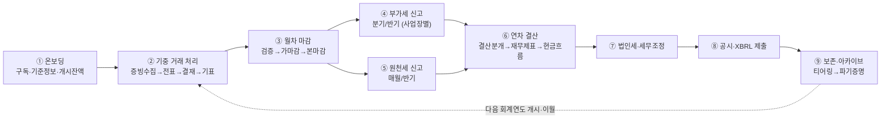
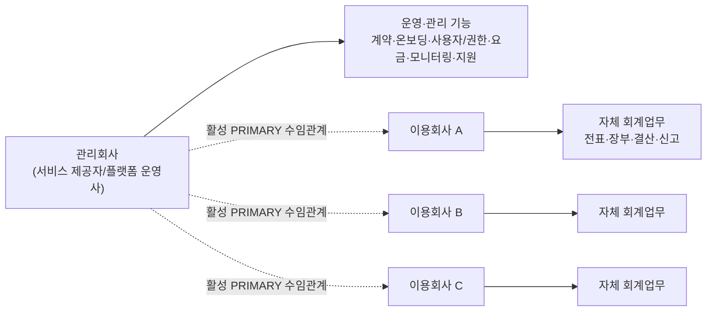
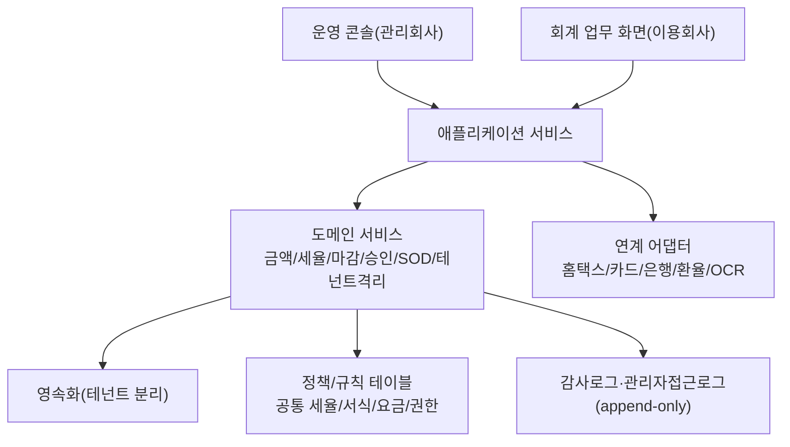
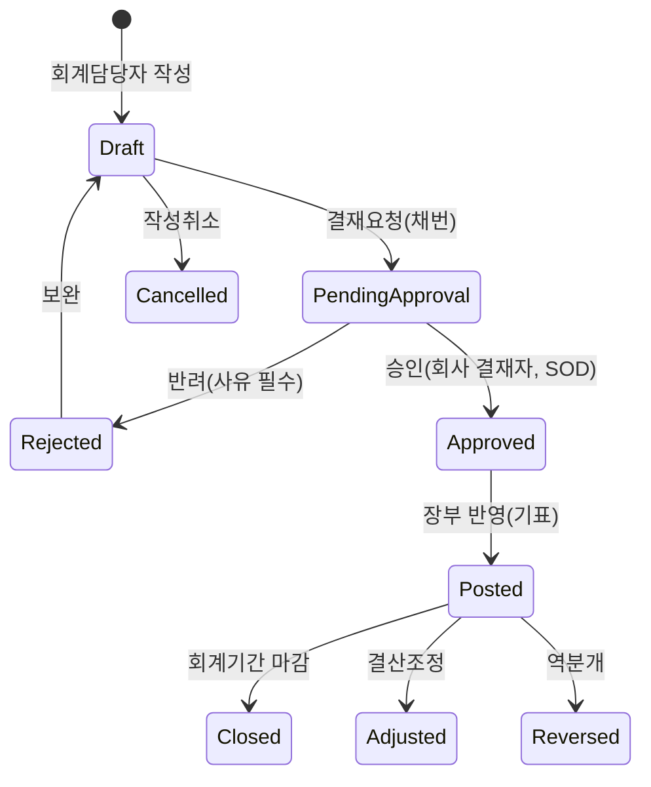
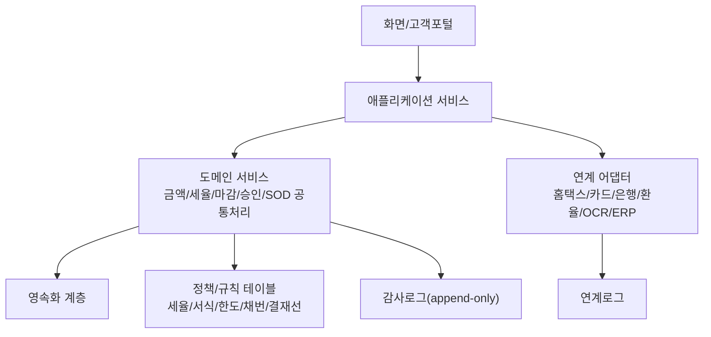
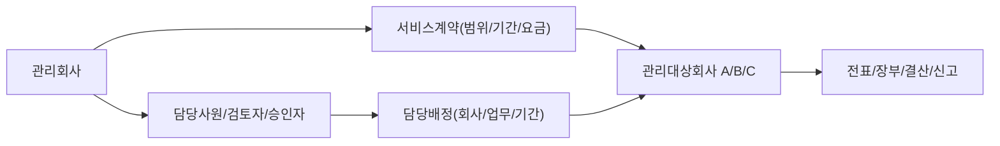
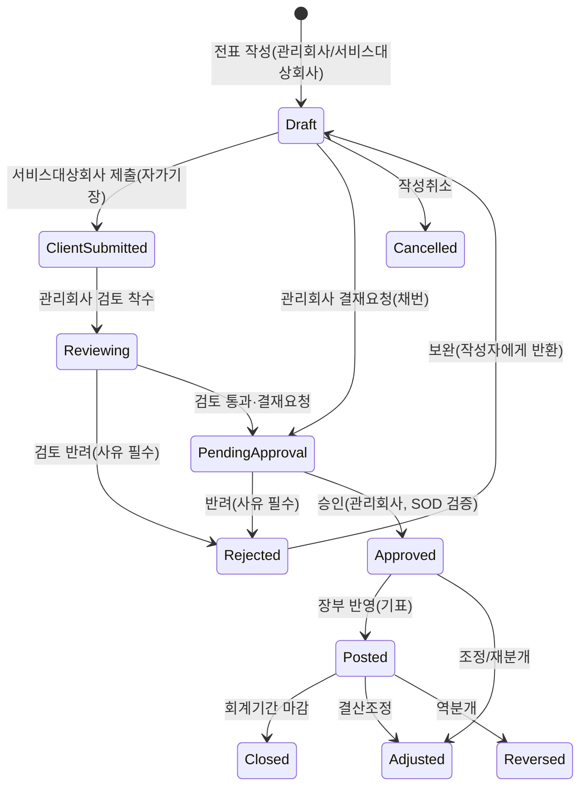
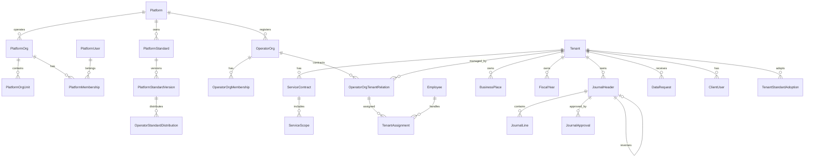

# BK 회계/세무 서비스 설계서 v1.1

- 기준 폴더: `D:\bk_kat`
- 작성일: 2026-07-02 (v1.0: 2026-06-30)
- 문서 버전: **v1.1**
- 3계층 운영모델 보강일: **2026-07-13**
- 플랫폼 조직·표준정보 중앙관리 보강일: **2026-07-13**
- 시스템관리자 사용자·그룹·메뉴권한 보강일: **2026-07-13**
- 메뉴·화면 계층형 ID 체계 개정일: **2026-07-13**
- 재구성 기준: 현재 폴더 자료와 본 문서에 통합된 부록 내용을 기준으로 단독 열람 가능하게 정리
- 작성 방식: 기존 누적 설계 결정을 신규 프로젝트의 **초기 설계 범위**로 일괄 채택하고, 현재 폴더의 요청사항·분석자료·회의자료·화면설계 파일을 기준으로 참조 구조를 재정리한다.
- 보존 원칙: Smart A 10 기능 준거 설계, 매입매출전표 상세 설계, 화면설계 통합 부록, 회의/검토 반영 내용은 외부 파일 의존 없이 본 문서 안에 포함한다.
- 통합 원칙(v1.1): 본문과 중복되는 부록 원문은 보존하지 않고 본문으로 단일화한다. 부록 중 본문이 규범적으로 준용(參用)하는 문서(운영 모델·기능 모듈 상세)만 유지한다.

## v1.1 개정 요약

v1.1은 v1.0(2026-06-30) 이후 현재 폴더의 전체 자료를 재검토·재분석하여 다음을 반영한 개정판이다.

| 구분 | v1.1 개정 내용 | 본 문서 대응 |
|---|---|---|
| 신규 화면 산출물 | 일반전표입력 구현 화면 12·13장 증보(2026-07-01) — 계정과목 관리(WJV-08, COA 3기준 병행)·외국 법인/계정 관리(WJV-09, 다중 GAAP) | 0.5, 11.6.2 |
| 신규 화면 산출물 | 운영 콘솔 화면설계 v1.0(OP-00~OP-11) 신규 반영, 기장 워크벤치 화면 ID `OP-12`→`OP-08` 정정 | 0.5, 26장 |
| 신규 메뉴 산출물 | 메뉴구조도 V1.0의 3채널에 플랫폼콘솔 `PF-00~06`을 추가한 **PF/OP/TN/CO 4채널 4단 구조** 반영 | 0.5, 26장 |
| 신규 요청사항 | `요청사항/일반전표입력메인화면, 관리항목입력.xlsx`(2026-07-01) 검토 요구사항 R1~R17 반영 | 0.6, 11.1.1 |
| 요청사항 정합 | `개발순차_1차.xlsx` 페이즈 01~10 × 차수(1/2/3차) 개발 순서, `개발요청메뉴_1차.xlsx` 신규 화면 2종(계정 구조설계·FS 매핑관리) 반영 | 0.6, 22장 |
| 중복 통합 | v1.0 부록 D·E·F·G·H·I·J·K·L을 삭제하고, 각 부록의 본문 미반영 고유 내용을 해당 본문 장에 병합 | 부록 A(통합 현황) |
| 정합성 정리 | 삭제 부록의 구버전 서술(입금/출금 별도 화면, `회사코드-YYYYMM` 채번, 물리 Delete 아카이빙 등)과 본문 확정안의 모순 제거 | 부록 A |
| 회의 반영(07-02 갱신) | 주간정기회의(2026-07-02, KAT-BK) 결정 10건 반영 — 전표 입력+COA MVP 최우선, 승인 워크플로우 회사별 옵션화, AR/AP Invoice 반제, STAT/TAX 연계, 주석/Disclosure 자동화, VAT 카드 분석, 비용 배부 | 0.7, 11.1-(7), 11.3.2, 11.6.2, 11.11, 22장, 23장 |
| 3계층 운영모델 보강(07-13) | **BK 플랫폼 → 복수 관리회사(`OperatorOrg`) → 복수 관리대상회사/테넌트(`Tenant`)** 관계를 전 업무에 적용. 플랫폼 관리자와 관리회사 관리자를 분리하고, 조직 소속·수임관계·담당배정·정책·과금·표준·볼트·감사·API·배치·화면의 조직 범위를 명시 | 결정 #19, 1.2, 2.2·2.6, 3~8장, 12~22장, 26장 |
| 플랫폼 조직·표준정보 중앙관리(07-13) | 플랫폼 자체의 사용자·내부조직·소속·직무분리·SSO/SCIM을 독립 도메인으로 추가. 회계·세무·권한·서식·코드 등 **전체 업무 표준정보의 원본 등록·개정·발행·폐기 권한을 플랫폼으로 단일화**하고, 관리회사는 원본 변경 없이 배포대상·일정·채택현황만 관리하도록 정정 | 1.2, 3~6장, 12~15장, 22장, 26장, 부록 B |
| 시스템관리자 화면 통합(07-13) | `설계/페이즈_화면/시스템관리자_화면_v1.0.HTML`의 사용자 목록/상세·보안/세션, 사용자그룹/구성원, 그룹별 메뉴권한(`INHERIT/ALLOW/DENY`), 메뉴 마스터 필드·버전·영향분석을 수용. 설계서의 3계층·플랫폼 표준 단일소유 원칙을 우선하여 메뉴 원본 CUD는 `PF-04-03-01`로 승격하고 OP/TN은 범위별 사용자·그룹·권한만 관리하도록 정합화 | 4.3, 5.7, 12~15장, 22장, 26.1·26.4·26.6 |
| 메뉴·화면 ID 표준화(07-13) | 채널을 `PF`(플랫폼)/`OP`(관리회사)/`TN`(테넌트)/`CO`(공통)로 고정하고, 2~4뎁스를 각각 2자리 숫자로 부여. 메뉴코드는 `CC-NN[-NN]`, 화면 ID는 `CC-NN-NN-NN` 형식으로 통일하고 `PF-01U`·`OP-06A` 같은 문자 접미형 구 ID는 `legacyScreenId`로 전환 | 4.3, 12.3, 26.1·26.5·26.6 |

## 문서 기준

본 문서는 기존 누적본을 단순 복사한 개정 이력 문서가 아니라, `D:\bk_kat` 작업 폴더를 기준으로 BK 회계/세무 SaaS를 처음 설계하는 문서로 재구성한 문서이며, v1.1은 그 위에 2026-07-01~02 신규 자료 분석과 중복 통합 결과를 반영한 판이다. 과거 이력성 표기는 설계 근거와 반영 범위를 설명하기 위한 정보로만 취급하며, 실제 구현 기준은 본 문서 v1.1의 전체 범위이다.

초기 설계에는 다음 범위를 한 번에 포함한다.

| 구분 | v1.1 초기 포함 범위 |
|---|---|
| 서비스 운영 모델 | **플랫폼 내부조직/사용자 + 복수 관리회사 + 관리대상회사 3계층 분리**, 멀티테넌시, 구독·요금, 데이터 수명주기, 운영자 접근 거버넌스 |
| 인증·권한·보안 | 계정 보안, MFA/SSO, 3계층 사용자관리, 사용자그룹·구성원, 그룹별 메뉴권한, 메뉴목록·버전, RBAC+속성 제약, 위임관리, SOD, 감사로그, DLP, 침해 대응 |
| 회계/세무 코어 | 전표, 장부, 결산, 부가세, 세무, 고정자산, 자금·채권채무, 증빙, 전자문서 |
| 기장 운영 | `OPERATOR_LED`, `TENANT_LED`, `HYBRID` 기장 모드, 주기장, 기장 워크벤치, 고객 확인(Ack) |
| 실무 산출물 | 월별 결산 보고패키지, 계정별 명세서, tie-out, 외화/관계사/그룹보고, 제조원가·재고 |
| Smart A 준거 | WEHAGO Smart A 10 회계관리 20개 Chapter·182개 메뉴를 BK 기능 화면으로 재설계 |
| 구현 화면 | 기초/기준정보, 일반전표, 매입매출전표, 보조부, 관리항목, 자금관리, 운영 콘솔 화면 설계 |
| 개발/전환 | 구현 우선순위, 개발 차수(페이즈 01~10 × 1/2/3차), 마이그레이션, 기장 이관 온보딩, 산출물 연결 계획 |

## 현재 폴더 기준 참조 자료

| 영역 | 현재 폴더 기준 파일/폴더 | 반영 내용 |
|---|---|---|
| 요청사항 | `요청사항/SmartA 10_회계관리매뉴얼.pdf` | Smart A 10 회계관리 메뉴·화면·기능 준거 |
| 요청사항 | `요청사항/260617_BK_전표_설계서_v1_검토.xlsx`, `요청사항/_dump.json`(검토 코멘트 덤프) | 전표 화면 및 검토 의견 기준(0.2 S1~S14) |
| 요청사항 | `요청사항/일반전표입력메인화면, 관리항목입력.xlsx` (2026-07-01, v1.1 신규) | 일반전표입력·관리항목 입력 검토 요구사항 R1~R17 (0.6, 11.1.1) |
| 요청사항 | `요청사항/개발요청메뉴_1차.xlsx`, `요청사항/개발순차_1차.xlsx` | 개발 대상 메뉴·신규 화면 2종·페이즈/차수 기준 (0.6, 22장) |
| 회의자료 | `회의자료/주간정기회의_20260618.md` | M1~M13 검토 의견 반영 (0.3) |
| 회의자료 | `회의자료/주간정기회의_20260702.md` (v1.1 갱신 반영) | KAT-BK 회의 결정 10건·논의 N1~N13 반영 (0.7, 11.1-(7), 11.3.2, 11.6.2, 11.11) |
| 분석자료 | `분석자료/SmartA분석/*.md`, `분석자료/SmartA10분석/*.md` | Smart A/Smart A 10 메뉴 분석 (25장) |
| 분석자료 | `분석자료/위하고_전표입력/*.md` | 위하고 일반전표·매입매출전표 입력 분석 |
| 분석자료 | `분석자료/BK보고서/**` | 실무 보고서·결산 산출물 역분석 (0.1, 11.13~11.21) |
| 화면설계 | `설계/화면설계/bk_화면설계서_v1.0.html` | 기초·기준정보 및 통합 화면설계 기준 |
| 화면설계 | `설계/화면설계/구현_화면_전표_v1.0.html` (2026-07-01 증보: 12·13장 추가) | 일반전표·보조부·계정과목(COA)·외국법인 구현 화면 기준 (0.5, 11.6.2, 부록 통합본) |
| 화면설계 | `설계/화면설계/구현_매입매출_전표_v1.0.html` | 매입매출전표 입력 화면 기준 (25.4.2) |
| 화면설계 | `설계/화면설계/운영콘솔_화면_v1.0.html` (2026-07-01, v1.1 신규) | 운영 콘솔 OP-00~OP-11 화면 기준 (26장) |
| 화면설계 | `설계/화면설계/메뉴구조도_V1.0.HTML`, `설계/화면설계/메뉴구조.html` (v1.1 신규) | 원본 3채널 + 본문 PF 플랫폼콘솔 확장, SA 182 화면의 canonical/legacy ID 매핑 기준 (26장) |
| 화면설계 | `설계/페이즈_화면/시스템관리자_화면_v1.0.HTML` (2026-07-10) | 사용자관리·사용자그룹관리·그룹별 메뉴권한·메뉴 마스터 목록/상세 화면의 필드·동작·검증을 본 설계서 기준으로 재해석하여 반영(4.3, 26.6) |
| 참고자료 | `참고자료/메뉴구조도_v0.1.html` | 구버전 메뉴구조(참고용, V1.0으로 대체됨) |

## 참조 정리 원칙

본 문서에서 실행·열람이 필요한 외부 자료는 모두 `D:\bk_kat` 하위 경로만 사용한다. 과거 통합 과정의 파일명은 독립 파일 참조가 아니라 부록의 통합 문서명으로만 남기며, 구현 기준 파일은 위의 "현재 폴더 기준 참조 자료" 표를 따른다. v1.0 부록 중 삭제·병합된 문서의 원문이 필요하면 `bk_설계서_v1.0.md`를 참조한다(부록 A 통합 현황표 참조).

## 설계 구성

1. 0장은 설계 원칙과 결정 매트릭스를 정의한다(0.5·0.6은 v1.1 신규 반영 매트릭스).
2. 1~10장은 SaaS 운영, 멀티테넌시, 인증, 권한, 표준 카탈로그, 차원 엔진을 정의한다.
3. 11장은 전표·장부·결산·세무·자금·보고 산출물을 업무 흐름 중심으로 정의한다(11.1.1·11.6.2는 v1.1 신규).
4. 12~20장은 데이터 모델, API, 배치, 검증, 보안, 알림, 인프라 운영을 정의한다.
5. 21~24장은 기장 방식, 구현 우선순위, 잔여 확인사항, 산출물 연결 계획을 정의한다.
6. 25장은 Smart A 10 회계관리 182개 메뉴를 BK 기능 화면으로 재설계한다.
7. 26장은 메뉴구조도 V1.0과 운영 콘솔 화면 체계를 정의한다(v1.1 신규).
8. 부록은 본문이 준용하는 기반 문서(운영 모델·기능 모듈 상세)와 일반전표입력 구현 화면 통합본을 보존한다.

---

## 0. 확정 원칙 및 결정 매트릭스

"최대 기능 구현" 원칙: 옵션이 존재하는 항목은 **가장 풍부한 기능 + 가장 강한 통제**를 동시에 채택한다. 즉, 강력한 기능(긴급 대행, 위임관리, SSO, 전용 격리 등)을 제공하되, 그에 상응하는 승인·로그·통지·시간제한 통제를 함께 구현한다.

| # | 기본설계서 확인 항목 | 확정(최대 기능) | 상세 |
|---|---|---|---|
| 1 | 운영자의 이용회사 데이터 접근 범위·사유·통지 | 조회/지원세션/긴급변경 **3단계 접근모드 + 시간제한 + 사유 + 실시간 통지 + 승인** 전부 구현 | 5장 |
| 2 | 이용회사 관리자 위임 범위 | **완전 위임 관리(사용자/커스텀롤/권한/결재선/차원)** + 관리회사 정책 상한(가드레일) | 4장 |
| 3 | 회계 실무 긴급 대행 허용 | **허용(옵트인 + 이중통제 + 회사 동의 + 시간제한 + 전수 로그)** 으로 구현 | 5.4 |
| 4 | 공통 표준 배포·버전·강제 적용 | **버전 카탈로그 + 강제/권고/선택 3모드 + 자동적용 + 차이미리보기 + 롤백 + 회사 확장** | 6장 |
| 5 | 구독·상태 전환 시 데이터 정책 | **전체 구독 수명주기 + 그레이스 + 내보내기 + 보존 후 파기증명 + 재활성화** | 7장 |
| 6 | 외부 연계 인증정보 보관·보안 | **테넌트별 시크릿 볼트(KMS) + 토큰/인증서 관리 + 자동 회전 + 연결 상태 모니터링** | 8장 |
| 7 | 2FA 강제·인증 파라미터 | **운영자 필수 + 이용회사 기본 필수 + 다중 수단(TOTP/SMS/Email/Passkey/WebAuthn) + SSO(SAML/OIDC) + 적응형/Step-up** | 3장 |
| 8 | 멀티테넌시 격리·성능·백업 | **하이브리드 격리(공유+전용 선택) + RLS + 테넌트별 키/백업/PITR + 파티셔닝/캐시** | 2장 |
| 9 | 관리차원(사업장·코스트센터·부서) 정책 | **범용 차원 엔진(사업장/코스트센터/부서/프로젝트/현장/사원) + 조직관리 + 회사별 사용·필수·범위 + 조합규칙 + 기본값 + 예산** | 9장 |
| 10 | 차원 설정 변경 영향 | **유효일자 버전관리 + 변경영향분석 + 과거전표 일괄배정 도구 + 보고 정합성** | 10장 |
| 11 | 다중 회계기준·외부 데이터 변환 입력 | **K-GAAP/K-IFRS/US GAAP/IFRS/기타국 다중 지원 + 병행원장 + 외부데이터 수신·매핑·기준변환·검토·반영 파이프라인** | 11.6장 |
| 12 | 외부 데이터 수신 포맷·소스 시스템 범위 | **Excel/CSV/XML/XBRL/API 수신 + 원천키 멱등 + 스테이징 + 어댑터 ETL + 회사 검토 후 반영** | 8.4, 11.6장 |
| 13 | 회계기준 간 차이조정 적용 범위·승인 절차 | **기준쌍별 변환규칙 버전관리 + GAAP 차이 조정분개 + 검토/승인 워크플로우 + 변환 전후 감사** | 11.6장 |
| 14 | 현금흐름표 생성 방식·현금성자산 정의·활동 분류 | **직접법/간접법 선택 + 현금성자산 계정 정의 + 활동 매핑 + 통제된 조정 워크플로우** | 11.3.1장 |
| 15 | 공시자료 범위·XBRL taxonomy·제출 채널 | **재무제표/주석/XBRL 생성 + taxonomy 버전 배포 + 검증 + 제출상태/파일해시 감사** | 11.3.2장 |
| 16 | AI 이상거래 탐지 도입 범위·통제 | **규칙+통계+비지도 ML 3계층 하이브리드 + 설명가능(SHAP/reason code) + 휴먼인더루프(자동수정 금지) + 테넌트 격리·PII 가명화** | 11.7장 |
| 17 | AI 조회 챗봇(자연어 조회) 도입 범위·통제 | **Tool-calling 에이전트 + 제한적 Text-to-SQL + RAG 보조 + 읽기 전용 + 테넌트/권한 서버 강제 + 조회 감사** | 11.8장 |
| 18 | 기장 수행 주체 선택 | **기장 모드 3종(관리회사 주도/이용회사 주도/병행) + 주기장이 마감·결산·신고 수행 + 양측 동의 전환 + 상시 기장 접근모드(BOOKKEEPING) + 이용회사 확인(Ack)** | 21장(상세), 1장, 4.5, 5.2.1 |
| 19 | 복수 관리회사 운영·격리 | **BK 플랫폼 → 관리회사 → 관리대상회사 3계층 + 플랫폼/관리회사/테넌트 관리자 분리 + 관리회사별 제어영역 격리 + 1개 테넌트의 활성 주관리회사 1개 + 수임 이관 이력 보존** | 1.2, 2.6, 5.5, 12.4, 13장, 26장 |

> 기반 상세설계서 24장(회계기준·신고서식·연계규격 등)의 회계·세무 확인 항목도 **최대 범위 전제**로 정리한다. 단, US GAAP/IFRS/기타국 기준, XBRL 공시, 외부 데이터 변환 입력은 구현 복잡도와 검증 책임이 크므로 11.6장의 기능 플래그·요금제 제한·단계적 적용 원칙을 따른다.

### 0.1 v4.0 확장 매트릭스 (실무 산출물 역분석 통합)

v4.0은 실제 위탁기장(`OPERATOR_LED`) 산출물 6종을 역분석하고(근거 산출물 목록은 본 절 하단 표), 추가 검토 결과 Hibetter 산출물에서 드러난 **제조업 원가·재고·매입원장 세무상태**를 더해 **결과물·협업·품질 계층**을 총 16개 보강 항목으로 확장한다. 모든 항목은 멀티테넌시 격리(2장)·권한/SOD(4장)·기장모드(21장)·감사로그(17장)를 공통 기반으로 한다.

| # | 보강 항목 | 성격 | 본 문서 대응 | 우선순위 |
|---|---|---|---|---|
| A | 월별 결산·보고 패키지(Reporting Package) 생성·검증·전달 | 신설 | 11.13 | ★★★ |
| B | 계정별 명세서·잔액 소명(BS Reconciliation Schedule)·자동 tie-out | 신설 | 11.14 | ★★★ |
| C | 경과·충당·리스(IFRS16) 기간배분 스케줄 자동화 | 신설+보강 | 11.15, 11.3 | ★★★ |
| D | 외화 운영회계 — 월말 환산·실현/미실현 외환손익·환율 마스터 | 신설+보강 | 11.16, 11.6.1 | ★★★ |
| E | 관계사(Intercompany) 거래 식별·대사·연결제거 기초 | 신설 | 11.17 | ★★ |
| F | Cost-plus(원가가산) 수익 인식 + Invoice vs PL 차이분석 | 신설 | 11.18 | ★★ |
| G | 예산 대비 실적(Budget vs Actual)·부서/코스트센터 관리회계 | 신설+보강 | 11.19, 9장 | ★★ |
| H | 그룹/모회사 연결보고 Export(HFM·Weblink, 계정매핑·조정·YTD) | 신설 | 11.20 | ★★ |
| I | 다국어(국/영) 계정과목·보고서 출력(L10N) | 보강 | 6.1, 11.13 | ★★ |
| J | 고객 협업: 질의·확인·미결항목(Open Items/Query) 관리 | 신설 | 18.3, 21.4 | ★★ |
| K | 은행거래 분류·증빙매칭·주간 자금마감(Weekly Cash) 강화 | 보강 | 11.11 | ★ |
| L | 월별 법인세 추정·충당(Current Tax Provision)·선납세금 | 보강 | 11.5 | ★ |
| M | 자본거래·주주변동 명세(증자/감자/주식이전) | 보강 | 11.3 | ★ |
| N | 기장 이관(전임 기장처 데이터 인수) 온보딩 | 보강 | 22장 | ★ |
| O | 제조업 원가·재고·제조원가명세(CM) 산출 | 신설+보강 | 11.21, 11.13 | ★★ |
| P | 매입원장 세무구분·국세청 전송상태·증빙상태 리포트 | 보강 | 11.4, 11.13 | ★★ |

> 위 항목은 결정 #18(기장 수행 주체)의 `OPERATOR_LED` 산출물 정의를 구체화한다. 특히 A·B·J가 "관리회사 주도 기장의 결과물·협업·품질" 축을 형성한다.

**근거 실무 산출물 인벤토리** (v1.0 부록 E에서 본문 병합) — 아래 7종 산출물이 보강 항목 A~P의 역분석 근거이며, 각 11.13~11.21절의 "실무 근거" 인용은 이 표를 앵커로 한다. 6건 중 5건이 **외투법인(외국계 한국법인) 위탁기장** 산출물이라는 점이 공통 발견이다.

| # | 산출물(현재 폴더 경로) | 회사/업종 | 산출물 성격 | 주요 시사점 |
|---|---|---|---|---|
| 1 | `분석자료/BK보고서/EY Kummyung Reporting Package for 2026.05_Pending.xlsx` | 금명(서비스) | 월별 결산 보고패키지(국/영 병기) | A(보고패키지)·B(명세서)·I(다국어)·J(Pending 미결항목) |
| 2 | `분석자료/BK보고서/EDPR/EDPR_February 2026 Monthly Closing/**` (TB·BS·PL·GL·Non trade payables·CF) | EDPR(신재생에너지, 외투) | 월 마감 패키지 6종 세트 | A·B·D(외화)·E(관계사)·현금흐름표 |
| 3 | `분석자료/BK보고서/Variance analysis between invoice revenue and Qatar PL (Jan–Apr 2026).xlsx` | (건설/용역, 외투) | Invoice vs PL 차이분석 | F(Cost-plus·차이분석) |
| 4 | `분석자료/BK보고서/법인세,서비스로 계산.xls` | (서비스) | 월별 법인세 추정·선납세금 | L(Tax Provision) |
| 5 | `분석자료/BK보고서/(Hibetter) 26 Feb_FS.xlsx` | Hibetter(제조) | 제조원가명세 포함 FS | O(제조원가·재고)·P(매입원장 세무상태) |
| 6 | `분석자료/BK보고서/inteva/**` (Weblink import·Department Expense·GL) | Inteva(자동차부품, 외투) | 그룹 연결보고 Export·부서비용 | H(Weblink/HFM)·G(부서 관리회계) |
| 7 | `분석자료/BK보고서/4) IP Korea Balance Sheet Schedules_May 2026.xlsx` | IP Korea(외투) | BS 계정별 명세·잔액 소명 | B(Reconciliation Schedule·tie-out)·C(기간배분)·M(자본거래) |

### 0.2 v4.1 화면설계 반영 매트릭스 (구현 화면 역반영)

Phase 1 구현 화면설계(`설계/화면설계/bk_화면설계서_v1.0.html`·`설계/화면설계/구현_화면_전표_v1.0.html`)를 작성하며 확정·검토한 설계 결정을 본 상세설계서에 역반영한다. 특히 전표 화면은 검토의견(현업 리뷰)을 반영한 v1.1을 기준으로 한다.

| # | 반영 결정 | 출처 화면 | 본 문서 대응 | 상태 |
|---|---|---|---|---|
| S1 | **입금/출금 전표 메뉴 폐지·일반전표입력 통합** — 별도 입금/출금 메뉴를 두지 않고, 현금(고정값) 라인 위치로 입금(차변)/출금(대변)을 자동 판별 | JV-01~03 | 11.1 | 반영 |
| S2 | **더존식 전표번호** — 전표일자 단위로 매일 001부터 리셋되는 일련번호. 유형코드·연월·한글유형을 번호에 넣지 않고, 대체·입금·출금·매입·매출 구분은 「구분」 컬럼으로 표시. 외부 참조 표기 `YYYY-MM-DD-NNN` | JV-01·검색·보조부 | 11.1, 12.2 | 반영 |
| S3 | **전표 복합키** — `journal_header` PK = (`tenant_id`, `전표일자`, `전표번호`). 번호가 일자별 리셋되므로 전표일자가 키에 포함. 라인·증빙·보조부 FK와 파티셔닝(`tenant_id`+`전표일자`)에 반영. 입력 화면에 전표일자·전표번호 동시 표시(채번 전 「예정」) | JV-01 §2.2 | 11.1, 12.3 | 반영 |
| S4 | **부가세 자동라인 생성 조건** — 부가세구분만으로 자동 생성하지 않고, 부가세대급금/예수금 **계정코드 입력**(또는 매입/매출 전표 세금계산서 영역) 시에만 생성. 일반전표입력은 부가세 자동라인 기능 비대상 | JV-01·04·05 | 11.1, 11.4 | 반영 |
| S5 | **차원 기본 필수/선택** — 사업장만 기본 필수, 코스트센터·프로젝트·현장은 기본 선택. 회사별 `DimensionConfig.required`로 강화 가능 | JV-01, BF-09 | 9.3, 9.5 | 반영 |
| S6 | **현금 간편입력 범위** — 간편입력 고정값은 현금만 허용. 보통예금 입출금·카드출금·어음회수는 대체전표(JV-01)로 안내·전환. 현금 상대계정에 채권/채무·선수선급 계정 선택 시 간편입력 차단 후 대체전표 전환 | JV-01~03 | 11.1 | 반영 |
| S7 | **상대계정 직접 입력·일괄 변경** — 상대계정을 후보 N개 중 선택이 아닌 계정코드 직접 입력(F3) + 선택 분개 상대계정 일괄 변경 | JV-02·03 | 11.1 | 보완 |
| S8 | **거래처 마스터 검증** — 사업자등록번호 형식·휴폐업 여부 검증. 외부 기장자료 대량 업로드·매핑·전체 미리보기(다건/일괄 입력) | JV-07·08, BF | 11.1, 11.4 | 보완 |
| S9 | **전표 입력 UX** — JV-01을 일자별 마스터-디테일로 재구성(진입 시 당일 전표 목록 자동 조회 → 「＋ 전표 추가」/행 선택 → 분개 입력 → 「저장 후 계속 입력」). 더존/위하고식 일계 입력 | JV-01 | 11.1 | 반영 |
| S10 | **거래처 보조부 보강** — 외화/발생환율·거래성격(신규채권·일부회수·청구반제·대손조정·선수선급대체)·전표 연계 표시, 조회조건 세분화(잔액만/연체만/미반제만) | AUX-01 | 11.11 | 보완 |
| S11 | **어음 추적 타임라인** — 원전표→증빙→상태변경이력→부도/결제 후속전표 단일 추적 체인 | AUX-02 | 11.11, 11.12 | 보완 |
| S12 | **예금/카드/가지급금/부가세 보조부 목적 명확화** — 예금=계좌 단위 은행거래 대사·자금일정(거래처원장과 역할 구분), 카드=수신내역 매칭→전표 자동생성 후보·매입원장 연계, 가지급금=세무조정 인정이자 연동 특수 뷰, 부가세=세금계산서 합계·세무구분 집계(위하고 스타일) | AUX-03~06 | 11.4, 11.5, 11.11 | 검토 |
| S13 | **재고 수불부 Phase 2 이관** — 재고자산 수불부(AUX-08)는 2차 개발로 이관 | AUX-08 | 11.21, 22장 | 연기 |
| S14 | **기초 화면 인벤토리 정합** — 운영 콘솔·테넌트·기장설정·사용자/인증/권한·표준/차원/구독/알림·메뉴 마스터(MenuVersion 발행/롤백)·이용회사 선택(테넌트 스위처) 화면 정의 | BF-00~12 | 2·3·4·5·6·7·9·18·21장 | 반영 |

**화면 ID 인벤토리** — 구현 화면설계의 화면 ID와 본 문서/상위 화면설계서(TN/OP)의 매핑:

| 구분 | 화면 ID | 화면명 | 본 문서 연계 |
|---|---|---|---|
| 기초(BF) | BF-00 | 이용회사 선택(테넌트 스위처) | 2.2 |
| 기초(BF) | BF-01 | 현재 관리회사(OperatorOrg) 조직·Membership·담당 테넌트·IP 허용목록 | 5장 |
| 기초(BF) | BF-02 | 테넌트 목록·인프라·쿼터·스냅샷·비동기 잡 | 2장, 7장 |
| 기초(BF) | BF-03 | 기장 설정·전환 요청 워크플로우 | 21장 |
| 기초(BF) | BF-04 | 사용자·계정상태·인증수단(MFA/패스키)·SSO·세션·로그인 이력 | 3장 |
| 기초(BF) | BF-05 | 인증 정책 편집(범위 전환) | 3.2 |
| 기초(BF) | BF-06 | 접근 세션 로그·긴급대행 동의/요청 | 5장 |
| 기초(BF) | BF-07 | 역할·역할 부여·가드레일·예외·결재선·외부 파트너·기장 배정 | 4장 |
| 기초(BF) | BF-08 | 표준 카탈로그·버전·항목·테넌트 채택/확장 | 6장 |
| 기초(BF) | BF-09 | 차원·조직관리 — 사업장·코스트센터·부서·프로젝트·현장·사원·사용정책(DimensionConfig) | 9장 |
| 기초(BF) | BF-10 | 구독 상세·사용량·청구/결제 | 7장 |
| 기초(BF) | BF-11 | 알림 — 수신 매트릭스·템플릿·D-N 스케줄·웹훅 | 18장 |
| 기초(BF) | BF-12 | 메뉴 마스터(MenuVersion 발행/롤백)·메뉴·권한 관리 | 4.3 |
| 전표(JV) | JV-01 | 일반전표입력(입금/출금 통합, 일자별 마스터-디테일) | 11.1 |
| 전표(JV) | JV-02·03 | (동작 설명용) 입금/출금 간편입력 모드 | 11.1 |
| 전표(JV) | JV-04·05 | 매입·매출 전표(세금계산서 영역·자동 분개) | 11.4 |
| 전표(JV) | JV-06 | 전표 도구(복사/반복/템플릿/역분개) | 11.1 |
| 전표(JV) | JV-07 | 전표 검색 목록 | 11.1 |
| 전표(JV) | JV-08 | 다건/일괄 전표 입력(외부자료 매핑·대량 업로드) | 11.1 |
| 보조부(AUX) | AUX-01 | 거래처별 보조원장(매출처/매입처) | 11.11 |
| 보조부(AUX) | AUX-02 | 어음 보조원장(받을/지급)·추적 타임라인 | 11.11 |
| 보조부(AUX) | AUX-03 | 예금 보조원장(계좌별 입출·대사) | 11.11 |
| 보조부(AUX) | AUX-04 | 카드 보조원장(사용·결제·전표 자동생성 후보) | 11.4 |
| 보조부(AUX) | AUX-05 | 가지급금·가수금 보조원장(인정이자 연동) | 11.5 |
| 보조부(AUX) | AUX-06 | 부가세 보조원장(매입/매출 세액 집계) | 11.4 |
| 보조부(AUX) | AUX-07 | 현금출납장 | 11.11 |
| 보조부(AUX) | AUX-08 | 재고 수불부 (Phase 2 이관) | 11.21 |
| 보조부(AUX) | AUX-09 | 고정자산대장(기초) | 11.5 |

> 상위 화면설계서 매핑: JV(전표)=TN-05, AUX·장부=TN-07, 증빙=TN-08, 마감=TN-09(구 화면 ID — 메뉴 코드와의 구분은 26.5). `OPERATOR_LED` 회사의 기장 담당자는 **OP-08 기장 워크벤치**(v1.1 정정, 구 표기 OP-12)에서 `BOOKKEEPING` 컨텍스트로 동일 화면을 사용한다(5.2.1, 21.5, 26장).
>
> **Smart A 기준 화면 인벤토리(`SA-*`) 연계**: 위 BF/JV/AUX 인벤토리는 SaaS 운영·플랫폼 관점의 화면군이며, Smart A 회계 실무 기능 관점의 전체 화면(182종, `SA-BAS`/`SA-OPN`/`SA-JNL`/`SA-ATX`/`SA-LDG`/`SA-CLS`/`SA-VAT`/`SA-FA`/`SA-FND`/`SA-DEP`/`SA-BIL`/`SA-DAT`)은 **25장 「Smart A 기준 화면 설계」** 에서 구성 목적·입력 필드·기능·산출물·연계 5요소로 재설계한다. 두 체계의 매핑과 충돌 조정(BK 코어 우선) 정책은 **25.0절**(화면 인벤토리·충돌 조정 정책표 C1~C10)을 참조한다. 전표 입력 동작·관리차원·결산분개 구분·거래처 3탭·세목 계층 등 기존 설계와 충돌하는 항목은 BK 코어 원칙을 권위 기준으로 두고 Smart A 기능을 BK 모델로 변환·흡수한다.

### 0.3 주간정기회의(2026-06-18) 반영 매트릭스

`회의자료/주간정기회의_20260618.md`의 검토의견(더존·위하고 실무 비교, 특수 회계 처리 요구)을 13개 항목으로 정리하여 본 문서에 반영한다.

| # | 반영 항목 | 회의 근거(요지) | 본 문서 대응 | 단계 |
|---|---|---|---|---|
| M1 | **사원(EMPLOYEE) 차원 추가** — 관리코드로 현장별·사원별·부서별 원가/손익 집계 | "관리코드 입력으로 현장·사원·부서별 원가/손익·안분 집계", "사원 등록" 기초정보 | 9.1·9.3·9.5·9.6, 12.1 | Phase 1 |
| M2 | **결차/결대(결산차변·결산대변) 전표 구분** — 결차/결대로 입력해야 손익계산서·제조원가명세서에 원가 반영 | "차변·대변·입금·출금·결차·결대 6가지 코드" | 11.1, 11.21, 12.2 | Phase 1 |
| M3 | **원가 안분(按分·배부) 집계** — 공통원가를 차원(코스트센터/부서/현장/사원/프로젝트)으로 배부 | "현장·사원·부서별 원가집계 및 안분 집계" | 9.4, 11.21 | Phase 2~3(원가) |
| M4 | **금액/수량 소수점 자릿수 환경설정** — 회사별 세팅 | 기초정보 "소수점 관리" | 11.1, 9.6(BF-09 환경설정) | Phase 1 |
| M5 | **어음 할인율·할인료 처리** — 어음 할인 시 할인료·매출채권처분손실 자동 분개, 자동 계정 매칭 | "어음 할인율 적용, 자동 계정과목 매칭" | 11.11(AUX-02) | Phase 1~2 |
| M6 | **카드 매입세액 공제/환급 판정** — 업종별 공제 가능 계정 분류·환급액 산출 | "카드 환급 금액 산출, 업종별 환급 가능 계정 분류, 파투아 분석" | 11.4(AUX-04) | Phase 2 |
| M7 | **결산 재무제표 미리보기·조정 전후 비교** — 회사별 매핑규칙 | "결산 재무제표 미리보기, 조정분개 전후 화면 비교, 회사별 매핑 규칙" | 11.3, 11.13 | Phase 2 |
| M8 | **근거자료 첨부·계산시트(Worksheet) 자동생성·주석 업데이트** | "감사보고서 주석·원장·숫자자료 근거 첨부, 계산 시트 자동 생성" | 11.13, 11.14 | Phase 2~3 |
| M9 | **외화 채권/채무 표시 보강** — 외화·발생환율·신규/일부회수/반제 구분·송금수수료 처리 | "외화 금액·환율, 신규/기존 채권, 일부 회수, 송금수수료 처리" | 11.11(AUX-01), 11.16 | Phase 1~2 |
| M10 | **보조부 조회조건 세분화** — 잔액만/연체만/미반제만 | "선수금·미반제·연체 등 조회 조건 세분화" | 11.11(AUX-01) | Phase 1 |
| M11 | **부가세 보조부 프로젝트·부서 차원 분류** — 매출 과세유형별 분류·인보이스 증빙 첨부 | "부가세 보조부 프로젝트별·부서별 구분, 매출 과세유형별 분류" | 11.4(AUX-06) | Phase 1~2 |
| M12 | **대상고객·단계별 개발 로드맵 명문화** — ERP 미보유 회사 주대상, 1차 보고서 도출→2차 자동분개→3차 AI | "ERP 없는 수기장부 회사 주대상", "1차 자동전표 없이 보고서→2차 자동분개→3차 AI" | 1장 | 배경 |
| M13 | **페이롤·무역·감사대응 풀스코프는 향후 범위로 명기** | "감사 대응·무역·페이롤 풀스코프 서비스 사례" | 1장(범위) | 향후 |

> M1·M2·M11은 설계 영향이 커 Phase 1에 우선 반영하고, M3·M6·M7·M8 등 원가/결산 자동화는 단계(Phase 2~3) 표기와 함께 정의한다. M9·M10은 기존 0.2절 S10(거래처 보조부)을 확장한다.

### 0.4 매입매출전표 화면설계 반영 매트릭스

매입매출전표입력 구현 화면설계(`설계/화면설계/구현_매입매출_전표_v1.0.html`, WPV-01/SA-JNL-02)의 설계 결정을 본 상세설계서 **25.4.2절**에 업무흐름(①기간·유형 조회→②상단 세무헤더→③부가세 자동라인→④하단 분개라인→⑤검증·저장) 순서로 전수 통합한다. 매입매출전표는 일반전표(`SA-JNL-01`/`JV-01`)와 달리 **상단부 세무헤더(세무 신고자료)+하단부 분개라인(재무회계자료)의 2계층 구조**를 갖는 점이 핵심 차이다.

| # | 반영 결정 | 출처 화면 | 본 문서 대응 | 상태 |
|---|---|---|---|---|
| P1 | **2계층 구조** — 상단부 세무헤더(과세유형·공급가액·세액·거래처·전자발행)는 부가세신고서·세금계산서합계표·매입매출장 등 세무 신고자료로, 하단부 분개라인은 분개장·원장·재무제표 등 재무회계자료로 각각 흐른다. 두 계층은 동일 전표 안에서 자동 연동 | WPV-01 §2 | 25.4.2.0 | 반영 |
| P2 | **과세유형 단일 진실원** — 매출 11~25(빨강)·매입 51~64(파랑)을 `tax_type_master`로 단일 관리. 신고서 라인·자동분개·전자발행 가능 여부·증빙요건이 모두 과세유형에서 파생 | WPV-01 §4 | 25.4.2.2 | 반영 |
| P3 | **부가세 자동라인 생성 조건** — 세액 있는 과세유형 입력 시에만 부가세 라인 자동 생성(영세·면세·불공 미생성). 매출=대변 부가세예수금, 매입=차변 부가세대급금. 채권/채무 라인은 공급대가(공급가액+세액) | WPV-01 §3·§6 | 25.4.2.3 | 반영 |
| P4 | **분기 3종** — ①과세유형 자체, ②계정 기반(51·57·61+고정자산→고정자산매입), ③적요 기반(53/58/60/62+원재료+특수적요→의제매입·재활용폐자원) | WPV-01 §4.3 | 25.4.2.2 | 반영 |
| P5 | **분개유형 0~7·자동분개 엔진** — 0.분개없음/1.현금/2.외상(계정수정불가)/3.혼합/4.카드/5~7.외상추가. 매출(매출/매출채권)·매입(매입/매입채무)·카드(카드채권/채무) 기본계정 자동 매칭 | WPV-01 §6 | 25.4.2.4 | 반영 |
| P6 | **전자세금계산서 비고=발행정보** — 발행 모달 최상단 입력→본문 읽기전용 연동, 신고·분개 비반영(`etax_issue.remark`). 승인번호는 발행 시 국세청 자동 채번. 발행대상 매출 11·12·13/매입 역발행 51~54 | WPV-01 §7 | 25.4.2.6 | 반영 |
| P7 | **매입매출전표 채번 분리** — source 구분으로 50001~99999 채번(일반전표 1~50000과 분리). 복합키 (tenant_id, fiscal_year, journal_date, journal_no) | WPV-01 §3·§11 | 25.4.2.0, 25.4.2.4 | 반영 |
| P8 | **더보기 22항목·복수거래** — 액션바·툴바·조건검색·더보기 22항목, 복수거래(최대 99건) 입력. 발급후 카드결제 중복방지 가드 | WPV-01 §8·§9 | 25.4.2.7 | 반영 |
| P9 | **관리항목 6차원+자금** — 사업장·코스트센터·부서·프로젝트·현장·사원 차원과 자금(채권/채무·전자발행) 관리항목 연동 | WPV-01 §10 | 25.4.2.8 | 반영 |
| P10 | **홈택스 엑셀 업로드** — ①직접 연동(SA-ATX-02~05→자동전표검증), ②엑셀 다운로드→더보기 '엑셀 자료 반영'→매핑→검증→일괄 전표생성. 구분별 생성로직·중복방지 | WPV-01 §12 | 25.4.2.9 | 반영 |

> **화면 ID 매핑**: 매입매출전표입력 구현 화면 `WPV-01`은 본 문서 Smart A 인벤토리의 `SA-JNL-02`(매입매출전표입력)에 대응한다. 일반전표 `SA-JNL-01`(`JV-01`)와 메뉴·동작·채번·자동분개 규칙을 구분하며, 두 화면의 충돌 조정은 25.4절 도입부와 25.0절(충돌 조정 정책)을 따른다.

### 0.5 v1.1 신규 화면·메뉴 산출물 반영 매트릭스

2026-07-01 신규 작성·증보된 화면 산출물 3종(`설계/화면설계/구현_화면_전표_v1.0.html` 12·13장 증보, `설계/화면설계/운영콘솔_화면_v1.0.html`, `설계/화면설계/메뉴구조도_V1.0.HTML`·`메뉴구조.html`)의 설계 결정을 본 문서에 반영한다.

| # | 반영 결정 | 출처 | 본 문서 대응 | 상태 |
|---|---|---|---|---|
| W1 | **COA 3기준 병행원장** — 회사계정(K-GAAP, 더존/SmartA 표준, 194계정)·K-IFRS(41계정)·법인세표준계정(국세청 표준재무제표 기반, 51계정)을 기준별 완전 분리 트리로 병행 운영하고 `coa_mapping`으로 상호 매핑. 세목은 5자리(상위 3+세목 2) | WJV-08 (구현 전표화면 12장) | 11.6.2, 25.1 | 반영 |
| W2 | **계정 주도 전표 통제** — 계정 마스터의 통제 메타(`coa_control`: 6 관리차원 노출/필수, 거래처/증빙 필수, 외화등록, 부가세 유형, 자금연동, 자동결산·결산대체 관계)가 전표 라인 입력 규칙을 강제 | WJV-08 §12.4 | 11.6.2, 11.1, 9.5 | 반영 |
| W3 | **법인세표준계정 매핑 필수** — 회사계정↔법인세표준계정(홈택스 표준계정과목코드) 매핑 누락 시 결산·법인세 신고 집계 경고. 계정 삭제 대신 사용중지, 붉은색 항목(계정·구분·관계) 수정은 운영자 권한 | WJV-08 §12.4~12.5 | 11.6.2, 11.5 | 반영 |
| W4 | **외국법인 다중 GAAP 운영** — `legal_entity` 단위 계정 트리 분리, 신규 외국법인 기본 US GAAP 자동 지정, GAAP 레지스트리(US/IFRS/J/C/UK + ＋기준 추가) 확장, 본사 회사계정·법인세표준계정 이중 매핑, 기준 간 조정(ASC 606↔IFRS 15 등), 기능통화 기표·표시통화 환산 | WJV-09 (구현 전표화면 13장) | 11.6.2, 11.6 | 반영 |
| W5 | **운영 콘솔 화면 체계 확정** — OP-00~OP-11 12개 2뎁스 메뉴. 화면설계의 문자 접미 ID(OP-00A/B, 01A/B, 06A~D, 07A/B, 08A/B)는 추적용 구 ID로만 보존하고 canonical ID는 `OP-NN-NN-NN`으로 변환. **기장 워크벤치는 `OP-08`** (기존 본문 `OP-12` 표기 정정) | 운영콘솔_화면_v1.0.html | 26장, 21.5 | 반영 |
| W6 | **운영 콘솔 공통 표준** — 접근모드 배너, 플랫폼/관리회사 Role 분리, 3계층 오류코드, 권한 없는 메뉴 미노출 | 운영콘솔_화면_v1.0.html §2·§5 + 3계층 보강 | 26.2~26.4 | 보강 |
| W7 | **메뉴구조 4채널 4단 확정** — 플랫폼콘솔 PF / 관리회사 운영콘솔 OP / 테넌트 업무화면 TN / 공통 CO. 각 하위 뎁스는 2자리 숫자, 화면 ID는 `CC-NN-NN-NN`. SA 182개 화면은 TN 메뉴에 canonical ID로 배치 | 메뉴구조도_V1.0.HTML + 3계층 보강 | 26.1 | 보강 |
| W8 | **SA-BAS ID 매핑 통일** — SA-BAS-08~13의 ID-화면명은 25장 절 번호와 1:1인 `메뉴구조.html` 기준(08 현장등록·09 프로젝트등록·10 업무용승용차·11 외주처등록·12 거래처DM인쇄·13 거래처등코드변환)으로 통일 | 메뉴구조.html | 26.1, 25.1 | 반영 |
| W9 | **메뉴 코드와 화면 ID 계층 통일** — 2뎁스 `CC-NN`, 3뎁스 `CC-NN-NN`, 4뎁스/화면 `CC-NN-NN-NN`으로 경로를 ID에 포함한다. BF/SA/JV/AUX 등 원본 ID는 `legacyScreenId`로 분리하고 26장 매핑표를 권위 기준으로 한다 | 메뉴구조도 3종 비교 | 26.5 | 반영 |
| W10 | **BF-09(차원)·BF-11(알림) 채널 소속** — 운영콘솔 OP 매핑에 미포함, 테넌트 측 TN-01(회사 설정·기초)로 확정 | 메뉴구조도 V1.0 | 26.1, 9장, 18장 | 반영 |

### 0.6 v1.1 신규 요청사항 반영 매트릭스

`요청사항/일반전표입력메인화면, 관리항목입력.xlsx`(2026-07-01)의 검토 요구사항과 `개발요청메뉴_1차.xlsx`·`개발순차_1차.xlsx`의 개발 범위를 반영한다. R1~R17의 상세 규칙은 **11.1.1**에 정의한다.

| # | 요구사항 | 본 문서 대응 | 단계 |
|---|---|---|---|
| R1 | 전표 입력 순서·열 순서 사용자 설정(화면구성 옵션 확장) — 기본 순서 외 "일자→구분→차대→계정→거래처→적요→관리"도 지원 | 11.1.1(1) | Phase 1 |
| R2 | 스마트 입력·자주 쓰는 계정·자동분개 추천·템플릿 반복 | 11.1.1(2) | Phase 1~2 |
| R3 | 전표 통화·환율 필드, 외화 통화별 차대 균형 검증, 채권/채무 회수·지급 시 환차손익 자동 계산 | 11.1.1(3), 11.16 | Phase 1~2 |
| R4 | 전표 단위 첨부파일(드래그, 용량 제한)·참조문서 필드 | 11.1.1(4), 11.12 | Phase 1 |
| R5 | 외상매출금/외상매입금 회수·지불 시 선수금/선급금 유무 자동 검토·알림 | 11.1.1(5) | Phase 2 |
| R6 | 실시간 차대 잔액 우측 패널 상시 표시 | 11.1.1(6) | Phase 1 |
| R7 | **4종 일자 구조** — 전표일자(회계)·증빙일자(부가세 연동)·세무귀속일·기표일자 분리 + 교차 검증 4종 | 11.1.1(7) | Phase 1 |
| R8 | 거래처 통제 강화 — 채권계정×공급업체 차단 등 6종 + 거래처 마스터 보강(TEMP 상태·승인 워크플로우·휴폐업 검증·기본 VAT/지급조건) | 11.1.1(8) | Phase 1~2 |
| R9 | 계정 검증 확장 — 사용가능기간·계정-거래처유형·계정-부서·계정-프로젝트·계정-세무조정·계정-STAT 연결 | 11.1.1(9), 11.6.2 | Phase 1~2 |
| R10 | 차대 입력 자동화 — 자동 상대계정·자동 균형(차액 자동 제안)·통화별 균형·차원별 균형 | 11.1.1(10) | Phase 2 |
| R11 | 적요 체계 — 표준 적요 템플릿·품질 검증(불명확 적요 경고)·전문 검색·증빙 매칭·세무 키워드 감지·다국어 적요 | 11.1.1(11) | Phase 1~2 |
| R12 | 메모 6유형 — 전표/검토/승인/감사/세무/STAT 메모 분리 | 11.1.1(12) | Phase 1 |
| R13 | 전표 구분코드 확장(ACCRUAL/ADJUSTMENT/RECLASS/TAX_ADJ/STAT_ADJ) + IFRS/Local/TAX/STAT **다중 장부(Multi-ledger) 분리 조회** | 11.1.1(13), 11.6, 23장 | 확인 필요 |
| R14 | 중복 전표 판정 강화 — 날짜+금액+거래처+계정+적요 유사도, Duplicate Invoice Check | 11.1.1(14) | Phase 1~2 |
| R15 | 관리항목 입력을 팝업 대신 **우측 도킹 패널(한 화면)** 방식으로 + 법인세조정 계정(접대비·감가상각·업무용승용차 등)의 관리계정 설정 | 11.1.1(15), 9.5 | Phase 1 |
| R16 | 카드계좌 보강 — 카드승인내역 자동 매칭, 증빙(동일 승인건) 중복 사용 방지, VAT 공제구분 자동 추천, 세금계산서+카드결제 이중공제 방지 | 11.1.1(16), 11.4 | Phase 1~2 |
| R17 | 조회 방식 확장 — 기간·월별 외 금액·거래처별·계정과목별 등 다조건 검색(위하고 조건검색 수준) | 11.1.1(17) | Phase 1 |
| R18 | **신규 화면 2종(개발요청 ★★★)** — ① 계정체계/세목/관리항목 구조설계 화면(D365 Main account+Dimension 참조), ② 재무제표·세무신고 매핑관리 화면(SAP FSV/D365 Row Definition 참조: FS 버전(제출용/표준용/내부관리용/그룹보고용)·적용기간·버전복사·미매핑/중복매핑 자동 검출) | 11.6.2(4), 25.1 | Phase 1 |
| R19 | 장부 보강 — Drill-down(전표→증빙→원거래) ★★★, Aging(기간 비교·회전율·연령분석) ★★, Excel/Pivot 조회 ★ | 11.2, 11.11 | Phase 1~2 |
| R20 | **개발 차수 확정** — 페이즈 01~10 × 1차(2606~2611)/2차/3차 개발 순서표 | 22.2 | 기준 |

> `요청사항/_dump.json`(260617 검토 코멘트 덤프)의 의견은 0.2절 S1~S14로 이미 반영 완료된 항목(입금/출금 메뉴 통합=S1, 일반전표 부가세 자동라인 제외=S4, 상대계정 직접입력·일괄변경=S7, 대량 업로드=S8, 거래처원장 표시 보강=S10, 어음 추적=S11, 보조부 목적 명확화=S12, 재고수불부 Phase 2=S13)과 대조 확인했다. 질문형 코멘트(예금 보조부 역할, 가지급금 보조부 목적, NTS PENDING 전제)에 대한 답은 S12(0.2)와 11.4·11.11에 정의되어 있다.

### 0.7 주간정기회의(2026-07-02, KAT-BK) 반영 매트릭스

`회의자료/주간정기회의_20260702.md`의 논의·결정 사항을 N1~N13으로 정리하여 반영한다. 상당수는 0.6(R1~R17)의 요구를 회의에서 **확인·결정**한 것이고, 신규 설계 항목은 승인 옵션화(N3)·AR/AP Invoice 반제(N4)·주석 자동화(N10)·비용 배부(N12) 등이다.

| # | 반영 항목 | 회의 근거(요지) | 본 문서 대응 | 상태 |
|---|---|---|---|---|
| N1 | **입력 순서 유연화·스마트 입력 확인** — 사용자 정의 입력 순서(거래처→계정→적요→금액 등), 스마트 입력·자주 쓰는 계정·자동분개 추천·**과거 거래/계정 사용 이력 기반 추천** | 2.1 입력 순서 유연화 | 11.1.1-(1)(2) (R1·R2 확인) | 기반영+보강 |
| N2 | **첨부·OCR·전자증빙 연계 확장** — 전표 라인 선택 시 연결 증빙 즉시 조회, OCR 증빙·전자증빙 연결, 증빙 첨부 여부 검증 | 2.1 첨부파일 및 증빙 연계 | 11.1.1-(4), 11.12 (R4 확장) | 반영 |
| N3 | **승인 워크플로우 회사별 옵션화** — 기장대행(OPERATOR_LED)은 승인 절차가 필수적이지 않을 수 있음. GTM/일반 기업 판매 버전은 승인 필요. 회사별 사용 여부 선택 + 승인/미승인 상태·로그 관리 | 2.1 승인 Workflow, 결정 3 | **11.1-(7) 신설**, 21장, 23장-50 | 반영 |
| N4 | **AR/AP Invoice 단위 반제(Clearing)·매칭** — Invoice 단위 관리, 입금-인보이스 자동 매칭, 부분 입금, 미수/미지급 잔액 추적, 선수금/선급금 자동 확인 | 2.2 외상매출금/외상매입금 추적, 결정 5 | **11.11(신설 항목)**, 11.1.1-(5) | 반영 |
| N5 | **외화 입력 필드·환차손익 확정 + 은행수수료** — 통화·환율·외화금액·원화환산·발생/회수 환율·환차손익·**은행수수료** 자동 분개. 장기 연계: 영세율 첨부서류·외화평가·법인세 외화 서식·외화 Aging | 2.2 외화 관리, 결정 5 | 11.1.1-(3) (R3 확인+보강), 11.16, 25.14, 11.11(M9) | 기반영+보강 |
| N6 | **검증 규칙 확인·격상** — 차대 실시간 표시·불일치 차단(R6), **자산/부채 계정 거래처 필수 입력 결정**(결정 4), 보조부 필수는 계정별·회사별 설정+자동 노출(R8·W2), 적요 경고/필수 검토(R11), 중복 검출 기준(일자·유형·계정·거래처·금액·적요 유사도·카드 승인건·Invoice)(R14) | 2.3 회계 통제·Validation | 11.1.1-(6)(8)(11)(14), 11.6.2-(2), 15장, 23장-51 | 기반영+결정 |
| N7 | **날짜 구조 결정** — 최소 전표일자·증빙일자·기표일자 분리(+세무귀속일). 원칙적으로 전표일자=증빙일자 권장, 해외 ERP/외부 업로드 불일치 사례 허용(경고·검토 요청), 마감기간·미래일자 차단 | 2.4 날짜 구조, 결정 6 | 11.1.1-(7) (R7 확인+보강), 23장-52 | 기반영+결정 |
| N8 | **COA 관리 방향 확정 + 코드 길이 가변** — 회사계정/IFRS/법인세표준/국가별 GAAP을 공통 카탈로그·매핑 구조로 관리, 공통 템플릿 기반 회사별 COA 생성·복제·수정, 엑셀 업로드 초기화, **계정 코드 길이 가변(3/5/8/9자리)**, 계정별 통제 속성(정상잔액·거래처/증빙 필수·외화·관리항목·자동결산·자금연동·부가세 유형·결산대체) | 2.5 계정과목 관리, 결정 2 | 11.6.2 (W1~W4 확인+보강), 25.1.7 | 기반영+보강 |
| N9 | **STAT/TAX/IFRS 연계 방향 확인** — entryCode(ACCRUAL/ADJUSTMENT/RECLASS/TAX_ADJ/STAT_ADJ/CLOSING_DR/CLOSING_CR)로 목적 구분, IFRS/Local/TAX/STAT 분리 조회, **Stat/Tax Conversion 자동화**를 장기 차별화 기능으로 인식 | 2.6, 결정 7 | 11.1.1-(13) (R13 확인), 11.6, 23장-45·53 | 기반영+결정 |
| N10 | **재무제표 주석·Disclosure 자동화** — 전표·계정 데이터 기반 주석 자동 작성/보조(매출채권·대손충당금·Aging·Roll-forward·금융상품·유형/무형자산·충당부채), 재무제표 수치↔주석 수치 검증, 근거 첨부·Audit Trail, 전자공시 파일 연계 | 2.7, 결정 8 | **11.3.2-(4) 확장**, 23장-54(MVP 범위) | 반영 |
| N11 | **VAT·카드 매입세액 자동 분석 룰** — 판단 로직(사업 관련성·적격 증빙·법정 불공제·접대비/식대·차량·면세·개인성 지출·주말 사용·고액·동일 장소/시간 반복), 공제/불공제 자동 추천·검토 분류, **고객사별 Rule 설정·반복 거래 Rule 보정·증빙 보완 요청 Workflow** | 2.8, 결정 9 | 11.1.1-(16) (R16 확장), 11.4, 23장-55 | 반영 |
| N12 | **비용 배부(원가배부) 기능** — 고정비 배부율 관리, 부서/사업부/프로젝트별 배부, 매출·수익률 기반 배부율 산정, 월/연 결산 시 배부 전표 자동 생성, 제조원가·손익계산서 연계. 결산 포함 vs 별도 모듈은 후속 검토 | 2.9 | 9.4, 11.19, 11.21(M3 확장), 23장-56 | 반영 |
| N13 | **MVP 우선순위 결정** — 일반전표 입력을 최우선 개발 대상으로, 계정과목 관리와 전표 입력이 핵심 선행 과제. 외화/STAT/TAX/Disclosure/VAT 분석은 단계적 추가 | 결정 1·2·10, 총평 | 22장, 22.2 | 반영 |

> 후속 검토 필요 사항(회의 5절)은 23장 확인사항 50~56에 등재했다. 담당자 Action Item(회의 4절: 외화 상세 설계·D365 AR/AP 사례·COA 구체화·UI/UX 검토)은 설계서 반영 대상이 아닌 진행 관리 항목으로 원본 파일을 참조한다.

---

## 1. 시스템 개요 (서비스형 + 자가운영)

- **BK 플랫폼**은 자체 운영조직(`PlatformOrg`)과 플랫폼 사용자(`PlatformUser`)를 보유하고 복수 관리회사(OperatorOrg)를 온보딩·감독하는 최상위 서비스 제공자이다. 각 **관리회사**는 자신과 활성 수임관계가 있는 관리대상회사만 운영한다. 관리회사는 자기 조직 범위의 운영 콘솔에서 테넌트/계약/권한/모니터링/기장 지원과 플랫폼 표준의 배포 운영을 수행하며, 다른 관리회사 영역 또는 플랫폼 표준 원본은 변경할 수 없다.
- 회계·세무 실무의 수행 주체는 **테넌트별 기장 모드**(21장)에 따라 결정한다: `TENANT_LED`(이용회사 자체 수행 — 기본·현행), `OPERATOR_LED`(관리회사 주도 기장), `HYBRID`(병행). 전표 결재는 **주기장(primary bookkeeper) 측 결재선**에서 완결하고, 마감·결산·신고·공시는 주기장 측이 수행한다.
- 기장 계약이 없는 회사(`TENANT_LED`)에 대한 관리회사의 실무 개입은 긴급 대행(Break-glass, 5.3) 예외로만 가능하다.
- 본 상세설계서는 세 사용자 그룹(PlatformUser/OperatorUser/TenantUser)과 세 채널(플랫폼 콘솔/관리회사 운영 콘솔/테넌트 업무 화면)을 전제로 한다.
- SaaS 회계 개발 핵심 가이드(멀티테넌시/RLS·불변성/감사·세법 룰 마스터·마감 잠금·외부수집 비동기 ETL·프론트 대량 그리드)는 2·8.4·11.6·15·16·17장에 흡수 완료했다(원문은 v1.0 부록 I, v1.1에서 본문 단일화).

#### 1.0.1 대상 고객·서비스 범위·개발 로드맵 (v4.1 rev, M12·M13)

- **대상 고객(주간회의 반영)**: 자체 ERP를 보유하지 않고 수기/엑셀로 장부를 관리하는 **중소기업·외국계 한국지점**이 1차 대상이다. ERP(SAP 등)를 보유한 회사라도 전문 인력 직접 고용 대비 외주 기장이 효율적인 경우를 포괄하며, 한국지점·소규모 외국계에는 SAP에 준하는 표준 회계 기능을 제공하는 것을 지향한다.
- **단계별 개발 로드맵(M12)**: **Phase 1** — 자동 전표 생성 없이 수기 입력 기반으로 장부·시산표·재무제표 등 **보고서 도출**이 가능한 코어를 구축한다. **Phase 2** — 은행/카드/세금계산서 연계 기반 **자동 분개(자동전표)**·원가/결산 자동화를 추가한다. **Phase 3** — **AI**(자동 분개 추천·이상탐지·자연어 조회, 11.7·11.8)를 접목한다. 본 설계서의 "Phase 2~3" 표기 기능은 이 로드맵을 따른다.
- **향후 범위(M13)**: 페이롤(급여)·무역(수출입)·외부감사 대응 등 **풀스코프 위탁 서비스**는 실무 수요로 식별되었으나 본 Phase 1~3 회계/세무 코어 범위 밖으로 두고, 별도 모듈·연계로 **향후 확장 범위**에 둔다(현행 미구현, 요금/계약 옵션으로 추후 정의).

### 1.1 전체 업무흐름 (End-to-End)

이용회사 관점의 연간 회계·세무 업무 사이클을 단계별로 정의하고, 각 단계가 본 설계서의 어느 장에 대응하는지 명시한다. 모든 단계는 멀티테넌시 격리(2장)·권한/SOD(4장)·감사로그(17장)·알림(18장)을 공통 기반으로 한다.



| 단계 | 업무 | 본 문서 대응 | 주요 통제 |
|---|---|---|---|
| ① 온보딩 | 구독 개시, 기장 모드 설정(21장), 표준 채택, 차원 설정, 계정/거래처 이관, 개시잔액 검증 | 6·7·9·21장, 22장 마이그레이션 | 시산표 균형 검증, 표준 가드레일 |
| ② 기중 거래 | 증빙 수집(수기/스크래핑/세금계산서), 전표 작성·결재·기표, 이상탐지 | 8.4, 11.1, 11.7, 11.12 | SOD, 마감 잠금, 멱등 채번 |
| ③ 월차 마감 | 마감 전 검증 체크리스트 → 가마감 → 본마감(마감해제는 예외 절차) | 11.9 | 분산 락(2.1.2), 마감 잠금 인터셉터(16.1) |
| ④ 부가세 신고 | 사업장별/사업자단위 집계, 예정/확정/수정/기한후, 전자신고 | 11.4 | 신고파일 해시, 전송 Step-up |
| ⑤ 원천세 신고 | 원천징수 집계, 이행상황신고, 지급명세서 | 11.10 | 민감정보(급여) 접근 통제(4.4·17장) |
| ⑥ 연차 결산 | 결산정리분개, 재무제표·현금흐름표, 병행원장 기준별 산출 | 11.3, 11.3.1, 11.6 | 결산 스냅샷, 조정 워크플로우 |
| ⑦ 법인세 | 세무조정, 신고서 작성·전자신고 | 11.5 | 세법 룰 마스터(6장) 버전 적용 |
| ⑧ 공시 | 재무제표 공시·주석·XBRL 생성·검증·제출 | 11.3.2 | taxonomy 검증, 제출 해시 감사 |
| ⑨ 보존 | Hot/Warm/Cold 티어링, 법정 보존, 파기 증명 | 7.3, 7.5 | WORM, 파기 승인 워크플로우 |

- 자금·채권채무 관리(어음/예금/aging/여신, 11.11)는 ②~③ 단계에 상시 병행한다.
- 플랫폼 운영(플랫폼 사용자·내부조직·전체 업무 표준정보)과 관리회사 운영(테넌트/구독/표준 배포/접근 거버넌스/모니터링)은 전 단계의 수평 레이어로 동작한다(5·6·7·19장).
- **수행 주체**: ②~⑧ 단계의 수행 주체는 기장 모드(21장)에 따른다 — `TENANT_LED`는 이용회사, `OPERATOR_LED`는 관리회사 기장 조직, `HYBRID`는 분담 규칙(②)과 주기장(③~⑧)을 따른다. `OPERATOR_LED`/`HYBRID`에서 이용회사는 ③ 마감·⑥ 결산·④⑤⑦ 신고 결과에 대한 확인(Acknowledge) 또는 전송 승인 절차로 참여한다(21.4).
- **월별 보고 산출(v4.0)**: ③ 월차 마감 직후, 주기장 측은 **월별 결산 보고패키지**(재무제표·시산표·분개장·총계정원장·계정별 명세서·aging·부가세/원천세 집계·매입원장·제조원가명세 등)를 조립·검증(계정별 자동 tie-out, 11.14)·전달하고 이용회사 확인(Ack)을 받는다(11.13). 마감 전 미결 질의·증빙요청은 미결항목(18.3)으로 추적하여 마감 게이트로 삼는다. 외화·관계사·예실·그룹보고·제조원가(11.16~11.21)는 ②~⑥ 단계에 병행한다.

### 1.2 플랫폼·관리회사·관리대상회사 3계층 운영모델

#### 1.2.1 계층과 책임 경계

| 계층 | 식별자 | 책임 | 금지사항 |
|---|---|---|---|
| L1 BK 플랫폼 | platformId, platformOrgId | 플랫폼 사용자·내부조직·소속·Role·SSO/SCIM, 관리회사 등록·심사·상태·플랫폼 요금제, **전체 업무 표준정보 원본**, 전역 보안 하한·인프라·SLO·관리회사 간 수임 이관 승인 | 정상 운영 중 테넌트 회계데이터 직접 처리 금지. 플랫폼 Role만으로 L2/L3 권한 상속 금지. 지원 접근은 별도 플랫폼 지원 세션·관리회사 승인·전수 로그 필요 |
| L2 관리회사 | operatorOrgId | 자기 조직·사용자·수임 테넌트·기장 담당·정책·세무대리 인증정보·테넌트 서비스계약·**플랫폼 표준 배포대상/일정/채택현황** 관리 | 다른 관리회사의 조직·테넌트·사용량·로그·시크릿 열람 금지. 플랫폼 표준 원본 등록·수정·삭제·자체 버전 발행 금지 |
| L3 관리대상회사/테넌트 | tenantId | 자사 회계·세무 데이터·사용자·결재·차원·연계·기장모드·확인(Ack)·데이터 권리 | 다른 테넌트 데이터 접근 금지. 관리회사 정책 하한 약화 금지 |

**용어 단일 기준**: 관리회사/운영조직/구 ManagementCompany는 모두 OperatorOrg로, 관리대상회사/이용회사/구 ManagedCompany는 Tenant로 통일한다. ManagementCompany·ManagedCompany는 부록 원문 추적용 별칭일 뿐 신규 테이블·API 명칭으로 사용하지 않는다.

**기본 카디널리티와 소유 원칙**

- 플랫폼 1개는 내부 운영조직 루트 `PlatformOrg` 1개 이상을 보유하고, `PlatformOrg`는 `PlatformOrgUnit` N개와 `PlatformMembership` N개를 보유한다. 기본 구축은 플랫폼 루트 1개로 시작하되 법인·지역 분리가 필요하면 platformId 아래 복수 PlatformOrg로 확장한다.
- PlatformUser는 활성 PlatformMembership이 있어야 플랫폼 콘솔에 진입할 수 있다. 사용자 계정, 조직소속, 플랫폼 Role, 직무배정은 분리 저장하며 사용자 비활성화와 조직이동 이력을 보존한다.
- 플랫폼 1개는 관리회사 N개를 보유한다.
- 관리회사 1개는 유효한 수임관계(OperatorOrgTenantRelation)를 통해 테넌트 N개를 관리한다.
- 테넌트 1개는 동일 시점에 **활성 주관리회사(PRIMARY) 1개만** 가질 수 있다. 공동수임은 향후 SECONDARY 관계로 확장할 수 있으나 기본은 금지하고, 허용 시 업무범위·신고책임·데이터 접근범위를 계약별로 분리한다.
- 회계 원천데이터의 소유자는 테넌트이다. 관리회사 변경 시 tenantId와 회계데이터는 유지하고 수임관계·담당배정·관리회사 오버레이만 유효일자 기준으로 전환한다.
- OperatorOrgTenantRelation(회사 대 회사의 수임관계)과 TenantAssignment/BookkeepingAssignment(직원 대 테넌트의 담당관계)는 반드시 분리한다.
- 전체 업무 표준정보의 원본 소유자는 플랫폼이다. 관리회사와 테넌트는 표준 원본을 복제·변경하지 않고 배포정책·채택·회사별 매핑/확장만 보유한다.
- 모든 CUD·조회·배치·다운로드·AI 질의·외부 연계는 실행 시점의 platformId/operatorOrgId/tenantId/relationId/assignmentId 중 해당 키를 감사 스냅샷으로 기록한다.

#### 1.2.2 전 업무 공통 적용 매트릭스

| 업무 영역 | 플랫폼(L1) | 관리회사(L2) | 테넌트(L3) | 필수 3계층 통제 |
|---|---|---|---|---|
| 가입·온보딩 | 관리회사 심사·활성화 | 테넌트 수임 등록·계약 | 회사정보·개시자료 확인 | 관리회사·수임관계 활성 상태를 업무 개시 전에 검증 |
| 인증·SSO | 전역 인증 하한 | 조직 SSO/SCIM·IP 정책 | 테넌트 사용자 정책 | GLOBAL → OPERATOR_ORG → TENANT 하한 상속 |
| 사용자·권한 | PlatformUser·PlatformOrgUnit·PlatformMembership·플랫폼 Role | Membership·조직 Role·기장 Role | 테넌트 Role·결재선 | 사용자·조직·소속·Role 분리, Role namespace 분리, 교차 계층 Role 부여 금지 |
| 계약·기장 | 관리회사 자격 감독 | 수임계약·기장모드·담당·인계 | 동의·분담·Ack·신고 승인 | 활성 relationId 없이 기장·지원·신고 API 실행 금지 |
| 전표·장부·결산 | 직접 처리하지 않음 | 배정·모드 범위에서 작성·검토 | 데이터 소유·자가기장·확인 | 업무행은 tenantId, 운영행위는 조직·수임·담당 키 동시 감사 |
| 세무·신고·공시 | 전역 서식·전송 인프라 | 수임자격·세무대리 인증서 | 신고자료 소유·승인 | 수임관계·수임범위·주기장·인증서 주체 일치 |
| 표준·세법 룰 | 전체 업무 표준 원본·버전·발행·폐기·긴급롤백 | 원본 읽기·배포대상/일정·채택 모니터링 | 채택·회사별 매핑/허용 확장 | PLATFORM_STANDARD 원본 단일화, 하위 원본변경 금지, 적용 versionId 보존 |
| 구독·과금 | 관리회사 플랫폼 구독·통합 청구 | 테넌트 서비스계약·기장료 | 사용량·청구 열람 | 플랫폼 구독과 테넌트 서비스계약을 별도 상태머신으로 관리 |
| 외부 연계·시크릿 | 공용 인프라 키 | 세무대리 인증서·조직 커넥터 | 은행·카드·ERP 시크릿 | 시크릿 소유 scope와 호출 주체·수임범위 일치 |
| 배치·AI·리포트 | 전역 스케줄·기준 모델 | 조직 큐·담당 테넌트 집계 | 테넌트별 실행·결과 | 잡·캐시·큐·파일에 조직·테넌트 키 포함, 실행 전 관계 재검증 |
| 알림·협업 | 플랫폼→관리회사 통지 | 관리회사→테넌트 통지 | 사용자별 수신·응답 | 발신 주체·수신 계층·법정 통지 책임 기록 |
| 보안·감사 | 관리회사 간 격리감사 | 조직·테넌트 접근 감사 | 데이터·개인정보 감사 | 로그에 operatorOrgId와 tenantId 동시 태깅 |
| 보존·해지·이관 | 관리회사 종료 승인 | 테넌트 인계 | 데이터 내보내기·이관 동의 | 관리회사 해지가 테넌트 회계데이터 삭제를 유발하지 않음 |
| 운영·SLO·DR | 전역 용량·복구 우선순위 | 조직별 장애영향 | 테넌트별 SLO·복구 | 장애영향을 operatorOrgId → tenantId로 집계 |

#### 1.2.3 불변 규칙

1. L2·L3 요청은 서버가 검증한 활성 컨텍스트 없이는 실행하지 않는다. 클라이언트가 보낸 operatorOrgId/tenantId만 신뢰하지 않는다.
2. L2 사용자의 테넌트 접근은 활성 Membership, 활성 PRIMARY 수임관계, 유효 담당배정 또는 접근세션, 권한을 모두 만족해야 한다.
3. L1 플랫폼 관리자는 L2 제어영역을 관리할 수 있으나 L3 회계데이터에는 자동 상속 권한을 갖지 않는다.
4. 수임 이관 중에는 기존·신규 관리회사의 동시 쓰기를 금지하고 컷오버 시점 전후 책임자를 유효일자로 판정한다.
5. 조직·테넌트 범위가 없는 비동기 작업·캐시·파일·검색 인덱스·AI 세션·감사로그 생성은 배포 단계에서 금지한다.
6. 플랫폼 콘솔 접근은 활성 PlatformUser ∧ PlatformMembership ∧ 플랫폼 Role ∧ 허용 PlatformOrgUnit 범위를 모두 검증한다. PLATFORM_SUPER_ADMIN도 일반 사용자·조직관리 변경은 사유·Step-up·감사로그를 남긴다.
7. 표준정보 CUD·버전 발행·폐기·강제 롤백은 플랫폼 표준관리 API에서만 허용한다. 관리회사·테넌트 API가 표준 원본을 직접 쓰는 경로는 두지 않는다.

---

## 2. 멀티테넌시 아키텍처 상세 (확정 #8)

### 2.1 격리 모델 — 하이브리드(테넌트 티어 선택)

| 티어 | 격리 방식 | 적용 대상 | 특징 |
|---|---|---|---|
| `SHARED` | 공유 스키마 + `tenantId` 컬럼 + RLS(Row-Level Security) | 일반 이용회사(기본) | 비용 효율, 대량 테넌트 |
| `SCHEMA` | 테넌트 전용 스키마 | 중대형/규제 요구 회사 | 논리 분리 강화 |
| `DEDICATED` | 테넌트 전용 DB/인스턴스 | 대기업/보안 요구 회사 | 물리 분리, 전용 백업 |

- 모든 **테넌트 업무 테이블**은 `tenant_id`(NOT NULL)를 가진다. 관리회사 제어영역 테이블은 `operator_org_id`, 관계 테이블은 두 키를 사용하며 2.6의 별도 RLS를 적용한다.
- DB Row-Level Security 정책으로 `tenant_id = current_tenant()` 강제(이중 안전장치). 운영자 관리자 접근은 별도 정책 + 로그.
- 티어 전환(`SHARED`↔`SCHEMA`↔`DEDICATED`)은 완전 무중단의 정합성 리스크를 고려하여 **결산 마감 후 정기 점검 윈도우(Maintenance Window)를 활용한 반자동 이행을 표준 정책**으로 채택한다(2.1.1). 부득이한 실시간 이행 시 **쓰기 버퍼링(Write-Queuing)** 을 강제한다.

#### 2.1.1 티어 전환 하이브리드 워크플로우 (추가검토 1.1)

1. **전환 예약·타겟 프로비저닝**: 테넌트 데이터 용량 산정 → 타겟 스키마/전용 DB 인스턴스 생성 + 기본 스키마(DDL) 배포.
2. **소스 스냅샷 이관(1차 복제)**: 운영 공유 DB의 해당 `tenant_id` 레코드를 백업하여 타겟 DB로 Bulk Insert.
3. **실시간 변경분 추적(CDC·아웃박스·큐잉)**: 1차 복제 중 발생하는 신규 CUD는 DB WAL/binlog 기반 CDC를 우선 사용하고, 애플리케이션 트랜잭션에는 `TenantMigrationOutbox`를 함께 기록한다. Redis 변경로그 큐는 워커 전달 계층으로만 사용하며, 원천 변경 순서·재처리 기준은 CDC LSN/GTID 또는 아웃박스 sequence로 판단한다.
4. **전환 데이터 검증**: 소스·타겟 레코드 카운트, 주요 원장(시산표·거래처원장) 합계, 기간별 전표라인 checksum, `DataChangeLog` 해시체인을 대조한다.
5. **라우팅 전환·큐 플러시**: 라우팅 경로를 타겟 DB로 스위칭하는 순간 소스 Write를 일시 잠금 → 미반영 CDC/아웃박스 잔여분을 순서대로 동기화(Apply) → 타겟 DB를 읽기/쓰기 대상으로 승격한다.
6. **전환 검증·롤백 윈도우**: 전환 직후 지정 시간 동안 소스 DB를 read-only 보존하고, 핵심 리포트·잔액·원천키 중복 여부를 자동 검증한다. 검증 실패 시 라우팅을 소스로 되돌리고 타겟 DB는 폐기/재이관한다.
7. **전환 리허설**: 대용량·전용 티어 전환은 사전 리허설 잡을 수행하여 예상 소요시간, 누락 테이블, 스키마 차이, checksum 불일치를 전환 승인 전에 확인한다.

```
[공유 DB(SHARED)] ─(1차 스냅샷)─► [전용 DB(DEDICATED)]
      │                                   ▲
 (신규 트랜잭션)                          │ (최종 큐 플러시)
      ▼                                   │
[Redis 변경로그 큐] ──────────────────────┘
```

**전환 보조 엔티티**

| 엔티티 | 핵심 필드 | 용도 |
|---|---|---|
| `TierMigrationJob` | `tenantId`, `sourceTier`, `targetTier`, `status`, `scheduledAt`, `cutoverAt`, `rollbackDeadline` | 티어 전환 전체 상태 관리 |
| `TenantMigrationOutbox` | `jobId`, `tenantId`, `sequence`, `entity`, `entityId`, `operation`, `payloadRef`, `cdcPosition`, `status` | 전환 중 변경분의 순서 보장·재처리 |
| `TierMigrationValidation` | `jobId`, `checkType`, `sourceValue`, `targetValue`, `matched`, `checkedAt` | 카운트·합계·checksum 검증 결과 |
| `TierMigrationRollbackLog` | `jobId`, `reason`, `executedBy`, `executedAt`, `sourceRouteRestored` | 롤백 이력 |

#### 2.1.2 다중 WAS 분산 락(Distributed Lock) (추가검토 1.2)

로드밸런싱된 다중 WAS에서 동일 테넌트의 복수 사용자가 동시에 결산 마감·일괄 배정·외부데이터 이관을 요청할 때의 경쟁상태(Race Condition)를 원천 차단한다. Redis Redlock은 빠른 자원 선점에 사용하되, 회계 핵심 작업은 **분산 락 단독에 의존하지 않고 DB 제약·상태 전이 검증·fencing token**을 함께 적용한다.

| 적용 대상 | 락 키 | 최대 만료 |
|---|---|---|
| 월별 결산 마감 | `lock:tenant:{tenantId}:closing:{yyyymm}` | 10분 |
| 일련번호(채번) 생성 | `lock:tenant:{tenantId}:seq:{type}` | 3초 |
| 외부데이터 스테이징 이관 | `lock:tenant:{tenantId}:staging:flush` | 5분 |

- 락 획득: `SET key token NX PX <ttl>`. 미획득 시 비즈니스 예외("다른 사용자가 진행 중").
- 락 해제: Lua 스크립트로 **자신의 토큰 검증 후 원자적 삭제**(타 세션 락 오삭제 방지).
- 분산 락은 차원 일괄 배정(`DimensionBackfillJob`)·표준 자동적용 등 테넌트 단위 일괄 작업에도 적용한다.
- **Fencing token**: 락 획득 시 단조 증가 토큰(`lockVersion`)을 발급하고, DB 업데이트 조건에 `lockVersion >= currentLockVersion`을 포함하여 만료된 락 보유자의 늦은 쓰기를 차단한다.
- **DB 최종 방어선**: 채번은 (`tenantId`, `fiscalYear`, `sequenceType`, `number`) unique 제약으로 중복을 차단하고, 마감은 (`tenantId`, `periodId`, `closingType`) unique + 상태 전이 조건으로 중복 마감을 차단한다.
- **상태 재검증**: 락 획득 후에도 트랜잭션 내부에서 최신 상태를 다시 조회하여 `OPEN → CLOSING → CLOSED` 등 허용된 상태 전이만 커밋한다.
- **복구 처리**: 락 TTL 만료·워커 장애 시 `RUNNING` 상태의 작업을 재개/실패 처리하는 보상 잡을 두며, 멱등키 기준으로 이미 반영된 결과를 재반영하지 않는다.

### 2.2 3계층 요청 컨텍스트 처리

- 인증 주체는 userGroup=PLATFORM/OPERATOR/TENANT 중 하나이며, 토큰은 최소 식별자만 포함하고 최종 권한은 서버의 활성 Membership·수임관계·담당배정을 매 요청마다 검증한다.
- PlatformUser는 전역 계정(`PlatformUser`)과 별도로 활성 `PlatformMembership`의 platformOrgId·platformOrgUnitId를 가지며 플랫폼 Role은 별도 `RoleAssignment`로 갖는다. OperatorUser는 OperatorOrgMembership과 조직 RoleAssignment를, TenantUser는 homeTenantId 또는 TenantMembership과 테넌트 RoleAssignment를 갖는다. 복수 플랫폼 내부조직 또는 복수 관리회사 소속 사용자는 해당 Membership을 통해 컨텍스트를 명시적으로 선택한다.
- 운영자는 tenantId 없이 관리회사 콘솔에 로그인하고, 특정 회사 진입 시 활성 OperatorOrgTenantRelation과 접근모드(5장)를 검증한 뒤 operatorOrgId/tenantId/relationId/assignmentId를 가진 임시 TenantContext를 발급받는다.
- TenantUser의 tenantId는 서버가 homeTenantId 또는 허용 TenantMembership에서 결정한다. URL·헤더·요청 본문으로 임의 변경할 수 없다.
- 캐시·메시지큐·검색 인덱스·파일 스토리지 키는 platformId/operatorOrgId/tenantId 계층 프리픽스를 사용한다. 테넌트 전역 작업도 operatorOrgId를 실행 스냅샷에 보존한다.
- 수임관계가 이관·정지·종료되면 기존 액세스 토큰의 조직-테넌트 컨텍스트를 즉시 폐기하고 재발급 전까지 접근을 차단한다.

### 2.3 성능 설계

- 대용량 테이블(전표라인/원장/로그)은 `tenant_id` + 회계기간 기준 파티셔닝.
- 인덱스: (`tenant_id`, 회계기간, 계정), (`tenant_id`, 거래처), (`tenant_id`, 차원) 등 테넌트 선행 복합 인덱스.
- 조회 3초 목표, 대용량 장부/현황은 비동기 리포트 잡(`AsyncReportJob`) + 결과 캐시.
- 테넌트 리소스 쿼터(동시 배치 수, 리포트 크기, API rate limit)로 노이지 네이버 방지.
- 관리회사 쿼터는 소속 테넌트 사용량을 합산하되 실행 제한은 operatorOrgId와 tenantId 두 단계 토큰버킷으로 적용한다. 한 조직의 폭주가 다른 조직 워커·DB 풀을 고갈시키지 않게 조직별 concurrency ceiling을 둔다.
- (v1.1 병합) `QuotaProfile` 쿼터 항목 상세: 사용자 수, 저장공간, API 호출, 동시 비동기 잡, **월 전표 라인 수, 리포트 보관일**. 초과 시 알림·업그레이드 안내(OP-04 연계).

### 2.4 백업·복구

- `SHARED`: 일 단위 풀백업 + WAL/binlog 기반 PITR(Point-In-Time Recovery), 테넌트 단위 논리 백업 잡 추가.
- `SCHEMA`/`DEDICATED`: 스키마/인스턴스 단위 백업·복구·PITR.
- **테넌트 단위 복구**: 특정 회사만 시점 복구할 수 있도록 논리 백업(테넌트 export/snapshot) 제공.
- 마감/결산/신고 전 자동 스냅샷(`TenantSnapshot`), 복구 시 무결성·잔액 검증.
- 관리회사 제어영역(조직·Membership·정책·관계·배정)은 operatorOrgId 단위 별도 백업을 수행한다. 조직 복구가 테넌트 회계데이터 복구를 자동 유발하지 않는다.
- 테넌트 백업의 소유·암호화 키는 tenantId에 귀속한다. 관리회사 이관 시 백업 파일을 복사하지 않고 신규 관계의 복구 권한만 승인 후 재부여한다.

### 2.5 엔티티

| 엔티티 | 핵심 필드 |
|---|---|
| `TenantInfra` | `tenantId`, `tier`(SHARED/SCHEMA/DEDICATED), `dbRef`, `schemaName`, `encryptionKeyId`, `quotaProfile` |
| `TenantSnapshot` | `tenantId`, `snapshotType`(마감전/결산/수동/**PRE_TIER_CHANGE**), `createdAt`, `storageRef`, `checksum` — 티어 전환 전 스냅샷 생성 필수(2.1.1) |
| `AsyncReportJob` | `tenantId`, `reportType`, `params`, `status`, `resultRef`, `expireAt` |

### 2.6 관리회사 제어영역(Control Plane) 격리

3계층의 L2 관리회사 데이터는 회계 원천데이터와 별도의 제어영역으로 취급한다.

| 데이터 유형 | 필수 격리 키 | 규칙 |
|---|---|---|
| 플랫폼 전역 | platformId | 플랫폼 관리자만 CUD, 관리회사에는 필요한 공개·배포 데이터만 제공 |
| 관리회사 조직·사용자·정책·요금 | operator_org_id | 조직 선행 RLS와 서비스 필터를 이중 적용 |
| 수임관계·담당·접근세션 | operator_org_id + tenant_id + relation_id | 활성 관계와 유효기간을 모든 요청·배치에서 재검증 |
| 회계·세무 원천데이터 | tenant_id | 관리회사 이관 시 재귀속·복사하지 않고 동일 tenant_id 유지 |
| 감사·보안·사용량 | operator_org_id + tenant_id(nullable) | 조직 단독 행위와 테넌트 접근 행위를 모두 표현 |

- 관리회사 목록 API와 운영 대시보드는 현재 operatorOrgId 조건을 서버에서 강제한다. 플랫폼 API만 명시적인 operatorOrgId를 받을 수 있다.
- 관리회사 간 집계는 플랫폼 전용 익명·집계 뷰로 제공하며 다른 관리회사의 명칭·사용자·테넌트·세부 사용량은 노출하지 않는다.
- SHARED DB의 제어영역 테이블에는 operator_org_id RLS를, 업무영역 테이블에는 tenant_id RLS를 적용한다. 관계 테이블은 두 정책을 모두 만족해야 한다.
- 비동기 작업은 생성 시 ContextSnapshot을 저장하고 실행 직전 관계 상태를 재검증한다. 관계 종료 후 대기 중인 쓰기 작업은 취소하고 읽기 산출물은 권한을 재판정한다.

---

## 3. 인증 · 계정 보안 상세 (확정 #7)

### 3.1 인증 수단 (전 수단 지원)

| 수단 | 코드 | 비고 |
|---|---|---|
| 비밀번호 | `PASSWORD` | 일방향 해시(Argon2id/bcrypt) + salt |
| TOTP(OTP 앱) | `TOTP` | 기본 2FA 권장 수단 |
| SMS 코드 | `SMS_OTP` | 통신 비용·취약성 고려, 보조 |
| 이메일 코드 | `EMAIL_OTP` | 보조 |
| Passkey/WebAuthn | `WEBAUTHN` | 피싱 저항, 권장 |
| 백업 코드 | `BACKUP_CODE` | 일회용 복구 |
| SSO | `SAML`,`OIDC` | 기업 테넌트 IdP 연동 |

### 3.2 적용 정책 (최대 강제)

- **플랫폼 관리자**: 피싱 저항 MFA(WebAuthn/Passkey 우선) 필수, 관리회사 상태·이관·정책 변경은 Step-up과 SOD를 강제한다.
- **관리회사 운영자**: 2FA 필수(`WEBAUTHN` 또는 `TOTP` 우선), 해당 OperatorOrg의 SSO/SCIM·IP 정책 적용. 관리회사 간 컨텍스트 전환은 플랫폼 관리자 또는 유효한 복수 Membership 사용자만 가능하며 전환 로그를 남긴다.
- **이용회사**: 기본 2FA 필수. 플랫폼 전역 하한과 소속 관리회사 하한을 모두 적용하고, 이용회사는 더 강하게만 조정할 수 있다.
- **Step-up 인증**: 신고 전송, 마감/마감해제, 권한 변경, 개인정보 평문 조회, 긴급 대행, **대량 조회·다운로드, 결제수단 변경** 시 재인증(v1.1: 화면설계 확정분 반영).
- **적응형(위험기반) 인증**: 신규 기기/지역/불가능 이동/이상 시간대 감지 시 추가 인증·차단.
- **SSO**: 관리회사와 기업 테넌트는 각각 자기 IdP(SAML/OIDC)로 SSO + SCIM 사용자 프로비저닝을 구성한다. issuer/domain 매핑은 operatorOrgId 또는 tenantId에 귀속하며 다른 조직과 공유하지 않는다.

### 3.3 비밀번호 정책 파라미터(기본값, 회사 강화 가능)

| 파라미터 | 기본값 |
|---|---|
| 최소 길이 | 10자 |
| 복잡도 | 영대/영소/숫자/특수 중 3종 이상 |
| 변경 주기 | 90일(만료 시 강제 변경) |
| 재사용 금지 | 직전 5개 |
| 최소 사용기간 | 1일 |
| 잠금 임계치 | 5회 실패 → 잠금 + 점진 지연 |
| 휴면 | 365일 미접속 → `DORMANT` |

### 3.4 세션 관리

- 유휴 타임아웃 30분(정책), 절대 수명 12시간, 동시 세션 제한·강제 로그아웃.
- 토큰 보안(HttpOnly/Secure/SameSite), 비밀번호 변경 시 전 세션 무효화.
- 운영 콘솔/업무 화면 세션 분리, 신뢰 기기 등록(정책 옵션).

### 3.5 엔티티

`UserCredential`, `PasswordHistory`, `MfaDevice`(type, secretRef), `WebauthnCredential`, `SsoIdentity`(scopeType, scopeId, idpRef, externalId), `UserSession`, `TrustedDevice`, `LoginHistory`, `AccountStatus`, `AuthPolicy`(scope: GLOBAL/PLATFORM_ORG/OPERATOR_ORG/PLAN/TENANT, floor 설정), `PlatformUser`, `PlatformMembership`, `OperatorOrgMembership`, `TenantMembership`.

- `User.loginId`는 전역 유일하고 로그인 분류 userGroup은 PLATFORM/OPERATOR/TENANT로 구분한다. PLATFORM은 활성 PlatformUser·PlatformMembership·PLATFORM namespace RoleAssignment, OPERATOR는 1개 이상의 활성 OperatorOrgMembership·OPERATOR namespace RoleAssignment, TENANT는 homeTenantId 또는 TenantMembership·TENANT namespace RoleAssignment가 필수다.
- 세션에는 선택된 operatorOrgId/tenantId와 contextVersion을 기록한다. Membership·수임관계·Role 변경 시 contextVersion을 증가시켜 관련 세션을 즉시 무효화한다.
- (v1.1 병합) 계정 상태머신: `ACTIVE`/`LOCKED`/`SUSPENDED`/`DORMANT`/`DISABLED` 5상태(12.2 상태값 표 참조).

---

## 4. 권한 · 위임 관리 상세 (확정 #2)

### 4.1 완전 위임 관리(Delegated Administration)

이용회사 회사 관리자는 자사 범위 내에서 다음을 **완전 위임 관리**한다.

- 자사 사용자 생성/수정/잠금해제/2FA 초기화(관리회사 정책 하한 내).
- **커스텀 Role 생성/편집**: 표준 Role 템플릿을 복제·확장하여 자사 전용 권한 조합 구성.
- 메뉴/행위/데이터범위/민감정보 권한 부여.
- 결재선·결재규칙(`ApprovalRule`) 구성, 위임/대결 설정.
- 회사 환경설정(차원 사용 여부 등, 9장) 관리.

### 4.2 관리회사 정책 상한(가드레일)

플랫폼은 전역 보안·컴플라이언스 하한을, 관리회사는 **자신의 수임 테넌트 또는 요금제 범위**에서 추가 정책 상한을 설정한다. 이용회사는 두 상위 정책을 모두 만족하는 범위에서만 위임관리한다.

| 가드레일 | 예시 |
|---|---|
| 인증 하한 | 2FA 필수, 비밀번호 최소강도(약화 불가) |
| 권한 상한 | 단일 사용자 최대 Role 수, 위험 권한(신고전송/마감) 부여 자격 제한 |
| 사용자 수 | 요금제별 최대 사용자/관리자 수 |
| SOD 강제 | 작성-승인 분리 비활성화 금지(소규모 예외 승인 시만) |
| 커스텀 Role 한도 | 회사별 커스텀 Role 최대 개수 |

- 가드레일 위반 설정은 저장 차단. 관리회사는 필요 시 회사별 예외(override)를 사유·로그와 함께 승인.
- (v1.1 병합) 가드레일 유형 코드 4종: `FORBID`(금지), `REQUIRE_SOD`(직무분리 강제), `REQUIRE_STEPUP`(재인증 강제), `REQUIRE_APPROVAL`(승인 강제).
- 정책 해석 순서는 GLOBAL 기본/필수 → 관리회사 요금제 제약 → OPERATOR_ORG 정책 → 테넌트 요금제 제약 → TENANT 정책이다. 보안 하한·금지·필수승인은 하위에서 완화할 수 없고, 업무 기본값은 더 구체적인 하위 scope가 재정의할 수 있다.
- 정책·Role·메뉴 캐시는 platformOrgId·operatorOrgId·tenantId 중 해당 범위키를 사용한다. 표준 캐시는 platformStandardVersionId를 최상위 키로 하고 operatorOrgId의 배포정책과 tenantId의 채택/매핑 키를 결합하며, 플랫폼 표준 발행 또는 수임 이관 시 영향 조직·테넌트 캐시를 연쇄 무효화한다.

### 4.3 권한 모델 (RBAC + 속성 제약)

- Role = 메뉴권한 + 행위권한(조회/등록/수정/삭제/승인/반려/마감/전송/출력) + 데이터범위(차원/사업장/부서) + 민감정보권한.
- 표준 Role 템플릿(회사관리자/회계담당/세무담당/결재자/열람자)은 플랫폼 표준관리자가 공통 표준(6장)으로 발행하고, 관리회사는 원본 수정 없이 배포하며 회사가 허용 범위에서 채택·확장한다.
- (v1.1 병합) 이용회사 역할별 핵심 권한 기준: **회사관리자**=자사 사용자·커스텀 Role·결재선·환경설정 전체, **회계담당**=전표·장부·결산 작성/조회, **세무담당**=부가세·원천세·세무 신고자료 작성/조회, **결재자**=결재함·승인/반려, **열람자**=조회 전용.
- 관리회사 운영자 Role 체계는 ORG_OWNER/ORG_ADMIN/ORG_SUPPORT/ORG_STANDARD_DISTRIBUTOR/ORG_SECURITY_ADMIN/ORG_BILLING_ADMIN으로 operatorOrgId 안에서만 유효하다. ORG_STANDARD_DISTRIBUTOR는 플랫폼 표준 원본을 변경하지 않고 수임 테넌트 배포대상·일정·채택현황만 관리한다. 기장 담당 Role(BOOKKEEPING_MANAGER/BK_PREPARER/BK_REVIEWER)은 4.5, 플랫폼 Role은 26.3을 따른다.

**3계층 Role namespace와 상속 금지**

| 계층 | 표준 Role | 데이터 범위 |
|---|---|---|
| PLATFORM | PLATFORM_SUPER_ADMIN, PLATFORM_USER_ADMIN, PLATFORM_INTERNAL_ORG_ADMIN, PLATFORM_ORG_ADMIN, PLATFORM_STANDARD_ADMIN, PLATFORM_SUPPORT, PLATFORM_SECURITY, PLATFORM_AUDITOR | 플랫폼 사용자·내부조직·관리회사·표준정보 제어영역. 테넌트 회계데이터는 별도 플랫폼 지원 세션 없이는 접근 불가 |
| OPERATOR_ORG | ORG_OWNER, ORG_ADMIN, ORG_SECURITY_ADMIN, ORG_BILLING_ADMIN, ORG_STANDARD_DISTRIBUTOR, ORG_SUPPORT | 현재 operatorOrgId와 활성 수임 테넌트 범위. 표준 원본 CUD 권한 없음 |
| BOOKKEEPING | BOOKKEEPING_MANAGER, BK_PREPARER, BK_REVIEWER | 현재 operatorOrgId의 유효 BookkeepingAssignment 범위 |
| TENANT | TENANT_ADMIN, ACCOUNTANT, TAX_ACCOUNTANT, APPROVER, VIEWER | 현재 tenantId 범위 |

- 기존 BK_MANAGER 명칭은 운영 관리자와 기장 책임자의 의미가 충돌하므로 신규 구현에서는 ORG_ADMIN과 BOOKKEEPING_MANAGER로 분리한다. 기존 화면·데이터의 BK_MANAGER는 마이그레이션 시 실제 권한을 판독해 둘 중 하나로 변환한다.
- 상위 계층 Role은 하위 업무권한을 자동 상속하지 않는다. 특히 PLATFORM_SUPER_ADMIN과 ORG_OWNER도 테넌트 회계데이터 접근에는 수임관계·접근모드·사유·로그가 필요하다.
- RoleAssignment는 scopeType/scopeId를 필수로 하며 PLATFORM_ORG, OPERATOR_ORG, TENANT scope를 혼합한 단일 Role을 만들 수 없다.

**(v1.1 병합) 메뉴·권한 평가 모델** — 화면설계 확정분을 데이터 모델·평가 규칙으로 정의한다.

- 메뉴 유형: `GROUP`(그룹) / `MENU`(진입 메뉴) / `TAB`(탭) / `ACTION`(버튼·행위).
- 권한 엔티티 분리: `RoleMenuPermission`(메뉴 노출·진입) + `MenuActionGrant`(버튼 단위 행위: 조회/등록/수정/승인/배포/회수/전송). 구 설계의 단일 `MenuPermissionLink` 개념은 이 2개 엔티티로 세분한다(명칭 통일).
- 평가 순서(차단 우선): ① 메뉴 노출 → ② 진입 → ③ 행위 → ④ 데이터 범위 → ⑤ 민감정보. **명시적 거부(deny) 우선**, 상위 메뉴 미노출 시 하위 평가 생략.
- 권한 없는 메뉴는 비활성이 아니라 **미노출**. 메뉴 발행(`MenuVersion`)·역할 변경 시 권한 평가 캐시 무효화.

#### 4.3.1 시스템관리자 화면 적용 원칙·화면 배치

`설계/페이즈_화면/시스템관리자_화면_v1.0.HTML`은 화면 필드·조회조건·작업 흐름의 입력자료로 사용하고 **본 설계서의 3계층 경계, 플랫폼 표준 원본 단일소유, Role namespace, SOD를 우선 기준**으로 한다. 화면설계의 OP 전역 메뉴 마스터 발행 기능은 그대로 채택하지 않고 플랫폼 메뉴표준 관리로 승격한다.

| 기능 | 기준 화면 ID | 적용 범위 | 설계서 정합화 |
|---|---|---|---|
| 메뉴목록·메뉴 마스터 | `PF-04-03-01` | PLATFORM | 전체 PF/OP/TN/CO 메뉴 원본·다국어·라우트·버전·발행·롤백. 화면설계 구 `OP-06D`의 편집 UX를 이관 |
| 발행 메뉴 조회·영향 미리보기 | `OP-06-06-01` | OPERATOR_ORG | 현재 PUBLISHED 메뉴 목록과 Role/그룹 영향 읽기전용. 메뉴 원본 CUD·발행 불가 |
| 플랫폼 사용자/그룹/그룹메뉴권한 | `PF-01-02-01` / `PF-01-03-01` / `PF-01-04-01` | PLATFORM_ORG | PlatformUser·PlatformMembership 범위. PF 메뉴권한만 배정 |
| 관리회사 사용자/그룹/그룹메뉴권한 | `OP-06-01-01` / `OP-06-02-01` / `OP-06-03-01` | OPERATOR_ORG | 현재 operatorOrgId 소속·수임범위. 타 관리회사 사용자·그룹 금지 |
| 이용회사 사용자/그룹/그룹메뉴권한 | `TN-01-01-01` / `TN-01-02-01` / `TN-01-03-01` | TENANT | 현재 tenantId 소속. TN/CO 메뉴와 자사 데이터범위만 배정 |

- 화면설계의 구 문자형 ID `OP-06A`·`OP-06G`·`OP-06P`는 각각 canonical `OP-06-01-01`·`OP-06-02-01`·`OP-06-03-01`로 변환한다. 구 ID는 `legacyScreenId`에만 저장한다.
- `userGroup=PLATFORM/OPERATOR/TENANT`은 로그인 주체 분류이고, 본 절의 `UserGroup`은 동일 scope 안에서 사용자·Role·메뉴정책을 묶는 관리 엔티티다. 명칭이 같아도 저장·평가 목적을 혼용하지 않는다.
- PF/OP/TN 화면은 동일 목록·상세 컴포넌트를 재사용하되 서버가 URL 입력값이 아니라 인증된 Membership의 scopeType/scopeId를 주입한다.

#### 4.3.2 메뉴관리 — 트리 탐색이 결합된 메뉴목록형 화면

`PF-04-03-01`은 메뉴 트리만 편집하는 방식이 아니라 **메뉴목록 그리드를 기준 화면**으로 한다. 트리는 경로 탐색·필터 보조수단이며 조회·정렬·대량검증·영향분석·엑셀 내보내기는 목록을 기준으로 동작한다.

**조회·작업 영역**

| 구분 | 항목 |
|---|---|
| 조회조건 | 메뉴코드/국문명/영문명 통합검색, 채널(PF/OP/TN/CO), 유형(GROUP/MENU/TAB/ACTION), 레벨, 상위메뉴, 화면ID, 기능플래그, Phase, 상태, 기준 MenuVersion |
| 기본 작업 | 조회, 추가, 복사, 수정, 사용중지, 저장, 선택행 검증, 전체 검증 |
| 버전 작업 | DRAFT 생성, 기준 PUBLISHED와 Diff, 사용처 영향분석, 검토요청, 승인, 발행, 중지, 롤백, 폐기 |
| 보조 작업 | 메뉴 경로 미리보기, Role/사용자그룹 권한 미리보기, 엑셀 다운로드, 변경이력·발행로그 조회 |

**메뉴목록 표시·저장 필드**

| 필드 | 설계 기준 |
|---|---|
| `menuCode` | 채널 내 불변 업무코드. 버전이 바뀌어도 동일 논리메뉴는 같은 코드 유지 |
| `parentMenuCode`, `parentMenuName`, `menuLevel` | 4단 계층과 전체 경로 표시. 동일 채널 부모만 참조하고 순환 금지 |
| `channel` | PF/OP/TN/CO. userGroup과 기본 채널 검증에 사용 |
| `type` | GROUP/MENU/TAB/ACTION. ACTION은 단독 GNB 메뉴로 노출하지 않음 |
| `screenId` | 실제 화면 카탈로그 참조. GROUP은 nullable, MENU/TAB은 원칙적으로 필수 |
| `displayNameKo`, `displayNameEn` | 국문·영문 필수. 추가 locale은 `MenuI18n`으로 관리 |
| `routePath`, `routeGuard` | 경로 유일성, 허용 채널, 인증·권한 가드 연결 |
| `featureFlag`, `phase` | 구독·업종·기능 플래그와 단계별 노출 조건 |
| `sortOrder`, `useYn`, `status` | 형제 메뉴 정렬, 사용여부, ACTIVE/INACTIVE/RETIRED 메뉴 상태. DRAFT/PUBLISHED는 MenuVersion 상태로만 관리 |
| `sourceRef`, `description` | 설계서/화면 근거와 업무 설명. 추적성·영향분석에 사용 |

**목록 동작 규칙**

1. 기본 정렬은 channel → 전체 경로 → sortOrder → menuCode이며, 부모행과 자식행을 들여쓰기·breadcrumb로 함께 표시한다.
2. 행 선택 시 우측 상세에 기본정보·다국어·라우트·검증·버전 Diff·Role/그룹 사용처를 표시한다. 목록 인라인 수정은 허용하되 저장은 DRAFT에만 수행한다.
3. PUBLISHED 행은 불변이다. 수정은 새 MenuVersion DRAFT에서 분기하며 운영버전을 직접 갱신하지 않는다.
4. 사용 중 메뉴는 물리 삭제하지 않고 INACTIVE/RETIRED 처리한다. 하위메뉴·Role·그룹권한·라우트 바인딩이 남은 부모는 폐기할 수 없다.
5. 신규 메뉴는 권한 매핑이 없으면 fail-closed로 미노출한다. 발행 전 영향 사용자 수, 고아 route, 권한 미매핑, 부모 미노출, 다국어 누락을 보고한다.
6. 메뉴 마스터는 `PlatformStandard(type=STD_MENU_FEATURE)`의 상세 카탈로그다. `MenuVersion.platformStandardVersionId`를 필수로 연결하고 `PLATFORM_STANDARD_ADMIN` 작성자와 별도 검토·발행 승인자를 분리한다.

`MenuVersion` 상태는 `DRAFT → IN_REVIEW → APPROVED → PUBLISHED → RETIRED`를 기본으로 하고 긴급 `SUSPENDED`·`ROLLED_BACK`을 허용한다. 런타임과 `/api/me/menus`는 업무일자 기준 유효한 PUBLISHED 1건만 사용한다.

#### 4.3.3 사용자관리 — 목록·세부정보·보안/세션

화면설계의 좌측 사용자목록/우측 상세 구조와 보안·세션 탭을 공통 컴포넌트로 채택한다.

| 영역 | 항목 |
|---|---|
| 조회조건 | 이름/loginId/externalId/소속 통합검색, 로그인 주체, 사용자그룹, 계정상태, MFA 등록여부, SSO/SCIM, 권한 만료예정 |
| 목록 열 | 이름, Login ID, 주체구분, 주 소속, 기본그룹, 주요 Role, 상태, MFA, 마지막 로그인, 계정/권한 만료일 |
| 기본정보 | userId, loginId, 성명/영문명, externalId, 이메일/휴대폰, locale, timezone, 알림채널 |
| 소속·권한 | Membership, 조직단위, 시작/종료일, 기본그룹, RoleAssignment, 데이터범위, 권한만료, 저장사유 |
| 보안·세션 | MFA/WebAuthn, 신뢰기기, 활성세션, 로그인 실패/잠금, 마지막 로그인, 인증 초기화·세션 강제종료 이력 |
| 작업 | 초대, 수정, 그룹/Role 배정, 상태전이, 초대메일 재발송, 잠금해제, MFA 초기화, 세션종료, 최종권한 미리보기 |

**계층별 관리경계**

| 화면 | 관리대상 | 필수 통제 |
|---|---|---|
| PF-01-02-01 | PlatformUser | PLATFORM_USER_ADMIN, 활성 PlatformMembership, 고위험 조치 Step-up·승인, 자기 Role 승격 금지 |
| OP-06-01-01 | 현재 OperatorOrg의 OperatorUser 및 명시적으로 위임된 TenantUser | ORG_ADMIN/ORG_SECURITY_ADMIN, operatorOrgId 고정, 수임·위임 없는 TenantUser 변경 금지 |
| TN-01-01-01 | 현재 TenantUser | TENANT_ADMIN, tenantId 고정, 상위 플랫폼/관리회사 계정 변경 금지 |

- loginId는 전역 유일하고 userGroup 전환으로 기존 계정을 재활용하지 않는다. 별도 주체를 겸하면 별도 프로필·Membership·세션·감사주체를 둔다.
- 삭제 버튼은 초대 취소 또는 미사용 신규계정에만 허용한다. 사용 이력이 있으면 SUSPENDED/TERMINATED/DISABLED로 전환하고 감사·업무 이력을 보존한다.
- 사용자 저장은 loginId 중복, 주체별 소속 필수, 기간, 상태전이, 그룹 scope, Role namespace, SOD, SCIM 소유권을 원자적으로 검증한다.
- MFA 초기화·세션 강제종료·잠금해제·고위험 Role 변경은 Step-up, 사유, 요청자≠승인자 정책과 `UserSecurityAction`·계층별 사용자 감사로그를 남긴다.

#### 4.3.4 사용자그룹관리 — 그룹과 구성원 저장단위 분리

`UserGroup`은 조직도 자체가 아니라 동일 scope 사용자의 Role·메뉴 노출정책을 묶는 권한관리 그룹이다.

| 구분 | 필드·기능 |
|---|---|
| 그룹 기본정보 | groupCode, groupNameKo/En, groupType, scopeType/scopeId, parentGroupId, defaultRoleId, status, validFrom/To, description |
| 그룹 유형 | PLATFORM_ORG, OPERATOR_ORG, TENANT_ORG, SECURITY, SUPPORT, AUDIT, BOOKKEEPING 등. 유형은 허용 Role namespace를 제한 |
| 구성원 | userId, membershipId, memberType, dataScopeRef, validFrom/To, memberStatus, addedReason |
| Role 바인딩 | groupId, roleId, scopeType/scopeId, validFrom/To. 그룹 소속만으로 Role을 암묵 부여하지 않고 명시적 `UserGroupRoleBinding` 사용 |
| 작업 | 그룹 조회/추가/복사/수정/비활성/폐기, 구성원 조회/추가/수정/삭제/일괄추가, Role 바인딩, 영향 사용자 미리보기 |

- 그룹 CRUD와 구성원 CRUD는 별도 트랜잭션·저장버튼·감사이력을 가진다. 그룹 저장 실패가 이미 확정된 구성원 이력을 부분 변경하지 않는다.
- groupCode는 scopeType+scopeId 안에서 유일하다. parentGroupId는 같은 scope만 참조하고 순환·자기참조·과도한 깊이를 금지한다.
- 사용자와 그룹의 활성기간이 겹치고 해당 사용자의 Membership scope가 그룹 scope와 일치할 때만 구성원으로 추가한다.
- 그룹 복사 기본값은 구성원 미복사다. Role/메뉴정책 복사는 별도 선택·영향분석·승인을 요구한다.
- 비활성/폐기 시 향후 권한은 즉시 회수하되 과거 `UserGroupMemberHistory`와 권한평가 근거는 보존한다.

#### 4.3.5 그룹별 메뉴권한 — 목록·정책·최종권한

`PF-01-04-01`/`OP-06-03-01`/`TN-01-03-01`은 사용자그룹을 선택한 뒤 유효한 PUBLISHED 메뉴를 목록으로 표시한다.

| 화면 요소 | 설계 기준 |
|---|---|
| 조회조건 | 사용자그룹, MenuVersion, 채널, 메뉴코드/명, 유형, 정책(INHERIT/ALLOW/DENY), 최종노출 여부, 충돌 여부 |
| 목록 열 | 4단 메뉴경로, menuCode, type, screenId, 상위정책, Role 결과, 그룹정책, 최종 노출/진입, 차단사유, 영향 사용자 수 |
| 편집 | 그룹정책을 INHERIT/ALLOW/DENY로 저장. 대량변경은 미리보기·사유·영향건수·Step-up 후 확정 |
| 미리보기 | 선택 사용자 기준 최종 메뉴, ACTION, 데이터범위, 민감정보, SOD 결과와 판정 근거를 단계별 표시 |
| 이력 | 변경 전/후 정책, menuVersionId, 그룹, 행위자, scope, 사유, 승인자, 시각을 append-only 기록 |

**정책 의미**

| 정책 | 의미 |
|---|---|
| INHERIT | 해당 메뉴에 그룹의 추가 허용/거부를 두지 않고 상위 그룹·상위 메뉴·Role 결과를 따른다 |
| ALLOW | 그룹 차원에서 메뉴 노출 후보로 허용한다. 단, 유효 Role의 VIEW/ENTER가 없으면 진입할 수 없고 ACTION 권한을 새로 만들지 않는다 |
| DENY | Role·다른 그룹 ALLOW보다 우선하여 메뉴를 미노출·진입차단한다. 부모 DENY는 모든 하위 MENU/TAB/ACTION에 전파한다 |

다중 그룹은 **하나라도 DENY이면 DENY**, DENY가 없고 하나 이상의 ALLOW가 있으면 그룹 후보 ALLOW, 모두 INHERIT이면 Role 결과를 따른다. 신규 그룹·신규 메뉴의 기본정책은 INHERIT이지만 RoleMenuPermission이 없는 신규 메뉴는 최종 DENY다.

**최종 권한 평가 파이프라인**

`활성 사용자/계정 → 활성 Membership·scope → PUBLISHED MenuVersion → 채널·route·featureFlag → UserGroupMenuPermission(DENY 우선) → RoleMenuPermission → MenuActionGrant → DataScopeRule → SensitiveDataGrant/Step-up → SOD·접근세션`

- 그룹 ALLOW는 메뉴 노출 후보만 만들며 등록·수정·삭제·승인·발행·전송 권한을 부여하지 않는다. 모든 ACTION API는 서버에서 MenuActionGrant와 업무 권한을 재검증한다.
- PF 그룹은 PF 메뉴, OPERATOR_ORG 그룹은 OP 및 수임범위 TN 메뉴, TENANT 그룹은 자기 TN/CO 메뉴만 대상으로 한다. 교차 채널 정책 저장은 차단한다.
- 메뉴 발행, 그룹/구성원/Role/메뉴정책 변경 시 `PermissionEvaluationCache`를 scope별로 무효화한다. 캐시 키는 `userId + membershipVersion + roleHash + groupHash + menuVersionId + scopeContext`로 구성한다.
- `/api/me/menus` 응답은 menuVersionId·permissionVersion·contextVersion을 포함하며, 클라이언트 메뉴 미노출은 편의기능일 뿐 API 권한 통제를 대체하지 않는다.

#### 4.3.6 승인·감사·동시성

- 메뉴 DRAFT 저장, 그룹/구성원, 그룹메뉴권한 변경은 optimistic lock version을 사용하고 충돌 시 최신 Diff를 제시한다.
- 메뉴 발행·롤백, 고위험 그룹/Role 바인딩, 대량 DENY/ALLOW는 Step-up과 변경사유가 필수다. 플랫폼 메뉴 발행은 작성자≠검토자≠발행승인자 원칙을 적용한다.
- `PermissionSimulationLog`는 사용자·Membership·그룹·Role·MenuVersion·컨텍스트·최종 판정근거를 저장하되 권한부여 수단으로 사용하지 않는다.
- 사용자·그룹·권한·메뉴 변경로그는 계층별 감사키(platformOrgId/operatorOrgId/tenantId)와 before/after, reason, approvalRef를 포함하고 물리 삭제하지 않는다.

### 4.4 외주 세무대리인(수임처) 권한 위임·가드레일 (추가검토 3.2)

다수 중소·중견기업이 기장·세무조정을 외부 세무사/회계법인에 위임하는 국내 환경을 반영하여, **내부 임직원과 외부 파트너의 권한 경계**를 엄격히 분리한다.

**(1) 세무대리인 속성 확장(`UserCredential`/`TenantUser`)**

- `isExternalPartner`(외부 파트너 여부), `partnerFirmRegNo`(세무대리법인 사업자번호), `permittedScopeTags[]`(허용 업무 범위 태그, 예: `TAX_ADJUSTMENT`/`VAT_FILING`/`JOURNAL_VIEW`).

**(2) 가드레일 통제 규칙**

| 통제 | 규칙 |
|---|---|
| 인사/급여·민감정보 차단 | `isExternalPartner=true` 계정은 전표 권한이 있어도 급여명세·원천세 세부·주민번호 등 진입 시 API 레이어에서 `403`, 마스킹 데이터만 제공 |
| 데이터 내보내기 제한 | 세무 신고 목적 외 전사 전표 일괄 다운로드는 이용회사 총괄관리자 **실시간 2차 승인(카카오/문자 OTP)** 후 다운로드 링크 활성화 |
| 접근 IP 통제 | 세무대리인 로그인 IP 대역 별도 관리, 비정상 대역 접근 시 운영 관리자 대시보드 이상징후 알림 |
| 범위 태그 강제 | `permittedScopeTags`에 없는 업무 화면/API 차단 |

**(3) 제한적 민감정보 예외 조회**

세무 신고·원천세·지급명세서 등 법정 업무 수행상 민감정보가 필요한 경우 원천 차단만 적용하지 않고 다음 예외 경로를 제공한다.

1. 외부 파트너가 업무 목적, 대상 기간, 대상 항목, 예상 건수를 입력해 예외 조회를 요청한다.
2. 이용회사 총괄관리자 또는 지정 개인정보 승인자가 Step-up 인증 후 승인한다.
3. 승인 범위·기간·건수 안에서만 복호화 또는 제한 표시를 허용한다.
4. 조회/다운로드는 `PersonalDataAccessLog`와 `ExternalPartnerAccessLog`에 건별 기록하고, 대량 조회는 보안 이벤트로도 적재한다.
5. 승인 기간 만료 후 권한은 자동 회수되며, 동일 목적 반복 조회는 재승인 또는 사전 승인 정책에 따른다.

예외 조회는 `permittedScopeTags`와 별도로 `sensitiveAccessPurpose`가 필요하며, 신고 목적 외 2차 이용은 약관·감사 정책상 금지한다.

### 4.5 기장 담당 Role · 결재선 · 행위자 표식

기장 모드(21장)가 `OPERATOR_LED`/`HYBRID`인 회사의 기장 실무를 수행하는 **운영자 그룹 내 기장 담당 Role**을 분리한다.

**(1) 기장 담당 Role**

| Role | 권한 | 비고 |
|---|---|---|
| `BK_PREPARER`(기장 담당) | 배정 회사의 전표 작성·증빙 매칭·보조부 입력 | **배정 회사만** 접근(전 테넌트 접근 불가 — 최소 권한). 운영 콘솔 관리 기능과 분리 |
| `BK_REVIEWER`(기장 검토) | 배정 회사의 전표 검토·승인, 마감 체크리스트 실행 | 작성자와 동일인 금지(SOD) |
| `BOOKKEEPING_MANAGER`(기장 책임) | 마감·결산·신고 승인, 담당 배정 관리, 모드 전환 동의 | 신고 전송 Step-up |

- `BookkeepingAssignment`(tenantId, operatorUserId, role, validFrom/To)로 회사별 담당·검토·책임을 배정한다. 배정 없는 운영자의 기장 접근(`BOOKKEEPING` 모드, 5.2.1)은 차단한다.
- **겸직 제한(가드레일)**: 기장 Role 보유자는 해당 회사의 접근 거버넌스 승인자(Break-glass 승인 등)가 될 수 없다(이해충돌 방지). `PolicyGuardrail`로 강제하며, 소규모 예외는 `PolicyException` 절차를 따른다.

**(2) 모드별 결재선·SOD**

| 모드 | 전표 결재선 | SOD 규칙 |
|---|---|---|
| `TENANT_LED` | 이용회사 내부 결재(현행 11.1) | 작성자≠승인자(현행) |
| `OPERATOR_LED` | 관리회사 내부: `BK_PREPARER` 작성 → `BK_REVIEWER` 승인(→ 금액 기준 `BOOKKEEPING_MANAGER`) | 작성자≠검토자, 검토자≠마감 승인자 |
| `HYBRID` | **작성 주체별 결재선**: 이용회사 작성분→이용회사 결재선, 관리회사 작성분→관리회사 결재선. 기표 전 최종 게이트는 주기장 측 | 교차 승인 금지(분담 규칙의 검토 위임 명시 시만 허용, 21.6) |

**(3) 행위자 표식 (5.3-(5) 확장)**

- 모든 전표·기준정보·신고 데이터에 `createdByGroup`(OPERATOR/TENANT) + `bookkeepingMode`(생성 시점 모드) + `assignmentId`(기장 담당 배정 참조)를 기록한다.
- Break-glass 표식(`breakGlassSessionId`)과 구분: 기장 계약 기반 입력은 `BOOKKEEPING` 컨텍스트로 기록하고, 조회 화면에 `OPERATOR 기장` 배지로 표시한다.

### 4.6 엔티티

`Role`(namespace, scopeType, scopeId, templateRef, custom), `Permission`, `RoleAssignment`, `UserGroup`(scopeType, scopeId, groupCode, groupType, parentGroupId, status, validFrom/To), `UserGroupMember`, `UserGroupMemberHistory`, `UserGroupRoleBinding`, `UserGroupMenuPermission`(menuVersionId, menuId, policy), `UserSecurityAction`, `PermissionEvaluationCache`, `PermissionSimulationLog`, `PolicyGuardrail`(scope: GLOBAL/PLATFORM_ORG/OPERATOR_ORG/PLAN/TENANT), `PolicyException`(승인·사유·기간), `ApprovalRule/Line/Step`(+적용 주체 OPERATOR/TENANT 구분), `ExternalPartnerProfile`(operatorOrgId, firmRegNo, scopeTags, ipAllowlist), `ExternalPartnerAccessRequest`(purpose, scope, period, requestedItems, status), `ExternalPartnerAccessLog`, `BookkeepingAssignment`(operatorOrgId, relationId, tenantId, role, validFrom/To).

---

## 5. 관리회사 관리자 접근 거버넌스 + 긴급 대행 (확정 #1, #3)

### 5.1 접근 모드 (4단계)

| 모드 | 코드 | 권한 | 통제 |
|---|---|---|---|
| 조회 지원 | `VIEW` | 회사 데이터 읽기(마스킹 적용) | 사유 입력 + 로그 |
| 지원 세션 | `SUPPORT_SESSION` | 설정/구성 변경 지원(회계 실무 제외) | 사유 + 시간제한 + 로그 + 회사 통지 |
| 기장 수행 | `BOOKKEEPING` | 기장 계약 회사의 회계 실무 **상시 수행** | 기장 계약(`BookkeepingConfig`, 21장) + 담당 배정(4.5) 필수 + 전수 로그 + 요약 통지(5.2.1) |
| 긴급 변경/대행 | `BREAK_GLASS` | 회계 실무 포함 예외 처리(**기장 계약 없는 회사**) | 옵트인 + 회사 동의 + 이중통제 + 시간제한 + 전수 로그 + 즉시 통지 |

> 기장 계약(`OPERATOR_LED`/`HYBRID`)이 있는 회사의 일상 기장은 `BOOKKEEPING` 모드로 수행하며 Break-glass를 사용하지 않는다. Break-glass는 `TENANT_LED` 회사(또는 기장 범위 외 예외)의 긴급 처리 용도로 유지한다.

### 5.2 접근 통제 규칙

- 모든 운영자의 이용회사 데이터 접근은 `AdminAccessLog`(actorGroup/operatorOrgId/tenantId/relationId/assignmentId/대상/모드/사유/시각/세션ID)로 append-only 기록.
- 개인정보 평문 조회는 Step-up 인증 + 사유 + `PersonalDataAccessLog` 이중 기록.
- 접근 세션은 시간제한(예: 30~60분), 만료 시 자동 종료. 연장은 재사유. (`BOOKKEEPING` 모드는 5.2.1의 별도 규칙 적용)
- 회사 관리자에게 접근 사실을 실시간 통지(이메일/포털), 회사별 통지 정책 설정.

#### 5.2.1 기장 수행(BOOKKEEPING) 모드 통제

- **진입 조건**: 해당 회사 기장 모드 ∈ {`OPERATOR_LED`, `HYBRID`} AND 유효한 `BookkeepingAssignment`(4.5) 보유. 둘 중 하나라도 없으면 진입 차단(`ASSIGNMENT_REQUIRED`/`BOOKKEEPING_NOT_CONTRACTED`).
- **세션**: 계약 기간 동안 상시 유효(시간제한 없음). 단, 접근 범위는 배정 회사로 한정하고 전 화면에 기장 모드 배너(회사명·모드·담당 Role)를 고정 표시한다.
- **로그**: 모든 행위는 `AdminAccessLog`(mode=BOOKKEEPING) + `DataChangeLog` 기록(현행 동일 강도). 세션 녹화(5.3.1)는 적용하지 않는다 — 상시 업무이므로 행위자 표식(4.5-(3))·해시체인으로 감사한다.
- **통지**: 건별 통지 대신 `noticeDigest` 정책(일/주 요약 — 처리 전표 수·마감·신고 행위 요약, 기본 일간)을 이용회사 관리자에게 발송한다(18장). 단, **민감 행위(마감해제, 신고 전송, 개인정보 평문 조회, 기준정보 변경)는 건별 즉시 통지**를 유지한다.
- **민감정보**: 기장 담당자도 평문 조회는 Step-up + `PersonalDataAccessLog`(현행 동일). 급여 등 민감 모듈은 분담 규칙·배정 권한에 명시된 경우만 접근한다.
- **모니터링**: 기장 담당자별 행위량·이상 패턴(비배정 회사 접근 시도, 대량 다운로드)을 보안 이벤트로 적재한다(20.4 연계).

### 5.3 긴급 대행(Break-glass Operate) — 최대 기능 + 최강 통제

회계 실무 긴급 대행을 **허용하되** 다음 절차를 강제한다.

1. **옵트인**: 회사가 계약/설정에서 긴급 대행 허용을 사전 동의(`BreakGlassConsent`). 미동의 회사는 대행 불가.
2. **요청·승인**: 운영자가 사유·범위·기간을 명시해 요청 → 관리회사 책임자 승인(이중통제, 2인 원칙).
3. **회사 통지·승인 옵션**: 회사 관리자에게 즉시 통지, 회사 사전승인 요구(정책 옵션).
4. **시간·범위 제한**: 지정 기간·대상(특정 전표/기능)만 가능, 만료 시 자동 회수.
5. **행위자 구분**: 대행으로 생성/수정된 전표·데이터는 `createdByGroup=OPERATOR`, `breakGlassSessionId`로 표식.
6. **전수 로그·사후 검토**: 모든 행위 `DataChangeLog`+`AdminAccessLog` 기록, 종료 후 회사·관리회사 공동 검토 리포트 자동 생성.

#### 5.3.1 Break-glass 세션 화면 녹화(Session Recording) (추가검토 3.1)

텍스트 변경 로그 외에 **운영자의 UI 조작 전 과정을 시각적으로 기록**하여 사후 검토 신뢰성을 극대화한다.

1. **동적 스크립트 인젝션**: `BREAK_GLASS` 세션 활성 시 프론트 최상위(Provider) 레이어에서 세션 리플레이 라이브러리(예: **rrweb**)/전용 에이전트를 동적 로드.
2. **DOM 스냅샷·이벤트 스트리밍**: 마우스 이동·클릭·키보드 입력·DOM 변경을 바이너리 스트림으로 캡처한다. 비밀번호뿐 아니라 주민등록번호, 계좌번호, 카드번호, 급여, 인증서, 토큰, 복호화된 개인정보 영역은 `data-recording-mask` 정책으로 캡처 전 마스킹한다.
3. **민감 필드 정책**: 화면 컴포넌트는 필드 메타데이터(`sensitivity`: PASSWORD/PII/FINANCIAL/PAYROLL/SECRET)를 갖고, 녹화 에이전트는 메타데이터 기준으로 값·placeholder·자동완성 후보를 모두 마스킹한다. 신규 화면은 녹화 마스킹 테스트를 통과해야 배포한다.
4. **독립 스토리지 격리 적재**: 스트림을 실시간으로 WORM(Object Lock) 스토리지에 `breakglass_session_{logId}.bin`으로 보관(불변)하고, 저장 전송 구간과 저장 객체를 별도 키로 암호화한다. 녹화 키 접근 권한은 운영자 업무 권한과 분리한다.
5. **보존기간·열람 권한**: 녹화 보존기간은 회사 계약/보안정책과 법정 보존 요구에 따라 설정하며, 기간 만료 시 파기 승인 후 파기이력을 남긴다. 재생은 보안관리자+감사자 2인 승인 또는 회사 관리자 승인 정책을 통과해야 가능하다.
6. **회사 통지·열람 정책**: `BREAK_GLASS` 세션 시작/종료와 녹화 생성 사실을 회사 관리자에게 통지한다. 회사가 계약상 열람권을 보유한 경우 마스킹된 세션 플레이어 또는 검토 리포트를 제공한다.
7. **사후 검토 결합**: `BreakGlassReviewReport`에 세션 플레이어 뷰어를 내장하고, `AdminAccessLog`·`DataChangeLog` 타임라인과 녹화 이벤트 타임라인을 함께 표시한다.

### 5.4 엔티티

`AdminAccessLog`(operatorOrgId, tenantId, relationId), `AdminAccessSession`(operatorOrgId, tenantId, relationId, mode, expireAt, reason, approverId), `PlatformSupportSession`(platformUserId, operatorOrgId, tenantId, approvals, expireAt), `PlatformAuditLog`, `BreakGlassConsent`, `BreakGlassRequest`, `BreakGlassReviewReport`, `SessionRecording`, `SessionRecordingPlaybackLog`.

### 5.5 관리회사 운영조직 도메인 (v1.1 병합, BF-01/OP-02)

관리회사 운영 콘솔의 현재 조직·소속 메뉴(OP-02)와 플랫폼 콘솔의 관리회사 메뉴(PF-01)가 공통으로 사용하는 운영조직 도메인을 정의한다.

#### 5.5.1 엔티티와 관계 분리

| 엔티티 | 핵심 필드 | 규칙 |
|---|---|---|
| `OperatorOrg` | operatorOrgId, 관리회사명, 사업자번호, 세무대리 등록번호, 기본 언어/시간대, status, ownerUserId | 관리회사 최상위. 정규화 사업자번호와 세무대리 등록번호는 활성 조직 간 중복 금지 |
| `OperatorOrgUnit` | operatorOrgId, parentUnitId, 조직코드, 조직명 | 관리회사 내 조직코드 유일, 순환참조·타 조직 부모 참조 금지 |
| `OperatorOrgMembership` | operatorOrgId, userId, orgRole, status, validFrom/To | 관리회사 사용자 소속. 활성 Membership 없는 운영 콘솔 접근 금지 |
| `OperatorOrgTenantRelation` | relationId, operatorOrgId, tenantId, relationType, serviceContractId, serviceScopes, validFrom/To, status | 회사 대 회사 수임관계. 테넌트별 활성 PRIMARY 관계는 1건 |
| `TenantAssignment` | relationId, operatorUserId, orgUnitId, role, validFrom/To | 일반 담당배정. relationId와 동일 관리회사 Membership 필수 |
| `BookkeepingAssignment` | relationId, operatorUserId, bookkeepingRole, validFrom/To | 기장 담당배정. PREPARER/REVIEWER/MANAGER SOD 검증 |
| `OperatorOrgPolicy` | operatorOrgId, policyType, value, effectiveFrom/To | 전역 하한보다 강한 조직 정책만 허용 |
| `OperatorOrgQuota` | operatorOrgId, tenantLimit, userLimit, storageLimit, jobLimit | 플랫폼 계약·요금제 한도 |
| `OperatorOrgTransferRequest` | tenantId, fromOrgId, toOrgId, cutoverAt, approvals, status | 관리회사 간 수임 이관 |

**관계 무결성 규칙**

- OperatorOrgTenantRelation이 조직과 테넌트의 법적·계약상 연결을 나타내며, 직원 배정은 이 관계를 참조해야 한다. 직원 배정만으로 수임관계를 만들 수 없다.
- 동일 tenantId에 유효기간이 겹치는 PRIMARY 관계를 DB exclusion/unique 제약으로 차단한다.
- serviceScopes에 BOOKKEEPING/TAX_FILING/PAYROLL/REPORTING/SUPPORT 등 허용 범위를 기록하고, 모듈·API·시크릿 사용 시 범위를 검증한다.
- 관계 종료 시 담당배정·접근세션·조직 공유 시크릿 위임을 자동 종료한다. 테넌트 사용자·회계데이터·테넌트 소유 시크릿은 유지한다.

#### 5.5.2 운영 콘솔 IP 허용목록(`ConsoleIpAllowlist`)

- CIDR 형식 검증. 허용목록 외 IP 접속 차단(`CONSOLE_IP_BLOCKED`).
- **자기 잠금(self-lockout) 방지**: 현재 접속 IP를 제외하는 변경은 경고 후 2차 확인.
- 변경은 Step-up + 사유 필수, `OperatorActivityLog`(append-only) 기록.

- 담당 배정 범위 원칙: 운영자·기장 담당은 현재 operatorOrgId의 활성 수임관계와 배정(TenantAssignment/BookkeepingAssignment)을 모두 만족하는 회사만 조회·검색·작업 가능하다. 미배정 회사는 미노출하고 배정 변경은 활동 이력에 기록한다.

#### 5.5.3 관리회사 생명주기

상태머신: PENDING_VERIFICATION → ACTIVE → SUSPENDED → TERMINATING → TERMINATED, 반려는 REJECTED, 정지 해제는 REACTIVATED 후 ACTIVE로 전이한다.

| 상태 | 허용 범위 | 통제 |
|---|---|---|
| PENDING_VERIFICATION | 조직정보·계약·초기 관리자·MFA 설정 | 테넌트 수임·회계데이터 접근 금지 |
| ACTIVE | 계약·쿼터·권한 범위의 정상 운영 | 플랫폼·조직 정책 적용 |
| SUSPENDED | 조직 관리자 조회·내보내기·해소 작업 | 신규 수임·신규 쓰기·신고 전송 차단. 테넌트 포털의 데이터 권리는 유지 |
| TERMINATING | 인계·정산·감사자료·시크릿 회수 | 모든 수임 테넌트의 이관/자가운영 전환 계획 필수 |
| TERMINATED | 법정 보존 로그만 제한 열람 | Membership·세션·조직 시크릿 폐기, 테넌트 데이터 삭제 금지 |

- 활성화 게이트는 사업자·세무대리 자격 검증, 플랫폼 계약, 초기 ORG_OWNER, MFA, 약관·개인정보 위수탁 계약, 기본 정책·쿼터 설정이다.
- 정지·종료는 PLATFORM_ORG_ADMIN 요청과 PLATFORM_SECURITY 또는 별도 승인자의 2인 승인을 요구한다.
- 관리회사 종료는 테넌트 구독 종료와 동일하지 않다. 각 테넌트를 새 관리회사로 이관하거나 TENANT_LED 직접계약으로 전환한 후 종료한다.

#### 5.5.4 관리회사 간 수임 이관

상태머신: REQUESTED → TENANT_CONSENTED → SOURCE_CONFIRMED → TARGET_ACCEPTED → VALIDATED → SCHEDULED → CUTOVER → COMPLETED. 어느 승인 단계에서도 REJECTED/CANCELLED, 컷오버 실패 시 ROLLED_BACK으로 전이한다.

1. 테넌트 관리자 또는 플랫폼 권한자가 기존·신규 관리회사, 이관 범위, 기준일을 지정한다.
2. 테넌트 Step-up 동의, 기존 관리회사 인계 확인, 신규 관리회사 수임·자격·쿼터 수락을 각각 기록한다.
3. 미결 전표·마감·신고·Open Item·담당배정·플랫폼 표준 배포정책·테넌트 채택/매핑·공유 시크릿 의존성을 사전 점검한다.
4. 컷오버 시 테넌트 쓰기를 짧게 잠그고 기존 PRIMARY 관계·배정·세션을 종료한 뒤 신규 PRIMARY 관계를 활성화한다.
5. 테넌트 원천데이터와 tenantId는 이동·복사하지 않는다. 관리회사 전용 메모·내부 작업지는 계약상 인계 범위만 암호화 패키지로 전달한다.
6. 플랫폼 표준 버전과 테넌트 채택·매핑은 관리회사 이관과 무관하게 유지한다. 기존 관리회사의 배포담당·권고일정은 종료하고 신규 관리회사가 동일 플랫폼 표준에 대한 배포운영 책임만 인수한다.
7. 신고·마감 책임은 업무일이 아니라 법적 효력시각 기준 관계로 판정하고, 진행 중 업무는 명시적 WorkTransfer로 한쪽에 귀속한다.
8. 완료 후 양 관리회사와 테넌트에 인계 리포트를 전달하고 관계·담당·시크릿·접근로그를 공동 감사한다.

### 5.6 플랫폼 지원 접근 거버넌스

플랫폼 관리자는 관리회사 제어영역을 운영하지만 테넌트 회계데이터의 상시 관리자가 아니다. L2·L3 지원이 필요한 경우 다음 절차를 강제한다.

1. PLATFORM_SUPPORT가 대상 operatorOrgId, 선택 tenantId, 목적, 범위, 예상시간을 지정해 PlatformSupportSession을 요청한다.
2. 관리회사 ORG_ADMIN 또는 ORG_SECURITY_ADMIN이 Step-up 후 승인한다. 개인정보·회계 원천 변경이 포함되면 테넌트 관리자 승인 또는 계약상 사전승인 근거도 필요하다.
3. 세션은 PLATFORM_VIEW 또는 PLATFORM_SUPPORT만 허용하며 BOOKKEEPING 권한을 부여하지 않는다. 회계 수정은 관리회사 담당자가 수행하거나 별도 Break-glass 절차를 사용한다.
4. 플랫폼·관리회사·테넌트 배너를 고정하고 모든 조회·다운로드·설정변경을 PlatformAuditLog와 AdminAccessLog에 이중 기록한다.
5. 세션 만료·승인 취소·관리회사 정지 해소 시 즉시 회수하고 관리회사와 대상 테넌트에 결과 요약을 통지한다.
6. SEV1 인프라 장애의 긴급 접근은 사후승인 허용 정책을 별도로 둘 수 있으나 2인 승인, 화면녹화, 범위 제한, 사후 공동검토를 필수로 한다.

### 5.7 플랫폼 운영조직·사용자 도메인

플랫폼 내부 사용자를 관리회사 사용자와 분리한다. `PlatformUser`는 BK 플랫폼 운영인력의 계정이고, `PlatformMembership`은 플랫폼 내부조직 **소속의 유효기간**을 나타낸다. 권한 유효기간은 별도 `RoleAssignment`와 `UserGroupRoleBinding`으로 관리한다. 플랫폼 사용자가 관리회사 또는 테넌트 계정을 겸하더라도 계정·세션·RoleAssignment·감사주체를 로그인 분류 `userGroup`별로 분리하고, 하나의 플랫폼 세션에서 OP/TN 권한으로 암묵 전환하지 않는다.

#### 5.7.1 엔티티

| 엔티티 | 핵심 필드 | 규칙 |
|---|---|---|
| `PlatformOrg` | platformOrgId, platformId, orgCode, orgName, legalEntityNo, status, ownerUserId | 플랫폼 내부조직 루트. platformId 내 코드 유일. 기본 1개, 법인·지역 분리 시 N개 확장 |
| `PlatformOrgUnit` | platformOrgId, parentUnitId, unitCode, unitName, unitType, managerUserId, validFrom/To | 본부·부문·팀. 동일 PlatformOrg 내부 부모만 허용하고 순환참조 금지 |
| `PlatformUser` | platformUserId, userId, displayName, employeeNo, employmentType, status, joinedAt, leftAt | 플랫폼 전용 사용자 프로필. OPERATOR/TENANT 프로필과 분리 |
| `PlatformMembership` | platformOrgId, platformOrgUnitId, platformUserId, status, validFrom/To, isPrimary | 플랫폼 조직 소속. 활성 Membership 없는 PF 채널 접근 금지; 권한은 별도 RoleAssignment/UserGroupRoleBinding |
| `UserGroup` | scopeType=`PLATFORM_ORG`, scopeId, groupCode, nameKo/En, groupType, parentGroupId, defaultRoleId, status, validFrom/To | `PF-01-03-01`의 플랫폼 사용자그룹. 로그인 분류 `userGroup=PLATFORM`과 별도 엔티티이며 동일 scope 안에서 코드 유일 |
| `UserGroupMember` | userGroupId, platformUserId, platformMembershipId, inheritedRoleId, validFrom/To, status | 활성 PlatformMembership과 동일 platformOrgId 범위만 구성원으로 등록 |
| `UserGroupMenuPermission` | userGroupId, menuVersionId, menuId, policy | PF 채널 메뉴에 `INHERIT/ALLOW/DENY` 적용. DENY 우선, Role·Action 권한을 초과하여 허용 불가 |
| `PlatformDutyAssignment` | platformUserId, dutyType, scopeType, scopeId, validFrom/To | 관리회사 심사, 표준 유형, 보안사건, 인프라 등 담당 범위를 최소권한으로 배정 |
| `PlatformIdentityProvider` | platformOrgId, idpType, issuer, scimEndpoint, status | 플랫폼 임직원 SSO/SCIM. 관리회사 IdP와 구성·시크릿 분리 |
| `PlatformIpAllowlist` | platformOrgId, cidr, purpose, validFrom/To | PF 채널 접근 IP. 변경은 Step-up·2인 승인·자기잠금 방지 |
| `PlatformUserActivityLog` | platformUserId, platformOrgId, action, targetType/Id, before/after, reason, occurredAt | 사용자·조직·Role·표준·관리회사 제어행위 append-only 감사 |

#### 5.7.2 사용자·조직 관리 기능

1. **플랫폼 사용자 생명주기**: INVITED → ACTIVE → SUSPENDED → DORMANT → TERMINATED. 초대, 재직검증, MFA/패스키 등록, SSO 연결, 휴면, 잠금, 퇴사 종료, 세션·토큰 회수를 관리한다.
2. **내부조직 관리**: 플랫폼 본부·부문·팀의 계층, 조직장, 유효기간, 조직개편, 겸직, 주 소속을 관리한다. 조직개편은 과거 Membership과 DutyAssignment를 변경하지 않고 새 유효기간 행으로 생성한다.
3. **소속·Role 분리**: Membership은 소속 사실이고 RoleAssignment는 권한이다. 조직 소속만으로 플랫폼 관리권한을 자동 부여하지 않으며, Role은 PlatformDutyAssignment 범위를 초과할 수 없다.
4. **SSO/SCIM**: 플랫폼 IdP와 관리회사 IdP를 물리·논리적으로 분리한다. SCIM 비활성/퇴사 이벤트는 활성 세션, API 토큰, DutyAssignment를 즉시 회수한다.
5. **고위험 Role 승인**: PLATFORM_SUPER_ADMIN, PLATFORM_USER_ADMIN, PLATFORM_INTERNAL_ORG_ADMIN, PLATFORM_STANDARD_ADMIN, PLATFORM_SECURITY 부여·회수는 Step-up, 사유, 요청자≠승인자 2인 통제를 요구한다.
6. **직무분리**: PLATFORM_USER_ADMIN은 자기 Role을 승격할 수 없고, PLATFORM_STANDARD_ADMIN은 자기가 작성한 표준 버전을 단독 발행할 수 없으며, PLATFORM_ORG_ADMIN은 자신이 요청한 관리회사 활성·정지·종료를 승인할 수 없다.
7. **비상계정**: Break-glass 플랫폼 계정은 평시 비활성, 오프라인 보관, 2인 개봉, 짧은 만료, 전 화면 녹화, 사후 검토를 적용하고 표준 콘텐츠 변경과 테넌트 회계데이터 변경에는 사용하지 않는다.
8. **사용자그룹·메뉴권한**: `PF-01-03-01`에서 조직·보안 목적 그룹과 구성원을 별도 저장하고 `PF-01-04-01`에서 발행된 PF 메뉴에 그룹별 정책을 배정한다. 그룹 ALLOW는 메뉴 후보를 열 뿐 Role의 VIEW/ENTER/ACTION을 생성하지 않으며, 어느 소속 그룹에서든 DENY이면 최종 미노출·진입 차단한다.
9. **화면·감사 정합**: `PF-01-02-01`의 사용자 상세·보안/세션, `PF-01-03-01`의 그룹·구성원, `PF-01-04-01`의 권한 미리보기는 4.3의 공통 필드·평가순서를 사용한다. 초대·인증초기화·세션종료·그룹/구성원 CUD·권한 변경은 사유와 전후값을 `PlatformUserActivityLog`에 기록한다.

#### 5.7.3 플랫폼 역할 책임

| Role | 책임 | 금지·SOD |
|---|---|---|
| `PLATFORM_SUPER_ADMIN` | 플랫폼 초기설정·비상복구·Role 체계 관리 | 상시 일상업무 금지, 모든 고위험 행위 2인 승인 |
| `PLATFORM_USER_ADMIN` | PlatformUser 초대·상태·인증 초기화 | 자기 Role 승격·표준 발행·테넌트 접근 금지 |
| `PLATFORM_INTERNAL_ORG_ADMIN` | PlatformOrg/Unit·Membership·조직개편·SSO/SCIM | 관리회사 생명주기·표준 내용 변경 금지 |
| `PLATFORM_ORG_ADMIN` | OperatorOrg 심사·활성·정지·종료·쿼터 | 자기 요청 승인 금지, 테넌트 회계데이터 접근 금지 |
| `PLATFORM_STANDARD_ADMIN` | 전체 업무 표준 초안·검증·버전·배포·롤백 | 작성자와 발행 승인자 분리 |
| `PLATFORM_SUPPORT` | 승인된 플랫폼 지원 세션 수행 | 일반 회계 API·표준 원본 CUD 금지 |
| `PLATFORM_SECURITY` | 보안정책·사건·고위험 승인·키 통제 | 업무 표준 내용 단독 발행 금지 |
| `PLATFORM_AUDITOR` | 사용자·조직·표준·관리회사 제어영역 읽기감사 | CUD 권한 없음 |

---

## 6. 플랫폼 전체 업무 표준정보 · 배포 거버넌스 (확정 #4)

### 6.0 소유권·관리 원칙

1. 회계·세무·신고·결산·권한·서식·코드·검증·보고·연계에서 여러 관리회사 또는 테넌트가 공통으로 참조하는 **모든 업무 표준정보의 원본 시스템(System of Record)은 BK 플랫폼**이다.
2. 표준 원본의 신규등록·내용수정·버전분기·발행·폐기·강제롤백은 `PLATFORM_STANDARD_ADMIN`이 플랫폼 콘솔 PF-04와 `/api/platform/standards`에서만 수행한다.
3. 관리회사는 표준 원본을 복제하거나 오버레이로 변경하지 않는다. `ORG_STANDARD_DISTRIBUTOR`는 플랫폼이 허용한 버전·모드 안에서 수임 테넌트별 배포대상, 권고일정, 사전검증, 채택현황을 관리한다.
4. 테넌트는 표준 버전을 채택하고 회사 계정·거래처·부서 등 회사 고유 기준정보를 표준 항목에 매핑한다. 플랫폼이 `extensible=true`로 선언한 유형만 tenant namespace로 확장할 수 있으며 확장항목은 플랫폼 표준으로 승격되지 않는다.
5. 법정 세율·신고서식·세법 룰·XBRL taxonomy처럼 법적 효력이 있는 표준은 MANDATORY로 발행하고 하위 거부·변조를 허용하지 않는다. 과거 전표·신고 재현을 위해 모든 업무행에 적용 standardVersionId/effectiveDate를 보존한다.
6. 보안정책은 GLOBAL → PLATFORM_ORG → OPERATOR_ORG → TENANT 계층 강화를 허용하지만, **업무 표준 콘텐츠는 PLATFORM 원본 단일화**한다. 정책 상속과 표준 소유권을 혼동하지 않는다.

### 6.1 플랫폼 표준 카탈로그

| 표준 유형 | 코드 | 내용 |
|---|---|---|
| 회계기준 마스터 | `STD_ACCOUNTING_STANDARD` | K-GAAP·K-IFRS·IFRS·US-GAAP 등 기준·국가·효력 버전 |
| 표준계정 템플릿 | `STD_ACCOUNT` | 업종별 표준 계정체계 |
| 재무제표 항목·매핑 | `STD_FINANCIAL_STATEMENT` | 계정→재무제표·주석·현금흐름 표준 매핑 |
| 부가세 세율/과세유형 | `STD_VAT` | 세율표, 과세유형 매핑 |
| 세법 룰 마스터 | `STD_TAX_RULE` | 과세표준 구간·비과세 한도 등 세법 기준값 + 적용 시작/종료일(16.1) |
| 원천세 기준 | `STD_WITHHOLDING` | 간이세액표, 소득구분별 원천세율·지방소득세율(11.10) |
| 신고서식 | `STD_FORM` | 부가세/법인세/원천세 전자신고 서식 버전 |
| 공통코드 | `STD_CODE` | 결제수단/거래유형 등 |
| 증빙·적격판정 | `STD_EVIDENCE` | 증빙유형·적격요건·공제판정·보존 분류 |
| 환율 소스·통화 | `STD_CURRENCY` | ISO 통화·공식 환율 소스·환산 기준 |
| 검증·오류코드 | `STD_VALIDATION` | 업무 검증규칙·오류코드·사용자 메시지·복구 가이드 |
| Role 템플릿 | `STD_ROLE` | 표준 권한 묶음 |
| 결재선 템플릿 | `STD_APPROVAL` | 표준 결재 규칙 |
| 현금흐름 매핑 | `STD_CASHFLOW` | 계정/거래유형→활동 표준 매핑(11.3.1) |
| XBRL 분류체계 | `STD_TAXONOMY` | 공시 taxonomy 버전(11.3.2) |
| 기준 변환규칙 | `STD_CONVERSION` | 회계기준쌍별 변환·조정 규칙(11.6) |
| 이상탐지 규칙 | `STD_ANOMALY_RULE` | 탐지 규칙·임계치 표준(11.7) |
| 알림 템플릿 | `STD_NOTIFICATION` | 알림 유형·채널별 표준 템플릿(18장) |
| 보고패키지 템플릿 | `STD_REPORT_PACKAGE` | 월별 결산 보고패키지 목차·구성요소·언어(11.13, v4.0) |
| 명세서 템플릿 | `STD_SCHEDULE` | 계정별 명세서(BS Reconciliation) 유형·movement 컬럼 표준(11.14, v4.0) |
| 그룹 보고 매핑 | `STD_GROUP_MAPPING` | 로컬 계정↔그룹(HFM/Weblink) 계정·로케이션 표준 매핑(11.20, v4.0) |
| 다국어 계정명 | `STD_ACCOUNT_L10N` | 계정/보조계정 언어별 명칭(국/영 등) 표준(6.1.1, v4.0) |
| 제조원가 템플릿 | `STD_COSTING` | 제조원가명세서 항목, 원가요소, 배부기준, 재고평가 정책 표준(11.21, v4.0) |
| 매입원장 세무상태 | `STD_PURCHASE_TAX_STATUS` | 매입 세무구분·사유구분·국세청 전송상태·증빙상태 코드 표준(11.4, v4.0) |
| 메뉴·기능 카탈로그 | `STD_MENU_FEATURE` | 메뉴·행위·기능플래그·요금제 기능의 플랫폼 표준 정의 |

- 각 표준 유형은 `ownerPlatformOrgUnitId`, `standardStewardUserId`, 법적 근거, 검토주기, extensible 여부, 기본 배포모드, 영향분석기 규칙을 가진다.
- 관리회사·테넌트별 별도 표준 테이블을 만들지 않고 플랫폼 standardId/versionId를 참조한다. 회사 고유 기준정보는 9장·부록 B 7장의 tenant master로 분리한다.

#### 6.1.1 다국어 계정과목·보고서 출력(L10N) (v4.0 추가, 보강 항목 I)

외투법인·그룹보고 대상은 영문 또는 국·영 병기 산출이 필수다(실무: EY Kummyung COA `기타미지급금 / Other payable`, EDPR/Inteva/Qatar 영문 재무제표).

- **계정 다국어 명칭**: 계정마스터·보조계정에 언어별 명칭(`name_ko`, `name_en`, …)을 보존하고, 표준계정(`STD_ACCOUNT`) 배포 시 `STD_ACCOUNT_L10N`으로 다국어 명칭을 동시 배포한다. 회사 확장 계정도 다국어 입력.
- **보고서 언어 선택**: 보고패키지 템플릿(11.13)·개별 산출물에 출력 언어(국문/영문/병기) 옵션과 숫자·날짜·통화 로케일을 적용한다.
- **연계**: 그룹 보고 매핑(11.20)·Cost-plus 차이분석(11.18)의 코드↔명칭 매핑에 다국어 명칭을 활용한다.

### 6.2 플랫폼 표준 버전 수명주기

`DRAFT → IN_REVIEW → APPROVED → PUBLISHED → DEPRECATED → RETIRED`. 긴급 오류는 `SUSPENDED`, 롤백 완료는 `ROLLED_BACK`을 사용한다. 각 표준은 유효일자(effective date)와 법적 근거를 가지며, 회사별 적용 이력을 보존한다.

- 작성자는 `PLATFORM_STANDARD_ADMIN`, 검토자는 표준 소관 PlatformOrgUnit의 별도 담당자, 발행자는 승인권자로 분리한다.
- PUBLISHED 버전은 직접 수정하지 않는다. 정정은 새 버전으로 발행하고 기존 버전을 DEPRECATED 처리한다.
- MANDATORY 표준의 효력일·영향 테넌트·마이그레이션 가능기간을 발행 전에 계산하고, 회귀검증·샌드박스·승인 증적이 없으면 발행을 차단한다.
- 모든 발행·폐기·롤백은 `PlatformStandardAuditLog`와 해시체인에 기록한다.

### 6.3 배포 모드 (3모드)

| 모드 | 동작 |
|---|---|
| `MANDATORY` | 강제 적용(예: 세율·신고서식). 회사 거부 불가, 적용 시점 자동 반영 |
| `RECOMMENDED` | 권고. 회사가 채택/보류 선택, 미채택 시 알림 |
| `OPTIONAL` | 선택. 회사가 필요 시 채택 |

- **자동 적용**: 신규 회계연도 개시 시 최신 강제 표준 자동 채택, 세율 변경은 적용일 기준 자동 전환.
- **차이 미리보기(diff)**: 새 버전 적용 전 회사가 영향(계정/세율 변경분) 미리보기.
- **롤백**: 배포 후 이슈 시 직전 버전으로 롤백(영향 회사 일괄/선택).
- **회사 확장**: 회사는 표준을 채택 후 **네임스페이스 분리**하여 자사 항목 확장. 표준 항목과 충돌 검사.
- **적용 현황**: 표준별 회사 채택률/버전 분포 모니터링.
- **관리회사 역할**: 관리회사는 플랫폼 표준 중 계약·업종·serviceScopes에 해당하는 항목을 수임 테넌트에 배포 예약하고 사전검증 결과와 채택현황을 관리한다. 표준 item payload와 hash는 변경할 수 없다.

### 6.4 플랫폼 원본 → 관리회사 배포정책 → 테넌트 채택·매핑

| 계층 | 허용 동작 | 금지·통제 |
|---|---|---|
| PLATFORM_STANDARD | 표준 원본·항목·버전·효력일·배포모드·롤백 관리 | 플랫폼 표준관리 Role 외 CUD 금지 |
| OPERATOR_DISTRIBUTION | 자기 수임 테넌트의 배포대상·권고일정·사전검증·채택현황 관리 | 표준 원본·payload·hash·효력일·MANDATORY 여부 변경 금지 |
| TENANT_ADOPTION | 버전 채택·회사 기준정보 매핑·허용 namespace 확장 | 플랫폼 표준 ID 재정의·상위 표준 가장·법정 표준 거부 금지 |

- `EffectiveStandardResolver`는 업무일자에 유효한 `PlatformStandardVersion`을 기준으로 관리회사 배포정책과 테넌트 채택/매핑을 결합한다. 표준 내용의 합성 오버레이는 하지 않는다.
- 모든 적용 항목은 platformStandardId/platformStandardVersionId, adoptionId, tenantMappingVersion을 저장하여 관리회사 이관 후에도 과거 전표·신고가 당시 표준을 재현할 수 있게 한다.
- 수임 이관 시 플랫폼 표준 버전과 테넌트 채택은 유지한다. 관리회사 배포담당·권고일정만 신규 관계로 승계하며 표준 내용 diff는 발생하지 않는다.
- 관리회사별 배포율·오류율·채택지연은 조직 단위로 집계하고, 플랫폼은 전체 표준 운영현황을 관리한다. 플랫폼이 테넌트 회계 원문을 열람하려면 별도 지원 권한이 필요하다.

### 6.5 엔티티

`PlatformStandard`(platformStandardId, type, ownerPlatformOrgUnitId, stewardUserId, extensible), `PlatformStandardVersion`(platformStandardId, version, effectiveFrom/To, status, mode, legalBasis, contentHash), `PlatformStandardItem`, `PlatformStandardApproval`, `PlatformStandardRelease`, `OperatorStandardDistributionPolicy`(operatorOrgId, platformStandardVersionId, targetSelector, recommendedAt), `OperatorStandardDistribution`(operatorOrgId, targetTenantId, platformStandardVersionId, status), `TenantStandardAdoption`(tenantId, platformStandardVersionId, adoptedAt, status), `TenantStandardMapping`, `TenantStandardExtension`(namespaced, extensible 유형만), `StandardRollbackLog`, `PlatformStandardAuditLog`.

기존 `GlobalStandard`·`StandardVersion(scopeType=OPERATOR_ORG)`·`OperatorStandardOverlay` 데이터는 플랫폼 표준으로 승격·병합한다. 마이그레이션 후 `OperatorStandardOverlay`는 읽기전용 이력 뷰만 유지하고 신규 쓰기를 금지한다.

---

## 7. 구독 · 요금 · 데이터 수명주기 (확정 #5)

### 7.1 구독 수명주기

`TRIAL → ACTIVE → PAST_DUE → SUSPENDED → GRACE → TERMINATED`(+ `REACTIVATED`). 상태별 기능 통제는 부록 B 2.3(기본설계서) + 다음을 상세화.

| 상태 | 데이터 접근 | 처리 |
|---|---|---|
| `TRIAL` | 전체(체험 한도) | 기능 제한·기간 제한 |
| `ACTIVE` | 전체 | 정상 |
| `PAST_DUE` | 전체(경고) | 납부 독촉(dunning), 일정 후 SUSPENDED |
| `SUSPENDED` | 조회만 | 신규 처리 차단 |
| `GRACE` | 조회+내보내기 | 해지 유예기간(데이터 회수 기회) |
| `TERMINATED` | 보관기간 내 조회/다운로드 | 이후 파기 |

### 7.2 요금/과금

- 요금제(`BillingPlan`): 기본료 + 사용량(전표 건수/사용자 수/저장용량/전자세금계산서 건수) 미터링.
- 청구·수금(`Invoice`, `Payment`), 미납 독촉(dunning) 워크플로, 한도 초과 알림.
- (v1.1 병합) **결제수단 평문 대행 입력 금지** — 카드번호 등 결제수단 원문은 저장·대행 입력하지 않고 PG/토큰 참조만 저장한다.
- (v1.1 병합) 미납 단계 연동: `DunningCase` 단계별 독촉 → 임계 경과 시 `PAST_DUE` → 구독 정지 예약(테넌트 상태 전환, OP-03/OP-04). 요금제 다운그레이드 시 쿼터·기능 플래그 축소 영향을 사전 고지한다. 청구 이력은 append-only.

**3계층 계약·과금 분리**

| 계약 | 당사자 | 과금·상태 영향 |
|---|---|---|
| `OperatorSubscription` | BK 플랫폼 ↔ 관리회사 | 관리회사 수, 소속 사용자, 수임 테넌트 수, 총 저장량·전표·API·배치 사용량을 통합 미터링 |
| `TenantServiceContract` | 관리회사 ↔ 테넌트 | 기장·세무·급여·보고 등 serviceScopes, 기장모드, 담당, 테넌트별 서비스료 |
| `TenantDirectSubscription` | BK 플랫폼 ↔ TENANT_LED 테넌트(선택) | 관리회사 없는 자가운영 또는 관리회사 종료 후 직접계약 |

- UsageMeter는 scopeType(OPERATOR_ORG/TENANT), scopeId, operatorOrgId, tenantId를 저장하고 동일 사용량의 플랫폼 청구와 관리회사 내부 청구를 구분한다.
- 관리회사 PAST_DUE는 경고·독촉만, SUSPENDED는 관리회사 신규 수임·운영자 쓰기를 차단한다. 테넌트의 데이터 조회·내보내기·직접계약 전환 권리는 유지한다.
- 관리회사 TERMINATING/TERMINATED 상태에서 테넌트별 계약을 일괄 종료하지 않는다. 수임 이관 또는 직접계약 전환을 완료한 뒤 조직을 종료한다.
- 관리회사 요금제 한도는 OperatorOrgQuota로 강제하고, 초과 시 기존 테넌트 회계 쓰기보다 신규 테넌트 추가·대량 배치·저장공간 확장을 우선 제한한다.

### 7.3 데이터 내보내기·보존·파기

- **내보내기**: 해지/유예 시 회사 데이터 전체를 표준 포맷(엑셀/CSV/PDF + 원장/전표 dump)으로 export.
- **회계장부 보존**: 전표, 원장, 증빙, 신고파일, 결산 산출물은 법정 보존연한 및 계약 약정에 따라 read-only 아카이브로 보관한다. 보존 중에는 원천 데이터 수정·삭제를 금지하고, 열람·다운로드 권한만 제한한다.
- **개인정보 파기/분리보관**: 개인정보는 회계장부 보존과 별도 기준으로 보유기간을 관리한다. 법정·계약상 보존 필요가 없는 개인정보는 우선 파기 또는 분리보관하고, 장부 보존에 필요한 최소 항목만 마스킹/암호화 상태로 유지한다.
- **파기**: 보존연한 경과 후 스케줄 파기 + 승인 워크플로우 + **파기 증명서(`DataDestructionCertificate`)** 발급. 파기 사실 자체는 `DataDestructionLog`로 보존한다.
- **재활성화**: 보존기간 내 재계약 시 데이터 복원·재활성화.

| 데이터 유형 | 구독 종료 후 기본 정책 | 파기 조건 |
|---|---|---|
| 회계장부/원장/전표 | read-only 보존, 내보내기 허용 | 법정 보존연한 + 계약 보존기간 경과 |
| 증빙/첨부 | read-only 보존, 민감정보 마스킹 | 보존 필요성 종료 + 개인정보 검토 완료 |
| 신고파일/공시파일 | 제출상태·파일해시와 함께 보존 | 법정 보존연한 경과 |
| 개인정보 | 목적 종료 시 우선 파기/분리보관 | 보유근거 소멸 또는 정보주체 요청 처리 완료 |
| 운영/접근/감사로그 | 감사 목적 보존 | 로그 보존기간 경과 및 감사보류 없음 |

### 7.4 엔티티

`OperatorSubscription`, `TenantServiceContract`, `TenantDirectSubscription`, `BillingPlan`(scopeType), `OperatorOrgQuota`, `UsageMeter`(scopeType/scopeId), `Invoice`, `Payment`, `DunningCase`, `DataExportJob`, `RetentionPolicy`, `DataDestructionCertificate`, `DataDestructionLog`.

### 7.5 데이터 티어링 · 콜드 스토리지 아카이빙 (추가검토 4.1)

수천 테넌트의 대량 전표가 G/L RDBMS에 누적되면 인덱스 비대화로 IOPS 성능 저하·스토리지 비용 폭증이 발생하므로, 보존연한 데이터의 **물리적 이원화(데이터 티어링)** 를 강제한다.

| 티어 | 대상 | 저장소 | 속성 |
|---|---|---|---|
| **Hot** | 당기 + 전기(최근 2개년) | 고성능 SSD RDBMS 파티션 | 실시간 생성·수정·조회 |
| **Warm** | 마감 3~5년 차 | RDBMS 연도별 히스토리 파티션 테이블 | 상시 Read-Only |
| **Cold** | 5년 초과~10년 이하(법정 보존) | 객체 스토리지 + WORM/Object Lock | 운영 RDBMS 파티션 비활성/분리 + **Apache Parquet** 압축 보관 |

```
[RDBMS Hot] (최근 2개년) ─(당해 마감)─► [RDBMS Warm] (3~5년 Read-Only)
                                              │ (5년 초과 배치 이관)
                                              ▼
                                   [S3 Cold] (Parquet 압축)
```

- **콜드 데이터 조회**: 조회 빈도가 낮은 과거 장부는 RDBMS 커넥션 대신 서버리스 쿼리 엔진(예: Athena 계열)으로 Parquet 데이터셋을 조회한다. 즉시 조회가 필요한 데이터셋은 쿼리 가능한 스토리지 클래스에 보관하고, 장기 저비용 보관 스토리지(복원 필요 클래스)는 복원 요청 후 조회한다. 모든 조회는 **테넌트 격리 필터(`tenant_id`)** 와 권한 검증을 통과해야 한다.
- **불변성 원칙**: 회계 원천 데이터는 물리 삭제하지 않는다. 콜드 이관은 (1) 아카이브 파일 생성, (2) 파일 checksum/레코드 수/잔액 합계 검증, (3) `ArchiveDataset` 등록, (4) 운영 파티션 read-only 전환 또는 분리, (5) 필요 시 운영 조회 대상에서 제외 순서로 처리한다.
- **파기 원칙**: 법정 보존연한 경과 후에는 `RetentionPolicy`와 개인정보 보유기간을 모두 확인한 뒤 파기 승인 워크플로우를 거친다. 파기 대상·파일해시·수행자·시각은 `DataDestructionCertificate`와 `DataDestructionLog`에 남긴다.
- **아카이브 무결성**: Parquet 파일 ref, object lock 여부, checksum, 레코드 수, 기간별 차대변 합계, 생성 당시 `DataChangeLog` 해시체인 루트를 저장한다.
- 엔티티: `DataTierPolicy`(티어별 보존연한), `ArchiveDataset`(Parquet 파일 ref, tenant, period, checksum, recordCount, hashRoot, objectLockUntil), `ArchiveRestoreJob`(복원 요청·완료·만료).

---

## 8. 외부 연계 인증정보 볼트 (확정 #6)

### 8.1 3계층 시크릿 볼트

- 외부 연계(홈택스/카드사/은행/환율/OCR/ERP) 인증정보는 **이용회사 소유**로 테넌트별 분리 저장.
- 모든 시크릿은 KMS로 암호화(테넌트별 키, 2.4/3장 연계), 평문 저장·로그 금지.
- 자격유형: API Key/Secret, OAuth2 토큰(자동 갱신), 공인/사업자 범용 인증서, 계정/비밀번호(불가피 시 암호화).

| 소유 scope | 대표 시크릿 | 사용 조건 |
|---|---|---|
| GLOBAL | 플랫폼 공용 외부 API 계약키·KMS 참조 | 플랫폼 서비스 계정만 사용, 관리회사·테넌트에 평문 비노출 |
| OPERATOR_ORG | 세무대리 인증서·홈택스 수임자 계정·조직 공용 메일/웹훅 | 현재 operatorOrgId + 활성 수임관계 + serviceScopes 일치 |
| TENANT | 은행·카드·ERP·회사 인증서·회사 OAuth | 해당 tenantId 또는 테넌트 승인 위임 세션 |

- CredentialResolver는 목적·업무일·operatorOrgId·tenantId·relationId를 입력받아 정확히 한 소유 scope의 시크릿만 선택한다. 조직 시크릿 실패 시 다른 관리회사 또는 플랫폼 시크릿으로 fallback하지 않는다.
- 관리회사 시크릿을 이용한 호출은 대상 tenantId와 수임범위를 IntegrationLog에 기록한다. 신고 전송은 신고일 현재 수임관계와 인증서 주체를 재검증한다.
- 수임 이관 시 기존 관리회사 시크릿 위임을 컷오버 시각에 폐기하고 신규 관리회사 위임은 별도 연결검증 후 활성화한다. 테넌트 소유 시크릿은 이관하지 않는다.

### 8.2 관리·보안

- 인증서/토큰 만료 모니터링·사전 알림, 자동 회전(rotation) 및 폐기.
- 연계 권한 최소화(스코프 한정), 연결 상태 헬스체크(`ConnectionHealth`).
- 운영자는 시크릿 평문 접근 불가(설정 지원만), 접근 시 로그.
- 연계 호출/응답은 `IntegrationLog`(원문 또는 요약), 중복방지(원천문서번호/멱등키), 재전송 정책.

### 8.3 엔티티

`ScopedConnector`(scopeType, scopeId, type, status), `ConnectorCredential`(scopeType, scopeId, kind, secretRef(KMS), expireAt, rotationPolicy), `CredentialDelegation`(operatorOrgId, relationId, tenantId, purpose, validFrom/To), `OAuthToken`, `Certificate`, `ConnectionHealth`, `IntegrationLog`(operatorOrgId, tenantId, relationId).

### 8.4 외부 데이터 수집 비동기·ETL 파이프라인 (SaaS 가이드 3 반영)

대량 외부 수집(국세청/홈택스/카드사/은행)은 동기 처리 시 출근 시간대 동시 요청으로 API 서버가 마비되므로 **메시지 큐 기반 비동기 + 워커 분리 + 스테이징/어댑터 ETL** 로 구현한다.

**(1) 비동기 수집 (생산자-소비자)**

- 사용자/배치의 수집 요청은 웹 서버에서 **즉시 응답(202 Accepted)** 하고 `ScrapingTask`로 메시지 큐(Redis/RabbitMQ/Kafka)에 발행한다.
- **스크래핑 워커 풀**을 API 서버 인프라와 **완전 분리** 운영하여 외부기관 지연(Latency)이 서비스 전체 마비로 전파되지 않게 한다.
- 워커는 큐에서 태스크를 꺼내 외부 인증정보(8장 볼트)로 수집, 재시도·백오프·실패 알림, 멱등(원천키 중복 방지).
- 관리회사 공용 커넥터를 사용하는 태스크는 operatorOrgId/relationId/serviceScope를, 테넌트 소유 커넥터는 tenantId를 ContextSnapshot에 기록한다. 실행 직전 수임관계와 CredentialDelegation을 재검증한다.
- 워커 큐·DLQ·스테이징·Raw 객체 경로는 operatorOrgId/tenantId를 포함하고 관리회사별 동시성·rate limit을 적용한다.

**(2) ETL — 스테이징 + 어댑터**


- 외부 Raw 데이터(규격·날짜포맷·인코딩 상이)는 가공 없이 `IntegrationStaging`에 1차 적재.
- **어댑터 패턴**: 기관별 파서 인터페이스(`IntegrationAdapter`)로 스테이징 데이터를 표준 전표 스키마로 매핑·정제 후 원장 이관(직접 인서트 금지, 정합성 보존).
- 변환 입력(11.6)과 동일한 검증·스테이징 원칙 적용.

**(3) 엔티티·상태**

- `ScrapingTask`(operatorOrgId, tenantId, relationId, credentialScope, connectorType, params, status, retryCount), `IntegrationStaging`(operatorOrgId, tenantId, rawPayload, source, status), `IntegrationAdapter`(parser 정의).
- 수집 태스크 상태: `QUEUED`, `RUNNING`, `SUCCESS`, `RETRY`, `FAILED`, `DEAD_LETTER`.

---

## 9. 관리차원 엔진: 사업장 · 코스트센터 · 부서 · 프로젝트 · 현장 · 사원 (확정 #9)

### 9.1 범용 차원 프레임워크

전표 라인에 부가하는 분석 축을 **범용 차원(Dimension)** 으로 일반화하고, 사업장·코스트센터·부서를 핵심 차원으로 제공한다(프로젝트/현장/사원도 동일 프레임).

| 차원 | 코드 | 성격 | 역할 |
|---|---|---|---|
| 사업장 | `BUSINESS_PLACE` | 법적(부가세 신고단위) | 주/종사업장, 사업자단위과세, 사업장별 부가세 신고 |
| 코스트센터 | `COST_CENTER` | 관리회계(손익·비용 책임) | 계층, 부서/프로젝트 매핑, 손익·예산 집계 |
| 부서 | `DEPARTMENT` | 조직(인사·권한·결재·관리회계) | 조직도 기반 부서별 원가·손익 집계, 사원 소속, 결재선·데이터 범위, 코스트센터 매핑 |
| 프로젝트 | `PROJECT` | 관리 | 프로젝트별 손익 |
| 현장 | `SITE` | 관리 | 현장별 집계(사업장에 귀속) |
| 사원 | `EMPLOYEE` | 관리 | 사원별 원가·손익 집계, 인정이자·정산·복리후생 추적(v4.1 rev, M1) |

> **사원(EMPLOYEE) 차원(M1, 주간회의 반영)**: 더존/위하고의 "관리코드(사원코드)" 입력에 대응하여, 전표 라인에 **사원** 차원을 둘 수 있다. 현장별·사원별·부서별 원가/손익 집계와 안분(9.4), 세무조사 시 추적(가지급금 인정이자 11.5 연계)에 활용한다. 기본값은 회사 선택(`enabled`)이며 기본 선택(비필수)이다. 사원 마스터는 기초정보(BF-09 사원 등록)에서 관리한다.

**부서(DEPARTMENT) 차원 및 조직관리**: 부서는 코스트센터와 동일시하지 않고, 회사 조직도에서 관리되는 조직 단위로 별도 차원화한다. 조직관리는 부서 계층(본부/부문/팀/파트), 부서코드·명칭, 상위부서, 부서장, 유효기간, 사용여부, 정렬순서, 기본 사업장, 기본 코스트센터, 사원 소속 이력을 관리한다. 전표 라인의 `departmentId`는 부서별 원가·손익·부가세 보조부 분류·결재선·권한 데이터범위에 사용하고, 코스트센터는 예산·원가 책임 단위로 유지한다. 부서와 코스트센터는 1:1로 강제하지 않고 `DepartmentCostCenterMapping`으로 유효일자 기반 1:N/N:1/N:M 매핑을 허용한다.

**조직관리 범위**: 이용회사 조직관리는 BF-09의 조직관리 탭에서 관리하며, 관리회사 운영조직(BF-01)과 분리한다. `OrganizationUnit`은 조직도 공통 노드, `Department`는 회계·관리 차원으로 사용할 수 있는 부서 노드, `EmployeeOrgAssignment`는 사원 소속/겸직/직책 이력을 담당한다. 조직 개편은 유효일자로 버전 관리하고 과거 전표의 부서 차원값은 보존한다.

### 9.2 사업장 vs 코스트센터 vs 부서 역할 구분

| 구분 | 사업장 | 코스트센터 | 부서 |
|---|---|---|---|
| 목적 | 세무(부가세 신고단위), 법적 단위 | 내부 관리회계(손익/비용 책임) | 조직관리(소속·결재·권한·부서별 성과) |
| 신고 연계 | 사업장별 부가세 과세표준/세액 집계, 사업자단위과세 합산 | 신고 비연계(관리 보고용) | 신고 비연계가 기본이나 부가세 보조부·매출 과세유형 분류의 관리축으로 사용 |
| 구조 | 사업자등록 기반(주/종) | 자유 계층(원가 책임 단위) | 조직도 계층(본부>부문>팀 등), 부서장·사원 소속 이력 포함 |
| 매핑 | 거래처/세금계산서 사업장 | 부서/프로젝트 매핑 | 사원 소속, 결재선, 데이터 범위, 기본 사업장·코스트센터 매핑 |

### 9.3 회사 환경설정(`DimensionConfig`) — 차원별 상세

| 설정 | 값 | 설명 |
|---|---|---|
| `enabled` | Y/N | 차원 사용 여부(회사별) |
| `required` | Y/N | 전표 입력 필수 여부(기본값: 사업장=Y, 코스트센터·부서·프로젝트·현장·사원=N — 9.5) |
| `scope` | 전체/전표유형/계정범위 | 적용 대상(예: 코스트센터=비용·손익계정) |
| `defaultBy` | 계정/사용자/없음 | 기본값 자동 채움 규칙 |
| `validCombinations` | 규칙 | 사업장×코스트센터 등 유효 조합 제약(선택) |
| `hierarchyLevel` | n | 집계 계층 깊이 |
| `orgManagement` | Y/N | 부서 조직도·부서장·사원 소속 이력 관리 사용 |
| `deptMapping` | Y/N | 부서-코스트센터 매핑 사용(부서 차원 사용 시 기본 Y) |
| `budgetEnabled` | Y/N | 차원별 예산 관리 사용 |

### 9.4 운영 규칙(최대 기능)

- **동시·다축 사용**: 사업장+코스트센터+부서(+프로젝트/현장/사원)를 한 라인에 동시 입력·교차 집계.
- **기본값 자동화**: 계정/사용자/전표유형/사원 소속 부서 기반 차원 기본값 자동 채움(생산성).
- **조합 검증**: 허용 조합 규칙(`validCombinations`)으로 잘못된 차원 조합 차단(선택 사용).
- **차원별 예산**: 코스트센터/부서/사업장 단위 예산 편성·실적 대비(`Budget`, `BudgetActual`). 예산 등록·예실 대비·차이분석·Capex/헤드카운트의 관리회계 상세는 **11.19**에서 정의한다(v4.0).
- **다차원 보고**: 사업장별·코스트센터별·부서별·현장별·사원별 원장/시산표/손익/예산대비 + 피벗 다차원 조회.
- **조직관리 연계**: 부서 계층·부서장·사원 소속 이력은 유효일자로 버전 보존한다. 결재선(4장), 데이터 범위(4.3), 사원 차원(9.1), 예산/헤드카운트(11.19)는 동일 조직관리 기준을 참조한다.
- **종료 관리**: 유효기간 종료 차원은 신규 사용 제한(과거 데이터 보존).
- **원가 안분(按分·배부) (v4.1 rev, M3)**: 공통원가(공통경비·본사비·간접비)를 배부기준(매출액·인원수·면적·직접원가 비율 등)에 따라 **코스트센터/부서/현장/사원/프로젝트로 안분 배부**한다. 배부규칙은 `CostAllocationRule`(11.21)로 정의하며, 안분 결과는 관리회계 보고(11.19)·제조원가명세서(11.21)·손익 집계에 반영한다. 안분 전표는 결산 단계에서 일괄 생성(소스·배부근거 추적 보존). 원가 배부 엔진의 전체 구현은 **Phase 2~3(원가 모듈, 11.21)** 로 단계화한다.

### 9.5 전표 라인 차원 필드

`businessPlaceId`, `costCenterId`, `departmentId`, `projectId`, `siteId`, `employeeId` (각 조건부 — 회사 설정 `enabled`/`required` + 계정 `requiredDimensions` AND 조건). 미사용 차원은 화면 컬럼 숨김·검증/집계 제외.

- **기본 필수/선택 정책 (JV-01·BF-09 반영 / 부서 차원 추가)**: 전표 입력 시 **사업장만 기본 필수**(부가세 신고단위), **코스트센터·부서·프로젝트·현장·사원은 기본 선택**으로 둔다. 회사별로 `DimensionConfig.required=Y`를 지정하면 해당 차원을 필수로 강화할 수 있으며, 입력 화면은 회사 설정에 따라 필수 표식(`*`)·검증을 동적으로 렌더링한다. 부서는 입력 사용자 또는 선택 사원의 현 소속 부서로 기본 제안할 수 있으나, 마감된 기간의 조직개편은 기존 전표 부서값을 소급 변경하지 않는다.

### 9.6 엔티티

`Dimension`(type), `BusinessPlace`(주/종, 사업자번호, 과세유형), `CostCenter`(parentId, level, deptRef, validFrom/To), `OrganizationUnit`(type, code, name, parentId, managerEmployeeId, validFrom/To, active, displayOrder), `Department`(organizationUnitId, departmentCode, departmentName, parentDepartmentId, managerEmployeeId, defaultBusinessPlaceId, defaultCostCenterId, validFrom/To, active), `EmployeeOrgAssignment`(employeeId, departmentId, position, jobTitle, isPrimary, validFrom/To), `DepartmentCostCenterMapping`(departmentId, costCenterId, allocationRatio, validFrom/To), `Project`(WBS 계층 parentId, level, budget, validFrom/To), `Site`(businessPlaceId 귀속, 관리 위치), `Employee`(사번, 성명, 부서/코스트센터 매핑, 직위, 입퇴사일, validFrom/To — 사원 차원·인정이자 11.5 연계, v4.1 rev M1), `DimensionConfig`(tenantId, dimType, enabled, required, scope, defaultBy...), `DimensionCombinationRule`, `CostAllocationRule`(배부기준·대상차원, 9.4·11.21), `TenantAccountingConfig`(소수점 자릿수·통화 표시·반올림 정책 등 회사 환경설정 — v4.1 rev M4), `Budget`, `BudgetActual`. (화면: BF-09 — 사업장·코스트센터·**조직관리/부서**·프로젝트·현장·**사원**·환경설정(소수점)·사용정책 탭)

---

## 10. 차원 설정 변경 · 영향관리 (확정 #10)

### 10.1 유효일자 기반 설정 버전관리

- `DimensionConfig` 변경은 **유효일자(effectiveDate)** 를 가지며 버전으로 보존(`DimensionConfigHistory`).
- 변경은 **변경 시점 이후 거래**에 적용. 과거 전표의 기존 차원값은 보존(소급 미적용 기본).

### 10.2 변경 영향 분석

- 사용/필수/범위 변경 전 **영향 분석 리포트** 제공: 영향 받는 계정·전표유형·미입력 전표 수·보고 변화.
- 필수 전환 시: 기존 미입력(과거) 전표 목록 + 보완 필요 건 산출.

### 10.3 과거 데이터 처리(최대 기능)

- **일괄 배정 도구**: 과거 전표에 차원값을 규칙(계정/거래처/부서 매핑)으로 일괄 배정(`DimensionBackfillJob`). 회사 관리자 승인 + 감사로그.
- **보고 정합성**: 배정 전/후 보고 차이를 비교, 마감기간은 원칙적으로 소급 변경 금지(필요 시 조정전표/별도 권한).
- **차원 통합/분할/종료**: 코스트센터 통합·분할·종료 시 매핑 이력 유지, 보고 연속성 보장.

### 10.4 엔티티

`DimensionConfigHistory`, `DimensionChangeImpact`(분석 결과), `DimensionBackfillJob`(rule, scope, status, approverId), `CostCenterMergeSplitLog`.

---

## 11. 전표 · 장부 · 결산 · 세무 모듈 상세 (준용 + 서비스 특화)

처리 규칙은 본 문서 부록 C 6·9·10·11·12·13장을 준용한다. 본 모델 특화·상세 사항:

**3계층 업무 실행 공통 게이트**

1. 모든 회계·세무 업무는 tenantId를 데이터 소유·격리 키로 사용한다.
2. OperatorUser가 실행하면 operatorOrgId/relationId/assignmentId, serviceScopes, 기장모드, 주기장, 업무일 기준 관계 유효성을 추가 검증한다.
3. PlatformUser는 일반 회계·세무 엔드포인트를 호출할 수 없다. 승인된 PlatformSupportSession이 있을 때만 관리회사 지원 경로로 진입하며 행위자는 PLATFORM으로 별도 표식한다.
4. 전표·마감·신고·보고 산출물은 createdByGroup뿐 아니라 actorOrgId, relationId, assignmentId, responsibilityAsOf를 보존하여 관리회사 이관 후에도 책임 주체를 재현한다.
5. 조직 단위 일괄 처리도 테넌트별 독립 트랜잭션과 멱등키를 사용한다. 한 테넌트 실패가 다른 관리회사·테넌트의 커밋을 롤백하거나 결과를 노출해서는 안 된다.
6. 신고·공시·대량내보내기처럼 법적 책임이 있는 작업은 실행 시점과 대상기간 기준 수임관계를 모두 기록하고, 불일치 시 명시적 인계 승인 없이는 차단한다.

### 11.1 전표

- 생명주기: 작성→결재요청(채번)→승인(SOD)→기표→마감. 결재는 **주기장 측 결재선에서 완결**한다 — `TENANT_LED`는 이용회사 내부(부록 B 5.2, 현행), `OPERATOR_LED`는 관리회사 기장 결재선, `HYBRID`는 작성 주체별 결재선 + 주기장 최종 게이트(4.5-(2)). 전자결재(결재선·결재 방식·전결/대결/위임·결재함)의 상세 규범은 **부록 C 7장**을 준용한다.
- 라인 차원 입력(9.5), 자동분개/부가세 자동라인, 외화 환산.
- 모든 변경 `JournalHistory` + `DataChangeLog`. 행위자 표식: `createdByGroup` + `actorOrgId` + `relationId` + `bookkeepingMode` + `assignmentId`(기장분) / `breakGlassSessionId`(긴급 대행분)(4.5-(3)). 관리회사 이관 후에도 생성 당시 조직·수임관계를 변경하지 않는다.
- `OPERATOR_LED` 회사의 이용회사 전표 입력은 `tenantInputPolicy`에 따라 차단(기본 `NONE`) 또는 기장 요청 기재만 허용(`REQUEST_ONLY`). `HYBRID`는 분담 규칙(21.6) owner 검증 후 저장.

**(1) 전표 유형·메뉴 통합 (v4.1, JV-01~03 반영)**

- **입금/출금 전표 메뉴를 별도로 두지 않고 일반전표입력(JV-01)으로 통합**한다. 현금(고정값) 라인의 위치로 입금(현금 차변)/출금(현금 대변)을 자동 판별하며, 화면의 「구분」 컬럼에 대체·입금·출금·매입·매출을 표시한다. JV-02/03은 동작 설명용 모드로만 유지한다.
- **현금 간편입력 범위**: 간편입력 고정값은 **현금만** 허용한다. 보통예금 입출금·카드출금·어음회수는 대체전표(JV-01)로 처리하도록 안내·전환한다. 현금 간편입력의 상대계정으로 채권/채무(외상매출금·미수금 등)·선수선급 계정을 선택하면 간편입력을 차단하고 대체전표로 전환한다(채번 충돌 방지 포함). (v1.1 병합) **부가세 계정을 사용하는 거래도 간편입력을 차단**하고 대체전표 또는 매입/매출 전표(JV-04·05)로 유도한다(`QUICK_ENTRY_INVALID_ACCOUNT`).
- **상대계정 직접 입력·일괄 변경**: 상대계정은 후보 N개 중 선택이 아니라 계정코드 직접 입력(F3)을 기본으로 하고, 선택한 분개들의 상대계정을 일괄 변경할 수 있다.
- **입력 UX**: JV-01은 **일자별 마스터-디테일** 구조 — 진입 시 전기일(오늘)의 당일 전표 목록을 자동 조회하고, 상단 목록에서 「＋ 전표 추가(신규)」 또는 행 선택 후 하단에서 분개를 입력한다. 「저장 후 계속 입력」으로 연속 기표(더존/위하고식 일계 입력)를 지원한다.

**(2) 전표번호 채번 — 더존식 일자별 일련번호 (v4.1)**

- 전표번호는 **전표일자 단위로 매일 001부터 리셋되는 일련번호**다(예: 2026-06-18의 001·002…). 유형코드·연월·한글유형을 번호에 포함하지 않으며, 유형 구분은 화면 「구분」 컬럼으로 표시한다. 외부 참조·연계 표기는 `YYYY-MM-DD-NNN`(예: 2026-06-18-003)을 사용한다.
- **식별키(복합키)**: `journal_header` PK = (`tenant_id`, `전표일자`, `전표번호`). 번호가 일자별로 리셋되므로 **전표일자가 키에 포함**된다. 전표 라인·증빙·보조부 참조는 (`tenant_id`, `전표일자`, `전표번호`)(+ 라인은 `line_no`)를 FK로 가지며, 파티셔닝은 `tenant_id`+`전표일자` 기준이다(12.3).
- **멱등 채번**: (`tenant_id`+사업장+`전표일자`) 범위에서 다음 일련번호를 부여한다. 동시 입력 충돌 시 `NUMBERING_CONFLICT`로 재시도한다. 임시저장 단계에서는 `tempId`로 보관하고 전표번호는 채번 전 「예정」으로 표시하며, 입금/출금/대체는 동일 일자 시리즈를 공유(통합 채번)한다.
- 입력 화면 분개 영역에 **전표일자·전표번호를 동시 표시**한다.
- (v1.1 병합) **결번(欠番) 관리**: 채번 완료 전표의 취소·삭제 시 전표번호는 재사용하지 않고 `CANCELLED` 상태로 보존한다(감사 추적·번호 연속성). 일자별 **결번 리포트**로 결번 사유(취소/역분개)를 조회할 수 있다. 전표이동 시 대상 일자 기준으로 재채번하며, 마감된 일자로의 이동은 차단한다.

**(3) 부가세 자동라인 생성 조건 (v4.1)**

- 부가세 자동라인은 부가세구분만으로 생성하지 않고, **부가세대급금/예수금 계정코드를 입력**(또는 매입/매출 전표의 세금계산서 영역 입력)한 경우에만 생성한다. 일반전표입력(JV-01)은 부가세 자동라인 기능 비대상이며, 부가세 회계는 매입(JV-04)·매출(JV-05) 전표 또는 대체전표의 부가세 계정 직접 입력으로 처리한다(상세 11.4).

**(4) 거래처 마스터 검증·대량 입력 (v4.1, JV-07·08 반영)**

- 거래처 입력 시 **사업자등록번호 형식·휴폐업 여부**를 검증한다(국세청 사업자 상태 연계, 8.4).
- 다건/일괄 전표 입력(JV-08)은 외부 기장자료 매핑·대량 업로드·일괄 상대계정 변경·전체 미리보기를 지원하여 건건 확인 부담을 줄인다.

**(5) 전표 분개 구분 — 차변·대변·입금·출금·결차·결대 (v4.1 rev, M2)**

- 더존/위하고 실무에 맞춰 전표 라인의 **분개 구분(`entryCode`)** 을 6종으로 둔다: **차변(`DR`)·대변(`CR`)·입금(`RECEIPT`)·출금(`PAYMENT`)·결차(결산차변 `CLOSING_DR`)·결대(결산대변 `CLOSING_CR`)**. 입금/출금은 현금(고정값) 위치로 자동 부여되며(11.1-(1)), 일반 분개는 차변/대변을 사용한다.
- **결차/결대(결산 차·대변)**: 제조원가명세서·손익계산서에 **원가가 정확히 반영되도록** 결산 시 원가 대체·집계 분개에 사용하는 전용 구분이다. 결차/결대로 입력된 라인은 결산 집계 로직(제조원가→재공품→제품→매출원가 대체, 11.21)과 손익 산출에서 **원가 흐름으로 인식**된다. 일반 차변/대변과 회계적 차/대 효과는 동일하나, **결산 대체 성격을 식별하는 플래그**로서 보고서 집계 분류를 가른다.
- 화면 「구분」 컬럼에 6종을 표시하고, 결차/결대는 결산기간(또는 결산전표 유형) 입력 시에만 활성화한다. `JournalLine.entryCode`로 저장하며, 미지정 시 차/대 금액 위치로 차변/대변을 자동 판정한다.

**(6) 금액·수량 소수점 자릿수 환경설정 (v4.1 rev, M4)**

- 회사별로 **금액·수량·단가의 소수점 자릿수와 반올림 정책**을 환경설정(`TenantAccountingConfig` — 9.6, BF-09 환경설정 탭)으로 둔다. 통화별 소수 자릿수(KRW=0, USD=2 등), 수량 소수 자릿수, 단가 소수 자릿수, 반올림 방식(반올림/올림/버림)을 정의한다.
- 입력 그리드·보고서·외화 환산(11.16)은 회사 설정 자릿수에 따라 표시·검증·합계 정합을 적용한다(자릿수 초과 입력 차단 또는 정책 반올림).

**(7) 전표 승인 워크플로우 회사별 옵션화 (v1.1 rev, N3 — 2026-07-02 회의 결정 3)**

- 전표 결재(승인) 절차는 **회사별 옵션**(`TenantAccountingConfig.journalApprovalMode`)으로 둔다: `REQUIRED`(결재 필수 — 작성→결재요청→승인→기표) / `OPTIONAL`(작성자가 결재 생략 가능, 특정 유형만 결재) / `NONE`(결재 없이 저장 즉시 기표 가능).
- 기본값 가이드: **기장대행(`OPERATOR_LED`)은 관리회사 내부 검토(BK_REVIEWER)로 품질을 통제하므로 이용회사 결재는 `NONE`~`OPTIONAL`**, 자가 기장(`TENANT_LED`)·일반 기업 판매(GTM) 버전은 `REQUIRED` 권장. 회사별 기본값 확정은 23장-50.
- 결재를 생략하는 모드에서도 다음은 유지한다: ① 채번·상태 전이·`DataChangeLog` 감사로그(승인/미승인 상태 기록), ② SOD가 요구되는 위험 행위(마감·신고 전송·마감해제)의 승인 게이트(11.9·21.4 — 전표 결재와 별개), ③ 이상거래 탐지(11.7)와 중복 검증. 즉 **전표 단위 결재는 옵션, 기간·신고 단위 통제는 필수**로 계층을 분리한다.
- 결재선·결재 방식·전결/대결의 상세 규범(부록 C 7장)은 `REQUIRED`/`OPTIONAL` 모드에서 적용한다.

`요청사항/일반전표입력메인화면, 관리항목입력.xlsx`(2026-07-01) 검토 요구를 반영한 일반전표입력(WJV-01/SA-JNL-01) 보강 설계다. 0.6 매트릭스의 R 번호와 대응한다.

**(1) 입력 순서·화면구성 유연화 (R1)** — 그리드 열 순서(일자/구분/차대/계정/거래처/적요/관리)를 화면구성 옵션(Ctrl+A)에서 사용자별로 재배열·저장할 수 있게 한다. 기본 프리셋은 「거래처 우선」(일자→거래처→구분→계정)과 「구분 우선」(일자→구분→차대→계정→거래처) 2종을 제공한다(위하고 「기본화면구성」 참조).

**(2) 스마트 입력 (R2, N1)** — ① 자주 쓰는 계정(사용 빈도 기반 즐겨찾기·최근 사용 계정), ② 계정 연상검색(초성/영문/코드), ③ 자동분개 추천(거래처·적요·금액 패턴 등 **과거 거래·계정 사용 이력 기반** 상대계정·분개 제안, ON/OFF 토글 — Phase 3 AI 연계 11.7), ④ 템플릿 반복(JV-06 연계). 추천은 제안일 뿐 자동 확정하지 않는다(휴먼인더루프).

**(3) 통화·환율·외화 추적 (R3, N5)** — 전표 헤더에 통화·환율 필드를 두고, 외화 전표는 **통화별 차대 균형**을 별도 검증한다. 입력 항목: 통화·환율·외화금액·원화 환산금액·발생 시 환율·회수 시 환율. 외화 채권/채무의 회수·지급 라인 입력 시 발생환율과 결제환율 차이로 **환차손익(외환차익/외환차손) 자동 계산·자동 라인 제안**을 제공하고, **은행수수료**는 별도 계정(지급수수료 등)으로 자동 분리 분개한다 — 차액/수수료 처리 옵션과 일부 입금 잔액 처리를 포함(11.16, 11.11 M9 연계). 거래흐름(발생→일부회수→반제) 추적은 AUX-01 보조부 표시(0.2 S10)·Invoice 반제(11.11)와 연동한다. 장기 연계: 부가세 영세율 첨부서류(25.14)·결산 외화평가(11.16)·법인세 외화 서식·외화 Aging 보고서(11.11).

**(4) 첨부파일·참조문서 (R4, N2)** — 전표 단위 첨부(드래그&드롭, 파일당 용량 제한 — 기본 10MB, 정책 설정)와 참조문서 필드(계약·품의·인보이스 번호)를 둔다. 첨부는 증빙 보관소(11.12)에 저장하고 전표-증빙 연결(`JournalEvidenceLink`)로 관리한다. **OCR 증빙·전자증빙(전자세금계산서·카드·현금영수증 수집분, 8.4)을 전표에 직접 연결**할 수 있으며, **전표 라인 선택 시 연결된 증빙을 우측 패널에서 즉시 조회**한다. 계정의 증빙 필수 속성(`coa_control`)에 따라 증빙 첨부 여부를 검증한다.

**(5) 선수금/선급금 자동 검토 (R5)** — 외상매출금 회수 전표 입력 시 해당 거래처의 **선수금 잔액**, 외상매입금 지불 시 **선급금 잔액**을 자동 조회하여 잔액이 있으면 「선수금/선급금 상계 검토」 알림을 표시하고 대체 분개를 제안한다.

**(6) 실시간 차대 잔액 패널 (R6)** — 우측 패널에 현재 전표의 차변 합계·대변 합계·차액을 **실시간 상시 표시**한다(차대일치 배지, Shift+F10 차액 라인 강조와 병행).

**(7) 4종 일자 구조 (R7, N7 — 2026-07-02 회의 결정 6)** — 전표 일자를 4종으로 분리 관리한다(최소 분리 대상: 전표일자·증빙일자·기표일자). 원칙적으로 **전표일자=증빙일자 일치를 권장**하되, 해외 ERP·외부 업로드 데이터의 불일치 사례를 허용하고 경고·검토 요청으로 처리한다(VAT 신고 기준과 회계 반영 기준의 차이 검토 포함).

| 일자 | 용도 | 검증 |
|---|---|---|
| 전표일자(`journalDate`) | 회계 반영·채번 기준 | 마감기간 포함 시 **차단** |
| 증빙일자(`evidenceDate`) | 증빙 발생일 — **부가세 신고 연동 기준** | 증빙일자 > 전표일자 시 **경고** |
| 세무귀속일(`taxAttributionDate`) | 세무 신고 귀속 | 세무귀속월 ≠ 회계월 시 **경고 + 세무검토 요청** |
| 기표일자(`postedDate`) | `POSTED` 처리 시각(시스템 기록) | 미래 전표일자는 권한에 따라 차단/경고 |

**(8) 거래처 통제·마스터 보강 (R8)** — 입력 통제: ① 채권계정 × 공급업체 = 차단, ② 채무계정 × 고객 = 차단, ③ 휴폐업·사용중지 거래처 = 차단, ④ 미등록 거래처 = 임시거래처(`TEMP_VENDOR`/`TEMP_CUSTOMER`) 생성 또는 정식등록 유도, ⑤ 사업자번호 중복 = 경고, ⑥ 거래처별 허용계정 제한 = 경고/차단(정책). 마스터 보강: 거래처 유형(고객/공급업체/임직원/기타) 필수화, **신규 거래처 승인 워크플로우**(마스터 담당자 승인 후 정식 사용 — SOD), 거래처 선택 시 기본 VAT 유형·지급조건 자동 세팅 + 잔액 등 요약 정보 자동 표시.

**(9) 계정 검증 확장 (R9)** — ① 계정 사용가능기간(유효 시작/종료 — 기간 외 사용 차단), ② 계정-거래처 유형 조합(예: 외상매출금=고객만), ③ 계정-부서 조합, ④ 계정-프로젝트 조합(프로젝트 비용계정은 프로젝트 필수), ⑤ **계정-세무조정 연결**(접대비·감가상각·업무용승용차 등 세무조정 대상 계정 표식 — `coa_control` 확장, 11.6.2), ⑥ **계정-STAT 연결**(Local GAAP vs Group GAAP 차이 발생 계정 표식 — 병행원장 11.6 연계). 비활성/마감 계정 선택 시 **추천 계정 리스트**를 자동 표시한다.

**(10) 차대 입력 자동화 (R10)** — ① 자동 상대계정(거래처·계정·전표유형 기반 상대계정 자동 생성 제안), ② 자동 균형(마지막 라인에서 차액 금액 자동 입력 제안), ③ 통화별 균형 검증(외화 전표), ④ 차원별 균형 검증(사업부·부문별 차대 균형 — 정책 옵션).

**(11) 적요 체계 (R11)** — 표준 적요 템플릿(계정·거래처·전표유형별 자동 제안 + 과거 적요 추천), 적요 품질 검증(「기타」·「처리」·「정산」 등 불명확 적요 경고 — 감사 대응), 적요 전문 검색, 증빙 연계(적요 ↔ 증빙 제목/공급자명 매칭), 세무 키워드 감지(접대비·차량·기부금 관련 키워드 자동 감지 → 세무 검토 태그), 다국어(영문) 적요 병행(6.1.1 L10N 연계).

**(12) 메모 6유형 (R12)** — 메모를 용도별로 분리 저장한다: 전표 메모(작성자) / 검토 메모(검토자 보완요청) / 승인 메모(승인·반려 사유) / 감사 메모 / 세무 메모(세무조정 근거) / STAT 메모(Group GAAP 조정 근거). 메모는 장부 적요와 분리 저장하며(`note` 엔티티), 유형별 노출 권한과 보고서 표시 여부를 통제한다.

**(13) 전표 구분코드 확장·다중 장부 (R13)** — 기존 6종(`DR`/`CR`/`RECEIPT`/`PAYMENT`/`CLOSING_DR`/`CLOSING_CR`, 11.1-(5))에 결산·세무·연결 조정용 5종을 추가한다: `ACCRUAL`(발생주의 조정)·`ADJUSTMENT`(수정)·`RECLASS`(재분류)·`TAX_ADJ`(세무조정)·`STAT_ADJ`(Group GAAP 조정). IFRS/Local/TAX/STAT **다중 장부(Multi-ledger) 완전 분리 조회**는 병행원장(11.6)·법인세표준계정(11.6.2) 구조로 지원하되, 장부 차원(ledger) 분리 아키텍처의 확정은 23장 잔여 확인사항으로 관리한다.

**(14) 중복 전표 판정 강화 (R14)** — 중복 후보 규칙을 「동일 일자+거래처+금액」에서 **날짜+금액+거래처+계정+적요 유사도**로 강화하고, 증빙 키(`sameEvidenceKey` — 세금계산서 승인번호·카드 승인번호) 일치 시 강한 경고를 준다(Duplicate Invoice Check). 정상 반복거래는 예외 메모로 허용한다.

**(15) 관리항목 입력 UI — 우측 도킹 패널 (R15)** — 관리항목 입력(WJV-02)은 팝업 대신 **우측 도킹 패널(한 화면)** 을 기본으로 한다: 라인 선택 시 해당 계정의 관리항목(6 관리차원·자금·차량·카드·증빙)이 우측 패널에 표시되고 그 자리에서 입력한다(가독성·입력 흐름 유지, 위하고 업무용승용차 패널 방식). 복잡 입력(어음 상세 등)만 보조 팝업을 유지한다. **법인세조정 계정의 관리계정 설정**: 접대비·감가상각·업무용승용차 등 세무조정 대상 계정에 관리항목(차량·사원·증빙유형)을 연결하여 세무조정 계산(11.5) 기초자료를 전표 입력 시점에 확보한다.

**(16) 카드계좌 보강·VAT 자동 분석 (R16, N11)** — ① 카드승인내역 자동 매칭(카드사 수신내역 ↔ 전표: 일자·금액·가맹점·카드번호, 결제(대금 인출)까지 추적), ② **증빙 중복 사용 방지**(동일 카드승인건의 다중 전표 연결 차단), ③ VAT 공제구분 자동 추천(가맹점 업종·계정과목·증빙유형 기준 공제/불공제/면세 판정 — M6 확장), ④ **세금계산서+카드결제 이중공제 방지**: 세금계산서 교부 후 카드로 결제한 건은 세금계산서 기준으로 한 번만 매입세액 공제하고 카드결제는 결제수단으로만 처리한다(매입 측 규칙 — 매출 측 규칙은 25.4.2.2).
- (N11) **판단 로직 확장**: 공제/불공제 자동 추천은 다음 신호를 결합해 판정·분류한다 — 사업 관련성, 적격 증빙 여부, 법정 불공제 항목 여부, 접대비/식대 구분, 차량 관련 비용 여부, 면세 거래 여부, **개인성 지출 가능성(주말 사용·고액 지출·동일 장소/동일 시간 반복 결제)**. 판정 결과는 「공제/불공제/검토 필요」 3분류로 나누고 검토 필요 건은 검토 큐로 라우팅한다.
- (N11) **고객사별 Rule·보완 워크플로우**: 판정 규칙은 고객사별 Rule로 설정·보정(정상 반복 거래 Rule 보정 포함)하고, 증빙 미비 건은 **증빙 보완 요청 워크플로우**(미결항목 18.3 연계)로 처리한다.

**(17) 조회 방식 확장 (R17)** — 월별/기간 조회(0.2 S 반영분) 외에 **다조건 검색**을 제공한다: 금액(범위), 거래처, 계정과목, 적요/메모 검색, 부서·사원·프로젝트·현장, 자금항목, 전표번호, 분개구분, 체크펜, 복사/이동전표, 대차차액거래, 카드계좌, 업무용승용차 + 동일전표번호(상대전표) 보기(위하고 조건검색 수준, WJV-01 조건검색 연계).

### 11.2 장부/원장

- 승인(`POSTED`↑) 전표만 집계, 차원별(사업장/코스트센터/부서/프로젝트/현장/사원) 원장·시산표·손익 다차원 조회.
- (v1.1, R19) **Drill-down**: 장부의 모든 금액 셀에서 전표 → 증빙 → 원거래(수집 원천)로 단계 추적한다(★★★). **Aging**: 채권·채무 원장에 기간 비교·회전율·연령분석(30/60/90/120일) 뷰를 제공한다(★★). **Excel/Pivot**: 원장·명세를 피벗 구조로 내보내기 지원한다(★).

### 11.3 결산

- 결산정리분개 자동화, **주기장 측 결재**로 마감(`TENANT_LED`는 이용회사 내부 결재), 전기이월. 회계기준 다중 지원(일반기업회계기준+K-IFRS+US GAAP+IFRS) — 회사 선택.
- (v1.1 병합) **결산정리분개 자동화 대상 8종**(`ClosingAutoEntryRule`): ① 감가상각비, ② 대손상각비(채권 잔액×설정률), ③ **퇴직급여충당부채**, ④ 경과계정(선급비용/미지급비용/선수수익/미수수익 기간배분), ⑤ 미수·선수 정리, ⑥ **재고자산 평가(저가법 평가손실·감모손실)**, ⑦ 외화환산손익, ⑧ **법인세비용·이연법인세**(11.5 Tax Provision 연계). 규칙은 계정·산식·대상 기간을 갖는 `ClosingAutoEntryRule`로 정의하고 실행 이력을 보존한다. 결차/결대(`CLOSING_DR`/`CLOSING_CR`) 구분으로 기표한다.
- **결산정리분개 자동화 소스(v4.0)**: 경과계정(선급/미지급/충당)·리스(IFRS16 사용권자산·리스부채)는 **기간배분 스케줄(11.15)** 에서 월별 안분/상각 전표를 자동 생성하고, 외화성 자산·부채는 **월말 외화평가(11.16)** 로 실현/미실현 외환손익을 자동 인식한다.
- 주기장=OPERATOR인 경우 결산 확정 후 이용회사 확인(Ack) 절차를 적용한다(`ackPolicy`, 21.4).
- 재무제표: 재무상태표·손익계산서·자본변동표·**현금흐름표**(11.3.1)·주석 기초자료 생성. 병행원장 기준별로 각각 산출.
- **결산 재무제표 미리보기·조정 전후 비교 (v4.1 rev, M7)**: 결산정리분개를 **확정 전 미리보기**로 산출하고, **조정분개 전(수정 전 시산표/F.S.) ↔ 조정분개 후(결산반영 F.S.)** 를 나란히 비교하는 뷰를 제공한다. 회사별 **재무제표 매핑규칙**(계정→재무제표 라인, `DisclosureMapping`/표준 6장)으로 표시 항목을 구성하고, 조정 항목별 증감과 근거(조정분개·계산시트 11.14)를 드릴다운한다. 미리보기는 G/L을 변경하지 않으며(스냅샷·산출용), 확정 시 결산 스냅샷으로 보관한다. 화면 산출물은 보고패키지(11.13)에 포함한다.
- **자본변동표·자본금(v4.0, 보강 항목 M)**: 자본거래 이력(`CapitalTransaction` — 증자/감자/주식이전/분할/조직변경: 주주·주식수·액면가·발행가·주식발행초과금·등기일)과 주주명부(`Shareholder` — 지분율·취득일)를 보존하여 자본변동표·자본금 명세(11.14)를 자동 생성한다. 자본금 잔액은 계정별 명세서(11.14)로 tie-out하고, 주주는 특수관계자(11.17)·주석과 연계한다. 실무 근거: EY Kummyung `Capital` 시트(자본금 4,004,550,000 tie-out).
- **결산 산출물의 패키지화**: 확정 재무제표·시산표·분개장·원장·계정별 명세서·업종별 제조원가명세서는 월별 보고패키지(11.13)의 구성요소로 조립·전달된다.

### 11.3.1 현금흐름표 생성 (직접법/간접법)

**(1) 생성 방식·구조**

- 회사가 **직접법(Direct)/간접법(Indirect)** 을 선택(`cashFlowMethod`, 기본 간접법). 회계기준(11.6)별 양식 적용, 병행원장 기준별 각각 생성.
- 활동 구분: 영업활동/투자활동/재무활동(`OPERATING`/`INVESTING`/`FINANCING`), 활동별 세부항목 체계.
- 현금및현금성자산 범위는 `CashEquivalentAccount`로 정의(보통예금/현금/단기금융상품 등).

**(2) 산출 로직**

| 방식 | 처리 |
|---|---|
| 간접법 | 당기순이익 → 비현금 항목 가감(감가상각비·대손상각·충당금전입·외화환산손익·유형자산처분손익 등) → 운전자본 증감(매출채권·재고자산·매입채무·선급/선수 등 기초·기말 비교) → 영업활동 현금흐름. 투자/재무활동은 관련 계정 증감·거래 분류로 산출 |
| 직접법 | 현금및현금성자산 계정의 상대계정·거래유형 분석으로 현금유입(매출·이자수취 등)·유출(매입·인건비·이자지급 등) 항목별 직접 집계 |

- 원천: `POSTED` 이상 전표·원장 + 재무상태표 기초/기말 잔액 + 손익계산서. 비현금 거래(현물출자·전환 등)는 현금흐름에서 제외하고 주석 표시.

**(3) 항목 매핑(`CashFlowMapping`)**

- 계정/거래유형 → 현금흐름표 활동·세부항목 매핑 규칙. 표준 매핑은 공통 표준(6장)으로 배포, 회사가 확장.
- 미매핑 계정·현금 거래는 자동 추정 금지 → 검토대상으로 표시(분류 누락 방지).

**(4) 검증·통제**

- **현금 정합성 검증**: 기초현금 + 영업·투자·재무 순현금흐름 + 환율변동효과 = 기말현금, 그리고 기말현금 = 재무상태표 현금및현금성자산 잔액 일치.
- 마감/확정 시 산출물 스냅샷 보관(`TenantSnapshot` 연계), 생성 이력·매핑버전 감사(`DataChangeLog`).

**(5) 현금흐름 조정 워크플로우 (추가검토 2.2)**

불일치 시 차이내역만 표시하면 사용자가 마감을 완료할 수 없는 **교착(Deadlock)** 에 빠지므로, 추적 불가 미세 오차를 사용자 책임 하에 조정하는 통제된 보완 프로세스를 제공한다(G/L은 훼손하지 않음).

1. **검증 경고 발령**: 기말현금-재무상태표 현금 오차 발생 시 결산 화면에 **붉은색 경고 + 불일치 금액(`diffAmount`)** 출력.
2. **수기 매핑 조정 툴**: 활동(영업/투자/재무) 분류가 누락된 전표(예: 차·대 모두 대체계정)를 찾아 수동으로 현금흐름 차원을 매핑하는 원클릭 그리드 팝업 제공.
3. **현금흐름 조정 데이터 발행**: 원인 추적 불가 소액 오차는 사용자가 **승인 사유 입력 후** 미분류 항목을 특정 활동(예: 영업활동기타)으로 귀속. 이 조정은 **실제 회계 장부(G/L)를 변경하지 않고 현금흐름표 출력용 차원 테이블(`CashFlowAdjustment`/`CashFlowMapping`)에만 기록**되며 감사 추적(`DataChangeLog`)에 남는다.
- 조정 후에도 정합성 검증을 재수행하고, 조정 내역은 결산 산출물에 명시한다. 회계 장부 자체의 자동수정은 여전히 금지한다.

**(6) 엔티티**

`CashFlowStatement`(period, ledgerBookId, method(DIRECT/INDIRECT), status), `CashFlowStatementLine`(activity, item, amount), `CashFlowMapping`(계정/거래유형→활동·세부항목, 표준 배포+회사 확장), `CashEquivalentAccount`(현금성자산 계정 정의), `CashFlowAdjustment`(diffAmount, targetActivity, reason, approverId — G/L 미변경 출력용 조정).

### 11.3.2 공시자료 생성 (재무제표 공시·주석·XBRL)

확정·마감된 재무제표를 외부 공시·제출용 자료로 생성한다.

**(1) 공시 유형·산출물**

| 공시 유형 | 코드 | 산출물 |
|---|---|---|
| 사업보고서(연간) | `ANNUAL` | 재무제표 + 주석 + (연결) + XBRL |
| 반기/분기보고서 | `SEMI`/`QUARTER` | 요약·정규 재무제표 + XBRL |
| 감사보고서 첨부 | `AUDIT` | 감사대상 재무제표 + 주석 |
| 금융기관/거래소 제출 | `SUBMISSION` | 표준 서식 재무자료 |

- 산출 구성: 재무상태표·손익계산서·현금흐름표(11.3.1)·자본변동표 + 주석(`DisclosureNote`) + 연결재무제표(선택).

**(2) 생성 흐름 (상태머신)**

`DRAFT → GENERATED → VALIDATED → APPROVED → SUBMITTED → ACCEPTED`(또는 `REJECTED`).

확정 재무제표 → 공시 항목 매핑(`DisclosureMapping`) → 주석 자동 구성(템플릿 + 결산/자산/세무 데이터) → XBRL 인스턴스(`XbrlInstance`)·문서 생성 → 검증 → **주기장 측 결재**(`APPROVED`, 주기장=OPERATOR면 이용회사 확인/승인 병행, 21.4) → 제출(DART 등, 8장 연계).

**(3) XBRL·분류체계(taxonomy)**

- 표준 분류체계(`XbrlTaxonomy`, 한국 IFRS/일반기업회계기준 taxonomy)는 플랫폼이 전체 업무 표준(6장)으로 등록·버전 발행하고 관리회사는 대상 테넌트 배포일정만 운영한다.
- `DisclosureMapping`: 재무제표 항목 ↔ taxonomy 요소(element) 매핑. 표준 매핑 배포 + 회사 확장.
- 회사 적용기준(11.6)별 taxonomy 적용, 병행원장 기준별 공시자료 각각 생성.

**(4) 주석 자동 구성**

- 주석 템플릿(`DisclosureNote`)에 결산·고정자산·세무·차원·채권채무 데이터를 자동 바인딩(감가상각명세·매출구성·특수관계자·우발부채 등).
- 수기 보완 항목은 입력 후 버전 관리, 변경 시 재생성 대상 표시.
- **(v1.1 rev, N10 — 2026-07-02 회의 결정 8) 전표·계정 기반 주석 자동 작성 확장**: 전표 입력→계정과목→보고서→재무제표→주석→세무조정→전자공시파일로 이어지는 연계 구조를 전제로, 다음 주석 대상을 원장·보조부 데이터에서 자동 산출한다 — **매출채권 및 기타채권**(Invoice/aging 11.11), **대손충당금**(설정·환입 Roll-forward), **Aging 분석**(`AgingSnapshot`), **Roll-forward**(기초→증감→기말 조정표: 유형자산·무형자산·충당부채·충당금), **금융상품**(분류·공정가치), **유형자산·무형자산**(취득·처분·상각, 11.5 고정자산), **충당부채**.
- **수치 정합 검증**: 재무제표 수치 ↔ 주석 수치를 자동 교차 검증하고(불일치 시 검토대상), 주석별 근거 파일 첨부·산출 로직 링크로 **Audit Trail**을 확보한다. 수작업 주석 작성을 보조하는 워크시트(11.14 계산시트)와 연계하며, 자동화 MVP 범위는 23장-54에서 확정한다.

**(5) 검증·통제**

- taxonomy 적합성(요소·계산식 calc linkbase)·필수항목·합계 정합성 검증, 재무제표 간 정합(BS↔IS↔CF) 교차 검증.
- 마감·확정 재무제표만 공시 대상. 재무제표 변경 시 공시자료 자동 무효화·재생성 안내.
- 제출 상태·제출일·파일해시·생성자·taxonomy 버전을 `DisclosureSubmissionLog`로 기록(감사로그), 미매핑 항목 자동 추정 금지(검토대상).

**(6) 엔티티**

`DisclosureReport`(type, period, standard, status), `DisclosureMapping`, `DisclosureNote`, `XbrlTaxonomy`(version), `XbrlInstance`, `DisclosureSubmissionLog`.

### 11.4 매입매출/부가세

- 사업장 차원과 연계한 **사업장별 부가세 신고/사업자단위과세 합산**, 전 신고유형(예정/확정/수정/기한후) + 가산세.
- 전자세금계산서 발행/수신(테넌트 인증정보 볼트, 8장 연계), 통제(승인 전 발행 불가 등) 동일.
- 신고서 생성·전자신고 전송은 **주기장 측** 수행. 주기장=OPERATOR는 세무대리 수임 검증 + 이용회사 전송 승인(`filingApprovalRequired`, 기본 Y — Step-up) 후 전송한다(21.4).
- **부가세 자동라인 생성 조건(v4.1, JV-04·05 반영)**: 부가세대급금/예수금 자동라인은 **부가세 계정코드 입력**(매입/매출 전표의 세금계산서 영역 또는 대체전표의 부가세 계정 직접 입력) 시에만 생성한다. 부가세구분 배지(예: 매입 과세 10%)는 세액 자동계산 대상임을 의미하며, 일반전표입력은 자동라인 비대상이다(11.1-(3)).
- **거래처 마스터 검증(v4.1)**: 매입/매출 전표·거래처 입력 시 사업자등록번호 형식·휴폐업 여부를 검증한다(국세청 사업자 상태 연계, 8.4). 부가세 보조원장(AUX-06)은 매입/매출 세금계산서 합계·세무구분별 집계(위하고 스타일)로 구성하며, 국세청 전송상태(`ntsStatus`, 11.4-(1))와 대사한다.

**(1) 매입원장 세무구분 · 국세청 전송상태 (v4.0 추가, 보강 항목 P)**

실무 근거: Hibetter `매입원장` 시트는 회계일자·적요·세무구분·사유구분·국세청전송상태·거래처명·사업자등록번호·공급가액·부가세·합계·전표참조를 한 줄로 보존한다. 이는 부가세 신고 집계의 원천이면서 증빙/전자세금계산서/매입채무와 맞물리는 월별 검토 산출물이다.

- **매입원장 라인(`PurchaseLedgerLine`)**: `postingDate`, `journalEntryId`, `journalLineId`, `vendorId`, `vendorName`, `businessRegistrationNo`, `description`, `taxCategory`, `reasonCode`, `supplyAmount`, `vatAmount`, `grossAmount`, `deductibleType`, `businessPlaceId`, `evidenceId`, `taxInvoiceId`, `ntsStatus`, `evidenceStatus`, `sourceSystem`, `remark`.
- **세무구분(`taxCategory`)**: 전자세금계산서/계산서/신용카드/현금영수증/수입세금계산서/불공제/면세/영세율/기타증빙 등. 기본값은 증빙 유형·거래처·계정·사업장 규칙으로 제안하되, 변경 시 사유(`reasonCode`)와 감사로그를 남긴다.
- **국세청 전송상태(`ntsStatus`)**: `NOT_TARGET`(전송대상 아님), `PENDING`(발행/수신 대기), `ISSUED`(발행), `SENT`(전송), `ACCEPTED`(국세청 접수), `REJECTED`(반려), `CANCELLED`(취소), `MANUAL_EVIDENCE`(카드/현금영수증/기타증빙). 홈택스/국세청 수신 결과(8.4)와 주기적으로 대사한다.
- **증빙상태(`evidenceStatus`) 연계**: 증빙이 없거나 세무구분과 증빙 유형이 불일치하면 `UNMATCHED` 또는 `REVIEW_REQUIRED`로 표시하고 미결항목(18.3)으로 승격할 수 있다.
- **월별 매입원장 리포트**: 기간·사업장·거래처·세무구분·국세청전송상태·증빙상태별 필터, 공급가액/부가세 합계, 부가세 신고서 라인 연결, 전표/증빙 drill-down, xlsx/pdf export를 제공한다. 보고패키지(11.13)의 선택 또는 필수 컴포넌트로 포함한다.
- **검증**: 공급가액+부가세=합계, 전표 금액과 매입원장 금액 일치, 사업자등록번호 형식, 세무구분별 부가세율, 불공제/면세/영세율 사유 필수, `REJECTED`·미수신 전자세금계산서 마감 체크리스트 표시.

**(2) 엔티티**

`PurchaseLedgerLine`(period, postingDate, vendorId, taxCategory, reasonCode, supplyAmount, vatAmount, grossAmount, ntsStatus, evidenceStatus, journalLineId, evidenceId), `TaxInvoiceTransmission`(taxInvoiceId, ntsStatus, sentAt, acceptedAt, rejectedReason, sourceRef), `PurchaseTaxStatusHistory`(lineId, beforeStatus, afterStatus, changedBy, reason).

**(3) 카드 보조원장 — 매입세액 공제/환급 판정 (v4.1 rev, M6)**

- **카드 사용내역 보조부(AUX-04)**: 카드사 수신내역(8.4)을 카드·일자·가맹점·업종(MCC)·공급가액·부가세·합계로 보존하고, 전표 자동생성 후보로 연계한다(11.11 카드출금은 보통예금 인출 → 대체전표).
- **업종별 공제 가능 여부 판정**: 가맹점 업종/거래 성격을 기준으로 **매입세액 공제 가능/불공제**를 자동 분류한다(불공제: 접대성 경비·비영업용 승용차·면세 등). 공제 가능 건은 부가세 신고서 매입세액으로 집계하고, 불공제 건은 비용 계정에 부가세 포함 처리한다.
- **환급액 산출**: 공제 가능 매입세액 합계를 산출하여 부가세 환급/납부 추정에 반영한다(실무 근거: 「파투아」 카드 환급 분석). 업종 코드·공제 규칙은 공통 표준(6장) 버전으로 배포하고 회사별 예외를 허용한다. *Phase 2 자동분개 범위.*

**(4) 부가세 보조원장 차원 분류·증빙 첨부 (v4.1 rev, M11)**

- **부가세 보조원장(AUX-06)** 은 매입/매출 세금계산서 합계·세무구분별 집계(위하고 스타일)에 더해, **프로젝트·부서·사업장 차원**으로 매출/매입을 분류 조회한다(9장 차원 엔진 연계).
- **매출 과세유형별 분류**: 과세/영세율/면세/불공제 등 과세유형별로 매출을 구분 집계하고, 각 라인에 **인보이스·세금계산서 증빙을 첨부**(11.12)하여 전표·증빙·신고서를 단일 체인으로 추적한다.

### 11.5 세무/고정자산

- 업무용승용차·접대비·외화평가·고정자산/감가상각·법인세 신고연계. 세법 기준값은 공통 표준 버전(6장) 적용.

**(1) 월별 법인세 추정·충당 (Current Tax Provision) (v4.0 추가, 보강 항목 L)**

실무 근거: 유이코리아 `법인세,서비스로 계산`(세전이익 → 접대비 손금부인 가산 → 법인세 → 월별 CTR provision 충당/환입).

- **월별 추정(`TaxProvision`)**: 세전이익 + 주요 세무조정 가산·차감(접대비 한도초과·손금불산입 등, 세무조정 연계) → 추정 법인세 산출 → 월별 충당/환입 전표 제안. 분기/연 신고 시 확정치와 정산하여 차이를 인식한다.
- **선납세금(`PrepaidTax`)**: 원천징수(이자·배당 법인원천: 법인세 14% + 지방소득세 1.4%)·중간예납 선납세금 명세를 관리하고(계정별 명세서 11.14로 tie-out), 신고 시 기납부세액 공제와 연계한다. 실무 근거: EY Kummyung `선납세금` 시트.
- (v1.1 병합) 엔티티 필드: `TaxProvision`(period, pretaxProfit, adjustments[], estimatedTax, provisionEntryRef), `PrepaidTax`(date, source, incomeAmount, rate, corpTax, localTax).

**(2) 고정자산 명세**

- 고정자산 대장(자산분류·코드·취득일·취득원가·감가상각누계·상태)·감가상각 명세는 계정별 명세서(11.14) 및 보고패키지(11.13)의 구성요소로 산출한다. 실무 근거: IP Korea `FA` 시트.
- (v1.1 병합, AUX-09) 고정자산대장 관리 필드: 취득 전표 연결 + **설치 사업장·사용부서·설치 현장·사용 사원·상각비 배부 기준**(차원 태깅으로 감가상각비를 부서/현장/프로젝트에 배부 — 9장, 11.21 연계).

### 11.6 다중 회계기준 및 외부 데이터 변환 입력 (확정 #11, 최대 기능)

회계기준은 **다중 지원 + 외부 데이터 변환 입력**을 최대 기능으로 구현한다. 일반기업회계기준·K-IFRS뿐 아니라 **US GAAP·IFRS·기타국 기준 데이터를 수신하여 매핑·변환 후 입력**한다.

**적용 범위 통제**

| 통제 축 | 기준 |
|---|---|
| 기능 플래그 | `feature.multiStandardLedger`, `feature.gaapConversion`, `feature.xbrlDisclosure`, `feature.externalImportConversion`으로 기능을 분리한다. |
| 요금제/테넌트 제한 | 기본 요금제는 K-GAAP/K-IFRS 단일 또는 제한 병행만 제공하고, US GAAP/IFRS/기타국 기준·XBRL·외부 변환 입력은 고급 요금제 또는 승인된 테넌트만 활성화한다. |
| 1차 지원 기준 | 1차 구현은 K-GAAP/K-IFRS 병행원장과 Excel/CSV 변환 입력을 우선하고, US GAAP/IFRS/XBRL/API 수신은 규칙 검증셋 확보 후 단계적으로 활성화한다. |
| 책임 경계 | 플랫폼은 표준 변환규칙·taxonomy·템플릿 원본을 관리하고, 관리회사는 수임 테넌트 배포를 운영하며, 이용회사는 자사 계정 매핑·예외 조정·최종 반영 승인 책임을 가진다. |
| 검증 샘플셋 | 기준쌍별 회계처리 샘플(리스, 수익인식, 대손, 금융상품, 외화환산, 개발비, 재평가)을 표준 테스트 데이터로 관리한다. |
| 배포 승인 | 신규 기준/규칙 버전은 회계 전문가 검토, 회귀 테스트, 샘플 재무제표 대조, 배포 승인 후 `PUBLISHED` 상태로 전환한다. |
| 실패 격리 | 변환 실패는 스테이징 배치에 격리하며 원장 반영 전까지 기존 전표·장부에 영향을 주지 않는다. |
| 감사 추적 | 변환 전/후값, 규칙 버전, 승인자, 테스트셋 버전, 반영 멱등키를 모두 `ConversionLog`에 기록한다. |

**(1) 지원 기준·병행원장**

- `AccountingStandard`는 `PlatformStandard(type=STD_ACCOUNTING_STANDARD)`와 발행된 `PlatformStandardVersion`을 업무 친화적으로 조회하는 플랫폼 표준 read model이다. `K_GAAP`/`K_IFRS`/`US_GAAP`/`IFRS`/`JP_GAAP` 등 기준·버전·국가·기본통화·회계달력·재무제표 항목 체계의 원본은 플랫폼에만 저장한다.
- 회사는 주재무제표 기준(primary) + 다수 병행 기준(secondary[])을 적용. **병행원장(`LedgerBook`)** 으로 동일 거래를 복수 기준으로 동시 표현(다원장).
- 기준 간 차이는 **GAAP 차이 조정분개**(`ConversionDifference`)로 별도 관리하여 기준별 재무제표를 각각 산출.

**(2) 변환 입력 파이프라인 (상태머신)**

`RECEIVED → VALIDATED → MAPPED → CONVERTED → STAGED → REVIEWING → POSTED`(또는 `REJECTED`/`FAILED`).

| 단계 | 처리 | 산출 |
|---|---|---|
| 수신 | 파일(Excel/CSV/XML/XBRL)/API로 원천 데이터 적재(`ImportBatch`), 원천키 멱등 검증 | 원천 레코드 |
| 검증 | 스키마·필수·차대변·기간 검증, 오류행 리포트 | 검증 결과 |
| 매핑 | `ChartMapping`으로 원천 계정→자사/표준 계정, 거래처·차원 매핑 | 매핑 결과 |
| 변환 | `StandardConversionRule`로 기준 재분류·조정, `FxTranslation` 통화 환산, `PeriodMapping` 기간 환산 | 변환전표/잔액 |
| 스테이징 | 변환 결과를 스테이징(`ImportStagingEntry`)에 적재(반영 전 검토) | 스테이징 전표 |
| 검토/반영 | 회사 내부 검토·승인 → 전표/개시잔액 반영 | 정식 전표/잔액 |

**(3) 변환 규칙(예시 — 기준쌍별 조정)**

- 리스(US GAAP ASC842 ↔ K-IFRS 1116): 운용/금융리스 재분류, 사용권자산·리스부채 인식 차이.
- 수익인식(ASC606 ↔ K-IFRS 1115): 인식 시점·금액 차이 조정.
- 대손/금융상품(CECL ↔ 기대신용손실), 개발비 자본화, 유형자산 재평가 등.
- 규칙은 기준쌍(`fromStandard`,`toStandard`)·계정·조건별로 정의하고 버전 관리.

**(4) 통제**

- 멱등성: 원천 문서키/배치키 중복 수신 시 재처리(중복 전표 생성 금지).
- 미매핑 계정·미정의 규칙은 자동 추정 금지 → 검토대상/오류로 반영 차단.
- 차대변 불균형·필수 누락 행 분리, 부분 반영 금지(또는 검토 후 선택 반영).
- 변환 전/후값·적용 규칙버전·환율·수행자·시각을 `ConversionLog`로 감사(append-only), GAAP 차이 `ConversionDifference` 보존(임의 덮어쓰기 금지).
- 마감/신고 완료 기간 반영 제한(조정 절차·권한 필요), 변환 반영은 회사 내부 결재 대상.

**(5) 엔티티**

플랫폼 원본은 `PlatformStandard`·`PlatformStandardVersion`·`PlatformStandardItem`으로 관리하고, `AccountingStandard`와 `StandardConversionRule`은 발행본 read model로 구성한다. 테넌트 업무영역에는 원본을 복제하지 않고 `TenantStandardAdoption`·`TenantStandardMapping`, `LedgerBook`, `ChartMapping`, `ImportTemplate`, `ImportBatch`, `ImportStagingEntry`, `ConversionLog`, `ConversionDifference`, `FxTranslation`, `PeriodMapping`만 둔다.

### 11.6.1 다중 회계기준 이중 통화 환산(Dual Currency Translation) (추가검토 2.1)

다중 회계기준(11.6) 병행 적용 시 해외 지사/모법인 보고를 위한 **다중 통화 장부 구조**를 명확히 한다.

> **운영 단계 외화회계(v4.0)**: 본 절은 보고 목적의 기준별 이중 통화 환산을 다룬다. 일상 거래의 다중통화 전표·**월말 화폐성 자산·부채 평가(미실현 외환손익 자동분개 + 익월 환산제거)·실현 외환손익·월말 고시환율 마스터**의 운영 회계는 **11.16**에서 별도 정의한다(실무 근거: EY Kummyung `F-X Rate`/`외화` 시트, 월말환산→환산제거 반복 분개).

**(1) 전표 라인(`JournalEntryLine`) 통화 필드 확장**

- `functionalCurrency`(기능통화, 예 KRW)·`functionalAmount`, `presentationCurrency`(보고통화, 예 USD)·`presentationAmount`, `exchangeRateType`(전표시점고시환율/기말마감환율/역사적환율).
- 기준별 병행원장(`LedgerBook`)마다 기능통화/보고통화 조합을 보유할 수 있으며, 전표 입력 시점 환산과 결산 환산을 구분한다.

**(2) 기말 통화 환산·환산손익 규칙(`FxTranslationEngine`)**

| 항목 | 적용 환율 | 처리 |
|---|---|---|
| 화폐성(외화예금·채권·채무) | **기말 마감환율** | 재평가 차액 → 당기손익 **외화환산손익** 자동 분개 |
| 비화폐성(유형자산·지분상품) | **역사적 환율**(취득시 고정) | 환산 오차 미발생 |
| 보고통화 환산차이 | BS=기말, IS=기간평균 | 구조적 대차 불일치를 자본 항목 **해외사업환산손익(기타포괄손익누계액, OCI)** 으로 자동 흡수 |

- 환산은 병행원장 기준별로 수행하고, 환율유형·적용환율·환산손익을 `ConversionLog`/`FxTranslation`에 기록(감사). 자동수정 금지 원칙은 유지하되 OCI 흡수 분개는 규칙 기반 자동 생성한다.
- 환율 미등록, 통화 조합 미정의, 비화폐성 항목의 역사적 환율 누락은 환산 배치를 차단하고 검토대상으로 분리한다.

**(3) 출력·엔티티**

- 출력: 화면·PDF·Excel(XBRL 태깅 옵션), 기준별/사업장별/통화별 재무제표.
- 엔티티: `FxTranslation`(period, ledgerBookId, currencyPair, rateType, sourceAmount, translatedAmount, differenceAmount), `FxTranslationRule`, `ConversionLog`, `ConversionDifference`.

### 11.6.2 계정과목(COA) 마스터 — 3기준 병행·계정 주도 통제·외국법인 GAAP (v1.1 신규, WJV-08/09)

일반전표입력 구현 화면 12·13장(2026-07-01 증보, `설계/화면설계/구현_화면_전표_v1.0.html`)의 확정 설계를 본문 규범으로 정의한다. 진입경로: `기준정보 › 계정과목 및 적요등록`(SA-BAS-07) 또는 `일반전표입력 › 계정 코드도움(F2) › 계정관리`.

**(1) COA 3기준 병행원장 (WJV-08)**

- **회사계정(K-GAAP)** = 기본원장. 더존/SmartA 표준 코드 채택, 194계정: 자산 65(당좌·재고·투자·유형·무형·기타비유동), 부채 21, 자본 10, 수익 17, 비용 81 — 매출원가(451~)·**제조원가(500번대)·도급원가(600번대)·분양원가(700번대)·판매비와관리비(800번대)**·영업외비용·법인세비용(998, 세목 99801~99806).
- **K-IFRS** = 재무보고 병행원장. IAS 1 기준 41계정(4자리 코드: 1010 현금및현금성자산, 4010 매출(고객과의계약수익), 5410 법인세비용 등).
- **법인세표준계정** = 세무 표준 원장. 국세청 표준재무제표(법인세법 시행규칙 별지 제3호의2·3호의3 서식) 기반 51계정(표준재무상태표 15+16, 표준손익계산서 20). **홈택스 표준계정과목코드와 매핑** 운영.
- 3기준은 **완전 분리 트리**로 병행하고 `coa_mapping`으로 상호 매핑한다(11.6 병행원장 구조). 세목은 5자리(상위 3자리+세목 2자리, 예: 998 법인세비용 → 99801 법인세(당기)·99802 법인지방소득세·99803 이연법인세비용).
- **(v1.1 rev, N8) 코드 길이 가변**: 고객사별 계정 코드 길이가 다르므로 **3/5/8/9자리 등 가변 코드 체계**를 지원한다(`TenantAccountingConfig.accountCodeLength` — 기본 3자리/세목 5자리, 회사별 확장). 코드 체계는 계정 구조설계 화면((4))에서 설정하며, 표준 코드와의 매핑은 `coa_mapping`으로 흡수한다.
- **(v1.1 rev, N8) 공통 템플릿 기반 회사별 COA 생성**: 회사 온보딩 시 공통 카탈로그(6장 `STD_ACCOUNT`)의 기준 템플릿을 **복제하여 회사별 COA를 생성**하고 회사가 수정·확장한다. **엑셀 업로드 초기화**(외국법인 트리 초기화 (3)과 동일 메커니즘)를 지원한다.
- **법인세표준계정↔회사계정 매핑 필수**: 매핑 누락 계정은 결산·법인세 신고 집계에서 경고 처리한다. 각 표준계정은 대응 회사계정 + 세무상 특기(손금한도·일시적차이·기납부세액 등)를 보유한다.

**(2) 계정 주도 전표 통제 (`coa_control`)**

"계정 마스터가 전표를 통제한다" — 전표입력에서 계정 선택 시 그 계정의 통제 메타가 라인 입력 규칙으로 강제된다.

| 구분 | 속성 | 값/옵션 | 통제 내용 |
|---|---|---|---|
| 관리항목(6 관리차원) | 사업장·부서·프로젝트·현장·사원·코스트센터 | 노출/필수/미사용 | 필수 시 라인 차원 태깅 강제(`DIMENSION_REQUIRED`). 예: 현장 필수 — 407·408 공사/분양수입금·60x 도급원가·70x 분양원가 / 부서 필수 — 501·502·504·511·811 복리후생비·801 급여·802 상여금 |
| 거래·증빙 | 거래처 입력 / 증빙 첨부 | 필수/선택/미사용 | 채권·채무·매출·매입 계정 거래처 필수(36계정), 접대비·복리후생비·기부금 등 증빙 필수(12계정) |
| 외화·금융 | 외화금액 등록 / 금융거래처 연동 | 사용/부 | 외화 사용 시 통화·외화금액·환율 입력란 활성(20계정), 예금·차입 계정의 금융기관·계좌 연동(7계정) |
| 부가세 | 부가세 유형 / 의제매입 적요 | 과세매출/과세매입/매입세액/매출세액/- , 06/07/- | 부가세 신고서·부속서류 집계 기준(14계정). 재고자산 계정(146 상품·153 원재료·162 부재료)+적요 06/07 → 의제매입·재활용폐자원 트리거 |
| 자금관리 | 자금항목 연동 | 받을어음/지급어음/차입금/- | 어음·차입금 보조부 연동, 관리내역 입력 강제(7계정: 110·235·252·260·264·293·956) |
| 결산·세무 | 자동결산 대상 / 결산대체 관계 | 여/부 , 매출원가↔재고 등 | 감가상각·대손·법인세 등 결산정리분개 자동화(15계정), 결산대체 관계(451↔146, 501↔153, 998↔241·298 등 11계정) |
| 법인세표준계정 전용 | 회사계정 매핑 / 세무 특기 | 대응 코드 , 손금한도·일시적차이 등 | 표준재무제표 집계(매핑 필수), 세무조정 계산 근거 |

- 차량 노출 3계정(208 차량운반구·522/822 차량유지비), 원가설정 4계정(451 매입판매·452(601~700)·453(701~800)·455(501~600)).
- 운영 규칙: ① 삭제 대신 **사용중지**(과거 장부 무결성), ② 코드 중복 차단·세목 계층 정합 검증, ③ 붉은색 항목(계정·구분·관계) 수정은 운영자 권한(`operator:masterdata:write`, Ctrl+F1), ④ 매핑 누락 경고, ⑤ 계정 탐색기는 데이터 주도(JSON) 렌더링으로 국내/외국 화면이 동일 컴포넌트를 재사용.
- API: `GET/POST/PUT /api/coa/accounts`, `GET/PUT /api/coa/accounts/{code}/controls`, `GET /api/coa/tree?std=`, `GET/PUT /api/coa/mappings`. 엔티티: `coa_account`(계층 self-FK), `coa_control`, `coa_mapping`, `accounting_standard`, `tax_std_account`.

**(3) 외국 법인/계정 관리 (WJV-09)**

- 해외 서비스 법인(`legal_entity(foreign)`)은 **법인 단위로 계정 트리를 분리** 관리하며, 본사 회사계정 트리와 독립이다.
- **기본 회계기준**: 신규 외국 법인 등록 시 **US GAAP 자동 지정**, 법인별 IFRS·J-GAAP·C-GAAP·UK GAAP 등으로 변경 가능.
- **GAAP 레지스트리**: US_GAAP(USD, ASC, 50계정, 기본)·IFRS(EUR 등, IAS/IFRS, 41)·JP_GAAP(JPY, 25)·CN_GAAP(CNY, CAS, 18)·UK_GAAP(GBP, FRS 102, 18) + **＋기준 추가**로 계속 확장(예: 獨 HGB·加 ASPE·印 Ind AS·濠 AASB). 기준 추가 다이얼로그(WJV-09D): 기준 코드·표시명·국가·통화·기준체계(로컬/IFRS 기반/US GAAP 기반) + **계정 트리 초기화(공백/IFRS 복제/US GAAP 복제/엑셀 업로드)** + 본사 매핑 기준(자동 매핑 후 검수) + 표시 언어(영어 표기+한글 부제 기본).
- **본사 이중 매핑**: 각 외국 법인 계정은 본사 **회사계정 + 법인세표준계정**과 매핑되어 그룹 연결(11.20)·세무보고 시 집계된다. 매핑 누락 계정은 경고 처리.
- **기준 변환**: 수익인식(ASC 606↔IFRS 15)·리스(ASC 842↔IFRS 16)·법인세(ASC 740↔IAS 12) 등 기준 간 조정 규칙 적용(11.6 변환규칙 버전관리).
- **통화·환산**: 법인별 기능통화로 기표하고, 연결 시 본사 표시통화로 환산(외화환산·해외사업환산차이 — 11.6.1).
- API: `GET /api/entities?type=foreign`, `GET /api/coa/tree?entity=&std=`, `GET/POST /api/accounting-standards`, `PUT /api/entities/{id}/standard`, `GET/PUT /api/coa/mappings?entity=`. 법인 회계기준 변경·기준 추가는 `operator:masterdata:write`.

**(4) 계정 구조설계·FS 매핑관리 화면 (v1.1, R18 — 개발요청 ★★★)**

- **계정체계/세목/관리항목 구조설계 화면**: 계정체계-세목-관리항목 연결관계를 시각적으로 설계(D365 Main account + Dimension 개념). (2)의 `coa_control` 설정 UI를 구조 설계형 UX로 제공한다.
- **재무제표·세무신고 매핑관리 화면**: SAP FSV/D365 Row Definition 방식의 보고 구조형 매핑 — **재무제표 버전(제출용/표준용/내부관리용/그룹보고용) 관리, 계정-항목 매핑 검증, 버전 복사, 적용기간 관리, 미매핑/중복매핑 계정 자동 검출**. `DisclosureMapping`(11.3.2)·`coa_mapping`·그룹 계정매핑(11.20)의 통합 관리 화면이다.

### 11.7 AI 기반 이상거래 탐지 (이상 전표/거래 탐지) (확정 #16)

전표 등 입력자료를 분석하여 **이상 징후를 점수화·우선순위화하고 사유를 제시**하는 보조 기능. **AI는 탐지·우선순위화·사유 제시까지만 수행하고, 전표의 수정·승인·반려·확정은 전적으로 사람(이용회사 사용자)이 판단**한다(휴먼인더루프, 자동수정 금지 — 16.1 불변성 원칙 일관). 회계·세무 감사 대응을 위해 **모든 알림은 설명가능(reason code 필수)** 해야 한다.

**(1) 탐지 범위 (이상 패턴)**

| 분류 | 패턴 예시 |
|---|---|
| 금액 이상 | 라운드 금액 반복(1,000,000 등), 계정·거래처별 분포 대비 통계적 이상치, Benford 법칙 위반 |
| 중복/유사 | 중복 전표, 동일 거래처·동일 금액 단기 반복, 승인 한도 회피 의심 분할 입력 |
| 시간 이상 | 마감 임박·심야·주말 입력, 비정상 소급 전기일자 |
| 계정 조합 이상 | 비정상 차·대변 계정쌍, 거래처-계정 의미 불일치(적요 임베딩 분석) |
| 통제 이상 | SOD 위반 의심(입력자=승인자 근접), 권한 외 패턴 |
| 마스터 정합성 | 신규/휴면 거래처 급증, 세무 과세유형 불일치 |

**(2) 탐지 방식 — 3계층 하이브리드 + 설명**

| 계층 | 기법 | 도구(예시) | 역할 | 라벨 |
|---|---|---|---|---|
| ① 규칙 | 라운드금액·심야·SOD·한도분할 룰 | 자체 룰엔진(`AnomalyRule`) | 즉시 적용, 설명 100% | 불필요 |
| ② 통계 | Z-score·IQR·Benford, 분포 기준선 | numpy/scipy | 회사별 자체 기준선 | 불필요 |
| ③ ML(비지도) | Isolation Forest·LOF·One-Class SVM·Autoencoder | scikit-learn/PyTorch | 다변량 복합 패턴 점수 | 불필요 |
| ④ ML(지도, 후순위) | XGBoost·LightGBM | - | 검토 피드백 라벨 축적 후 전환 | 필요(축적) |
| ⑤ 설명(XAI) | SHAP·LIME | shap | 점수 기여 변수 수치화(reason code) | - |
| ⑥ LLM(선택, 보조) | 사유 자연어화·적요 의미분석·검토자 Q&A | 온프레미스 우선(HyperCLOVA X/Llama/Qwen/Solar) | 사유 풀이(껍데기) | - |

- 세 계층(①②③) 점수를 가중 합산하여 최종 `anomalyScore`와 사유(reason codes)를 **동시 산출**한다. 블랙박스 딥러닝 단독 판단은 금지하고 규칙·통계를 1차로 둔다.

**(3) 데이터 흐름**

- **실시간**: 전표 저장/스테이징(11.6 변환 스테이징 포함) 단계에 비동기 훅 → 경량 규칙·통계 점수 산출. **저장은 차단하지 않고 위험 플래그·경고만** 표시(불필요한 입력 마찰 방지).
- **배치(야간/마감 전)**: 8.4 비동기 워커 풀·메시지 큐를 재사용하여 ML 전수 재평가 → 임계치 초과 건 `AnomalyAlert` 생성.
- **검토 루프**: 알림 → 검토자 확인/기각(정상확인/조치) → 결정을 `AnomalyReviewLog`(append-only)에 기록 → ML 재학습 피드백(④로 점진 전환).

**(4) 멀티테넌시·보안·감사 통제**

- **테넌트 격리**: `AnomalyModel`·기준선·점수·알림 전부 `tenantId` 단위 격리(RLS, 2장). 테넌트 간 데이터 교차 학습 금지.
- **플랫폼 표준·관리회사 범위**: 이상탐지 규칙 원본과 허용 임계치 범위는 플랫폼 표준으로 발행한다. 관리회사 규칙·모델 운영 화면은 현재 operatorOrgId의 수임 테넌트만 나열하고 플랫폼 표준 버전을 배포·선택할 뿐 원본을 수정하지 않는다. 모델 학습 데이터·기준선·피드백은 테넌트 간 합치지 않는다.
- **개인정보**: 학습/추론 시 거래처명·주민번호 등 PII는 **가명화/특징량화**(17장). 외부 LLM API에 원시 전표 전송 금지(온프레미스/VPC 내 우선, 불가피 시 가명화 필수).
- **감사추적**: 점수·알림·검토 결정을 `DataChangeLog` 해시체인에 연계(17장), 사후 변조 불가.
- **운영자 접근**: 관리회사 운영자는 활성 relationId와 serviceScopes 범위에서 탐지 규칙 배포·운영 모니터링만 수행하며, 회사 전표 직접 변경은 5장 접근 거버넌스 적용.

**(5) 도입 단계(Phase)**

| 단계 | 범위 | 라벨 |
|---|---|---|
| Phase 1 | 규칙 + 통계(①②) + SHAP | 불필요 |
| Phase 2 | 비지도 ML(③) 점수 합산 | 불필요 |
| Phase 3 | 검토 피드백 기반 지도학습(④) + (선택)LLM 풀이 | 축적 후 |

**(6) 엔티티**

`AnomalyRule`(회사별 규칙·임계치 설정, `DimensionConfig` 패턴), `AnomalyModel`(ML 모델 버전·학습 메타, 테넌트 격리), `AnomalyScore`(전표별 점수·계층 기여도·reason codes), `AnomalyAlert`(임계 초과 알림·상태), `AnomalyReviewLog`(검토 결정 이력, append-only), `AnomalyFeatureSet`(특징량 정의·가명화 정책).

### 11.8 AI 조회 챗봇 (자연어 데이터 조회) (확정 #17)

전표·거래내역·잔액·원장·시산표 등을 **자연어 질문으로 조회**하는 대화형 보조 기능. **조회(Read-Only) 전용**으로, 전표 생성/수정/승인/삭제는 챗봇이 수행하지 않는다(휴먼인더루프, 변경은 정식 화면·결재 경로). 수치는 **DB/서비스가 계산한 결과를 그대로 사용**하고 LLM은 문장화만 한다(LLM 직접 계산 금지 → 환각·집계오류 방지).

**(1) 아키텍처 — Tool-calling Agent (RAG 단독 아님)**

```
사용자 질문(자연어)
  → LLM 에이전트(의도·파라미터 추출)
  → 등록된 조회 Tool/Function 호출(QueryToolRegistry, 화이트리스트)
  → 기존 도메인 서비스(JournalService/LedgerService/StatementService…) 실행  ← 실제 계산·집계
  → 결과(표·수치) + 출처(전표번호·기간·계정) 반환
  → LLM이 자연어 요약(수치 가공 금지)
```

| 방식 | 용도 | 비고 |
|---|---|---|
| Function/Tool calling | 표준 조회(전표 검색·계정별 합계·기간 잔액·미승인 건수 등) | 주력, 가장 안전 |
| Text-to-SQL | 자유 질의 대응 | **읽기 전용·화이트리스트 뷰·테넌트 필터 강제**에서만 제한적 허용 |
| RAG(임베딩 검색) | 계정과목 설명·매뉴얼·세무 규정 안내 등 비수치 질의 | 보조 |

**(2) 데이터 흐름·멀티턴**

- `ChatSession`(operatorOrgId·tenantId·relationId·assignmentId·사용자·대화 컨텍스트) → `ChatMessage` → Tool 실행 → `ChatQueryLog` 기록. TenantUser는 조직 키가 nullable이고 OperatorUser는 활성 관계가 필수다.
- 멀티턴 문맥(예: "그 중 100만원 이상만")은 직전 질의 파라미터를 컨텍스트로 보존하여 누적 필터.

**(3) 보안·격리 가드레일 (회계 SaaS 핵심)**

| 항목 | 통제 |
|---|---|
| 테넌트 격리 | 모든 조회에 세션의 `tenantId`를 **서버에서 강제 주입**(LLM이 tenantId 지정 불가), 2장 RLS + ORM 글로벌 필터 재사용 |
| 관리회사 격리 | OperatorUser 세션은 operatorOrgId와 활성 relationId를 서버 주입하고, 조직 전환·타 조직 테넌트 지정·교차조직 대화 문맥 재사용 금지 |
| 권한 연계 | 사용자 본인 권한 범위만 조회(4장 RBAC·SOD), 권한 외 계정/사업장/급여 데이터 결과 제외 |
| 읽기 전용 | read-only DB 계정/커넥션, 쓰기·DDL·삭제 SQL 원천 차단 |
| Text-to-SQL 가드레일 | 화이트리스트 뷰 한정, `WHERE tenant_id` 자동 주입, 구문 파싱 검증, 행수·실행시간 제한 |
| PII 보호 | 주민번호 등 마스킹 반환, 외부 LLM API에 원시 PII·전표 전송 금지(온프레미스/VPC 우선) |
| 프롬프트 인젝션 방어 | 전표 적요 등 데이터에 포함된 지시문을 명령으로 실행 금지(데이터/명령 분리) |
| 감사 | 질의·생성 쿼리·반환 건을 `ChatQueryLog`로 기록(조회 감사), 운영자 접근은 5장 거버넌스 |

**(4) 사용할 AI**

- 에이전트 LLM: Tool-calling 지원 모델, 온프레미스/데이터주권 우선(HyperCLOVA X/Llama/Qwen/Solar) 또는 VPC 내. **스키마·질문·집계결과만 송수신**하고 원시 전표는 전달하지 않는 구조면 외부 API도 정책상 검토 가능.
- 임베딩(RAG 보조): 매뉴얼·계정설명·세무규정 검색에만. 수치 계산·집계는 AI가 아닌 기존 DB/서비스.

**(5) 도입 단계(Phase)**

| 단계 | 범위 |
|---|---|
| Phase 1 | 사전정의 Tool calling 표준 조회 N종(전표/원장/잔액/집계) |
| Phase 2 | 제한적 Text-to-SQL(읽기 전용 화이트리스트 뷰) |
| Phase 3 | RAG 보조(매뉴얼·규정) + 멀티턴 컨텍스트 강화 |

**(6) 엔티티**

`ChatSession`(operatorOrgId, tenantId, relationId, assignmentId, userId), `ChatMessage`, `ChatQueryLog`(계층 컨텍스트·실행 조회·반환 건수), `QueryToolRegistry`, `ChatGuardrailPolicy`(scopeType/scopeId별 허용 데이터·마스킹·LLM 정책).

### 11.9 회계기간 · 마감 워크플로우 상세

기반 상세설계서의 마감 상태(`OPEN`/`TEMP_CLOSED`/`CLOSED`)와 마감 잠금 인터셉터(16.1)를 전제로, **마감을 단순 상태 전환이 아닌 검증·승인 워크플로우**로 상세화한다.

**(1) 회계연도·기간 관리**

- `FiscalYear`(tenantId, 기수, 시작/종료일, 상태) + `FiscalPeriod`(월별, 상태) 구조. 회사별 회계달력(12월말/3월말 등) 지원(11.6 `AccountingStandard` 회계달력 연계).
- 기간 상태: `FUTURE`(미개시) → `OPEN`(입력 가능) → `TEMP_CLOSED`(가마감) → `CLOSED`(본마감) → `LOCKED`(신고 완료·아카이브, 마감해제 불가).

**(2) 마감 전 검증 체크리스트(`ClosingChecklist`)**

| 검증 항목 | 처리 |
|---|---|
| 미결/반려/미승인 전표 존재 | 목록 제시, 승인 또는 차기 이월 처리 전 가마감 차단 |
| 시산표 차대 불일치 | 마감 차단(원천 오류 수정 필요) |
| 차원 필수값 미입력 전표 | 9장 규칙 기준 보완 목록 제시 |
| 외부수집/변환 스테이징 미반영 잔여 건 | 반영 또는 차기 이월 확인(8.4, 11.6) |
| 은행/카드 잔액 대사 미완료 | 경고(정책상 차단 선택 가능, 11.11) |
| 가마감 후 신규 입력 | 가마감 기간 입력 차단(권한 예외 시 사유·로그) |
| (HYBRID) 분담 영역별 입력 완료 | 양측 분담 영역(21.6)의 입력 완료 확인 — 미완료 측 잔여 목록 제시 |

**(3) 마감·마감해제 절차**

마감·마감해제는 **주기장 측 권한**이다(21장) — `TENANT_LED`는 이용회사 마감 권한자, `OPERATOR_LED`/`HYBRID`(주기장=OPERATOR)는 `BOOKKEEPING_MANAGER`(4.5). 비주기장 측 시도는 `NOT_PRIMARY_BOOKKEEPER`로 차단한다.

1. **가마감(`TEMP_CLOSED`)**: 체크리스트 통과 후 주기장 측 담당자 실행. 분산 락 `lock:tenant:{id}:closing:{yyyymm}` 획득(2.1.2) + 상태 재검증.
2. **본마감(`CLOSED`)**: 주기장 측 결재(마감 권한자, SOD: 전표 작성자와 분리) → 마감 스냅샷(`TenantSnapshot`) 자동 생성 → 마감 잠금 인터셉터 활성(16.1).
3. **이용회사 확인(Acknowledge)**: 주기장=OPERATOR인 경우 본마감 후 마감 결과 요약을 이용회사에 송부 → `CONFIRMED` 또는 `OBJECTED`(사유) 처리(`TenantAcknowledgement`). `ackPolicy=REQUIRED`면 확인 완료 전 신고 생성 차단, `OBJECTED`는 주기장 보완 후 재확인 요청(21.4).
4. **마감해제**: Step-up 인증 + 사유 필수 + 주기장 측 마감해제 권한자 승인 → `ClosingReopenLog` 기록 → 양측 관리자 통지(18장, BOOKKEEPING 모드에서도 건별 즉시 통지 — 5.2.1). 신고 완료(`LOCKED`) 기간은 해제 불가(수정신고 절차로만 대응).
5. 연차 마감은 전 월차 본마감 완료 + 결산정리분개(11.3) 반영 후 수행하며, 마감 시 차기 회계연도 `FiscalYear` 생성·이월을 함께 처리한다.

**(4) 엔티티**

`FiscalYear`, `FiscalPeriod`(상태), `ClosingChecklist`(항목·결과·수행자), `ClosingJob`(가마감/본마감/연마감, status), `ClosingReopenLog`(reason, approverId, reopenedAt, 통지 여부).

### 11.10 원천세 · 지급명세서

기반 상세설계서에서 확인사항으로 분리했던 원천징수 연계를 **최대 기능으로 확정**한다. 급여 자동전표(준용)와 연계하여 원천세 신고까지 서비스 범위에 포함한다.

**(1) 범위**

| 소득 구분 | 처리 |
|---|---|
| 근로소득 | 급여 연계 원천징수, 간이세액표(세법 룰 마스터, 6장) 적용, 연말정산 결과 반영 |
| 사업소득(3.3%)/기타소득 | 지급 건별 원천징수 계산·전표 자동분개 |
| 이자·배당소득 | 지급 시 원천징수, 제한세율(조세조약) 검토 표시 |
| 퇴직소득 | 퇴직금 계산 연계 시 원천징수 산출 |

**(2) 신고·제출 흐름**

`지급 데이터 집계 → 원천징수이행상황신고서 생성(매월/반기) → 검토·내부 결재 → 전자신고(홈택스, 8장 볼트) → 지방소득세 특별징수 연계 → 지급명세서/간이지급명세서 생성·제출(연/반기/매월)`

- 신고 상태머신·가산세·수정신고는 부가세(11.4) 패턴을 준용한다. 신고 주체·전송 승인은 주기장 규칙(11.4와 동일, 21.4)을 따른다.
- 4대보험 정산 데이터는 외부 수신(8.4 스테이징) 후 자동분개 매핑으로 처리한다(연계 범위는 23장 확인사항).

**(3) 민감정보 통제 (필수)**

- 급여·주민등록번호 등 원천세 데이터는 17장 암호화·마스킹 + `PersonalDataAccessLog` 적용. 외부 세무대리인은 4.4의 가드레일(`permittedScopeTags`에 `WITHHOLDING_FILING` 태그, 예외 조회 승인 절차)을 그대로 적용한다.
- 지급명세서 다운로드·전자신고 전송은 Step-up 인증 + 건별 로그.

**(4) 엔티티**

`WithholdingTax`(소득구분, 지급액, 세액, 지방소득세), `WithholdingReturn`(이행상황신고서, period, status), `PaymentStatement`(지급명세서, 제출상태·파일해시), `YearEndAdjustment`(연말정산 결과 수신·반영).

### 11.11 자금 · 채권채무 관리 (준용 + 서비스 특화)

처리 규칙은 부록 C 13장(자금·채권채무: 어음 보조부·연령분석·여신한도·자금일보)을 준용한다. 본 모델 특화 사항:

- **은행 잔액 자동 대사**: 8.4 스크래핑 파이프라인으로 수집한 은행 거래내역과 예금계좌 보조부(`BankAccount`) 잔액을 자동 대사하고, 불일치 건은 마감 체크리스트(11.9)에 표시한다.
- **은행거래 분류·증빙매칭(v4.0, 보강 항목 K)**: 수집 거래(8.4)에 거래구분(`category` — 입출금/이체/송금/공과금/수수료 등)·상대처(의뢰인/수취인)·연결전표/인보이스·증빙상태(`evidenceStatus`)를 부여한다. 자동 분류 규칙 + 수기 매칭을 지원하며, **미매칭·미증빙("no supporting documents") 거래는 미결항목(18.3)으로 승격**하여 마감 게이트로 삼는다. 실무 근거: EY Kummyung `BANK`(Weekly Cash) 시트.
- **주간 자금마감(`WeeklyCashReport`)(v4.0)**: 펀드/계좌별 입출금·잔액 + 미식별거래 목록을 주간 단위로 산출하여 자금일보·월 마감과 정합을 유지한다.
- **어음 만기·여신 초과 알림**: 받을/지급어음 만기 도래(D-7/D-3/당일), 거래처 여신한도 초과를 18장 알림 채널로 자동 통지한다.
- **aging 스냅샷 배치**: 월말 기준 채권/채무 연령분석 스냅샷(`AgingSnapshot`)을 자동 생성하여 대손충당금 설정(결산분개)·여신 관리의 근거 데이터로 보존한다. aging 명세(거래처별·월별)는 계정별 명세서(11.14)·보고패키지(11.13)의 구성요소로 산출한다(실무 근거: IP Korea `AP`/`AR` 시트의 월별 aging).
- **자금일보/주간 자금계획**: 입출금 실적 + 어음 만기 + 정기 지급(급여·세금 납부 일정 포함) 기반 자금 예측 리포트(비동기 리포트 잡, 2.3). 그룹 12개월 유동성 템플릿은 11.20과 연계한다.
- **AR/AP Invoice 단위 반제(Open Item Clearing) (v1.1 rev, N4 — 2026-07-02 회의 결정 5)**: 채권/채무를 거래처 잔액 합계가 아니라 **Invoice(청구건) 단위 미결항목(Open Item)** 으로 관리한다.
  - **Invoice 관리**: 매출/매입 전표(또는 세금계산서·외부 인보이스)에서 `ArApInvoice`(invoiceNo, partner, currency, 외화금액/원화금액, 발생환율, dueDate, openAmount)를 생성하고, 채권/채무 라인과 연결한다.
  - **반제(Clearing)**: 입금/지급 전표 입력 시 해당 거래처의 미반제 Invoice 목록을 팝업/패널로 제시하고 **자동 매칭 제안**(금액·인보이스 번호·적요 매칭) 후 사용자가 확정한다. **부분 입금**은 Invoice `openAmount`를 감액하며 잔액을 추적하고, 초과 입금은 선수금 대체를 제안한다(11.1.1-(5) 선수금/선급금 자동 확인 연계).
  - **외화 반제**: 반제 시점 환율과 발생환율 차이로 환차손익을 자동 계산하고 은행수수료를 분리 분개한다(11.1.1-(3)). 반제 이력(`ClearingEntry`: invoiceRef, journalRef, clearedAmount, fxGainLoss, fee)을 보존한다.
  - **잔액·Aging 정합**: 미반제 Invoice 합계 = 거래처원장(AUX-01) 잔액을 상시 대사하고, aging(연령분석)은 Invoice `dueDate` 기준으로 산출한다. 은행거래 자동 매칭(본 절 은행거래 분류)과 연계하여 입금-인보이스 자동 매칭 후보를 생성한다.
- 엔티티(준용 + 확장): `Note`(어음), `BankAccount`, `BankTransaction`(date, amount, direction, category, counterparty, evidenceStatus, journalRef), `BankReconciliation`(대사 결과·불일치), `WeeklyCashReport`(weekOf, account, deposits, withdrawals, ending, unidentified[]), `AgingSnapshot`, `CreditLimit`, `CashPlanReport`, **`ArApInvoice`·`ClearingEntry`(v1.1, N4)**.

**(보조부 화면 정합 — v4.1, AUX-01~03·07 반영)**

보조부는 전표 라인의 관리항목으로 입력되어 보조원장으로 집계되며(독립 조회 제공), 화면별 목적을 다음과 같이 명확히 한다.

- **거래처별 보조원장(AUX-01)**: 매출처/매입처 원장에 외화/발생환율·거래성격(신규채권·일부회수·청구반제·대손조정·선수선급대체)·전표 연계(`YYYY-MM-DD-NNN`)를 표시하고, 조회조건을 세분화(잔액만/연체만/미반제만)한다. 거래처 현재 잔액·최장 연체일·연계 전표를 패널로 제공한다.
  - **외화 채권/채무 표시 보강 (v4.1 rev, M9)**: 외화 금액·발생 시 적용환율을 라인에 보존하고, **신규 채권 / 기존 채권의 일부 회수 / 특정 청구건 반제 / 대손·조정 / 선수금·선급금 대체** 거래성격을 명시한다. 외화 회수 시 **송금수수료**를 별도 계정(지급수수료 등)으로 자동 분리 분개하고, 회수환율과 발생환율 차이는 외환차손익으로 인식한다(11.16 외화평가와 연계).
  - **조회조건 세분화 (v4.1 rev, M10)**: 잔액만 / 연체건만 / 미반제건만 / 선수·선급 대체건만 등 조건을 조합 조회하며, 각 조건은 거래성격 플래그로 필터링한다.
- **어음 보조원장(AUX-02)**: 받을/지급어음 만기·상태 관리에 더해 **추적 타임라인**(원전표→증빙→상태변경 이력→부도/결제 후속전표)을 단일 추적 체인(`note.audit_trail`)으로 연결하여 드릴다운을 제공한다.
  - **어음 할인율·할인료 처리 (v4.1 rev, M5)**: 받을어음 할인 시 어음번호별로 **할인율·할인료(매출채권처분손실)**·실수령액을 산출하고, 할인 거래를 자동 분개(차변 보통예금+매출채권처분손실 / 대변 받을어음)한다. 어음 계정과목을 거래성격(할인·배서·만기회수·부도)에 따라 자동 매칭하고, 할인 후 부도 시 후속 환매 전표까지 추적 체인에 연결한다.
- **예금 보조원장(AUX-03)**: 단순 계정원장이 아니라 **계좌 단위 은행거래 대사·자금 일정** 기준 보조부로, 거래처원장과 역할을 구분한다(은행 대사는 본 절의 자동 대사·`BankReconciliation` 연계).
- **현금출납장(AUX-07)**: 일자별 현금 수입/지출·잔액을 전표번호(일자별 일련번호)·상대계정과 함께 집계한다.
- (참고) 카드(AUX-04)·가지급금/가수금(AUX-05)·부가세(AUX-06) 보조부의 목적·연계는 각각 11.4·11.5에서 정의한다. 재고 수불부(AUX-08)는 Phase 2로 이관한다(11.21).

### 11.12 증빙 · 전자문서 관리

전표 첨부·OCR(준용)을 전제로, 증빙의 **수집→판정→보존** 수명주기를 서비스 관점에서 상세화한다.

**(1) 수집·등록**

- 수집 경로: 화면 업로드, 모바일 촬영, 이메일 수신함(회사별 전용 주소), 스크래핑(전자세금계산서/카드/현금영수증, 8.4).
- 업로드 통제: 허용 확장자/최대 용량 정책, **업로드 시 바이러스/악성코드 검사**(격리 버킷 → 검사 통과 후 본 스토리지 이동), 파일 해시(SHA-256) 저장으로 위변조 탐지.
- 스토리지: 테넌트 프리픽스 격리(2.2) + 테넌트 키 암호화, 증빙 원본은 수정 불가(신규 버전 추가만 허용).

**(2) 적격증빙 판정**

- 증빙 유형(세금계산서/계산서/신용카드/현금영수증/간이영수증/무증빙) 자동 분류(OCR + 스크래핑 매칭).
- 적격증빙 요건 미충족 거래(3만원 초과 간이영수증 등)는 **증빙불비 가산세 대상 플래그** 자동 표시, 손금불산입 검토 목록(11.5 세무조정 연계) 생성.
- 전표-증빙 매칭 상태(미첨부/매칭/불일치) 관리, 미첨부 전표는 마감 체크리스트(11.9) 경고 항목.

**(3) 보존·파기**

- 법정 보존연한 동안 7.5 티어링 정책에 따라 보존(콜드 이관 시 해시·object lock 유지), 파기는 7.3 파기 워크플로우 준용.

**(4) 엔티티**

`Evidence`(type, fileRef, hash, scanStatus, qualifiedStatus), `EvidenceMatch`(전표라인 매칭·상태), `EvidenceInbox`(이메일/모바일 수신함), `EvidencePolicy`(확장자·용량·보존).

### 11.13 월별 결산·보고 패키지 (Reporting Package) (v4.0 추가, 보강 항목 A)

위탁기장(`OPERATOR_LED`)의 핵심 결과물은 개별 보고서가 아니라 **정해진 목차로 매월 조립·검증되어 이용회사에 전달되는 패키지**다. 실무 근거: EY Kummyung `CONTENTS` 색인(FS + DETAIL FOR BS RECONCILIATION), Hibetter·EDPR의 BS+PL+TB+GL+분개장 일체형 산출.

**(1) 패키지 템플릿(`ReportPackageTemplate`)**

- 플랫폼이 전체 업무 표준(6장 `STD_REPORT_PACKAGE`)으로 원본을 발행한다. 관리회사는 수임 테넌트 배포일정과 채택현황만 관리한다. 구성요소(component) 목록·순서·필수여부, 적용 기장모드/요금제, 출력 언어(다국어, 6.1.1), 산출 형식(xlsx/pdf 묶음)을 버전 관리하며 이용회사는 허용된 회사별 구성을 매핑한다.

**(2) 구성요소 카탈로그(`ReportComponent`)**

- BS / IS(PL) / TB / 현금흐름표(11.3.1) / 자본변동표 / 분개장(JE) / 총계정원장(GL) / **계정별 명세서(11.14)** / 고정자산명세(11.5) / 채권·채무 aging(11.11) / 부가세 집계(11.4) / **매입원장 세무상태(11.4)** / 원천세(11.10) / 관계사 잔액(11.17) / **제조원가명세서(CM, 11.21)** 등.
- 각 컴포넌트는 결산 스냅샷(`TenantSnapshot`)·원장에서 자동 생성하며, 회계기준(11.6)별·언어별로 산출 가능.

**(3) 생성 흐름 (상태머신)**

`PENDING → GENERATED → VALIDATED → REVIEWED → DELIVERED → ACKED`

`정기 스케줄(월마감 후) → 컴포넌트 자동 생성 → 패키지 조립 → 정합성 검증(11.14 tie-out 전건 통과 + 18.3 미결항목 0건 확인) → 주기장 측 검토·결재 → 이용회사 전달(공유링크/이메일, 18장) → 이용회사 확인(Ack, 21.4)`.

**(4) 버전·재생성**

- 재무제표 변경 시 패키지 자동 무효화·재조립 안내(11.3.2 패턴 준용). 전달본은 **파일해시·생성 시점 표준/taxonomy 버전·생성자**를 기록(감사).

**(5) 엔티티**

`ReportPackage`(tenantId, period, templateId, status, deliveredAt, ackedAt), `ReportPackageTemplate`(components[], langs, mode, plan), `ReportComponent`(type, generator, order, required, lang), `ReportPackageDelivery`(channel, fileHash, recipient, sentAt).

### 11.14 계정별 명세서 · 잔액 소명 (BS Reconciliation Schedule) · 자동 tie-out (v4.0 추가, 보강 항목 B)

계정 잔액을 구성 명세로 분해하고 GL/TB 잔액과 자동 대조(tie-out)하여 차이 0을 검증하는 **명세서/소명자료 프레임워크**. 마감 품질의 핵심. 실무 근거: EY Kummyung의 계정별 `Balance Sheet Reconciliation` 27종(검증 True/False), IP Korea 계정 스케줄(`variance: 0`), EDPR 거래처원장(잔액).

**(1) 계정 명세 스키마(`AccountSchedule`)**

- 계정(또는 계정군)별 명세 라인: 거래처/항목·적요·금액·증빙참조·비고(Remark).
- 부채성·충당성 항목은 **이월(Opening) / 사용(Utilization) / 설정(Accruals) / 대체(Reclass) / 기말(Closing)** movement 컬럼을 지원(IP Korea Accrued Expenses·Payroll Payables 구조).

**(2) 자동 tie-out 검증(`ScheduleTieOut`)**

- 명세 합계 = 해당 계정의 GL/TB 마감잔액을 자동 대조 → `diff` 계산 → `verified(boolean)` 플래그(EY 시트의 True/검증, IP의 variance:0).
- **미tie-out(불일치) 계정은 마감 체크리스트(11.9)·보고패키지 검증(11.13)에서 차단 항목**으로 노출.

**(3) 명세 소스**

- (a) 보조원장/거래처원장 자동집계(EDPR 거래처원장 패턴), (b) 스케줄형 항목(선급/충당/리스, 11.15)에서 자동 생성, (c) 수기 명세(보증금·계약서 기반)는 입력 + 증빙(11.12) 연결.

**(4) 명세 carry-forward**

- 전월 명세를 익월로 이월하여 movement만 갱신(반복 작성 방지). 명세는 보고패키지(11.13)의 구성요소로 포함.

**(5) 엔티티**

`AccountSchedule`(tenantId, period, accountCode, scheduleType), `AccountScheduleLine`(partner, desc, opening, utilization, accruals, reclass, closing, evidenceRef, remark), `ScheduleTieOut`(glBalance, scheduleTotal, diff, verified).

**(6) 계산시트·근거자료 첨부·주석 자동 업데이트 (v4.1 rev, M8)**

- **계산시트(`CalculationSheet`)**: 계정 명세·결산 항목(대손충당금·감가상각·충당금·외화평가 등)의 산출 근거를 **셀 단위 계산식이 보존되는 계산시트**로 자동 생성한다. 계산시트는 명세(`AccountSchedule`)·전표·원장과 양방향 drill-down으로 연결한다.
- **근거자료 첨부**: 감사보고서 주석·원장·숫자 자료 등 근거자료를 계산시트/명세 라인에 첨부(11.12 증빙 프레임워크 재사용)하여 결산 산출물의 추적성을 확보한다.
- **주석 자동 업데이트**: 계산시트 결과가 변경되면 연결된 공시 주석(`DisclosureNote`, 11.3-(4))의 해당 항목을 재생성 대상으로 표시하고, 보고패키지(11.13)를 무효화·재검증한다.

### 11.15 경과·충당·리스 기간배분 스케줄 자동화 (v4.0 추가, 보강 항목 C)

선급·미지급·충당·리스를 **스케줄로 등록하면 매월 자동 안분/상각 전표가 생성**되도록 한다. 실무 근거: IP Korea Prepayments(월할 상각)·Accrued Expenses(movement)·Office Lease(NPV·24개월 상각표·ST/LT 재분류), EY Kummyung 선급비용 월할·금융리스.

**(1) 기간배분 스케줄(`AccrualSchedule`)**

- 유형: 선급비용/선급이자/미지급비용/충당부채/이연 등. 시작·종료일, 총액, 배분방법(정액/일할), 상대계정.
- 매월 마감 배치가 안분액을 자동분개(결산분개로 통합)하고 계정별 명세(11.14)를 자동 갱신한다.

**(2) 리스 회계(`LeaseContract`) — IFRS16 / 금융리스**

- 입력: 리스시작/종료·리스료·할인율(증분차입이자율, IP 시트의 "Average Bank Lending Rate")·무상기간.
- 산출: NPV → **사용권자산·리스부채 인식**, 월별 상각표(이자비용·리스부채 상환·감가상각·NBV) 자동 생성, **ST/LT(유동/비유동) 자동 재분류**.
- 회계기준(11.6)별 분기: K-GAAP 운용/금융리스 vs IFRS16 사용권자산.

**(3) 연동·변경**

- 스케줄·리스 잔액은 계정별 명세서(11.14)로, 안분/상각 전표는 결산 스냅샷으로 tie-out. 변경(중도해지·재평가) 시 잔여 스케줄 재계산 + 변경이력 보존.

**(4) 엔티티**

`AccrualSchedule`(type, start, end, totalAmount, method, counterAccount), `AccrualScheduleEntry`(period, amount, journalRef), `LeaseContract`(start, end, payment, discountRate, freeMonths), `LeaseAmortizationLine`(period, opening, payment, interest, closing, depreciation, nbv, stPortion, ltPortion).

### 11.16 외화 · 다중통화 운영회계 — 월말 환산 · 실현/미실현 외환손익 (v4.0 추가, 보강 항목 D)

일상 거래의 다중통화 처리와 **월말 화폐성 자산·부채 평가** 를 정의한다(보고 목적 기준별 환산은 11.6.1). 실무 근거: EY Kummyung 다중통화 현금계정·월별 고시환율(`F-X Rate`/`외화`)·월말환산→익월 환산제거 반복 분개·실현/미실현 외환손익 계정.

**(1) 환율 마스터(`FxRate`)**

- 통화·기준일별 환율(월말 고시환율/매매기준율/평균환율). 외부 수신(8.4) 또는 수기. **결산·평가·보고·예산(11.19)·그룹보고(11.20)에 동일 소스 사용**(정합성).

**(2) 월말 외화평가 배치(`FxRevaluation`)**

- 외화성 화폐자산·부채(외화예금/외화매출채권·매입채무/외화차입금/관계사 외화대여금)를 월말환율로 재평가 → **미실현 외환손익 자동분개**, 익월 초 **환산제거(reversal)**.
- 실현분(외화 결제 시)은 실현 외환손익으로 인식. 환율 미등록 통화는 평가 배치를 차단하고 검토대상으로 분리.

**(3) 다중통화 거래·잔액**

- 전표 라인에 거래통화·환율·외화금액(FC)/원화금액(TC)을 보존(EY journal의 차변(FC)/차변(TC) 구조). 통화별 잔액·환산내역 명세(11.14의 FX 명세)로 산출.

**(4) 엔티티**

`FxRate`(currency, asOf, rate, rateType), `FxRevaluation`(period, accountCode, currency, fcBalance, rate, revaluedKrw, unrealizedGl, journalRef), 전표라인 확장(`currency`, `fcAmount`, `fxRate`).

### 11.17 관계사 (Intercompany) 거래 식별 · 대사 · 연결제거 기초 (v4.0 추가, 보강 항목 E)

외투/그룹사 기장에서 상시 발생하는 관계사 거래를 식별·집계·대사한다. 실무 근거: EY Kummyung Intercompany loans/payable/receivable·관계사 이자(InterCo)·"관계/관계사" 구분, Inteva a/r interunit(ZJ/Gadsden/Pune/Troy/Sully/Esson)·N/R-KJSG.

**(1) 관계사 마스터(`RelatedParty`)**

- 거래처에 특수관계 구분(관계사/일반)·관계유형(모회사/자회사/관계기업)·그룹 식별자 부여.

**(2) IC 거래·잔액(`IntercompanyBalance`)**

- 관계사별 채권/채무/대여/차입/매출/매입 잔액 집계, 관계사 외화대여금·이자(InterCo interest) 스케줄(11.15·11.16 연계).
- 상대 엔티티가 동일 테넌트군이면 **상호 대사(양사 잔액 일치 검증)**, 불일치는 미결항목(18.3)으로 승격.

**(3) 연결제거 기초자료**

- IC 거래·잔액을 연결정산표/그룹보고(11.20)용 제거 후보로 추출(자동제거 분개는 범위 외, 기초자료 제공). 주석(특수관계자 거래)·자본(주주, 11.3)과 연계.

**(4) 엔티티**

`RelatedParty`(partnerId, relationType, groupId), `IntercompanyBalance`(period, relatedPartyId, category, amount, currency, counterpartyConfirmed).

### 11.18 Cost-plus(원가가산) 수익 인식 + Invoice vs PL 차이분석 (v4.0 추가, 보강 항목 F)

서비스/지원 법인(이전가격, TP)의 원가가산 수익을 자동 산출하고 인보이스-장부를 대사한다. 실무 근거: Qatar Energy(cost plus mark-up 6%, 월평균환율 USD 환산), 유이코리아(TP-management/service fee, 5% mark-up).

**(1) Cost-plus 수익 규칙(`CostPlusRule`)**

- 원가 베이스 계정 집합(급여·복리후생·임차·secondment 등), 마크업율(%), 적용통화·환율방식(월평균환율, `FxRate` 11.16).
- 월별 원가 집계 × (1+markup) → TP 서비스 매출 자동 산출·전표 제안.

**(2) Invoice vs PL 차이분석(`RevenueVarianceReport`)**

- 발행 인보이스 수익과 장부 PL을 계정·기간별로 대조(Qatar 시트 구조), 차이 임계 초과 항목 플래그 → 미결항목(18.3)·조정 검토.

**(3) 다국어/다중통화 계정 매핑**

- "EY code ↔ 그룹(Qatar) code", 국/영 계정명(6.1.1) 매핑을 분석표에 활용한다.

**(4) 엔티티**

`CostPlusRule`(baseAccounts, markupRate, currency, rateMethod), `RevenueVarianceLine`(period, account, invoiceAmount, plAmount, variance).

### 11.19 예산 대비 실적 (Budget vs Actual) · 부서/코스트센터 관리회계 (v4.0 추가, 보강 항목 G)

차원 엔진(9장)을 기반으로 예산 편성·예실 대비·차이분석을 제공한다. 실무 근거: Inteva Department Expense FY26(코스트센터 K01~K06·계정·월별 Budget/Actual/Differ·헤드카운트·Capex·예산환율·HFM 매핑, 회계연도 11월 시작).

**(1) 예산(`Budget`)**

- 차원(부서/코스트센터, 9장)·계정·월별 예산 등록(연단위, **회계연도 시작월 설정 가능** — 예: Inteva FY=11월 시작). 예산환율(`FxRate` 11.16 연계)·버전(최초/수정예산).

**(2) 예실 대비 리포트(`BudgetVsActual`)**

- 예산 vs 실적(POSTED 집계) vs 차이, 월별·누적(YTD), 부서/계정 드릴다운, 코멘트. Capex·헤드카운트 예산 별도 트랙.

**(3) 비용 배부(원가배부) (v1.1 rev, N12 — 2026-07-02 회의)**

- 공통비·고정비를 부서/사업부(코스트센터)/프로젝트 차원으로 배부하는 기능을 관리회계 축으로 정의한다(9.4 원가 안분 M3의 구체화, 제조원가 배부는 11.21).
- **배부율 관리(`CostAllocationRule` 확장)**: 고정 배부율(수기 등록) 또는 **매출·수익률 기반 배부율 자동 산정**(기준 기간 실적 비율)을 규칙으로 정의하고 버전 관리한다.
- **배부 처리**: 월별 결산 또는 연 결산 시 배부 규칙을 실행하여 **원가배부 전표를 자동 생성**한다(결차/결대 구분, 11.1-(5) — 미리보기 후 확정, G/L 자동수정 금지 원칙 준수). 배부 결과는 제조원가명세서(11.21)·부서/프로젝트 손익(본 절)·손익계산서와 연계한다.
- 결산 기능에 포함할지 별도 모듈로 분리할지는 23장-56에서 확정한다.

**(4) 연계**

- 코스트센터(9.2)·HFM 매핑(11.20)·다국어(6.1.1) 활용. 비동기 리포트 잡(2.3).

**(5) 엔티티**

`Budget`(fiscalYear, dimension, accountCode, monthlyAmounts, version, fxRate), `BudgetVsActualLine`(period, dimension, account, budget, actual, diff, comment), `Capex`, `HeadcountPlan`, `CostAllocationRule`(v1.1 확장: rateType FIXED/REVENUE_BASED, basis, version).

### 11.20 그룹/모회사 연결보고 Export (HFM · Weblink) (v4.0 추가, 보강 항목 H)

로컬 장부를 모회사/그룹 보고시스템 포맷으로 매핑·조정·산출하는 **외부 보고(OUT)** 를 정의한다(외부 데이터 수신 IN은 8.4·11.6). 실무 근거: Inteva "Korea balance format for Weblink import"(Account No / Location.Center / GL No / Periodic / Adjustment1·2 / YTD balance), HFM Account 매핑, EDPR 그룹 12개월 유동성 템플릿(활동 태그 OA_*).

**(1) 그룹 보고 매핑(`GroupReportMapping`)**

- 로컬 계정 ↔ 그룹 계정(HFM/Weblink Account No), 로케이션/센터 코드, 그룹 통화·환산방식. 표준(6장 `STD_GROUP_MAPPING`) + 회사확장.

**(2) 연결보고 Export(`GroupReportExport`)**

- 월별 Periodic + 조정(Adjustment 다단) + **YTD 잔액** 산출, 지정 포맷(Weblink/HFM CSV·xlsx) 파일 생성. 기간 누적·재생성, 파일해시·전송이력.

**(3) 그룹 유동성/현금흐름 템플릿**

- 활동·항목 태그(OA_*/Investing/Financing) 기반 12개월 그룹 CF 템플릿 산출(EDPR 패턴), 11.3.1 CF·자금일보(11.11)와 연계.

**(4) 엔티티**

`GroupReportMapping`(localAccount, groupAccount, location, groupCurrency), `GroupReportExport`(period, format, periodicAmount, adj1, adj2, ytd, fileHash).

### 11.21 제조업 원가 · 재고 · 제조원가명세 (v4.0 추가, 보강 항목 O)

제조·유통 회사는 월별 결산패키지에 BS/PL/TB뿐 아니라 **제조원가명세서(CM)** 와 재고/매입/매출 원가 흐름이 함께 필요하다. 실무 근거: Hibetter `분석자료/BK보고서/(Hibetter) 26 Feb_FS.xlsx`의 `CM` 시트(월별 제조원가), `분개장`, `매입원장` 일체형 산출. 본 절은 일반 서비스업에는 비활성화하고, 제조/재고 기능을 사용하는 테넌트에 기능 플래그와 요금제로 적용한다.

**(1) 적용 범위 · 원가 구성**

- 업종 설정(`industryType=MANUFACTURING` 또는 `DISTRIBUTION_WITH_INVENTORY`)과 기능 플래그(`manufacturingCostEnabled`)가 켜진 회사에 적용한다.
- 원가요소는 직접재료비, 직접노무비, 제조경비, 외주가공비, 감가상각비, 기타 제조간접비로 구분한다. 표준 원가요소와 계정 매핑은 `STD_COSTING`으로 배포하고 회사별 확장을 허용한다.
- 원가대상(`CostObject`)은 제품/반제품/공정/프로젝트/코스트센터 단위로 관리한다. 제품별 BOM/레시피는 선택 기능이며, 최소 구현은 계정·차원·품목 기준 원가 집계다.

**(2) 재고 수불 · 원가 흐름**

- 재고품목(`InventoryItem`)은 품목코드, 품목명, 유형(원재료/재공품/제품/상품), 단위, 표준계정, 창고, 과세구분, 사용여부를 가진다.
- 재고수불(`InventoryMovement`)은 매입입고, 생산투입, 생산입고, 매출출고, 반품, 폐기, 재고조정, 기말실사조정 유형을 지원한다. 각 라인은 수량, 단가, 금액, 원천 전표/증빙/매입원장 참조를 보존한다.
- 원가평가 방법은 이동평균을 기본으로 하고, 회사 정책에 따라 총평균/선입선출/표준원가를 선택할 수 있다. 평가방법 변경은 회계연도 경계 또는 관리회사 승인 후 적용한다.

**(3) 월별 원가계산(`ManufacturingCostRun`)**

월마감 시 `OPEN → CALCULATING → CALCULATED → TIED_OUT → APPROVED` 흐름으로 원가계산을 수행한다.

1. 원재료 매입·매입부대비용·수입비용을 매입원장/전표/증빙에서 집계한다.
2. 생산투입 수불을 기준으로 직접재료비를 산출한다.
3. 직접노무비와 제조경비는 코스트센터·공정·작업시간·생산수량·표준배부율 등 `CostAllocationRule`에 따라 원가대상에 배부한다.
4. 당기총제조비용 = 직접재료비 + 직접노무비 + 제조경비로 계산한다.
5. 기초/기말 재공품 증감을 반영하여 당기제품제조원가를 산출한다.
6. 기초/기말 제품·상품 재고 증감을 반영하여 매출원가와 PL 원가 계정을 산출한다.

**(4) 제조원가명세서(CM) 산출**

- CM 기본 항목: 원재료비, 노무비, 제조경비, 당기총제조비용, 기초재공품, 기말재공품, 당기제품제조원가, 기초제품/상품, 매입상품, 기말제품/상품, 매출원가.
- 월별 컬럼(예: 2026년01월, 2026년02월)과 누계 컬럼을 제공하고, 계정·차원·품목 드릴다운을 지원한다.
- 제조원가명세서는 보고패키지(11.13)의 업종별 컴포넌트로 포함하며, PL 매출원가·BS 재고자산·TB 원가계정과 자동 tie-out한다.
- 제조원가와 재고수불의 차이는 `ManufacturingCostVariance`로 보존하고, 정상 차이(표준원가 차이, 반올림, 평가방법 차이)와 오류 차이(미배부 원가, 음수재고, 미매핑 계정)를 구분한다.

**(5) 마감 통제**

- 재고수불이 음수이거나, 원가요소 계정이 미매핑이거나, 제조간접비가 미배부 상태이면 원가계산 `TIED_OUT` 전환을 차단한다.
- 원가계산 승인 후 해당 기간의 재고수불·원가배부·관련 전표 수정은 마감해제(11.9) 또는 원가 재계산 요청으로만 가능하다.
- 제조원가명세서 재생성 시 기존 보고패키지(11.13)를 무효화하고 재검증을 요구한다.

**(6) 엔티티**

`ManufacturingCostConfig`(tenantId, enabled, valuationMethod, fiscalYear, standardVersion), `CostObject`(type, code, name, dimensionId, productId), `InventoryItem`(itemCode, itemType, unit, inventoryAccount, cogsAccount), `InventoryMovement`(period, movementType, itemId, quantity, unitCost, amount, sourceRef, journalLineId), `CostAllocationRule`(costElement, sourceAccountSet, basis, targetCostObjects, effectiveFrom), `ManufacturingCostRun`(period, status, startedAt, approvedAt, fileHash), `ManufacturingCostLine`(period, costObjectId, costElement, amount, sourceType), `ManufacturingCostVariance`(period, varianceType, amount, reason, resolved).

---

## 12. 데이터 모델 통합

### 12.1 신규/확장 엔티티 (본 상세설계서)

| 영역 | 엔티티 |
|---|---|
| 3계층 제어영역 | `PlatformOrg`, `PlatformOrgUnit`, `PlatformUser`, `PlatformMembership`, `PlatformDutyAssignment`, `OperatorOrg`, `OperatorOrgMembership`, `OperatorOrgUnit`, `OperatorOrgTenantRelation`, `TenantAssignment`, `OperatorOrgPolicy`, `OperatorOrgQuota`, `OperatorOrgTransferRequest`, `ContextSnapshot` |
| 인프라/격리 | `TenantInfra`, `TenantSnapshot`, `AsyncReportJob`, `DataTierPolicy`, `ArchiveDataset`, `ArchiveRestoreJob`, `TierMigrationJob`, `TenantMigrationOutbox`, `TierMigrationValidation`, `TierMigrationRollbackLog`, `DistributedLock`(논리) |
| 인증/보안 | `WebauthnCredential`, `SsoIdentity`, `AuthPolicy`(GLOBAL/PLATFORM_ORG/OPERATOR_ORG/PLAN/TENANT), `PlatformIdentityProvider`, `PlatformMembership`, `OperatorOrgMembership`, `TenantMembership` |
| 권한/위임 | `PolicyGuardrail`, `PolicyException`, `Role`(custom), `RoleAssignment`, `UserGroup`, `UserGroupMember`, `UserGroupMemberHistory`, `UserGroupRoleBinding`, `UserGroupMenuPermission`, `UserSecurityAction`, `PermissionEvaluationCache`, `PermissionSimulationLog`, `ExternalPartnerProfile`, `ExternalPartnerAccessRequest`, `ExternalPartnerAccessLog` |
| 관리자 접근 | `AdminAccessSession`, `BreakGlassConsent`, `BreakGlassRequest`, `BreakGlassReviewReport`, `SessionRecording`, `SessionRecordingPlaybackLog` |
| 플랫폼 전체 업무 표준 | `PlatformStandard`, `PlatformStandardVersion`, `PlatformStandardItem`, `PlatformStandardApproval`, `PlatformStandardRelease`, `OperatorStandardDistributionPolicy`, `OperatorStandardDistribution`, `TenantStandardAdoption`, `TenantStandardMapping`, `TenantStandardExtension`, `StandardRollbackLog`, `PlatformStandardAuditLog`, `TaxRuleMaster` |
| 구독/요금 | `OperatorSubscription`, `TenantServiceContract`, `TenantDirectSubscription`, `OperatorOrgQuota`, `UsageMeter`, `Invoice`, `Payment`, `DunningCase`, `DataExportJob`, `DataDestructionCertificate`, `DataDestructionLog` |
| 연계 볼트 | `ScopedConnector`, `ConnectorCredential`, `CredentialDelegation`, `OAuthToken`, `Certificate`, `ConnectionHealth` |
| 외부수집/ETL | `ScrapingTask`, `IntegrationStaging`, `IntegrationAdapter` |
| 차원 | `Dimension`, `BusinessPlace`, `CostCenter`, `OrganizationUnit`, `Department`, `EmployeeOrgAssignment`, `DepartmentCostCenterMapping`, `Project`, `Site`, `Employee`(v4.1, M1), `CostAllocationRule`(v4.1, M3 — 차원 안분/배부), `TenantAccountingConfig`(v4.1, M4 — 소수점 자릿수), `DimensionConfig`, `DimensionConfigHistory`, `DimensionCombinationRule`, `DimensionChangeImpact`, `DimensionBackfillJob`, `Budget`, `BudgetActual` |
| 회계기준/변환 | `AccountingStandard`, `LedgerBook`, `ChartMapping`, `StandardConversionRule`, `ImportTemplate`, `ImportBatch`, `ImportStagingEntry`, `ConversionLog`, `ConversionDifference`, `FxTranslation`, `FxTranslationRule`, `PeriodMapping` |
| 현금흐름표 | `CashFlowStatement`, `CashFlowStatementLine`, `CashFlowMapping`, `CashEquivalentAccount`, `CashFlowAdjustment` |
| 공시 | `DisclosureReport`, `DisclosureMapping`, `DisclosureNote`, `XbrlTaxonomy`, `XbrlInstance`, `DisclosureSubmissionLog` |
| 이상거래 탐지 | `AnomalyRule`, `AnomalyModel`, `AnomalyScore`, `AnomalyAlert`, `AnomalyReviewLog`, `AnomalyFeatureSet` |
| AI 조회 챗봇 | `ChatSession`, `ChatMessage`, `ChatQueryLog`, `QueryToolRegistry`, `ChatGuardrailPolicy` |
| 회계기간/마감 | `FiscalYear`, `FiscalPeriod`, `ClosingChecklist`, `ClosingJob`, `ClosingReopenLog` |
| 원천세 | `WithholdingTax`, `WithholdingReturn`, `PaymentStatement`, `YearEndAdjustment` |
| 자금/채권채무 | `Note`, `BankAccount`, `BankReconciliation`, `AgingSnapshot`, `CreditLimit`, `CashPlanReport` |
| 증빙/전자문서 | `Evidence`, `EvidenceMatch`, `EvidenceInbox`, `EvidencePolicy` |
| 알림 | `NotificationPolicy`, `NotificationTemplate`, `NotificationSchedule`, `NotificationLog`, `WebhookEndpoint` |
| 시스템 운영 | `DeploymentRecord`, `FeatureFlagConfig`, `IncidentRecord`, `SloPolicy`, `DrDrillLog` |
| 보안 강화 | `VulnerabilityRecord`, `SecurityIncident`, `ComplianceControlMap`, `KeyRotationLog` |
| 기장 방식 | `BookkeepingConfig`, `BookkeepingConfigHistory`, `BookkeepingModeChangeRequest`, `BookkeepingAssignment`, `BookkeepingScopeRule`, `TenantAcknowledgement`, `BookkeepingHandover` |
| 보고패키지(v4.0, 11.13) | `ReportPackage`, `ReportPackageTemplate`, `ReportComponent`, `ReportPackageDelivery` |
| 계정 명세·tie-out(v4.0, 11.14) | `AccountSchedule`, `AccountScheduleLine`, `ScheduleTieOut` |
| 경과·충당·리스(v4.0, 11.15) | `AccrualSchedule`, `AccrualScheduleEntry`, `LeaseContract`, `LeaseAmortizationLine` |
| 외화 운영회계(v4.0, 11.16) | `FxRate`, `FxRevaluation` (+ `JournalEntryLine` 통화 필드 확장) |
| 관계사(v4.0, 11.17) | `RelatedParty`, `IntercompanyBalance` |
| Cost-plus/차이분석(v4.0, 11.18) | `CostPlusRule`, `RevenueVarianceLine` |
| 예산/관리회계(v4.0, 11.19) | `Budget`, `BudgetVsActualLine`, `Capex`, `HeadcountPlan` |
| 그룹 연결보고(v4.0, 11.20) | `GroupReportMapping`, `GroupReportExport` |
| 제조업 원가(v4.0, 11.21) | `ManufacturingCostConfig`, `CostObject`, `InventoryItem`, `InventoryMovement`, `CostAllocationRule`, `ManufacturingCostRun`, `ManufacturingCostLine`, `ManufacturingCostVariance` |
| 매입원장 세무상태(v4.0, 11.4) | `PurchaseLedgerLine`, `TaxInvoiceTransmission`, `PurchaseTaxStatusHistory` |
| 세무 추정(v4.0, 11.5) | `TaxProvision`, `PrepaidTax` |
| 자본·주주(v4.0, 11.3) | `CapitalTransaction`, `Shareholder` |
| 자금/은행(v4.0, 11.11) | `BankTransaction`, `WeeklyCashReport` |
| 고객 협업·미결항목(v4.0, 18.3) | `OpenItem`, `OpenItemMessage` |
| 전표/보조부 화면(v4.1, 11.1) | `JournalHeader`(PK `tenant_id`+`전표일자`+`전표번호`, `type`{대체/입금/출금/매입/매출}, `status`), `JournalLine`(FK `tenant_id`+`전표일자`+`전표번호`+`line_no`, `entryCode`{DR/CR/RECEIPT/PAYMENT/CLOSING_DR/CLOSING_CR — v4.1, M2 결차/결대}, `employeeId` v4.1 M1), `JournalSequence`(tenantId, businessPlaceId, 전표일자, lastSeq — 일자별 멱등 채번), `JournalTemplate`, `RecurringJournal` |
| 메뉴 마스터(v4.1, BF-12) | `Menu`(code, parentMenuId, channel, level, type, screenId, route, featureFlag, phase, sortOrder, useYn, status, source), `MenuI18n`, `MenuRouteBinding`, `ScreenCatalog`, `LegacyScreenIdMap`(sourceSystem, legacyScreenId, canonicalScreenId), `MenuVersion`(DRAFT→IN_REVIEW→APPROVED→PUBLISHED→RETIRED, SUSPENDED/ROLLED_BACK, platformStandardVersionId), `MenuPublishLog`, `RoleMenuPermission`(노출·진입), `MenuActionGrant`(버튼 단위), `UserGroupMenuPermission`(INHERIT/ALLOW/DENY), `PermissionEvaluationCache`, `PermissionSimulationLog` — 메뉴 원본은 `PF-04-03-01`만 CUD(4.3) |
| 플랫폼 운영조직(v1.1, 5.7) | `PlatformOrg`, `PlatformOrgUnit`, `PlatformUser`, `PlatformMembership`, `PlatformDutyAssignment`, `PlatformIdentityProvider`, `PlatformIpAllowlist`, `PlatformUserActivityLog` |
| 관리회사 운영조직(v1.1, 5.5) | `OperatorOrg`, `OperatorOrgUnit`, `OperatorOrgMembership`, `OperatorOrgTenantRelation`(활성 PRIMARY 1건), `TenantAssignment`, `BookkeepingAssignment`, `OperatorOrgTransferRequest`, `ConsoleIpAllowlist`, `OperatorActivityLog` |
| COA 마스터(v1.1, 11.6.2) | `coa_account`(계층 self-FK, entity_id), `coa_control`(계정별 전표입력 통제 속성), `coa_mapping`(회사계정↔K-IFRS↔법인세표준계정↔외국법인), `tax_std_account`(법인세표준계정), `legal_entity`(foreign 포함) |
| 전표 보조 연결(v1.1, 병합) | `journal_line_aux` — 전표 라인:보조부 1:N 연결(보조부 유형: `VENDOR`/`NOTE`/`BANK`/`CARD`/`ADVANCE`/`VAT`/`QTY`). 독립 보조원장은 `POSTED` 전표 기준 집계(11.11) |
| 전표 입력 보강(v1.1, 11.1.1) | `JournalHeader` 확장: `currency`/`fxRate`(R3), `evidenceDate`/`taxAttributionDate`/`postedDate`(R7 — `journalDate`와 분리), 첨부(`JournalEvidenceLink`, R4), 메모 유형 6종(`note.type`, R12) |
| 결산 자동분개(v1.1, 11.3) | `ClosingAutoEntryRule`(대상 8종: 감가/대손/퇴직급여충당/경과/미수·선수/재고평가/외화/법인세·이연법인세) |
| 기장 방식 필드(v1.1, 병합) | `BookkeepingModeChangeRequest`(requestedBy, consentBy, checklistResult), `BookkeepingConfigHistory`, `TenantAcknowledgement`(targetType, actorId, ackAt), `BookkeepingHandover`(fromAssignee, toAssignee, openItems, note, confirmedAt), `BookkeepingScopeRule`(owner 분담 규칙) |
| AR/AP 반제(v1.1, N4 — 11.11) | `ArApInvoice`(invoiceNo, partner, currency, fxAmount, krwAmount, issueFxRate, dueDate, openAmount), `ClearingEntry`(invoiceRef, journalRef, clearedAmount, fxGainLoss, fee) |
| 전표 승인 옵션(v1.1, N3 — 11.1-(7)) | `TenantAccountingConfig` 확장: `journalApprovalMode`(REQUIRED/OPTIONAL/NONE), `accountCodeLength`(N8 — 3/5/8/9자리 가변) |

### 12.2 주요 상태값 (추가)

| 상태 그룹 | 상태값 |
|---|---|
| 플랫폼 사용자 | `INVITED`, `ACTIVE`, `SUSPENDED`, `DORMANT`, `TERMINATED` |
| 플랫폼 소속 | `PENDING`, `ACTIVE`, `SUSPENDED`, `ENDED` |
| 사용자그룹 | `ACTIVE`, `INACTIVE`, `RETIRED` |
| 사용자그룹 구성원 | `PENDING`, `ACTIVE`, `TEMPORARY`, `EXPIRED`, `ENDED` |
| 그룹별 메뉴정책 | `INHERIT`, `ALLOW`, `DENY` |
| 메뉴 버전 | `DRAFT`, `IN_REVIEW`, `APPROVED`, `PUBLISHED`, `SUSPENDED`, `RETIRED`, `ROLLED_BACK` |
| 관리회사 | `PENDING_VERIFICATION`, `ACTIVE`, `SUSPENDED`, `TERMINATING`, `TERMINATED`, `REJECTED`, `REACTIVATED` |
| 관리회사-테넌트 수임관계 | `PENDING`, `ACTIVE`, `SUSPENDED`, `TRANSFERRING`, `ENDED` |
| 수임 이관 | `REQUESTED`, `TENANT_CONSENTED`, `SOURCE_CONFIRMED`, `TARGET_ACCEPTED`, `VALIDATED`, `SCHEDULED`, `CUTOVER`, `COMPLETED`, `REJECTED`, `CANCELLED`, `ROLLED_BACK` |
| 테넌트 티어 | `SHARED`, `SCHEMA`, `DEDICATED` |
| 구독 | `TRIAL`, `ACTIVE`, `PAST_DUE`, `SUSPENDED`, `GRACE`, `TERMINATED`, `REACTIVATED` |
| 관리자 접근모드 | `VIEW`, `SUPPORT_SESSION`, `BOOKKEEPING`, `BREAK_GLASS` |
| 기장 모드 | `OPERATOR_LED`, `TENANT_LED`, `HYBRID` (주기장: `OPERATOR`/`TENANT`) |
| 기장 모드 전환 | `REQUESTED`, `COUNTERPARTY_CONSENTED`, `SCHEDULED`, `SWITCHED`, `REJECTED`, `CANCELLED` |
| 이용회사 확인(Ack) | `PENDING`, `CONFIRMED`, `OBJECTED` |
| 긴급대행 | `REQUESTED`, `APPROVED`, `ACTIVE`, `EXPIRED`, `REVOKED`, `REVIEWED` |
| 플랫폼 표준 버전 | `DRAFT`, `IN_REVIEW`, `APPROVED`, `PUBLISHED`, `SUSPENDED`, `DEPRECATED`, `RETIRED`, `ROLLED_BACK` |
| 표준 배포모드 | `MANDATORY`, `RECOMMENDED`, `OPTIONAL` |
| 차원 배정잡 | `READY`, `RUNNING`, `SUCCESS`, `PARTIAL`, `FAILED` |
| 변환 배치 | `RECEIVED`, `VALIDATED`, `MAPPED`, `CONVERTED`, `STAGED`, `REVIEWING`, `POSTED`, `REJECTED`, `FAILED` |
| 수집 태스크 | `QUEUED`, `RUNNING`, `SUCCESS`, `RETRY`, `FAILED`, `DEAD_LETTER` |
| 공시자료 | `DRAFT`, `GENERATED`, `VALIDATED`, `APPROVED`, `SUBMITTED`, `ACCEPTED`, `REJECTED` |
| 티어 전환 잡 | `SCHEDULED`, `PROVISIONING`, `SNAPSHOTTING`, `CDC_SYNC`, `VALIDATING`, `CUTOVER`, `COMPLETED`, `ROLLED_BACK`, `FAILED` |
| 이상 알림 | `NEW`, `IN_REVIEW`, `CONFIRMED_NORMAL`, `ACTION_TAKEN`, `DISMISSED` |
| 이상 모델 | `TRAINING`, `STAGED`, `ACTIVE`, `SHADOW`, `RETIRED` |
| 챗봇 세션 | `ACTIVE`, `IDLE`, `EXPIRED`, `TERMINATED` |
| 회계기간 | `FUTURE`, `OPEN`, `TEMP_CLOSED`, `CLOSED`, `LOCKED` |
| 전표 분개구분(v4.1, M2) | `DR`(차변), `CR`(대변), `RECEIPT`(입금), `PAYMENT`(출금), `CLOSING_DR`(결산차변·결차), `CLOSING_CR`(결산대변·결대) — 결차/결대 라인만 제조원가명세서·손익계산서 원가에 반영 |
| 알림 발송 | `QUEUED`, `SENT`, `FAILED`, `DEAD_LETTER`, `READ` |
| 증빙 | `UPLOADED`, `SCANNING`, `CLEAN`, `QUARANTINED`, `MATCHED`, `UNMATCHED` |
| 보안 인시던트 | `DETECTED`, `CONTAINED`, `ANALYZING`, `RECOVERED`, `NOTIFIED`, `CLOSED` |
| 보고패키지(v4.0) | `PENDING`, `GENERATED`, `VALIDATED`, `REVIEWED`, `DELIVERED`, `ACKED` |
| 계정 명세 tie-out(v4.0) | `verified=true` / `verified=false`(diff≠0 — 마감 차단) |
| 미결항목(Open Item, v4.0) | `OPEN`, `ANSWERED`, `RESOLVED` |
| 그룹보고 Export(v4.0) | `DRAFT`, `MAPPED`, `GENERATED`, `EXPORTED` |
| 제조원가 계산(v4.0) | `OPEN`, `CALCULATING`, `CALCULATED`, `TIED_OUT`, `APPROVED`, `FAILED` |
| 국세청 전송상태(v4.0) | `NOT_TARGET`, `PENDING`, `ISSUED`, `SENT`, `ACCEPTED`, `REJECTED`, `CANCELLED`, `MANUAL_EVIDENCE` |
| 전표 유형(v4.1) | `대체`, `입금`, `출금`, `매입`, `매출` (화면 「구분」 컬럼 표시. 입금/출금은 일반전표입력 현금 위치로 자동 판별·동일 일자 시리즈 공유) |
| 전표번호 채번(v4.1) | `예정`(임시저장·채번 전), `확정`(일자별 001~ 일련번호 부여). 충돌 시 `NUMBERING_CONFLICT` 재시도. 취소 전표 번호는 재사용 금지(결번 보존, 11.1-(2)) |
| 계정(로그인) 상태(v1.1 병합) | `ACTIVE`, `LOCKED`, `PASSWORD_EXPIRED`, `SUSPENDED`, `DORMANT`, `DISABLED` |
| 테넌트 상태(v1.1 병합) | `PENDING`(가입대기), `ACTIVE`, `SUSPENDED`, `DORMANT`(휴면), `TERMINATED` — 구독 상태와 별개의 테넌트 자체 상태 |
| 마감 재개(v1.1 병합) | `REOPEN_REQUESTED`, `REOPENED` (회계기간 상태에 추가 — 마감해제 승인 워크플로우) |
| 거래처(v1.1, R8) | `TEMP_VENDOR`/`TEMP_CUSTOMER`(임시), `PENDING_APPROVAL`(승인 대기), `ACTIVE`, `INACTIVE`(사용중지), `CLOSED_BIZ`(휴폐업 감지) |
| 전표 분개구분 확장(v1.1, R13) | 기존 6종 + `ACCRUAL`, `ADJUSTMENT`, `RECLASS`, `TAX_ADJ`, `STAT_ADJ` (결산·세무·연결 조정용) |
| 기타(전표/결재/세금계산서/신고/자산) | 부록 B 13.4 + 부록 C 14.5 준용(전표 10종·결재 7종·세금계산서 7종·배치 6종·신고파일 5종·자산 5종) |

### 12.3 테이블 설계 공통 제약

DB설계서 작성 시 신규/확장 엔티티에는 다음 제약을 기본 적용한다.

| 항목 | 설계 기준 |
|---|---|
| 기본키 | 기본은 불변 surrogate key(`id`) + 업무 식별자 별도 unique key. **단, 전표 헤더는 업무 복합키 `PK=(tenant_id, 전표일자, 전표번호)`를 사용**하고(전표번호가 일자별 001부터 리셋되므로 전표일자가 키에 포함), 라인·증빙·보조부는 (`tenant_id`, `전표일자`, `전표번호`)(+`line_no`)를 FK로 둔다(v4.1, 11.1). |
| 조직 키 | 관리회사 제어영역 데이터는 `operator_org_id NOT NULL`을 필수로 두고 조직 RLS를 적용한다. 플랫폼 전역 테이블만 nullable을 허용한다. |
| 테넌트 키 | 회계·세무 업무 데이터는 `tenant_id NOT NULL`을 필수로 둔다. 관리회사 이관을 이유로 원천 행의 tenant_id를 변경하지 않는다. |
| Scope | 정책·요금·시크릿은 `scope_type`(GLOBAL/PLATFORM_ORG/OPERATOR_ORG/TENANT)과 `scope_id`를 함께 저장한다. 업무 표준 원본은 platform_id/platform_standard_id/version_id를 사용하며 OPERATOR_ORG 표준 원본 scope는 허용하지 않는다. |
| 사용자그룹 Scope | `UserGroup`은 scope_type/scope_id와 channel을 필수 저장한다. 구성원 Membership·Role namespace·메뉴 channel이 그룹 scope와 일치해야 하며 상위 scope 그룹을 하위 scope에 직접 참조하지 않는다. |
| 메뉴 채널·코드 | `channel CHECK (channel IN ('PF','OP','TN','CO'))`를 적용한다. 2·3뎁스 `menu_code`는 `^(PF\|OP\|TN\|CO)-[0-9]{2}(-[0-9]{2})?$`, 4뎁스 `screen_id`는 `^(PF\|OP\|TN\|CO)-[0-9]{2}-[0-9]{2}-[0-9]{2}$`를 만족해야 하며 코드 첫 세그먼트와 channel이 일치해야 한다. |
| 메뉴 목록 키 | 메뉴 코드는 `(menu_version_id, menu_code)`, 정렬은 `(menu_version_id, parent_menu_id, sort_order)` 기준 유일성을 검증한다. 활성 진입 메뉴의 route는 버전 내 중복을 금지하고 canonical screenId는 전체 ScreenCatalog에서 유일해야 한다. GROUP을 제외한 메뉴는 한국어/영어명을 필수로 한다. |
| 메뉴·화면 계층 | level 2/3 메뉴의 숫자 세그먼트는 각각 1/2개, level 4 실행화면은 3개여야 한다. 자식 `menu_code`/`screen_id`는 부모 코드 전체를 prefix로 가지며 동일 channel·MenuVersion만 참조한다. `PF-01U`·`OP-06A` 같은 문자 접미 ID는 canonical 컬럼에 저장하지 않는다. |
| 화면 ID 수명주기 | `ScreenCatalog.screen_id`는 발행 후 불변·전역 unique로 관리하고 RETIRED 상태도 번호를 보존하여 재사용을 금지한다. 구 BF/SA/JV/AUX 및 문자 접미 ID는 `LegacyScreenIdMap(source_system, legacy_screen_id, screen_id)`에만 저장하며 런타임 권한키로 사용하지 않는다. |
| FK | operator_org_id·tenant_id가 있는 자식은 부모와 동일 키를 보장한다. 담당배정은 relation_id를 통해 조직·테넌트 조합을 검증하는 복합 FK/트리거를 둔다. |
| Unique key | 채번, 외부 원천키, 배치 멱등키는 (`tenant_id`, 업무키) unique로 중복 반영을 차단한다. |
| 상태 전이 | 상태 컬럼은 코드 테이블 또는 enum으로 제한하고, 주요 전이는 서비스 계층에서 상태머신으로 검증한다. |
| 이력 테이블 | 권한, 표준, 차원, 전표, 변환, 공시, 마감, 접근 세션은 변경 이력 또는 append-only 로그를 가진다. |
| 감사 필드 | `created_at`, `created_by`, `updated_at`, `updated_by`, `version`, `source`와 해당 시 `actor_org_id`, `relation_id`, `assignment_id`를 둔다. 회계 핵심 데이터는 물리 삭제하지 않는다. |
| 멱등키 | 외부 수신, 변환 반영, 자동전표, 배치 실행, 전송 API는 `idempotency_key`와 `request_hash`를 저장한다. |
| 파티셔닝 | 전표라인·원장은 tenant_id+기간, 운영·접근·사용량 로그는 operator_org_id+tenant_id+일자 기준 파티셔닝을 기본으로 한다. |
| 민감정보 | 주민번호·계좌·카드·급여 등은 암호화 컬럼과 마스킹 정책을 연결하고, 평문 조회 로그 FK를 남긴다. |

### 12.4 3계층 관계 무결성 제약

| 제약 | 구현 기준 |
|---|---|
| 플랫폼 소속 검증 | PF 요청의 platform_user_id는 활성 PlatformMembership과 RoleAssignment를 보유하고 요청 platform_org_id/unit 범위에 속해야 함 |
| 플랫폼 조직 단위 참조 | PlatformOrgUnit.parent_unit_id는 동일 platform_org_id만 참조하고 순환 경로 금지 |
| 플랫폼 표준 단일소유 | PlatformStandard/Version/Item의 owner는 platform_id/platform_org_unit_id이며 operator_org_id/tenant_id를 원본 소유키로 저장하지 않음 |
| 메뉴 원본 단일소유 | Menu/MenuVersion/MenuI18n/MenuRouteBinding의 작성·검토·발행은 PLATFORM scope에서만 허용하고 OPERATOR_ORG/TENANT는 발행본 조회와 자기 scope 그룹정책만 관리 |
| 화면 카탈로그 참조 | GROUP을 제외한 실행 메뉴의 screen_id는 ScreenCatalog의 ACTIVE/RETIRED canonical ID를 FK로 참조한다. ACTIVE 메뉴는 ACTIVE 화면만 참조하고 `Menu.channel = ScreenCatalog.channel`, `Menu.menu_code = screen_id의 앞 3개 세그먼트`를 검증 |
| 구 화면 ID 매핑 | `LegacyScreenIdMap`은 `(source_system, legacy_screen_id)` unique와 canonical screen_id FK를 가진다. 한 구 ID가 둘 이상의 canonical ID를 가리키거나 폐기 ID를 신규 화면에 재할당하는 것을 금지 |
| 사용자그룹 유일·계층 | `(scope_type, scope_id, group_code)` 유일. parent_group_id는 동일 scope만 참조하고 자기참조·순환경로 금지 |
| 그룹 구성원 검증 | UserGroupMember의 사용자와 Membership은 그룹 scope에 속하고 유효기간이 겹쳐야 함. 동일 그룹·사용자·Membership의 활성기간 중복은 exclusion constraint로 차단 |
| 그룹 Role 검증 | UserGroupRoleBinding의 Role namespace/scope는 그룹과 일치하고 그룹 Role은 DutyAssignment·가드레일·SOD를 초과할 수 없음 |
| 그룹 메뉴정책 유일 | `(user_group_id, menu_version_id, menu_id)` 유일. 해당 그룹 channel과 메뉴 channel 일치, 런타임 평가는 PUBLISHED 메뉴 버전만 허용 |
| 메뉴 계층 무결성 | parent_menu_id는 동일 menuVersion/channel의 상위 level만 참조하고 순환·고아 노드·부모 ACTION 참조를 금지. 부모 DENY는 하위 전체에 전파 |
| 권한 캐시 정합 | 메뉴 발행/정지/롤백, Role·Action·그룹정책·구성원·사용자상태 변경 이벤트에 cache generation을 증가시키고 이전 `PermissionEvaluationCache`를 무효화 |
| 표준 발행 SOD | PlatformStandardVersion 작성자·검토자·발행승인자는 정책에 따라 분리하고 content_hash가 승인본과 다르면 발행 차단 |
| 활성 주관리회사 유일 | tenant_id별 status=ACTIVE이고 relation_type=PRIMARY인 유효기간 중첩을 exclusion constraint 또는 잠금+unique 검증으로 차단 |
| 관리회사 소속 검증 | TenantAssignment.operator_user_id는 relation.operator_org_id의 활성 Membership을 보유해야 함 |
| 조직 단위 참조 | OperatorOrgUnit.parent_unit_id는 동일 operator_org_id만 참조, 순환 경로 금지 |
| 계약 범위 검증 | BookkeepingConfig.contractRef와 모든 기장 배정은 동일 relation_id/serviceContractId를 참조 |
| 기간 책임 | 전표·신고·마감의 responsibilityAsOf에 유효한 relation을 조회하고 결과 relation_id를 스냅샷 저장 |
| 이관 원자성 | 동일 tenant_id의 기존 PRIMARY 종료와 신규 PRIMARY 활성화를 하나의 serializable 트랜잭션으로 커밋 |
| 역사 불변성 | 관계·배정·정책은 물리 삭제하지 않고 validFrom/validTo와 상태이력으로 보존 |
| 교차조직 차단 | operator_org_id 불일치 FK·쿼리는 DB 정책과 서비스 인터셉터에서 이중 차단 |

- OperatorOrgTenantRelation은 테넌트 데이터의 소유권 테이블이 아니라 관리·수임 권한 테이블이다.
- 전표·원장 등 원천 업무 테이블에 현재 operator_org_id를 소유 키로 중복 저장하지 않는다. 감사·검색 최적화가 필요하면 actor_org_id 스냅샷만 저장한다.
- ContextSnapshot은 요청/잡 생성 시점의 userGroup, platformOrgId, platformOrgUnitId, platformMembershipId, platformRole, operatorOrgId, tenantId, relationId, assignmentId, accessMode, policyVersion, platformStandardVersionSetId를 보존한다.

---

## 13. 서비스 / API 상세

### 13.1 서비스 (추가)

`PlatformOrgService`(플랫폼 내부조직·조직개편), `PlatformUserLifecycleService`(플랫폼 사용자 초대·상태·인증·퇴사), `PlatformMembershipService`(소속·DutyAssignment·SSO/SCIM; 권한은 RoleAssignment/UserGroupRoleBinding으로 분리), `PlatformStandardService`(전체 업무 표준 원본·버전·발행·폐기·롤백), `OperatorOrgLifecycleService`(관리회사 심사·활성·정지·종료), `OperatorOrgMembershipService`(소속·조직 Role·SCIM), `OperatorOrgTenantRelationService`(수임관계·범위·유효기간), `OperatorOrgTransferService`(관리회사 간 이관·컷오버·롤백), `ContextAuthorizationService`(3계층 컨텍스트·관계·배정 검증), `OperatorOrgPolicyService`(조직 정책·쿼터), `PlatformSupportAccessService`(플랫폼 지원 세션·관리회사 승인·감사)를 제어영역 필수 서비스로 둔다.

시스템관리자 사용자·메뉴 권한은 `ScopedUserLifecycleService`(PF/OP/TN 사용자 조회·초대·상태·인증·세션), `UserGroupService`(scope별 그룹·구성원·유효기간·이력), `GroupMenuPermissionService`(INHERIT/ALLOW/DENY 저장·상위 DENY 전파), `MenuCatalogService`(목록형 메뉴·다국어·route·계층형 ID 검증), `MenuVersionService`(검토·승인·발행·정지·롤백·영향분석), `PermissionEvaluationService`(그룹→Role→Action→data scope 최종평가·`/api/me/menus`), `PermissionSimulationService`(사용자/그룹 기준 미리보기·판정근거)를 별도 애플리케이션 서비스로 둔다. MenuCatalog/MenuVersion 쓰기는 `PF-04-03-01`에만 열고 OP/TN 서비스는 자기 scope의 사용자·그룹·그룹정책만 쓴다.

`TenantInfraService`(티어/백업/복구), `AuthService`(+SSO/WebAuthn/적응형), `DelegatedAdminService`(위임관리+가드레일), `AdminAccessGovernanceService`(접근모드/긴급대행), `StandardDistributionService`(플랫폼 표준 배포대상·일정·채택현황), `BillingService`(구독/과금/독촉), `DataLifecycleService`(내보내기/보존/파기), `ConnectorVaultService`(시크릿/토큰/인증서), `DimensionService`(차원/설정/배정/예산), `OrganizationService`(조직도·부서·부서장·사원 소속 이력·부서-코스트센터 매핑), `AccountingStandardApplicationService`(플랫폼 회계기준 발행본의 채택·계정매핑·병행원장), `ConversionImportService`(수신·매핑·기준변환·스테이징·반영, 11.6), `CashFlowService`(현금흐름표 생성·매핑·검증, 11.3.1), `DisclosureService`(공시자료·주석·XBRL 생성·검증·제출, 11.3.2), `ScrapingPipelineService`(외부 수집 큐·워커·스테이징·어댑터 ETL, 8.4), `FxTranslationEngine`(이중 통화 환산·화폐성/비화폐성·OCI 흡수, 11.6.1), `DistributedLockService`(Redis Redlock 자원 락, 2.1.2), `TierMigrationService`(티어 전환 CDC·큐 플러시, 2.1.1), `DataTieringService`(Hot/Warm/Cold·Parquet·Athena, 7.5), `AnomalyDetectionService`(규칙·통계·ML 스코어링·알림·검토 루프, 11.7), `AnomalyModelService`(테넌트별 모델 학습·버전·섀도우 평가, 11.7), `ChatQueryAgentService`(자연어 조회 에이전트·Tool calling·Text-to-SQL 가드레일·조회 감사, 11.8), `QueryToolRegistryService`(허용 조회 함수 등록·스키마 검증, 11.8), `ClosingWorkflowService`(회계기간·체크리스트·가마감/본마감/마감해제, 11.9), `WithholdingTaxService`(원천징수·이행상황신고·지급명세서, 11.10), `TreasuryService`(어음·예금 대사·aging·여신·자금계획, 11.11), `EvidenceService`(증빙 수집·검사·적격 판정·매칭, 11.12), `NotificationService`(채널·템플릿·스케줄·발송 재처리, 18장), `KeyManagementService`(키 계층·회전·crypto-shredding, 20.1), `SecurityOperationService`(취약점·DLP·인시던트 대응, 20장), `BookkeepingModeService`(모드 설정·전환 워크플로우·체크, 21.3), `BookkeepingAssignmentService`(담당 배정·SOD·인계, 4.5), `BookkeepingWorkbenchService`(담당 보드·일괄 작업, 21.5), `ScopeRuleService`(HYBRID 분담·입력 주체 검증, 21.6), `AcknowledgementService`(확인 요청·이의 처리, 21.4). 회계 도메인 서비스(`JournalService`/`PostingService`/`LedgerService`/`ClosingService`/`VatService`/`TaxInvoiceService`/`FixedAssetService` 등)는 부록 B 14.1·부록 C 15장을 준용하되, 마감·결산·신고 서비스에 **주기장 권한 검증 공통 인터셉터**를 추가한다(21.1).

v4.0 서비스(보고·결산 산출): `ReportPackageService`(템플릿·컴포넌트 조립·검증·전달·Ack, 11.13), `AccountScheduleService`(계정별 명세·자동 tie-out, 11.14), `AccrualScheduleService`·`LeaseAccountingService`(경과·충당·IFRS16 리스 안분/상각, 11.15), `FxRevaluationService`(환율 마스터·월말 외화평가·실현/미실현 손익, 11.16), `IntercompanyService`(관계사 식별·잔액·상호 대사, 11.17), `CostPlusRevenueService`(원가가산 수익·Invoice vs PL 차이분석, 11.18), `BudgetService`(예산·예실 대비·Capex/HC, 11.19), `GroupReportExportService`(HFM/Weblink 매핑·조정·YTD Export, 11.20), `ManufacturingCostService`(재고수불·원가배부·제조원가명세·CM tie-out, 11.21), `PurchaseLedgerService`(매입원장 세무구분·NTS 전송상태·증빙상태 대사, 11.4), `TaxProvisionService`(월별 법인세 추정·선납세금, 11.5), `CapitalService`(자본거래·주주명부, 11.3), `OpenItemService`(미결항목·질의 협업, 18.3). 모두 회계기준(11.6)·다국어(6.1.1)·감사로그를 공통 적용한다.

### 13.2 API (추가/대표)

| Method | URI | 설명 |
|---|---|---|
| `GET·PUT` | `/api/platform/platform-org` | 플랫폼 내부조직 루트 조회·수정(PLATFORM_INTERNAL_ORG_ADMIN) |
| `GET·POST` | `/api/platform/platform-org/units` | 플랫폼 본부·부문·팀 및 유효일자 조직개편 관리 |
| `GET·POST` | `/api/platform/users` | PlatformUser 목록·초대·상태 관리(PLATFORM_USER_ADMIN) |
| `POST` | `/api/platform/users/{id}/suspend` · `/terminate` · `/reset-auth` | 플랫폼 사용자 정지·퇴사종료·인증초기화(Step-up) |
| `GET·POST` | `/api/platform/memberships` · `/duty-assignments` | 플랫폼 소속·Role·업무범위 관리 |
| `GET·POST` | `/api/platform/user-groups` · `/api/platform/user-groups/{id}/members` | `PF-01-03-01` 플랫폼 사용자그룹·구성원 목록/등록; 그룹과 구성원은 별도 트랜잭션 |
| `GET·PUT` | `/api/platform/user-groups/{id}/menu-permissions` | `PF-01-04-01` 발행 PF 메뉴의 그룹별 INHERIT/ALLOW/DENY 일괄 저장(낙관적 잠금) |
| `POST` | `/api/platform/user-groups/{id}/menu-permissions/simulate` | 사용자·그룹·시점 기준 최종 메뉴/차단근거 미리보기 |
| `GET·POST` | `/api/platform/menu-versions` · `/api/platform/menu-versions/{versionId}/menus` | `PF-04-03-01` 메뉴 버전과 목록형 메뉴 원본·다국어·route 등록/조회 |
| `POST` | `/api/platform/menu-versions/{versionId}/review` · `/approve` · `/publish` · `/suspend` · `/rollback` | 메뉴 버전 SOD 상태전이; 영향분석·경로검증 통과 후 발행 |
| `GET` | `/api/platform/menu-versions/{versionId}/diff` · `/impact` · `/export` | 버전 비교, Role/그룹/route 영향, 메뉴목록 내보내기 |
| `GET·PUT` | `/api/platform/identity-provider` · `/ip-allowlist` | 플랫폼 SSO/SCIM·PF 접근 IP 관리 |
| `GET·POST` | `/api/platform/operator-orgs` | 관리회사 목록·등록(PLATFORM_ORG_ADMIN) |
| `GET·PUT` | `/api/platform/operator-orgs/{id}` | 관리회사 상세·기본정보 수정 |
| `POST` | `/api/platform/operator-orgs/{id}/verify` · `/activate` · `/suspend` · `/terminate` | 심사·생명주기 전이(SOD·사유) |
| `GET·POST` | `/api/platform/operator-orgs/{id}/memberships` | 초기 관리자·조직 Membership 관리 |
| `GET·PUT` | `/api/platform/operator-orgs/{id}/subscription` · `/quota` | 플랫폼 계약·관리회사 쿼터 |
| `GET` | `/api/platform/operator-orgs/{id}/usage` · `/security-status` | 조직 집계 사용량·보안상태 |
| `POST` | `/api/platform/operator-org-transfers` | 관리회사 간 수임 이관 요청 |
| `POST` | `/api/platform/operator-org-transfers/{id}/validate` · `/schedule` · `/cutover` · `/rollback` | 이관 검증·실행·롤백 |
| `GET·POST` | `/api/operator/memberships` · `/org-units` | 현재 관리회사 소속·조직 관리 |
| `GET·POST` | `/api/operator/users` | `OP-06-01-01` 현재 operatorOrgId 사용자 목록·초대·상태 관리 |
| `POST` | `/api/operator/users/{id}/reset-auth` · `/sessions/revoke` | 관리회사 사용자 MFA 초기화·활성 세션 종료(Step-up·사유) |
| `GET·POST` | `/api/operator/user-groups` · `/api/operator/user-groups/{id}/members` | `OP-06-02-01` 현재 관리회사 사용자그룹·구성원 관리 |
| `GET·PUT` | `/api/operator/user-groups/{id}/menu-permissions` | `OP-06-03-01` 발행 OP 메뉴에 대한 그룹별 정책 관리 |
| `POST` | `/api/operator/user-groups/{id}/menu-permissions/simulate` | OP 그룹·사용자의 최종 메뉴권한 미리보기 |
| `GET` | `/api/operator/menus` · `/api/operator/menu-versions/current` | `OP-06-06-01` PUBLISHED OP 메뉴목록·버전·영향 읽기전용 조회 |
| `GET·POST` | `/api/operator/tenant-relations` | 현재 관리회사의 수임관계 조회·등록 |
| `POST` | `/api/operator/tenant-relations/{id}/assignments` | 직원 담당·기장 담당 배정 |
| `GET·PUT` | `/api/operator/policies` | 관리회사 정책 관리(플랫폼 보안 하한 내 강화) |
| `PUT` | `/api/operator/tenants/{id}/tier` | 테넌트 격리 티어 전환 |
| `POST` | `/api/operator/tenants/{id}/snapshots` | 테넌트 스냅샷/복구 |
| `GET·POST` | `/api/platform/standards` · `/api/platform/standards/{id}/versions` | 전체 업무 표준 원본·버전 등록(PLATFORM_STANDARD_ADMIN) |
| `POST` | `/api/platform/standards/{id}/versions/{version}/review` · `/approve` · `/publish` | 플랫폼 표준 검토·승인·발행(SOD·contentHash) |
| `POST` | `/api/platform/standards/{id}/versions/{version}/suspend` · `/rollback` · `/retire` | 표준 긴급정지·롤백·폐기 |
| `GET` | `/api/operator/standards/catalog` | 플랫폼 표준 카탈로그·허용버전 읽기전용 조회 |
| `GET·PUT` | `/api/operator/standards/distribution-policies` | 수임 테넌트 배포대상·권고일정·사전검증 정책 |
| `POST` | `/api/operator/standards/{versionId}/distribute` | 플랫폼 발행 버전을 수임 테넌트에 배포(원본변경 불가) |
| `GET·PUT` | `/api/tenant/standards/adoptions` · `/mappings` | 테넌트 표준 채택·회사 기준정보 매핑 |
| `POST` | `/api/operator/access/{tenantId}/session` | 관리자 접근 세션 시작(mode·사유) |
| `POST` | `/api/operator/break-glass/requests` | 긴급 대행 요청 |
| `POST` | `/api/operator/break-glass/{id}/approve` | 긴급 대행 승인(이중통제) |
| `GET` | `/api/operator/billing/invoices` | 청구/수금 조회 |
| `POST` | `/api/tenant/data-export` | 회사 데이터 내보내기 |
| `GET·POST` | `/api/tenant/users` | `TN-01-01-01` 현재 tenantId 사용자 목록·초대·상태 관리 |
| `POST` | `/api/tenant/users/{id}/reset-auth` · `/sessions/revoke` | 테넌트 사용자 MFA 초기화·활성 세션 종료(Step-up·사유) |
| `GET·POST` | `/api/tenant/user-groups` · `/api/tenant/user-groups/{id}/members` | `TN-01-02-01` 테넌트 사용자그룹·구성원 관리 |
| `GET·PUT` | `/api/tenant/user-groups/{id}/menu-permissions` | `TN-01-03-01` 발행 TN 메뉴에 대한 그룹별 정책 관리 |
| `POST` | `/api/tenant/user-groups/{id}/menu-permissions/simulate` | TN 그룹·사용자의 최종 메뉴권한 미리보기 |
| `GET` | `/api/me/menus` | 로그인 사용자·현재 scope·channel의 최종 메뉴목록과 허용 action 반환; 서버 평가결과만 신뢰 |
| `GET·PUT` | `/api/tenant/auth-policy` | 회사 인증정책(하한 내 강화) |
| `POST·GET` | `/api/tenant/connectors` | 연계 커넥터/인증정보 등록(볼트) |
| `GET·PUT` | `/api/tenant/settings/dimensions` | 차원 환경설정 |
| `POST·GET` | `/api/tenant/business-places` · `/cost-centers` | 사업장/코스트센터 |
| `POST·GET` | `/api/tenant/organization-units` · `/departments` · `/employee-org-assignments` | 조직관리·부서·사원 소속 이력 |
| `POST` | `/api/tenant/dimensions/backfill` | 과거 전표 차원 일괄 배정 |
| `GET` | `/api/tenant/dimensions/change-impact` | 차원 설정 변경 영향 분석 |
| `GET·POST` | `/api/platform/accounting-standards` | 회계기준·변환규칙 표준 원본 관리 |
| `GET·PUT` | `/api/tenant/accounting-standards` | 회사 적용기준(주/병행) 설정 |
| `GET·POST` | `/api/tenant/chart-mappings` | 계정 매핑(타 기준↔자사) |
| `POST` | `/api/tenant/import/batches` | 외부 회계데이터 수신 |
| `POST` | `/api/tenant/import/batches/{id}/convert` | 매핑·기준 변환 |
| `POST` | `/api/tenant/import/batches/{id}/post` | 변환 결과 반영(전표/잔액) |
| `GET·POST` | `/api/tenant/cash-flow-mappings` | 현금흐름 항목 매핑 설정 |
| `POST` | `/api/tenant/closing/{periodId}/cash-flow` | 현금흐름표 생성(직접/간접) |
| `GET` | `/api/tenant/cash-flow-statements/{id}` | 현금흐름표 조회/출력 |
| `GET·POST` | `/api/platform/disclosure-taxonomies` | XBRL 분류체계 표준 원본 관리 |
| `GET·POST` | `/api/tenant/disclosure-mappings` | 공시 항목 매핑 설정 |
| `POST` | `/api/tenant/closing/{periodId}/disclosures` | 공시자료 생성(재무제표/주석/XBRL) |
| `POST` | `/api/tenant/disclosures/{id}/validate` | 공시자료 taxonomy/정합성 검증 |
| `GET` | `/api/tenant/disclosures/{id}` | 공시자료 조회/출력/제출상태 |
| `GET·POST` | `/api/platform/anomaly-rules` | 이상탐지 규칙·허용 임계치 표준 원본 관리 |
| `GET·PUT` | `/api/tenant/anomaly-rules` | 회사 이상탐지 규칙·임계치 설정(on/off) |
| `POST` | `/api/tenant/anomaly/score` | 전표/입력자료 이상 점수 산출(실시간/배치) |
| `GET` | `/api/tenant/anomaly/alerts` | 이상 알림 목록(우선순위·사유 코드) |
| `POST` | `/api/tenant/anomaly/alerts/{id}/review` | 알림 검토 결정(정상확인/조치/기각) |
| `POST` | `/api/operator/anomaly-models/{tenantId}/train` | 테넌트별 모델 학습/버전 관리 |
| `POST` | `/api/tenant/chat/sessions` | AI 조회 챗봇 세션 시작 |
| `POST` | `/api/tenant/chat/sessions/{id}/messages` | 자연어 질의 전송·응답(조회 결과+출처) |
| `GET` | `/api/tenant/chat/query-logs` | 챗봇 조회 감사 로그 |
| `GET·PUT` | `/api/operator/chat/guardrail-policy` | 챗봇 허용 데이터·마스킹·LLM 사용 정책 |
| `GET·POST` | `/api/operator/chat/query-tools` | 허용 조회 함수(QueryToolRegistry) 등록/조회 |
| `GET` | `/api/tenant/closing/{periodId}/checklist` | 마감 전 검증 체크리스트 결과 |
| `POST` | `/api/tenant/closing/{periodId}/temp-close` · `/close` | 가마감/본마감 실행(분산 락) |
| `POST` | `/api/tenant/closing/{periodId}/reopen` | 마감해제(Step-up + 사유 + 승인) |
| `POST` | `/api/tenant/withholding/returns` | 원천징수이행상황신고서 생성 |
| `POST` | `/api/tenant/withholding/statements` | 지급명세서 생성·제출 |
| `GET` | `/api/tenant/treasury/aging` · `/notes` · `/cash-plan` | 연령분석/어음/자금계획 조회 |
| `POST` | `/api/tenant/bank-reconciliations/{accountId}/run` | 은행 잔액 자동 대사 실행 |
| `POST·GET` | `/api/tenant/evidences` | 증빙 업로드(검사 큐)/조회·매칭 |
| `GET·PUT` | `/api/tenant/notification-settings` | 알림 수신 설정(법정 통지 제외) |
| `GET` | `/api/tenant/notifications` | 알림함 조회/읽음 처리 |
| `GET` | `/api/operator/incidents` · `/slo` | 장애/인시던트·SLO 현황(운영 콘솔) |
| `GET·PUT` | `/api/operator/tenants/{id}/bookkeeping-config` | 기장 모드 설정 조회/변경 요청 |
| `POST` | `/api/tenant/bookkeeping/mode-change/{id}/consent` | 모드 전환 이용회사 동의(Step-up) |
| `POST·GET` | `/api/operator/bookkeeping/assignments` | 기장 담당 배정 관리 |
| `GET` | `/api/operator/bookkeeping/workbench` | 기장 워크벤치 — 담당 회사 보드 |
| `POST` | `/api/operator/bookkeeping/context/{tenantId}` | BOOKKEEPING 컨텍스트 진입(배정 검증) |
| `GET·PUT` | `/api/tenant/bookkeeping/scope-rules` | HYBRID 분담 규칙 |
| `POST` | `/api/tenant/closing/{periodId}/acknowledge` | 마감/결산 확인(CONFIRMED/OBJECTED) |
| `POST` | `/api/tenant/filings/{id}/approve` | 신고 전송 전 이용회사 승인(Step-up) |
| `GET` | `/api/tenant/bookkeeping/digest` | 기장 활동 요약 통지 내역 |
| `GET·POST` | `/api/operator/report-package-templates` | 보고패키지 템플릿 배포(11.13) |
| `POST` | `/api/tenant/report-packages/{periodId}/generate` | 월별 보고패키지 조립·검증(11.13) |
| `POST` | `/api/tenant/report-packages/{id}/deliver` | 보고패키지 이용회사 전달(18장) |
| `POST` | `/api/tenant/report-packages/{id}/acknowledge` | 보고패키지 확인(Ack, 21.4) |
| `GET·POST` | `/api/tenant/account-schedules/{periodId}` | 계정별 명세서 작성/조회·tie-out 결과(11.14) |
| `GET·POST` | `/api/tenant/accrual-schedules` · `/lease-contracts` | 경과·충당·리스 스케줄 등록(11.15) |
| `GET·POST` | `/api/tenant/fx-rates` | 월말/평균 환율 마스터(11.16) |
| `POST` | `/api/tenant/closing/{periodId}/fx-revaluation` | 월말 외화평가 실행(11.16) |
| `GET` | `/api/tenant/intercompany/balances` | 관계사 잔액·상호 대사(11.17) |
| `GET·POST` | `/api/tenant/cost-plus-rules` · `/revenue-variance` | Cost-plus 수익·Invoice vs PL 차이분석(11.18) |
| `GET·POST` | `/api/tenant/budgets` · `/budget-vs-actual` | 예산 등록·예실 대비(11.19) |
| `GET·POST` | `/api/tenant/group-report-mappings` · `/group-report-exports` | 그룹 연결보고 매핑·Export(11.20) |
| `GET` | `/api/tenant/purchase-ledger` | 매입원장 세무구분·국세청 전송상태·증빙상태 조회/export(11.4) |
| `POST` | `/api/tenant/purchase-ledger/{periodId}/reconcile-nts` | 전자세금계산서/국세청 전송상태 대사 실행(11.4) |
| `GET·POST` | `/api/tenant/manufacturing/cost-config` · `/cost-objects` | 제조원가 설정·원가대상·배부기준 관리(11.21) |
| `POST` | `/api/tenant/closing/{periodId}/manufacturing-cost` | 월별 제조원가 계산·tie-out 실행(11.21) |
| `GET` | `/api/tenant/manufacturing-cost-statements/{periodId}` | 제조원가명세서(CM) 조회/export(11.21) |
| `GET·POST` | `/api/tenant/open-items` | 미결항목(질의/증빙요청) 등록·응답(18.3) |

API 공통: 플랫폼 API는 platformRole과 SOD, 관리회사 API는 활성 operatorOrgId Membership, 테넌트 API는 tenantId 권한을 검증한다. OperatorUser의 테넌트 업무는 추가로 활성 relationId·serviceScopes·assignment/accessMode를 검증하고 AdminAccessLog를 남긴다. 클라이언트가 전달한 operatorOrgId/tenantId는 서버 컨텍스트와 일치 여부만 확인하며 권한 근거로 사용하지 않는다. 멱등 생성은 계층별 멱등키를 사용한다. 이상탐지와 챗봇은 읽기 전용·테넌트 격리를 유지한다.

### 13.3 API 공통 계약

| 항목 | 기준 |
|---|---|
| 인증/인가 | 로그인 분류 userGroup별로 PLATFORM은 활성 PlatformUser·PlatformMembership·RoleAssignment·DutyAssignment, OPERATOR는 활성 OperatorOrgMembership, TENANT는 TenantMembership을 검증한다. 이후 UserGroupMenuPermission(DENY 우선)→RoleMenuPermission→MenuActionGrant→data scope 순으로 재검증하며 운영자의 테넌트 접근은 operatorOrgId·relationId·serviceScopes·assignment/accessMode·사유를 추가 검증한다. |
| Scope | platform:operator-org:manage/transfer/audit, `platform:user/group/menu:manage`, `operator:user/group/menu-policy:manage`, `tenant:user/group/menu-policy:manage`, operator:membership:manage, operator:tenant-relation:manage, operator:tenant:support, operator:bookkeeping:prepare/close, tenant:journal:write/approve/post, tenant:closing:approve/reopen, tenant:filing:approve, security:pii:decrypt 등 namespace를 계층별로 분리한다. 위험 scope는 Step-up을 요구한다. |
| 컨텍스트 | 응답·로그의 ContextSnapshot에 userGroup, platformOrgId/platformOrgUnitId, operatorOrgId, tenantId, userGroupIds, roleAssignmentIds, menuVersionId, permissionGeneration, relationId, assignmentId, accessMode, policyVersion을 기록한다. relation·사용자·그룹·Role·메뉴버전 상태 변경 시 진행 중 쓰기 요청은 커밋 직전 재검증한다. |
| 멱등성 | 생성·전송·반영 API는 `Idempotency-Key` 헤더를 받으며, 동일 키+동일 요청해시는 동일 응답을 반환한다. 동일 키+다른 요청해시는 `409 IDEMPOTENCY_CONFLICT` 처리한다. |
| 오류코드 | 3계층 공통: ORG_CONTEXT_REQUIRED, OPERATOR_ORG_ACCESS_DENIED, OPERATOR_ORG_SUSPENDED, ORG_MEMBERSHIP_REQUIRED, TENANT_RELATION_REQUIRED, TENANT_RELATION_INACTIVE, SERVICE_SCOPE_DENIED, TENANT_ALREADY_MANAGED, ORG_TRANSFER_IN_PROGRESS. 기존 TENANT_ACCESS_DENIED, SOD_VIOLATION, NOT_PRIMARY_BOOKKEEPER, ASSIGNMENT_REQUIRED와 전표 오류는 동일 적용한다. |
| 페이징/정렬 | 목록 API는 cursor 기반 페이징을 기본으로 하며, 대용량 장부는 비동기 리포트 API로 전환한다. 정렬 필드는 인덱스가 있는 허용 목록만 지원한다. |
| Rate limit | 테넌트/사용자/API 키 단위 rate limit을 적용한다. 외부수집·리포트·다운로드는 별도 쿼터와 큐 기반 처리로 제한한다. |
| 감사로그 | CUD, 승인, 마감, 전송, 복호화, 관리자 접근, 긴급대행 API는 해당 로그에 actorOrgId·tenantId·relationId·assignmentId를 함께 기록한다. 플랫폼의 관리회사 상태·이관·지원 접근은 PlatformAuditLog를 추가 기록한다. |
| 민감정보 | 평문 반환 API는 별도 endpoint로 분리하고, 사유·승인·Step-up·마스킹 정책을 통과해야 한다. 기본 목록/출력 API는 마스킹을 적용한다. |
| 버전관리 | 외부 공개 또는 연계 API는 `/v1` 등 버전 prefix를 두고, breaking change는 병행 운영 기간을 둔다. |

---

## 14. 배치 / 스케줄 상세

플랫폼 배치(L1): 플랫폼 사용자 휴면·퇴사·Membership/사용자그룹 구성원 만료·Role 재인증, 내부조직 개편 효력반영, 메뉴 버전 예약발행·정지·롤백·권한캐시 무효화, 관리회사 심사 대기·구독/쿼터·정지/종료 게이트, 관리회사 간 이관 예약·컷오버·롤백 점검, 전체 업무 표준 검증·발행·배포, 조직별 사용량 집계, 관리회사 격리 이상탐지, 키 회전·DR 훈련을 수행한다.
관리회사 배치(L2): 현재 operatorOrgId 범위에서 테넌트 계약·독촉, 플랫폼 표준의 대상별 배포 예약·채택지연 알림, 담당 공백, 조직 인증서 만료, 기장 워크벤치 집계, 조직 보안 이벤트를 처리한다. 표준 원본 생성·수정·발행 배치는 L2에 두지 않는다.
회사 배치(이용회사): 자동분개, 환율 동기화, 전자세금계산서 수신, 월별 감가상각, 결산검증, 신고 집계, 차원 일괄배정 잡, **외부 데이터 변환 입력 잡(수신·검증·변환·스테이징)**, **이상거래 야간 전수 스코어링 잡(ML 재평가·알림 생성, 11.7)**, **마감 전 검증 체크리스트 잡(11.9)**, **원천세 집계·지급명세서 생성 잡(11.10)**, **매입원장 세무상태/NTS 대사 잡(11.4)**, **aging 스냅샷·은행 자동 대사 잡(11.11)**, **기한 알림(D-N) 발송 잡(18장)**. 모두 멱등·재처리·실패 알림.
모델 운영 배치(관리회사): operatorOrgId별 허용 테넌트의 이상탐지 모델 재학습·섀도우 평가·기준선 갱신과 피드백 성능 모니터링.
기장 운영 배치(관리회사): **기장 모드 전환 실행 잡**, **기장 요약 통지 잡**, **확인(Ack) 리마인드 잡**, **담당 공백 점검 잡**을 operatorOrgId/relationId별로 분리 실행한다.
보고·결산 산출 배치(v4.0, 주기장): **기간배분/리스 안분·상각 잡**(월별 자동분개, 11.15), **월말 외화평가 잡**(미실현 외환손익 분개 + 익월 환산제거, 11.16), **계정별 명세서 생성·tie-out 검증 잡**(11.14 — 미tie-out 계정 마감 차단 플래그), **제조원가 계산·재고/CM tie-out 잡**(11.21), **보고패키지 조립·검증·전달 잡**(11.13 — 컴포넌트 생성→tie-out/미결항목 0건 확인→전달→Ack 요청), **예실 대비 집계 잡**(11.19), **그룹 연결보고 Export 생성 잡**(Periodic/Adjustment/YTD, 11.20), **Cost-plus 수익 산출·Invoice vs PL 차이분석 잡**(11.18), **법인세 추정·충당 잡**(월별 provision, 11.5), **관계사 잔액 집계·상호 대사 잡**(11.17), **주간 자금마감 잡**(11.11). 모두 멱등·재처리·실패 알림.

**배치 공통 제약**: 모든 잡은 ContextSnapshot과 idempotencyKey를 가지며 큐 라우팅 키를 platformId/operatorOrgId/tenantId/jobType 순으로 구성한다. 실행 직전 관리회사 상태·수임관계·담당·serviceScopes를 재검증하고, 관계 종료·이관 중 쓰기 잡은 취소 또는 신규 관계의 명시적 WorkTransfer 후 재생성한다.

---

## 15. 검증 / 오류 처리 상세

부록 B 17장(기본설계서 검증)·부록 C 18장(공통 검증 규칙·오류 메시지 원칙) + 다음 추가:

| 검증 항목 | 처리 |
|---|---|
| (v1.1 병합) 금액 0/음수 라인 | 저장 차단(정상 라인은 양수 금액 + 차/대 위치로 표현) |
| (v1.1 병합) 라인 차/대 동시 입력 | 차단(한 라인은 차변 또는 대변 한쪽만) |
| (v1.1 병합) 부가세 계정-부가세코드 불일치 | 경고(매입/매출 전표 세무헤더와 대조) |
| (v1.1 병합) 전표일자-회계기간 불일치 | 차단(OPEN 기간 외 입력 불가) |
| (v1.1 병합) 환율 미적용 외화전표 | 입력 시점 저장 차단(월말평가 배치 차단과 별개) |
| (v1.1 병합) 사업자번호 활성 테넌트 중복 | 테넌트 등록 저장 차단 |
| 관리회사 사업자번호·세무대리번호 중복 | PENDING/ACTIVE 조직 중복 등록 차단, 기존 조직 병합 심사로 전환 |
| 관리회사 컨텍스트 누락·위조 | ORG_CONTEXT_REQUIRED 또는 OPERATOR_ORG_ACCESS_DENIED로 차단, 보안이벤트 기록 |
| 타 관리회사 사용자·테넌트·로그 접근 | DB RLS와 서비스 필터에서 이중 차단, 반복 시 계정·세션 위험평가 |
| 활성 Membership 없는 운영자 | ORG_MEMBERSHIP_REQUIRED로 운영 콘솔·API 차단 |
| 수임관계 없는 테넌트 접근 | TENANT_RELATION_REQUIRED로 차단, 플랫폼 지원 세션도 별도 승인 필요 |
| 수임범위 외 업무 실행 | SERVICE_SCOPE_DENIED로 차단. 예: TAX_FILING 없는 관계의 신고 전송 |
| 테넌트 PRIMARY 관계 중복 | TENANT_ALREADY_MANAGED로 신규 관계 활성화 차단 |
| 담당배정과 관계 조직 불일치 | 배정 저장 차단, 교차조직 FK 위반 로그 |
| 관리회사 정지 상태 쓰기 | OPERATOR_ORG_SUSPENDED로 차단, 조회·내보내기·해소 경로만 허용 |
| 수임 이관 중 기존·신규 관리회사 동시 쓰기 | ORG_TRANSFER_IN_PROGRESS로 차단, WorkTransfer 귀속 업무만 예외 |
| 이관 컷오버 전 미결 마감·신고 | 이관 검증 실패, 책임 주체 확정·인계 승인 후 재시도 |
| 관리회사에서 플랫폼 표준 원본 변경 | 차단, 표준 변경요청만 플랫폼에 제출. 배포대상·권고일정·채택현황만 변경 허용 |
| 사용자 로그인 ID 중복·scope 불일치 | 전역 loginId 중복은 `USER_LOGIN_ID_DUPLICATED`, PF/OP/TN Membership·소유 scope 불일치는 `USER_SCOPE_MISMATCH`로 저장 차단 |
| 사용자 정지·퇴사 후 세션/토큰 잔존 | 상태 전이 트랜잭션에서 세션·refresh/API token을 회수하고 실패 시 상태 전이를 완료하지 않거나 보상잡+보안경보 생성 |
| 사용자그룹 코드 중복·타 scope 구성원 | `(scopeType, scopeId, groupCode)` 중복과 다른 platformOrgId/operatorOrgId/tenantId 사용자를 `USER_GROUP_CODE_DUPLICATED`/`USER_GROUP_SCOPE_MISMATCH`로 차단 |
| 사용자그룹 부모 순환·구성원 중복 | 자기/하위 그룹 부모 지정은 `USER_GROUP_CYCLE`, 동일 유효기간 구성원 중복은 `USER_GROUP_MEMBER_DUPLICATED`로 차단 |
| 그룹 메뉴정책 충돌 | 동일 그룹·메뉴·버전 중복 또는 ALLOW/DENY 동시 요청은 `USER_GROUP_MENU_CONFLICT`; 복수 그룹 최종평가는 DENY 우선 |
| 메뉴 코드·route 중복/부모 오류 | 버전 내 중복은 `MENU_CODE_DUPLICATED`/`MENU_ROUTE_DUPLICATED`, 다른 channel·하위 level·ACTION 부모·고아 부모는 `MENU_PARENT_INVALID`로 차단 |
| 메뉴·화면 ID 형식·채널 불일치 | `PF/OP/TN/CO` 이외 channel, 2자리 숫자가 아닌 세그먼트, level별 세그먼트 수 오류, 부모 prefix·channel 불일치는 `MENU_CODE_FORMAT_INVALID`로 저장·검토·발행 차단 |
| 화면 ID 중복·폐기번호 재사용 | 동일 canonical screenId의 신규 등록 또는 RETIRED ID 재사용은 `SCREEN_ID_DUPLICATED`로 차단. 화면명 변경은 같은 ID의 버전 이력으로 관리 |
| 구 화면 ID의 런타임 사용 | BF/SA/JV/AUX 및 문자 접미형 ID는 `LegacyScreenIdMap` 변환 입력으로만 허용하고 신규 메뉴·권한·즐겨찾기·감사로그 쓰기에는 canonical ID를 강제. 매핑이 없거나 다중 매핑이면 발행/호출 차단 |
| 메뉴 계층 순환·다국어 누락 | 순환은 `MENU_CYCLE_DETECTED`, 필수 한국어/영어명 누락은 `MENU_I18N_REQUIRED`로 저장/검토 전환 차단 |
| 메뉴 삭제·발행 영향 미확인 | Role/그룹/route/즐겨찾기 참조 중이면 `MENU_IN_USE`; 영향분석 확인과 대체/종료 매핑 없이는 삭제·발행 차단 |
| 미발행 메뉴 버전 런타임 사용 | `MENU_VERSION_NOT_PUBLISHED`로 `/api/me/menus`와 권한 저장/미리보기 차단 |
| 자기 Role 승격·SOD 위반 | `ROLE_SELF_ESCALATION_DENIED` 또는 `SOD_VIOLATION`; 요청자와 승인자 분리 후 재처리 |
| 권한 캐시 세대 불일치 | `PERMISSION_CACHE_STALE`로 캐시를 폐기하고 원본 재평가. 민감 action은 캐시 적중 여부와 무관하게 즉시 재검증 |
| 조직 시크릿의 타 조직/미수임 테넌트 사용 | CredentialResolver에서 차단하고 시크릿 오용 보안이벤트 생성 |
| 관리회사 종료 시 테넌트 데이터 삭제 요청 | 차단, 수임 이관·직접계약 전환과 법정보존 안내 |
| 비동기 잡 ContextSnapshot 누락 | 잡 생성 자체 차단. 조직·테넌트·관계 키 없는 DLQ 재처리 금지 |
| 플랫폼 관리자의 직접 회계 API 호출 | 차단. 승인된 PlatformSupportSession 경로만 허용 |
| (v1.1 병합) `SHARED` 티어 RLS 미적용 쿼리 | 상시 차단(테넌트 컨텍스트 강제, 2.2) |
| (v1.1, R7) 증빙일자 > 전표일자 | 경고. 세무귀속월 ≠ 회계월 = 경고 + 세무검토 요청. 미래 전표일자 = 권한별 차단/경고(11.1.1-(7)) |
| (v1.1, R8) 채권계정×공급업체 / 채무계정×고객 | 차단. 휴폐업·사용중지 거래처 차단, 거래처별 허용계정 위반 경고/차단(11.1.1-(8)) |
| (v1.1, R9) 계정 사용가능기간 외 사용 | 차단. 계정-거래처유형/부서/프로젝트 조합 위반 경고/차단(11.1.1-(9)) |
| (v1.1, R14) 중복 전표(유사도·증빙 키 일치) | 경고(증빙 키 일치 시 강한 경고), 정상 반복거래 예외 메모 허용(11.1.1-(14)) |
| (v1.1, R16) 동일 카드승인건 다중 전표 연결 | 차단(증빙 중복 사용 방지). 세금계산서 수취 건 카드 공제 = 이중공제 차단(11.1.1-(16)) |
| (v1.1, W3) 법인세표준계정 매핑 누락 | 결산·법인세 신고 집계 경고(11.6.2). 외국법인 본사계정 매핑 누락 = 연결·세무보고 경고 |
| 정책 가드레일 위반(위임설정) | 저장 차단, 관리회사 예외 승인 필요 |
| 긴급 대행 미동의 회사 | 대행 차단 |
| 강제 표준 거부 시도 | 차단(MANDATORY) |
| 차원 필수 미입력/미사용 입력/종료 차원 | 9·10장 규칙대로 차단/제외/제한 |
| 차원 조합규칙 위반 | 저장 차단(사용 시) |
| 인증정책 하한 약화 시도 | 차단 |
| 마감기간 차원 소급 변경 | 차단(조정전표/별도권한) |
| 현금흐름표 기말현금 불일치 | 재무상태표 현금 잔액과 불일치 시 차이내역 표시 + 수기 매핑 조정/승인 워크플로우 제공(G/L 자동수정 금지) |
| 현금흐름 미매핑 계정/거래 | 자동 추정 금지, 검토대상 표시(분류 누락 방지) |
| 공시 taxonomy 부적합/정합성 오류 | 생성 차단, 오류항목 리포트(요소·계산식·합계) |
| 미확정 재무제표 공시 시도 | 마감·확정 전 공시 생성 차단 |
| 재무제표 변경 후 공시 미재생성 | 기존 공시자료 무효화·재생성 안내 |
| 분산 락 미획득(동시 마감/이관) | 비즈니스 예외("다른 사용자 진행 중"), 처리 차단 |
| 외부 파트너 민감정보 접근 | `403` + 마스킹(인사/급여/주민번호 등) |
| 외부 파트너 전사 내보내기 | 총괄관리자 2차 승인(OTP) 전 다운로드 차단 |
| 현금흐름 조정(미세오차) | G/L 미변경, 차원 테이블만 반영 + 사유·감사로그 |
| 티어 전환 checksum 불일치 | 컷오버 차단, 타겟 DB 폐기 또는 재이관, `TierMigrationValidation` 기록 |
| 만료된 fencing token 쓰기 | DB 업데이트 차단, 작업 실패/재시도 처리 |
| 아카이브 검증 실패 | 콜드 이관 중단, 운영 파티션 유지, 오류 리포트 및 재처리 |
| Break-glass 녹화 마스킹 누락 | 세션 시작 차단 또는 녹화 중지 후 보안 이벤트 적재, 화면 배포 차단 |
| 멱등키 충돌 | 동일 키+다른 요청해시인 경우 `409 IDEMPOTENCY_CONFLICT`, 반영 차단 |
| 이상탐지 알림 처리 | AI는 경고·우선순위만, 전표 자동 수정/반려/승인 금지(사람 검토 필수) |
| 이상탐지 사유 누락 | reason code 없는 알림 생성 차단(설명가능성 강제) |
| 학습 데이터 PII | 가명화/특징량화 미적용 데이터의 모델 학습 차단 |
| 챗봇 쓰기/변경 시도 | 읽기 전용 강제, 전표 생성/수정/승인/삭제 SQL·툴 호출 차단 |
| 챗봇 테넌트/권한 위반 | 세션 `tenantId`·사용자 권한 외 데이터 조회 차단(서버 강제 주입) |
| 챗봇 Text-to-SQL 위반 | 화이트리스트 뷰 외·`tenant_id` 미포함·행수/시간 초과 쿼리 차단 |
| 챗봇 프롬프트 인젝션 | 데이터 내 지시문 실행 금지(데이터/명령 분리) |
| 챗봇 수치 가공 | LLM 직접 계산 금지, DB/서비스 계산값만 반환·문장화 |
| 마감 체크리스트 미통과 | 가마감/본마감 차단, 미통과 항목 목록 제시(11.9) |
| `LOCKED` 기간 마감해제 시도 | 차단(수정신고 절차 안내), 시도 자체 감사로그 |
| 마감해제 사유/승인 누락 | 처리 차단, Step-up 인증 필수 |
| 원천세 민감정보 접근 | 4.4 가드레일 + 17장 마스킹·`PersonalDataAccessLog` 적용 |
| 증빙 바이러스 검사 실패 | 격리 버킷 보관(`QUARANTINED`), 전표 매칭 차단, 보안 이벤트 적재 |
| 적격증빙 미충족 거래 | 가산세 대상 플래그 자동 표시, 세무조정 검토 목록 생성 |
| 매입원장 세무구분·증빙유형 불일치 | 매입원장 라인 `REVIEW_REQUIRED`, 부가세 신고 집계 경고/차단(회사 정책), 미결항목 생성 가능(11.4·18.3) |
| 국세청 전송상태 반려/미수신 | `REJECTED` 또는 `PENDING` 상태를 마감 체크리스트에 표시, 전자세금계산서 필수 거래는 마감 차단 가능(11.4) |
| 여신한도 초과 거래처 | 경고 + 알림 발송(차단 여부는 회사 정책) |
| 은행 잔액 대사 불일치 | 불일치 내역 리포트 + 마감 체크리스트 경고(차단 여부는 회사 정책, 11.9·11.11) |
| 법정·보안 통지 수신거부 시도 | 차단(채널 변경만 허용, 18.1) |
| 알림 발송 최종 실패 | DLQ 적재 + 운영 콘솔 표시, 멱등 재처리 |
| 비주기장 측 마감/결산/신고 시도 | 차단 — `NOT_PRIMARY_BOOKKEEPER`(21.1) |
| TENANT_LED 회사 운영자 기장 API 호출 | 차단(Break-glass 세션만 예외) — `BOOKKEEPING_NOT_CONTRACTED` |
| 배정 없는 운영자의 BOOKKEEPING 진입 | 차단 — `ASSIGNMENT_REQUIRED`(5.2.1) |
| OPERATOR_LED 이용회사 전표 입력 | `tenantInputPolicy=NONE` 시 차단(메뉴 비활성 + API 이중 차단) |
| HYBRID 분담 규칙 위반 입력 | 차단(owner 불일치, `EITHER` 영역만 양측 허용, 21.6) |
| 양측 중복 입력 의심 | 저장 경고 + 이상탐지 `DUP_CROSS_PARTY` 알림(21.6) |
| 모드 전환 효력일/체크리스트 위반 | 마감 완료 기간 경계 외 날짜·미결 전표·결재선/배정/수임 미비 시 전환 차단(21.3) |
| Ack 미완료/이의 미해소 상태 신고 생성 | `ackPolicy=REQUIRED` 시 차단(21.4) |
| 신고 승인 누락·미수임 전송 | `filingApprovalRequired=Y` 시 승인 전 전송 차단, 주기장=OPERATOR 미수임 시 전송 차단(21.4) |
| 기장 Role-거버넌스 승인자 겸직 | 가드레일 위반 — 배정 저장 차단(4.5) |
| 계정별 명세 미tie-out(diff≠0) | 마감·보고패키지 생성 차단 또는 경고(`verified=false`), 차이내역 표시(11.14) |
| 미해결 미결항목(증빙불비 등) | 마감 게이트 차단/경고, "no supporting documents" 등 OpenItem 미해소 시 패키지 전달 보류(18.3·11.13) |
| 환율 미등록 통화 월말평가 | 외화평가 배치 차단, 검토대상 분리(11.16) |
| 보고패키지 검증 미통과 상태 전달 | `VALIDATED` 미달 시 전달(`DELIVERED`) 차단(11.13) |
| 재무제표 변경 후 보고패키지 미재생성 | 기존 패키지 무효화·재조립 안내(11.13) |
| 그룹보고 매핑 누락 계정 | Export 차단, 미매핑 계정 리포트(11.20) |
| 관계사 상호 잔액 불일치 | 미결항목(18.3) 생성, 연결제거 기초자료에서 미확인 표시(11.17) |
| Cost-plus 원가 베이스/마크업 미설정 | 수익 자동 산출 차단(11.18) |
| 리스 할인율/리스료 누락 | NPV·상각표 생성 차단, 검토대상(11.15) |
| 제조원가 미배부/미매핑 원가 | 원가계산 `TIED_OUT` 전환 차단, 미배부 계정·차원·품목 리포트(11.21) |
| 재고수불 음수/CM tie-out 불일치 | 제조원가명세서 승인 차단, PL 매출원가·BS 재고·TB 원가계정 차이내역 표시(11.21) |

### 15.1 3계층 필수 테스트 시나리오

| 구분 | 필수 검증 |
|---|---|
| DB/RLS | 관리회사 A 세션으로 B의 Membership·정책·관계·로그를 직접 SQL/API 경로 모두 조회 불가 |
| API IDOR | URL·헤더·본문의 operatorOrgId/tenantId를 B 값으로 변조해도 서버 컨텍스트 불일치로 차단 |
| 관계 | 한 tenantId에 유효기간이 겹치는 PRIMARY 관계 2건 동시 생성 불가 |
| 배정 | A 소속 사용자를 B relationId 담당자로 배정 불가, Membership 만료 즉시 접근 회수 |
| Role | PLATFORM Role이 OP/TN 업무권한을 자동 상속하지 않고 ORG Role도 타 조직에서 무효 |
| 사용자 | PF/OP/TN별 검색·초대·상태·MFA 초기화·세션 종료가 자기 scope에만 적용되고 정지/종료 즉시 모든 접근 회수 |
| 사용자그룹 | 그룹/구성원 저장단위 분리, 코드 유일성, 부모 순환 차단, Membership 유효기간·scope 불일치 차단 |
| 그룹 메뉴권한 | INHERIT/ALLOW/DENY, 복수 그룹 DENY 우선, 부모 DENY 하위 전파, ALLOW만으로 Role ACTION 승격 불가 |
| 메뉴목록 | 트리 선택과 목록 조회결과 일치, code/parent/channel/level/type/screen/i18n/route/flag/phase/status/source 정렬·필터·내보내기 검증 |
| 메뉴·화면 코드체계 | PF/OP/TN/CO 각 채널의 2·3·4뎁스 정상값과 자릿수 누락·문자 접미·부모 prefix 불일치·교차 channel·중복/폐기 ID 재사용을 저장 및 발행 단계에서 검증 |
| 구 ID 전환 | 대표 BF/SA/JV/AUX·문자 접미 ID가 하나의 canonical ID로 변환되고 응답·권한평가·감사로그에는 canonical ID만 남으며 미매핑·다중매핑은 차단되는지 검증 |
| 메뉴버전 | DRAFT→검토→승인→PUBLISHED SOD, route/고아/순환/i18n 검사, 영향분석, 정지·롤백 후 기존 버전 재현 |
| 최종 메뉴 API | `/api/me/menus`가 사용자 상태→Membership→PUBLISHED 버전→그룹→Role→Action→data scope 순으로 서버 평가하고 캐시 세대 변경 즉시 갱신 |
| 캐시/검색 | 동일 코드·동일 검색어의 결과 캐시와 검색 인덱스가 operatorOrgId/tenantId별로 분리 |
| 큐/배치 | A 잡 실패·DLQ·재처리가 B 잡 상태·결과·알림에 영향 또는 노출을 주지 않음 |
| 파일/리포트 | 서명 URL·export·보고패키지의 조직·테넌트 불일치 다운로드 차단 |
| AI | 챗봇·이상탐지의 프롬프트·도구·벡터 인덱스·학습 샘플이 타 조직/테넌트를 참조하지 않음 |
| 시크릿 | 관리회사 A의 세무대리 인증서로 B 테넌트 또는 미수임 테넌트 신고 전송 불가 |
| 수임 이관 | 컷오버 전후 책임시점, 동시 쓰기 차단, 세션·배정·시크릿 회수, 실패 롤백, WorkTransfer 재개 검증 |
| 표준 | 관리회사 이관 전후 platformStandardVersionId·TenantStandardAdoption/Mapping은 불변이고, 신규 관리회사는 배포대상·권고일정 책임만 인수 |
| 과금 | 조직 통합 미터와 테넌트 서비스 미터 중복 청구 방지, 이관월 책임시점 안분 |
| 정지 | 관리회사 SUSPENDED 시 운영자 쓰기는 차단되지만 테넌트 조회·내보내기·직접계약 전환은 유지 |
| 종료 | 관리회사 TERMINATED가 테넌트 원천데이터·DEK·법정보존 자료를 삭제하지 않음 |
| 플랫폼 지원 | PlatformSupportSession 미승인 접근 차단, 승인 범위·시간 만료·통지·PlatformAuditLog 검증 |
| 감사 | 전표·신고·다운로드·복호화 이력에서 actorOrgId/relationId/assignmentId로 당시 책임자 재현 |
| 성능 | 관리회사 수·테넌트 수 증가 시 조직 선행 인덱스, 대시보드 집계, 관계검증 캐시의 부하·무효화 검증 |

- 위 시나리오는 단위·통합·침투·회귀 테스트에 각각 배치하고, 교차조직 격리 항목은 릴리스 차단 게이트로 둔다.
- 테스트 픽스처는 최소 관리회사 2개, 각 테넌트 2개, 복수 Membership 사용자 1명, 이관 중 테넌트 1개를 항상 포함한다.

- 성능: 테넌트 선행 인덱스·파티셔닝, 비동기 리포트, 테넌트 쿼터, 캐시 테넌트 격리.
- 가용성: 마감/신고 성수기 무중단, 자동 스케일, 읽기 복제.
- 백업/복구: 티어별 백업 + PITR + 테넌트 단위 복구, 마감/결산/신고 전 스냅샷.
- 확장성: 세율/서식/회계기준 변경을 공통 표준 배포로 흡수, 신규 차원/연계 어댑터 확장.
- 환경 분리·CI/CD·관측성·SLO·DR 등 운영 체계 상세는 19장을 따른다.

---

## 16. 비기능 요구사항 · SaaS 개발 준수사항 상세 (v1.1: 장 제목 보완)

### 16.1 데이터 무결성·세법 유연성 상세 (SaaS 가이드 1·2 반영)

- **테넌트 격리 이중 강제**: DB RLS(2.1) + ORM 글로벌 필터/인터셉터(JPA `@Filter`, TypeORM/Prisma 미들웨어)로 모든 쿼리에 테넌트 조건 자동 결합. 애플리케이션 `WHERE tenant_id` 단독 의존 금지.
- **관리회사 제어영역 격리 이중 강제**: 조직·Membership·정책·계약·담당·요금·감사 조회는 operator_org_id RLS + 서비스 인터셉터를 적용한다. 관계 테이블은 operator_org_id와 tenant_id를 모두 검증하며 한쪽 조건만 있는 repository 메서드 생성을 금지한다.
- **물리 삭제 금지(불변성)**: 회계 데이터는 물리 삭제하지 않는다. 잘못된 전표는 **취소/역분개 전표**로 처리하고 원본은 상태값·이력 테이블(`JournalHistory`)로 보존. CUD는 인터셉터/트리거에서 '누가/언제/IP/전후값'을 `DataChangeLog`로 강제.
- **세법 룰 마스터**: 부가세율·과세표준 구간·비과세 한도 등은 소스 상수 금지. 공통 표준(6장)의 **세법 룰 마스터 + 적용 시작/종료일**로 관리하고, 전표 **전기일(posting date)** 기준 해당 시점 규칙을 동적 바인딩.
- **마감 잠금 인터셉터**: 전표 CUD 진입점 미들웨어에서 전기일 연월의 테넌트 마감여부(`ClosingStatus`)를 상시 조회, 마감 기간이면 403/비즈니스 예외 + 트랜잭션 롤백.

### 16.2 프론트엔드 대량 그리드 성능·UX 상세 (SaaS 가이드 4 반영)

- **가상 스크롤(Windowing)**: 전표/원장 대량(수천 건) 조회 그리드는 가시영역 + 버퍼만 렌더링(React-Window/AG-Grid/가상화 옵션). 일반 `<table>` 전량 렌더링 금지.
- **키보드 주도 UX**: Tab/Enter로 셀·행 포커스 이동, `Ctrl+S` 저장 등 단축키. 마우스 의존 최소화.
- **유도규칙 실시간 자동기입**: 편집 그리드에서 코스트센터 선택 시 마스터 관계 해석으로 사업장 셀을 실시간 자동기입(차원 `defaultBy`/매핑 연계). 행별 인덱스 추적, `onChange`가 그리드 내부 스키마에서 즉시 반영.
- **클라이언트 사이드 실시간 검증**: 대차평균(차변합계=대변합계)·필수값(계정/금액/사업장)을 전송 전 풋터/실시간 레이어에서 연산해 시각 경고(Amber/Red), 불필요한 API 라운드트립 최소화. 서버 검증은 별도 유지(이중 검증).

---

## 17. 보안 · 개인정보 · 데이터 변경이력 상세

부록 B 20장 + 부록 C 21장(개인정보 항목 분류·암호화·마스킹·동의·보유기간/파기·`DataChangeLog` 상세) 준용. 강조:

- 테넌트별 암호화 키, 개인정보 암호화·마스킹·접근통제·보유기간/파기.
- 관리회사 제어영역은 operatorOrgId, 업무데이터는 tenantId로 분리하고 관계·접근 로그에는 두 키와 relationId를 함께 기록한다.
- 관리회사 운영자의 회사 데이터/개인정보 접근은 `AdminAccessLog`+`PersonalDataAccessLog` 이중 기록·통지·Step-up. actorOrgId가 수임관계의 operatorOrgId와 일치해야 한다.
- 플랫폼 지원자의 관리회사·테넌트 접근은 `PlatformSupportSession` + 관리회사 승인 + 대상 테넌트 통지 정책 + `PlatformAuditLog`를 추가 적용하며 플랫폼 Role만으로 데이터 접근을 허용하지 않는다.
- 관리회사 간 수임 이관은 기존 조직의 세션·공유 시크릿 위임·캐시를 즉시 폐기하고, 인계 파일에는 출처 조직·수신 조직·테넌트·범위·해시·만료일을 기록한다.
- 데이터 변경이력(`DataChangeLog`): 전 데이터 전후값·행위자(그룹/긴급대행 세션 포함)·사유·트랜잭션ID, append-only + 해시체인.
- 보안 이벤트·로그인 이력·이상탐지·SIEM 연계(선택).
- **AI 이상거래 탐지(11.7) 데이터 보호**: 학습/추론 입력은 거래처명·주민번호 등 PII를 가명화/특징량화 후 사용, 모델·점수·알림은 테넌트별 격리(RLS), 외부 LLM API에 원시 전표 전송 금지(온프레미스/VPC 우선). 점수·알림·검토 결정은 `DataChangeLog` 해시체인 연계로 변조 불가.
- **AI 조회 챗봇(11.8) 데이터 보호**: 읽기 전용 강제, 세션 `tenantId`·사용자 권한 서버 강제 주입(LLM 지정 불가), PII 마스킹 반환, 외부 LLM API에 원시 전표 전송 금지(온프레미스/VPC 우선, 스키마·집계결과만 송수신), 프롬프트 인젝션 방어(데이터/명령 분리). 모든 질의·실행 쿼리·반환 건은 `ChatQueryLog`(append-only)로 조회 감사.
- 키 관리 체계(계층·회전·crypto-shredding), 취약점 관리, 경계 방어(WAF/DDoS), DLP, 침해사고 대응·컴플라이언스 등 보안 운영 상세는 20장을 따른다.

---

## 18. 알림 · 커뮤니케이션 상세

본 문서 전반에 산재한 통지 요구(관리자 접근/긴급대행 통지, 표준 배포 알림, 독촉, 인증서 만료, 마감/신고 기한, 이상 알림, 어음 만기, **기장 통지** — 증빙 요청·확인(Ack) 요청·기장 활동 요약(5.2.1)·신고 승인 요청)를 **단일 알림 엔진**으로 통합한다. 기반 상세설계서의 공통 엔티티 `Notification`을 본 장의 엔티티 체계로 확장·대체한다.

### 18.1 채널·발송 정책

| 채널 | 용도 | 비고 |
|---|---|---|
| 포털(인앱) | 전 알림 기본 채널, 알림함·읽음 관리 | 필수 |
| 이메일 | 공식 통지(접근/긴급대행/구독/파기), 리포트 첨부 | 필수 |
| SMS/카카오 알림톡 | 긴급·기한 임박(신고 D-day, OTP 2차 승인) | 발송 비용 정책 |
| 웹훅(Webhook) | 이용회사 내부 시스템/메신저 연동 | 서명(HMAC) 검증 |

- **수신 설정**: 회사·사용자별 알림 유형×채널 매트릭스 설정. 단, **법적·보안 통지(관리자 접근, 긴급대행, 파기 예정, 구독 종료)는 수신 거부 불가**(채널 변경만 허용).
- **발송 신뢰성**: 알림 발송은 메시지 큐 비동기 처리(8.4 워커 패턴 재사용), 실패 시 재시도·백오프, 최종 실패는 DLQ + 운영 콘솔 표시. 발송·수신·읽음 이력은 `NotificationLog`(append-only).
- **기한 알림 스케줄**: 부가세/원천세/법인세 신고 기한, 인증서/토큰 만료, 어음 만기를 D-N 규칙(`NotificationSchedule`)으로 자동 발송. 세무 일정은 세법 룰 마스터(6장) 버전과 연동.
- **템플릿**: 알림 템플릿(`NotificationTemplate`)은 공통 표준(6장)으로 배포하고 회사가 문구를 확장. 민감정보는 본문에 미포함(링크+재인증 열람).
- **3계층 라우팅**: 발신 scope와 수신 scope를 PLATFORM→OPERATOR_ORG, OPERATOR_ORG→TENANT, TENANT 내부로 구분한다. 관리회사 통지는 현재 operatorOrgId의 Membership만, 테넌트 통지는 활성 수임관계의 지정 수신자만 대상으로 한다.
- **이관 통지**: 수임 이관 요청·승인·컷오버·완료·롤백은 테넌트와 양 관리회사에 수신 거부 불가 통지로 발송한다. 기존 관리회사에는 컷오버 후 업무 링크를 제거한다.
- **브랜딩**: 관리회사 발신 템플릿은 OperatorOrgBranding을 적용하되 법적 발신주체·BK 플랫폼 제공사·테넌트명을 숨길 수 없다.

### 18.2 엔티티

`NotificationPolicy`(scopeType/scopeId·사용자 수신 설정), `NotificationTemplate`(sourceScope·유형·채널별), `NotificationSchedule`(D-N 규칙), `NotificationLog`(operatorOrgId, tenantId, senderScope, recipientScope, 발송·실패·읽음), `WebhookEndpoint`(scopeType, scopeId, url, secret, 상태), `OperatorOrgBranding`.

### 18.3 고객 협업 · 질의 · 미결항목 (Open Items / Query) 관리 (v4.0 추가, 보강 항목 J)

위탁기장(`OPERATOR_LED`)에서 기장 담당과 이용회사 간 **거래/전표 단위 양방향 질의-응답-증빙요청** 을 구조화하여 추적한다. 실무 근거: EY Kummyung `특이사항`·`고객사 확인 요청 사항` 시트("EY/KPMG 질문 ↔ EQUIS 답변", "no supporting documents", 계약서 요청→수령→처리방침 확정).

**(1) 미결/질의 항목(`OpenItem`)**

- 대상(전표·거래·계정·증빙·은행거래) 연결, 유형(증빙요청/처리방침 문의/계약서 요청/오류 확인/자산화 여부 등), 작성자(기장측)·수신자(이용회사), 상태(`OPEN → ANSWERED → RESOLVED`), 답변·첨부(`OpenItemMessage`), 기한.

**(2) 마감 게이트**

- 미해결 OpenItem(특히 "no supporting documents"·증빙불비, 11.12)은 마감 체크리스트(11.9)·보고패키지 검증(11.13)에서 경고/차단한다. 계정별 미tie-out(11.14)과 함께 **마감 품질 지표**로 삼는다.

**(3) 알림 연계**

- 18.1 채널로 질의 발생·기한 임박·답변 통지. 모든 행위는 전수 로그(감사).

**(4) 엔티티**

`OpenItem`(tenantId, refType, refId, type, status, raisedBy, assignee, dueDate), `OpenItemMessage`(author, body, attachmentRef, at).

> **보고패키지 전달 채널(18.1 연계)**: 월별 보고패키지(11.13)의 이용회사 전달은 포털(인앱)·이메일(첨부) 채널을 기본으로 하며, 전달·열람·확인(Ack)은 `NotificationLog`·`ReportPackageDelivery`로 기록한다.

---

## 19. 시스템 운영 · 인프라 상세

### 19.1 환경 분리 · 배포(CI/CD)

- **환경**: `DEV → STG(운영 동형) → PROD` 3단계 분리. 운영 데이터는 STG/DEV로 복사 금지(필요 시 마스킹·합성 데이터만).
- **CI/CD**: 코드 정적분석·테스트·보안 스캔(20.2) 통과 후 빌드 아티팩트 단일화, STG 검증 후 PROD 배포. 배포 승인은 변경관리 절차(승인자·시각·롤백 계획 기록).
- **무중단 배포**: 블루-그린 또는 카나리 배포 표준. DB 마이그레이션은 **확장→전환→정리(expand-contract)** 패턴으로 하위 호환 유지(마감·신고 성수기 배포 동결 캘린더 운영).
- **IaC·형상관리**: 인프라는 코드(IaC)로 관리하고 변경 이력·리뷰를 강제한다. 환경설정·기능 플래그(`feature.*`, 11.6)는 중앙 설정 서비스로 관리하고 변경을 감사한다.

### 19.2 관측성(Observability)

| 영역 | 설계 기준 |
|---|---|
| 중앙 로그 | 전 서비스 구조화 로그 중앙 수집. 모든 로그에 platformId·operatorOrgId·tenantId·relationId·traceId·userGroup 중 해당 키를 태깅한다. 다른 관리회사에는 자기 조직 집계만 노출하고 PII·시크릿은 기록하지 않는다 |
| 메트릭 | 서비스/DB/큐/워커 + 관리회사별·테넌트별 사용량·지연 메트릭. operatorOrgId→tenantId drill-down 권한을 분리한다 |
| 분산 추적 | API→서비스→DB/큐→워커 전 구간 traceId 전파(외부 수집·변환 파이프라인 포함) |
| APM·알람 | 핵심 트랜잭션(전표 저장, 결재, 마감, 신고 전송) 응답시간·오류율 임계 알람 → 온콜 통지 |
| 배치 모니터링 | 14장 전 배치의 성공/실패/지연 대시보드, 실패 시 자동 재시도 후 운영자 알림(18장) |

### 19.3 SLO · 장애 대응 · 재해복구(DR)

- **SLO**: 가용성(예: 99.9%), 핵심 API 응답시간(조회 3초, 2.3), 배치 완료 시한(마감 전 검증 잡 등)을 SLO로 정의하고 에러버짓 기반으로 배포 속도를 조절한다. 마감·신고 성수기(월초/분기말/1월)는 사전 용량 증설·부하테스트를 수행한다.
- **장애 대응**: 심각도(SEV1~3) 분류, 온콜 체계, 장애 타임라인 기록, 사후 포스트모템(재발 방지 액션 추적). 이용회사 영향 장애는 상태 페이지·공지(18장)로 투명 공개.
- **DR**: RTO/RPO 목표를 티어별로 정의한다. 복구 우선순위는 법정 신고 기한·테넌트 티어·관리회사 계약을 조합하되 특정 관리회사가 다른 조직의 법정 긴급 테넌트를 부당하게 후순위로 밀 수 없다. 복구 결과는 operatorOrgId→tenantId 영향으로 보고한다.
- **관리회사 장애 격리**: 특정 조직의 SSO·시크릿·대량배치·오버레이 오류는 해당 operatorOrgId 회로차단기로 격리하고 다른 관리회사 트래픽·워커 풀에 전파하지 않는다.
- **메시지 큐 운영**: 큐 적체·소비 지연 알람, DLQ 메시지 재처리 콘솔(멱등키 기반 안전 재실행), 워커 오토스케일(수집 성수기 출근 시간대, 8.4).

### 19.4 엔티티

`DeploymentRecord`(버전, 승인자, 롤백 계획), `FeatureFlagConfig`, `IncidentRecord`(severity, timeline, postmortemRef), `SloPolicy`, `DrDrillLog`(복구 훈련 결과).

---

## 20. 보안 강화 추가사항

17장(암호화·개인정보·변경이력)을 전제로, 운영 보안 체계를 추가 상세화한다.

### 20.1 키 관리 체계(KMS) 상세

- **키 계층**: 루트 키(KMS/HSM, 추출 불가) → 관리회사 제어영역 KEK(operatorOrgId)와 테넌트 DEK(tenantId) → 용도별 키(DB 컬럼/파일/백업/세션녹화). 회계데이터는 관리회사 키가 아니라 테넌트 키로 암호화하여 수임 이관 시 대량 재암호화를 방지한다.
- **키 회전**: 루트 키 연 1회, 테넌트 DEK 정책 주기(예: 1년) 또는 유출 의심 시 즉시 회전. 회전 시 재암호화 배치(무중단·멱등), 키 버전 관리로 구버전 복호화 지원.
- **키 접근 분리**: 플랫폼 키 관리자·관리회사 보안관리자·테넌트 데이터 접근자를 분리한다. 관리회사 종료 시 조직 KEK와 조직 소유 시크릿만 폐기하고 테넌트 DEK는 이관·직접계약 상태에서 유지한다. 테넌트 법정 파기 시에만 DEK crypto-shredding을 수행한다.

### 20.2 취약점 관리 · 시큐어 개발

- **SDLC 보안**: CI 파이프라인에 SAST(정적분석)·SCA(오픈소스 의존성/SBOM)·시크릿 스캔을 게이트로 내장(19.1), 컨테이너/OS 이미지 취약점 스캔.
- **DAST·모의해킹**: 정기 DAST + 연 1회 이상 외부 모의해킹(멀티테넌시 격리 우회·권한 상승 시나리오 필수 포함). 발견 취약점은 심각도별 SLA(예: Critical 7일) 내 조치 추적(`VulnerabilityRecord`).
- **패치 관리**: OS/미들웨어/라이브러리 정기 패치 사이클과 긴급 패치(0-day) 절차.

### 20.3 경계 방어 · 접근 통제 강화

- **WAF·DDoS**: 전 외부 엔드포인트 WAF 적용(인젝션·봇 차단), DDoS 방어, API rate limit(13.3)과 이중화.
- **네트워크 분리**: DB·내부 워커는 프라이빗 네트워크 격리, 운영자 인프라 접근은 점프호스트/제로트러스트 + MFA + 세션 기록(5.3.1 패턴을 인프라 접근에도 적용).
- **IP 통제**: 운영 콘솔 IP 허용목록(정책), 세무대리인 IP 대역 관리(4.4 연계).

### 20.4 데이터 유출 방지(DLP) · 대량 행위 통제

- **대량 다운로드 통제**: 임계 건수 초과 조회/다운로드·내보내기는 승인 워크플로우(4.4 외부 파트너 OTP 승인 패턴을 내부 사용자에도 확장 적용 가능), 다운로드 파일 워터마크(요청자·시각) 옵션.
- **행위 이상 탐지**: 비정상 시간대 대량 조회, 권한 범위 경계 반복 접근, 퇴직 예정자 패턴 등 보안 이벤트 룰 → SIEM 연계(17장)·보안 알림(18장).
- **세션·전송 보안**: 전 구간 TLS 강제, HSTS, 다운로드 링크 서명·만료(시간 제한).

### 20.5 침해사고 대응(IR) · 컴플라이언스

- **침해사고 대응**: 탐지→격리→분석(포렌식 증거 보전: 불변 로그·해시체인 활용)→복구→통지 절차. **개인정보 유출 시 법정 기한 내 정보주체·당국 통지** 프로세스와 테넌트별 영향 산정(어느 회사 데이터가 영향받았는지) 체계.
- **컴플라이언스**: ISMS-P 인증 기준으로 통제 설계, 개인정보 영향평가(PIA) 수행, 수탁자(클라우드/알림 발송 등) 관리·감독, 회계장부 보존(국세기본법)·전자문서(전자문서법) 요건 매핑표 유지. 클라우드 리전·데이터 국외이전 정책 명시.
- 엔티티: `VulnerabilityRecord`, `SecurityIncident`(IR 단계·통지 이력), `ComplianceControlMap`(통제-기준 매핑), `KeyRotationLog`.

---

## 21. 기장 방식 선택 (Bookkeeping Mode) 상세

테넌트별로 기장 수행 주체를 계약 기반으로 선택한다. 권한·결재선은 4.5, 접근 통제는 5.2.1, 모듈별 주기장 권한은 11.x 각 절을 따르며, 본 장은 모드 모델·전환·업무흐름·워크벤치·분담·과금을 정의한다.

### 21.1 기장 모드 · 주기장

| 모드 | 코드 | 전표 입력 | 마감·결산·신고·공시 | 이용회사 역할 | 관리회사 역할 |
|---|---|---|---|---|---|
| 관리회사 주도 기장 | `OPERATOR_LED` | 관리회사 기장 담당자(기본). 이용회사 입력은 기본 차단 | **관리회사** | 증빙 제출, 거래 설명, 결과 확인(Ack), (옵션)신고 전 승인 | 기장 대행 전체(작성→검토→기표→마감→결산→신고) |
| 이용회사 주도 기장 | `TENANT_LED` | 이용회사(기본값·현행) | **이용회사** | 전체 자체 수행 | 운영·지원만(실무는 Break-glass 예외만) |
| 병행 기장 | `HYBRID` | 양측 — 분담 규칙(21.6)에 따라 입력 주체 분리 | **주기장 측**(계약 지정, 기본=관리회사) | 분담 범위 입력 + 확인 | 분담 범위 입력 + (주기장일 때) 마감·결산·신고 |

- `primaryBookkeeper` ∈ {`OPERATOR`, `TENANT`}: `OPERATOR_LED`→항상 `OPERATOR`, `TENANT_LED`→항상 `TENANT`, `HYBRID`→계약으로 지정(기본 `OPERATOR`).
- **주기장 전속 권한**: 가마감/본마감/마감해제(11.9), 결산정리분개·재무제표 확정(11.3), 현금흐름 조정 승인(11.3.1), 세무 신고서 생성·전자신고 전송(11.4/11.5/11.10), 공시 생성·제출(11.3.2), 개시잔액·변환 반영 승인(11.6). 비주기장 측 시도는 `NOT_PRIMARY_BOOKKEEPER`로 차단(15장).

### 21.2 회사 설정 (`BookkeepingConfig`)

| 필드 | 내용 |
|---|---|
| `mode` | `OPERATOR_LED` / `TENANT_LED`(기본) / `HYBRID` |
| `primaryBookkeeper` | `OPERATOR` / `TENANT` (21.1 규칙으로 유도, HYBRID만 선택) |
| `effectiveDate` | 효력 시작일 — 마감 완료 기간 경계만 허용(21.3) |
| `contractRef` | 기장 대행/세무대리 수임 계약 참조(전자계약·동의 이력) |
| `relationId` | 현재 관리회사-테넌트 수임관계. operatorOrgId·tenantId·serviceScopes를 유도하는 필수 FK |
| `tenantInputPolicy` | OPERATOR_LED에서 이용회사 입력 허용 범위(기본 `NONE`, 옵션 `REQUEST_ONLY`=기장 요청 기재만) |
| `ackPolicy` | 이용회사 확인 의무 범위: 마감/결산/신고 각각 `REQUIRED`/`NOTIFY_ONLY` |
| `filingApprovalRequired` | 신고 전송 전 이용회사 승인 필수 여부(기본 Y) |
| `noticeDigest` | 기장 접근 통지 방식: `EACH`/`DAILY`(기본)/`WEEKLY` 요약(5.2.1) |

- 설정·변경은 양측 동의 워크플로우(21.3)를 통해서만 가능하며 `BookkeepingConfigHistory`로 버전 보존한다(과거 기간의 책임 경계는 당시 모드 기준).

### 21.3 설정 · 전환 워크플로우

상태머신: `REQUESTED → COUNTERPARTY_CONSENTED → SCHEDULED → SWITCHED` (또는 `REJECTED`/`CANCELLED`)

1. **요청**: 일방(관리회사 영업/운영자 또는 이용회사 총괄관리자)이 모드·주기장·효력일·계약 조건 제안(`BookkeepingModeChangeRequest`).
2. **상대방 동의**: 상대측 권한자가 Step-up 인증 후 동의. 동의 이력·`contractRef` 보존.
3. **전환 예약**: 효력일은 **마감 완료된 회계기간의 익월 1일**만 허용. 전환 전 체크 통과 시 `SCHEDULED`.
4. **전환 실행**: 효력일에 배치(14장)가 권한·결재선·메뉴 구성을 일괄 전환, 양측 통지.

**전환 전 체크리스트**

| 항목 | 처리 |
|---|---|
| 직전 기간 본마감 완료 | 미완료 시 전환 차단(책임 경계를 기간 단위로 명확화) |
| 미결·미승인 전표 | 승인 완결 또는 차기 이월 처리 후 전환(잔여 시 차단) |
| 결재선 재구성 | 신규 주기장 측 결재선(`ApprovalRule`) 구성 완료 검증 |
| 활성 수임관계 | OPERATOR가 기장 주체이면 효력일 현재 BOOKKEEPING 범위의 PRIMARY relationId 필수 |
| 기장 담당 배정 | relationId 범위의 `BookkeepingAssignment` 1인 이상 + 검토자 분리 배정 필수(4.5) |
| HYBRID 분담 규칙 | `HYBRID` 전환 시 분담 규칙(21.6) 정의 완료(미정의 영역은 주기장 귀속 기본값) |
| 신고 수임 | OPERATOR가 신고 주체인 경우 세무대리 수임 동의·홈택스 수임 등록 상태 확인 |

- 전환 소급 적용 금지. 구독 해지(`GRACE`/`TERMINATED`, 7.1) 시 OPERATOR_LED 회사는 마지막 기장 기간 정리·인계 리포트를 의무 생성한다.

### 21.4 모드별 업무흐름 · 확인(Ack) · 신고 책임

**(1) OPERATOR_LED**


- 이용회사 화면: 증빙 제출 + 기장 요청 기재(`REQUEST_ONLY` 시) + 조회 + 확인/승인. 전표 입력 메뉴 비활성.

**(2) TENANT_LED** — 이용회사 주도 자가 수행 흐름을 기본으로 한다. 관리회사 실무 개입은 Break-glass(5.3)만 허용한다.

**(3) HYBRID** — 분담 규칙(21.6)에 따라 양측 입력 → 작성 주체별 결재선(4.5) → 주기장 측 마감·결산·신고 → 비주기장 측 확인(Ack). 마감 전 양측 분담 영역 입력 완료를 체크리스트로 검증(11.9).

**(4) 이용회사 확인(Acknowledge)**

- 주기장=OPERATOR인 마감·결산·신고 결과는 요약 리포트와 함께 확인 요청을 발송한다(`TenantAcknowledgement`: `PENDING→CONFIRMED/OBJECTED`).
- `OBJECTED`(사유 필수)는 주기장 보완 후 재확인 요청. `ackPolicy=REQUIRED`면 확인 완료 전 다음 단계(신고 생성 등) 차단, 미응답은 리마인드·에스컬레이션 배치(14장).
- **월별 보고패키지 확인(v4.0)**: 마감 후 전달되는 월별 결산 보고패키지(11.13)도 동일 확인(Ack) 절차를 적용한다(`ReportPackage.status: DELIVERED→ACKED`). 패키지에 대한 이의·질의는 미결항목(18.3)으로 등록되어 주기장 보완 후 재전달된다.

**(5) 신고 책임 경계**

- 주기장=OPERATOR인 신고는 관리회사가 **세무대리인 자격으로 수임**한 경우에만 허용(수임 계약·홈택스 수임 등록을 `contractRef`로 검증). 미수임 상태 전송 차단.
- `filingApprovalRequired=Y`(기본): 신고서 요약(과세표준·세액)을 이용회사 승인자에게 송부 → Step-up 승인 후 전송. 승인 이력은 신고 감사로그와 연결하고 `bookkeepingMode` 표식을 추가한다.

### 21.5 관리회사 기장 워크벤치

기장 담당자가 다수 배정 회사를 효율적으로 처리하는 운영 콘솔 전용 작업 공간.

- **담당 회사 보드**: 회사별 처리 현황 카드 — 미처리 증빙 수, 미결 전표, 마감 D-day, 신고 기한 D-N, 이용회사 확인 대기.
- **회사 컨텍스트 전환**: 카드 → 해당 회사 업무 화면으로 `BOOKKEEPING` 컨텍스트 진입(5.2.1 배너 고정).
- **일괄 작업**: 담당 회사 전체의 미처리 증빙 큐, 마감 체크리스트 일괄 실행, 확인 요청 일괄 발송.
- **인계**: 담당 변경 시 인계 노트·미처리 목록 자동 생성(`BookkeepingHandover`).
- 워크벤치는 현재 operatorOrgId를 최상위 필터로 고정하고, 그 조직의 활성 PRIMARY 수임관계와 BookkeepingAssignment를 모두 만족하는 회사만 렌더링한다. 관리회사 전환은 플랫폼 콘솔로 이동하지 않는 한 불가하다.

### 21.6 HYBRID 분담 규칙 · 충돌 방지

**분담 규칙(`BookkeepingScopeRule`)**: `scopeType`(`JOURNAL_TYPE` 전표유형 / `TRANSACTION_SOURCE` 원천 / `ACCOUNT_RANGE` 계정 범위 / `MODULE` 급여·고정자산·결산분개 등) + `scopeValue` + `owner`(`OPERATOR`/`TENANT`/`EITHER`) + `reviewDelegation`(교차 검토 위임). 미정의 영역의 기본 owner는 주기장 측. 유효일자 버전 관리(10.1 패턴 준용).

| 통제 | 처리 |
|---|---|
| 입력 주체 검증 | 전표 저장 시 owner 검증 — 위반 시 차단(`EITHER` 영역만 양측 허용) |
| 중복 입력 탐지 | 동일 거래(원천키·거래처·금액·일자) 양측 중복 입력 저장 시 경고 + 이상탐지(11.7)에 `DUP_CROSS_PARTY` reason code 추가 |
| 동시 편집 | 전표 단건 잠금(준용) + 분산 락(2.1.2) 공용 |
| 원천 자동수집 귀속 | 스크래핑·전자세금계산서 수집분(8.4)의 기장 책임자를 분담 규칙으로 지정(미지정 시 주기장) |

### 21.7 과금 (7.2 확장)

- `BillingPlan`에 기장 대행 요금 항목 추가: 월 기본 기장료 + 전표 건수 구간 요금 + 신고 대행 건당 요금(부가세/원천세/법인세 구분).
- `UsageMeter`에 operatorOrgId/relationId/tenantId와 기장 전표 수를 기록한다. HYBRID는 관리회사 입력분만 기장료 미터링하고, 수임 이관월은 responsibilityAsOf 기준으로 기존·신규 관리회사에 안분한다.

### 21.8 기장 모드별 화면·메뉴 영향 (v1.1 병합)

기장 모드가 화면·메뉴에 미치는 영향 규칙을 정의한다(화면 ID는 26장 매핑 기준).

| 화면/메뉴 | 영향 규칙 |
|---|---|
| 운영 콘솔 테넌트 상세(OP-03) | 기장 설정은 별도 화면 **`OP-08-01-01`(기장 모드 설정, legacy `OP-08A`/`BF-03`)** 로 독립. 테넌트 상세에서는 현재 모드·주기장 요약만 표시 |
| 기장 워크벤치 `OP-08-02-01`(legacy `OP-08B`) | 담당 회사 보드·BOOKKEEPING 컨텍스트 진입·보고패키지 조립·Open Items·인계(21.5) |
| 이용회사 마감·신고 화면 | `OPERATOR_LED`에서는 이용회사 측 마감·신고 화면을 **확인(Ack) 패널**로 전환 — 신고 요약 + 확인/이의 버튼 중심(21.4) |
| 신고 전송 화면 | 주기장=OPERATOR면 신고 요약 + **전송 승인 버튼** 중심으로 재구성(`filingApprovalRequired`) |
| 전표 입력(TN-04) | 모드별 비활성/차단 안내 — `tenantInputPolicy=NONE`이면 메뉴 비활성+API 이중 차단, `REQUEST_ONLY`면 기장 요청 기재만 |
| 메뉴 전체 | GNB에 기장 모드 배지(자가/위탁/병행) 표시, 메뉴 노출은 기장 모드와 연동(26.1 메뉴 운영 규칙) |

### 21.9 관리회사 이관과 기장 책임

- OperatorOrgTransferRequest가 SCHEDULED가 되면 기존 관리회사의 신규 장기 배치·다음 기간 마감 예약을 제한하고 인계 체크리스트를 생성한다.
- 컷오버 이전 전표·신고·마감의 책임자는 기존 relationId, 컷오버 이후는 신규 relationId로 판정한다. 단, 진행 중 업무는 WorkTransfer에 대상·상태·인수자·인계시각을 명시한다.
- 기존 관리회사는 컷오버 후 읽기 전용 인계기간 동안 자신이 수행한 기간의 감사자료만 열람할 수 있으며 신규 기간 원천데이터는 조회할 수 없다.
- 신규 관리회사는 인수 검증 전 과거 기표 전표를 직접 수정할 수 없고 역분개·조정 절차를 사용한다.
- BookkeepingHandover는 fromOrgId/toOrgId/fromRelationId/toRelationId, 미결 전표, 미해결 Open Item, 신고 진행상태, 마지막 마감기간, 표준 diff, 공유 시크릿 회수결과를 포함한다.
- 이관 완료는 테넌트 확인, 양측 인계 리포트, 기존 세션·배정·시크릿 위임 폐기, 신규 담당·결재선·주기장 검증을 모두 통과해야 한다.

---

## 22. 구현 우선순위 · 마이그레이션

**(v1.1 rev, N13 — 2026-07-02 회의 결정 1·2·10) MVP 우선순위**: **일반전표 입력(11.1·11.1.1)과 계정과목 관리(11.6.2)** 가 전체 플랫폼의 기반 기능이자 핵심 선행 과제로서 최우선 개발 대상이다. 단기적으로 이 두 기능의 MVP 완성에 집중하고, 외화 관리·AR/AP 반제(11.11)·STAT/TAX 연계·주석/Disclosure 자동화(11.3.2)·VAT 카드 분석(11.1.1-(16))은 기능 범위 확장을 통제하며 단계적으로 반영한다. 승인 워크플로우는 회사별 옵션(11.1-(7))으로 MVP에서 분리 가능하다.

| 단계 | 범위 |
|---|---|
| 1단계 | **플랫폼 사용자·내부조직·Membership·사용자그룹·Role/SOD + 3계층 사용자/그룹/그룹별 메뉴권한 + `PF-04-03-01` 목록형 메뉴 마스터·MenuVersion + 관리회사·수임관계·조직 RLS + 플랫폼 콘솔**, 테넌트 멀티테넌시, 인증/2FA, 권한위임, 관리자접근 로그, 플랫폼 전체 업무 표준 원본·버전·배포, 전표 코어·차원 엔진 기초 |
| 2단계 | 장부/결산·**회계기간/마감 워크플로우(11.9)**·내부 전자결재·차원 다축 보고·표준 자동적용/롤백·**증빙 수집/적격 판정(11.12)** |
| 3단계 | 매입매출/부가세(사업장별 신고)·전자세금계산서·**매입원장 세무상태/NTS 대사(11.4)**·연계 볼트·구독 과금/독촉·**원천세/지급명세서(11.10)** |
| 4단계 | 세무조정/고정자산·**자금/채권채무(어음·대사·aging, 11.11)**·긴급 대행·전용 티어(SCHEMA/DEDICATED)·SSO/WebAuthn·예산·데이터 내보내기/파기증명·**기장 방식 선택(21장 — OPERATOR_LED/HYBRID·워크벤치·Ack·기장 과금)** |
| 5단계 | 다중 회계기준 병행원장·외부 데이터 변환 입력·이중 통화 환산·현금흐름표 고도화·공시/XBRL·**제조업 원가/재고/제조원가명세(11.21)** |
| 6단계 | AI 이상거래 탐지(Phase 1 규칙·통계 → Phase 2 비지도 ML → Phase 3 지도학습/LLM)·AI 조회 챗봇(Phase 1 Tool calling → Phase 2 Text-to-SQL → Phase 3 RAG/멀티턴) |
| 공통 | 개인정보/변경이력/보안·백업/PITR·접근 거버넌스·**알림 엔진(18장)·관측성/CI·CD(19장)·키 관리/취약점 관리(20장)** (1단계부터 기반) |

마이그레이션: 신규 온보딩(아래 절차) + 기장 모드 설정·양측 동의(21장) + 차원 환경설정·표준 채택·연계 볼트 등록·개시잔액 검증. 티어 전환은 결산 마감 후 점검 윈도우 기반 반자동 이행을 표준으로 하며, 실시간 전환이 필요한 경우 CDC·아웃박스·쓰기 버퍼링·검증·롤백 절차를 포함한다. 차원 일괄배정은 전용 도구로 제공하되 마감기간 소급 변경은 별도 승인과 감사로그를 요구한다.

**신규 온보딩 절차·게이트** — ⓪ 플랫폼 내부조직·PlatformUser·Membership·UserGroup·Role/SOD와 PUBLISHED MenuVersion·표준관리 SOD 준비 → ① 플랫폼의 관리회사 심사·ACTIVE 전환 → ② 관리회사 Membership·사용자그룹·그룹별 메뉴권한·조직·정책·쿼터 준비 → ③ 테넌트 생성(격리 티어) 또는 기존 테넌트 선택 → ④ PRIMARY 수임관계·서비스계약 개설 → ⑤ 기장 모드·주기장·수임범위 설정 → ⑥ 담당·검토·결재선 배정 → ⑦ 플랫폼 표준 버전 선택·관리회사 배포정책·테넌트 채택/매핑 → ⑧ 테넌트 사용자·사용자그룹·메뉴권한·인증·차원·알림 설정 → ⑨ 회사 기준정보·개시잔액 적재 → ⑩ 3계층 권한 게이트·메뉴/표준버전·시산표 균형 검증 후 업무 개시. 관리회사·수임관계·PUBLISHED 메뉴·플랫폼 표준·개시잔액 중 하나라도 검증 실패하면 ACTIVE 업무 전환을 차단한다.

### 22.2 개발 차수 계획 (v1.1 신규, `개발순차_1차.xlsx`)

1차 개발(2606~2611)·2차·3차의 페이즈별 개발 순서를 확정한다. 실행 메뉴·화면은 26.1.1의 canonical `PF/OP/TN/CO-NN-NN-NN` ID를 사용하고, 25장(SA-*)·0.2(AUX/JV) 인벤토리는 `LegacyScreenIdMap`으로 대응한다.

| 페이즈 | 영역 | 1차 (2606~2611) | 2차 | 3차 |
|---|---|---|---|---|
| 01 | 기초정보·조직·표준(SA-BAS) | 01 회사등록, 02 권한설정, 03 환경설정, 04 부서등록, 05 사원등록, 06 거래처등록, 07 계정과목·적요, 08 현장등록, 09 프로젝트등록, 10 업무용승용차, 13 거래처등코드변환, 14 마감후이월 | 11 외주처등록, 12 거래처DM인쇄 | — |
| 02 | 전기이월(SA-OPN) | 01~08 전기분 재무제표·거래처/부서·사원별 초기이월, 09~13 기간별 손익/원가·프로젝트 손익/원가·프로젝트초기이월 | 14~19 중단사업 손익/원가, 중도시산표, 미완성공사·외주처별·현장별/거래처별 초기이월 | — |
| 03 | 전표·자동전표(SA-JNL/SA-ATX) | JNL-01 일반전표입력, JNL-02 매입매출전표입력; ATX-01~09 수집정보등록·전자세금계산서·전자계산서·신용카드·현금영수증·통장·자료수집현황·전표전송현황·국세청자료검증 | JNL-03 정기청구입력, JNL-04 물류전표처리 | ATX-10 ScrappingBoard |
| 04 | 장부·보조부(AUX/SA-LDG) | AUX-01 거래처별, 02 어음, 03 예금, 05 가지급금·가수금, 06 부가세, 07 현금출납장, 09 고정자산대장(기초); LDG-01~09 전표출력·분개장·일/월계표·총계정원장·현금출납장·계정별원장·거래처원장·총괄원장·매입매출장, 17 운행기록부, 18 차량비용현황 | AUX-04 카드, AUX-08 재고 수불부(P2); LDG-10~16·19~29 관리원장·계산서 현황·적요별·전도금·공사/외주대장·원가/손익 안분·현황·공사원가·차원 원장·프로젝트 누적 | — |
| 05 | 결산·재무제표(SA-CLS) | 01 결산자료입력, 02 합계잔액시산표, 03 재무상태표, 04 손익계산서, 05 제조원가명세서, 06 이익잉여금처분계산서, 07 자본변동표, 08 현금흐름표, 09 결산부속명세서, 12 AI 합계잔액시산표, 13 일괄출력, 14 경영정보 분석, 15 영수증수취명세서, 16 경비등의송금명세서, 17 지출증명서류합계표, 18~19 기간별 손익/원가 | 10 현금및예금잔액검토, 11 카드·상품권 사용검토, 20~21 중단사업 손익/원가 | — |
| 06 | 부가세 주요신고(SA-VAT) | 01~14 부가가치세신고서·MRI 검증·세금계산서합계표·신용카드 수령/발행·계산서합계표·전자신고·납부서·부동산임대·건물관리·의제매입·재활용폐자원·구리스크랩·현금매출 | 15 동물진료용역매출명세서 | — |
| 07 | 부가세 첨부·업종(SA-VAT) | 22~34 공제받지못할매입세액·건물등감가상각자산취득·대손세액공제·사업장별/사업자단위·과표수정·경정청구·수출실적·영세율첨부·내국신용장·외화획득·관세환급금·외국인관광객 | 16~21·35 면세유류·월별판매액·농어업기자재·전자화폐·전자신고세액공제·보세판매장·미용성형 환급 | — |
| 08 | 영세율·고정자산(SA-VAT/SA-FA) | VAT-39~43·48~49 공급기록표·공급가액확정·선박운송·외항선박·영세율매출·사업용계좌·납부서; FA-01~07 고정자산등록·미상각/양도자산 상각·원가경비별·관리대장·현장/부서 자산·월별 감가상각비 | VAT-36~38·44~47·50 숙박/즉시환급·외교관면세·과세전환·매입자발행·과세유흥·사업양도 | — |
| 09 | 자금·예산·어음(SA-FND/DEP/BIL) | — | 전부 2차: FND-01~14 자금명세·계획·일월보·예산(당기/전기/차기/추정); DEP-01~03 예적금·차입금 스케줄/현황; BIL-01~04 받을/지급어음·집계표·당좌수표 | — |
| 10 | 데이터관리·운영(SA-DAT) | 전부 1차: 01 삭제전표복구, 02 데이터백업/복구, 03~06 BK 내보내기/올리기(기수·월·분기), 07 기수변경 | — | — |

- 위 차수는 22장 1~6단계(아키텍처 단계)와 직교하는 **메뉴 단위 착수 순서**다. 1차 범위는 `개발요청메뉴_1차.xlsx`(BK 회계 0~7 + VAT 1~5 영역)와 정합 확인 완료: 재고 수불부(AUX-08)는 2차(0.2 S13 일치), ScrappingBoard(SA-ATX-10)만 3차.
- R18 신규 화면 2종(계정 구조설계·FS 매핑관리, 11.6.2-(4))은 계정과목(01 페이즈)·결산(05 페이즈)의 ★★★ 필수 항목으로 1차에 포함한다.

### 22.1 기장 이관(전임 기장처 데이터 인수) 온보딩 (v4.0 추가, 보강 항목 N)

타 기장처(또는 자체기장)에서 BK로 기장을 인수받는 `OPERATOR_LED` 온보딩 시나리오를 정의한다. 실무 근거: EY Kummyung에 `journal 2025_KPMG`(전임 KPMG 분개)와 `journal 2025_EY`(현 EY 분개)가 공존(KPMG→EY 기장처 변경 시 전임 장부 인수·개시잔액 구축·이력 분개 재적재).

1. **인수 절차** — (a) 전임 COA ↔ BK 표준 COA 매핑(다국어, 6.1.1), (b) 전임 GL/TB 수신(8.4)·개시잔액 적재 + **시산표 균형 tie-out**(11.14), (c) 과거 분개(JE) 선택적 적재(참조/감사용 — 전임처 식별자 보존), (d) 미결항목·증빙 인수(18.3·11.12).
2. **검증·개시** — 개시잔액·계정별 명세 tie-out 전건 통과 후 정상 기장 개시(`BookkeepingConfig` 활성, 21장). 인수 출처·전임처·이관일을 감사기록(`BookkeepingHandover` 확장)으로 남긴다.
3. **연계** — 21.3 설정·전환 워크플로우 + 본 22장 마이그레이션의 검증 패턴을 준용한다.

---

## 23. 잔여 확인사항 (최대 채택 전제, 정책·수치 확정 필요)

본 설계서는 기본설계서(부록 B) 23장의 17개 확인항목(1~17)을 최대 기능 기준으로 정리하고, 추가 운영 모듈의 정책 항목(18~23)·기장 방식 선택의 정책 항목(24~31)·v4.0/v1.1 항목(32~49)·주간회의(07-02) 후속 검토 항목(50~57)을 더했다. 다만 구현 착수 전에는 기능 활성 범위, 법적 책임, 보안 승인, 보존기간, 요금제 등 **정책 결정과 세부 수치**를 확정해야 한다.

1. 긴급 대행 승인자 구성(이중통제 인원·역할)과 회사 사전승인 의무화 여부
2. 강제(MANDATORY) 표준의 범위(세율/서식 외 추가 대상)와 자동적용 시점
3. 구독 상태별 유예기간 일수, 보존연한(항목별), 파기 주기
4. 인증 정책 하한 수치(2FA 수단 허용범위, 비밀번호 파라미터, 세션 시간)
5. 격리 티어 전환 기준(규모/요금제/보안요구)과 전용 티어 백업 SLA
6. 차원 조합규칙·예산 사용 기본값, 마감기간 차원 소급 변경 허용 권한
7. 회계기준(일반기업회계기준/K-IFRS/US GAAP/IFRS/기타국) 회사 선택·병행 적용 정책 및 전환 규칙
8. 외부 데이터 수신 포맷·소스 시스템 범위와 계정 매핑·변환 규칙의 공통/회사 관리 책임, 미매핑 처리 정책
9. 회계기준 간 차이조정 항목(리스/수익인식/대손/금융상품 등) 적용 범위와 병행원장 재무제표 산출 요건
10. 다중 회계기준·XBRL·외부 변환 입력 기능의 요금제/테넌트 활성 기준과 기능 플래그 기본값
11. 티어 전환 점검 윈도우 시간, CDC/아웃박스 보관기간, 전환 실패 시 롤백 허용 시간
12. Break-glass 세션 녹화 보존기간, 재생 승인자, 회사 열람권, 민감 필드 마스킹 검수 기준
13. 외부 세무대리인의 민감정보 예외 조회 승인권자, 목적 코드, 허용 항목, 건수/기간 한도
14. 회계장부 보존기간과 개인정보 파기/분리보관 정책의 우선순위 및 충돌 처리 기준
15. API rate limit, 비동기 리포트 최대 크기, 대량 다운로드 승인 기준, 표준 오류코드 확정
16. AI 이상거래 탐지(11.7) 도입 범위·단계(Phase 1 규칙·통계 우선 여부), 알림 임계치 정책, 검토 SLA, 오탐 허용 수준, LLM 사용 여부 및 온프레미스/외부 API 정책, 학습 데이터 가명화 기준
17. AI 조회 챗봇(11.8) 도입 범위·단계(Tool calling 우선/Text-to-SQL 허용 여부), 허용 조회 함수·뷰 범위, LLM 온프레미스/외부 API 정책, 마스킹·권한 매핑 기준, 조회 감사 보존 정책
18. 원천세·4대보험 연계 범위(11.10): 급여 시스템 연동 방식(수신 포맷), 연말정산 데이터 수신 주체, 지방소득세 특별징수 신고 채널
19. 마감 정책(11.9): 가마감 의무화 여부, 마감해제 승인자 구성, `LOCKED` 전환 조건(신고 완료 기준), 은행 대사 미완료 시 차단/경고 선택
20. 알림 정책(18장): 채널별 발송 비용 부담 주체(SMS/알림톡), 법정 통지 채널 최소 기준, 웹훅 허용 범위
21. SLO/DR 수치(19장): 가용성 목표, 티어별 RTO/RPO, 성수기 배포 동결 기간, 상태 페이지 공개 범위
22. 보안 운영(20장): 키 회전 주기, 모의해킹 주기·범위, 취약점 조치 SLA, ISMS-P 인증 취득 일정, 데이터 국외이전·리전 정책
23. 증빙 정책(11.12): 이메일 수신함 제공 여부, 허용 확장자/용량 기본값, 증빙 원본 보존연한과 전표 보존연한 통합 여부
24. 기장 수임 법적 검토(21장): 관리회사의 세무대리인 자격·수임 범위(기장 대리 vs 신고 대리), 미수임 시 허용 업무 경계
25. 신고 승인 정책(21.4): `filingApprovalRequired` 기본값(Y) 유지 여부, 이용회사 무응답 시 처리(기한 임박 에스컬레이션 vs 전송 보류)
26. OPERATOR_LED 이용회사 입력 옵션(`REQUEST_ONLY`)의 범위 — 간이 경비 입력 허용 여부
27. HYBRID 분담 규칙(21.6) 표준 템플릿(업종별) 제공 여부와 기본 분담안
28. 기장 담당자 1인당 배정 회사 수 상한(품질·SLA)과 성수기(1월·부가세 신고월) 가중치
29. 기장 요약 통지(`noticeDigest`) 기본 주기와 민감 행위 건별 통지 범위(5.2.1)
30. 기장 대행 요금 체계(기본료·건수 구간·신고 건당, 21.7)와 모드 전환 월 안분 정책
31. Ack 이의(`OBJECTED`) 분쟁 처리 절차(보완 기한·중재·책임 경계)와 마감 일정 충돌 시 우선순위, 기장 Role 겸직 제한 예외(소규모 관리회사) 허용 기준
32. 보고패키지(11.13): 표준 목차·구성요소 기본 세트(업종/외투 구분), 전달 채널·언어 기본값, 전달 후 Ack 의무화 여부, 패키지 보존연한
33. 계정별 명세서(11.14): tie-out 차이 허용 임계(0 강제 vs 소액 허용), 미tie-out 시 마감 차단/경고 선택, 명세 필수 대상 계정 범위
34. 외화 운영회계(11.16): 월말환율 소스(고시환율 제공처)·환율유형 표준, 환산제거(reversal) 자동/수동, 비화폐성 항목 식별 기준
35. 리스(11.15): IFRS16 적용 대상 회사·기준(K-GAAP 운용리스 vs 사용권), 할인율 산정 정책(증분차입이자율 출처), 소액·단기 리스 면제 적용
36. 관계사(11.17): 특수관계자 판정 기준·그룹 식별 정책, 상호 대사 자동화 범위(동일 테넌트군 한정 여부), 연결제거 기초자료 제공 수준
37. Cost-plus/TP(11.18): 마크업율·원가 베이스 계정의 회사별 설정 책임, 환율방식(월평균) 표준, Invoice vs PL 차이 임계
38. 예산/관리회계(11.19): 회계연도 시작월 회사 설정 허용 범위, 예산 버전 관리 정책, Capex/헤드카운트 관리 포함 여부
39. 그룹 연결보고(11.20): 지원 대상 그룹 시스템(HFM/Weblink 외) 포맷, 매핑 표준/회사 관리 책임, 조정(Adjustment) 단수·YTD 산출 기준
40. 미결항목(18.3): 마감 차단 대상 OpenItem 유형(증빙불비 강제 차단 여부), 기한·에스컬레이션 정책
41. 법인세 추정(11.5): 월별 provision 자동화 범위(세무조정 항목), 확정 신고치와의 정산 주기
42. 기장 이관 온보딩(22.1): 전임 분개(JE) 적재 범위(참조용/감사용), 개시잔액 tie-out 미통과 시 개시 보류 기준
43. 매입원장 세무상태(11.4): 국세청 전송상태 코드와 홈택스 응답코드 매핑, `REJECTED`/미수신 거래의 마감 차단 여부, 카드/현금영수증/기타증빙의 대체 증빙 허용 기준
44. 제조업 원가(11.21): 재고평가 방법(이동평균/총평균/FIFO/표준원가) 허용 범위, BOM 사용 여부, 제조간접비 배부 기준, 음수재고 허용 예외, CM tie-out 차이 허용 임계
45. (v1.1, R13) 다중 장부(Multi-ledger) 아키텍처: IFRS/Local/TAX/STAT 분리 조회를 병행원장(11.6)+법인세표준계정(11.6.2)+조정 구분코드(`TAX_ADJ`/`STAT_ADJ`)의 논리 분리로 갈지, 장부(ledger) 차원의 물리 분리로 갈지 확정
46. (v1.1, R8) 필수 보조부/관리항목 입력 범위: 검토 의견 "필수 범위 최소화·입력 부담 축소" 반영 — 계정별 기본 필수 세트(DimensionConfig 기본값)와 강화 옵션의 경계 확정
47. (v1.1, R4) 전표 첨부파일 정책: 파일당 용량(기본 10MB)·허용 확장자·전표당 첨부 수 상한, 증빙(11.12) 보존연한과의 통합 여부
48. (v1.1, W4) 외국법인 GAAP 운영 정책: 기준 추가 승인 주체(운영자), 계정 트리 초기화 기본(복제 vs 엑셀), 본사 매핑 검수 완료 전 연결보고 허용 여부
49. (v1.1) 개발 차수(22.2)와 아키텍처 단계(22장 1~6단계)의 릴리스 매핑 — 1차(2606~2611) 범위의 스프린트 배분과 페이즈 03(전표) 선행 조건
50. (v1.1, N3) 전표 승인 워크플로우 옵션(11.1-(7)): 기장 모드별 `journalApprovalMode` 기본값(OPERATOR_LED=NONE~OPTIONAL vs TENANT_LED/GTM=REQUIRED), 결재 생략 시 유지할 최소 통제(검토 큐·로그) 범위
51. (v1.1, N6) 거래처 필수 입력 대상 계정 정의(자산/부채 계정 필수 원칙의 예외 목록), 휴폐업·사용중지 거래처 차단 로직, 사업자번호 중복 검증 기준(동일 사업자 복수 거래처 허용 여부)
52. (v1.1, N7) 일자 데이터 모델 확정: 증빙일자·전표일자·기표일자·세무귀속일 4종의 필수/선택 구분, VAT 신고 기준일 적용 규칙(증빙일자 vs 세무귀속일), 해외 ERP 업로드 불일치 허용 임계
53. (v1.1, N9) STAT/TAX Entry Code 체계 확정(ACCRUAL/ADJUSTMENT/RECLASS/TAX_ADJ/STAT_ADJ 사용 규칙·권한), Stat/Tax Conversion 자동화 적용 범위·시점
54. (v1.1, N10) 주석/Disclosure 자동화 MVP 범위: 자동 산출 대상 주석(매출채권·대손충당금·Aging·Roll-forward·금융상품·유형/무형·충당부채) 중 1차 범위와 수기 보완 경계
55. (v1.1, N11) 카드 VAT 공제 Rule 설계: 판단 신호 가중치·검토 필요 분류 임계, 고객사별 Rule 커스터마이징 범위, 증빙 보완 요청 워크플로우 SLA
56. (v1.1, N12) 비용 배부 기능의 모듈 위치(결산 기능 포함 vs 별도 관리회계 모듈), 배부율 산정 기준(매출/수익률/헤드카운트)과 배부 전표 확정 권한
57. (v1.1, N4) AR/AP Invoice 매칭·Open Item Clearing 방식: 자동 매칭 신뢰 임계(자동 확정 vs 제안), 부분 입금·초과 입금 처리 기본값, 외화 반제 환율 적용 규칙(회수일 vs 약정일)

---

## 24. 산출물 연결 계획

(v1.1 현황) 화면설계서 중 **운영 콘솔(`운영콘솔_화면_v1.0.html`, 26장)·메뉴구조도(`메뉴구조도_V1.0.HTML`·`메뉴구조.html`, 26장)·일반전표입력(구현 전표화면 1~13장)·매입매출전표입력(25.4.2)** 은 산출 완료되어 본 문서에 반영됐다. 나머지는 후속 산출물이다.

| 후속 산출물 | 주요 내용 |
|---|---|
| 화면설계서 | 운영 콘솔(테넌트/구독/표준/접근거버넌스/긴급대행 — v1.1 산출 완료, 26장)·업무 화면(전표/차원/결재/결산/신고)·마감 체크리스트/마감해제·원천세/지급명세서·자금(어음/대사/aging)·증빙함·알림함/수신설정·이상 알림 검토함·AI 조회 챗봇 대화 화면·**기장 워크벤치(OP-08, v1.1 정정)·기장 협업함(TN-14 협업·AI)·기장 모드 배지/모드별 메뉴 가변(21장·21.8)**·**보고패키지 조립/전달·계정별 명세서/tie-out 보드·기간배분/리스 스케줄·외화평가·관계사 잔액·예실 대비·그룹보고 Export·매입원장 세무상태·제조원가명세/재고수불·미결항목(질의) 협업함(v4.0, 11.4·11.13~11.21·18.3)**·**매입매출전표입력 2계층 화면(WPV-01/SA-JNL-02): 상단 세무헤더(과세유형·공급가액/세액·전자발행)+하단 자동분개라인, 부가세 자동라인·분개유형 0~7·더보기 22항목/복수거래·홈택스 엑셀 업로드(25.4.2 = `설계/화면설계/구현_매입매출_전표_v1.0.html` 반영)** |
| DB설계서 | 멀티테넌트 ERD(티어별), RLS 정책, 신규 엔티티 테이블정의, PK/FK/unique key, tenant_id 제약, 파티셔닝/인덱스, 이력/감사 테이블 |
| API설계서 | 운영자/테넌트 API, 접근모드·scope·멱등키·표준 오류코드·페이징·rate limit, 차원·표준·볼트 API, 매입원장/NTS 대사 API, 제조원가 계산·CM 조회 API |
| 배치설계서 | 운영/회사 배치, 표준 자동적용·파기·백업·차원 배정 잡, 매입원장 세무상태 대사 잡, 제조원가 계산·CM tie-out 잡 |
| 연계설계서 | 테넌트 시크릿 볼트, 커넥터별 인증/토큰/인증서, CDC/아웃박스, 스테이징/어댑터 ETL, 로그·재전송 |
| 보안설계서 | 암호화·키 계층/회전(20.1)·접근 거버넌스·긴급대행·세션녹화 마스킹·변경이력·SIEM·WAF/DDoS·DLP·침해사고 대응(IR)·컴플라이언스 매핑(ISMS-P/PIA) |
| 인프라/운영설계서 | 환경 분리·CI/CD·무중단 배포·IaC·관측성(로그/메트릭/추적)·SLO/온콜·DR(RTO/RPO)·큐/DLQ 운영(19장) |
| 테스트시나리오 | 테넌트 격리·권한위임/가드레일·긴급대행·표준배포/롤백·차원 설정변경·인증/SSO·멱등성·티어전환·아카이브 검증·마감/마감해제 워크플로우·원천세 신고·은행 대사·증빙 격리·알림 발송 재처리·이상탐지 휴먼인더루프(자동수정 금지)·챗봇 읽기전용/테넌트 격리 가드레일·**기장 모드별 권한 경계(주기장/비주기장)·모드 전환·HYBRID 분담/중복 입력·Ack/신고 승인 게이트** |
| AI/모델 운영설계서 | 이상탐지 규칙·통계 기준선·모델 학습/배포/섀도우 평가, 챗봇 QueryToolRegistry·가드레일 정책, LLM 온프레미스/VPC 구성, PII 가명화 파이프라인 |


---

## 25. Smart A 기준 화면 설계 (기능 준거 재설계)

> 본 장은 **WEHAGO Smart A 10 회계관리** 매뉴얼을 BK 회계/세무 SaaS의 기능 화면 기준으로 재구성한 것이다. **WEHAGO Smart A 10 회계관리** 매뉴얼(`요청사항/SmartA 10_회계관리매뉴얼.pdf`, 20개 Chapter·182개 메뉴)의 **모든 화면·기능**을 BK 회계/세무 SaaS 서비스의 **기능 화면**으로 보고, 각 메뉴를 ① **구성 목적** ② **입력 필드** ③ **기능** ④ **산출물** ⑤ **연계** 의 5요소로 다시 설계한다. 추가로 각 화면에는 **충돌 조정** 항목을 두어, 본 문서의 BK 코어 설계(0.2절 BF/JV/AUX 인벤토리·9장 관리차원·11장 전표/결산 등)와 Smart A가 충돌하는 부분을 어떻게 정리했는지 명시한다.
>
> **재설계 원칙**: (1) **BK 코어 우선** — 기존 BK 설계와 Smart A 기능이 충돌하면 멀티테넌시·RLS·전표/결산 엔진·6차원 관리차원 등 BK 코어 원칙을 권위 기준으로 두고, Smart A 기능은 BK 모델로 변환·흡수한다. (2) **무손실 흡수** — Smart A 매뉴얼의 입력 필드·탭·구분코드·버튼·처리/검증 규칙 등 **모든 세부항목을 누락 없이** 화면 설계로 흡수하고, BK 관점(데이터 성격·관리차원·RLS/테넌트 스코프·자동전표 `entryCode`·전자신고 파이프라인)으로 구체화한다. (3) **모델 치환** — Smart A의 데스크톱·기수(期數) 단일파일 모델은 BK에서 **멀티테넌시(SHARED+RLS) + 회계기간(11.9)** 모델로, "관리코드(사원/부서/현장/프로젝트/자금)"는 BK **관리차원 엔진(9장, 6차원: 사업장/코스트센터/부서/프로젝트/현장/사원) + 자금 AUX 항목**으로, "구분(차변/대변/입금/출금/결차/결대)"은 `JournalLine.entryCode`(DR/CR/RECEIPT/PAYMENT/CLOSING_DR/CLOSING_CR)로 일반화한다. (4) **단계적 적용** — 신고서식(부가세·영세율·업종별)·자동전표(증빙수집→검증→전송)는 BK의 세무 신고 모듈·전자신고 파이프라인·자료수집 ETL과 정합하되 Phase 단위로 적용한다.

### 25.0 Smart A 기준 화면 인벤토리 및 충돌 조정 정책

#### 25.0.1 화면 인벤토리 (SA-* 화면 ID 체계)

182개 메뉴를 12개 화면군으로 묶고 `SA-<군>-<일련번호>` 형식의 화면 ID를 부여한다. 각 화면의 상세 ID는 25.1~25.20의 메뉴 제목에 표기한다.

| 화면군 | 접두어 | ID 범위 | 메뉴 수 | Smart A Ch. | 본 문서 절 | BK 화면/모듈 매핑 |
|---|---|---|---|---|---|---|
| 기초정보관리 | `SA-BAS` | 01~14 | 14 | Ch.1 | 25.1 | BF-01·02·03·04·05·06·07·08·09·10·11·12 (회사/권한/환경/부서/사원/거래처/COA/현장/프로젝트/차량/외주처) |
| 전기이월·전기현장 | `SA-OPN` | 01~19 | 19 | Ch.2~3 | 25.2~25.3 | 결산·초기이월 영역(기초잔액 opening balance, 신규 화면군) |
| 전표관리 | `SA-JNL` | 01~04 | 4 | Ch.4 | 25.4 | JV-01(일반)·04·05(매입매출)·06(도구)·07(검색)·08(다건) |
| 자동전표처리 | `SA-ATX` | 01~10 | 10 | Ch.5 | 25.5 | 8.4 자료수집 ETL·자동분개(Phase 2)·JV-08·국세청 스크래핑 |
| 주요·보조장부 | `SA-LDG` | 01~29 | 29 | Ch.6~8 | 25.6~25.8 | AUX-01~07(거래처/어음/예금/카드/가지급금/부가세/현금출납)·원장 리포트 |
| 결산·재무제표·결산장부 | `SA-CLS` | 01~21 | 21 | Ch.9~10 | 25.9~25.10 | 11.3 결산·11.9 마감·11.13 결산보고패키지·11.14 tie-out·재무제표 리포트 |
| 부가가치세·신고서류 | `SA-VAT` | 01~50 | 50 | Ch.11~15 | 25.11~25.15 | 11.4 매입원장·세무구분·세무 신고 모듈·전자신고 파이프라인 |
| 고정자산 | `SA-FA` | 01~07 | 7 | Ch.16 | 25.16 | 11.5 고정자산·AUX-09 고정자산대장 |
| 자금·예산관리 | `SA-FND` | 01~14 | 14 | Ch.17 | 25.17 | 11.11 자금·9장 예산대비실적·11.19 관리회계 |
| 예적금·차입금 | `SA-DEP` | 01~03 | 3 | Ch.18 | 25.18 | 11.11 자금·AUX-03 예금 보조원장 |
| 어음·당좌관리 | `SA-BIL` | 01~04 | 4 | Ch.19 | 25.19 | 11.11·AUX-02 어음 보조원장·추적 타임라인 |
| 데이터관리 | `SA-DAT` | 01~07 | 7 | Ch.20 | 25.20 | 19장 운영·20장 보안·멀티테넌시/회계기간 운영 도구 |
| **합계** | | | **182** | Ch.1~20 | 25.1~25.20 | — |

> **BF/JV/AUX 인벤토리와의 관계**: 0.2절의 BF-00~12·JV-01~08·AUX-01~09는 **SaaS 운영·플랫폼 관점**(테넌트/권한/인프라/보조원장)의 화면군이고, 본 장의 `SA-*`는 **Smart A 회계 실무 기능 관점**의 화면군이다. 두 체계는 상호 보완하며, 충돌하는 경우(예: 전표 입력 동작, 차원 정책, 보조부 구성)에는 BK 코어 원칙을 우선하고 Smart A 기능은 BK 모델로 변환·흡수한다(25.0.2).

#### 25.0.2 충돌 조정 정책 (BK 코어 우선)

기존 BK 설계와 Smart A 기능이 충돌할 때 적용한 BK 코어 보존 및 Smart A 기능 흡수 기준을 요약한다. 화면별 상세는 각 메뉴의 "충돌 조정" 항목 참조.

| # | 쟁점 | 기존 통합 설계 | 본 문서 채택(BK 코어 기준 + Smart A 흡수) | 영향 화면 |
|---|---|---|---|---|
| C1 | 기간 모델 | 회계기간(fiscal_period) 중심 | BK 회계기간 모델을 유지한다. Smart A "기수(期數)" 개념은 회계기간 표시·운영 속성으로 치환하되, **개업연도=1기 누적 기수 카운트**·전체기수 단일 데이터 관리·기수변경 운영 기능은 보존 | SA-BAS-01, SA-DAT-07 |
| C2 | 전표 유형 | 입금/출금/대체 메뉴 통합(JV-01) | 유지·강화 — 일반전표입력 단일 화면, 현금 라인 위치로 입출금 자동 판별, 「구분」 컬럼에 대체/입금/출금/결차/결대 표시 | SA-JNL-01 |
| C3 | 전표번호 | 더존식 일자별 001 리셋·복합키 | 유지 — `(tenant_id, 전표일자, 전표번호)`, 외부표기 `YYYY-MM-DD-NNN` | SA-JNL-01~04 |
| C4 | 관리차원 | 사업장 필수, 코스트센터·부서·프로젝트·현장·사원 선택, 자금은 AUX 항목 | **DEPARTMENT 독립 차원 포함 6차원**을 유지한다. Smart A 관리코드의 부서/사원/현장/프로젝트는 각각 `DEPARTMENT`/`EMPLOYEE`/`SITE`/`PROJECT`로 수용하고, `COST_CENTER`는 부서와 별도 예산·관리회계 축으로 유지한다. 자금관리는 차원이 아닌 자금 AUX·자금항목으로 수용 | SA-BAS-03·04·05·08·09, 전 장부 |
| C5 | 결산분개 구분 | DR/CR 중심 | **CLOSING_DR(결차)/CLOSING_CR(결대)** 결산대체 구분 채택 | SA-CLS-01, SA-JNL-01 |
| C6 | 거래처 마스터 | 단일 거래처 엔티티 | **일반/금융/카드 3개 탭** 구조 채택(`partner_type`)·진위확인·자동이체·여신한도 등 Smart A 필드 전수 수용 | SA-BAS-06 |
| C7 | 계정과목 | COA 마스터 | **세목(5자리) 계층·원가설정·관리항목 메타데이터·표준재무제표 코드** 채택(전표 라인 필수 차원 결정) | SA-BAS-07 |
| C8 | 보조부 구성 | AUX-01~09 | Smart A 보조부 집합(총계정관리원장·적요별·전도금·공사대장·외주대장·운행기록부 등)으로 확장, 차원별 원가안분·현장손익 보조부 포함 | SA-LDG-01~29 |
| C9 | 부가세/신고 | 세무 신고 모듈 일반 | Smart A 신고서식 전종(주요신고·업종별·첨부·영세율·기타 50종)·MRI 검증·전자신고 변환을 화면 단위로 수용 | SA-VAT-01~50 |
| C10 | 자료수집/자동전표 | 자료수집 ETL·자동분개 Phase 2 | Smart A 자동전표처리 10화면(전자세금계산서·계산서·신용카드·현금영수증·통장·스크래핑·검증·전송현황)을 수집→검증→전표전송 파이프라인으로 정합 | SA-ATX-01~10 |

---

### 25.1 기초정보관리 (Smart A Ch.1)

#### 25.1.1 회사등록 `SA-BAS-01`
- **구성 목적**: BK 서비스에서 기장·관리 대상 사업장(테넌트)의 마스터 기초정보를 등록하는 최선행 화면. 부가가치세·법인세·종합소득세·원천징수·연말정산 등 모든 신고와 (전자)세금계산서·재무제표 출력의 단일 기준이 된다. Smart A의 "기수(期數) 단일파일" 모델을 BK에서는 멀티테넌시(SHARED 스키마 + RLS)의 `tenant` + 회계기간(`fiscal_period`) 모델로 치환하여, 1개 테넌트가 다수 기수를 fiscal_period 레코드로 보유한다.
- **입력 필드**:
  - **기본사항 - 기본정보 탭**: ① 기수(개업연도=1기 자동계산. BK에서는 tenant 하위 fiscal_period seq로 관리. 최초 등록 후 기수↔회계기간 정합성 불일치 시 수정 불가 → 등록 시 정확 입력 강제) ② 회계기간(date range; 법인=정관상 사업연도·1년 초과 불가 검증, 개인=1/1~12/31 고정·폐업 시 폐업일이 종료일) ③ 인사년도(회계기간 연도 기준 자동 파생, read-only 계산값) ④ 법인·개인구분(enum 0.법인/1.개인 → 결산대체분개·세법 적용 분기 파라미터로 저장) ⑤ 회사명 + 태그(신고·세금계산서 자동반영, 태그는 WEHAGOT 수임처등록 연동 시 활성) ⑥ 사업자등록번호(10자리, 형식+체크섬 검증) · 종사업자번호(4자리) ⑦ 법인등록번호(13자리) ⑧ 대표자성명(공동대표=대표 1인+"~외 N명") ⑨ 대표자주민번호(암호화 저장 PII) ⑩ 대표자내외국인구분(0.내국인/1.외국인 → 소득세법 거주자·비거주자 판단) ⑪ 사업장주소(우편번호 검색 → 도로명코드 자동반영) ⑫ 사업장전화·팩스 ⑬ 업종코드(업태/종목, 부가세 전자신고 필수) ⑭ 설립년월일 ⑮ 개업년월일 ⑯ 폐업년월일.
  - **부가정보/본지점정보 탭**: 회사영문명·대표자영문성명·회사영문주소(비거주자 지급명세서·영문 재무제표용), 홈페이지 주소, 회사메모, 본·지점여부(본지점설정 연동), 과세단위(지점 시 종사업자번호 추가 생성), 지점현황/본점현황, 권한등록(지점 데이터 조회 가능 직원). 총괄납부·사업자단위과세 개념을 사업장 차원(관리차원 1)에 반영.
  - **회사인감(도장)등록 탭**: 기본인감 사용(법인/개인구분 자동), 사용자등록인감 사용(스캔 이미지 업로드 blob), 도장문구등록 사용(법인=상호명/개인=대표자명, 바탕·고딕·궁서·명조체, 적용/PDF 저장), 기본문구 사용(법인="대표이사"/개인="대표지인").
  - **추가사항 - 추가정보 탭**: 사업장 세무서(F2 코드도움), 지방세 법정동코드·행정동코드, 법인구분(내국/외국/외투), 중소기업여부(0.중소/1.비중소 → 접대비 한도·결손금 소급공제·세율·세액감면 분기), 비중소기업구분(0.중견/1.상호출자제한/2.그외), 종류별 구분(1.중소~9.장외주식).
  - **회사담당자 탭**: 성명·부서·모바일·이메일(전자세금계산서 발행/수취 필수)·공인전자주소(샵메일).
  - **개인사업자 전용(법인개인구분=1.개인 시 노출)**: 소득구분(30.부동산임대/32.주택임대/33.주택분리과세/40.사업/0.비사업자), 과세유형(0.일반/1.간이/2.면세/3.간이세금계산서발급, 과세유형전환일 입력 시 부가세신고서 자동반영), 대표자비거주구분, 소유여부(1.자가/2.임대), 대표자 주소·전화·주소지세무서(종소세신고서 반영), 대표자구분(0~10), 공동사업장(0.부/1.여), 주된 소득자주민번호·구분.
- **기능**: 회계기간 변경(비활성 fiscal_period를 활성화하여 직접 수정), 본지점 설정(본·지점여부/과세단위/지점검색·현황/권한등록), 저장, "Smart A 10 데이터 재구성하기"(BK에서는 SDB 백업 기준 전체 fiscal_period 재구성 = 테넌트 데이터 재인덱싱/재집계 배치로 대응). "＊" 표시 항목 편집·저장 시 WEHAGO 회사설정 자동 동기화. 검증: 사업자등록번호 오류 시 전자세금계산서·전자신고 오류 차단, 기수·회계기간 등록 후 수정 불가 가드, 저장 미클릭 시 미반영 경고.
- **산출물**: 부가세·법인세·종소세·원천징수·연말정산 신고서, (전자)세금계산서, 영문 재무제표, 민원서류 등 거의 모든 신고·출력물의 기초.
- **연계**: 모든 후행 기초정보·전표·결산 화면의 부모 엔티티. 본지점·과세단위 → 사업장 차원(관리차원 1). 외부: WEHAGO 회사설정 동기화 API, 국세청 전자신고 파이프라인.
- **충돌 조정**: 기존 통합 설계의 BF-01(회사/사업장 기준정보)과 충돌하나 Smart A 기능을 흡수 — "기수 단일파일"을 폐기하고 테넌트 + fiscal_period 모델로 일반화, 법인/개인·과세유형·중소기업 플래그를 자동전표·결산 분기 파라미터로 보존.

#### 25.1.2 권한설정 `SA-BAS-02`
- **구성 목적**: 회사관리자가 회계 서비스 관리자를 지정하고, 관리자가 일반사용자에게 모듈·메뉴별 접근 권한을 배포·관리하는 화면. BK에서는 사용자×테넌트×메뉴 권한 매트릭스를 RBAC + RLS와 결합하여 행 수준 접근을 통제한다.
- **입력 필드**: ① 사원(회사설정>서비스관리>서비스별 배포관리에서 배포된 사원 자동반영, user↔tenant 매핑) ② 회사권한(0.전체회사=대표+관리회사 전체 접속/1.관리회사=등록 회사만 → RLS 테넌트 스코프 범위 결정) ③ 서비스명(구매 서비스 표시) ④ 사용여부(0.여/1.부, 부 시 모듈 접속 불가) ⑤ 메뉴사용(1.전체메뉴/0.선택메뉴, 선택 시 메뉴별 개별 권한 부여 = 메뉴 권한 비트맵) ⑥ 회계/급여/물류관리 모듈 라이센스 현황(우측 가이드, 서비스마켓 바로가기, read-only).
- **기능**: 메뉴별 권한 부여/회수, 사용여부 토글. 검증: 회사권한 "관리회사"인데 미접속 시 대표회사 접속 후 권한 재설정 안내. BK에서는 API 게이트웨이 인가 미들웨어가 사용여부·메뉴사용을 enforce.
- **산출물**: 모듈·메뉴 접근 제어 정책(권한 매트릭스).
- **연계**: 선행 SA-BAS-01(회사등록·사원 배포). 외부: 서비스마켓 연동, RLS 정책 엔진.
- **충돌 조정**: 기존 BF-02(RBAC/권한관리)와 충돌하나 Smart A 기능을 흡수 — Smart A의 회사권한(전체/관리)·메뉴사용 2단 모델을 RLS 테넌트 스코프 + 메뉴 권한 비트맵으로 구체화.

#### 25.1.3 환경설정 `SA-BAS-03`
- **구성 목적**: 테넌트별 회계 모듈 초기설정을 보유하는 화면. 계정코드 자리수·소수점·6 관리차원 사용여부 플래그가 전표 검증·자동전표·결산 로직의 분기 조건이 된다. `tenant_config` 엔티티로 저장하며 프로그램 전반에 영향을 주므로 최초 설정 후 변경 자제.
- **입력 필드**:
  - **공통 탭**: ① 계정과목코드체계(0/1.세목미사용 3자리 ↔ 2.세목사용 5자리 → COA 코드 길이 결정) ② 소수점관리(매입매출 수량·단가·금액 소수점 및 처리방법 1.절사/2.올림/3.반올림, 단가 VAT 포함여부) ③ 관리코드 사용여부 및 자리수(프로젝트·자금관리·현장·제품·부서사원·거래처·업무용승용차 코드 — "1.사용함" 시 전표입력에서 사용, 계정과목별 관리항목 선행등록 필요. BK 6 관리차원 활성화 스위치, 자금관리는 AUX 항목 스위치) ④ 단축키 설정(1.사용함 시 F5 삭제/F9 인쇄) ⑤ 거래처코드 입력방법(거래처코드 화면표시 0/1, 자동완성 0/1; 화면표시 "표시안함" 시 자동완성 "사용함" 고정).
  - **회계 탭**: ① 중단사업코드 설정(0.사용안함/1.부서/2.PJT → 중단사업손익계산서·원가명세서 연동, 차원 태깅 조건) ② 중소기업회계기준 적용 및 재무제표 작성선택(0.사용안함/1.사용함, 작성선택 0.자본변동표/1.이익잉여금처분계산서/2.사용안함) ③ 매입매출전표입력 자동설정관리(봉사료 구분 기재분 0/1 → 신용카드매출전표발행집계표 반영) ④ 부가가치세(공급가액) 소수점관리(매출 14건별/17카과/21전자/22현과, 매입 56금전/57카과/61현과 끝수처리 1.절사/2.올림/3.반올림) ⑤ 과세유형 추가 사용설정(매입자발행세금계산서·복지카드·현금영수증 승인번호 → 25.매세 등 유형 추가) ⑥ 중고차량/차대번호 관리(재활용폐자원세액공제신고서 반영) ⑦ 물류전표처리 메뉴 사용여부 ⑧ 전표체크펜 원장 표시여부 ⑨ 성실신고확인대상자(개인)(카드계좌 "부" 시 4.비사업자거래등/5.증빙불비/6.사업기타지급명세서 선택값 추가).
  - **사용자 탭**: ① 인쇄 보기 설정(0.사용안함 시 인쇄 기본설정 팝업/1.사용함 미리보기).
- **기능**: 탭별 설정 저장. 검증: 다른 메뉴 실행 중 변경 시 미반영 → 종료 후 설정 안내, 관리코드 사용 시 계정과목별 관리항목 선행등록 필요.
- **산출물**: 계정코드체계·전표 동작·부가세 신고서 유형·중단사업·중소기업회계기준 전반의 동작 설정.
- **연계**: 선행 SA-BAS-01. 후행: 관리코드 사용여부가 SA-BAS-04~05·08~10(부서/사원/현장/프로젝트/차량) 차원 활성화 및 모든 전표 화면 검증을 결정.
- **충돌 조정**: 기존 BF-03(환경설정)·9장 차원 설계와 충돌하나 BK 코어 모델로 Smart A 기능을 흡수 — 관리코드 사용여부 플래그를 회사별 `DimensionConfig.required`(6 관리차원 필수/선택)와 자금 AUX 항목 사용여부로 일반화하고 계정코드 자리수·소수점 규칙을 전표·결산 분기 조건으로 보존.

#### 25.1.4 부서등록(회계) `SA-BAS-04`
- **구성 목적**: 회사 조직도 부서를 등록하여 채권·채무·경비 계정 및 사원을 부서 단위로 입력·관리. BK 6 관리차원 중 `DEPARTMENT` 독립 차원에 대응하며 전표 라인의 `dimension(department)` 외래키 마스터가 된다. `COST_CENTER`는 예산·관리회계 귀속 축으로 별도 유지하고, 필요 시 `DepartmentCostCenterMapping`으로 부서와 연결한다.
- **입력 필드**: ① Code(직접 입력, 기본 4자리·최대 8자리, SA-BAS-03 관리코드 자리수 설정 적용) ② 부서명(한글 30자/영문 60자) ③ 순위(급여자료입력 정렬 기준, int) ④ 조직도 연동(WEHAGO 조직관리 등록 부서와 연동, 조직연동 버튼으로 업데이트) ⑤ 사용(0.여/1.부, 부 시 불러오기·코드도움 미포함) ⑥ 현재시점 사원정보(SA-BAS-05 조회 read-only). 구분: WEHAGO 조직관리 등록 부서 ↔ 급여관리 부서등록 부서(후자는 BK 내부 전용).
- **기능**: WEHAGO 조직 연동(변경 정보 붉은색 표시), BK 조직관리(`OrganizationUnit` 트리·부서장·상위부서·유효기간·부서-코스트센터 매핑) 등록/변경. 검증: 이미 연동된 조직은 BK에서 직접 삭제·추가하지 않고 외부 조직 동기화 이벤트로 조정, 조직도 등록 권한자만 추가 가능.
- **산출물**: 일반전표·매입매출전표 부서 항목, 거래처등록 담당부서, 급여자료입력 부서정렬.
- **연계**: 선행 SA-BAS-03(부서사원코드 사용여부). 후행: 전표 화면, SA-BAS-05(사원), SA-BAS-06(거래처 담당부서), SA-OPN-08(부서/사원별초기이월), 9장 조직관리(`OrganizationUnit`/`Department`/`EmployeeOrgAssignment`/`DepartmentCostCenterMapping`). 외부: WEHAGO 조직 동기화 API.
- **충돌 조정**: 기존 BF-04(부서)·9장 차원과 충돌하나 BK 코어 모델로 Smart A 기능을 흡수 — 부서는 코스트센터에 종속시키지 않고 `DEPARTMENT` 독립 차원으로 유지하며, 코스트센터 귀속은 매핑 테이블로 관리한다. WEHAGO 조직 연동은 외부 조직 동기화 API로 추상화.

#### 25.1.5 사원등록(회계) `SA-BAS-05`
- **구성 목적**: 채권·채무·경비 계정을 부서·사원별로 입력·관리하기 위해 사원을 등록. BK 6 관리차원 중 `EMPLOYEE` 차원에 대응하며 전표 라인 `dimension(employee)` 키 마스터가 된다. 부서·직급·현장·프로젝트 소속 이력은 `EmployeeOrgAssignment`와 차원 배정 이력으로 관리한다. 인사모듈 사원등록과 연동, 테넌트 스코프 PII.
- **입력 필드**:
  - **사원등록 탭**: ① Code(인사환경설정 사원코드체계 1.숫자/2.문자, 10자 이내, 변경 불가) ② 사원명(20자, 퇴사일 입력 시 파란색) ③ 내/외(0.내국인/1.외국인) ④ 주민번호(내국인=주민/외국인=외국인등록번호·여권, 남녀·나이 자동계산, 암호화 PII) ⑤ 입사일자 ⑥ 단일세율적용여부(외국인 19% 0.여/1.부) ⑦ 거주지국·거주구분(대한민국=0.거주자/외국=1.비거주자 자동) ⑧ 체류자격(F2) ⑨ 국적 ⑩ 주소/상세주소 ⑪ 휴대폰 ⑫ 이메일(급여명세서 반영) ⑬ 부서/직종/직급/호봉/현장/프로젝트(F2, 사전 등록 필요 → 차원 연결) ⑭ 퇴사일자(달력/직접입력, Backspace+Enter 삭제) ⑮ 급여이체은행 ⑯ 상시근로자 구분(일반정규직/기간제/단시간 → NAHAGO 반영).
  - **툴바**: 화면설정(전체/재직자/퇴직자, 작업년도 조회 옵션), 사원검색, 사원명잠금(사원명·주민번호·입사일 수정제어), 조건검색, 데이터정렬(코드/성명/입력/부서/입사일순), 연동정보(WEHAGO 신규직원·퇴사자·사원연동 설정).
  - **더보기(기능모음)**: 가지급금대표자설정(현금예금잔액검토 전표전송용), 신규 사원 일괄등록(엑셀서식 SA10_신규사원등록양식.xlsx, 사원코드·이름·내외·주민번호·직급·직책·입사일 필수), 엑셀변환, 체크펜.
- **기능**: 일괄등록·정렬·잠금·연동. 검증: 사원Code 사용 데이터 있으면 삭제 불가(사용처 확인 선행), 퇴사 재입사 시 기존코드 보존+신규코드 부여, 주민번호 붉은색은 부여오류 가능(증명서류 일치 시 무시), 입사일 변경 후 타 메뉴 재계산 필요.
- **산출물**: 일반전표·매입매출전표 사원항목, 급여자료입력, 사업장가입자자격취득신고서, NAHAGO.
- **연계**: 선행 SA-BAS-03(부서사원코드)·SA-BAS-04(부서). 후행: 전표 화면, SA-OPN-08. 가지급금 대표자 설정 → 자동전표(현금예금 잔액검토→전표) 기본값 파라미터. 외부: 인사·NAHAGO 연동.
- **충돌 조정**: 기존 BF-05(사원)·9장 차원과 충돌하나 BK 코어 모델로 Smart A 기능을 흡수 — 사원을 `EMPLOYEE` 차원으로 일반화하고 부서 소속은 `DEPARTMENT` 차원 및 조직 배정 이력으로 분리한다. 가지급금 대표자 설정은 자동전표 기본값으로 보존.

#### 25.1.6 거래처등록 `SA-BAS-06`
- **구성 목적**: 적격증빙·채권채무·통장잔액 관리를 위한 거래처 마스터. 일반/금융/카드 구분을 `partner_type`으로 보유하며 전표 라인 및 보조부(거래처원장)의 핵심 외래키. 테넌트 스코프 RLS 적용.
- **입력 필드**:
  - **공통 조회/목록**: 사용여부(0.전체/1.사용/2.미사용), 거래처구분(0.전체/1.매출/2.매입), 등록번호구분(0.전체/1.사업자/2.주민/3.외국인), 조회(조건검색), Code(SA-BAS-03 거래처코드 자리수 6~10, 코드체계 없이 사용), 거래처명(한글30/영문60), 사업자등록번호(개인=주민/외국인=외국인번호), 대표자, 구분, 사용(0.○/1.X 일괄), 연동(WEHAGO 거래처관리 연결/미연결).
  - **1.일반거래처 - 기본사항**: 사업자/주민등록번호(tax 아이콘 폐업·과세유형 조회), 대표자성명, 업태/종목, 사업장주소, 전화·팩스, 담당사원/담당부서(F2 → 차원 연결), 거래처분류(분류등록 적용→원장 분류조회), 사업자단위 주사업장 여부, 단위신고거래처·종사업장번호, 출력용거래처명, 거래 시작(종료)일, 비고.
  - **일반거래처 - 추가사항**: 부서/담당자/직급, 전화[내선]/담당자H·P/담당자 이메일(전자세금계산서 발급 필수), 홈페이지, 금융기관(은행)·계좌번호/예금주/입금계좌, 여신한도액(수금등록·미수채권집계·한도초과 알림), 담보설정액, 주류코드(소매)(세금계산서합계표 주류업종), 국세청은행/계좌번호(송금명세서 자동반영), 지방세법정코드, 개업년월일.
  - **2.금융거래처**: 금융기관구분(0.전체/1.일반/2.적금/3.예금), 구분(0.일반/1.정기적금/2.정기예금). 일반 기본사항: 계좌번호, 계좌개설점, 예금종류(0.보통/1.당좌/2.기타), 이자율, 당좌한도액/당좌차월기일, 사업자등록번호, 사업용계좌(0.여/1.부 → 성실신고 사업용계좌별 잔액현황), 분류명, 사업장주소, 지방세법정동코드, 전화/팩스, 홈페이지, 계좌개설(해지)일, 비고. 추가사항(일반=자동이체): 일자, 자동납부, Code(자금항목코드), 자금항목, 금액, 기간, 상대거래처 → 자금계획입력 자동반영. 정기적금: 적금종류명·만기수령일·만기수령액·이자율·총불입횟수·월불입액·월불입일·이자이체일. 정기예금: 만기수령일/액·이자율·월수입액·이자이체일.
  - **3.카드거래처**: 카드(사)구분(0.전체/1.매입/2.매출). 매입카드: 카드번호, 카드구분(0.회사/1.개인/2.회사사업용/3.개인사업용/4.제로페이 → 신용카드매출전표등수령명세서 유형 자동반영), 결제일, 카드담당사원/부서, 결제계좌(금융탭 거래처), 사용한도, 사업자/주민번호, 카드분류, 주소, 전화/팩스, 홈페이지, 유효기간, 비고. 매출카드: 가맹점번호, 입금계좌, 수수료, 사업자등록번호, 직불·기명식 선불전자지급수단(0.부/1.여 → 발행집계표 (6)/(8)란), 카드분류, 주소, 전화/팩스, 홈페이지, 계약기간, 비고.
- **기능**: 사업자정보 진위여부 확인(국세청 과세유형·휴폐업 대조), 담당자 이메일 일괄등록, WEHAGO 거래처연동, 거래처명 잠금, 데이터정렬(탭별), 더보기(거래처등록 검증·전표전송·주민번호 별표·은행등록·분류등록[일반100~199/금융400~499/매출카드200~299/매입카드300~399]·엑셀서식 내려받기 6종/불러오기), 엑셀변환. 검증: 전자세금계산서 발행 시 담당자 이메일 필수, 거래처명 두 줄/# 포함/영문·한문은 전자신고 변환 오류 → 검증으로 정정, 정보 변경 시 전표전송으로 매입매출전표 일괄 반영, 거래처관리 서비스 연동 여부는 기장에 무영향.
- **산출물**: 세금계산서(계산서)·합계표, 거래처원장, 신용카드매출전표발행집계표·등수령명세서, 예적금현황, 자금계획입력, 물류 수금·채권.
- **연계**: 선행 SA-BAS-03(거래처코드)·SA-BAS-04~05(담당부서/사원). 후행: 전표 화면, SA-OPN-07(거래처별초기이월), SA-BAS-08(현장 원청), SA-BAS-11(외주처), SA-BAS-12(거래처DM). 금융 자동이체 → BK 자금계획 자동전표 시드. 외부: 국세청 진위확인 API, WEHAGO 거래처관리.
- **충돌 조정**: 기존 BF-06(거래처)과 충돌하나 Smart A 기능을 흡수 — 일반/금융/카드 3탭을 partner_type으로 통합 보존하고 금융 자동이체를 자금계획 자동전표 시드로 일반화.

#### 25.1.7 계정과목 및 적요등록(회계) `SA-BAS-07`
- **구성 목적**: 장부관리용 기초 계정과목(COA)을 제공·수정·추가하는 마스터. 계정 구분·관계·관리항목 설정이 결산대체분개와 보조부 연결 규칙, 전표 라인의 필수 관리차원을 결정한다. 세목(5자리)은 계정의 sub-account 계층으로 모델링.
- **입력 필드**: ① 계정체계(전체/자산/부채/자본/매출/매출원가/판관비/기타/제조/도급/분양) ② Code(SA-BAS-03 코드체계 0.세목미사용 3자리/1.세목사용 5자리, 세목은 5자리 시만 추가) ③ 계정과목(기본 제공, 회사설정 추가, 검은색="계정과목명 수정"/붉은색 계정·구분·관계는 Ctrl+F1) ④ 구분(계정 성격) ⑤ 사용(1.부 시 전표입력 불가) ⑥ 관계(매출원가 결산대체·재무제표 연결, 예: 451 상품매출원가↔146 상품, 501 원재료비↔153 원재료) ⑦ 과목코드(세목 5자리 시 세목계정추가등록) ⑧ 코드체계(계정체계 코드번호) ⑨ 표준용코드(표준재무제표 서식코드, 관계코드 등록 계정은 등록 불가) ⑩ 출력용명칭 ⑪ 영문명 ⑫ 현금적요/대체적요(계정별 8개, 전표 가이드라인에서 추가) ⑬ 관리항목(계정별 기본 설정, 예: 85200 리스료에 14.업무용승용차 "○"; 미설정 시 전표 관리항목 사용불가 = 차원 요구 메타데이터).
  - **더보기(기능모음)**: 원가설정(매출원가코드·원가경비·표준원가선택; 제조업 455 제품매출원가·재고150/152/153/156/159·경비501~600, 도급건설업 452 도급공사매출원가·재고162/165/169·경비601~700, 분양건설업 453 분양공사매출원가·재고170/171·경비701~800; 상품매출원가 구분3.매입판매는 원가설정 안 함), 영문계정일괄적용, 출력용명칭 일괄적용, 표준재무제표 초기화, 세목계정추가등록, 차감계정 오류확인, 계정과목 설명, 재무제표 유형설정(1.일반법인용/2.금융·보험·증권업), 전기 표준용코드 불러오기.
- **기능**: 계정 추가·수정·관계 설정·적요 등록·관리항목 설정. 검증: 사용 "1.부" 계정 전표입력 불가, 치환 계정에 적요코드 없으면 세무조정·부가세 금액 미반영, 다른 메뉴 실행 중 관리항목 변경 미반영(종료 후 설정), 표준용코드 초기화·전기 불러오기는 당기 데이터 삭제(복구 불가) 경고.
- **산출물**: 재무상태표·손익계산서·제조원가명세서·표준재무제표, 일반/매입매출전표 적요·관리항목, 받을어음·지급어음·차량비용현황 등 보조부, 접대비조정명세서 등 세무조정.
- **연계**: 선행 SA-BAS-03(코드체계). 후행: 모든 전표·결산·보조부 화면. 관리항목 → 6 관리차원 요구 메타데이터와 자금 AUX 항목 사용여부. 원가설정 → 결산대체 규칙. 전기 표준용코드 불러오기 → SA-OPN-01~03 연계.
- **충돌 조정**: 기존 BF-07(COA)·11장 결산과 충돌하나 BK 코어 모델로 Smart A 기능을 흡수 — 세목을 sub-account 계층으로, 관리항목 사용여부를 전표 라인의 필수 관리차원 결정 메타데이터로 일반화하고 구분·관계를 결산대체분개 규칙으로 보존.
- **(v1.1) COA 3기준·계정 속성 확장**: 본 화면의 구현 확정본은 **WJV-08 계정과목 관리(11.6.2)** — 회사계정(K-GAAP)·K-IFRS·법인세표준계정 3기준 분리 트리·`coa_control` 통제 속성·기준 간 매핑을 따른다. ⑨ 표준용코드는 법인세표준계정(`tax_std_account`) 매핑으로 확장한다. 계정 속성에 **정상잔액 방향(`normalBalance` 차변/대변 — 시산표·재무제표 분류 근거), 통제계정 여부(`isControlAccount` — 거래처 보조부 강제), 마감 후 잔액이월 대상 여부(`carryForward`), 계정 성격(`accountNature`)** 을 포함한다(구 EXT-02 병합).

#### 25.1.8 현장등록(회계) `SA-BAS-08`
- **구성 목적**: 건설회사의 현장별 관리(현장별공사원가집계표·현장별원가비용현황)를 위한 현장 마스터. BK 6 관리차원 중 `SITE` 차원에 대응하며 전표 라인 `dimension(site)` 키가 된다. 도급/분양 탭.
- **입력 필드**: 사용구분(0.사용/1.사용안함/2.전체), 현장구분(0.도급/1.분양/2.전체), ③ Code(SA-BAS-03 현장코드 "1.사용함" 필요, 4~8자리) ④ 현장명 ⑤ 구분(0.도급/1.분양 → 원가귀속·매출원가 결산대체 분기) ⑥ 진행상황(0.완료/1.진행) ⑦ 사용(0.사용/1.사용안함) ⑧ 공사명 ⑨ 공사기간 ⑩ 공사착공일/완료일 ⑪ 원청회사(SA-BAS-06 선행, F2) ⑫ 사원/부서(F2) ⑬ 당초/일자(1차=최초 계약일자) ⑭ 계약금액/선수금(총 도급·분양금액 → 현장별공사원가집계표 공사금액; 2·3차는 계약변경·재계약) ⑮ 비고.
- **기능**: 현장 등록·진행상황 관리. 검증: 현장코드 사용 설정 필요, 사용안함 현장은 연관 메뉴 미사용, 당해년도 기성액은 전표 "407/40700 공사수입금"으로 입력(2·3차는 공사대장 참고자료).
- **산출물**: 현장별공사원가집계표, 공사대장, 현장별원가비용현황.
- **연계**: 선행 SA-BAS-03(현장코드)·SA-BAS-06(원청회사). 후행: 전표 화면, SA-BAS-11(외주처), SA-OPN-15(미완성공사초기이월), SA-OPN-16(외주처별초기이월), SA-OPN-19(현장별/거래처별초기이월).
- **충돌 조정**: 기존 BF-08(현장)·9장 차원과 충돌하나 BK 코어 모델로 Smart A 기능을 흡수 — 현장을 `SITE` 차원으로 일반화, 도급/분양 구분을 원가·매출원가 결산대체 분기 파라미터로 보존.

#### 25.1.9 프로젝트등록(회계) `SA-BAS-09`
- **구성 목적**: 프로젝트별 원가·손익 관리를 위한 프로젝트 마스터. BK 6 관리차원 중 `PROJECT` 차원에 대응하며 전표 라인 `dimension(project)` 키가 된다. 예산금액은 예산대비 실적 분석 기준값.
- **입력 필드**: 조회조건(0.전체/1.진행/2.완료/3.보류), 사용여부(0.여/1.부/2.전체), ③ Code(SA-BAS-03 프로젝트코드 "1.사용함" 필요, 4~8자리) ④ 프로젝트명 ⑤ 시작일/종료일 ⑥ 구분(1.진행/2.완료/3.보류, 회계연도 종료시점 상태) ⑦ 사용(0.사용/1.사용안함) ⑧ 목적과 내용 ⑨ 보류(완료)예정일(구분 2.완료·3.보류 시) ⑩ 예산금액 ⑪ 주관사원/주관부서(F2) ⑫ 비고.
- **기능**: 프로젝트 등록·상태 관리. 검증: 프로젝트코드 사용 설정 필요, 사용안함 프로젝트는 연관 메뉴 미사용.
- **산출물**: 프로젝트손익현황·원가현황, 각종 장부의 프로젝트별 조회.
- **연계**: 선행 SA-BAS-03(프로젝트코드). 후행: 전표 화면, SA-OPN-11(전기 프로젝트손익현황), SA-OPN-12(전기 프로젝트원가현황), SA-OPN-13(프로젝트초기이월).
- **충돌 조정**: 기존 BF-09(프로젝트)·9장 차원과 충돌하나 BK 코어 모델로 Smart A 기능을 흡수 — 프로젝트를 `PROJECT` 차원으로 일반화, 예산금액을 예산대비 실적 분석 기준값으로 보존.

#### 25.1.10 업무용승용차 등록 `SA-BAS-10`
- **구성 목적**: 개별소비세 과세대상 업무용승용차(법인 소유·리스·임차)를 등록하여 사적사용 제한·비용 범위를 명확화. 명의구분·보험·임차기간이 세무조정 비용한도(800만원·운행기록부 업무사용비율) 계산 입력값이 된다. 고정자산 연동 엔티티. 종업원 소유 차량은 대상 아님.
- **입력 필드**: ① Code(Enter 시 다음 코드 자동) ② 차량번호/차종(전자신고 차량번호 오류 검증) ③ 명의구분(0.회사/1.렌트/2.리스 → 업무용승용차관련비용명세서 자동반영, 3.직원/4.타인, 5.회사(비)/6.리스(비)/7.렌트(비)=업무용승용차 아님) ④ 사용(0.사용/1.사용안함).
  - **기본사항**: ⑤ 고정자산계정과목/코드/명/취득일자/경비구분(명의 0.회사·5.회사(비) 시 차량운반구 자동, 고정자산등록 차량운반구 검색→자동반영; 직접입력 시 취득일자 필수) ⑥ 임차기간(명의 1.렌트·2.리스 시 필수) ⑦ 기초주행누적거리(운행기록부 "주행전km") ⑧ 보험가입여부(0.업무전용자동차보험/1.부/2.기타보험) ⑨ 보험기간.
  - **운행정보**: ① 사원 및 부서(F2 → 차원 연결) ② 전표반영("○여" 시 일반/매입매출전표·운행기록부 차량관리 사원·부서 자동반영 = 자동전표 차량 차원 채움 옵션).
  - **근무지등록/새로불러오기**: ① 코드(기본 [10]=로그인 회사 주소, 추가 [11~99]) ② 근무지/주소 ③ 현재회사주소(운행기록부 회사주소 "○") ④ 현재회사주소불러오기 ⑤ 새로 불러오기(고정자산등록에서 취득일자·경비구분 갱신).
  - **더보기**: 데이터정렬(차량코드/번호/차종/사원코드/사원명/사용/구분순), 엑셀변환(Code/차량번호/차종/명의구분/사용).
- **기능**: 차량 등록·운행정보·근무지 관리. 검증: 마감후이월 재이월 시 마감/이월기수의 "차량번호+명의구분" 모두 동일 시 동일 차량 인식·하나라도 다르면 빈 코드 최소값 채번, 동일 차량은 마감기수 데이터(기초주행누적거리=마지막 km) 이월. 입력 프로세스: 고정자산등록→SA-BAS-07(관리항목 추가)→SA-BAS-10.
- **산출물**: 업무용승용차관련비용명세서, 운행기록부(업무용승용차), 재활용폐자원세액공제신고서(중고차량).
- **연계**: 선행 SA-BAS-07(관리항목)·고정자산등록. 후행: 전표 화면, SA-BAS-14(마감후이월) 차량 이월. 외부: 전자신고 차량번호 검증.
- **충돌 조정**: 기존 BF-10(업무용승용차)과 충돌하나 Smart A 기능을 흡수 — 명의구분·보험·임차기간을 세무조정 비용한도 계산 입력값으로, 전표반영 플래그를 자동전표 차량 차원 채움 옵션으로 보존.

#### 25.1.11 외주처등록 `SA-BAS-11`
- **구성 목적**: 각 현장별(도급/분양) 외주처를 등록. 현장(site) 차원·거래처와 연결되는 관계 엔티티로, 회차별 계약금액·선급금은 외주대장 보조부 및 차기 초기이월 시드. SA-BAS-08·SA-BAS-06 선행 필요.
- **입력 필드**: ① 구분(0.현장/1.외주처/2.전체; 현장 선택 후 F2로 현장 등록 또는 외주처 선택 후 F2로 외주처 등록) ② 공사내용/면허내용 ③ 공사기간 ④ 총 계약금액(총 도급/분양 계약금액) ⑤ 담당사원/담당부서(F2, 거래처등록 기본사항 담당사원·부서 설정 시 자동반영) ⑥ 업체부서/담당 ⑦ 특이사항 ⑧ 일자·계약금액·선급금(회차별 외주계약일·계약금액·선급금 → 외주대장 자동반영, 마감후이월 시 외주처별 초기이월 반영) ⑨ 비고.
- **기능**: 외주처 등록·회차별 계약 입력. 검증: 현장등록·거래처등록 선행, 계약금액 입력 시 외주대장 자동반영.
- **산출물**: 외주대장, 외주처별 초기이월(마감후이월).
- **연계**: 선행 SA-BAS-06(거래처)·SA-BAS-08(현장). 후행: SA-OPN-16(외주처별초기이월), SA-BAS-14(마감후이월).
- **충돌 조정**: 충돌 없음(신규 기능 화면) — 기존 인벤토리에 외주처 관계 엔티티가 없어 Smart A 기능을 BK 모델로 신규 추가, 현장 차원·거래처와 연결.

#### 25.1.12 거래처DM인쇄 `SA-BAS-12`
- **구성 목적**: 거래처 우편물 발송용 DM 라벨을 인쇄하는 출력/리포트 기능. 거래처 마스터의 read-only 뷰에서 라벨 데이터를 생성하며, 직접입력 임시거래처는 미저장 transient 데이터로 처리.
- **입력 필드**: 구분(0.전체/1.매출/2.매입/3.일반/4.주민/5.직접입력), 거래상태(0.전체/1.사용/2.미사용), 거래처(F2), 조회(부서·사원·거래처분류별 조건검색), 사업자(주민)등록번호·대표자명·구분(거래처 코드도움 자동반영, 5.직접입력 시 직접 입력).
  - **거래처DM 인쇄등록사항**: 주소선택(사업장 주소/DB주소), DB주소/사업장주소, 수신자(전화·H·P 출력여부), 수식어 선택, 거래처분류, 거래상태(기본 "여"·수정불가), 부서/사원.
  - **거래처등록 전화번호 가져오기**: 부서 전화번호 반영(기본/추가사항 탭 선택), 대표자 전화번호 반영(기본사항 전화번호[내선]).
  - **더보기**: 등록사항 업데이트(전체/라인 데이터), 새로 불러오기(기존 삭제 후 반영), 추가 불러오기(기존 유지+추가), 일괄변경(주소·수신자·수식어), 주민번호 별표 사용설정.
- **기능**: 라벨용지 규격별 인쇄, 불러오기/일괄변경. 검증: 거래상태 "부" 변경은 거래처등록 사용여부 "1.X" 후 등록사항 업데이트로 반영, 5.직접입력은 임시 거래처 직접 입력.
- **산출물**: DM용 라벨 출력물.
- **연계**: 선행 SA-BAS-06(거래처)·SA-BAS-04(부서)·SA-BAS-05(사원). 데이터 소스: 거래처 엔티티 read-only 뷰.
- **충돌 조정**: 충돌 없음(신규 기능 화면) — 기존 인벤토리에 별도 라벨 출력이 없어 SA-BAS-06 부가 출력 서비스로 신규 추가.

#### 25.1.13 거래처등코드변환 `SA-BAS-13`
- **구성 목적**: 전표입력된 계정과목코드·거래처코드·품목코드를 코드체계 변경·오입력 정정을 위해 일괄 변경하는 관리자 전용 마스터 코드 재매핑 배치 화면. `(tenant_id, 전표일자, 전표번호)` 복합키 기반 전표 라인 외래키를 트랜잭션 내 일괄 갱신.
- **입력 필드**: ① 회사정보/기수/회계년도 ② 변환대상(계정과목코드/거래처코드/품목코드) ③ 변환대상조건(0.사용안함/1.계정과목/2.거래처/3.부서/4.사원/5.현장/6.프로젝트 코드, 변환대상과 동일 설정 불가) ④ 변환대상코드(F2) ⑤ 치환대상코드(변경후, F2) ⑥ 전표구분(일반전표입력/매입매출전표입력/일반+매입매출, 매입매출 선택 시 "전자분 포함" 체크) ⑦ 변환코드 설정(치환거래처 신규등록 시 "초기이월 선택" 활성화, 세금계산서/계산서합계표 추가전표 거래처 변환·거래처 DM변환 1.여) ⑧ 변환기간(월별/일별, 신규 거래처 등록 시 변환기간 설정 불가).
- **기능**: 변환하기(배치 실행). 검증: 자금항목 설정 계정(받을어음·지급어음·차입금·미불관리·업무용승용차) 변환 안 됨, 치환 계정에 적요코드 없으면 적요코드 "0(공란)" 반영·세무조정 미반영, 거래처코드는 할인기관·이체계좌코드 미변환(직접 변경)·자동전표처리(통장 제외)는 사업자등록번호 일치 시만 변환·통장은 조건없이 변환, 세금계산서합계표 마감 시 거래처코드 변환 불가(마감해제 필요), 품목코드는 미입력 품목만 변환·치환 후 재고평가·생산원가 삭제. BK에서는 자금항목·마감 상태·자동전표 출처 가드 조건을 검증 규칙으로 enforce.
- **산출물**: 일반전표·매입매출전표·거래처DM인쇄 코드 일괄 변경 결과.
- **연계**: 선행 SA-BAS-06~09(마스터 코드). 후행: 전표·보조부 일괄 갱신, SA-BAS-12(DM 변환). 관리자 전용 권한(SA-BAS-02).
- **충돌 조정**: 충돌 없음(신규 기능 화면) — 기존 인벤토리에 일괄 코드 변환이 없어 관리자 전용 재매핑 배치 API로 신규 추가, 복합키 기반 갱신 및 가드 조건 보존.

#### 25.1.14 마감후이월(회계) `SA-BAS-14`
- **구성 목적**: 당해년도 제장부 마감 및 차기이월을 수행하는 기간마감·차기이월 배치 프로세스. 마감기수 계정·차원별 종료월 잔액을 스냅샷하여 이월기수 `opening_balance`로 적재하며 idempotent 재이월(기존 삭제 후 재적재) 지원. 마감 상태 플래그가 전표 수정·코드변환의 가드 조건이 되고 fiscal_period 단위로 잠금. 당기 결산 완료 후 수행, 본 화면 외 모든 메뉴 종료 후 진행.
- **입력 필드**: ① 마감기수/이월기수(회사등록 설정 기수·회계기간 자동, 이월기수=다음 fiscal_period 자동) ② 환경설정-중단사업·중소기업회계기준설정 등(옵션값 그대로 이월) ③ 고정자산등록(체크 이월; 이월기수 데이터 있으면 삭제 후 이월) ④ 업무용승용차등록(체크 이월; 기존 미삭제·변경정보만 추가, 차량번호+명의구분 동일 시 동일 차량 인식) ⑤ 기초정보관리 II - 재무제표(마감기수 재무제표를 이월기수 전기분 재무제표로 이월; 기존 삭제 후 덮어쓰기) ⑥ 기초정보관리 II - 거래처/부서·사원/미완성공사/현장별·거래처별/외주처별/프로젝트별(체크 시 마감기수 회계 종료월 잔액을 이월기수 전기이월 금액으로 반영; 거래처별초기이월 "옵션" 제외 계정은 총 잔액으로 이월).
- **기능**: 마감(확인 메시지 후 진행, 완료 시 "마감" 표시), 마감취소. 검증: 이월 전 재무제표(제조원가명세서·손익계산서·이익잉여금처분계산서·재무상태표·중단사업손익/원가명세서=종료월, 기간별손익/원가명세서=시작~종료월, 프로젝트 손익/원가현황=프로젝트별 종료월)를 과목별/세목별/관리용/제출용/표준(법인용) 탭별로 조회 후 마감해야 정확 이월, 동일 회사 다른 사용자 미사용 필요, 계정잔액 0원이면 거래처 잔액 미이월, 이월기수 일반/매입매출전표 기존 데이터는 마감 시 미삭제, 모든 체크 해제 후 마감 시 이월 없이 마감만·특정 메뉴만 체크 시 해당 데이터만 이월, 마감후이월 미실행 시 기초데이터 없이 작업 가능.
- **산출물**: 이월기수 전기분 재무상태표·손익계산서·원가명세서·이익잉여금처분계산서, 거래처별/부서사원별/현장별/외주처별/프로젝트 초기이월, 고정자산·업무용승용차.
- **연계**: 선행 결산 완료·SA-BAS-01(기수)·SA-BAS-10(차량). 후행: 이월기수 SA-OPN-01~06(전기 재무제표)·SA-OPN-07~08·SA-OPN-13·SA-OPN-15~19(초기이월) 자동 적재. 마감 상태 → SA-BAS-13(코드변환)·전표 수정 가드.
- **충돌 조정**: 기존 AUX/결산 영역과 충돌하나 Smart A 기능을 흡수 — "기수 단일파일" 마감을 fiscal_period 단위 잠금 + opening_balance 스냅샷 idempotent 배치로 일반화하고 체크박스별 선택 이월 규칙을 보존.

### 25.2 전기이월 I (Smart A Ch.2)

#### 25.2.1 전기분재무상태표 `SA-OPN-01`
- **구성 목적**: 전년도·전전년도·전전전년도 재무상태표를 입력하여 계정별 초기이월 및 비교식 재무상태표 전기 자료로 활용. BK의 기초잔액(opening balance) 엔티티(전기 재무상태표 스냅샷)로 계정×차원별 전기이월 금액을 저장. 최초 작업년도에만 입력, 차기는 SA-BAS-14 자동반영(직접 수정 가능).
- **입력 필드**: ① Code/계정과목(계정과목명 2글자 이상 또는 F2, 세목사용 시 5자리) ② 차변/대변(우측 +키로 천원단위 "000" 입력). 
- **기능**: 항목보기(전체보기)(집계항목 구성 계정·금액 역조회), 대표자설정(가지급금·가수금)(현금예금 잔액검토 전표전송용). 검증: 메뉴 종료 시 대차차액 발생하면 확인창(차액 0 강제, 서버 측 대차균형 제약), 대손충당금·감가상각누계액은 본 계정 바로 밑 계정으로 입력, 가지급금·가수금은 대표/기타 분리, 충당금·결손금은 -로 입력 안 함, 법인 미처분이익잉여금=375 이월이익잉여금/미처리결손금=376 이월결손금(379 당기순이익·380 당기순손실 미입력), 개인 자본금=기초자본금+대표자인출금+당기순이익 합계, 전년도 기말재고액은 본 메뉴 입력→전기분손익계산서·원가명세서 매출원가·원재료비 기말재고액 반영, 이월이익잉여금(이월결손금)=전기분이익잉여금처분계산서 미처분이익잉여금(미처리결손금) 일치.
- **산출물**: 비교식 재무상태표, 거래처별/부서사원별 초기이월(준거 금액), 전기분손익계산서·원가명세서 기말재고.
- **연계**: 선행 SA-BAS-07(COA)·SA-BAS-14(차기 자동반영). 후행: SA-OPN-02·03(기말재고), SA-OPN-04(정합성), SA-OPN-07·08·13·19(초기이월 준거). 대표자설정 → 자동전표 시드.
- **충돌 조정**: 기존 결산/초기이월 영역과 충돌하나 Smart A 기능을 흡수 — 전기 재무상태표 스냅샷을 계정×차원 기초잔액 엔티티로 일반화하고 대차균형 검증을 서버 측 제약으로 보존.

#### 25.2.2 전기분손익계산서 `SA-OPN-02`
- **구성 목적**: 전년도·전전년도·전전전년도 손익계산서를 입력하여 비교식 손익계산서 전기 자료로 활용. BK 기초잔액 엔티티 중 손익(P&L) 전기 스냅샷으로 매핑. 최초 작업년도에만 입력, 차기는 SA-BAS-14 자동반영.
- **입력 필드**: ① 기간(전기 회계기간; 다른 결산재무제표 전기 회계기간으로 반영, 비교표시·전기대비 분석 API 기준 기간) ② Code/계정과목(2글자/F2, 세목 5자리) ③ 금액(+키 천원단위).
- **기능**: 항목보기(매출액·매출원가·판관비 등 구성 계정 역조회), 전기분 포괄손익계산서 작성. 검증: 당기제품제조원가 금액은 전기분제조원가명세서 당기제품제조원가와 일치, 당기순손익은 전기분이익잉여금처분계산서 금액과 일치.
- **산출물**: 비교식 손익계산서, 전기분포괄손익계산서, 전기분이익잉여금처분계산서.
- **연계**: 선행 SA-BAS-07·SA-OPN-01(기말재고). 후행: SA-OPN-03(당기제품제조원가 정합)·SA-OPN-04(당기순손익 정합)·SA-OPN-09(전기 기간별손익)·SA-OPN-11(전기 프로젝트손익).
- **충돌 조정**: 기존 결산 영역과 충돌하나 Smart A 기능을 흡수 — 손익 전기값을 P&L 스냅샷으로 일반화하고 전기 회계기간을 비교/전기대비 분석 기준 파라미터로 보존.

#### 25.2.3 전기분원가명세서 `SA-OPN-03`
- **구성 목적**: 전년도·전전년도·전전전년도 원가명세서를 입력하여 비교식 제조원가명세서 전기 자료로 활용. BK 기초잔액 엔티티의 제조원가 전기 스냅샷으로 매핑. 최초 작업년도에만 입력, 차기는 SA-BAS-14 자동반영.
- **입력 필드**: ① Code/계정과목(2글자/F2, 세목 5자리) ② 금액(+키 천원단위).
- **기능**: 항목보기/전체보기(원재료비·부재료비·노무비 등 구성 계정 역조회), 원가설정(매출원가-원가경비 연결, 계정과목 관계 메타데이터 재사용 = 결산대체 규칙). 검증: 원재료비·부재료비 코드 입력 시 보조화면, 기말재고액은 전기분재무상태표 금액 자동반영(501 원재료비→153 원재료, 502 부재료비→162 부재료), 기초재공품·타계정 대체액은 별도 계정 없어 직접 입력, 당기제품제조원가는 전기분손익계산서와 일치.
- **산출물**: 비교식 제조원가명세서, 전기분손익계산서 당기제품제조원가.
- **연계**: 선행 SA-BAS-07(원가설정)·SA-OPN-01(기말재고). 후행: SA-OPN-02(당기제품제조원가 정합)·SA-OPN-10(전기 기간별원가)·SA-OPN-12(전기 프로젝트원가).
- **충돌 조정**: 기존 결산 영역과 충돌하나 Smart A 기능을 흡수 — 제조원가 전기값을 스냅샷으로 일반화하고 원가설정을 계정과목 관계 메타데이터와 일관된 결산대체 규칙으로 재사용.

#### 25.2.4 전기분이익잉여금처분계산서 `SA-OPN-04`
- **구성 목적**: 전년도 당기순이익·처분내역 등 이익잉여금처분계산서를 입력하여 비교식 처분계산서 전기 자료로 활용. BK의 이익잉여금 처분 전기 스냅샷 엔티티로 매핑(개인사업자는 미존재). 최초 작업년도에만 입력, 차기는 SA-BAS-14 자동반영.
- **입력 필드**: ① 계정과목 및 과목명(2글자/F2, 세목 5자리) ② 금액(+키 천원단위, 결손금은 -) ③ 라인추가(집계항목 하위항목 추가) ④ 처분항목 제외/추가 ⑤ 초기화(전체 삭제).
- **기능**: 라인추가·처분항목 편집·초기화. 검증: 처분사항·이입액 추가 시 당기순이익(손실)/미처분이익잉여금(결손금) 란에 커서 두고 라인추가, 결손금 -입력, 이월이익잉여금(결손금)=전기분재무상태표 미처분이익잉여금(미처리결손금) 일치, 당기순손익은 전기분손익계산서 자료 반영·일치.
- **산출물**: 비교식 이익잉여금처분계산서, 전기분재무상태표(이월이익잉여금) 정합성.
- **연계**: 선행 SA-OPN-01(미처분이익잉여금)·SA-OPN-02(당기순손익). 정합성 검증을 결산영역 validation 규칙으로 구현.
- **충돌 조정**: 기존 결산 영역과 충돌하나 Smart A 기능을 흡수 — 처분계산서 전기값을 스냅샷 엔티티로 일반화하고 재무상태표·손익계산서와의 정합성 검증을 validation 규칙으로 보존(개인사업자 미존재).

#### 25.2.5 전기분자본변동표 `SA-OPN-05`
- **구성 목적**: 전년도·전전년도 자본변동표를 입력. BK 기초잔액 엔티티의 자본변동 전기 스냅샷으로 매핑하며 자본 항목 행 구성을 계정과목 자본 분류와 연계한 구성형 리포트로 구현. SA-BAS-14 자동반영(직접 수정 가능).
- **입력 필드**: ① 전기년도(전기·전전기 선택) ② 직접입력(활성 란 금액 입력·수정) ③ 추가(집계항목 하위항목 추가) ④ 집계 화면(집계항목 표시유무 설정).
- **기능**: 직접입력·라인 추가·집계 표시 설정. 검증: SA-BAS-14로 데이터 자동반영, 필요 시 직접 수정.
- **산출물**: 자본변동표(연도별 조회).
- **연계**: 선행 SA-BAS-07(자본 분류)·SA-BAS-14. 결산재무제표/결산장부→자본변동표 연도별 확인.
- **충돌 조정**: 기존 결산 영역과 충돌하나 Smart A 기능을 흡수 — 자본변동 전기값을 스냅샷으로 일반화하고 행 구성을 계정과목 자본 분류 기반 구성형 리포트로 보존.

#### 25.2.6 전기분현금흐름표 `SA-OPN-06`
- **구성 목적**: 전년도·전전년도 현금흐름표를 입력. BK 기초잔액 엔티티의 현금흐름 전기 스냅샷으로 매핑하며 영업/투자/재무 분류 구조를 현금흐름표 리포트 템플릿 매핑 테이블로 관리. SA-BAS-14 자동반영(직접 수정 가능).
- **입력 필드**: ① 현금흐름분류(0.전체/1.영업/2.투자/3.재무) ② 과목편집(소분류·계정과목 추가/삭제; 과목추가=중분류에 소분류 추가, 삭제, 닫기, 전체초기화).
- **기능**: 분류 조회·과목편집. 검증: SA-BAS-14로 자동반영, 직접 수정 가능.
- **산출물**: 현금흐름표.
- **연계**: 선행 SA-BAS-07·SA-BAS-14. 리포트 템플릿 매핑 테이블.
- **충돌 조정**: 기존 결산 영역과 충돌하나 Smart A 기능을 흡수 — 현금흐름 전기값을 스냅샷으로 일반화하고 영업/투자/재무 분류 구조를 리포트 템플릿 매핑으로 보존.

#### 25.2.7 거래처별초기이월 `SA-OPN-07`
- **구성 목적**: 전년도 재무상태표 계정잔액에 대한 거래처별 채권채무 잔액을 입력하여 당해연도 거래처원장 전기이월로 반영. BK 거래처원장(보조부)의 전기이월 잔액으로 계정×거래처별 opening balance를 저장. 차원=거래처.
- **입력 필드**: ① Code/계정과목/금액(2글자/F2, 세목 5자리; 툴바 불러오기로 전기분재무상태표 전 계정·금액 불러오기) ② 상세 Code/거래처/금액(거래처명 2글자/F2, +키 천원단위) ③ 차액(좌측 재무상태표 계정금액 vs 우측 거래처별 합계 불일치 시) ④ 화면구성(차액·거래처별 합계 표시) ⑤ 어음등록(지급어음 등록: 수령일, 어음종류 1.어음/2.당좌/3.가계/4.전자, 금융기관, 시작어음번호, 매수, 전자어음일괄등록, 편집).
- **기능**: 전기분재무상태표 불러오기, 거래처별 잔액·관리내역 입력, 어음등록. 검증: 일반 계정은 거래처+이월잔액 입력, 자금관리 계정(110 받을어음·260 단기차입금·252 지급어음)은 거래처+이월잔액+관리내역(어음번호·은행명·만기일자·발행일자) 입력, 지급어음은 어음등록으로 발행 어음번호 선행 등록, 좌우 차액 0 필요.
- **산출물**: 거래처원장 전기이월, 받을어음/지급어음 관리내역.
- **연계**: 선행 SA-OPN-01(준거 금액)·SA-BAS-06(거래처)·SA-BAS-14. 후행: 거래처원장 보조부, 어음 보조부.
- **충돌 조정**: 기존 AUX(거래처원장) 영역과 충돌하나 Smart A 기능을 흡수 — 거래처별 전기이월을 계정×거래처 opening balance로 일반화하고 어음 관리내역을 어음 보조부 초기 데이터로 보존.

#### 25.2.8 부서/사원별초기이월 `SA-OPN-08`
- **구성 목적**: 전기분 재무상태표 계정잔액에 대한 부서별·사원별 채권채무 잔액을 입력하여 계정별원장 부서별·사원별 탭의 전기이월로 반영. BK 계정별원장(보조부)의 부서·사원 차원별 전기이월로 계정×차원 키로 적재.
- **입력 필드**: ① Code/계정과목/금액(2글자/F2, 세목 5자리) ② 사원/부서/금액(사원명 2글자/F2 입력 시 부서 자동반영, 이월잔액 입력) ③ 거래처/금액(거래처명 2글자/F2 입력 시 자동반영, 이월잔액).
- **기능**: 부서·사원·거래처별 잔액 입력. 검증: 전기분재무상태표 계정금액에 준하여 부서·사원별 입력.
- **산출물**: 계정별원장 부서별·사원별 탭 전기이월.
- **연계**: 선행 SA-OPN-01(준거 금액)·SA-BAS-04(부서)·SA-BAS-05(사원)·SA-BAS-14. 후행: 계정별원장 보조부.
- **충돌 조정**: 기존 AUX(계정별원장) 영역과 충돌하나 Smart A 기능을 흡수 — 부서·사원 차원 전기이월을 계정×차원 opening balance로 일반화.

### 25.3 전기이월 II·전기현장관리 (Smart A Ch.3)

#### 25.3.1 전기 기간별손익계산서 `SA-OPN-09`
- **구성 목적**: 전년도 월별 손익계산서를 입력하여 비교식 기간별손익계산서 전기 자료로 활용. BK 전기 스냅샷의 월별 손익 분배 데이터로, 연간 P&L 전기값을 월별로 배분 저장하여 월별 비교 리포트 API에 공급. SA-OPN-02 계정금액에 준하여 월별 입력. 최초 작업년도에만 입력, 차기는 SA-BAS-14 자동반영.
- **입력 필드**: ① 계정과목(SA-OPN-02 계정·금액 반영) ② 손익계산서 금액(SA-OPN-02 입력 금액 반영, read-only 준거) ③ 차액(손익계산서 금액 vs 월별 합계 상이 시 붉은색) ④ 대분류 항목집계(분류 집계항목만 조회) ⑤ 계정과목 코드보기.
- **기능**: 월별 금액 입력·항목집계 조회. 검증: 손익계산서 금액과 월별 합계 불일치 시 합계란 붉은색 표시(정합성 검증).
- **산출물**: 비교식 기간별손익계산서, SA-BAS-14(전기 기간별손익계산서) 자동반영.
- **연계**: 선행 SA-OPN-02(준거 금액)·SA-BAS-14. 후행: 월별 비교 리포트 API.
- **충돌 조정**: 기존 결산/리포트 영역과 충돌하나 Smart A 기능을 흡수 — 연간 손익 전기값을 월별 분배 스냅샷으로 일반화하고 월별 합계 정합성 검증을 보존.

#### 25.3.2 전기 기간별원가계산서(원가명세서) `SA-OPN-10`
- **구성 목적**: 전년도 월별 원가명세서를 입력하여 비교식 기간별원가명세서 전기 자료로 활용. BK 전기 스냅샷의 월별 제조원가 분배 데이터로 매핑. SA-OPN-03 계정금액에 준하여 월별 입력. 최초 작업년도에만 입력, 차기는 SA-BAS-14 자동반영.
- **입력 필드**: 더보기(기능모음): ① 원가설정(매출원가-원가경비 연결, 계정과목 관계 메타데이터 재사용) ② 대분류 항목집계 ③ 계정과목 코드보기.
- **기능**: 월별 금액 입력·원가설정·항목집계. 검증: 원가명세서 금액과 월별 합계 불일치 시 합계란 붉은색 표시.
- **산출물**: 비교식 기간별원가명세서, SA-BAS-14 자동반영.
- **연계**: 선행 SA-OPN-03(준거 금액)·SA-BAS-14. 후행: 월별 원가 비교 리포트.
- **충돌 조정**: 기존 결산/리포트 영역과 충돌하나 Smart A 기능을 흡수 — 연간 제조원가 전기값을 월별 분배 스냅샷으로 일반화하고 원가설정을 계정과목 관계 메타데이터로 재사용.

#### 25.3.3 전기 프로젝트손익현황 `SA-OPN-11`
- **구성 목적**: 전년도 프로젝트별 손익항목을 입력하여 프로젝트손익현황 전기 자료로 활용. BK 전기 스냅샷의 프로젝트 차원(6차원 중 PROJECT) 손익 분배로 계정×프로젝트 차원 키로 전기값 적재, 프로젝트 손익 분석 리포트에 공급. SA-OPN-02 계정금액을 프로젝트별로 입력. 최초 작업년도에만 입력, 차기는 SA-BAS-14 자동반영.
- **입력 필드**: ① 프로젝트명(2글자/F2) ② Code/계정과목/금액(2글자/F2, 세목 5자리) ③ 계정과목복사(다른 프로젝트 계정·금액 복사).
- **기능**: 프로젝트별 손익 입력·계정과목 복사. 검증: 전기분손익계산서 계정금액에 준하여 프로젝트별 입력.
- **산출물**: 프로젝트손익현황, SA-BAS-14(프로젝트(누적)손익현황) 자동반영.
- **연계**: 선행 SA-OPN-02(준거 금액)·SA-BAS-09(프로젝트)·SA-BAS-14. 후행: 프로젝트 손익 분석 리포트.
- **충돌 조정**: 기존 결산/리포트 영역과 충돌하나 Smart A 기능을 흡수 — 프로젝트별 전기 손익을 계정×프로젝트 차원 스냅샷으로 일반화.

#### 25.3.4 전기 프로젝트원가현황 `SA-OPN-12`
- **구성 목적**: 전년도 프로젝트별 원가항목을 입력하여 프로젝트원가현황 전기 자료로 활용. BK 전기 스냅샷의 프로젝트 차원 원가 분배로 원가경비별·계정×프로젝트 키로 적재. SA-OPN-03 계정금액을 프로젝트별로 입력. 최초 작업년도에만 입력, 차기는 SA-BAS-14 자동반영.
- **입력 필드**: ① 원가경비(원가설정 등록 순서대로 조회, 입력할 원가 선택) ② 프로젝트명(2글자/F2) ③ Code/계정과목/금액(2글자/F2, 세목 5자리) ④ 불러오기(선택 프로젝트에 전기분원가명세서 계정과목 불러오기) ⑤ 원가설정 ⑥ 계정과목 복사.
- **기능**: 프로젝트별 원가 입력·불러오기·원가설정·복사. 검증: 전기분원가명세서 계정금액에 준하여 프로젝트별 입력.
- **산출물**: 프로젝트원가현황, SA-BAS-14(프로젝트(누적)원가현황) 자동반영.
- **연계**: 선행 SA-OPN-03(준거 금액)·SA-BAS-09(프로젝트)·SA-BAS-14. 후행: 프로젝트 원가 분석 리포트.
- **충돌 조정**: 기존 결산/리포트 영역과 충돌하나 Smart A 기능을 흡수 — 프로젝트별 전기 원가를 원가경비별·계정×프로젝트 차원 스냅샷으로 일반화.

#### 25.3.5 프로젝트초기이월 `SA-OPN-13`
- **구성 목적**: 전기분재무상태표 계정과목·금액과 프로젝트를 반영하여 프로젝트별 계정금액을 입력. BK 계정별원장(보조부)의 프로젝트 차원 opening balance로, 부서/사원·거래처 하위 차원과의 다차원 초기이월을 계정×프로젝트×(부서/사원/거래처) 키로 적재. 계정과목·부서/사원·거래처 탭 구성. 최초 작업년도에만 입력, 차기는 SA-BAS-14 자동반영.
- **입력 필드**: ① 프로젝트 초기이월 탭(계정과목=프로젝트별 금액 입력, 부서/사원=계정과목 탭 입력 계정의 프로젝트별 부서/사원 금액, 거래처=계정의 프로젝트별 거래처 금액) ② Code/계정과목/금액/차액(2글자/F2, 세목 5자리; SA-OPN-01 금액 반영) ③ Code/프로젝트/금액(계정의 프로젝트별 금액 입력).
- **기능**: 다차원(프로젝트×부서/사원×거래처) 초기이월 입력. 검증: 전기분재무상태표 금액을 반영하여 프로젝트별 분개, 차액 표시로 정합성 확인.
- **산출물**: 프로젝트별 전기이월(계정별원장 프로젝트 차원).
- **연계**: 선행 SA-OPN-01(준거 금액)·SA-BAS-09(프로젝트)·SA-BAS-04~06(부서/사원/거래처)·SA-BAS-14. 후행: 계정별원장 프로젝트 차원 보조부.
- **충돌 조정**: 기존 AUX/차원 영역과 충돌하나 Smart A 기능을 흡수 — 프로젝트 차원 초기이월을 계정×프로젝트×하위차원 다차원 opening balance로 일반화.

#### 25.3.6 전기 중단사업손익계산서 `SA-OPN-14`
- **구성 목적**: 전년도 중단 부서/중단 프로젝트별 손익계산서를 입력. BK 전기 스냅샷의 중단사업(부서 또는 프로젝트 차원 한정) 손익으로 매핑. SA-BAS-03>회계 탭 중단사업코드설정 1.부서/2.PJT + 중소기업회계기준 0.사용안함 시 입력 가능(해당 차원을 중단사업 집합으로 태깅). 최초 작업년도에만 입력, 차기는 SA-BAS-14 자동반영.
- **입력 필드**: ① 중단사업부서(더보기>중단사업코드설정>중단부서 등록 시 조회) ② Code/계정과목(2글자/F2, 세목 5자리) ③ 금액(계정 분류별 항목별 합계 반영) ④ 항목보기(매출액·매출원가·판관비 등 구성 계정 역조회).
- **기능**: 중단사업부서/PJT별 손익 입력·항목보기. 검증: 환경설정 중단사업코드설정·중소기업회계기준 미적용 전제 충족 시 사용 가능.
- **산출물**: 중단사업손익계산서, SA-BAS-14 자동반영.
- **연계**: 선행 SA-BAS-03(중단사업코드·중소기업회계기준)·SA-OPN-02(준거)·SA-BAS-04 또는 SA-BAS-09(중단 차원)·SA-BAS-14.
- **충돌 조정**: 충돌 없음(신규 기능 화면) — 기존 인벤토리에 중단사업이 없어 Smart A 기능을 BK 모델로 신규 추가, 환경설정 중단사업코드 플래그로 부서/프로젝트 차원을 중단사업 집합으로 태깅.

#### 25.3.7 전기 중단사업원가명세서 `SA-OPN-15`
- **구성 목적**: 전년도 중단 부서/중단 프로젝트별 원가명세서를 입력. BK 전기 스냅샷의 중단사업 원가로 매핑하며 원가설정·중단사업 코드설정을 계정과목 관계·차원 태깅 메타데이터로 재사용. SA-BAS-03>회계 탭 중단사업코드설정 1.부서/2.PJT + 중소기업회계기준 0.사용안함 시 입력 가능. 최초 작업년도에만 입력, 차기는 SA-BAS-14 자동반영.
- **입력 필드**: ① Code/계정과목(2글자/F2, 세목 5자리) ② 금액(계정 분류별 항목별 합계 반영) ③ 원가설정(매출원가-원가경비 연결) ④ 중단사업 코드설정(중단사업 부서/PJT 설정) ⑤ 항목보기(원재료비·부재료비·노무비 등 역조회).
- **기능**: 중단사업 원가 입력·원가설정·코드설정·항목보기. 검증: 환경설정 전제 충족 시 사용 가능.
- **산출물**: 중단사업원가명세서, SA-BAS-14 자동반영.
- **연계**: 선행 SA-BAS-03(중단사업코드)·SA-OPN-03(준거)·SA-BAS-04 또는 SA-BAS-09·SA-BAS-14.
- **충돌 조정**: 충돌 없음(신규 기능 화면) — 기존 인벤토리에 중단사업 원가가 없어 신규 추가, 원가설정·중단사업 코드설정을 계정 관계·차원 태깅 메타데이터로 재사용.

#### 25.3.8 중도시산표 `SA-OPN-16`
- **구성 목적**: 회계기간 중간부터 프로그램 사용 또는 기장 누락 시 재무제표 작성을 위해 회계자료를 시산표 형식으로 입력하여 일반전표입력에 반영. BK의 중도개시 시산표 입력 화면으로, 시산표 잔액을 자동전표(개시 분개, entryCode=DR/CR)로 변환하는 batch로 구현하며 분개화면 보기는 생성 전 미리보기.
- **입력 필드**: ① Code/계정과목(2글자/F2, 세목 5자리) ② 차변/대변(계정·금액 입력 시 분류별 차감 잔액이 항목별 합계표 집계) ③ 항목별 합계표(read-only 집계).
- **기능**: ① 조회모드/편집모드 전환 ② 전표추가(조회모드→편집모드, [전표추가]로 일반전표입력 전송) ③ 임대주택 계정설정 ④ 분개화면 보기(일반전표입력 전송 분개 조회). 검증: 툴바 조회모드 클릭 후 시산표 형식 입력→일반전표입력 반영(전표추가).
- **산출물**: 일반전표입력(전송된 개시 분개), 재무제표.
- **연계**: 선행 SA-BAS-07(COA). 후행: 일반전표입력(JV) 화면, 재무제표. 더존식 전표번호(전표일자 단위 매일 001 리셋, 복합키 `(tenant_id, 전표일자, 전표번호)`)로 채번.
- **충돌 조정**: 기존 JV/결산 영역과 충돌하나 Smart A 기능을 흡수 — 중도개시 시산표를 자동전표 개시 분개 생성 batch로 일반화하고 분개화면 보기를 생성 전 미리보기로 보존.

#### 25.3.9 미완성공사초기이월 `SA-OPN-17`
- **구성 목적**: 도급·분양 탭으로 구분하여 미완성공사 초기이월을 입력. BK 현장 차원(6차원 중 SITE) 보조부의 미완성공사 전기이월로, 도급/분양 구분 및 계정 분류별 상세를 현장×계정 키로 적재하여 공사원가집계표 전기값에 공급. 입력 내용은 현장별공사원가집계표 공사비 내역-전기 공사비 항목에 반영. 최초 작업년도에만 입력, 차기는 SA-BAS-14 자동반영.
- **입력 필드**: ① Code/현장명/금액(현장명 2글자/F2; 해당 현장 총 공사비용 입력) ② 분류명/금액(좌측 금액 입력 시 계정과목 분류별 집계 반영) ③ 상세입력(분류명 선택 후 더보기>상세입력 팝업에서 항목별 상세 계정과목·금액 입력) ④ 원가경비 설정(매출원가-원가경비 연결).
- **기능**: 도급/분양 탭별 현장 미완성공사 입력·상세입력·원가경비 설정. 검증: 도급/분양 탭별 입력, 분류별 집계 정합성.
- **산출물**: 현장별공사원가집계표(전기 공사비), SA-BAS-14 자동반영.
- **연계**: 선행 SA-BAS-08(현장)·SA-BAS-07(원가경비)·SA-BAS-14. 후행: 현장별공사원가집계표.
- **충돌 조정**: 충돌 없음(신규 기능 화면) — 기존 인벤토리에 미완성공사가 없어 신규 추가, 현장 차원 보조부의 현장×계정 전기이월로 일반화.

#### 25.3.10 외주처별초기이월 `SA-OPN-18`
- **구성 목적**: 외주처별로 이월된 공사계약금액·선급금·외주비를 입력. BK 외주처 보조부의 전기이월로, 외주처×현장 키로 계약금액·선급금·외주비·잔액을 opening balance로 적재. 최초 작업년도에만 입력, 차기는 SA-BAS-14 자동반영.
- **입력 필드**: ① 외주처/현장(F2; SA-BAS-11 등록 외주처·현장 조회) ② 공사계약금액/선급금/외주비/잔액(입력 시 잔액 자동 계산).
- **기능**: 외주처×현장별 계약·선급금·외주비 입력, 잔액 자동 계산. 검증: 외주처등록 선행, 공사계약금액-선급금-외주비로 잔액 산출.
- **산출물**: 외주대장, 외주처별 채권채무 관리, SA-BAS-14 자동반영.
- **연계**: 선행 SA-BAS-11(외주처)·SA-BAS-08(현장)·SA-BAS-14. 후행: 외주대장 보조부.
- **충돌 조정**: 충돌 없음(신규 기능 화면) — 기존 인벤토리에 외주처 초기이월이 없어 신규 추가, 외주처×현장 opening balance로 일반화.

#### 25.3.11 현장별/거래처별초기이월 `SA-OPN-19`
- **구성 목적**: 계정과목별 현장 초기이월 및 현장별 거래처 초기이월을 입력. BK 계정별원장(보조부)의 현장 차원 및 현장×거래처 다차원 opening balance로, 계정×현장(×거래처) 키로 전기이월 잔액을 적재하고 차액 검증을 서버 측 validation으로 enforce. 최초 작업년도에만 입력, 차기는 SA-BAS-14 자동반영.
- **입력 필드**: ① 계정과목별 현장초기이월(F2로 전기분재무상태표 계정코드 선택→금액 반영, 우측 현장별 이월잔액 입력, 현장별 합계 vs 재무상태표 계정 차액을 [차액] 표시) ② 현장별 거래처초기이월(계정과목·현장 자동반영, 거래처 코드 F2로 우측 거래처별 이월잔액 입력, 현장별 합계 vs 현장 거래처별 합계 차액 표시) ③ 차액표시("여" 선택 시 차액 란 생성, 전기분재무상태표 계정별 합계 vs 입력 현장별 계정 합계 비교).
- **기능**: 계정×현장×거래처 다차원 초기이월 입력·차액 표시. 검증: 전기분재무상태표 계정코드 기준, 현장별·거래처별 합계와 차액 정합성 검증(서버 측 validation).
- **산출물**: 계정별원장 현장별 탭, 현장별 잔액명세서 전기이월.
- **연계**: 선행 SA-OPN-01(준거 금액)·SA-BAS-08(현장)·SA-BAS-06(거래처)·SA-BAS-14. 후행: 계정별원장 현장 차원 보조부.
- **충돌 조정**: 기존 AUX/차원 영역과 충돌하나 Smart A 기능을 흡수 — 현장 차원 및 현장×거래처 다차원 초기이월을 계정×현장(×거래처) opening balance로 일반화하고 차액 검증을 서버 측 validation으로 보존.

### 25.4 전표관리 (Smart A Ch.4)

> Smart A 10의 「전표관리」는 부가가치세 신고와 무관한 모든 거래(일반전표)와 부가세 신고 관련 매입·매출 거래(매입매출전표), 정기 수입 자동전표(정기청구), 물류 모듈 중간전표(물류전표처리)를 입력·승인하는 거래입력의 핵심 영역이다. BK는 이를 멀티테넌시(SHARED 스키마 + RLS `tenant_id`) + 회계기간 모델 위에서 6 관리차원(사업장 필수, 코스트센터·부서·프로젝트·현장·사원 선택)과 `DimensionConfig`로 제어되는 전표 입력화면으로 재설계한다. `JournalLine.entryCode`(DR/CR/RECEIPT/PAYMENT/CLOSING_DR/CLOSING_CR)와 더존식 전표번호(전표일자 단위 매일 001 리셋, 복합키 `(tenant_id, 전표일자, 전표번호)`, 외부표기 `YYYY-MM-DD-NNN`)를 표준으로 한다.

#### 25.4.1 일반전표입력 `SA-JNL-01`

- **구성 목적**: 부가가치세 신고와 관련된 매입매출 거래(세금계산서·계산서·수입세금계산서·신용카드 매입/매출 등) **이외의 모든 거래**를 입력하는 단일 진입 화면. 입금/출금 전표 메뉴를 별도로 두지 않고 본 화면에 통합하여, 현금(101) 라인 위치로 입출금을 자동 판별하고 「구분」 컬럼에 대체/입금/출금을 표시한다. 입력 데이터는 분개장·총계정원장·현금출납장·재무제표·각종 보조부에 반영된다.

- **입력 필드**:
  - **조회/헤더 영역**
    - 조회 단위: ① 기간/월별 토글(기간 설정 조회·입력 / 특정 월의 조회·입력). ② 현금잔액(조회일/종료일 현재 현금잔액 표시, [현금잔액] 버튼 → [현금출납장] 실행). BK 관점: 회계기간 모델 내 조회범위 파라미터, 현금잔액은 현금(101) 보조부 실시간 합계.
  - **명세 그리드(JournalLine 단위)**
    - 일자: 거래전표 거래일자. 요일별 색상(평일 검정/토 파랑/일·공휴일 빨강). 당일 신규입력 `N`, 당일 수정 `U` 표시. BK 관점: `전표일자`(채번 키), 공휴일 마스터 참조 표시.
    - 번호(전표번호): 각 일자별 `00001`부터 자동 채번. 수동수정 불가. BK 관점: 더존식 채번 `(tenant_id, 전표일자, 전표번호)`, 매일 001 리셋, 외부표기 `YYYY-MM-DD-NNN`. 화면구성에서 표시여부 제어(1.사용함).
    - 구분(전표유형): 현금전표 `1.출금`/`2.입금`, 대체전표 `3.차변`/`4.대변`, 결산전표 `5.결차`/`6.결대`. BK 관점: `entryCode` = PAYMENT/RECEIPT/DR/CR/CLOSING_DR/CLOSING_CR 6값 1:1 매핑. 「구분」 컬럼 표시문구는 입금/출금/대체.
    - Code/계정과목: 계정과목 코드도움 선택 또는 직접 입력. 코드체계 `0.세목미사용`(3자리)/`1.세목사용`(5자리)는 환경설정 공통값. 조회법: 거래처(Code) 더블클릭 / 'C'아이콘 / F2 코드도움 / 계정과목명 입력 후 조회. BK 관점: 계정 마스터 FK, 검증=계정 활성·기간 사용가능.
    - Code/거래처: 거래처코드 또는 거래처명 입력. 표시여부 환경설정 제어. 빠른거래처 등록: `+` 입력 → `0000000` 표시 → 거래처명 입력 후 엔터 → '거래처등록' 팝업 수정(Ctrl+D)/등록(tab). BK 관점: 거래처 마스터 FK, 인라인 신규등록 트랜잭션.
    - 차변(출금)/대변(입금) 금액: `+키`로 천원 단위(000) 자동 입력. BK 관점: `차변금액`/`대변금액`, 대차 검증 대상.
    - 적요: 거래내용 간단 입력. F2/C 아이콘으로 '적요 코드도움' 또는 직접 입력. '적요항목(편집)' 수정, 추가 등록은 [계정과목 및 적요등록]의 현금적요/대체적요 탭. BK 관점: 적요 마스터(현금적요/대체적요) + 자유텍스트.
    - 관리(6차원+자금): 사원·부서·현장·프로젝트·자금 관리. 환경설정 공통 '관리코드 사용여부 및 자리수 관리' + [계정과목및적요등록] 계정과목별 관리항목을 '여' 설정 시 입력. BK 관점: 사원=`EMPLOYEE`, 부서=`DEPARTMENT`, 현장=`SITE`, 프로젝트=`PROJECT`로 매핑하고 사업장·코스트센터를 포함한 6차원을 `DimensionConfig`로 계정별·테넌트별 노출/필수 제어한다. 자금관리는 차원이 아니라 AUX 보조부·자금항목으로 연계.
    - 상세조회: 버튼 누르고 조건값 입력해 상세조회(조회 후 버튼 붉은색 변경).

- **기능**:
  - **툴바**: ① 차액전표보기(대차차액 발생 전표 조회) ② 행고정/해제 ③ **자동전표검증**(현재 회계기간 기준 [신용카드]·[현금영수증]·[통장]에서 본 화면으로 전송된 전표 중 '전표확정'이 아닌 건 검증) ④ 데이터 정렬(입력순/날짜순/거래처코드순/계정코드순/계정과목명순).
  - **더보기(기능모음)**: ① **전표이동**(지정일자로 이동; 자금(어음)·일마감·계좌관리·증빙·자동전표 데이터는 이동 불가) ② **전표복사**(자금관리 항목 있으면 관리항목만 제외하고 복사) ③ **어음등록**(지급어음; 수령일·어음종류[1.어음/2.당좌/3.가계/4.전자]·금융기관·시작어음번호·매수·전자어음 일괄등록·편집) ④ 중복전표검색(일자/유형/계정/거래처/금액 중 선택) ⑤ **분개설정**(금액자동분개 0.부/1.여, 차·대변 변환 0.부/1.여, 거래처코드 복사 0.부/1.여) ⑥ 화면구성(전표번호보기/기본화면구성/자동분개설정) ⑦ 자동분개 일괄검색(회계·인사·물류 모듈 전표처리 데이터 일괄 검색·삭제) ⑧ **일마감**(마감일자 이전 데이터 수정·삭제·입력 불가) ⑨ **코드변환**(거래처·계정과목·사원·부서·현장·프로젝트·적요코드 변환; 자금항목[당좌·받을어음·지급어음·차입금·미불관리] 데이터는 변환 제외).
  - **액션바**: ① 일괄적용(구분/거래처/적요명) ② **전표라인삽입**(Insert키, 같은 전표번호로 윗라인 빈 라인 추가) ③ **전표묶기(F7)**(다른 번호 전표를 같은 번호로 묶기/분리, 순서 올리기·내리기) ④ 인쇄(F9) ⑤ **삭제(F5)**.
  - **처리·검증 규칙(BK 구체화)**: 현금 고정값(`1.출금`/`2.입금`) 위치로 입출금 자동판별 → entryCode 결정 및 「구분」 표시. 대차 일치(Σ차변=Σ대변) 검증, 불일치 시 차액전표 표시. 자금관리(어음·차입금·이체) 항목은 복사·이동·코드변환에서 보호 플래그로 제외. 일마감 후 마감일자 이전 데이터 잠금(전표 상태머신: 확정가능/확정/잠금). 자동전표검증으로 외부 전송 전표 미확정 상태 점검. 전표번호 수동수정 불가, 묶기/분리만 허용.

- **산출물**: 분개장, 총계정원장, 현금출납장, 재무제표, 각종 보조부(거래처원장 등), 인쇄 전표.

- **연계**: 선행 SA-JNL-03(정기청구)·SA-JNL-04(물류전표처리)·SA-ATX-04~06(신용카드/현금영수증/통장) 전표전송. 엔티티: `JournalEntry`/`JournalLine`(entryCode), 자금 AUX 보조부, 공휴일 마스터, 계정·거래처·적요 마스터. API: 채번 서비스, 대차검증, 일마감/상태머신, 자동전표검증. 후행: 결산·재무제표 파이프라인.

- **충돌 조정**: Smart A 기능을 흡수. 기존 통합 설계 JV-01 일반전표 + 입금/출금 별도전표(JV 입금/출금) 가정을 폐기하고 **입금/출금 전표 메뉴를 본 화면에 통합**(현금 라인 위치 자동판별, 「구분」 컬럼 입금/출금 표시). 전표번호도 더존식 일자단위 채번·수동수정 불가로 통일.

#### 25.4.2 매입매출전표입력 `SA-JNL-02`

> **정합 화면설계**: `설계/화면설계/구현_매입매출_전표_v1.0.html`(화면 ID `WPV-01`). 본 절은 해당 구현 화면설계 본문을 **업무흐름(End-to-End) 순서**로 재구성하여 전수 통합한다. 화면 형태는 일반전표입력(`WJV-01`, SA-JNL-01) 구조와 동일하되, 한 전표가 **세무 신고자료(상단부)** 와 **재무회계 분개(하단부)** 를 동시에 만들어 내는 2계층 구조를 핵심으로 둔다.

- **구성 목적**: 부가가치세 신고와 관련한 매입매출 거래를 입력하는 단일 진입 화면. 거래(부가세 신고자료)를 입력하는 **상단부**([부가가치세신고서]·[세금계산서합계표]·[계산서합계표]·[매입매출장] 반영)와 분개(재무회계자료)를 입력하는 **하단부**([분개장]·[계정별원장]·[총계정원장]·재무제표 반영)의 **2계층**으로 구성한다. **과세유형(`taxType`, 매출 11~25/매입 51~64)** 이 세율·부가세계정·증빙·신고서식 매핑을 결정하는 단일 진실원이며, **부가세 자동라인은 과세유형(부가세 계정) 입력 시에만 생성**한다(영세·면세 미생성).

- **화면 골격·식별**: 화면은 ① 상단 세무헤더 그리드 + ② 하단 분개라인 그리드 + ③ 액션바·툴바 + ④ 더보기 기능모음 + ⑤ 가이드영역으로 구성된다. 화면 ID `WPV-01` ↔ `SA-JNL-02`(25.4.2). 전표 복합키 **(tenant_id, fiscal_year, journal_date, journal_no)**, 매입매출전표 번호는 source 구분 시퀀스 **50001~99999**(일반전표 1~50000과 분리), 더존식 일자단위 채번·수동수정 불가. 권한 `tenant:journal:write`(자가)·`operator:journal:review`(대행 검토). 상태 DRAFT→CLIENT_SUBMITTED→REVIEWING→PENDING_APPROVAL→APPROVED→POSTED→CLOSED. API: `GET /api/journals?source=PURCHASE_SALE&fiscalYear&period&taxType` · `POST /api/journals`(journalType=PURCHASE_SALE) · `PUT /api/journals/{id}` · `POST /api/journals/{id}/auto-line`(부가세 자동라인). 엔티티: `journal_header`(상단 세무헤더)·`journal_tax_line`·`journal_line`(하단 분개)·`tax_type_master`(11~25/51~64)·`vat_account_rule`·`etax_status`·`customer_vendor`·`dimension_*`.

- **업무흐름(End-to-End) 5단계**: ① **기간·유형 조회**(전체/유형별, 기간/월별) → ② **상단 세무헤더 입력**(일자·거래처/사업자번호·유형·품명·수량·단가·공급가액·부가세·전자) → ③ **부가세 자동라인 생성**(과세유형 입력 시에만) → ④ **하단 분개라인 생성·보정**(분개유형 0~7 자동분개 + 혼합 수기보정·관리차원) → ⑤ **검증·저장**(합계표키·대차·상하단 금액 일치·신고 반영). 보조 흐름으로 전자발행·더보기(복수거래 등)·홈택스 엑셀 업로드가 연결된다. 아래 25.4.2.0~25.4.2.10에서 단계별로 상세화한다.

##### 25.4.2.0 화면 골격 — 2계층 구조

매입매출전표는 한 번의 입력으로 **세무 신고자료**와 **재무회계 분개**를 동시에 만들므로 화면이 2계층으로 나뉜다. 상단부에서 거래를 입력하면 부가세 신고 산출물에, 하단부에서 분개를 입력하면 회계 산출물에 반영된다.

| 계층 | 입력 내용 | 반영 산출물 |
|---|---|---|
| **상단부(세무헤더)** — 세무 신고자료 | 일자(N=신규/U=수정) · 거래처/사업자등록번호 · **유형(과세유형)** · 품명 · 수량 · 단가 · 공급가액 · 부가세 · 전자 | [부가가치세신고서] · [세금계산서합계표]/[계산서합계표] · [매입매출장] · [신용카드매출전표발행집계표] · [공제받지못할매입세액명세서] |
| **하단부(분개라인)** — 재무회계자료 | 구분(차변/대변) · 계정과목 · 차변/대변 금액 · 거래처 · 적요 · 관리(6차원+자금) | [분개장] · [계정별원장] · [총계정원장] · 재무제표(시산표·B/S·I/S) |

##### 25.4.2.1 [업무흐름 ①] 기간·유형 조회 (전체/유형별 · 기간/월별)

- **탭① 전체/유형별**: **전체**는 모든 과세유형을 한 그리드에 표시. **유형별**은 더보기 > 빠른부가세 입력설정의 '빠른부가세 입력적용'으로 선택한 과세유형만 표시. BK: 화면 필터 상태 + `quickTaxTypeFilter[]`.
- **탭② 기간/월별**: **월별**은 회계월 단위(예 2026-06) 조회 — 월 컬럼 숨김. **기간**은 from~to 구간 조회 — 월 컬럼 표시. BK: `periodMode: MONTH|RANGE`. 일반전표입력(WJV-01)과 동일 세그먼트 토글.
- **일자(N/U)**: 일자에 요일 색상 표기(평일 검정/토 파랑/일·공휴일 빨강). 당일 입력 행 **N(신규)**, 수정 행 **U(수정)** 표식. BK: `rowFlag: NEW|UPDATED`.

##### 25.4.2.2 [업무흐름 ②] 상단부(세무헤더) 입력 — 과세유형 중심

**상단부 입력 필드**

- **거래처/사업자등록번호**: 거래처코드는 [세금계산서합계표]·[계산서합계표] 추출 기준. **사업자등록번호 누락 시 합계표 마감 오류**(차단). 빠른거래처 등록(`+`)으로 거래처 구분·사업자등록번호 등록. BK: 합계표 집계 키, 사업자번호 필수 검증.
- **유형(과세유형)**: 매출(빨강) 11~25 / 매입(파랑) 51~64. 세율·증빙·부가세 표시 여부를 결정. BK: `taxType` 마스터 = 세율·부가세계정·신고서식 매핑 룰의 **단일 진실원**.
- **품명·수량·단가**: 2개 이상 품목은 더보기 '복수거래'(최대 99개, 25.4.2.7). 수량×단가 입력 시 공급가액·부가세 자동계산. 품명 마스터(F2/C 품명도움).
- **공급가액/부가세**: 직접 입력 가능. 영세·면세는 부가세 미표시. 단수 차이 직접 수정 가능. ※ **0원 전자세금계산서**: 복수거래로 1원/-1원 입력해 합계 0원, 전자 '1.전자입력', 분개 '0.분개없음'.
- **전자**: 전자세금(계산)서 발급·수취 항목. 발행 시 공란 후 액션바 [전자발행], 수기 시 '1.전자입력'(→[세금계산서합계표] 전자세금계산서란 반영). BK: `etax_status` 상태머신(25.4.2.6).

**과세유형 코드 — 신고서식 라우팅의 단일 진실원**

매출유형(11~25, 빨강):

| 코드 | 명칭 | 거래증빙 | 세율 | 사용 상황/비고 |
|---|---|---|---|---|
| 11 | 과세 | 세금계산서 | 10% | 일반 과세 매출(전자/종이 세금계산서) |
| 12 | 영세 | 영세율세금계산서 | 0% | 내국신용장·구매확인서 등 영세율 |
| 13 | 면세 | 계산서 | 면세 | 면세 재화·용역(계산서 발급) |
| 14 | 건별 | 영수증·금전등록기 | 10% | 증빙없는 과세매출. **공급대가 입력 시 공급가액·부가세 구분**, 하단 부가세예수금 반영 |
| 15 | 종합 | 영수증 | 10% | 간이과세 등. **부가세 자동구분 안됨 → 직접입력** |
| 16 | 수출 | 직수출(증빙없음) | 0% | 직수출 영세율 |
| 17 | 카과 | 신용카드 | 10% | 신용카드 과세매출(→신용카드매출전표발행집계표) |
| 18 | 카면 | 신용카드 | 면세 | 신용카드 면세매출 |
| 19 | 카영 | 신용카드 | 0% | 신용카드 영세율매출 |
| 20 | 면건 | 면세영수증 | 면세 | 증빙없는 면세매출 |
| 21 | 전자 | 전자화폐 | 10% | 전자화폐 과세매출 |
| 22 | 현과 | 현금영수증 | 10% | 현금영수증 과세매출 |
| 23 | 현면 | 현금영수증 | 면세 | 현금영수증 면세매출 |
| 24 | 현영 | 현금영수증 | 0% | 현금영수증 영세율매출 |
| 25 | 매세 | 매입자발행세금계산서 | 10% | 환경설정 '과세유형추가 사용함' 시 표시 |

매입유형(51~64, 파랑):

| 코드 | 명칭 | 거래증빙 | 세율 | 사용 상황/비고 |
|---|---|---|---|---|
| 51 | 과세 | 세금계산서 | 10% | 일반 과세 매입. **하단 계정이 고정자산이면 신고서 일반매입→고정자산매입 분류 변경** |
| 52 | 영세 | 영세율세금계산서 | 0% | 영세율 매입 |
| 53 | 면세 | 계산서 | 면세 | 면세 매입(의제매입 공제 트리거 가능) |
| 54 | 불공 | 세금계산서 | 10% | **불공제**. 불공제사유 선택 → [공제받지못할매입세액명세서] 반영 |
| 55 | 수입 | 수입세금계산서 | 0% | 수입분(공급가액=과세표준). 수입납부유예 입력 가능 |
| 56 | 금전 | (폐지) | 10% | 폐지된 유형 |
| 57 | 카과 | 신용카드 | 10% | 신용카드 과세매입(공제). **고정자산 계정 시 분류 변경** |
| 58 | 카면 | 신용카드 | 면세 | 신용카드 면세매입 |
| 59 | 카영 | 신용카드 | 0% | 신용카드 영세율매입 |
| 60 | 면건 | 면세영수증 | 면세 | 증빙없는 면세매입(의제매입 트리거 가능) |
| 61 | 현과 | 현금영수증 | 10% | 현금영수증 과세매입. 현금영수증승인번호 입력은 환경설정 '사용함' 시. **고정자산 시 분류 변경** |
| 62 | 현면 | 현금영수증 | 면세 | 현금영수증 면세매입(의제매입 트리거 가능) |
| 63 | 복지 | 복지카드 | 10% | 환경설정 '사용함' 시 표시 |
| 64 | 매세 | 매입자발행세금계산서 | 10% | 매입자발행 세금계산서 |

**과세유형 → 신고서·부속서류 라우팅**:

| 유형군 | 대상 코드 | 반영 신고서·부속서류 |
|---|---|---|
| 세금계산서 과세/영세 | 11·12 / 51·52·55 | [부가가치세신고서] 과세·영세 / [세금계산서합계표] |
| 계산서 면세 | 13 / 53 | [부가가치세신고서] 면세수입금액 / [계산서합계표] |
| 신용카드 | 17·18·19 / 57·58·59·63 | [신용카드매출전표발행집계표](매출) / [신용카드매출전표등수령명세서](매입) |
| 현금영수증 | 22·23·24 / 61·62 | [부가가치세신고서] 현금영수증 / 발행·수령 집계 |
| 불공제 | 54 | [공제받지못할매입세액명세서] + 불공제사유 코드 |
| 건별·종합·면건 | 14·15·20 / 60 | [부가가치세신고서] 기타(영수증 등) / 직접 구분 |
| 고정자산 분기 | 51·57·61 + 고정자산 계정 | [부가가치세신고서] 일반매입 → **고정자산매입** 자동 분류 변경 |
| 의제·재활용 | 53·58·60·62 + 원재료 계정 + 특수 적요 | [의제매입세액공제신고서] / [재활용폐자원세액공제신고서] |

**분기 규칙 3종**: ① **과세유형 자체**가 1차 라우팅 키. ② **계정 기반 분기**: 51·57·61에서 하단 계정이 고정자산이면 일반매입→고정자산매입. ③ **적요 기반 분기**: 면세 매입유형(53/58/60/62)+원재료 계정+특수 적요코드 조합이면 의제매입/재활용폐자원 부속서류 반영.

**유형별 입력방법(대표 유형)**:

- **매출 11.과세(세금계산서, 10%)**: 공급가액 입력 → 부가세 자동. 하단 대변 제품매출+부가세예수금(자동라인), 차변 외상매출금/현금=공급대가. 전자 '1.전자입력' 또는 [전자발행] → [세금계산서합계표] 전자란/[부가세신고서] 과세매출.
- **매출 13.면세(계산서)**: 부가세란 미표시·공급가액만 입력, 부가세 자동라인 미생성. 하단 대변 면세매출 계정만. [계산서합계표]/[부가세신고서] 면세수입금액.
- **매출 17.카과(신용카드, 10%)**: 공급대가(VAT포함) 또는 공급가액 입력(설정에 따름) → 공급가액·부가세 자동구분. 하단 차변 외상매출금/카드채권, 대변 매출+부가세예수금. 분개유형 4.카드 시 카드채권 자동분개. **매출세금계산서 발급 후 카드결제**: 세금계산서(11)로 이미 신고된 건은 카드매출(17)로 **중복 신고**되지 않도록 결제수단만 분개(과세유형 11 유지, 17 추가 입력 금지).
- **매입 51.과세(세금계산서, 10%)**: 하단 차변 매입/원재료+부가세대급금(자동라인), 대변 외상매입금/현금. 하단 계정이 고정자산이면 신고서 일반매입→고정자산매입.
- **매입 54.불공(불공제, 10%)**: 불공제 사유 코드 선택(접대비 관련·비영업용 승용차 등) → 매입세액 불공제, [공제받지못할매입세액명세서] 사유별 반영. 하단 분개는 부가세대급금이 아니라 **해당 비용/자산 원가에 포함**(매입세액 비용화).
- **매입 57.카과 / 61.현과**: 57=신용카드 과세매입(공제), 공급대가/공급가액 입력방식 설정, [신용카드매출전표등수령명세서] 반영. 61=현금영수증 과세매입, 현금영수증승인번호 입력은 환경설정 '사용함' 시. 둘 다 고정자산 계정 시 분류 변경.
- **의제매입세액공제·재활용폐자원세액공제**: 면세 매입(53·58·60·62)+하단 원재료 계정+의제/재활용 특수 적요코드 **세 조건 충족** 시 [의제매입세액공제신고서]/[재활용폐자원세액공제신고서] 자동 반영.

##### 25.4.2.3 [업무흐름 ③] 부가세 자동라인 생성

상단 세무헤더의 **과세유형(부가세 계정) 입력 시에만** 하단에 부가세 자동라인을 생성한다(BK 핵심개념). 매출=대변 **부가세예수금**=세액, 매입=차변 **부가세대급금**=세액. 채권/채무 라인 금액은 **공급대가(공급가액+세액)**. 영세·면세(12·13·52·53 등)는 자동라인 미생성(채권/채무=공급가액). 불공(54)도 미생성(세액을 비용·자산 원가에 포함). 자동라인은 `vat_account_rule` + 부가세 자동라인 생성기가 처리하며 하단에서 `자동` 표식으로 잠금 표시한다.

| 구분 | 부가세 자동라인 | 채권/채무 라인 금액 |
|---|---|---|
| 매출 과세(11·14·17·22 등) | **대변 부가세예수금** = 세액 | 외상매출금/현금/카드채권 = **공급대가** |
| 매입 과세(51·57·61 등) | **차변 부가세대급금** = 세액 | 외상매입금/미지급금/카드채무 = **공급대가** |
| 영세·면세(12·13·52·53 등) | **생성 안 함** | 채권/채무 = 공급가액 |
| 불공(54) | 생성 안 함(매입세액 불공제) | 비용·자산에 **세액 포함**(공급대가) |

##### 25.4.2.4 [업무흐름 ④] 하단부(분개라인)·자동분개 엔진

**하단부 입력 필드**

- **분개유형**: 0.분개없음 / 1.현금 / 2.외상 / 3.혼합 / 4.카드 / 5~7.외상추가1·2·3. 더보기 '분개 계정과목 설정'의 계정으로 자동분개. BK: 자동분개 엔진 룰 입력값.
- **구분·계정과목·차변/대변**: 자동분개 라인은 분개유형 기준 자동 생성, 혼합(3)은 수기 보정. 부가세예수금/대급금 라인은 `자동` 표식. 2.외상은 매출채권/매입채무 계정수정 불가(대차검증·자동라인 잠금).
- **거래처·적요**: 상단 거래처 자동 승계. 적요는 의제매입·재활용 공제 등 부속서류 분기 트리거가 되기도 함. 적요코드 마스터 + 부속서류 매핑.
- **관리(6차원+자금)**: 25.4.2.8 참조.

**분개유형 0~7·자동분개 동작**

| 코드 | 분개유형 | 자동분개 동작 |
|---|---|---|
| 0 | 분개없음 | 하단 분개라인 생성 안함(세무자료만). 0원 세금계산서 등에 사용 |
| 1 | 현금 | 상대계정 현금. 매출=현금/매출, 매입=매입/현금 |
| 2 | 외상 | 외상매출금/외상매입금 자동분개. **해당 계정 수정 불가** |
| 3 | 혼합 | 차변/대변을 수기로 보정(현금+외상 혼합). 가장 자유로운 입력 |
| 4 | 카드 | 신용카드 기본계정(카드채권/카드채무)으로 자동분개 |
| 5~7 | 외상추가1·2·3 | 외상 기본계정 외 추가 등록계정 사용(매출/매입 추가계정 설정) |

**자동분개 기본계정(더보기 > 분개 계정과목 설정)**: 일반 기본계정 — 매출=매출/매출채권(외상매출금), 매입=매입/매입채무(외상매입금). 신용카드 기본계정 — 매출=카드채권, 매입=카드채무. 추가계정 — 매입매출 추가계정 사용여부 + 매출(매입) 추가계정 설정(5~7 외상추가).

**자동분개 설정 옵션**: 과거 거래내역 자동분개 / 상대계정 차액 자동반영 / 카드유형 거래처 복사 / 카드 입력방식(공급대가·공급가액) / 카드매입공제 / 봉사료 사용여부 / 전자세금계산서 거래처코드 변경여부.

##### 25.4.2.5 [업무흐름 ⑤] 검증·저장 — 처리·검증 규칙·오류예방·체크리스트

**처리·검증 규칙(BK 구체화)**

| 규칙 | 내용 | 표기 |
|---|---|---|
| 과세유형 정확성 | 상단 과세유형이 부가세 신고서·부속서류 반영 기준 → `taxType` 정확 선택 필수 | 차단 |
| 부가세 자동라인 | **과세유형(부가세 계정) 입력 시에만 생성**(영세·면세는 미생성) | 반영 |
| 상·하단 금액 일치 | 불일치 시 차액은 [부가가치세신고서] '과표/수입금액제외' 자동반영 | 검토 |
| 사업자등록번호 | 누락 시 합계표 마감 오류 → 필수 검증 | 차단 |
| 자동전표검증 | 사업자번호 일치·면세 매출유형 점검, 전송 미확정 전표 검증 | 보완 |
| 전자 상태머신 | 전자세금계산서 발행/전송/신고상태는 상태머신으로 통제 | 반영 |

**자주 발생하는 오류·예방**: ① 합계표 마감 오류(거래처 사업자번호 누락) → 저장 시 필수 검증·빠른등록(+). ② 신고서 오반영(과세유형 오선택, 예 카과↔현과) → 유형 색상(매출 빨강/매입 파랑)+유형별 탭 확인. ③ 매출 중복신고(세금계산서 발급 후 카드매출 17 추가 입력) → 결제수단만 분개, 과세유형 11 유지. ④ 고정자산 분류 누락(51/57/61 비용계정 입력) → 고정자산 계정 시 자동 분류 변경 확인. ⑤ 부가세 자동라인 누락(영세·면세인데 부가세 기대) → 영세·면세는 미생성이 정상. ⑥ 예정누락 입력월 오류(확정기간 외 월 입력) → 1~3·7~9월만 허용.

**실무 체크리스트**: □ 거래처 사업자등록번호 입력 확인(합계표 키) · □ 과세유형이 증빙·세율과 일치(매출 11~25/매입 51~64) · □ 영세·면세는 부가세란 미표시·자동라인 미생성 확인 · □ 51/57/61 고정자산 매입 시 분류 변경 확인 · □ 54.불공 사유코드 선택 → 공제받지못할매입세액명세서 반영 · □ 전자분 '1.전자입력' 또는 [전자발행] 상태 확인 · □ 상·하단 공급가액·부가세 일치, 차액분개 점검 · □ 의제/재활용은 면세유형+원재료+적요 3조건 충족 확인 · □ 일마감·외부전송분은 복사/이동/삭제 불가 확인 · □ 중복전표검색(승인번호 포함)으로 중복 신고 방지.

##### 25.4.2.6 전자(세금)계산서 발행·전송 — 비고=발행정보

상단부 **전자** 칸은 전자세금(계산)서의 발급·수취 상태를 표시한다. 발행은 공란으로 두고 액션바 [전자발행], 수기 분은 '1.전자입력'으로 처리한다. 과세기간 종료일 다음달 11일 기준으로 전자/전자외를 구분한다.

- **전자 값/상태**: 공란(전자발행 가능·미발행) / 1.전자입력(이미 발급·수취한 전자분 수기입력 → [세금계산서합계표] 전자세금계산서란) / 전자발행(화면에서 발행 처리).
- **상태머신(`etax_status`)**: 발행/전송 결과 — 전자입력·전자발행·국세청성공·전송실패·역발행. 발행상태 — 확인요청·확인·발행대상·발행요청. 신고상태 — 미전송·전송성공.
- **전자발행 대상·옵션(액션바 [전자발행])**: 발행 대상 = 매출 11·12·13 / 매입 역발행 51·52·53·54. 발행 기능 = 화면구성·휴폐업조회·전자발행·발행취소(**당일 '확인요청' 전표만**)·이메일등록·발행옵션·도움말. 수량·단가 = 소수점 2자리, 3자리 이상은 3자리 반올림. 전송결과 = 외부 전자세금계산서 서비스 처리상태·국세청 전송결과 반영.
- **비고 = 발행 메타정보**: 세금계산서 상단의 **비고**는 부가세 신고 집계나 회계분개에 **반영되지 않는 발행용 메타정보**(문서에만 인쇄)다. 따라서 상단 세무헤더 그리드가 아니라 **액션바 [전자발행] → 전자발행 모달의 발행정보(비고)** 에서 입력한다. 비고·영수/청구·이메일·책(일련)번호·사업자단위과세 등 발행정보는 양식 최상단에서 입력하고, 세금계산서 본문(비고란·'이 금액을 (영수·청구)함')에 **연동되어 읽기 전용으로 표시**된다. **승인번호는 미발급**(발행 시 국세청에서 자동 채번). 복수거래 시 품목 명세의 '비고' 열에 품목별 비고도 입력 가능. 수기로 받은 전자분(1.전자입력)은 비고를 따로 입력하지 않으며 내부 메모는 하단 분개라인 적요를 쓴다. BK: `etax_issue.remark`(신고·분개 비반영, 발행 문서 인쇄 전용).

| 인접 항목 | 성격 | 반영처 | 입력 위치 |
|---|---|---|---|
| 품명/규격 | 공급 품목 정보 | 세금계산서 본문·복수거래 | 상단 품명 칸 / 복수거래 팝업(25.4.2.7) |
| 비고 | **발행 메타정보**(문서 인쇄용) | 전자세금계산서 **문서** — 신고 집계·분개 **미반영** | **전자발행 모달 > 발행정보 > 비고** |
| 하단 적요 | 내부 분개 설명 | 분개장·계정별원장 | 하단 분개라인 적요 칸 |

> 비고=발행정보 입력 위치는 신고·분개 비반영 메타정보라는 성격에 따른 BK 설계 제안이다(근거 화면자료에 별도 입력단계 미명시).

##### 25.4.2.7 조건검색·액션바·툴바·더보기·복수거래

- **조건검색**: 기간/월·유형·거래처·계정·금액범위·적요·전자상태 조합으로 그리드 필터링(유형별 탭과 결합 가능). BK: `JournalSearchQuery`.
- **액션바**: 코드변환(거래처·계정·유형 일괄 변환; 신고자료 영향 → 변환 전 백업·미리보기) · 일괄적용(거래처·적요·관리항목 등 일괄 채움) · 일괄분개(분개없음 0 전표 일괄 자동분개) · **전자발행**(25.4.2.6; 국세청 전송 → 확인요청 후 발행) · 전표복사/이동(자금(차량)관리·일마감·외부전송 데이터 **이동불가**) · 인쇄 · **삭제**(마감·전송분 삭제 차단·확인 모달) · 체크펜(검토 색상 마킹).
- **툴바**: **자동전표검증**([전자세금계산서]·[전자계산서]에서 전송된 미확정 전표 검증 + 사업자등록번호 일치·**면세사업자 매출유형** 검증) · 행/열 고정 · 데이터정렬 · **중복전표검색**(일자/유형/계정/거래처/공급가액/부가세/공급대가/국세청승인번호 조합) · 전자세금계산서조회 · 전송결과 · 계산기 · 이용가이드.
- **더보기(기능모음) 22항목**: ① 거래처등록(빠른등록: 구분·사업자번호) ② 품명등록(F2/C 품명도움) ③ 어음등록(받을/지급, 자금 보조부 연계) ④ **복수거래**(최대 99개; 세금계산서 인쇄 최대 4품목, 나머지 ~외) ⑤ **예정누락**(예정신고 누락분을 확정신고기간 부가세신고서에 반영; **1~3월·7~9월만 입력 가능**) ⑥ **수정세금계산서**(수정사유 코드 선택 → 음(-)/양(+) 발행, 원전표 추적 키 유지) ⑦ 전자입력(11·12·13·51·52·53·54·55 일괄 변경) ⑧ 수입납부유예입력(55.수입 전표만 → [부가가치세신고서] '수출기업 수입납부유예' 반영) ⑨ 일마감(수정 잠금) ⑩ 전표복사 ⑪ 전표이동(자금(차량)관리·일마감·외부전송 데이터 이동불가) ⑫ 화면구성(거래처기준/품명기준) ⑬ 자동분개설정(과거 거래내역 자동분개/상대계정 차액 자동반영/카드유형 거래처 복사) ⑭ 차액분개 보기 ⑮ **분개계정과목설정**(기본·추가계정, 전자세금계산서 거래처코드 변경여부, 카드 입력방식[공급대가/공급가액], 카드매입공제, 봉사료 사용여부) ⑯ 자동분개 일괄검색 ⑰ 주민번호 별표 설정 ⑱ **세금계산서 인쇄**(영수/청구표시·공급자란·'~외' 일괄·물류규격명·사업자단위과세·책(일련)번호·외상거래표시·전자세금계산서 구분) ⑲ 국세청 신고여부(과세기간 종료 다음달 11일 이내; '부' 시 전자외 발행분 반영) ⑳ 자료수집현황 바로가기 ㉑ 부가세 신고 요약 ㉒ **엑셀 자료 반영**(엑셀서식 내려받기→작성→업로드→전표전송; 25.4.2.9).
- **복수거래 입력 팝업**: 상단 세무헤더의 품명 칸은 한 줄(대표 품명)만 입력된다. 품목이 2개 이상이면 본문 직접 입력이 아니라 **더보기 > 복수거래** 모달에서 줄 단위 입력(최대 99개). 입력 칸 = 품명·규격·수량·단가·공급가액·부가세·비고(수량×단가→공급가액·부가세 자동). **품목 합계 = 상단 세무헤더 공급가액·부가세 합계**가 일치해야 저장·전자발행·신고 대사 오류가 없다(불일치 시 검토). 적용 후 상단 품명 칸에 **대표품명+'~외'** 표기, 인쇄 시 최대 4품목+'~외'. 품목 상세는 `MultiItemVoucherDetail`로 보존(전표 복사/이동 시 함께 처리). 0원 세금계산서는 팝업에서 +1원/-1원 품목으로 합계 0원 구성 → 전자 '1.전자입력'·분개 '0.분개없음'. 흐름: ①상단 거래처·유형 입력 → ②더보기 복수거래 실행 → ③품목 줄입력 → ④합계 일치 확인 → ⑤적용. BK: `JournalSearchQuery`·`BulkCodeConversionCommand`·`PartnerQuickCreateCommand`·`ZeroAmountInvoiceHandler`.

##### 25.4.2.8 관리항목 — 6 관리차원 + 자금

하단 분개라인에 6개 관리차원과 자금관리를 붙인다. [매입매출장]은 이 차원으로 현장별·프로젝트별·부서별·사원별 탭 조회를 제공한다.

| 관리항목 | BK 매핑 | 비고 |
|---|---|---|
| 사원 | `EMPLOYEE` | 6차원 + `DimensionConfig` 적용 |
| 부서 | `DEPARTMENT` | 〃 |
| 현장 | `SITE` | 〃 |
| 프로젝트 | `PROJECT` | 〃 |
| 자금관리 | AUX 보조부·자금항목 | 자금관리는 차원이 아닌 **보조부/자금항목**으로 분리 |
| 주류 여부 | 주류 플래그 | 주류 거래 구분 |

##### 25.4.2.9 홈택스 엑셀 업로드·전표 자동생성

매입매출 세무자료는 두 경로로 취합한다. ① **홈택스 직접 연동**: 전자세금계산서·전자계산서·카드·현금영수증 자료를 수집(SA-ATX-02/03/04/05 전표전송) → 미확정 전표 → 툴바 [자동전표검증] 후 확정. ② **홈택스 엑셀 업로드**: 홈택스에서 내려받은 매입/매출 내역 엑셀을 더보기 ㉒ '엑셀 자료 반영'으로 업로드 → 컬럼 매핑 → 검증 → 전표 일괄 생성(`HometaxExcelImportCommand`). 직접 연동이 어렵거나 일괄 반영 시 ②경로를 쓴다.

**업로드 흐름**: ① 홈택스 다운로드(매입/매출 내역 엑셀) → ② 자료 구분·기간 선택(매출/매입, 전자세금계산서·계산서·카드·현금영수증) → ③ 업로드·미리보기(표준 서식과 다르면 '서식 내려받기' 양식 사용) → ④ 컬럼 매핑(작성일자·사업자번호·상호·공급가액·세액·전자 등 → 전표 필드, 유형은 증빙·세액으로 자동 추정 후 보정) → ⑤ 검증·전표 생성(오류·중복 제외, 정상분만 매입매출전표 일괄 채번 50001~99999).

**업로드 자료 → 전표 필드 매핑**:

| 홈택스 엑셀 열 | 매입매출전표 필드 | 처리 규칙 |
|---|---|---|
| 작성일자 | 전표 일자 | 일자 단위 채번 기준 |
| 공급자/공급받는자 사업자등록번호 | 거래처(사업자번호) | 거래처 마스터 매칭, 없으면 빠른 거래처 등록 후보. **누락 시 오류** |
| 상호/대표자 | 거래처명 | 마스터 우선, 신규 시 엑셀값 |
| 증빙 종류 + 세액 유무 | **유형(taxType)** | 세금계산서+세액→11/51, 계산서/세액0→13/53, 카드→17/57, 현금영수증→22/61 등 자동 추정·보정 |
| 공급가액/세액 | 공급가액/부가세 | 과세유형 세율과 정합 검증(영세·면세 세액 0) |
| 전자 발급여부 | 전자 | 전자분 → `1.전자입력` |
| (설정) | 분개유형·계정 | 자동분개 설정(25.4.2.4)에 따라 하단 분개라인·부가세 자동라인 생성 |

> **유형 자동 추정은 보정 전제** — 엑셀에 과세유형 코드가 그대로 없을 수 있어 증빙·세액으로 추정 후 사용자 확인·보정. 불공(54)·수입(55)·의제/재활용(53/58/60/62)은 자동 추정만으로 확정하지 않는다.

**구분별 전표 생성 로직(행 단위 판정 순서)**: ① 매입/매출 구분(공급자=자사면 매출, 공급받는자=자사면 매입) → ② 증빙 종류(세금계산서/계산서/신용카드/현금영수증) → ③ 세액 유무(세액>0 과세, 세액=0&세금계산서 영세, 계산서 면세) → ④ taxType 확정(특수유형 54·55·의제/재활용은 보류 후 수동 확정) → ⑤ 분개유형 결정(세금계산서/계산서=2.외상, 신용카드=4.카드, 현금영수증=1.현금; 설정 변경 가능) → ⑥ 부가세 자동라인(과세에서만 매출=부가세예수금 대변·매입=부가세대급금 차변; 영세·면세 미생성) → ⑦ 고정자산 분기(매입 51·57·61 + 고정자산 계정이면 일반매입→고정자산매입).

매출 구분별 생성 전표(예): 전자세금계산서(과세)→11.과세/2.외상, 차변 외상매출금(공급대가)/대변 제품매출(공급가액)+부가세예수금(세액). 전자세금계산서(영세)→12.영세/2.외상(부가세라인 없음). 전자계산서(면세)→13.면세/2.외상(부가세라인 없음). 신용카드(과세)→17.카과/4.카드, 차변 외상매출금·카드채권(공급대가). 현금영수증(과세)→22.현과/1.현금, 차변 현금(공급대가).

매입 구분별 생성 전표(예): 전자세금계산서(과세)→51.과세/2.외상, 차변 원재료(상품·비용)(공급가액)+부가세대급금(세액)/대변 외상매입금(공급대가). 전자계산서(면세)→53.면세/2.외상(부가세라인 없음). 신용카드(과세·공제)→57.카과/4.카드, 차변 매입(비용)+부가세대급금/대변 미지급금·카드채무. 현금영수증(과세)→61.현과/1.현금, 차변 매입(비용)+부가세대급금/대변 현금. 세금계산서(불공제)→54.불공/분개유형 보류, 차변 비용·자산(공급대가=세액 원가포함)/대변 외상매입금, [공제받지못할매입세액명세서](사유코드 수동).

**검증·중복방지**: ① 사업자등록번호 누락·형식오류 행은 생성 제외(차단·합계표 키). ② **중복 방지** — 홈택스 직접 연동으로 이미 수집된 전표·기입력 전표와 (일자·사업자번호·공급가액·세액·승인번호) 대조 → 중복 제외(`DuplicateVoucherGuard`). ③ 합계 정합(업로드 합계=생성 전표 합계, 세율·세액 정합). ④ 유형 보정(자동 추정 유형 사용자 확인 후 확정). 구현 단위: `HometaxExcelImportCommand`(업로드·파싱·미리보기)·`ExcelColumnMappingProfile`(자료 구분별 매핑 프로파일)·`TaxTypeInferenceRule`(증빙·세액 기반 추정)·`DuplicateVoucherGuard`·`BulkVoucherGenerateCommand`(정상 행 일괄 생성·채번).

> ②경로(홈택스 다운로드 엑셀 업로드)는 직접 연동 대안으로서의 BK 설계 제안이다.

##### 25.4.2.10 BK 구현 모델

| 구현 단위 | 역할 |
|---|---|
| `tax_type_master`(11~25/51~64) | 세율·부가세계정·신고서식 매핑 룰의 단일 진실원 |
| 2계층 엔티티(`journal_header` 세무헤더 + `journal_line` 분개) | 상단 세무자료 / 하단 재무회계자료 동시 생성 |
| `vat_account_rule` · 부가세 자동라인 생성기 | 과세유형 입력 시에만 부가세대급금/예수금 자동라인 생성 |
| 자동분개 엔진(분개유형 0~7 + 기본·추가계정) | 매출/매출채권·매입/매입채무·카드채권/채무 자동분개 |
| `etax_status` 상태머신 | 전자입력/전자발행/국세청성공/전송실패/역발행 |
| `JournalSearchQuery` · `BulkCodeConversionCommand` · `PartnerQuickCreateCommand` | 조건검색·코드변환·빠른거래처등록 등 기능 단위 |
| `MultiItemVoucherDetail` · `ZeroAmountInvoiceHandler` | 복수거래(최대 99개)·0원 세금계산서 처리 |
| `HometaxExcelImportCommand` · `ExcelColumnMappingProfile` · `TaxTypeInferenceRule` · `DuplicateVoucherGuard` · `BulkVoucherGenerateCommand` | 홈택스 엑셀 업로드·매핑·유형추정·중복방지·일괄 전표생성 |
| 6 관리차원 + `DimensionConfig` + AUX 보조부 | 현장/프로젝트/부서/사원별 매입매출장, 자금항목 |
| 채번 source 구분(50001~99999) | 매입매출전표 일자단위 채번(일반전표 1~50000과 분리) |

- **산출물**: [부가가치세신고서], [세금계산서합계표]/[계산서합계표], [매입매출장], [신용카드매출전표발행집계표], [신용카드매출전표등수령명세서], [공제받지못할매입세액명세서], [의제매입세액공제신고서]/[재활용폐자원세액공제신고서], [분개장]·[계정별원장]·[총계정원장]·재무제표, 인쇄 세금계산서.

- **연계**: 선행 SA-ATX-02(전자세금계산서)·SA-ATX-03(전자계산서)·SA-ATX-04~05(카드/현금영수증) 전표전송, SA-JNL-03(정기청구), SA-JNL-04(물류전표). 엔티티: 매입매출전표(상단 세무헤더 + 하단 분개라인 2계층), `taxType` 마스터, 부가세계정 매핑룰, 전자세금계산서 연동 상태, 복수거래 상세, 홈택스 엑셀 임포트. API: 자동분개 엔진, 부가세 자동라인 생성, 전자발행/전송, 신고 요약, 홈택스 엑셀 업로드·일괄 전표생성. 후행: SA-ATX-09(국세청자료검증), 부가세 신고 파이프라인.

- **충돌 조정**: Smart A 기능을 흡수. 부가세 자동라인 생성 규칙을 "부가세 계정코드(과세유형) 입력 시에만 생성"으로 통일(BK 핵심개념과 정합). 과세유형 마스터(11~25/51~64)를 단일 진실원으로 채택. 충돌 없음(기존 통합 설계 매입매출전표 가정을 Smart A 2계층 구조로 정밀화하고, 구현 화면설계 `WPV-01`을 업무흐름 순서로 전수 통합).

#### 25.4.3 정기청구입력 `SA-JNL-03`

- **구성 목적**: 매월 정기적으로 청구되는 수입에 대해 조회·등록·자동전표를 발행하는 메뉴. **기본사항등록**·**정기청구입력** 두 탭으로 구성. [거래처등록] 선행 필수.

- **입력 필드**:
  - **기본사항등록 탭**
    - 거래처명/사업·주민번호/대표자명([거래처등록] 반영). BK 관점: 거래처 마스터 FK.
    - **청구기간**([자금계획입력] 전송 시 필수).
    - **청구일**(청구일·청구주기 월; 31일 입력 시 말일; 전표전송 시 필수).
    - 수금예정일(청구월 이후, 청구일보다 이전 불가, 31일 시 말일).
    - 자금항목([자금계획입력] 반영; 자금계획 전송 시 필수).
    - 청구품목(적요).
    - **전표구분**('1.일반전표'→SA-JNL-01 / '2.매입매출'→SA-JNL-02; '1.과세'→매출 11.과세, '2.면세'→매출 13.면세). BK 관점: entryType + taxType(11/13) 결정 룰.
    - 분개금액(직접입력 불가, 하단 청구분개(대변) 공급가액 자동반영; 전표전송 시 필수).
    - 청구과목(대변 계정) / 수금과목(차변 계정).
    - 공급가액·부가세(일반전표/매입매출 면세는 부가세창 비활성).
    - 금액(VAT포함).
    - 거래기간([거래처등록] 거래시작·종료일 자동반영).
    - 사용여부(미사용 거래처는 삭제 대신 '1.부' 관리).
  - **정기청구입력 탭**: 기본사항등록 내용 반영. 청구일 선택·조회 후 더보기 또는 액션바 '전표추가' 클릭 시 SA-JNL-01/SA-JNL-02(자금계획입력 포함)에 반영.

- **기능**:
  - **더보기(기능모음)**: ① 새로불러오기 ② **전표추가**(전표구분에 따라 SA-JNL-01/SA-JNL-02로 전송, 자금항목설정에 따라 [자금계획입력] 정기자금 등록) ③ 주민번호별표 사용설정.
  - **처리·검증 규칙(BK 구체화)**: 청구일 31일=말일 처리, 수금예정일은 청구일 이전 불가 검증. 전표구분·과세/면세 설정에 따라 매출 11/13 유형 및 부가세창 활성여부 자동결정. BK 관점: 스케줄러 기반 자동전표 생성기(매월 `JV` 일반/매입매출 전표 생성), 분개금액=대변 공급가액 자동산출.

- **산출물**: SA-JNL-01(일반전표), SA-JNL-02(매입매출전표), [자금계획입력](정기자금).

- **연계**: 선행 [거래처등록]. 후행 SA-JNL-01/SA-JNL-02, [자금계획입력]. 엔티티: 정기청구 마스터(거래처·청구주기·청구·수금 계정), 자금계획 AUX. API: 정기청구 스케줄러, 자동전표 생성기.

- **충돌 조정**: 충돌 없음(신규 기능 화면). 기존 통합 설계 인벤토리에 정기청구 템플릿이 없었으므로 Smart A 기준 신규 채택. tenant별 정기청구 템플릿 격리(RLS).

#### 25.4.4 물류전표처리 `SA-JNL-04`

- **구성 목적**: 물류 모듈에서 전송한 중간전표를 회계 반영을 위해 **승인**하는 메뉴. 물류 > 회계처리 및 수금/지급등록 메뉴 처리 전표를 표시하며 전송 시 SA-JNL-01·SA-JNL-02에 반영. [물류환경설정]>물류탭>중간전표 사용여부 '1.여' 시 실행. 본 메뉴는 승인·전송 전용으로 직접 편집 불가.

- **입력 필드**:
  - 탭 분리: [매출회계처리]·[매입마감 및 회계처리] 전표는 **매입매출전표탭**, [수금등록]·[지급등록] 전표는 **일반전표탭**에서 조회. 추가입력·수정 불가.
  - ① 기간 ② **전표상태**(1.확정가능, 2.전표확정, 0.전체) ③ 과세구분(매출 빨강/매입 파랑) ④ 전자세금계산서 상태(미발행 전송 시 공란, 발행 후 전송 시 '전자발행') ⑤ 전표상태(확정가능=전송가능 / 전표확정=전송완료) ⑥ 하단 분개([물류환경설정]>물류탭>회계연결계정과목 설정 계정으로 분개생성) ⑦ 적요(일반전표탭; 수금등록번호+적요, 지급등록번호+적요 표시).

- **기능**:
  - **전표전송**: 체크한 전표를 SA-JNL-02·SA-JNL-01로 전송.
  - **삭제(전송취소)**: 전송 이후 취소는 SA-JNL-02·SA-JNL-01에서 전송된 전표를 삭제(삭제 시 [매출회계처리]·[수금등록]·[매입마감 및 회계처리]·[지급등록] 전표상태가 미결→공란으로 변경).
  - **처리·검증 규칙(BK 구체화)**: 데이터 직접 편집 불가(승인 큐 전용). 회계연결계정과목 매핑 룰로 자동 분개. 전송/취소가 원천 물류전표 상태와 양방향 연계(전송 → 상태 전이, 취소 → 원천 상태 롤백 트랜잭션). 전표상태(확정가능/전표확정)는 전표 상태머신.

- **산출물**: SA-JNL-01, SA-JNL-02, 물류 모듈 원천 메뉴 상태.

- **연계**: 선행 물류 모듈(매출회계처리/매입마감 및 회계처리/수금등록/지급등록). 후행 SA-JNL-01/SA-JNL-02. 엔티티: 회계 중간전표 승인 큐(staging), 회계연결계정 매핑 룰, 전표 상태머신. API: 전표전송/전송취소(원천 상태 롤백).

- **충돌 조정**: 충돌 없음(신규 기능 화면). BK는 물류/외부 모듈 → 회계 중간전표 승인 큐 패턴으로 일반화하여 채택. RLS로 tenant 격리.

### 25.5 자동전표처리 (Smart A Ch.5)

> Smart A 10의 「자동전표처리」는 국세청 홈택스·여신금융협회·은행·카드사 등에서 거래증빙을 **자동수집(스크래핑)→분개 추천→오류검증→SA-JNL-01/SA-JNL-02로 전표전송**하는 흐름을 담당한다. 공통적으로 상단내역(수집 원본·과세유형·전표상태)과 하단분개내역(추천 분개)으로 구성되며, 전표상태(확정가능/전표확정/확정제외/중복전표/미추천/삭제)로 전송 라이프사이클을 관리한다. BK는 이를 자료수집 ETL + 자동분개(Phase 2) + 국세청 스크래핑 연계로 구현하며, 자동전표 스테이징 엔티티(상단 수집헤더 + 하단 추천분개)와 전표 상태머신, tenant별 자격증명 볼트(암호화·KMS)로 멀티테넌시(RLS)를 보장한다.

#### 25.5.1 수집정보등록 `SA-ATX-01`

- **구성 목적**: 자동전표처리에 필요한 전자세금계산서(계산서)·통장·현금영수증·신용카드 등 주요 증빙의 수집정보(인증서·계정·계좌)를 등록하는 메뉴. 등록 정보로 매일 자동수집 및 ScrappingBoard 실시간 수집 가능. 인증서 이름·서명정보는 암호화 보관.

- **입력 필드(증빙 유형별 탭)**:
  - **1) 전자세금계산서/전자계산서**: ① 인증서 등록(`+`버튼으로 홈택스 등록 인증서 등록) ② 저장매체선택/인증서 비밀번호 ③ 정보입력(부서사용자 아이디·비밀번호 — 필수 아님, 홈택스 부서사용자 가입 시) ④ **복수거래 수집여부**(1건 다품목 수집; '여' 시 수집속도 저하) ⑤ 인증서 등록상태(정상/사용안함/접속불가; 접속불가 시 [ScrappingBoard] 오류확인·삭제 후 재등록) ⑥ 등록정보수정(복수거래 수집여부·사용여부 변경) ⑦ 삭제(삭제해도 기존 스크래핑 데이터 유지, 인증서 복원불가). BK 관점: 인증서/부서사용자 계정 → 자격증명 볼트(암호화) 엔티티.
  - **2) 현금영수증/신용카드(매입)**: ① 홈택스 아이디/비밀번호 ② 등록정보 저장(수정·삭제). 수집 경로: 현금영수증 매입(세액공제 확인/변경)·매출(매출내역 조회)·사업용신용카드 매입(매입세액 공제 확인/변경).
  - **3) 통장(계좌)**: ① 은행별 필수입력사항(은행 홈페이지 서비스 선가입; 예 신한 기업뱅킹·간편서비스) ② 신규등록 ③ 계좌구분(기업=사업자등록번호 등록/개인=주민등록번호 등록; 대표자 명의 사업용계좌도 개인) ④ 조회구분(빠른조회/간편조회 등) ⑤ 계좌번호/계좌비밀번호 ⑥ 외화계좌등록 ⑦ 사이트 아이디/비밀번호(WEB ID·PW 'O' 은행만) ⑧ 통화코드 ⑨ 통화(계좌)메모.
  - **4) 신용카드(매입)**: ① 신규등록(매입카드사 선택) ② 카드구분(법인/개인) ③ 카드번호 ④ 사이트 아이디/비밀번호(동일 카드사 다중카드 동일 계정 가능) ⑤ 카드메모.
  - **여신금융협회(신용카드 매출)**: ① 아이디/비밀번호('등록정보 저장' 시 '매입내역조회' 수집) ② 등록정보 저장(수정·삭제).
  - **5) 수집기간 안내**: 홈택스 전자세금(계산)서·사업용 신용카드(매입)·화물복지카드(매입)·현금영수증 매출·매입·통장·카드사(매입)·여신금융협회(신용카드 매출)의 최초수집기간/매일 수집기간 확인. (여신금융협회 매출 IP차단 우려로 최초 4일; 매입카드사 일반 6개월; 통장 최초수집기간 이전 거래는 엑셀업로드로 반영.)

- **기능**:
  - 처리·검증 규칙: 계정·인증서 삭제 시 기존 스크래핑 데이터는 유지되나 수집정보는 복원불가. 인증서 접속불가는 삭제 후 재등록. 부서사용자로 동시 다중 로그인 지원.
  - BK 구체화: tenant 단위 자격증명 볼트(인증서/홈택스 계정/은행계좌/카드 계정)를 KMS 암호화 저장. 등록상태(정상/사용안함/접속불가) 모니터링, 수집 잡 스케줄러(매일 배치 + 수동 트리거) 연동.

- **산출물**: SA-ATX-02~06(전자세금계산서/전자계산서/신용카드/현금영수증/통장) 및 SA-ATX-10(ScrappingBoard)·SA-ATX-07(자료수집현황)의 수집 기반.

- **연계**: 후행 SA-ATX-02~07, SA-ATX-10. 엔티티: 자격증명 볼트(`BF` 기초영역), 수집기간 정책 마스터. API: 자격증명 등록/검증, 수집 잡 스케줄러.

- **충돌 조정**: 충돌 없음(신규 기능 화면). BK는 외부 자료수집 자격증명을 tenant 단위 암호화 볼트로 모델링하여 Smart A 기능을 흡수. RLS + 자격증명 암호화로 격리.

#### 25.5.2 전자세금계산서 `SA-ATX-02`

- **구성 목적**: 국세청 홈택스로부터 전자세금계산서(매출·매입)를 자동수집하여 분개를 추천하고, 추천 분개를 확인·수정하여 SA-JNL-02(매입매출전표입력)에 전송하는 메뉴.

- **입력 필드**:
  - **상단내역(수집헤더)**
    - ① 기간 ② 구분(1.매출/2.매입) ③ 자료(1.국세청[인증성공 시]/2.엑셀[홈택스 다운 엑셀 업로드]) ④ 거래처(F2/C; 엔터 시 전체) ⑤ 전표상태(전체/확정가능/전표확정/확정제외/중복전표/미추천/삭제) ⑥ 조회(조건검색: 거래처·사업자/주민번호·대표자명·품명·공급가액·세액·업태/종목·차·대변계정·과세유형·전표상태·작업방법·체크확인).
    - 일자(작성·거래일자; 가이드에 발급일자·전송일자). 색상·표식: **세액확인**(공급가액 10%와 세액 차이 2원 초과 & 합산금액 원단위≠0), **수정**(수정세금계산서), **지연**(지연전송=발행보다 전송 익일 초과/지연발급=작성월 익월 10일 초과), **수입납부유예**, **공급자(면세)**, **고정자산 확인**(수선비·차량유지비·소모품비·사무용품비 중 **3,000,000원 이상**).
    - Code/거래처(사업자등록번호로 [거래처등록] 매칭; 미등록 시 자동 채번·자동 등록; 동일 사업자 2개 이상 시 첫 코드 주황색, F2/C 변경).
    - 유형(과세유형): 전송 시 SA-JNL-02 과세유형이 됨. 매출유형(국세청 수집값, 수정불가): 과세(11)·영세(12). 매입유형(수정가능): 과세(51)·영세(52)·불공(54; 거래처·품명 분석 인식, 51→54 변경 시 불공제사유 팝업)·수입(55). ※ 12·52·55는 수정불가. 54→51 변경 시 부가세대급금 자동생성, 54→전송 시 [공제받지못할매입세액명세서] 반영. 51→54 변경 시 135.부가세대급금 계정 제거 후 큰 금액 계정에 합산(동일 시 첫 계정 가감). 액션바 '일괄변경 > 전체일괄변경'.
    - 품명(수집 품명, 하단 분개 '적요' 반영; 수정 시 적요 동시 수정; 일괄변경). 공급가액/부가세/합계(수집값, 수정불가).
    - 차변계정/대변계정(거래처·품명 분석 추천; 흰색+추천=100%, 흰색+미추천=추천없음, 주황+추천=51%↑, 주황+미추천=50%↓; Shift+F7 추천계정 확인, 전표확정 시 미적용). BK 관점: 추천 분개 엔진 신뢰도(100/51↑/50↓/미추천).
    - 관리(사원·부서·현장·프로젝트·자금관리·주류 여부; [환경설정]·[계정과목및적요등록] 설정 필요; 일괄변경).
    - 전표상태: 확정가능(전송가능)/전표확정(전송완료, 변경불가, SA-JNL-02에서 삭제 시 '삭제전표')/확정제외(임의 제외 또는 승인번호 일치 제외)/**중복전표**(미전송이나 동일 일자·사업자번호·금액·과세유형 존재; 전송 불가)/미추천(추천계정 없음, '분개없음' 전송 가능)/삭제. 변경 룰: 확정가능↔확정제외, 삭제전표/중복전표→확정가능·확정제외, 미추천→확정제외. (커서 두고 '1'=확정가능, '3'=전송제외 입력 또는 일괄변경.)
  - **하단분개내역(추천분개)**: ① 구분/계정과목(F2/C) ② 차변(출금)/대변(입금)(상단 공급가액·부가세 반영, 수정가능; 상·하단 금액 차이는 [부가가치세신고서] '과표/수입금액제외' 반영; 전표확정 시 상단은 부가세 메뉴·하단은 [계정별원장]·[거래처원장] 반영) ③ 거래처 ④ 적요(상단 품명 동일, 계정별 수정; 일괄변경) ⑤ 사원/부서/현장/PJT/자금([환경설정] 공통탭 관리코드 반영, 자금은 [자금계획입력] 연계).

- **기능**:
  - **수집하러가기**: SA-ATX-10(ScrappingBoard) 연동, 수집기간·작성일자/전송일자 기준 수동수집(홈택스 ID·PW·부서사용자 ID 선택입력).
  - **오류검증**: 유형검증오류(사용불가 유형, 예 전자세금계산서에 13.면세)·사업자번호 검증오류·상하단 합계금액 불일치·"공급가액+세액"과 합계금액 불일치·유형별 부가세금액 검증오류.
  - **더보기**: ① **전표전송**(확정가능: '분개포함/분개없음' 선택; 중복전표: 승인번호만 전송; 미추천: '분개없음' 전송, 대차차액 시 '차액분개보기') ② 자동분개시 과세유형 설정(차량유지비 '여' 시 54.불공[비영업소형승용차], 접대비는 설정 무관 불공) ③ 전표전송설정(분개계정과목 자동반영 '여' 시 동일=외상/현금=현금/그외=혼합, '부'=혼합; 수량·단가 전송 여부) ④ 주민번호 별표 ⑤ **가산세 계산**(미발급·지연발급·지연수취·지연전송·미전송; 수정세금계산서 제외) ⑥ 복수거래(품목상세) ⑦ 부가세신고요약(과세기간별 유형별 건수·공급가액·세액) ⑧ 불공제사유변경(매입; 54.불공 일괄변경) ⑨ 매출/매입 엑셀서식 불러오기.
  - **추가기능(우클릭)**: ① 엑셀변환(일자·거래처·유형·품명·공급가액·부가세·합계·차·대변계정·관리·전표상태) ② 계산기.
  - **처리·검증 규칙(BK 구체화)**: 추천 알고리즘(거래처·품명 50% 초과 확률) 기반 자동분개. 중복전표 의심기준 = SA-JNL-02에 동일 일자·사업자등록번호·금액·과세유형 존재. 부가세 자동라인은 과세유형에 따라 생성(54.불공은 부가세대급금 제거). 상·하단 차액은 신고서 과표 항목 자동반영. 고정자산 확인(3,000,000원 이상) 플래그를 자산화 후보 알림으로 제공.

- **산출물**: SA-JNL-02, [세금계산서합계표], [부가가치세신고서], [공제받지못할매입세액명세서], [계정별원장]·[거래처원장].

- **연계**: 선행 SA-ATX-01(자격증명)·SA-ATX-10(수집). 후행 SA-JNL-02, SA-ATX-09(국세청자료검증). 엔티티: 자동전표 스테이징(상단 수집헤더 + 하단 추천분개), 추천 엔진 + 신뢰도, 전표 상태머신, `taxType` 11/12/51/52/54/55. API: 수집·추천·오류검증·전표전송. 후행 부가세 신고 파이프라인.

- **충돌 조정**: 충돌 없음(신규 기능 화면). BK 자동전표 스테이징 + 추천 엔진 + 상태머신으로 Smart A 기능을 흡수. 부가세 자동라인은 과세유형(부가세 계정) 입력 시에만 생성 규칙 준수.

#### 25.5.3 전자계산서 `SA-ATX-03`

- **구성 목적**: 국세청 홈택스로부터 전자계산서(매출·매입, **면세**)를 자동수집하여 분개를 추천하고, 확인·수정 후 SA-JNL-02(매입매출전표입력)에 전송하는 메뉴.

- **입력 필드**:
  - **상단내역**: ① 기간 ② 구분(1.매출/2.매입) ③ 자료(1.국세청/2.엑셀) ④ 거래처 ⑤ 전표상태 ⑥ 조회(조건검색: 거래처·사업자/주민번호·대표자명·품명·공급가액·업태/종목·차·대변계정·전표상태·작업방법·체크확인).
    - 일자(발급일자·전송일자; 색상). 표식: **고정자산 확인**(수선비·차량유지비·소모품비·사무용품비 등 **3,000,000원 이상**), **수정**(수정세금계산서). (전자계산서 의무발급·발급기한[익월 10일]·전송기한[발급 익일] 안내.)
    - Code/거래처(사업자번호 매칭·자동채번·자동등록, 중복 시 주황색·F2/C 변경). 품명(하단 적요 반영, 수정·일괄변경). **공급가액**(수집값, 수정불가; 면세이므로 부가세 항목 없음). 차변계정/대변계정(추천 음영규칙 동일, Shift+F7). 관리(사원·부서·현장·프로젝트·자금관리·주류; 일괄변경). 전표상태(확정가능/전표확정/확정제외/중복전표/미추천/삭제; 변경 룰 동일).
  - **하단분개내역**: ① 구분/계정과목 ② 차변/대변(상단 공급가액 반영, 수정가능; 매출 상·하단 차액은 [부가가치세신고서] '면세수입금액 수입금액제외(83)' 반영; 상단은 [부가가치세신고서]·[계산서합계표], 하단은 [계정별원장]·[거래처원장]) ③ 거래처 ④ 적요(상단 품명 동일·일괄변경) ⑤ 사원/부서/현장/PJT/자금.

- **기능**:
  - **수집하러가기**(SA-ATX-10 ScrappingBoard 연동, 작성일자/전송일자 기준 수동수집).
  - **오류검증**(유형검증오류[예 전자계산서에 11.과세]·사업자번호·상하단 합계 불일치·"공급가액+세액"·유형별 부가세 검증).
  - **더보기**: ① 전표전송(확정가능/중복전표/미추천 동일 룰) ② 전표전송설정(분개계정과목 자동반영·수량단가 전송) ③ 주민번호 별표 ④ 복수거래(품목상세) ⑤ 부가세신고요약 ⑥ 매출/매입 엑셀서식 불러오기.
  - **추가기능(우클릭)**: ① 엑셀변환(일자·거래처·유형·품명·공급가액·차·대변계정·관리·전표상태) ② 계산기.
  - **처리·검증 규칙(BK 구체화)**: 면세 전자계산서이므로 부가세 라인 없음(taxType=13 매출/53 매입, 부가세 자동라인 미생성). 추천·중복·미추천·삭제 라이프사이클은 SA-ATX-02와 동일. 매출 차액은 면세수입금액(83) 항목 반영. 고정자산 확인(3,000,000원) 플래그 동일.

- **산출물**: SA-JNL-02, [계산서합계표], [부가가치세신고서](면세수입금액), [계정별원장]·[거래처원장].

- **연계**: 선행 SA-ATX-01·SA-ATX-10. 후행 SA-JNL-02, SA-ATX-09. 엔티티: SA-ATX-02와 동일 자동전표 스테이징 구조 공유(taxType 13/53). API 동일.

- **충돌 조정**: 충돌 없음(신규 기능 화면). SA-ATX-02와 스테이징 구조 공유, 면세 처리(부가세 미생성)만 분기하여 Smart A 기능을 흡수.

#### 25.5.4 신용카드 `SA-ATX-04`

- **구성 목적**: 매출·매입 신용카드 자료를 여신금융협회(매출), 국세청·각 카드사(매입)로부터 수집하여 분개를 추천하고, 확인·변경 후 SA-JNL-01(일반전표)·SA-JNL-02(매입매출전표)로 전송하는 메뉴.

- **입력 필드**:
  - **신용카드(매출) 상단내역**: ① 기간 ② 구분(1.매출) ③ 자료(1.여신금융협회/2.엑셀) ④ 승인일자·매입일자(승인일자=매출발생일, 매입일자=카드사가 VAN사로부터 매입한 일자) ⑤ 카드 ⑥ 전표상태 ⑦ 조회(카드사명·품명·공급가액·세액·수수료·입금액·차·대변계정). ⑧ 매입/승인/일자(전송일자는 '승인일자' 기준). ⑨ Code/카드사([거래처등록] 카드탭 매칭; '카드사를 거래처명으로 일괄변경'). ⑩ Code/거래처(매출은 공란, F2/C 또는 거래처명만; '거래처명을 품명으로 일괄변경'). ⑪ 품명(하단 적요 반영·일괄변경). ⑫ **유형**(더보기 '매출수수료 분개 및 계정설정' 설정값; 3.일반→SA-JNL-01, 17.카과·18.카면·19.카영→SA-JNL-02; [신용카드매출전표발행집계표] 과세/면세매출분). ⑬ 공급가액/세액(17.카과는 합계÷1.1; 3.일반·18·19는 부가세 포함). ⑭ 봉사료(여신금융협회 수집, 매출은 직접입력; 합계−봉사료 후 ÷1.1로 공급가액·세액). ⑮ 수수료/입금액(여신금융협회 제공; '매출시 수수료 인식' 시 수수료 분개 생성, '입금시 수수료 인식' 시 분개 제거). ⑯ 차변계정/대변계정(추천 음영규칙, F7). ⑰ 관리(사원·부서·현장·프로젝트). ⑱ 전표상태(확정가능/전표확정/확정제외/중복전표/미추천/삭제).
  - **하단분개내역(매출)**: ① 구분/계정과목 ② 차변/대변(상단 공급가액·부가세 반영; 매출 차액은 [부가가치세신고서] '과표/수입금액제외') ③ 거래처 ④ 적요 ⑤ 사원명/부서명/현장명/프로젝트.
  - **신용카드(매입) 상단내역**: ① 기간 ② 구분(2.매입) ③ 자료(1.국세청/2.카드사/3.화물복지/4.엑셀/5.엑셀(국세청)/6.엑셀(화물복지)) ④ 카드 ⑤ 전표상태 ⑥ 조회. ⑦ 일자. 표식: **공급자확인**(불공 사업자[여객·철도]), 공급자(면세), **고정자산 확인**(수선비·차량유지비·소모품비·사무용품비 등 **3,000,000원 이상**), 전자중복(이전년도 포함 [전자세금계산서]에 동일 사업자번호 수집 이력), 외화승인금액확인(2.카드사·해외·승인금액 1원 미만). ⑧ Code/거래처(국세청/카드사 수집 거래처명). ⑨ 구분(국세청/화물복지/엑셀 시 법인·일반·면세·간이 표시, 변경불가). ⑩ 국내외(2.카드사). ⑪ 봉사료(매입은 변경불가). ⑫ 국세청(1.국세청 시 공제/불공제 표시, 수정불가; 유형란에서 3.일반/57·58·59로 공제·불공제 전표처리). ⑬ **유형**(자동분개시 과세유형 설정값; 3.일반→SA-JNL-01, 57.카과·58.카면·59.카영·63.화물→SA-JNL-02; 57·63은 [신용카드매출전표등수령명세서] 반영).
  - **중복전표 기준** — 매출: SA-JNL-01/SA-JNL-02에 동일일자·동일 합계금액; 매입(일반전표): 일자·거래처(상·하단 대변=카드사)·금액 3조건 일치; 매입(매입매출전표): 일자·카드번호·금액·과세유형·사업자번호·카드거래처코드 일치. 미추천: 매입은 전표유형 '매입(57·58·59)'만, '일반'은 '전표전송'만 전송. 삭제전표.

- **기능**:
  - **3)/6) 신용카드(매출)내역 수집**(매출만; 여신금융협회 매입일자 기준, 6개월 초과 불가; IP차단으로 최초·매일 4일만, 부가세신고 시 수동수집). **5) 수집하러가기**(SA-ATX-10 ScrappingBoard; 홈택스/카드사 등록 정상 시 활성). **7) 오류검증**. **8) 휴폐업조회**. **9) 수집한 국세청 자료집계**(매입; 분기·반기, 0.전체/1.국세청/2.화물복지, 기간내/기간외).
  - **더보기(기능모음)**: ① 전표전송(전송가능: 매입매출 '분개포함/분개없음'; 미추천: '분개없음', 대차차액 시 '차액분개보기') ② **매출수수료분개 및 계정설정**(과세/면세/간이/간이(세금계산서 발급); 수수료 인식[매출시/입금시]; 수수료 계정 531·631·731·831 지급수수료) ③ **채권계정카드사 설정**(108.외상매출금·120.미수금·531·631·731·831 지급수수료의 거래처를 카드사로 고정) ④ **전표전송 설정**(신규거래처 코드 생성여부; 분개유형 동일=외상/현금=현금/그외=혼합; 일반전표 현금(101)일 경우 입금/출금 전송) ⑤ 매출증빙병합(매출; 승인일자 조회 시; 일자별/월별·전체/카드사별; 월별=31일=말일; '매출증빙분리') ⑥ 수집 카드사 정보(여신금융협회 조회제외 은행 안내) ⑦ 부가세신고요약 ⑧ 매출엑셀서식 내려받기/불러오기 ⑨ 데이터 엑셀변환 ⑩ **자동분개시 과세유형 설정**(매입; 국세청 공제→카과/불공제→일반; 차량유지비 '여'·이미 전송 전표 기준 추천; 접대비는 항상 일반) ⑪ **매입신용카드 거래처등록**(카드사·카드번호 자동, 구분 1.신용/2.체크/3.직불/4.주류/5.화물; 결제계정 공란 시 253.미지급금 자동; 체크·직불은 통장거래처 등록) ⑫ 세액변경(매입; '일반'은 수정불가) ⑬ 공제유형별 집계(매입) ⑭ 매입엑셀서식 내려받기/불러오기 ⑮ 매입엑셀서식(국세청) 불러오기.
  - **추가기능(우클릭)**: ① 엑셀변환(매출: 연도·승인·카드사·품명·유형·공급가액·세액·봉사료·합계·수수료·입금액·입금예정일·차·대변계정·관리·전표상태·사업자번호 / 매입: 연도·일자·거래처·구분·품명·국내외·공급가액·세액·봉사료·합계·국세청·유형·차·대변계정·관리·전표상태·사업자번호) ② 계산기.
  - **처리·검증 규칙(BK 구체화)**: 매출은 승인일자 기준 전송. 17.카과는 ÷1.1로 공급가액·세액 분리, 봉사료 차감 후 분리. 매입은 국세청 공제/불공제 표시 수정불가하되 유형(3/57/58/59)으로 공제·불공제 전표처리. 채권계정카드사 설정으로 카드사 거래처 고정. 중복전표 기준이 매출/매입(일반/매입매출)별로 상이. 유형값으로 전송 라우팅(3.일반→entryType=일반→SA-JNL-01 / 17·18·19·57·58·59·63→taxType→SA-JNL-02).

- **산출물**: SA-JNL-01, SA-JNL-02, [신용카드매출전표발행집계표], [신용카드매출전표등수령명세서], [부가가치세신고서].

- **연계**: 선행 SA-ATX-01(카드/홈택스/여신 자격증명)·SA-ATX-10. 후행 SA-JNL-01/SA-JNL-02, SA-ATX-09. 엔티티: 카드 매출·매입 분리 자동전표 스테이징, 수수료/봉사료 분리 룰, 채권계정 카드사 고정 룰, 전표 상태머신. API: 수집(여신/국세청/카드사)·추천·전송 라우팅.

- **충돌 조정**: 충돌 없음(신규 기능 화면). Smart A의 유형값 기반 일반전표/매입매출전표 전송 라우팅을 BK 전송 파이프라인으로 흡수. 일반전표 전송 시 현금(101) 위치로 입금/출금 자동판별(SA-JNL-01 통합 정책과 정합). RLS + 카드/홈택스/여신 자격증명 격리.

#### 25.5.5 현금영수증 `SA-ATX-05`

- **구성 목적**: 국세청 홈택스로부터 현금영수증 매출·매입 내역을 수집하여 분개를 추천하고, 확인·변경 후 SA-JNL-01(일반전표)·SA-JNL-02(매입매출전표)에 전송하는 메뉴.

- **입력 필드**:
  - **현금영수증(매출) 상단내역**: ① 기간 ② 구분(1.매출) ③ 자료구분(1.국세청[매출내역조회]/2.엑셀) ④ 전표상태 ⑤ 조회(거래처(상호)명·품명·공급가액·세액·봉사료·합계·대변계정·전표유형·과세유형). ⑥ 일자(승인일자). ⑦ Code/거래처(최초 수집 시 사이트정보로 확인불가 → 공란, F2/C 선택). ⑧ 품명(추천·직접입력, 하단 적요 동기화·일괄변경). ⑩ 공급가액/세액/봉사료/합계(수집값, 수정불가). ⑪ **유형(전표유형)**: 3.일반→SA-JNL-01, 22.현과·23.현면·24.현영→SA-JNL-02([신용카드매출전표발행집계표] 과세/면세매출분). ⑫ 차변계정/대변계정(추천 음영규칙, F7). ⑬ 관리(사원·부서·현장·프로젝트). ⑭ 전표상태(확정가능/전표확정/확정제외/중복전표/미추천/삭제).
  - **하단분개내역(매출)**: ① 구분/계정과목 ② 차변/대변(상단 공급가액·부가세 반영; 매출 차액은 [부가가치세신고서] '과표/수입금액제외') ③ 거래처 ④ 적요 ⑤ 사원명/부서명/현장명/프로젝트.
  - **현금영수증(매입) 상단내역**: ① 기간 ② 구분(2.매입) ③ 자료구분(1.국세청[세액공제 확인/변경]/2.엑셀) ④ 전표상태 ⑤ 조회. ⑥ 일자. 표식: 공급자확인·공급자(면세)·**고정자산 확인(3,000,000원 이상)**·전자중복. ⑦ Code/거래처(사업자번호 매칭, 동일 시 최근 입력 거래처·주황색; 신규는 전표전송 설정에 따라 자동 생성). ⑧ 구분(법인·일반·면세·간이, 변경불가). ⑨ 국세청(공제/불공제, 수정불가; 유형란 3.일반/61.현과/62.현면로 공제·불공제 처리). ⑩ **유형**: 3.일반→SA-JNL-01, 61.현과·62.현면→SA-JNL-02([신용카드매출전표등수령명세서]).
  - **중복전표 기준** — 매출: SA-JNL-01/SA-JNL-02에 동일일자·동일 합계금액; 매입(매입매출전표): 일자·거래처·유형·금액(공급가액) 일치. 미추천: 매입은 '매입(61.현과/62.현면)'만, '일반'은 '전표전송'만.

- **기능**:
  - **4) 수집하러가기**(SA-ATX-10 ScrappingBoard). **5) 오류검증**. **6) 휴폐업조회**.
  - **더보기(기능모음)**: ① 전표전송(전송가능: 매입매출 '분개포함/분개없음'; 미추천: '분개없음', 대차차액 시 '차액분개보기') ② 전표전송 설정(신규거래처 코드 생성여부; 분개유형 동일=외상/현금=현금/그외=혼합; 일반전표 현금(101) 입금/출금 전송) ③ 매출증빙병합(매출; 일자별/월별/전체; 월별=31일=말일; '매출증빙분리') ④ 매출엑셀/엑셀자료 불러오기 ⑤ 자동분개시 과세유형 설정(매입; 차량유지비 '여'→일반, 접대비 항상 일반) ⑥ 세액변경(매입; '일반' 수정불가) ⑦ 공제유형별 집계(매입) ⑧ 매입엑셀/엑셀자료 불러오기 ⑨ 데이터 엑셀변환.
  - **추가기능(우클릭)**: ① 엑셀변환(매출: 연도·일자·거래처·품명·공급가액·세액·봉사료·합계·유형·차·대변계정·관리·전표상태 / 매입: 연도·일자·거래처·구분·공급가액·세액·봉사료·합계·국세청·유형·차·대변계정·관리·전표상태) ② 계산기.
  - **처리·검증 규칙(BK 구체화)**: 유형(3/22/23/24/61/62)에 따라 일반전표/매입매출전표 전송 라우팅(3.일반→entryType=일반→SA-JNL-01 / 22·23·24·61·62→taxType→SA-JNL-02). 국세청 공제/불공제는 수정불가하되 유형으로 전표처리. 중복전표 기준이 매출/매입별 상이. 매출 차액은 신고서 과표 항목 반영. 고정자산(3,000,000원) 플래그·추천 엔진·상태머신 동일.

- **산출물**: SA-JNL-01, SA-JNL-02, [신용카드매출전표발행집계표], [신용카드매출전표등수령명세서], [부가가치세신고서].

- **연계**: 선행 SA-ATX-01(홈택스 자격증명)·SA-ATX-10. 후행 SA-JNL-01/SA-JNL-02, SA-ATX-09. 엔티티: 현금영수증 매출·매입 자동전표 스테이징, 전표 상태머신. API: 수집·추천·전송 라우팅.

- **충돌 조정**: 충돌 없음(신규 기능 화면). 유형값 기반 라우팅 + 현금(101) 위치 입금/출금 자동판별(SA-JNL-01 통합 정책 정합)으로 Smart A 기능을 흡수. RLS + 홈택스 자격증명 격리.

#### 25.5.6 통장 `SA-ATX-06`

- **구성 목적**: 각 금융기관 홈페이지에서 통장거래내역을 수집(또는 엑셀 업로드)하여 거래처코드를 찾아 분개를 추천하고, 확인·변경 후 SA-JNL-01(일반전표)에 전송하는 메뉴. 통장 거래내역 1건 = 1전표(입금/출금 자동판별).

- **입력 필드**:
  - **조회/상단**: ① 기간 ② 구분(1.은행/2.엑셀; 최초수집기간 이전은 엑셀 업로드로 반영) ③ 금융거래처([거래처등록] '금융'탭에 계좌 등록 필요) ④ 전표상태 ⑤ 조회(통장적요·적요·금액·입금/출금·상대계정·거래처코드·체크확인·거래처명).
  - **1) 통장 이미지 영역**(수집 원본 통장이미지, 수정불가): ① 계좌 이동 버튼(금융거래처별 조회) ② 월/일 ③ 적요/내용/입금액/출금액/잔액/취급점/비고(수집·수정불가). ※ '체크카' 등 포함 시 체크카드 사용분으로 인식, 색상 음영·기본 '확정제외'(신용카드 중복 방지) → 전송하려면 '1' 입력해 확정가능.
  - **2) 통장 전표전송**: ④ Code/거래처(통장 적요 분석 자동매칭, 추천 2개↑ 오렌지색; 상대계정 거래처로 자동부여·하단 반영) ⑤ 전표적요(통장 적요 복사, 하단 적요 동기화; 하단 수정해 상단과 다르면 상단 수정해도 미반영) ⑥ 상대계정(추천 음영규칙, F7) ⑦ 관리(사원·부서·현장·프로젝트·자금관리) ⑧ 전표상태(확정가능/전표확정/확정제외[체크카드 자동]/중복전표[동일 통장 금융거래처코드·일자·금액]/미추천/삭제전표).
  - **3) 하단 분개내역**: ① 구분(3.차변/4.대변) ② 계정과목 ③ 차변/대변(출금·차변→차변란, 입금·대변→대변란) ④ 거래처명 ⑤ 적요(상단 전표적요 동일·일괄변경) ⑥ 사원명/부서명/현장명/프로젝트.

- **기능**:
  - **4) 수집하러가기**(SA-ATX-10 ScrappingBoard; 통장계좌 정상 시 활성). **5) 오류검증**. **6) 정렬**(0.거래일시순/1.적요순/2.입금액순/3.출금액순/4.거래처코드순/5.거래처명순/6.전표적요순/7.상대계정순/8.전표상태순). **7) 매입매출**(좌측 매입매출장[금액구간·동일금액 조회; 입금=매출, 출금=매입], 우측 거래처원장). **8) 통장대조**(통장내역과 거래처원장 비교; 전체[입금액·출금액·잔액 차액]·상세[통장이미지·통장원장·분개내역]).
  - **9) 더보기(기능모음)**: ① 전표전송설정(SA-JNL-01 현금(101) 입금/출금 전송; 경비성 계정·체크카드 카드계좌 '여') ② 전표전송('확정가능'만 전송) ③ **송금수수료 분개**('송금수수료 일괄분개'; 차변 1계정은 해당 계정에서 차감, 2계정↑은 가장 큰 금액 계정, 동일 시 빠른 순; 입금·차변없음·수수료≥차변은 미처리) ④ 거래처명을 전표적요로 일괄반영 ⑤ 통장내용을 전표적요로 일괄반영 ⑥ 전표적요를 거래처명으로 일괄반영 ⑦ 일괄변경(거래처·전표적요·상대계정·관리·전표상태; 전표확정 제외) ⑧ 적요코드 일괄변경 ⑨ 통장계정을 일괄변경 ⑩ 엑셀서식 내려받기 ⑪ 엑셀서식 불러오기(엑셀제목 설정·자동전표처리 제목번호 매칭·금융기관 선택) ⑫ 카드매출 입금 예정액 조회(여신금융협회 수집분; 카드사 거래처코드 미설정 시 '미등록 거래처').
  - **추가기능(우클릭)**: ① 엑셀변환(거래처·전표적요·상대계정·관리·전표상태) ② 계산기.
  - **처리·검증 규칙(BK 구체화)**: 통장 거래내역 1건 = 1전표, 입금→entryCode RECEIPT/대변, 출금→PAYMENT/차변(현금 101 위치 자동판별). 체크카드 인식분은 신용카드 중복 방지 위해 기본 확정제외. 중복전표 기준 = 동일 통장 금융거래처코드·일자·금액. 송금수수료 일괄분개의 차감 우선순위 규칙. 통장대조로 원장과 차액 점검(reconciliation).

- **산출물**: SA-JNL-01, [매입매출장], [거래처원장], [자금계획입력](자금관리), [거래처등록] '금융'탭.

- **연계**: 선행 SA-ATX-01(은행 자격증명)·SA-ATX-10. 후행 SA-JNL-01, SA-ATX-09. 엔티티: 통장 자동전표 스테이징(통장이미지 원본 + 추천 상대계정), 거래처 자동매칭, 송금수수료 룰, 체크카드 중복회피. API: 수집·매칭·추천·전송, 통장대조(통장 vs 거래처원장).

- **충돌 조정**: 충돌 없음(신규 기능 화면). 통장 1건=1전표를 SA-JNL-01 입금/출금 통합 정책(현금 101 위치 자동판별)으로 전송하도록 Smart A 기능을 흡수. RLS + 은행 자격증명 격리.

#### 25.5.7 자료수집현황 `SA-ATX-07`

- **구성 목적**: SA-ATX-01(수집정보등록)에 등록된 정보 기준으로 수집한 자료를 **수집일자별**로 조회하는 메뉴. 수집기간별 자료수집 실패여부·실패사유 확인.

- **입력 필드**: ① 기간(자료수집기간) ② 자료수집현황(최근 수집일시 내림차순, 메뉴별 총 수집건수; 일자 선택 시 하단에 완료여부·실패사유) ③ 수집결과내역(증빙별 수집결과 완료여부·실패사유).

- **기능**:
  - 처리·검증 규칙: 증빙별·일자별 수집 성공/실패 로그 조회 전용.
  - BK 구체화: 수집 잡 실행 이력(job run log) 조회 — 증빙종류·수집기간·건수·성공/실패·실패사유. 운영 모니터링 대시보드.

- **산출물**: 수집 성공/실패 로그 뷰.

- **연계**: 선행 SA-ATX-01, 각 증빙 수집메뉴(SA-ATX-02~06), SA-ATX-10. 엔티티: 수집 잡 실행 이력. API: 수집 로그 조회.

- **충돌 조정**: 충돌 없음(신규 기능 화면). 수집 잡 실행 이력 엔티티로 Smart A 기능을 흡수. RLS로 tenant별 수집 로그 격리.

#### 25.5.8 전표전송현황 `SA-ATX-08`

- **구성 목적**: 자동전표처리 각 증빙메뉴에서 SA-JNL-01·SA-JNL-02로 전표전송하거나 미전송된 현황을 조회하는 메뉴.

- **입력 필드**: ① 증빙종류(증빙 메뉴별 전표상태값[미전송/전송완료/확정후 삭제/확정제외] 표시) ② 전체(증빙별 전표상태값 전체 건수 합계) ③ 최종수집일(증빙별 최종 수집일자) ④ 최종거래일(증빙별 마지막 거래일).

- **기능**:
  - 처리·검증 규칙: 증빙별 전송 상태(미전송/전송완료/확정후 삭제/확정제외) 집계 조회 전용.
  - BK 구체화: 자동전표 스테이징의 전송상태 집계 뷰, 증빙종류별 최종수집일·최종거래일 메타데이터.

- **산출물**: 증빙별 전송상태 집계 뷰.

- **연계**: 선행 각 증빙 수집메뉴(SA-ATX-02~06). 후행 SA-JNL-01, SA-JNL-02. 엔티티: 자동전표 스테이징 전송상태. API: 전송현황 집계 조회.

- **충돌 조정**: 충돌 없음(신규 기능 화면). 자동전표 스테이징 전송상태 집계 뷰로 Smart A 기능을 흡수. RLS.

#### 25.5.9 국세청자료검증 및 사이트비교 `SA-ATX-09`

- **구성 목적**: SA-JNL-02(매입매출전표입력) 입력 데이터와 국세청 홈택스 신고 데이터를 비교·검증하는 메뉴. 누락된 세금계산서는 추가 입력하고, 전자세금계산서가 아닌 데이터는 전자구분값을 제외하여 정확한 신고를 돕는다. 3원(전표입력·자동전표수집·홈택스) 비교 reconciliation.

- **입력 필드(검증 탭별)**:
  - **1) 전자세금계산서(상세)**: ① 조회구분(월별/분기) ② 구분(1.매출/2.매입) ③ 차액 데이터만 보기 ④ 매입매출전표입력(SA-JNL-02 데이터; '전자'항목 공란=종이세금계산서로 인식, 불러올 수 없음) ⑤ 전자세금계산서(SA-ATX-02 수집 데이터; 미수집 시 SA-ATX-01 인증서 확인 후 SA-ATX-10 수동수집) ⑥ 홈택스('불러오기' 시 홈택스 조회/발급 > 합계표 및 통계조회 > 전자(세금)계산서합계조회 데이터) ⑦ **일치여부**(3가지[전표입력·전자세금계산서수집·홈택스] 모두 동일 시 '○', 없으면 'X') ⑧ 매입매출전표입력/전자세금계산서(SA-ATX-02 기준 일자·사업자번호·공급가액·세액·합계 모두 일치 시 SA-JNL-02 데이터 표시).
  - **2) 전자세금계산서(신고용)**: [세금계산서합계표] 동일 형식; ① 조회구분/분기(당해·다음 연도, 1기 예정/확정/예정+확정, 2기 예정/예정+확정) ② 최종 수집일시 ③ SmartA10 전자세금계산서 매출(매입) 집계 ④ e세로 전자세금계산서 매출(매입)('불러오기' 시 홈택스 합계표 데이터).
  - **3) 전자계산서(상세)** / **4) 전자계산서(신고용)**: 전자세금계산서와 동일 구조(SA-ATX-03 수집·SA-JNL-02·홈택스 비교; 신고용은 [계산서합계표] 형식; 일치 기준은 일자·사업자번호·공급가액·합계).
  - **5) 신용카드**: ① 구분(1.매출[월별]/2.매입(사업용)/3.매입(화물복지)[분기별]); SmartA10 신용카드 매출/사업용·화물복지 매입 집계, 여신금융협회 신용카드 매출('불러오기' 시 월별 매입내역), 국세청 사업용·화물복지 신용카드 매입('불러오기' 시 매입세액 공제금액 조회) ② 최종 수집일시 ③ 일치여부(매출=여신 기간별 vs 월별 매입내역, 매입=홈택스 공제확인/변경 vs 공제금액 조회 동일 시 '○') ④ 상세내역(월별·분기별 카드거래처별).
  - **6) 현금영수증**: ① 일자(월) ② 구분(1.매출/2.매입) ③ 최종 수집일시 ④ SmartA10 현금영수증 매출/매입(월별 집계) ⑤ 국세청 현금영수증 매출(매출내역 누계조회)/매입(매입내역(지출증빙) 누계조회) ⑥ 일치여부 ⑦ 상세(조회년월 선택 시 일별 상세).
  - **7) 불러오기**: 홈택스(전자세금계산서/전자계산서 합계표·사업용/화물복지 신용카드 매입세액 공제금액 조회·현금영수증 매출/매입 누계조회) 및 여신금융협회(신용카드 매출 월별 매입내역) 데이터 수집.

- **기능**:
  - 처리·검증 규칙: 3원(전표입력·자동전표수집·홈택스) 비교로 일치/불일치('○'/'X') 판정. '전자' 공란(종이) 데이터는 검증 대상에서 제외. 차액 데이터만 필터링하여 누락·오류 식별. 신고용은 합계표 형식으로 SmartA10 집계 vs e세로 비교.
  - BK 구체화: (1)장부 측 매입매출전표, (2)자동전표 수집데이터, (3)외부 국세청/여신 합계데이터 3소스를 reconciliation 엔진으로 대조. 일치여부 플래그·차액 필터·신고용 합계표 뷰. 누락분 추가입력은 SA-JNL-02 매입매출전표 생성으로 연결.

- **산출물**: SA-JNL-02(누락분 추가입력), 검증 결과 뷰(일치/차액), 신고용 합계표 뷰.

- **연계**: 선행 SA-JNL-02, SA-ATX-02/SA-ATX-03(수집), SA-ATX-04~05(카드/현금영수증 수집). 외부: 홈택스(e세로), 여신금융협회. 후행 SA-JNL-02(누락분), 부가세 신고 파이프라인([세금계산서합계표]/[계산서합계표]). 엔티티: reconciliation 결과, 신고용 합계표 뷰. API: 3소스 대조, 홈택스/여신 불러오기.

- **충돌 조정**: 충돌 없음(신규 기능 화면). 3소스 reconciliation 엔진으로 Smart A 기능을 흡수. RLS로 tenant별 신고 검증 격리.

#### 25.5.10 ScrappingBoard `SA-ATX-10`

- **구성 목적**: 새벽에 수집 완료된 데이터를 각 증빙 메뉴별로 한 눈에 확인하는 메뉴. 증빙별 최종수집일자·전표 미처리 현황 확인, SA-ATX-01(수집정보등록)을 당일/변경한 경우 수동수집 기능 제공. BK의 수집 운영 콘솔(대시보드).

- **입력 필드**: ① 수집정보 등록하기(SA-ATX-01 미등록 시 바로 연동) ② 시계아이콘(최종수집 진행일자) ③ 달력(기간)아이콘(미처리 내역 기간) ④ **건수**(현재 로그인 기수 기준 전표상태 확정가능·미추천·중복전표 미처리 건수; 엑셀 업로드 포함, 삭제전표 제외, 클릭 시 해당 메뉴 이동) ⑤ **오류확인**(SA-ATX-01 정보 오류 시 증빙별 버튼 생성, 수집정보 확인 버튼으로 SA-ATX-01 연동) ⑥ WEstudio(관련 동영상) ⑦ 자료수집현황(SA-ATX-07 연동) ⑧ **수집하기**(증빙별 수동수집).

- **기능**:
  - **수집하기**: 증빙별 수동수집; 수집 시작/종료일(6개월 초과·미래일 불가; 1년은 1~6월·7~12월 분할), 전자세금/계산서 수집기준(작성일/e세로 전송일), 인증 성공 증빙 선택; 홈택스 ID·PW는 전자세금/계산서 선택 시 활성(인증서 수집 시 선택입력); 신용카드매출(여신)은 ScrappingBoard 수동수집 불가 → SA-ATX-04 '신용카드(매출)내역 수집'으로; 수집 완료 후 남은 시간 카운트.
  - 처리·검증 규칙: 미처리 건수 = 확정가능+미추천+중복전표(삭제전표 제외). 수동수집 기간 6개월 제한·미래일 불가. 부서사용자로 동시 다중 로그인 지원.
  - BK 구체화: 증빙별 최종수집일·미처리 건수(확정가능/미추천/중복전표)·오류상태 집계, 수동수집 트리거(기간·작성일/전송일 기준·6개월 제한) API. 자격증명 오류 알림과 SA-ATX-01 연동. 수집 잡 큐·레이트리밋(여신금융협회 IP차단 대응)으로 스케줄링.

- **산출물**: 수집 운영 대시보드, 수동수집 잡 실행.

- **연계**: 선행 SA-ATX-01(자격증명). 후행 SA-ATX-02~06(수집 데이터 적재), SA-ATX-07(자료수집현황). 엔티티: 수집 운영 콘솔 집계, 수집 잡 큐, 자격증명 볼트 연계. API: 수동수집 트리거, 미처리 건수 집계.

- **충돌 조정**: 충돌 없음(신규 기능 화면). 수집 운영 콘솔(대시보드) + 수집 잡 큐·레이트리밋으로 Smart A 기능을 흡수. RLS + 자격증명 볼트 연계.

### 25.6 주요장부 (Smart A Ch.6)

> BK의 주요장부 계층은 JV(전표) 도메인에 누적된 분개(`JournalLine`)를 읽기 전용 뷰/집계 리포트로 투영한다. 모든 조회는 멀티테넌시(SHARED + RLS, `tenant_id`) 격리 위에서 동작하며, 기수→회계기간 모델을 컨텍스트로 삼는다. 6 관리차원(사업장 필수 · 코스트센터 · 부서 · 프로젝트 · 현장 · 사원 선택)과 거래처를 GROUP BY 축으로 사용하고, `DimensionConfig`가 차원 노출·필수 여부를 제어한다. 분개구분 `entryCode`=DR/CR/RECEIPT/PAYMENT/CLOSING_DR/CLOSING_CR가 전표구분(출금/입금/대체/결산) 필터로 사상된다.

#### 25.6.1 전표출력 `SA-LDG-01`
- **구성 목적**: [일반전표입력]·[매입매출전표입력]에서 입력된 전표를 조회·인쇄한다. 전표번호 채번을 source 구분으로 분리(일반전표 1~50000, 매입매출전표 50001~99999)하여 표시한다.
- **조회조건·입력 필드**:
  - 기간(회계기간 내 일자 범위).
  - 전표구분: 0.전체 / 1.출금 / 2.입금 / 3.대체 / 4.현금.
  - 유형: 전체 / 일반전표 / 매입매출 / 현금조정(현금예금잔액검토 추가분) / 결산전표 / 잉여금관련 / 손익계산서 / 중도시산표분개 / 원가안분분개 / 손익안분분개 / 물류수지급분개 / 물류(매출·매입) / 복사전표 / 매출전표 / 매입전표 / 자동·슈퍼북(통장)전표.
  - 상세조회: 거래처 · 프로젝트 · 계정과목 · 전표번호 · 현장 · 부서 · 사원 · 금액. 상대분개표시 ON 시 상대계정 동반 조회.
  - BK 관점 추가: 테넌트 스코프(`tenant_id` RLS 자동), 회계기간 컨텍스트, 6차원 필터(사업장 필수 + 코스트센터·부서·프로젝트·현장·사원), 거래처 필터.
- **기능**:
  - 데이터 정렬: 입력순 / 차변-대변 / 차변-차변(VAT)-대변-대변(VAT) / 일자순 / 계정과목순.
  - 전표출력옵션: 전표번호출력 여/부; 입·출금 전표 번호별 분리출력(여=출금전표 번호별 1건씩, 부=한 페이지 계정수 적용); 전표 1장 출력 계정수(1~8); 합계란 "다음장으로 이어짐" 표시; 계정과목 출력용 명칭 사용; 일반/매입매출전표 동일 인쇄설정; 인쇄 시 적요란 부서/사원 반영.
  - 경비명칭변경: 원가·경비명 편집 후 출력.
  - 처리·검증: 유형 필터 중 원가안분/손익안분분개는 `CostAllocationRule` 생성 안분전표 source 태그로 식별. entryCode↔전표구분 매핑 검증(출금=PAYMENT, 입금=RECEIPT, 대체=DR·CR, 결산=CLOSING_DR·CLOSING_CR).
- **산출물**: 전표 인쇄 양식(전표번호·계정·적요·차/대변 금액·차원·거래처).
- **연계**: 원천 = [일반전표입력]/[매입매출전표입력] 및 각 추가전표 발생 메뉴(결산·안분 등). JV 전표 조회/인쇄 API. 후행 = 분개장(SA-LDG-02). 안분전표 source는 SA-LDG-19/21(원가·손익안분).
- **충돌 조정**: 충돌 없음(신규 기능 화면). 전표번호 채번은 source 구분(일반/매입매출/안분/결산)별 시퀀스로 Smart A 번호대(1~50000, 50001~99999) 표시 규칙을 그대로 채택.

#### 25.6.2 분개장 `SA-LDG-02`
- **구성 목적**: [일반전표입력]·[매입매출전표입력]에서 입력된 분개 내역을 시계열로 조회·출력한다.
- **조회조건·입력 필드**:
  - 기간(월·일).
  - 전표: 0.전체 / 1.일반 / 2.매출매입 / 3.매출 / 4.매입.
  - 선택: 0.전체 / 1.출금 / 2.입금 / 3.대체.
  - 현금합산: 매입매출전표 분개유형 '1.현금' 전표 중 동일 전표번호에 현금 분리분개 시 현금계정 합산 여부.
  - BK 관점: 테넌트 스코프, 회계기간, 차원 필터(선택), 거래처 필터.
- **기능**:
  - 하단에 분개 상세 표시. 선택 전표 수정·삭제 가능(전표수정 진입).
  - 경비명칭변경으로 원가·경비명 편집 출력.
  - 출금/입금/대체 필터 = 분개구분(PAYMENT/RECEIPT/DR·CR) 매핑. 현금합산은 동일 전표(`전표일자+전표번호` 복합키) 내 현금계정 라인 집계 옵션.
- **산출물**: 분개장(엑셀변환 지원), 계산기(Ctrl+Q).
- **연계**: 원천 = JournalLine. 선행 = SA-LDG-01. JV 라인 시계열 조회 API. 전표수정은 [일반/매입매출전표입력]으로 드릴다운.
- **충돌 조정**: 충돌 없음(신규 기능 화면).

#### 25.6.3 일/월계표 `SA-LDG-03`
- **구성 목적**: 계정과목별 차·대변 합계를 일(일계표) 또는 월(월계표) 단위로 집계·출력한다.
- **조회조건·입력 필드**:
  - 기간(월·일).
  - 구분: 세목사용(5자리) 설정 시 노출 — 0.과목(세목 포함) / 1.세목(세목 분개분만).
  - 임대주택: 임대주택 자산을 별도 대분류로 표기, 계정과목 F2/C로 추가, 유동·비유동자산 사이에 별도 항목 기재.
  - 계정과목코드보기.
  - BK 관점: 테넌트 스코프, 회계기간, 차원 필터.
- **기능**:
  - 차변/대변을 일자 또는 월 단위로 집계.
  - 원장조회로 선택 데이터의 원장 진입 및 전표수정(드릴다운).
  - 세목(5자리) 구분 = 계정코드 체계의 세목 차원 매핑.
- **산출물**: 일계표/월계표(엑셀변환).
- **연계**: 원천 = JournalLine. 계정별 차·대변 합계 집계 리포트 API(일·월 grouping). 드릴다운 = 계정별원장(SA-LDG-06).
- **충돌 조정**: 충돌 없음(신규 기능 화면).

#### 25.6.4 총계정원장 `SA-LDG-04`
- **구성 목적**: 회계기간 내 계정과목의 월 총계 금액(증감·잔액)을 조회한다. 월별 탭·일별 탭 구성.
- **조회조건·입력 필드**:
  - 기간(회계연도 자동 — tenant 회계연도 설정에서 도출).
  - 계정과목(3자리 또는 5자리, F2/C).
  - 구분: 세목사용 시 0.과목 / 1.세목.
  - BK 관점: 테넌트 스코프, 회계기간 컨텍스트, 차원 필터.
- **기능**:
  - 월별 또는 일자별로 계정과목별 원장(증감·잔액) 집계.
  - 원장조회로 상세 진입 및 전표수정.
- **산출물**: 월별/일별 원장 출력.
- **연계**: 원천 = JournalLine. 계정별 기간 집계 리포트(월/일 grouping) API. 드릴다운 = 계정별원장(SA-LDG-06).
- **충돌 조정**: 충돌 없음(신규 기능 화면). 회계기간 컨텍스트는 기수→회계기간 모델에서 자동 도출.

#### 25.6.5 현금출납장 `SA-LDG-05`
- **구성 목적**: 현금 수입·지출 내역을 조회·출력한다. 전체/부서별/사원별/현장별 탭. 입금·차변 현금은 입금 란, 출금·대변 현금은 출금 란에 반영, 입금-출금으로 잔액 산정.
- **조회조건·입력 필드**:
  - 탭: 전체 / 부서별 / 사원별 / 현장별.
  - 기간.
  - 전기이월: 전체=[전기분재무상태표] 현금 / 부서·사원=[부서사원별 초기이월] / 현장=[현장별·거래처별 초기이월].
  - 집계옵션: 일계 / 월계 / 누계.
  - 잔액표시방법: 0.일자별 잔액(동일일자 마지막 행) / 1.건별(전표별) 잔액.
  - BK 관점: 테넌트 스코프, 회계기간, 차원(부서/사원/현장) grouping.
- **기능**:
  - 현금계정 전표만 추출, 입금-출금 running balance.
  - 차원 탭별 기초이월 출처가 다름(차원별 초기이월 테이블에서 로드).
  - 전표수정 드릴다운.
- **산출물**: 현금출납장 출력(탭별).
- **연계**: 원천 = 현금계정 JournalLine. 전체/현장/부서/사원 탭 = 차원 엔진(현장·코스트센터·사원) grouping. 기초이월 = 차원별 초기이월 테이블. 드릴다운 = 전표입력.
- **충돌 조정**: 충돌 없음(신규 기능 화면). 차원 탭별 초기이월 출처 차이를 Smart A 기준대로 보존.

#### 25.6.6 계정별원장 `SA-LDG-06`
- **구성 목적**: 현금계정(현금출납장 대상)을 제외한 계정과목별 원장을 조회·출력한다. 계정별/부서별/사원별/현장별/프로젝트별 탭.
- **조회조건·입력 필드**:
  - 탭별 전기이월 출처: 계정별=[전기분재무상태표] / 부서·사원별=[부서사원별 초기이월] / 현장별=[현장별·거래처별 초기이월] / 프로젝트별=[프로젝트초기이월].
  - 기간.
  - 계정과목(F2/C, 공란=전체).
  - 구분: 세목사용 시 0.과목 / 1.세목.
  - BK 관점: 테넌트 스코프, 회계기간, 6차원(사업장 제외 5축 + 계정) GROUP BY.
- **기능**:
  - 전표의 부서·사원·현장·프로젝트 코드를 반영하여 차원별 계정원장 산출.
  - 툴바: 행고정/해제; 계정성격순 정렬(자산·부채·자본은 증가거래 먼저 후 감소거래); 전표번호순 정렬(일반전표 00001~, 매입매출 50001~ 우선).
  - 더보기: 집계옵션(월계/누계); 건별잔액설정(표시 유무·음수 빨간색); 화면구성; 전표수정.
  - 건별/누계 잔액 = running balance 계산.
- **산출물**: 계정별원장(우클릭 체크펜 노랑/녹색/분홍, 계산기, 엑셀변환).
- **연계**: 원천 = JournalLine. 계정 원장 조회 API에 차원 GROUP BY. 선행 = SA-LDG-03/04 드릴다운. 드릴다운 = 전표입력.
- **충돌 조정**: 충돌 없음(신규 기능 화면).

#### 25.6.7 거래처원장 `SA-LDG-07`
- **구성 목적**: 계정과목별 거래처별 잔액·거래내용을 조회·출력한다. 잔액/내용/총괄잔액/총괄내용 탭. 전기이월은 [거래처별 초기이월] 반영.
- **조회조건·입력 필드**:
  - (잔액/내용) 기간; 계정과목(F2/C); 거래처(F2/C, 공란=전체); 구분(세목사용 시 0.과목/1.세목).
  - (총괄잔액/총괄내용) 계정과목명 두 글자 이상 또는 코드 직접입력; 거래처(동일); 구분.
  - 더보기: 주민번호 별표 사용설정; 집계옵션(월계/누계); 화면구성; 미등록거래처 사용여부; 잔액표시방법(잔액없는 거래처 표시·건별잔액·음수 빨간색).
  - BK 관점: 테넌트 스코프, 거래처 차원 축, 계정 범위.
- **기능**:
  - 계정과목별 거래처 잔액 = 전기이월 ± 차/대변 상계(running balance).
  - 총괄 = 계정 범위 전체 집계.
  - 특정 거래처 더블클릭 시 내용 탭으로 이동(세부 거래내용).
  - 잔액없는 거래처 표시함=0 표기 / 표시안함=공란·미인쇄. 행고정/해제.
  - 주민번호 마스킹 = 개인정보 표시정책.
- **산출물**: 거래처원장(우클릭 체크펜, 계산기, 엑셀변환 — 내용탭 전체거래처 시트 분할: 인쇄설정 '전체내용 순백지 출력' → '그룹별 시트 분할 인쇄').
- **연계**: 원천 = JournalLine + 거래처 마스터. 거래처 차원 보조원장 API. 기초이월 = [거래처별 초기이월]. 드릴다운 = 전표입력.
- **충돌 조정**: 충돌 없음(신규 기능 화면). 기존 AUX 거래처원장과 충돌 시 Smart A 4탭(잔액/내용/총괄잔액/총괄내용) 구조 채택.

#### 25.6.8 총괄원장 `SA-LDG-08`
- **구성 목적**: 프로젝트/현장/거래처/부서/사원별로 각 계정과목별 총괄잔액·총괄내용을 조회한다. PJT/현장/거래처/부서·사원 탭(각 잔액·내용).
- **조회조건·입력 필드**:
  - 공통: 일자(기간); 계정과목(두 글자 이상 또는 F2/C/코드 직접입력, 공란=전체); 구분(세목사용 시 0.과목/1.세목).
  - 탭별 키: 프로젝트 / 현장 / 거래처 / (부서·사원).
  - 부서·사원 탭: 구분1(과목·세목) + 구분2(부서/사원 기준 선택), 부서별/사원별 코드.
  - BK 관점: 테넌트 스코프, 차원 단일 축 × 계정.
- **기능**:
  - 전표 입력 시 해당 차원 코드가 입력된 자료에 대해 계정과목별 차원 잔액·내용 집계(cross-tab).
  - 전표 라인에 부여된 차원 코드 유무로 필터.
- **산출물**: 화면 조회 및 출력.
- **연계**: 원천 = JournalLine 차원 코드. 차원 엔진 단일 축(프로젝트/현장/거래처/부서/사원) × 계정 cross-tab 집계 API.
- **충돌 조정**: 충돌 없음(신규 기능 화면).

#### 25.6.9 매입매출장 `SA-LDG-09`
- **구성 목적**: 부가가치세 관련 거래 내역(공급가액·부가세)을 [매입매출전표입력] 상단부 데이터로 조회하는 보조장부. 전체/현장별/프로젝트별/부서별/사원별 탭.
- **조회조건·입력 필드**:
  - (전체) 기간; 사업장명(본점 권한 설정 시 지점 조회 — 회사관리 권한/회사등록 '지점데이터 조회가능 직원'/세무대리인 수임처 권한 배포); 조회구분(1.개별/2.통합).
  - 상세조회: 구분(0.전체/1.매출/2.매입/3.신고서기준); 거래구분(1.단일거래[합산, 품명 ~외]/2.복수거래[품명별]); 과세유형; 불공사유(구분2.매입·유형54.불공); 거래처; 계정과목; 금액(공급가액·부가세·합계).
  - 주류(주류코드 설정 거래처 시 "여"); 신고월(예정누락 신고대상월).
  - (현장/프로젝트/부서/사원별) 기간 + 해당 차원 코드(관리항목 입력분).
  - BK 관점: 테넌트 + 다중 사업장 RLS, 차원 grouping, 신고기준 매핑.
- **기능**:
  - 전자세금 조회옵션: 전자(세금)계산서 전체 / 11일 이내 / 11일 이후.
  - 종이발행: 종이발행 / 종이발행+전자 11일 이후.
  - 더보기: 화면구성; 집계옵션(합계/월계/분기누계/반기누계/누계); 주민번호 별표; 신고년월(예정신고 누락분·내국신용장 사후개설 — 전체탭); 예정누락(전체탭); 사후개설(전체탭); 전표수정; 유형별 전표 집계; 거래처별 집계(1.매출/2.매입). 행고정/해제.
  - 매입매출 전표 공급가액/부가세 헤더를 과세유형·신고기준으로 집계.
- **산출물**: 매입매출장(엑셀변환, 계산기). "세부 조회"로 구분 3.신고서기준 선택 시 [부가가치세신고서] 반영 기준 조회.
- **연계**: 원천 = 매입매출전표 헤더(공급가액·부가세). 사업장 = 다중 사업장 RLS. 차원 탭 = 차원 엔진 grouping. 후행 = 부가세신고 파이프라인(신고서기준 매핑).
- **충돌 조정**: 충돌 없음(신규 기능 화면). 신고서기준 집계는 Smart A 부가세신고 매핑 규칙 채택.

### 25.7 보조장부 I (Smart A Ch.7)

> 7장은 계정·적요·현장·전도금·공사/외주 및 업무용승용차(운행기록부·차량비용)까지 특수 보조장부를 다룬다. BK에서는 AUX(보조부) 화면군과 차원 엔진, 그리고 업무용승용차 같은 도메인 특화 보조 테이블로 매핑한다.

#### 25.7.1 총계정관리원장 `SA-LDG-10`
- **구성 목적**: 회계기간 선택 계정과목의 거래처별/현장별/프로젝트별/부서·사원별 월별 증가·감소·잔액을 조회한다.
- **조회조건·입력 필드**:
  - 계정과목(F2/C, 공란=전체).
  - 구분(차원 선택): 거래처 / 현장 / 프로젝트 / 부서·사원 — 선택 시 오른쪽에 해당 조회조건(거래처·현장·프로젝트·부서/사원 코드, 공란=전체) 추가.
  - 구분(과목/세목): 0.과목(기본계정) / 1.세목(세목추가분, 환경설정 공통 계정과목코드체계 '1.세목사용(5자리)' 필요).
  - BK 관점: 테넌트 스코프, 회계기간, 계정 × 선택 차원 축.
- **기능**:
  - 차원 × 월별 증가/감소/잔액 cross-tab 집계.
  - 원장조회(월별/차변/대변/잔액 더블클릭 포함) 진입 후 전표 더블클릭 시 [일반/매입매출전표입력] 내용 확인·수정.
  - 차원 선택 파라미터로 거래처/현장/프로젝트/부서·사원 축 전환.
- **산출물**: 원장 조회·전표수정.
- **연계**: 원천 = JournalLine 차원 코드. 계정×차원 월별 증감/잔액 cross-tab 집계 API. 드릴다운 = 전표입력.
- **충돌 조정**: 충돌 없음(신규 기능 화면).

#### 25.7.2 세금/계산서 발급 및 수취현황 `SA-LDG-11`
- **구성 목적**: [매입매출전표입력]의 매출·매입 거래에 대한 세금계산서·계산서 발급 및 수취내역을 조회한다. 본지점 설정 시 본점에서 지점 데이터 조회 가능.
- **조회조건·입력 필드**:
  - 기간(월).
  - 유형: 세금계산서 매출·매입 / 계산서 매출·매입.
  - 사업장(본지점 설정 시 지점 선택).
  - 조회구분: 본점에서만 1.개별 / 2.통합.
  - BK 관점: 테넌트 + 다중 사업장 RLS, 사업장 grouping.
- **기능**:
  - 거래처별 세금계산서/계산서 집계.
  - 일별현황(거래처 체크 후 일별현황 버튼 → 일별 거래내역 상세).
  - 더보기: 주민번호 별표설정; 데이터정렬(거래처코드순/거래처명순/사업자(주민)번호순).
- **산출물**: 발급·수취 현황, 일별현황 조회.
- **연계**: 원천 = 매입매출전표(세금계산서/계산서 유형). 본지점 = 다중 사업장 차원 + RLS, 개별/통합 = 사업장 grouping 옵션. 후행 = 부가세신고/계산서합계표.
- **충돌 조정**: 충돌 없음(신규 기능 화면).

#### 25.7.3 신용카드매출전표 발행현황 `SA-LDG-12`
- **구성 목적**: [매입매출전표입력]에서 카드회사별 신용카드매출전표 발행내용을 과세유형·세금계산서 발행 유무별로 조회한다. 과세분/영세율분/면세분/총괄(월별)/총괄(분기별)/총괄(내용) 탭.
- **조회조건·입력 필드**:
  - 구분: 0.전체 / 1.세금계산서 발행 / 2.세금계산서 미발행.
  - 기간(월별·분기별).
  - 금융거래처(카드사, F2/C, 공란=전체).
  - 봉사료 보이기/감추기.
  - BK 관점: 테넌트 스코프, 카드 결제수단·과세유형 태그 필터, 카드사 축.
- **기능**:
  - 과세유형별·발행유무별·카드사별 집계, 월별·분기별 총괄.
- **산출물**: 화면 조회(탭별).
- **연계**: 원천 = 매입매출전표 중 카드 결제수단·과세유형 태그. 금융거래처(카드사) 축 grouping. 후행 = 부가세신고(신용카드매출전표등 수령명세서·발행집계표).
- **충돌 조정**: 충돌 없음(신규 기능 화면).

#### 25.7.4 적요별원장 `SA-LDG-13`
- **구성 목적**: 계정과목별 거래내역을 실제 분개현황 및 적요별로 조회한다. 전기이월은 [전기분 재무상태표] 반영. 잔액/내용 탭.
- **조회조건·입력 필드**:
  - (잔액탭) 기간; 분개유형(0.전체/1.현금/2.대체/3.결산); 계정과목(F2/C, 공란=전체); 구분(0.과목/1.세목); 유형(출금/입금/차변/대변별 동일 적요 집계); 적요(코드 "00"=적요코드 미입력분 동일 적요명 합산, "00"+'적요명 없음'=코드·명 모두 미입력 합산).
  - (내용탭) 기간 · 분개유형 · 계정과목 · 적요코드(내용탭에서만 입력) · 구분; Code/적요별 전표 내용 조회.
  - BK 관점: 테넌트 스코프, 계정 × 적요코드 축.
- **기능**:
  - 동일 적요로 입력된 전표 잔액·내용 집계.
  - 잔액탭 적요 더블클릭 시 상세내용. 전표수정 가능.
  - 분개유형(현금/대체/결산) = 분개구분 매핑. 코드 미입력분 = 적요코드 NULL 그룹.
- **산출물**: 화면 조회·전표수정.
- **연계**: 원천 = JournalLine(적요/적요코드). 적요 축 보조원장 API. 기초이월 = [전기분 재무상태표]. 드릴다운 = 전표입력.
- **충돌 조정**: 충돌 없음(신규 기능 화면).

#### 25.7.5 전도금원장 `SA-LDG-14`
- **구성 목적**: [일반/매입매출전표입력]에서 "138.전도금" 계정으로 입력 시 부여된 현장코드 기준으로 현장·기간별 전도금 지급·정산·잔액을 조회·출력한다. 전기이월은 [현장별·거래처별초기이월] 반영.
- **조회조건·입력 필드**:
  - 기간.
  - 현장(F2/C, 공란=전체).
  - 구분: 0.과목 / 1.세목.
  - 집계옵션: 월계 / 누계.
  - BK 관점: 테넌트 스코프, 현장 차원 grouping, 계정 138 고정.
- **기능**:
  - "출금·차변"으로 입력한 138.전도금은 '지급' 란, "입금·대변"은 '정산' 란에 반영, 지급-정산으로 잔액(running balance).
  - 전표수정 가능.
  - 차변/대변(DR/CR) 분개구분을 지급/정산으로 사상.
- **산출물**: 전도금원장 출력.
- **연계**: 원천 = 계정 138 JournalLine + 현장 차원. 기초이월 = [현장별·거래처별초기이월]. 드릴다운 = 전표입력.
- **충돌 조정**: 충돌 없음(신규 기능 화면).

#### 25.7.6 공사대장 `SA-LDG-15`
- **구성 목적**: 도급공사 또는 분양공사 각 현장의 기간별 계약금·기성공사금액·잔액을 조회·출력한다.
- **조회조건·입력 필드**:
  - 기간.
  - 현장(도급/분양현장 코드, F2/C, 공란=전체).
  - BK 관점: 테넌트 스코프, 현장(공사) 마스터 + 현장 차원 전표.
- **기능**:
  - 계약금액 = [현장등록] 자동 반영.
  - 기성액 = [현장등록] 선수금 + 더보기 '계정과목 선택'에 설정된 계정의 전표입력 데이터.
  - 잔액 = 계약금액 - 기성액.
  - 더보기 '계정과목 선택'으로 기성액 반영 계정 설정(설정 파라미터). 전표수정 가능.
- **산출물**: 공사대장 출력.
- **연계**: 원천 = [현장등록] 마스터 + 현장 차원 기성 집계. 기성 대상 계정 = 설정값. 관련 = 공사원가집계표(SA-LDG-24).
- **충돌 조정**: 충돌 없음(신규 기능 화면).

#### 25.7.7 외주대장 `SA-LDG-16`
- **구성 목적**: 각 현장별·외주처별 총공사금액·기성공사금액·잔액을 조회·출력한다. 전기이월은 [외주처별 초기이월] 잔액 자동반영.
- **조회조건·입력 필드**:
  - 기간.
  - 구분: 1.현장별 / 2.외주처별 — 선택에 따라 현장/외주처 항목 생성.
  - 현장/외주처(F2/C, 공란=전체).
  - 조회조건: 0.전체(현장·외주처 코드 없는 내역까지) / 1.등록현장 / 2.미등록현장.
  - BK 관점: 테넌트 스코프, 외주처/현장 차원 축.
- **기능**:
  - 당기외주총액 = [외주처등록] 계약금액 자동반영.
  - 선급금 = "선급금" 계정 분개 후 현장 관리항목 설정 전표.
  - 외주비 = "외주비" 계정(외주계정 설정 계정) 분개 후 현장 관리항목 전표.
  - 잔액 = 전기(월)이월 + 당기외주총액 - 선급금 - 외주비(running balance).
  - 외주계정 설정으로 외주비 집계 계정 지정(설정 파라미터).
- **산출물**: 외주대장 출력.
- **연계**: 원천 = [외주처등록] 마스터 + 외주처/현장 차원 전표. 기초이월 = [외주처별 초기이월]. 외주비 대상 계정 = 설정값.
- **충돌 조정**: 충돌 없음(신규 기능 화면).

#### 25.7.8 운행기록부(업무용승용차) `SA-LDG-17`
- **구성 목적**: 차량별 운행일지 작성 및 운행내역·유류비 비용을 조회한다. 운행기록/누적거리확인/유류비확인 탭. 직접입력 또는 엑셀업로드.
- **조회조건·입력 필드**:
  - (운행기록) 기간(입력월 선택 시 누적조회); 유형([업무용승용차등록] 임차구분 0.회사차/1.렌트/2.리스/3.직원명의차량/4.직원소유타인명의/5~7.비영업용/8.전체/9.업무용승용차(0~2)); Code/차량번호(F2/C); 업무사용율(업무용 사용거리 합계÷총 주행거리 합계 자동); 일자(요일 자동); 사원/부서([업무용승용차등록] 운행자정보 자동, 사원 선택 시 부서 자동); 구분(1.출근/2.퇴근/3.업무/4.비업무/5.출퇴근/6.업무왕복/7.개인왕복 — 출퇴근 시 자택↔회사 주소 자동, 업무 시 직전 도착지가 출발지); 주행전km(자동)/주행km(정수)/주행후km(누적 자동); 출퇴근용·업무용 거리(구분별 자동 분배); 비고(0.직접입력/1.거래처방문/2.사업장방문/3.회의참석/4.판촉활동/5.교육 등).
  - BK 관점: 테넌트 스코프, 차량 마스터 + 사원/부서 차원 연계.
- **기능**:
  - 사원일괄변경·비고일괄변경(체크 후 액션바). 복사(복사기간·0.주말/공휴일 제외·1.전체). 주소입력열기/닫기.
  - 더보기: 입력자료유형 보기/숨기기(입력/엑셀 표기); 엑셀서식 불러오기(지정양식: 일자·구분·주행Km 필수, 차량번호·차종·명의구분 일치 / 회사서식: 엑셀제목 매칭).
  - (누적거리확인) 운행기록 새로불러오기; 운행기록반영; 누적거리점검(점검 후 누적거리·오차허용범위 기본 10 입력 → 오차거리 안분하여 점검후 주행km·증감km 반영).
  - (유류비확인) 유류비계정설정(차량유지비 외 추가 가능); 전표불러오기 조건(구분으로 불러오기[업무용승용차관리 1.유류비]/적요명으로 불러오기); 조회; 표준연비일괄적용(유류비 단가·표준연비 입력 → 유류비 km); 새로불러오기.
- **산출물**: 운행일지(우클릭 체크펜·계산기). [업무용승용차관련비용명세서] (5)총주행거리·(6)업무용 사용거리에 자동 반영(법령 50의2 ⑥).
- **연계**: 원천 = 운행일지·유류비 보조 테이블 + 차량 마스터([업무용승용차등록]). 유류비 = 전표(계정·적요·관리항목) 연계 집계. 후행 = 업무용승용차관련비용명세서(세무 명세서 자동 반영 파이프라인). 관련 = 차량비용현황(SA-LDG-18).
- **충돌 조정**: 충돌 없음(신규 기능 화면). 운행기록→세무 명세서 자동 반영은 별도 계산 파이프라인으로 분리.

#### 25.7.9 차량비용현황(업무용승용차) `SA-LDG-18`
- **구성 목적**: [일반/매입매출전표입력]에 입력된 업무용 승용차 관련 비용을 차량별·부서/사원별로 조회한다. 차량별/부서·사원별 탭.
- **조회조건·입력 필드**:
  - (차량별) 기간(누적조회); 업무용승용차(F2/C, 공란=전체); 유형(임차구분 0.회사차~9.업무용승용차(0~2)).
  - (부서/사원별) 기간; 구분(0.부서별/1.사원별); 부서/사원(F2/C); 유형; 조회구분(0.전표(경비기준)=비용계정 업무용승용차 관리항목 구분[유류비/보험료/수선비/자동차세/임차료/감가상각비/기타] 기준, 1.운행자(관리항목)=사원 기준).
  - BK 관점: 테넌트 스코프, 차량 × 비용구분 / 부서·사원 차원 축.
- **기능**:
  - 관리항목 미설정 데이터는 "미등록차량"으로 조회(차량 차원 NULL 그룹), 하단 액션바 "차량관리 전표일괄변경"으로 차량번호·구분 일괄반영.
  - 불러오기: 구분으로 불러오기 / 적요명으로 불러오기 / 설정 계정과목으로 전체조회 — 기본 설정 계정(세금과공과·감가상각비·지급임차료·수선비·보험료·차량유지비) 외 계정은 '계정과목 설정보기'에 추가 필요.
  - 데이터정렬: 날짜순/비용구분순/계정과목순/사원명순/금액순/적요순/전표유형순.
  - 전표수정·원장조회.
- **산출물**: 차량별/사원별 비용 세부내역·합계(우클릭 계산기).
- **연계**: 원천 = JournalLine 비용계정 + 관리항목(차량·사원). 차량×비용구분(유류비·보험료·수선비·자동차세·임차료·감가상각비·기타) 집계 리포트. 선행 = 운행기록부(SA-LDG-17). 드릴다운 = 전표입력.
- **충돌 조정**: 충돌 없음(신규 기능 화면).

### 25.8 보조장부 II (Smart A Ch.8)

> 8장은 BK의 핵심 매핑 대상이다: 현장/프로젝트/부서별 원가·손익 안분(배부)과 그 현황·집계, 현장별 공사원가·잔액, 차원 거래처원장, 프로젝트 누적 손익/원가. 안분(배부)은 BK의 `CostAllocationRule` + 차원 엔진에 직접 대응하며, 안분 결과는 결산분개 역분개(CLOSING_DR/CLOSING_CR) + 안분전표 자동 생성으로 구현한다.

#### 25.8.1 현장/프로젝트/부서 원가안분 `SA-LDG-19`
- **구성 목적**: 도급현장/분양현장/프로젝트/부서 탭별로 [제조원가명세서] 합계를 반영하고, 전표입력 시 현장/프로젝트/부서 코드가 입력되지 않은 원가 경비(간접비)를 안분기준에 따라 각 코드별로 안분한다.
- **조회조건·입력 필드**:
  - 기간.
  - 구분(안분할 원가경비 선택).
  - 계정과목([제조원가명세서] 계정).
  - 안분/분개(안분대상선택 표시 '1.여' 시 노출, 안분·분개 선택 시 V).
  - 합계([제조원가명세서] 금액).
  - 차액(합계 - 현장별 합계).
  - 기초재고액(현장=[현장별·거래처별초기이월] / 부서=[부서사원별초기이월] / 프로젝트=[프로젝트초기이월]).
  - 당기 매입액(관리항목에 현장/프로젝트/부서 설정 전표).
  - BK 관점: 테넌트 스코프, 차원 엔진(현장/프로젝트/코스트센터) 배부 대상 분기.
- **기능**:
  - 안분대상선택: 안분선택 · 분개선택 · 안분및분개 화면 표시여부 · 차액 화면 표시여부.
  - 안분기준설정: ①비율기준(현장별 안분율 직접입력, 합계 100%) ②직접비(과목)기준(안분기준 계정 설정, 직접비 비율로 안분) ③직접입력 기준(현장별 금액 직접입력) ④직접비 포함 여부.
  - 직접비 = 관리항목에 코드 입력된 직접 배부 비용; 간접비 = 관리항목 미입력 공통비(차액에 집계).
  - 계산방법:
    - 비율기준(직접비 제외) = (차액 × 비율) + 직접비.
    - 비율기준(직접비 포함) = 합계 × 비율.
    - 직접비(과목)기준(직접비 제외) = (안분기준계정 직접비 ÷ 안분기준계정 직접비 합계 × 안분대상계정 차액) + 안분대상계정 직접비.
    - 직접비(과목)기준(직접비 포함) = 현장 안분기준계정 직접비 ÷ 안분기준계정 직접비 합계 × 안분대상계정 합계.
    - 안분기준 계정 2개 이상 시 직접비 총합 기준.
  - 원단위 차액은 비율 최대 현장에 자동배분.
  - 전표추가: 기존 결산분개 마이너스 역분개(CLOSING_DR/CLOSING_CR) 후 현장별 안분 관리항목 전표 추가, 저장.
  - 더보기: 불러오기; 원가설정(매출원가-원가경비 연결); 완료처리(1.완성/2.미완성); 합계액보기; 차액조정(최대 비율 기준 일괄, 동일비율 시 당기총제조비용 최대); 계정과목코드보기; 원장조회.
- **산출물**: 안분전표 추가([일반전표입력]). 현장코드 누락 전표는 [원가현황] 전체조회 시 '0000 누락코드'에 조회.
- **연계**: 원천 = [제조원가명세서] 합계 + 차원 코드 전표. 핵심 = `CostAllocationRule`(비율/직접비과목/직접입력, 직접비 포함 여부) + 차원 엔진. 후행 = 원가현황(SA-LDG-20), 원가손익(SA-LDG-23), 공사원가집계표(SA-LDG-24). 기초이월 = 차원별 초기이월 테이블.
- **충돌 조정**: Smart A 기능을 흡수. 기존 안분 인벤토리와 충돌 시 Smart A의 4가지 안분기준·직접비 포함 여부·원단위 잔차 자동배분 규칙을 `CostAllocationRule` 모델로 그대로 수용. 역분개+안분전표 생성 방식 채택.

#### 25.8.2 현장/프로젝트/부서 원가현황 `SA-LDG-20`
- **구성 목적**: 도급현장/분양현장/프로젝트/부서별 탭으로 원가 현황을 조회한다(원가안분·전표추가 후 조회).
- **조회조건·입력 필드**:
  - 조회기간.
  - 도급현장(또는 분양현장/프로젝트/부서, F2/C, 공란=전체).
  - 경비구분: 1.50000번대 제조 / 2.60000번대 공사 / 3.70000번대 분양.
  - 원가설정(매출원가코드·원가경비코드).
  - 상세/일괄조회설정.
  - 계정과목코드보기.
  - BK 관점: 테넌트 스코프, 차원별 원가 집계.
- **기능**:
  - 전표 관리항목에 입력된 데이터 기준 차원별 원가 집계.
  - 원장조회(전표수정), 보고서(원가보고서 조회·인쇄).
  - 원가안분 결과(`CostAllocationRule` 산출 전표) + 직접 입력 차원 전표를 경비구분(제조/공사/분양)별 집계.
- **산출물**: 원가보고서.
- **연계**: 원천 = 안분 산출 전표(SA-LDG-19) + 직접 차원 전표. 선행 = 원가안분(SA-LDG-19). 드릴다운 = 전표입력.
- **충돌 조정**: 충돌 없음(신규 기능 화면).

#### 25.8.3 현장/프로젝트/부서 손익안분 `SA-LDG-21`
- **구성 목적**: 도급현장/분양현장/프로젝트/부서 탭별로 [손익계산서] 금액을 합계 반영하고, 현장/프로젝트/부서 코드가 입력되지 않은 판매비와 관리비(간접비)를 안분기준에 따라 각 코드별로 안분한다.
- **조회조건·입력 필드**:
  - 기간.
  - 차액(합계 - 현장별).
  - 계정과목([손익계산서] 계정).
  - 안분/분개(안분대상선택 표시 '1.여' 시).
  - 합계([손익계산서] 금액).
  - 기초 상품 재고액(현장/부서/프로젝트 초기이월).
  - 당기 상품 매입액(관리항목 설정 전표).
  - BK 관점: 테넌트 스코프, 손익(P&L) 차원 배부.
- **기능**:
  - 안분대상선택·안분기준설정(비율기준/직접비(과목)기준/직접입력/직접비 포함)은 원가안분(SA-LDG-19)과 동일.
  - 계산방법:
    - 비율기준(직접비 제외) = (차액 × 비율) + 직접비.
    - 비율기준(직접비 포함) = 합계 × 비율.
    - 직접비(과목)기준(직접비 제외) = (안분기준계정 직접비 ÷ 합계 × 안분대상 차액) + 직접비.
    - 직접비(과목)기준(직접비 포함) = 현장 안분기준계정 직접비 ÷ 합계 × 안분대상 합계.
    - 2개 이상 안분기준 계정은 직접비 총합 기준.
  - 원단위 차액 최대 비율 현장 자동배분.
  - 전표추가: 기존 결산분개 마이너스 역분개 후 안분 관리항목 전표 추가, 저장.
  - 더보기: 데이터 불러오기; 계정과목 원장조회(전표수정); 계정과목 코드표시; 완료처리(1.완성/2.미완성); 합계액 보기.
- **산출물**: 안분전표 추가. 현장코드 누락 전표는 [손익현황] 전체조회 시 '0000 누락코드'.
- **연계**: 원천 = [손익계산서] 합계 + 차원 코드 전표. 핵심 = `CostAllocationRule`(손익 안분) — 원가안분과 동일 엔진을 손익계산서 계정 범위에 적용. 후행 = 손익현황(SA-LDG-22), 원가손익(SA-LDG-23), 프로젝트 누적손익(SA-LDG-28). 역분개+안분전표 생성.
- **충돌 조정**: Smart A 기능을 흡수. 판관비 배부 = `CostAllocationRule`(손익 안분)로 모델링, 원가안분과 단일 엔진 공유.

#### 25.8.4 현장/프로젝트/부서 손익현황 `SA-LDG-22`
- **구성 목적**: 도급현장/분양현장/프로젝트/부서별 손익 현황을 조회한다(손익안분·전표추가 후 조회).
- **조회조건·입력 필드**:
  - 조회기간.
  - 도급현장(또는 분양현장/프로젝트/부서, F2/C, 공란=전체).
  - 계정과목코드보기.
  - BK 관점: 테넌트 스코프, 차원별 P&L 집계.
- **기능**:
  - 전표 관리항목 입력 데이터 기준 차원별 손익 집계.
  - 원장조회(전표수정).
  - 손익안분 산출 전표 + 직접 입력 차원 전표를 차원별 P&L 집계.
- **산출물**: 손익 현황 조회.
- **연계**: 원천 = 손익안분 산출 전표(SA-LDG-21) + 직접 차원 전표. 선행 = 손익안분(SA-LDG-21). 드릴다운 = 전표입력.
- **충돌 조정**: 충돌 없음(신규 기능 화면).

#### 25.8.5 현장/프로젝트/부서 원가손익 `SA-LDG-23`
- **구성 목적**: 도급현장/분양현장/프로젝트/부서별 원가손익을 조회한다. 매출·매입계정·원재료·노무비·경비(원가)·판매비와 관리비를 조회하고 월별 원가손익현황 조회.
- **조회조건·입력 필드**:
  - 조회기간.
  - 도급현장(또는 차원, F2/C, 공란=전체).
  - 구분(원가경비구분).
  - 과목(세목)(세목 사용 시 0.과목/1.세목).
  - 재고자산설정('선택' V 체크 계정은 'II.매입계정'에 표시).
  - 원가설정(매출원가-원가경비).
  - 원장조회(전표수정).
  - 계정과목코드보기.
  - BK 관점: 테넌트 스코프, 차원별 원가+손익 통합.
- **기능**:
  - 매출·매입·원재료·노무비·경비·판관비 구분 집계 후 차원별 원가손익(월별 포함) 산출.
  - 원가/손익 안분 결과 결합, 재고자산·원가경비 매핑 설정으로 매입계정/매출원가 구성.
- **산출물**: 월별 원가손익현황 조회.
- **연계**: 원천 = 원가안분(SA-LDG-19) + 손익안분(SA-LDG-21) 산출 전표 결합. 선행 = SA-LDG-19/21. 드릴다운 = 전표입력.
- **충돌 조정**: 충돌 없음(신규 기능 화면).

#### 25.8.6 현장별 공사원가집계표 `SA-LDG-24`
- **구성 목적**: 조회기간의 현장별 공사기간·공사금액·기성내역·공사비내역을 조회·출력한다. 공사원가집계표/작업진행률 탭.
- **조회조건·입력 필드**:
  - 기간.
  - 원가구분: 0.도급공사원가 / 1.분양공사원가.
  - 현장(F2/C, 공란=전체).
  - 조회: [확인]=저장 데이터 / [취소]=재계산 불러오기.
  - Code/현장명/공사기간/공사금액([현장등록] 반영).
  - BK 관점: 테넌트 스코프, 현장(공사) 차원 누적 + 진행기준 계산.
- **기능**:
  - 기성내역: 전기 기성액(전기 '총기성금액 이월' 또는 '전기기성금액 조회' 편집); 당기 기성액('매출계정등록' 매출 계정 금액, 기본 '407 공사수입금'); 총 기성금액 = 전기 + 당기.
  - 공사비내역: '원가설정' 경비코드 입력 데이터; 전기 공사비([미완성공사 초기이월] 이월·'전기공사비 반영설정'); 당기 공사비(재료비+노무비+경비); 총공사누적액 = 전기 + 당기.
  - 당기 공사비 내역 = [일반/매입매출전표] 현장별 입력금액 + [원가안분] 안분 전표 처리금액; 재료비 = 원(부)재료비; 노무비 = [계정과목]구분 '노무비'; 경비 = 구분 '경비/기타'.
  - 더보기: 원가설정(변경 시 [미완성공사 초기이월] 삭제); 전기공사비 반영설정(총금액/상세금액); 공사금액기준보기(공사기간/공사금액 기준); 총기성금액 이월; 현장별공사비 조회; 당기공사원가수정('세부내역 반영').
  - 작업진행률: 공사계약금액('공사금액'); 총공사누적비('총공사누적액'); 총공사예정비(직접입력); 진행률 = 총공사누적비 ÷ 총공사예정비; 기성고계산액 = 공사계약금액 × 진행률; 조정액 = 기성고계산액 - (전기말 + 당기 회사수입계상액).
- **산출물**: 공사원가집계표·작업진행률 출력.
- **연계**: 원천 = [현장등록] / [미완성공사초기이월] / 현장 차원 전표 + 안분 산출분(`CostAllocationRule`, SA-LDG-19). 노무비/경비/재료비 = 계정 분류. 관련 = 공사대장(SA-LDG-15), 공사비용현황(SA-LDG-25).
- **충돌 조정**: 충돌 없음(신규 기능 화면). 진행률(진행기준) 계산 엔진과 전기 이월(미완성공사 초기이월 테이블)을 Smart A 산식 그대로 채택.

#### 25.8.7 현장별 공사비용현황 `SA-LDG-25`
- **구성 목적**: 조회기간의 현장별 원가비용 현황을 조회·출력한다.
- **조회조건·입력 필드**:
  - 기간.
  - 현장(F2/C, 공란=전체).
  - 과목/세목(세목 사용 시 0.과목/1.세목).
  - 원가설정(매출원가·원가경비코드 연결).
  - 계정과목코드보기.
  - 원장조회(전표수정).
  - BK 관점: 테넌트 스코프, 현장 차원 비용 집계.
- **기능**:
  - 현장별 원가경비 계정 비용 집계.
  - 원가경비 계정 범위를 현장 축으로 집계.
- **산출물**: 공사비용현황 출력.
- **연계**: 원천 = 현장 차원 원가경비 전표. 관련 = 공사원가집계표(SA-LDG-24). 드릴다운 = 전표입력.
- **충돌 조정**: 충돌 없음(신규 기능 화면).

#### 25.8.8 현장별 잔액명세서 `SA-LDG-26`
- **구성 목적**: 해당 기간 각 현장별 모든 계정과목별 잔액을 조회·출력한다. 기초잔액은 [현장별·거래처별초기이월]의 "계정과목별 현장초기이월" 탭 반영.
- **조회조건·입력 필드**:
  - 현장별/계정별(현장별=계정과목의 현장별 잔액+공사내역, 계정별=현장의 계정과목별 잔액+공사내역).
  - 기간.
  - 현장(F2/C, 공란=전체).
  - 계정과목(F2/C, 공란=전체).
  - BK 관점: 테넌트 스코프, 현장 차원 × 계정 cross-tab.
- **기능**:
  - 현장 × 계정 잔액 산정(기초 + 증감), 공사내역 동반 표시.
  - 현장별/계정별 두 축 전환.
- **산출물**: 현장별 잔액명세서 출력.
- **연계**: 원천 = 현장 차원 JournalLine + 현장 초기이월. 기초이월 = [현장별·거래처별초기이월] "계정과목별 현장초기이월" 탭.
- **충돌 조정**: 충돌 없음(신규 기능 화면).

#### 25.8.9 현장/프로젝트/부서 거래처원장 `SA-LDG-27`
- **구성 목적**: 설정기간의 현장·부서/사원·프로젝트에 대해 조회 계정과목의 거래처별 잔액·거래내용을 조회·출력한다. 잔액/내용/총괄잔액/총괄내용 탭. 전기(월)이월은 [현장별·거래처별 초기이월]/[부서사원별초기이월]/[프로젝트초기이월] 반영.
- **조회조건·입력 필드**:
  - (잔액/내용) 기간; 구분/구분코드(0.현장별/1.부서별/2.사원별/3.프로젝트별 + 해당 코드, 공란=전체); 계정과목(필수 입력, 두 글자 이상/코드 직접입력); 거래처(F2/C, 공란=전체); 과목/세목(세목 사용 시).
  - (총괄잔액/총괄내용) 기간 · 구분/구분코드 · 거래처 · 계정과목 · 과목/세목.
  - BK 관점: 테넌트 스코프, (현장/부서/사원/프로젝트) 차원 × 거래처 × 계정.
- **기능**:
  - 선택 차원별 거래처 잔액·거래내용 집계.
  - 더보기: 잔액표시방법(잔액없는 거래처 표시·건별잔액·음수 빨간색); 미등록거래처표기; 잔액집계(잔액 있는 거래처만); 전표수정(내용/총괄내용 탭 더블클릭).
  - 차원 선택 파라미터로 grouping 축 전환.
- **산출물**: 차원별 거래처원장 출력.
- **연계**: 원천 = 차원 코드 JournalLine + 거래처 마스터. 기초이월 = 차원별 초기이월 테이블([현장별·거래처별]/[부서사원별]/[프로젝트]). 드릴다운 = 전표입력.
- **충돌 조정**: 충돌 없음(신규 기능 화면). 거래처원장(SA-LDG-07)과 동일 4탭 구조를 차원 축 확장 버전으로 채택.

#### 25.8.10 프로젝트 누적손익현황 `SA-LDG-28`
- **구성 목적**: 프로젝트별 월별 손익항목 내역을 조회한다. 프로젝트별 누적 [전기프로젝트손익현황] 금액이 "전기 누적액"에 반영, "당기 누적액" = 전기 누적액 + 당기 발생액.
- **조회조건·입력 필드**:
  - 구분(프로젝트 상태): 0.전체 / 1.진행 / 2.보류.
  - 프로젝트(F2/C, 공란=전체).
  - 조회기간.
  - 구분(세목 사용 시 0.과목/1.세목).
  - 증감률계산설정(소수점 표시·계산방법).
  - 원장조회(전표수정).
  - 계정과목코드보기.
  - 전체프로젝트 인쇄.
  - BK 관점: 테넌트 스코프, 프로젝트 차원 누적 손익.
- **기능**:
  - 프로젝트별 월별 손익 + 전기/당기 누적 산정, 증감률 계산.
  - 전기 이월(전기프로젝트손익현황) + 당기 P&L 발생 누적, 프로젝트 상태(진행/보류) 필터.
- **산출물**: 전체 프로젝트 누적손익 현황 인쇄.
- **연계**: 원천 = 프로젝트 차원 P&L 전표 + 손익안분 산출분(SA-LDG-21). 전기 이월 = [전기프로젝트손익현황]. 드릴다운 = 전표입력.
- **충돌 조정**: 충돌 없음(신규 기능 화면).

#### 25.8.11 프로젝트 누적원가현황 `SA-LDG-29`
- **구성 목적**: 프로젝트별 월별 원가항목 내역을 조회한다. [전기프로젝트원가현황] 금액이 "전기 누적액"에 자동 반영, "당기 누적액" = 전기 누적액 + 당기 발생액.
- **조회조건·입력 필드**:
  - 조회기간.
  - 구분(프로젝트 상태): 0.전체 / 1.진행 / 2.보류.
  - 프로젝트(F2/C, 공란=전체).
  - 원가경비: 0.50000번대 제조 / 1.60000번대 공사 / 2.70000번대 분양.
  - 구분(세목 사용 시 0.과목/1.세목).
  - 증감률계산설정.
  - 원가설정(매출원가·원가경비코드 연결).
  - 원장조회(전표수정).
  - 계정과목코드보기.
  - BK 관점: 테넌트 스코프, 프로젝트 차원 누적 원가.
- **기능**:
  - 프로젝트별 월별 원가 + 전기/당기 누적 산정, 원가경비구분(제조/공사/분양)별 집계.
  - 전기 이월 + 당기 원가 발생 누적, 원가경비구분 및 원가설정 매핑으로 매출원가 구성.
- **산출물**: 프로젝트 누적원가현황 조회.
- **연계**: 원천 = 프로젝트 차원 원가 전표 + 원가안분 산출분(SA-LDG-19). 전기 이월 = [전기프로젝트원가현황]. 드릴다운 = 전표입력.
- **충돌 조정**: 충돌 없음(신규 기능 화면).

### 25.9 결산재무제표 (Smart A Ch.9)

> Smart A 10 회계관리 9장 "결산재무제표"는 결산정리사항을 자동분개로 생성하는 [결산자료입력]을 기점으로, 합계잔액시산표·재무상태표·손익계산서·제조원가명세서·이익잉여금처분계산서·자본변동표·현금흐름표 등 정규 재무제표와 결산부속명세서·현금예금잔액검토·신용카드/상품권 검토서식·AI 합계잔액시산표·재무제표 일괄출력·경영정보 분석까지 결산 패키지 전 과정을 포괄한다. BK에서는 이 14개 메뉴 전체를 "결산/보고패키지 모듈"(결산 워크플로우 → 결산분개 자동생성 → 검증 → 보고패키지 산출)로 재설계한다. 결산대체분개는 `entryCode` 중 `CLOSING_DR`(결차)/`CLOSING_CR`(결대) 라인으로 생성하며, 결차/결대 라인만 제조원가명세서·손익계산서 매출원가·당기제품제조원가에 반영하는 규칙으로 구현한다. 모든 집계 리포트는 전표·계정 관계 기반이며, 멀티테넌시 SHARED+RLS·회계기간(fiscal_period) 모델·6 관리차원(사업장 필수 외 선택)을 전제로 한다.

#### 25.9.1 결산자료입력 `SA-CLS-01`
- **구성 목적**: 결산작업의 마지막 단계로, 결산정리사항을 수동대체분개하지 않고 해당 금액만 입력하면 결산분개(결산대체분개)를 결차/결대 전표 라인으로 자동 생성하는 화면. 재고자산 기말재고액·감가상각·대손상각·퇴직급여·법인세 등의 정리사항을 자동결산분개로 처리한다. BK 결산 워크플로우의 "결산 입력 → 자동결산분개 생성" 진입점이다.
- **입력 필드·조회조건**:
  - 기간 그레인: 월별/분기별/반기별(1월~1월, 1월~3월, 4월~6월 등), 기간 누적 결산(1월~2월, 1월~3월 등 연초부터 누적), 기말 결산(회계기간 전체 선택 시 기말결산으로 인식). 선택 기간의 기말재고가 익기 기초재고로 이월 반영. BK에서는 회계기간(fiscal_period) 및 기간 범위 파라미터로 모델링.
  - 자동결산항목(입력 가능): ① 재고자산 기말재고액(기말 상품/원재료/부재료/재공품/제품 재고액 각 란) ② 유무형자산 감가상각비(판관비·제조경비·도급경비·분양경비별 직접입력 또는 자동반영) ③ 퇴직급여(귀속에 따라 판관비/제조/도급/분양경비별 입력) ④ 대손상각(판관비 대손상각란에 채권별 대손충당금 설정액) ⑤ 무형고정자산상각액(계정과목별 당기상각액) ⑥ 준비금 환입액/전입액(영업외수익·비용) ⑦ 법인세 등('2)법인세 계상'란에 기납입 법인세 — 이자소득세·중간예납액 등 — 공제 후 추가 계산할 법인세액).
  - 더보기: 원가설정(매출원가코드·원가경비·표준원가선택을 [계정과목 및 적요등록] 설정값으로 자동 조회/직접 편집), 감가상각비 반영([월별감가상각비계상]의 '월별감가상각비 명세' 금액을 '결산반영금액'란에 경비구분에 따라 자동반영, 반영여부 선택 후 [결산 반영]), 계정과목 코드보기.
  - BK 관점 추가: 차원(사업장 필수, 코스트센터/현장 차원으로 경비귀속 매핑), 회계기간, 계정(자동결산항목별 결차/결대 계정 매핑), 검증(대차일치·기납입세액 공제검증).
- **기능**:
  - 전표추가: 결산정리사항 입력 후 [전표추가] → "결산분개를 추가하시겠습니까?" 확인 → 일반전표에 결산분개가 추가되고 '결산분개'란에 집계. 월(중간)결산 시 "익월 차감분개 포함추가" 선택 가능(익월 1일자로 결산차감분개 자동 추가). BK는 이를 `CLOSING_DR`/`CLOSING_CR` 라인으로 생성하고, 회사구분에 따라 결산대체를 분기(법인=잉여금 대체, 개인=자본금 대체).
  - 결산분개 삭제/재결산: 결산월 [일반전표입력] > Shift+F6 또는 더보기 > [자동분개일괄검색 및 삭제]에서 '결산분개' 체크 후 삭제(일괄삭제분은 [삭제전표복구]로 복구 불가). 동일 결산월 재선택 시 이전 입력 데이터 불러오기 여부 메시지(전표 수정분 있으면 '취소' 필수). BK는 결산분개에 일괄삭제 가능 플래그를 entry 메타데이터로 부여하고, 재결산은 '결산 미리보기·조정 전후 비교'로 제공.
  - 수동결산항목(본 화면 작업 불가, 결산월 [일반전표입력]에 직접 입력): 손익의 결산정리(수익·비용의 발생/이연), 소모품과 소모품비 정리, 단기매매증권 평가, 현금시재 검토·가계정 정리, 부가가치세예수금/대급금 정리. BK는 이를 수동 결산분개 가이드로 안내.
  - 처리·검증 규칙: 자동결산항목별 결차/결대 라인 자동 산출, 기납입 법인세 공제 후 추가 법인세액 산정, 감가상각 명세 연동 반영, 익월 차감분개 자동 생성.
- **산출물**: 일반전표에 반영된 결산분개(결차/결대), 결산 입력 내역, 자동결산분개 미리보기. 결산분개 반영 후 합계잔액시산표·재무상태표·손익계산서·제조원가명세서가 결산 완료 상태로 확정.
- **연계**: 전표(`CLOSING_DR`/`CLOSING_CR`) 생성 → 후행 SA-CLS-02(합계잔액시산표)·SA-CLS-03(재무상태표)·SA-CLS-04(손익계산서)·SA-CLS-05(제조원가명세서). 감가상각은 [월별감가상각비계상], 법인세 계상분은 세무신고(법인세) 파이프라인 연계. 원가설정 원가경비코드는 코스트센터/현장 차원 매핑.
- **충돌 조정**: 충돌 없음(신규 기능 화면). Smart A의 자동결산항목 7종·기간 누적/기말 결산·익월 차감분개·자동분개 일괄삭제를 그대로 흡수하며, 수동대체분개를 결차/결대 entryCode 라인으로 표준화.

#### 25.9.2 합계잔액시산표 `SA-CLS-02`
- **구성 목적**: 입력 자료에 의한 월별 합계잔액시산표를 조회/출력. 과목별·세목별·제출용 탭으로 구성. 대차차액 발생 시 팝업으로 차액 전표를 조회/수정하는 결산 검증의 1차 화면.
- **입력 필드·조회조건**:
  - 탭: 과목별(과목코드별 집계, 회사관리용), 세목별([환경설정] 2.세목사용(5자리) 설정 시 표시), 제출용(기업회계기준 통합계정 — 현금및현금등가물·매출채권·매입채무 등 기본 설정, 통합계정 추가/삭제/수정 가능).
  - 기간: 조회 월·일 입력.
  - 더보기: 퇴직연금설정(확정급여형 병행 시 초과자산을 타 제도 부채와 상계, 퇴직금운용자산·퇴직급여충당부채 상계여부), 영문설정, 출력명칭설정, 원가손익차감계정 표시방법(과목별 탭, 비용계정 500~800번대 차감계정 합계표시/순액표시), 매출액(원가)순액표시 설정(매출/매출원가 차감계정 — 매출환입및에누리·매출할인·관세환급금 등 — 순액/구분 표기), 임대주택자산 등록(유동/비유동 사이 별도 대분류), 통합계정등록(통합과목명·구분: 당좌자산/투자자산/무형자산/유동부채/비유동부채/판관비/유형자산/매출/기타비유동자산·사용여부·하위 Code/계정과목), 대분류명 편집, 원장조회, 계정과목코드보기.
  - BK 관점 추가: 차원(사업장 등 선택 차원 필터), 회계기간, 계정(통합계정 매핑), 검증(대차차액·원가경비번호·타계정대체 적요).
- **기능**:
  - 메뉴 오픈 시 "차변과 대변의 합계액에 차이가 있는 전표가 존재합니다" 알림 → 대차차액 발생 전표 확인/수정.
  - 사용 원가경비번호 외의 경비 입력분(예: 500번대 사용인데 600/700번대 입력)이 있으면 원가대체 미수행으로 차액 발생 → 원가쪽 확인.
  - 원재료를 원재료비로 입력하거나 제품/재공품/미완성공사/미완성건물 직접 입력 시 타계정대체 적요('08.타계정으로 대체액'/'09.타계정에서 대체액') 필수 검증.
  - BK는 이를 결산 검증 룰(대차차액·원가경비번호 불일치·타계정대체 적요 누락)로 구현하고, 계산시트(Worksheet) 검증 단계에 연동.
- **산출물**: 과목별/세목별/제출용 합계잔액시산표 출력. 재무상태표 차액오류 진단의 1차 검증 산출.
- **연계**: 전표 집계 기반. 선행 SA-CLS-01(결산자료입력) 결산분개 반영, 후행 SA-CLS-03(재무상태표)·SA-CLS-04(손익계산서). 제출용 통합계정 매핑은 보고패키지 표준 계정매핑 테이블 연계.
- **충돌 조정**: 충돌 없음(신규 기능 화면). Smart A의 3개 탭·통합계정·퇴직연금/순액표시 설정과 검증 알림을 그대로 흡수하고, 차액 검증을 BK 결산 검증 엔진 룰로 표준화.

#### 25.9.3 재무상태표 `SA-CLS-03`
- **구성 목적**: 월말 재무상태표를 조회/출력. 과목별·세목별·(세목)관리용·제출용·표준용 탭. 전기 데이터는 [전기분 재무상태표] 반영. 결산 완료 전(재고자산 없는 상태)에는 미결산 상태로 조회되며, 결산 완료 재무상태표는 결산분개 후 조회. BK 보고패키지의 핵심 산출물.
- **입력 필드·조회조건**:
  - 탭: 과목별·세목별·(세목)관리용([환경설정] 세목사용 시)·제출용(통합계정)·표준용(개인/법인 표준양식, 더보기>법인유형설정에 따라).
  - 기간: 조회 월 선택. 경영정보(안정성/수익성/활동성) 연계 조회(당기/전기/전전기 비교).
  - 더보기: 퇴직연금설정(퇴직연금운용자산 > 충당부채 상계여부, 초과분만 투자자산 집계), 영문설정, 법인유형설정('일반법인용'/'금융업·보험업·증권업'), 출력명칭설정, 임대주택자산등록, 통합계정등록(SA-CLS-02와 동일 구분체계), 재무비율 보기(자산 대비 비율, 소수점 둘째자리), 원장조회('전표수정' 가능), 계정과목코드보기.
  - BK 관점 추가: 차원(사업장 필터), 회계기간, 계정(통합/표준 매핑), 검증(잉여금 일치·자본금 검증).
- **기능**:
  - 차액 알림창: ① 재무상태표 처분(처리)전 잉여금 = "자산=부채+자본" 계산값(부채총계+미처분이익잉여금 제외 자본합계−자산총계) ② 이익잉여금처분계산서 처분전 잉여금 = [전기분이익잉여금처분계산서]+확정 [손익계산서] 당기순손익 반영 미처분이익잉여금 ③ 차액 = ①과 ②의 차이.
  - 차액 해결: 합계잔액시산표 대차차액/원가경비번호/타계정대체 적요 확인. 전기분재무상태표는 375.이월이익잉여금/376.이월결손금으로 입력(377/378 미사용), 하단 차액 확인, [전기분이익잉여금처분계산서] I.미처분이익잉여금과 일치 확인. 이익잉여금처분계산서의 III.이익잉여금처분액/II.결손금처리액 설정분은 자동분개 안 됨 → 주총 확정일 [일반전표입력] 직접 입력. 372.중간배당금 계정 사용 시 자동반영/잉여금처분분개 자동추가, 375.이월이익잉여금 사용 시 중간배당금란 선입력 후 계정코드 삭제 후 전표추가(중복 분개 방지).
  - 검증: [재무상태표]의 이월이익잉여금(이월결손금)은 [이익잉여금처분계산서]의 미처분이익잉여금(미처리결손금)과 일치해야 함.
  - BK는 '조정 전후 비교'(미결산/결산 완료 상태 비교)와 차액 알림 룰을 결산 검증 엔진으로, 잉여금 일치(법인)·자본금 검증(개인)을 결산대체 워크플로우에 연동.
- **산출물**: 과목용/세목용/제출용/표준용 재무상태표. 재무비율 표. 자본변동표·현금흐름표·경영정보 분석의 선행 데이터.
- **연계**: 전표·계정 집계. 선행 SA-CLS-01·SA-CLS-02, 후행 SA-CLS-07(자본변동표)·SA-CLS-08(현금흐름표)·SA-CLS-14(경영정보). 잉여금 검증은 SA-CLS-06(이익잉여금처분계산서) 연계. 결산대체 워크플로우·세무신고 연계.
- **충돌 조정**: 충돌 없음(신규 기능 화면). Smart A의 5개 탭·통합/표준 양식·차액 알림 3단 계산식과 잉여금 일치 검증을 그대로 흡수.

#### 25.9.4 손익계산서 `SA-CLS-04`
- **구성 목적**: 월말 손익계산서를 조회/출력. 과목별·세목별·(세목)관리용·제출용·표준용·포괄손익 탭. 기중에는 결산정리(원가 없는 상태) 전 데이터로 조회되며, 결산 완료분은 결산분개 후 조회. 결차/결대 라인만 매출원가·당기제품제조원가에 반영하는 규칙이 핵심.
- **입력 필드·조회조건**:
  - 탭: 과목별·세목별·(세목)관리용·제출용(통합계정)·표준용(개인/법인)·포괄손익(K-IFRS 당기손익+기타포괄손익, [환경설정]>회계>중소기업회계기준 적용여부 0.사용안함 시 조회).
  - 기간: 조회 월.
  - 더보기: 유형설정('일반법인용'/'금융업·보험업·증권업', 중단사업 여부 — 충족요건: 단일계획에 따른 일괄 매각/기업분할 처분, 주요사업별·지역별 구분, 경영관리·재무보고 목적상 별도 식별), 영문설정, 출력명칭설정, 주당손익(당기순손익÷발행주식수, 당기/전기 주식수 입력 → 기본주당이익(손실) 반영), 통합계정등록, 과목편집(소분류 계정과목명), 기초재고액 수정, 비율(재무비율, 소수점 둘째자리), 원장조회, 계정과목코드보기. 포괄손익은 더보기>'법인세 효과'로 집계 계정과목 등록.
  - BK 관점 추가: 차원(사업장/코스트센터 필터), 회계기간, 계정(매출원가/당기제품제조원가 매핑), 검증(제조원가명세서·이익잉여금처분계산서 일치).
- **기능**:
  - 처리·검증 규칙: [손익계산서]의 '당기제품제조원가'는 [제조원가명세서]의 '당기제품제조원가'와 일치해야 함. '당기순손익'은 [이익잉여금처분계산서]의 당기순손익과 일치해야 함.
  - BK는 결차/결대(`CLOSING_DR`/`CLOSING_CR`) 라인만 매출원가·당기제품제조원가에 반영하는 entryCode 규칙을 적용하고, 제조원가명세서·이익잉여금처분계산서와의 일치 검증을 보고패키지 정합성 룰로 구현. 포괄손익(법인세 효과)·주당손익·중단사업 유형을 보고 분류 옵션으로 처리.
- **산출물**: 과목용/세목용/제출용/표준용/포괄손익 손익계산서. 주당손익·재무비율 표.
- **연계**: 전표·계정 집계. 선행 SA-CLS-01·SA-CLS-05(제조원가명세서), 후행 SA-CLS-06(이익잉여금처분계산서)·SA-CLS-14(경영정보). 중단사업 유형설정은 SA-CLS-20(중단사업손익계산서)/SA-CLS-21(중단사업원가명세서) 연계.
- **충돌 조정**: 충돌 없음(신규 기능 화면). Smart A의 6개 탭(포괄손익 포함)·주당손익·중단사업 유형·일치 검증을 흡수하고, 매출원가 반영을 결차/결대 entryCode 규칙으로 표준화.

#### 25.9.5 제조원가명세서 `SA-CLS-05`
- **구성 목적**: 제조·공사현장 등의 원가명세서를 조회/출력. 과목별·세목별·세목(관리용)·제출용·표준용 탭. 조회 월 입력 후 '매출원가코드 및 계정과목선택' 화면에서 원가·관련 경비·표준원가명세서 선택.
- **입력 필드·조회조건**:
  - 탭: 과목별(전표 입력액+초기이월액+재고액 과목별 집계), 세목별/세목(관리용)([환경설정] 세목사용 시, 하위세목 합산), 제출용(신고기준 집계), 표준용(개인/법인).
  - 기간(조회 월), 구분(원가경비 선택).
  - 더보기: 원가설정(매출원가코드·원가경비·표준원가선택), 영문설정, 출력명칭설정, 기초수정(기초재고액 편집), 제목편집(대분류 명칭), 과목편집(소분류), 과목초기화(기본값 복원), 원장조회(전표수정 가능), 계정과목코드보기, 비율(항목별 비율, 소수점 둘째자리).
  - BK 관점 추가: 차원(코스트센터/현장으로 원가 롤업), 회계기간, 계정(매출원가코드·원가경비코드 매핑), 검증(당기제품제조원가 일치).
- **기능**:
  - 처리·검증 규칙: [제조원가명세서]의 '당기제품제조원가'는 [손익계산서]의 '당기제품제조원가'와 일치해야 함.
  - BK는 결차/결대 라인만 제조원가에 반영하는 entryCode 규칙과 원가경비코드(코스트센터/현장 차원) 매핑을 적용하고, 매출원가코드별 표준원가 집계를 차원 기반 원가 롤업으로 구현.
- **산출물**: 과목용/세목용/제출용/표준용 제조원가명세서. 항목별 비율 표.
- **연계**: 전표·계정 집계. 선행 SA-CLS-01(원가설정/재고 결산), 후행 SA-CLS-04(손익계산서 매출원가). 기간 비교는 SA-CLS-19(기간별원가명세서), 중단사업은 SA-CLS-21 연계.
- **충돌 조정**: 충돌 없음(신규 기능 화면). Smart A의 5개 탭·원가설정·기초수정·과목편집을 흡수하고, 제조원가 반영을 결차/결대 entryCode 규칙으로 표준화.

#### 25.9.6 이익잉여금처분계산서 `SA-CLS-06`
- **구성 목적**: 당기 이익잉여금처분(결손금처리) 내역을 과목별로 반영. 상단 [전표추가]로 회계기간 마지막 월에 손익대체분개를 자동 반영. BK 결산대체 워크플로우의 법인 케이스(=잉여금 대체)에 직접 대응.
- **입력 필드·조회조건**:
  - 처분일: 당기 처분예정일·전기 처분확정일 입력(당기 처분예정일은 법인조정모듈 [이익잉여금처분계산서]의 '처분확정일'에 반영).
  - 조회: 저장 데이터 불러오기 여부 메시지('확인'=기존 반영, '취소'=새로불러오기).
  - 전표추가: [일반전표입력] 회계기간종료일로 이익잉여금 처분내역 및 손익대체분개 추가.
  - 더보기: 라인추가(집계항목 하위에서 활성, F5/버튼 삭제), 항목추가 옵션(임의적립금 이입액·결손금 처리·이익잉여금 처분항목 추가/삭제 체크).
  - BK 관점 추가: 차원(사업장), 회계기간(종료일 손익대체 기준일), 계정(잉여금 대체 계정), 검증(미처분이익잉여금 일치).
- **기능**:
  - 처리·검증 규칙: [재무상태표]의 미처분이익잉여금(미처리결손금)과 일치. '당기순손익'은 [손익계산서] 자료 반영·일치. '임의적립금이입액'·'이익잉여금처분액'은 처분 확정일에 결의된 사항이므로 처분 확정일에 [일반전표입력] 분개 필요. 처분내역 수정 시 잉여금 처분분개 일괄삭제 후 재[전표추가].
  - BK는 손익대체분개를 `CLOSING_DR`/`CLOSING_CR` 라인으로 회계기간 종료일에 자동 생성하고, 처분확정일 입력을 세무신고(법인조정) 연계 필드로 구현.
- **산출물**: 이익잉여금처분(결손금처리)계산서 출력. 손익대체분개 전표.
- **연계**: 전표(결산대체) 생성. 선행 SA-CLS-03(재무상태표)·SA-CLS-04(손익계산서), 처분확정일은 법인조정모듈(세무신고) 연계. 후행 SA-CLS-07(자본변동표).
- **충돌 조정**: 충돌 없음(신규 기능 화면). Smart A의 처분일·라인/항목추가·손익대체 전표추가·일치 검증을 흡수하고, 법인=잉여금 대체 분개를 CLOSING 라인으로 표준화.

#### 25.9.7 자본변동표 `SA-CLS-07`
- **구성 목적**: 회계기간 내 자본변동 내역을 유형별로 정리하는 재무제표. 재무상태표 조회가 선행되어야 하며, 재무상태표 변경 시 새로 불러오기로 반영. [환경설정] 중소기업회계기준 적용여부 1.사용함+재무제표작성선택 0.자본변동표, 또는 적용여부 2.사용안함일 때 조회 가능.
- **입력 필드·조회조건**:
  - 탭: 과목별(집계항목 속 계정과목별 자본변동), 제출용(과목별 자료 기반 집계, [전기분자본변동표] 비교식), 자본금내역(기간 내 자본금 기초/증가/감소/기말).
  - 기간/년도: 조회 년·월(전년·전전년 선택 시 [전기분 자본변동표] 반영).
  - 더보기: 현재라인 새로 불러오기(선택 라인 기존 금액 삭제 후 재반영), 전체라인 새로 불러오기, 항목추가(선택 라인 윗줄에 추가, 계정 F2 코드도움), 집계(집계/중간 항목 표시 설정).
  - BK 관점 추가: 차원(사업장), 회계기간, 계정(자본 항목 매핑), 검증(재무상태표 자본 일치).
- **기능**:
  - 처리·검증 규칙: 재무상태표 변경 시 새로 불러오기 필수(자동 동기화 아님). 수기 항목추가 가능.
  - BK는 재무상태표 선행 → 자본변동 롤포워드 산출 의존관계를 보고패키지 산출 순서(시산표→재무상태표→자본변동표)로 모델링하고, 새로 불러오기를 명시적 재집계 액션으로 제공.
- **산출물**: 자본변동표 출력(전기분 비교식), 자본금내역.
- **연계**: 전표·계정 집계. 선행 SA-CLS-03(재무상태표)·SA-CLS-06(이익잉여금처분계산서). 전기분자본변동표 연계.
- **충돌 조정**: 충돌 없음(신규 기능 화면). Smart A의 3개 탭·새로 불러오기·항목추가·중소기업회계기준 조건을 흡수.

#### 25.9.8 현금흐름표 `SA-CLS-08`
- **구성 목적**: 일정기간 현금흐름을 조회/출력. 손익계산서 당기순이익이 자금흐름을 명확히 못 보여주는 단점을 보완. 간접법 계산을 결산 산출 룰로 구현.
- **입력 필드·조회조건**:
  - 기간(조회 월), 현금흐름 분류(0.전체/1.영업/2.투자/3.재무), 수정금액(B/S 금액이 적정 현금흐름을 반영 못 할 때 최종 유출입액 수정 — 예: 장부가 100만원 건물 150만원 처분 시 50만원 가산), 항목별 합계액, 기타현금유출이없는비용(수익).
  - 툴바: 간략보기(금액 있는 항목만)/전체보기, 저장.
  - 더보기: 과목편집(영업/투자/재무별 소분류·계정과목코드, 과목추가/삭제/닫기/소분류 초기화/계정과목 초기화/전체 초기화), 영문설정.
  - BK 관점 추가: 차원(사업장), 회계기간, 계정(영업/투자/재무 분류 매핑), 검증(IV=I+II+III, IV+V=VI 정합성).
- **기능**:
  - 계산식: I.영업활동 = 당기순이익 + 현금유출없는비용가산 − 현금유입없는수익차감 + 자산·부채변동, II.투자활동 = 유입−유출, III.재무활동 = 유입−유출, IV.현금증감 = I+II+III, IV + V.기초현금및현금등가물 = VI.기말현금및현금등가물.
  - 기타현금유출(유입)이없는 비용(수익): 위 항목 제외 계산한 ④현금증감과, ⑥기말−⑤기초인 ⑦의 차액을 반영(④>⑦ → 기타현금유입이없는수익, ④<⑦ → 기타현금유출이없는비용).
  - 분석 원칙: 매출채권은 충당금 차감 순액 분석, 투자·재무활동에 동일 계정 중복 시 실제 발생 쪽만 남기고 삭제, 기초·기말현금은 제출용 재무상태표 현금및현금등가물 반영, 단기차입금은 총액 기재 원칙(빈번 시 순증감 가능). 종료 시 오류메시지 발생하면 재작성.
  - BK는 간접법 로직을 결산 산출 룰로, 수정금액·기타현금유출입 조정을 '조정 전후 비교'에 매핑, 과목편집(영업/투자/재무 매핑 테이블)을 보고패키지 분류 설정으로 관리.
- **산출물**: 영업/투자/재무활동 현금흐름표(비교식 초기이월 입력 가능).
- **연계**: 제출용 재무상태표(SA-CLS-03) 데이터 기반. 선행 SA-CLS-03·SA-CLS-04.
- **충돌 조정**: 충돌 없음(신규 기능 화면). Smart A의 간접법 계산식·수정금액·기타현금유출입 조정·분석 원칙·과목편집을 흡수.

#### 25.9.9 결산부속명세서 `SA-CLS-09`
- **구성 목적**: 계정과목과 명세서 항목을 설정하여 결산부속명세서를 생성. 재무제표 일괄출력 기능을 내장(SA-CLS-13 [재무제표일괄출력]은 본 화면의 동일 기능 호출). BK 보고패키지의 부속명세서 빌더 + 일괄 PDF 출력.
- **입력 필드·조회조건**:
  - 조회월(최초 진입 시 '결산부속명세서 설정'에 따라 해당 시점 전표 입력 계정으로 자동 생성), 명세서명(F2/C로 설정 명세서 선택), 명세서 항목, 명세서 추가 등록(하단부터 등록·순서변경하기), 계정과목(최초 자동설정·F2 추가, 중복불가), 용지방향(1.가로/2.세로), 순서변경하기/순서저장하기.
  - 명세서항목 유형: 기본항목(전표 기준), 받을어음항목([받을어음현황] 기준), 지급어음항목([지급어음현황]), 차입금항목([차입금현황]), 고정자산항목([월별감가상각비계상_결산기준 감가상각 계상] 기준). 항목명/사용여부 수정 가능.
  - 전기명세불러오기(전기 설정 데이터 새로불러오기 후 전체불러오기 필수), 참고사항, 계정과목 삭제(F5), 추가분반영(이후 추가된 계정 자동 반영), 초기화, 확인.
  - 소계/소계완료(연속 행 소계, 불러오기·데이터정렬 시 소계 라인 삭제), 전체불러오기('결산부속명세서 설정' 기준 전체 계정 불러오기).
  - 더보기: 불러오기설정(거래처원장 잔액기준/발생기준), 데이터정렬(명세서 유형 기준), 인쇄옵션(page 분리·회사표기·단위표기).
  - 재무제표 일괄출력(내장): 재무제표 구분(0.과목용/1.제출용/2.표준용/3.세목용), 출력유형(당기/비교식—당기+전기), 출력 재무제표 선택, PDF변환(폴더 선택), 인쇄(기본 프린터, 미리보기 없음).
  - BK 관점 추가: 차원(사업장), 회계기간, 계정(명세서 데이터소스 매핑), 검증(불러오기 재실행 필수).
- **기능**:
  - 처리·검증 규칙: 항목명·사용여부·순서 변경 시 반드시 불러오기 재실행. 정렬/소계 변경 시 소계 삭제.
  - BK는 명세서 항목별 데이터 소스(어음/차입금/고정자산 현황)를 보조원장(AUX) 차원과 연동하고, 일괄출력을 보고패키지 일괄 PDF 생성 잡으로 구현.
- **산출물**: 결산부속명세서, 재무제표 일괄출력 PDF/인쇄.
- **연계**: 받을어음/지급어음/차입금 현황·[월별감가상각비계상] 연계. 일괄출력은 SA-CLS-13과 동일 기능, 재무제표(SA-CLS-03~08) 산출 의존.
- **충돌 조정**: 충돌 없음(신규 기능 화면). Smart A의 명세서 유형 5종·소계·전기불러오기·내장 일괄출력을 흡수.

#### 25.9.10 현금및예금잔액검토 `SA-CLS-10`
- **구성 목적**: 현금·예금 계정의 잔액검토. 현금일괄잔액검토·현금잔액검토·당좌예금잔액검토·보통예금잔액검토·당좌예금잔액(세목)·보통예금잔액(세목) 탭. BK 결산 전 잔액검토(현금·예금 조정) 워크플로우.
- **입력 필드·조회조건**:
  - 현금일괄잔액검토(자동 조정): 기간(최소 1개월, 1년치는 1월~12월), 계정과목(개인→1.인출금/법인→2.가지급금,가수금), 금액(최소금액·최대금액·수정단위), 전표추가([전표추가]/F7로 [일반전표입력] 추가).
  - 현금잔액검토(수동 조정): 검토월, 구분(1.출금/2.입금), 계정과목(1.가지급금(법인 134)/2.가수금(257)/3.인출금(개인 338)), 수정금액, 전표추가.
  - 당좌예금잔액검토/(세목): 검토월, 계정과목(세목 탭만, F2/C), 금융거래처(금융기관코드), 일, 구분 및 계정과목(1.출금/2.입금→상대계정 101현금 자동, 3.차변(당좌예금이 대변일 때)/4.대변(당좌예금이 차변일 때), 당좌예금은 자동처리), 전표추가, 대표자 설정(가지급금·가수금).
  - 보통예금잔액검토/(세목): 위 당좌예금과 동일 구조(101현금 상대계정 자동, 출금/입금/차변/대변, 보통예금 자동처리), 전표추가, 대표자 설정.
  - BK 관점 추가: 차원(사업장), 회계기간, 계정(가지급금/가수금/인출금 회사구분 분기), 검증(수정전/수정후 금액·잔액 참고).
- **기능**:
  - 처리·검증 규칙: 좌측 수정전금액/수정후금액 및 가지급금·가수금·인출금 잔액 참고하여 검토. '전표추가'분 일괄삭제는 [일반전표입력] Shift+F6 [자동분개일괄검색 및 삭제]에서 '현금검토(현금일괄잔액·현금잔액)'/'예금검토(당좌예금잔액·보통예금잔액)' 체크 후 삭제(일괄삭제분은 [삭제전표복구] 복구 불가).
  - BK는 가지급금/가수금/인출금 조정분개 자동생성을 회사구분(법인/개인)에 따라 분기하고, 금융거래처를 거래처(AUX) 차원으로 모델링하며 자동분개 일괄삭제 가능 플래그를 entry 메타데이터로 관리.
- **산출물**: 잔액검토 조정전표, 통장 대조용 일별현황.
- **연계**: 조정전표를 일반전표에 추가 → 후행 SA-CLS-02(시산표)·SA-CLS-03(재무상태표). 금융거래처는 AUX 차원.
- **충돌 조정**: 충돌 없음(신규 기능 화면). Smart A의 6개 탭·자동/수동 조정·출금/입금/차변/대변 구분·일괄삭제를 흡수.

#### 25.9.11 신용카드 및 상품권 등 사용내역 검토서식 `SA-CLS-11`
- **구성 목적**: 국세청 법인세 신고 관련 주요 사후검증 항목에 대한 자기검증 검토서식. 신고기한 다음날부터 10일 이내 PDF 변환 제출 또는 전자제출. BK 세무 리스크 검증/보고패키지 산출.
- **입력 필드·조회조건**:
  - 1) 계정과목별 신용카드 사적사용 여부 검토: 사용일자·계정과목코드·사용내역_금액·귀속자·사용내용·사적사용여부검토_금액(전표 분개에서 자동 반영, 직접 편집 가능), 사용구분(1.쇼핑몰 구입/2.신변잡화/3.가정용품/4.업무무관 경비지출/5.개인적 치료/6.공휴일 사용/7.기타사유/8.업무관련(정상)), 적정여부(8.업무관련(정상)→'여', 그 외→'부'), 유형([일반전표]→'일반'/[매입매출전표]→'매입'), 금액설정(분개금액 기준), 공휴일 설정(회계기간 내 공휴일 자동 반영, 추가정상근무→8/추가공휴일→6), 사적사용 대상등록(특정 사원 카드를 '4.업무무관'·'부' 처리), 사용구분 설정('적요명으로 사용구분 반영하기'), 불러오기, 크게.
  - 2) 상품권·기프트카드·선불카드 등 사용금액 적정여부 검토: 사용일자·계정과목코드·사용내역_금액·수령자 소명가능(기본 1.가능), 구분/성명(거래처)/직책, 수령자 검토_금액, 적정여부(기본 1.여), 유형, 상품권 조회조건 등록(적요명 기준/계정코드·적요코드 기준, 상품권등 계정별 수령자), 불러오기, 크게.
  - 툴바: 검토서식PDF변환, 데이터정렬, 원장조회(전표수정), 불러오기, 저장. 일괄변경(라인 선택 후 일괄변경).
  - BK 관점 추가: 차원(사업장), 회계기간, 계정(신용카드/상품권 계정), 귀속자=사원(차원)/수령자=거래처(AUX), 검증(사용구분·적정여부 판정).
- **기능**:
  - 처리·검증 규칙: 사용구분 미설정 시 4.업무무관/6.공휴일/8.업무관련으로 자동 반영. 사적사용 대상 등록 사원 카드는 '4.업무무관'·적정여부 '부' 자동 반영. 적요명/적요코드 매칭으로 사용구분 자동 판정.
  - BK는 사용구분·적정여부 판정 룰을 검증 엔진으로 구현하고, PDF 전자제출 산출물을 보고패키지 출력 잡으로 처리.
- **산출물**: 국세청 제출용 자기검증 검토서식 PDF/전자제출.
- **연계**: [일반전표]·[매입매출전표] 데이터 연계. 법인세 신고 파이프라인. 귀속자=사원 차원, 수령자=거래처 AUX.
- **충돌 조정**: 충돌 없음(신규 기능 화면). Smart A의 사용구분 8종·적정여부·공휴일/사적사용 대상 등록·상품권 검토를 흡수.

#### 25.9.12 AI 합계잔액시산표 `SA-CLS-12`
- **구성 목적**: 수집된 적격증빙(전자세금계산서·전자계산서·신용카드·현금영수증·통장)을 AI 분석으로 자동분개한 가상(임의)전표가 반영된 합계잔액시산표 제공. BK 결산 미리보기/AI 자동분개의 "증빙 기반 추정 시산표".
- **입력 필드·조회조건**:
  - 조회기간, 자동전표처리(증빙별) 미전송 현황(전표확정 아닌 증빙의 미전송 건수·증빙별 집계 — 전송되어야 할 건수, 각 증빙 클릭 시 원장조회로 상세 조회/수정/전표전송), 원장조회([전자세금계산서]/[전자계산서]/[신용카드]/[현금영수증]/[통장] 자동전표처리 메뉴를 거치지 않고 계정별·전표유형별 즉시 수정·전표전송, 매입매출·일반전표 신규 입력 가능).
  - 툴바: 재무상태표→손익계산서/손익계산서→재무상태표(조회 순서 정렬 옵션), 미추천 전표 보기(자동분개 미추천 증빙의 건수·금액 집계, 일괄 계정 반영·전표전송), 매입 신용카드 조회 설정(국세청(사업용)/카드사/국세청(화물복지)/엑셀(사용자서식)/국세청 엑셀(사업용)/국세청 엑셀(화물복지)), 이용가이드.
  - 더보기: 계정과목코드보기, 전표금액 조회 설정(미전송 전표 포함/미포함 조회).
  - BK 관점 추가: 차원(전송 시 부여), 회계기간, 계정(추천 분개 계정), 검증(미추천·미전송 이상검증).
- **기능**:
  - 이상검증: 자동분개 미추천·미전송 증빙을 시산표 금액과 함께 노출하여 누락/미반영을 검증. 미전송 건수 = 전송되어야 할 전표 건수로 정합성 점검.
  - BK는 적격증빙 수집 → 추천 분개 → 미추천/미전송 이상검증 → 확정 전송 파이프라인으로 구현하고, 가상전표를 미확정 entry 상태로 관리해 전송 시 정식 전표(차원·entryCode 포함)로 승격.
- **산출물**: 가상전표 반영 합계잔액시산표(조회), 증빙별 전표전송 결과.
- **연계**: [전자세금계산서]/[전자계산서]/[신용카드]/[현금영수증]/[통장] 자동전표처리 연계. 후행 SA-CLS-02(정식 시산표).
- **충돌 조정**: 충돌 없음(신규 기능 화면). Smart A의 증빙별 미전송 현황·미추천 전표·조회 설정을 흡수하고, 가상전표 승격 파이프라인으로 표준화.

#### 25.9.13 재무제표 일괄출력 `SA-CLS-13`
- **구성 목적**: 재무제표를 선택하여 PDF 변환/인쇄. 실행 시 [결산부속명세서](SA-CLS-09)의 '재무제표 일괄출력'이 실행됨(동일 기능). BK 보고패키지의 일괄 PDF 출력 잡.
- **입력 필드·조회조건**: 재무제표 구분(0.과목용/1.제출용/2.표준용/3.세목용), 출력유형(당기/비교식—당기+전기), 출력 재무제표 선택, PDF변환(폴더 찾아보기→확인), 인쇄(기본 프린터, 미리보기 없음). BK 관점 추가: 회계기간, 차원(사업장) 필터.
- **기능**: 비교식 선택 시 당기+전기 함께 표기. 인쇄 미리보기 미실행. BK는 구분·출력유형을 출력 옵션 파라미터로 받아 보고패키지 문서 세트를 일괄 생성.
- **산출물**: 선택 재무제표 일괄 PDF/인쇄.
- **연계**: SA-CLS-09 내장 기능 호출. 재무상태표(SA-CLS-03)·손익계산서(SA-CLS-04)·제조원가명세서(SA-CLS-05) 등 산출 결과 의존.
- **충돌 조정**: 충돌 없음(신규 기능 화면). Smart A의 구분 4종·출력유형·PDF변환을 흡수.

#### 25.9.14 경영정보(안정성·수익성·활동성 분석) `SA-CLS-14`
- **구성 목적**: 재무상태표·손익계산서에 의거한 분석자료를 한눈에 제공. 당기/전기/전전기 비교. 재무상태표(SA-CLS-03)의 '경영정보'와 동일 화면. BK 보고패키지의 재무비율 분석 대시보드.
- **입력 필드·조회조건**:
  - 1) 안정성분석: ① 자산구성의 안정성(유동자산비율·비유동자산비율) ② 자본구성의 안정성(부채비율·유동부채비율·비유동부채비율) ③ 지급능력의 안정성(유동비율·당좌비율·매출채권비율) ④ 자본분배의 안정성(비유동비율·비유동장기적합율) ⑤ 운전자본구성의 안정성(총운전자본비율·순운전자본비율).
  - 2) 수익성분석: ① 자본수익성비율(순이익·총자본·자기자본 및 총자본이익율) ② 매출수익성비율(매출총이익율·매출영업이익율) ③ 수익대비용비율(총비용·영업수지비율·매출원가율).
  - 3) 활동성분석: ① 자본회전율(타인자본회전율·자기자본회전율·총자본회전율) ② 자본부채회전율(고정자산회전율·재고자산회전율·상품회전율).
  - 각 항목은 계산방법(계산식)과 함께 당기/전기/전전기 구분 조회.
  - BK 관점 추가: 회계기간(다기간 비교), 차원(사업장 단위 분석), 계정(비율 분자/분모 매핑).
- **기능**:
  - 처리·검증 규칙: 분석은 조회 월의 [재무상태표]·[손익계산서] 자료 기반 → 두 화면 조회·갱신 선행 필수(미갱신 시 부정확).
  - BK는 재무상태표·손익계산서 산출 후 비율 산식을 적용해 다기간 비교 지표를 생성하고, 비율 정의(분자/분모 계정매핑)를 분석 룰 테이블로 관리.
- **산출물**: 안정성/수익성/활동성 비율 분석표(당기/전기/전전기 비교).
- **연계**: 선행 SA-CLS-03(재무상태표)·SA-CLS-04(손익계산서).
- **충돌 조정**: 충돌 없음(신규 기능 화면). Smart A의 안정성 5·수익성 3·활동성 2 카테고리 전 지표와 계산식·다기간 비교를 흡수.

### 25.10 결산장부 (Smart A Ch.10)

> Smart A 10 회계관리 10장 "결산장부"는 결산 단계에서 작성하는 세무 부속 명세서(영수증수취명세서·경비등송금명세서·지출증명서류합계표)와 기간별 비교 손익/원가 명세서(기간별손익계산서·기간별원가명세서) 및 중단사업 손익/원가 명세서(중단사업손익계산서·중단사업원가명세서)를 포함한다. BK에서는 적격증빙 판정·미수취 명세서 산출(세무 신고 연계)과 기간별/중단사업 보고서를 결산/보고패키지 모듈의 세무 명세서 빌더 + 기간 비교 보고 기능으로 재설계한다. 중단사업 손익/원가대체분개는 결차/결대(`CLOSING_DR`/`CLOSING_CR`) 라인으로 차액 기반 생성한다.

#### 25.10.1 영수증수취명세서 `SA-CLS-15`
- **구성 목적**: 법인세법·소득세법상 거래금액 3만원(접대비 3만원) 초과분에 대해 적격증빙(세금계산서·계산서·신용카드·현금영수증)을 미수취한 경우 작성. [일반전표입력] 데이터 불러오기 또는 직접 입력. BK 세무 명세서 빌더의 적격증빙 미수취 판정.
- **입력 필드·조회조건**:
  - 영수증수취명세서(2): [일반전표입력]에서 카드계좌 사용여부 "부"+"2.명세서 제출대상"/"3.명세서 제출 제외"로 입력된 데이터가 미수취로 집계. 거래일자, 공급자 상호/성명/사업장주소/사업자등록번호(직접 입력 또는 [거래처등록] F2/C 자동 반영 — '명세서제출대상' 공란 거래는 사업자등록번호 필수), 거래금액(3만원 초과분부터), 구분(명세서제출제외 사유 구분코드 F2/C 선택), 계정과목, 적요.
  - 구분코드(명세서제출제외 사유): 15.읍·면지역 소재, 16.금융·보험용역, 17.비거주자와의 거래, 18.농어민과의 거래, 19.국가·지방자치단체, 20.비영리법인과의 거래, 21.원천징수대상사업소득, 22.사업의 양도, 23.전기통신·방송용역, 24.국외에서의 공급, 25.공매·경매·수용, 26.부동산구입, 27.주택임대용역, 28.택시운송용역, 29.전산발매통합관리시스템, 30.항공기항행용역, 31.간주임대료, 32.연체이자지급분, 33.송금명세서제출분, 34.접대비필요경비부인분(1만원/경조사비 20만원 초과, 21년 지출분부터 3만원 초과), 35.유료도로 통행료.
  - 영수증수취명세서(1): (2)탭의 "명세서 제출 대상"/"명세서 제출 제외"에 따라 집계(구분코드 없는 데이터→(12)명세서제출대상, 구분코드 입력 데이터→구분코드별 집계 후 (11)명세서 제출 제외 대상 합산).
  - 해당사항없음(기타): [일반전표입력] 카드계좌 "0.부, 1.해당사항없음" 데이터 불러오기.
  - 데이터정렬(거래일자순/공급자상호순/공급자명순/구분코드순/계정과목순), 불러오기(직접입력 제외 재반영/전체 삭제 후 불러오기), 명세서(2)불러오기.
  - 더보기: 주민번호 별표 사용설정, 세무대리인 등록([부가가치세 전자신고] '제출자등록' 1.세무대리인 자동 반영, 타 세무대리인 등록), 원장조회(전표수정), 계정과목코드 보이기/숨기기, 전표수정. 추가기능: 계산기, 엑셀변환(NO/거래일자/계정과목/적요/거래금액/상호).
  - BK 관점 추가: 차원(사업장), 회계기간, 계정(거래 계정), 거래처=AUX, 검증(3만원 초과·제출대상자 판정).
- **기능**:
  - 처리·검증 규칙: 3만원 초과분만 입력. 전표 카드계좌구분 수정 시 (2)탭 재[불러오기] 필요. 제출대상자: 복식부기의무자·간편장부대상자(소규모·추계 제외). 제외대상자: 법인(보관 의무만), 개인 추계신고자·간편장부 소규모사업자(신규/직전 수입 4,800만원 미만/연말정산 대상 사업자). 미제출 가산세 1%(복식부기의무자, 소득세법 제81조).
  - BK는 전표의 카드계좌·명세서 구분(제출대상/제출제외/해당사항없음)·구분코드를 entry 속성으로 보유하고, 3만원 초과 룰 + 제외사유 코드로 명세서를 자동 집계.
- **산출물**: 영수증수취명세서(1)/(2) 출력(세무대리인 포함/제외 선택).
- **연계**: [일반전표입력] 데이터, [거래처등록], [부가가치세 전자신고] 연계. 거래처=AUX 차원, 세무대리인=신고 메타데이터.
- **충돌 조정**: 충돌 없음(신규 기능 화면). Smart A의 (1)/(2)/해당사항없음 탭·구분코드 21종(15~35)·제출대상/제외 판정·가산세를 흡수.

#### 25.10.2 경비등의송금명세서 `SA-CLS-16`
- **구성 목적**: 법인이 「법인세법 시행령」 제41조 제2항 제2호 또는 3만원 초과 재화·용역을 공급받고 그 대가를 「법인세법 시행규칙」 제79조 제10호 금융기관을 통해 지급한 거래에 대해 작성. BK 세무 명세서 빌더의 송금명세서 산출.
- **입력 필드·조회조건**:
  - [일반전표입력]에서 카드계좌 "부, 3.명세서제출제외" + "명세서 제출제외 대상내역" 구분 "33.송금명세서 제출분"으로 입력한 데이터 자동 반영(직접 작성도 가능).
  - 거래일자, 법인명(상호), 성명(대표자), 사업자(주민)등록번호, 거래내역/거래금액(3만원 이하 입력 불가, 3만원 초과만), 송금일자, 은행명/계좌번호(F2/C 은행코드 선택 — 법인세·종합소득세 전자신고 시 은행코드·은행명 필수), 계정과목명(33.송금명세서 제출분 선택 시 자동 반영, 직접 입력 불가).
  - 툴바/더보기: 불러오기(직접입력 제외 재반영/전체 삭제 후 불러오기), 작성요령, 주민번호 별표 사용설정, 체크펜, 계산기.
  - BK 관점 추가: 차원(사업장), 회계기간, 거래처=AUX(은행/계좌 확장 필드), 검증(은행코드 필수·3만원 초과).
- **기능**:
  - 처리·검증 규칙: [거래처등록] 추가사항 탭 "국세청은행/계좌번호"에 등록되어 있으면 불러오기 시 자동 반영. 전자신고 시 은행코드·은행명 필수값.
  - BK는 명세서제출제외 구분코드 33을 가진 전표를 거래처 은행/계좌 정보(AUX 차원 확장 필드)와 결합해 자동 집계하고, 전자신고 필수값(은행코드) 검증 룰을 적용.
- **산출물**: 경비등의송금명세서 출력.
- **연계**: [일반전표입력]·[거래처등록]·법인세/종합소득세 전자신고 연계. 구분코드 33은 SA-CLS-15(영수증수취명세서)와 연동.
- **충돌 조정**: 충돌 없음(신규 기능 화면). Smart A의 송금명세서 필드·은행코드 필수·거래처 자동반영을 흡수.

#### 25.10.3 지출증명서류합계표 `SA-CLS-17`
- **구성 목적**: 법인세법 제116조 제2항에 따라 지출증명서류를 수취해야 하는 거래(유형자산·무형자산·재고자산·비용)에 대해 작성. 신고용·관리용·현황 탭으로 구성. BK 세무 명세서 빌더의 지출증빙 합계표.
- **입력 필드·조회조건**:
  - 신고용 탭(표준재무제표계정과목만 표시): 표준재무제표계정과목, 지출증빙서류수취금액(계정별 신용카드(법인/개인)·현금영수증·세금계산서·계산서 중 선택), 수취제외대상금액, 차이.
    - 1) 표준대차대조표 계정과목별: 당해년도 취득 유·무형자산(토지/건물/차량운반구 등). 유가증권·대여금 등은 제외. [계정과목적요등록] 표준용코드 미설정 시 공란 반영.
    - 2) 표준손익계산서 계정과목별: 당해 사업연도 비용. 급여·감가상각비·이자비용 등은 제외.
    - 3) 표준손익계산서부속명세서 계정과목별: 원가비용. 구분(제조=1/공사=2/임대=3/분양=4/운송=5/기타=6). 임금·감가상각 등은 제외.
  - 지출증빙서류수취금액 불러오기 기준: [매입매출전표] 57.카과·58.카면·59.카영(신용카드), 61.현과·62.현면(현금영수증), 51.과세·52.영세·54.불공(세금계산서), 53.면세(계산서). [일반전표] 카드계좌 "여"+1.카드(법인)/3.개인카드/2.현금영수증. 접대비계정은 적요코드 01.거래처 접대비/신용카드(법인카드)→"신용카드(법인)", 그 외 접대비 및 만원 미만→수취제외대상금액.
  - 수취제외대상금액: 신용카드·현금영수증·세금계산서·계산서로 증빙하지 않은 자산, 적격증빙 수취했어도 3만원 미만이면 수취제외. [매입매출전표] 상단 합계 3만원 미만, [일반전표] 카드계좌"부"+명세서제출제외대상·해당사항없음(관리용 구분 "1.해당사항없음 수취제외 포함")에서 불러옴.
  - 차이: 표준재무제표계정과목 금액 − ('3.금액,4.계' − '10.수취제외대상금액'). [매입매출전표] 60.면건, [일반전표] 카드계좌"부"+명세서제출대상·해당사항없음(구분 "1.해당사항없음 수취제외 미포함")에서 불러옴.
  - 관리용 탭(전표입력 "새로 불러오기" 데이터 조회, 수정·삭제 불가): 기간, 구분("1.해당사항 없음 수취제외 포함" → [일반전표] 카드사용여부 "0.부,1.해당사항없음" 데이터를 "10.수취제외대상금액"에 포함 조회).
  - 현황 탭: 표준대차대조표/표준손익계산서/표준부속명세서 선택 + 증명서류 구분별 상세조회.
  - 불러오기([일반전표]·[매입매출전표] 계정과 표준대차대조표/손익계산서/부속명세서 표준코드 연결, 법인/금융·보험·증권업 유형에 따라), 저장, 원장조회, 일괄삭제(신고용 탭), 엑셀변환(신고용/관리용/현황 탭별).
  - BK 관점 추가: 차원(사업장), 회계기간, 계정(표준재무제표 코드 매핑), 검증(3만원/접대비 만원 임계값·표준용코드 설정).
- **기능**:
  - 처리·검증 규칙: 개인신용카드는 법인 업무용으로 법인세법상 인정되는 것만 입력. 표준용코드 미설정 시 공란→[계정과목적요등록] 표준용코드 설정 후 재조회. 불러오기 시 [표준재무상태표] 법인유형 기준으로 새로 불러옴.
  - BK는 전표유형코드(카과/현과/과세/면세 등)·카드계좌 속성·금액 임계값(3만원/접대비 만원)을 적격증빙 판정 룰로 구현하고, 표준재무제표 코드 매핑 테이블로 신고용 집계를 생성.
- **산출물**: 지출증명서류합계표(신고용/관리용/현황).
- **연계**: [지출증명서류수취신고검토서(전자신고)]에 신고용 탭 데이터 반영 → 법인세 전자신고. [일반전표]·[매입매출전표]·[계정과목적요등록] 표준코드 연계.
- **충돌 조정**: 충돌 없음(신규 기능 화면). Smart A의 신고용/관리용/현황 탭·표준대차/손익/부속명세서 구분·전표유형코드별 불러오기 기준·차이 계산을 흡수.

#### 25.10.4 기간별손익계산서 `SA-CLS-18`
- **구성 목적**: 각 기간별로 매출·매입·노무비·제조경비·판매비와 일반관리비·영업외수익·영업외비용을 조회/출력. 월별·분기별·반기별·월별 전년대비·분기별 전년대비·반기별 전년대비 탭. BK 보고패키지의 기간 비교 손익 보고서.
- **입력 필드·조회조건**:
  - 월별(1월~12월 비교식), 분기별(1/4~4/4), 반기별(상·하반기), 월별/분기/반기 전년대비(전기/당기 구분 비교식).
  - 일자(조회 월), 구분(손익계산서/포괄손익계산서, "1.과목"/"2.세목" — 포괄손익은 [환경설정] 중소기업회계기준 적용여부 0.사용안함 시, 세목은 계정과목코드체계 1.세목사용(5자리) 시).
  - 더보기: 원장조회(전표수정), 계정과목코드보기, 유형설정(구분 2.포괄 시 중단사업여부 — 충족요건: 단일계획 일괄매각/기업분할 처분, 주요사업·지역별 구분), 포괄손익설정(2.포괄 시 포괄손익 포함 계정 선택). 추가기능: 엑셀변환(탭별).
  - BK 관점 추가: 차원(사업장/코스트센터), 회계기간(기간 그레인 월/분기/반기·전년대비), 계정(손익 계정), 검증(전기 데이터 마감 선행).
- **기능**:
  - 처리·검증 규칙: 전기 데이터 미조회 시 — 전기 작업기수로 변경 후 '월별' 탭 조회, [마감후이월]에서 [전기 기간별 손익계산서] 마감, 당기에서 재조회. 또는 전기이월/전기현장관리 > [전기기간별손익계산서] 직접 입력([전기분손익계산서] 선행 필요).
  - BK는 기간 그레인(월/분기/반기)과 전년대비 비교를 조회 파라미터로 받아 기존 전표 집계로 산출하고, 포괄손익·중단사업 옵션을 보고 분류 설정으로 분기.
- **산출물**: 기간별(월/분기/반기) 비교 손익계산서, 전년대비 비교표.
- **연계**: 전표·계정 집계. [전기분손익계산서]·[마감후이월] 연계. 중단사업은 SA-CLS-20 연계.
- **충돌 조정**: 충돌 없음(신규 기능 화면). Smart A의 6개 탭·포괄손익/세목 구분·전년대비·전기 마감 절차를 흡수.

#### 25.10.5 기간별원가명세서 `SA-CLS-19`
- **구성 목적**: 각 기간별로 원가명세서를 조회/출력. 월별·분기별·반기별·월별 전년대비·분기 전년대비·반기 전년대비 탭. [원가명세서] 입력 계정과목에 준해 월별 데이터 조회. BK 보고패키지의 기간 비교 원가 보고서.
- **입력 필드·조회조건**:
  - 월별(1~12월 비교식), 분기별, 반기별, 각 전년대비(전기/당기 비교식).
  - 기간(조회 월), 구분(더보기 원가설정에서 설정한 원가설정에 따라 선택).
  - 더보기: 원가설정(매출원가·원가경비코드 연결, [계정과목및적요등록] 자동조회·직접 편집 — 제조업 455.제품매출원가/재고자산 150·152·153·156·159/경비 501~600, 도급건설업 452.도급공사매출원가/162·165·169/601~700, 분양건설업 453.분양공사매출원가/170·171/701~800. 상품매출원가(구분 3.매입판매)는 원가설정 안 함), 제목편집(제목·대분류명), 원장조회(전표수정), 계정과목코드보기. 추가기능: 엑셀변환(탭별).
  - BK 관점 추가: 차원(코스트센터/현장으로 원가 롤업), 회계기간(기간 그레인·전년대비), 계정(원가코드·재고자산코드·원가경비코드 업종별 매핑), 검증(전기 데이터 마감 선행).
- **기능**:
  - 처리·검증 규칙: 전기 데이터 미조회 시 — 전기 작업기수 변경 후 '월별' 탭 조회, [마감후이월]에서 [전기 기간별 원가명세서] 마감, 당기 재조회. 또는 전기이월/전기현장관리 > [전기기간별원가명세서] 직접 입력([전기분원가명세서] 선행 필요).
  - BK는 원가코드·재고자산코드·원가경비코드(업종별)를 코스트센터/현장 차원과 연결하고, 기간 그레인·전년대비 비교를 조회 파라미터로 산출.
- **산출물**: 기간별(월/분기/반기) 비교 원가명세서, 전년대비 비교표.
- **연계**: [원가명세서](SA-CLS-05)·[전기분원가명세서]·[마감후이월] 연계.
- **충돌 조정**: 충돌 없음(신규 기능 화면). Smart A의 6개 탭·업종별 원가설정(제조/도급/분양)·전년대비·전기 마감 절차를 흡수.

#### 25.10.6 중단사업손익계산서 `SA-CLS-20`
- **구성 목적**: 중단사업에 대한 손익 항목을 조회/출력. 중단된 사업의 손익을 계산. [환경설정] 회계탭 중소기업 회계기준 적용여부 "0.사용안함" 설정 시 사용 가능, "중단사업코드설정"에서 부서 또는 프로젝트 중 하나 설정 시 관련 데이터만 반영. BK 결산의 중단사업 손익 보고서 + 손익대체 워크플로우.
- **입력 필드·조회조건**:
  - 일자(중단 손익현황 조회 월), 구분(0.과목/1.세목), 내역([환경설정] "중단사업코드설정"에서 설정한 부서 또는 프로젝트별 손익항목 반영).
  - 전표추가(중단사업 손익대체분개를 [일반전표입력]에 전송 — 이전에 중단손익 분개한 경우 이전 분개 금액에서 현재 조회 금액을 차감하여 추가, 조회일 말일자로 전송).
  - 더보기: 중단사업설정(부서/프로젝트 중 중단사업코드 설정, [환경설정] 회계탭 "중단사업코드설정"에서 변경), 법인세 효과(법인세율 입력 후 계산, 세율 수정 가능), 계정과목코드보기, 원장조회(전표수정).
  - BK 관점 추가: 차원(중단사업코드=코스트센터/프로젝트 차원 필터), 회계기간, 계정(중단손익 대체 계정), 검증(차액 기반 추가·이중반영 방지).
- **기능**:
  - 처리·검증 규칙: 중소기업 회계기준 미적용 환경에서만 사용. 부서 또는 프로젝트 단위로 중단사업 식별. 전표추가 시 기 분개분과의 차액만 추가(이중 반영 방지).
  - BK는 중단사업 코드(부서/프로젝트)를 6차원 중 DEPARTMENT/PROJECT 차원으로 매핑해 해당 차원 값만 필터 집계하고, 손익대체분개를 `CLOSING_DR`/`CLOSING_CR` 라인으로 차액 기반 생성. 법인세 효과는 세율 파라미터로 계산.
- **산출물**: 중단사업 손익현황(법인세 효과 포함), 손익대체분개 전표.
- **연계**: 손익대체분개를 [일반전표입력]에 전송. [환경설정] 중단사업코드 연계. 손익계산서(SA-CLS-04) 중단사업 유형설정과 연동.
- **충돌 조정**: 충돌 없음(신규 기능 화면). Smart A의 과목/세목 구분·중단사업설정(부서/프로젝트)·법인세 효과·차액 기반 전표추가를 흡수.

#### 25.10.7 중단사업원가명세서 `SA-CLS-21`
- **구성 목적**: 중단사업에 대한 원가명세서를 작성하는 관리용 화면. 중단된 사업의 원가를 계산. [환경설정] 회계탭 중소기업 회계기준 적용여부 "0.사용안함" 설정 시 사용 가능, "중단사업코드설정"에서 부서 또는 프로젝트 중 하나 설정 시 관련 데이터만 반영. BK 결산의 중단사업 원가 보고서 + 원가대체 워크플로우.
- **입력 필드·조회조건**:
  - 일자(중단 원가현황 조회 월), 구분(조회할 원가설정 코드 — 더보기 원가설정에서 설정한 원가코드 반영).
  - 새로 불러오기('확인' 시 중단사업제조원가 안분 분개도 삭제), 전표추가(중단사업 원가대체분개를 [일반전표입력]에 전송 — 이전 전표추가분과의 차액만 추가, 조회일 말일자 전송).
  - 더보기: 원가설정(매출원가·원가경비코드 연결, [계정과목및적요등록] 자동조회·직접 편집), 중단사업설정(부서/프로젝트 중 중단사업코드, [환경설정] 회계탭에서 변경), 원장조회(전표수정), 계정과목코드보기.
  - BK 관점 추가: 차원(중단사업코드=코스트센터/프로젝트 차원 필터, 원가코드/경비코드 차원 매핑), 회계기간, 계정(원가대체 계정), 검증(안분 분개 삭제·차액 기반 추가).
- **기능**:
  - 처리·검증 규칙: 중소기업 회계기준 미적용 환경에서만 사용. 새로 불러오기 시 중단사업제조원가 안분 분개 삭제됨. 전표추가 시 기 분개분과의 차액만 추가(이중 반영 방지).
  - BK는 중단사업 코드(부서/프로젝트)를 코스트센터/프로젝트 차원으로 필터해 원가 안분하고, 원가대체분개를 `CLOSING_DR`/`CLOSING_CR` 라인으로 차액 기반 생성하며 원가설정(원가코드·경비코드)을 차원 기반 원가 매핑으로 구현.
- **산출물**: 중단사업 원가현황(관리용), 원가대체분개 전표.
- **연계**: 원가대체분개를 [일반전표입력]에 전송. [환경설정] 중단사업코드·원가설정 연계. 제조원가명세서(SA-CLS-05)·중단사업손익계산서(SA-CLS-20) 연동.
- **충돌 조정**: 충돌 없음(신규 기능 화면). Smart A의 원가설정·중단사업설정·새로 불러오기(안분 분개 삭제)·차액 기반 전표추가를 흡수.

### 25.11 부가가치세 주요신고서류 (Smart A Ch.11)

#### 25.11.1 부가가치세신고서 `SA-VAT-01`
- **구성 목적**: 일반과세·간이과세 사업자가 6개월 과세기간(중간 예정신고기간 포함)을 단위로 신고·납부하는 부가가치세 신고서를 BK 신고서 엔진으로 자동 생성한다. 정기신고/수정신고를 차수로 관리하며, 정기신고가 저장·마감되어 있어야 동일기간 수정신고 작성이 가능하다. 음식·숙박·기타서비스업은 사업장현황명세서를 함께 첨부한다.
- **입력 필드·조회조건**:
  - 조회조건: 기수→회계기간, 신고구분(1.예정/2.확정/3.영세율조기환급/4.기한후), 사업장 차원(사업장별/총괄/사업자단위 과세단위 키), 수정신고 차수.
  - 과세표준·매출세액: 세금계산서발급분(11.과세), 매입자발행세금계산서(25.매세), 신용카드·현금영수증(17.카과/21.전자/22.현과), 기타과세(14.건별/15.종합 — 15.종합은 공급대가 반영, 일반과세자는 공급가액·세액 분리 직접입력), 영세 세금계산서발급분(12.영세), 기타영세(16.수출/19.카영/24.현영). 세액은 과세금액의 10/100 자동계산.
  - 예정신고누락분: 예정기간 매출·매입 유형 전표에 예정누락 대상월 입력분이 확정신고기간(1기 4~6월/2기 10~12월)에 반영.
  - 대손세액가감: 대손세액공제신고서(SA-VAT-24) 확정신고 대손발생분 음수 반영, 회수분 양수 직접입력.
  - 매입세액: 세금계산서 수취분(51.과세/52.영세/54.불공/55.수입, 고정자산코드 분개분은 고정자산란 별도 집계), 수출기업수입납부유예(55.수입+수입납부유예 "여"), 매입자발행(64.매세), 그밖의공제세액(41~48: 신용매출전표수취 일반·고정 57.카과/61.현과, 43.의제매입세액·평창포함, 44.재활용폐자원, 45.과세사업전환, 46.재고매입, 47.변제대손세액, 48.외국인관광객환급), 공제받지못할매입세액(50.불공 직접 반영, 51.공통매입세액 면세사업, 52.대손처분받은세액).
  - 경감·공제세액: 54.전자신고세액공제(10,000원, 확정·직접신고시), 55.전자세금발급(건당200원, 연100만원), 56.택시운송, 57.대리납부, 58.현금영수증사업자, 신용카드매출전표등 발행공제(개인 13/1000, 연1,000만원, 직전 공급가액 10억 초과시 불가·법인은 금액만).
  - 그 외: 예정신고미환급세액, 예정고지세액, 사업양수자 대리납부세액, 매입자납부특례(금·구리·철스크랩), 신용카드업자 대리납부세액, 가산세액계(직접입력), 총괄납부사업자 납부할세액.
  - 과표/사업장명세: 업태·종목·업종코드(회사등록 반영), 과세표준명세, 수입금액제외(고정자산매각 20100~25099·영업외수익 90100~93099 분개분), 면세수입금액(13.면세/18.카면/20.면건/23.현면), 계산서 발급(13.면세)/수취(53.면세) 명세, 영세율상호주의 여부.
- **기능**: 매입매출전표의 과세유형 코드(11~64)별 자동 집계를 RLS 격리된 테넌트별 부가세 집계 뷰로 수행. 매출 합계와 과표 과세표준명세 32.합계 일치 검증(불일치 시 마감·전자신고 오류). 환급액 5천만원 초과시 환급계좌 미반영(입력시 오류). 마감 상태머신(마감→첨부서식 조회·전자신고여부 0/x 지정→MRI 60여 항목 검사) 실행, 오류리스트 <유의사항>은 강제마감 가능. 역추적으로 전표내역·전표상세·작성서식내역(건수·금액·세액) 대사. 국세청 부가율 적용여부에 따라 부가율 계산식 분기(공제받지못할매입세액 차감 여부). 수정신고는 첨부서식 마감해제 후 작성하며 수정전(정기신고분 자동·수정불가)/수정후 관리, 추가 차가감납부세액 ≥0 수정신고·<0 경정청구 분기.
- **산출물**: 전자신고 파일, 부가세 납부서(2D바코드, 법정신고일 자동), 첨부서식 일괄 인쇄/PDF, 작성조회(마감여부·과세구분·삭제), 매출액보기(법인 예정신고 대상 직전기 1.5억 판정).
- **연계**: 매입매출전표(과세유형 11~64)·세무구분 코드 카탈로그, 세금계산서합계표(SA-VAT-03), 대손세액공제신고서(SA-VAT-24), MRI(SA-VAT-02), 전자신고(SA-VAT-07), 납부서(SA-VAT-08), 공제받지못할매입세액명세서(SA-VAT-22). 6차원 중 사업장 차원이 과세단위 분기 키. 부가세 집계 API.
- **충돌 조정**: Smart A 기능을 흡수. 기존 통합 설계 세무신고 모듈과 충돌 시 Smart A 신고서 항목·마감 상태머신을 기능 준거로 흡수.

#### 25.11.2 세무리스크 자동검증(부가가치세 MRI) `SA-VAT-02`
- **구성 목적**: 입력 전표·부가세 신고서·부속서류를 MRI 분석엔진과 자체 DB로 심층 분석해 누락·오류·부당공제를 사전 점검하는 업무참고용 서비스(법적책임 없음). 60여 항목 검사를 BK 전자신고 파이프라인의 사전검증(pre-validation) 단계로 수행한다.
- **입력 필드·조회조건**: 구분(검증기간) 선택 후 검증시작 → 검토항목별 세부내역 조회. 부속 기능 — 매매기준율 조회(서울외국환중개 기준, 토·일·공휴일 제외, 당일 20시 이후), 사업자등록상태조회(일반/간이/면세/폐업, 전체·매출·매입처별), 사업자정보 진위여부확인(거래처등록 사업자등록번호·대표자명·개업년월일 필요). BK 관점: 기수·회계기간·사업장/거래처 차원 필터.
- **기능**: 룰엔진 기반 검증 항목 카탈로그 실행 — 세금계산서합계표 적정성, 고정거래처 증빙 누락, 가산세(세금계산서 전송·예정누락), 접대비 불공제, 현금매출명세서 제출누락, 재활용폐자원 업종·매입처·한도, 대리운전 매입세액공제, 신용카드 세액공제 한도, 공통매입세액 안분, 대손세액공제, 이중·중복 매입세액공제, 예정미환급세액 반영, 수출실적 원화환가 적정성, 거래처 휴폐업 상태 등. 외부연계(환율, 국세청 사업자상태 API) 호출. 테넌트별 검증 결과 격리.
- **산출물**: 검토 의견(권고) 리포트, 차원(사업장/거래처)별 리스크 스코어링.
- **연계**: 부가가치세신고서(SA-VAT-01) 마감 절차 내 "MRI검사 실행하기"로 호출, 전자신고(SA-VAT-07) 사전검증 단계, 국세청 사업자상태·환율 외부 API.
- **충돌 조정**: 충돌 없음(신규 기능 화면). Smart A의 업무참고용·무책임 성격을 그대로 유지.

#### 25.11.3 세금계산서합계표 `SA-VAT-03`
- **구성 목적**: 매출처별·매입처별 세금계산서합계표를 예정·확정신고 시 제출. 매출은 11.과세/12.영세/25.매세, 매입은 51.과세/52.영세/54.불공/55.수입 전표를 집계해 BK 부가세 서식으로 생성한다.
- **입력 필드·조회조건**: 유형(전자/전자외 — 과세기간 종료일 다음달 11일까지 국세청 전송분이 전자, 이후·종이는 전자외, '국세청신고여부' 1.부 지정 가능), 구분(사업자/주민번호 — 거래처등록 기준), 매출처·매수·공급가액·부가세, 주류업종(주류코드 비고 자동 반영), 단위신고(지점 본점 동일 사업자번호 단위신고거래처). 수정세금계산서는 부가세신고서 수정차수 저장 후 매출/매입 수정전·수정후 관리. BK 관점: 세무구분·사업장/거래처 차원·기수 기간.
- **기능**: 전자(세금)계산서 국세청 전송상태(전자/전자외) 판정. 마감 시 매출·매입 동시 마감, 거래처등록 사업자등록번호 누락·전표 불일치 시 마감화일 작성 실패. 휴폐업조회(매주 월요일 갱신). 합산(동일 사업자번호), 전표추가(직접입력·엑셀업로드→전자외 집계, 전표전송으로 매입매출전표 생성). RLS 테넌트 격리.
- **산출물**: 전자신고·전산매체 제출 파일, 제출용자료조회(마감 무관 특정기간 조회·인쇄), 엑셀변환.
- **연계**: 매입매출전표(11/12/25/51/52/54/55), 부가가치세신고서(SA-VAT-01), 계산서합계표(SA-VAT-06)와 공통 전송상태 판정 파이프라인, 휴폐업 외부연계 API. 신고일자(종료월 다음달 25일).
- **충돌 조정**: Smart A 기능을 흡수. 전자/전자외 판정·마감 정합성 검증을 기능 준거로 흡수.

#### 25.11.4 신용카드매출전표등 수령명세서 `SA-VAT-04`
- **구성 목적**: 일반과세자로부터 부가세 별도구분 신용카드매출전표 등 수취 시 매입세액공제를 받기 위한 부속서류(57.카과/61.현과/63.복지 전표). 세금계산서 발급불가 목욕·이발·미용·여객운송·입장권 제외.
- **입력 필드·조회조건**: 탭별 — 현금영수증(61.현과, 62.현면 중 의제매입 재고자산코드 14600~17599·적요06), 화물운전자 복지카드(64.복지, 57.카과+복지카드 계정 차량유지비 매핑), 사업용신용카드(57.카과/58.카영/59.카면 — 법인/개인·매입카드 구분), 기타신용카드(가맹점·회원인적사항 필수, 제로페이는 카드번호=주민등록번호). 합계 탭에서 4개 유형 집계. BK 관점: 카드 마스터(법인/개인·사업용 구분)·증빙 메타·기수 기간.
- **기능**: 카드 증빙(현금영수증·복지·사업용·기타) 유형 분류와 의제매입 적요 연동을 증빙 메타데이터로 관리. 매입세액 공제대상 룰 테넌트별 적용. 휴폐업조회, 불러오기(기존 삭제 후 재집계), 마감(매출·매입 동시), 예정누락, 복지카드 계정과목 설정, 데이터 정렬.
- **산출물**: 신용카드수령명세서(갑)·관리용 인쇄.
- **연계**: 부가가치세신고서(SA-VAT-01) 41/42.신용매출전표수취(일반/고정)란, 매입매출전표(57/58/59/61/62/63/64), 휴폐업 외부 API.
- **충돌 조정**: Smart A 기능을 흡수. 4개 탭 유형 분류·복지카드 매핑을 기능 준거로 흡수.

#### 25.11.5 신용카드매출전표 발행집계표 `SA-VAT-05`
- **구성 목적**: 법인 제외 사업자가 과세재화·용역 공급 후 신용카드·현금영수증·전자결제로 대금결제 시 발행금액의 13/1000(연 500만원, 가산세 제외 납부세액 한도) 공제를 받기 위한 부속서류를 BK 발행세액공제 산정 모듈로 생성한다.
- **입력 필드·조회조건**: 과세매출분(신용/직불/선불카드 17.카과·19.카영 공급대가, 현금영수증 22.현과·24.현영, 직불·기명식선불전자지급수단 거래처 설정 "여"), 면세매출분(18.카면, 23.현면), 봉사료(환경설정 봉사료 사용시 팝업 입력), (5)합계 중 세금계산서·계산서 발급금액(동일일자 분개유형 4.카드, 다른일자 일반전표 미수금+신용카드관리 구분 1.세금계산서교부분/2.영세율/3.계산서교부분). BK 관점: 결제수단별 공급대가·법인/개인 차원 판정·기수 기간.
- **기능**: 결제수단별 공급대가 집계와 세금계산서 중복분(발급+카드결제) 차감 로직을 결제·증빙 연계 테이블로 구현. 법인/개인 차원 판정 적용. 불러오기 시 기존 삭제 후 일반전표·매입매출전표 재집계.
- **산출물**: 발행집계표, 발행세액공제 산정액.
- **연계**: 부가가치세신고서(SA-VAT-01) 신용카드매출전표등 발행공제 계, 매입매출전표(17/18/19/22/23/24), 일반전표(미수금).
- **충돌 조정**: Smart A 기능을 흡수. 결제수단 집계·발급 중복분 차감 규칙을 기능 준거로 흡수.

#### 25.11.6 계산서합계표 `SA-VAT-06`
- **구성 목적**: 면세 전자·전자외 계산서 발행·수취분을 사업자·주민번호 구분으로 표시하는 부가세신고서 부속서류. 매출 13.면세, 매입 53.면세. 정기신고만 가능(수정신고 미지원).
- **입력 필드·조회조건**: 유형(전자/전자외 — 종료일 다음달 11일 기준, 국세청신고여부 1.부), 구분(사업자/주민번호), 매출·매입처별 매수·공급가액·부가세. 전표추가(직접입력·엑셀업로드→전자외). BK 관점: 세무구분(면세)·거래처 차원·기수 기간.
- **기능**: 전자계산서 전송상태 판정과 거래처 정합성 검증을 SA-VAT-03과 공통 파이프라인으로 재사용. 휴폐업조회, 불러오기, 마감(매출·매입 동시, 사업자번호 불일치 시 실패), 합산, 제출용자료조회.
- **산출물**: 전자신고·전산매체 제출 파일, 엑셀변환.
- **연계**: 매입매출전표(13.면세/53.면세), 부가가치세신고서(SA-VAT-01) 면세 명세, 세금계산서합계표(SA-VAT-03) 공통 전송상태 판정. 신고일자(종료월 다음달 25일).
- **충돌 조정**: Smart A 기능을 흡수. 면세 계산서 전자/전자외 판정을 기능 준거로 흡수, 수정신고 미지원 제약 유지.

#### 25.11.7 부가가치세 전자신고 `SA-VAT-07`
- **구성 목적**: 부가세신고서 마감 후 홈택스 신고 전 전자파일을 제작하는 메뉴를 BK 전자신고 파이프라인의 핵심으로 구현한다.
- **입력 필드·조회조건**: 제출자등록(신고구분 1.세무대리인/2.일반업체, 전자신고 사용자ID 홈택스ID, 공통/개별ID, 제출자구분·관리번호·조정반번호 — 일반업체는 회사등록 정보 불러오기, 일반업체여야 확정신고 전자신고세액공제 1만원). 데이터(전산매체)제작(기간·구분 1.정기/2.기한후/3.수정, 과세유형, 신고상태, 회사명, 과세기간, 제작제외, 홈택스자동신고, 신고상태값, 사용자ID). BK 관점: 테넌트별 제출자 메타·기수 기간.
- **기능**: 마감→제작→검증→제출(국세청 연계) 상태머신과 제출자(세무대리인/일반업체) 메타 관리. 마감기간 조회 시 마감회사 목록 표시, 총괄납부 본·지점 지점회사 권한 필요. 신고상태(제작오류/제작완료/검증오류/검증완료/제출오류/제출확인), 재마감 시 상태 공란화. 제작제외는 마감해지 후에도 유지. 파일 암호화·포맷(.101/.102) 생성, 홈택스 자동제출 연동을 테넌트별 작업큐로 구현.
- **산출물**: 변환파일(비밀번호 8~15자리), 파일명 제작일.101(일반)/.102(간이), 홈택스 자동 전자신고(약15단계 자동화), 데이터조회, 첨부서류제출(세무서코드·신고유형), 자료삭제요청서, 홈택스 바로가기.
- **연계**: 부가가치세신고서(SA-VAT-01) 마감, MRI(SA-VAT-02) 사전검증, 모든 첨부서식(SA-VAT-03~50), 전자신고세액공제신청서(SA-VAT-20), 국세청 홈택스 API.
- **충돌 조정**: Smart A 기능을 흡수. 제작·검증·제출 상태머신과 파일 포맷을 기능 준거로 흡수.

#### 25.11.8 부가가치세 납부서 `SA-VAT-08`
- **구성 목적**: 부가가치세신고서의 '납부서 인쇄' 기능으로 부가세 납부서를 출력하는 메뉴를 BK 부가세 납부서 산출물 모듈로 구현한다.
- **입력 필드·조회조건**: 납부일자(법정신고일 자동·수정가능), 납부금액(차가감 납부할세액 자동, 총괄납부 금액 있으면 우선 반영). BK 관점: 사업장 차원·기수 기간.
- **기능**: 신고서 차가감세액과 연동되는 납부서 생성·바코드 인코딩을 테넌트·사업장 차원별로 제공. 2D 바코드 납부서 인쇄 시 필수항목(관할 세무서코드, 납부기한, 사업장등록번호 또는 대표자 주민번호) 미입력 시 바코드 미반영 검증.
- **산출물**: 2D 바코드 납부서(국민·신한·우리·하나은행 자동화기기 납부).
- **연계**: 부가가치세신고서(SA-VAT-01) 차가감 납부할세액, 사업장별 부가세 납부/환급 신고명세(SA-VAT-25) 총괄납부 금액.
- **충돌 조정**: Smart A 기능을 흡수. 2D 바코드 필수항목 검증을 기능 준거로 흡수.

### 25.12 업종별 첨부서류 (Smart A Ch.12)

#### 25.12.1 부동산임대공급가액명세서 `SA-VAT-09`
- **구성 목적**: 부동산임대사업자가 월세·관리비·보증금 간주임대료를 계산해 과세표준으로 신고하는 부속서류를 BK 간주임대료 계산기로 생성한다.
- **입력 필드·조회조건**: 적용이자율(국세청 고시 정기예금 이자율 자동, 변경 가능), 상호(성명)·층(B1/1/2, 필수)·호수·동, 사업자/주민등록번호, 임대면적(소수점2), 용도, 임대기간(계약기간, 간주임대료 계산 핵심), 보증금·월세·관리비, 보증금이자(=보증금×이자율×임대일수÷365(윤366)), 계(과세표준), 갱신일(연장·변동시), 퇴거일(자동). 전표 불러오기 시 11.과세 중 부동산임대수입금액 계정 반영. BK 관점: 임대물건(층/호/동)을 현장/프로젝트 차원과 연계, 이자율 마스터·일수 계산, 사업장 차원 사업자단위과세 합산.
- **기능**: 간주임대료 자동계산(보증금×이자율×임대일수÷365). 임대기간 누락 자료는 불러오기 불가, 종료된 임대기간 포함여부 설정, 재계산. 사업자단위과세는 주(종)사업장별 작성 후 합산 조회.
- **산출물**: 부동산임대공급가액명세서, 간주임대료 과세표준.
- **연계**: 매입매출전표(11.과세 부동산임대수입), 부가가치세신고서(SA-VAT-01) — 간주임대료는 자동반영되지 않아 14.건별 입력 후 불러오기 또는 기타 직접입력, 건물관리명세서(SA-VAT-10).
- **충돌 조정**: Smart A 기능을 흡수. 간주임대료 일수 계산·14.건별 수동연계를 기능 준거로 흡수.

#### 25.12.2 건물관리명세서 `SA-VAT-10`
- **구성 목적**: 부동산관리업(주거용 제외)이 상가·사무실 건물별 상세정보를 작성하는 부속서류를 BK 부속서식으로 생성한다.
- **입력 필드·조회조건**: 건물명, 도로명(법정동) 주소검색, 주소구분(지번/도로명), 임대기간(과세기간 중 변경분만), 데이터정렬, 주민번호 별표. BK 관점: 건물 마스터를 현장 차원과 연계, 기수 기간.
- **기능**: 건물 마스터를 현장 차원과 연계 관리, 자료이월(차기·다음분기 이월)을 기간 롤포워드 로직으로 구현. 주민번호 별표 마스킹.
- **산출물**: 건물관리명세서.
- **연계**: 부동산임대공급가액명세서(SA-VAT-09), 부가가치세신고서(SA-VAT-01), 현장 차원 마스터.
- **충돌 조정**: 충돌 없음(신규 기능 화면). Smart A 분기 이월을 그대로 반영.

#### 25.12.3 의제매입세액공제신고서 `SA-VAT-11`
- **구성 목적**: 면세 농·축·수·임산물을 원재료로 제조·창출한 재화·용역 공급 시 의제매입세액을 매입세액으로 공제받는 부속서류를 BK 의제매입세액 산정 모듈로 생성한다.
- **입력 필드·조회조건**: 관리용 매입처명세(53.면세/58.카면/60.면건/62.현면 + 계정 146/153/162 + 적요06 의제매입세액 원재료차감, 일반전표 거래처코드분), 공급자·주민/사업자번호·취득일자·구분(사업자(계산서)/사업자(신용카드등)/농어민)·물품명(전자신고 필수)·수량·매입가액·공제율(2/102·6/106·4/104·기타, 업종·법인/개인·과세유흥 552201~552206별 차등)·의제매입세액(자동). 매입세액정산(의제) 탭(과세표준 불러오기(월별조기), 한도율, 당기매입액, 공제대상금액·액, 이미 공제받은 세액, 공제(납부)할 세액). BK 관점: 면세 원재료 적요·계정 연동, 업종·법인구분별 공제율 테이블, 한도 정산.
- **기능**: 면세 원재료 적요(06)·계정 연동 자동 집계, 업종·법인구분별 공제율 적용, 한도 정산 계산. 확정·폐업신고 시 매입세액정산 작성, 매입시기 집중제조업(12월 종료), 단수차이 편집, 일괄삭제, 공제율 일괄변경, 예정누락.
- **산출물**: 의제매입세액공제신고서, 매입세액정산 명세.
- **연계**: 매입매출전표(53/58/60/62), 부가가치세신고서(SA-VAT-01) 14.그밖의공제매입세액>의제매입세액 세액란.
- **충돌 조정**: Smart A 기능을 흡수. 공제율 차등표·한도 정산을 기능 준거로 흡수.

#### 25.12.4 재활용폐자원세액공제신고서 `SA-VAT-12`
- **구성 목적**: 재활용폐자원·중고품을 과세사업자 아닌 자로부터 취득해 제조·가공·공급 시 매입세액공제를 받기 위한 부속서류를 BK 매입세액공제 모듈로 생성한다.
- **입력 필드·조회조건**: 관리용 매입처명세(53.면세→2.계산서, 58.카면/60.면건/62.현면·일반전표→1.영수증, 적요07 재활용폐자원매입세액), 종류(중고자동차 501202/519111/501103·기타재활용폐자원), 공제율(기타 3/103, 중고차 10/110, 기타 직접입력), 차량·차대번호(중고차 10/110시). 매입세액정산(매출액·당기매입액 (14)세금계산서 51.과세+적요07·(15)영수증, 중고차 제외). 분개내역(전표전송). BK 관점: 종류별 공제율·차대번호 관리, 구리스크랩 합산, 전표 역전송.
- **기능**: 중고차/기타 종류별 공제율 적용, 차대번호 관리, 매입세액정산. 신고용 단수차이 편집, 구리스크랩 불러오기 합산, 전기작성 3개년 반영, 매입처명세 복사, 엑셀 업로드, 전표전송 파이프라인.
- **산출물**: 재활용폐자원세액공제신고서, 분개내역.
- **연계**: 매입매출전표(53/58/60/62/51+적요07), 구리스크랩등 매입세액공제신고서(SA-VAT-13), 부가가치세신고서(SA-VAT-01) 44.재활용폐자원등매입세액.
- **충돌 조정**: Smart A 기능을 흡수. 종류별 공제율·구리스크랩 합산을 기능 준거로 흡수.

#### 25.12.5 구리스크랩등 매입세액공제신고서 `SA-VAT-13`
- **구성 목적**: 사업자(간이 포함) 간 구리스크랩 등 거래의 매입세액공제를 위한 부속서류(매입자 납부특례 조특법 106조의9, 지정 금융기관 전용계좌 입금→국고 납입)를 BK 매입세액공제 모듈에서 재활용폐자원과 공통 처리한다.
- **입력 필드·조회조건**: 구분(계산서 53.면세/영수증 58.카면·60.면건·62.현면·일반전표), 전표 출처(매입/일반/입력), 불러오기 기준(계정과목 / 적요 비고(성격) '5.구리스크랩(부가)' 재고자산 146~175). BK 관점: 적요 성격(구리스크랩) 기반 집계, 매입자 납부특례 표시.
- **기능**: 적요 성격(5.구리스크랩) 기반 집계, 매입자 납부특례를 증빙 메타로 관리. 예정누락, 공제율 일괄변경, 주민번호 별표.
- **산출물**: 구리스크랩등 매입세액공제신고서, 매입처명세(합산용).
- **연계**: 재활용폐자원세액공제신고서(SA-VAT-12) '구리스크랩 불러오기'로 합산 → 부가가치세신고서(SA-VAT-01) 44.재활용폐자원등매입세액.
- **충돌 조정**: Smart A 기능을 흡수. 적요 성격 집계·매입자 납부특례를 기능 준거로 흡수.

#### 25.12.6 현금매출명세서 `SA-VAT-14`
- **구성 목적**: 예식장·부동산중개·보건(병·의원)·변호사·세무사·회계사 등 전문서비스업 사업자가 현금매출을 작성하는 부속서류를 BK 부속서식으로 생성한다.
- **입력 필드·조회조건**: 구분(현금매출사업자), 주민/사업자등록번호, 성명(상호), 거래일자, 거래금액(공급가액 입력시 부가세·공급대가 자동). 주민번호 기재 세금계산서 발급분(부가세법 32조1항2호)은 현금매출란에 포함. BK 관점: 제출대상 업종코드 마스터·현금매출 계정 매핑.
- **기능**: 제출대상 업종코드 마스터와 현금매출 계정 매핑을 테넌트별 관리. 편집(건수·합계), 일괄삭제, 불러오기(계정 202~230/401~420/901~930 또는 과세유형별), 예정누락, 제출업종안내, 엑셀.
- **산출물**: 현금매출명세서.
- **연계**: 부가가치세신고서(SA-VAT-01) 첨부, MRI(SA-VAT-02) 현금매출명세서 제출누락 검토.
- **충돌 조정**: Smart A 기능을 흡수. 제출업종·계정 매핑을 기능 준거로 흡수.

#### 25.12.7 동물진료용역매출명세서 `SA-VAT-15`
- **구성 목적**: 동물진료용역 제공 사업자가 작성하는 부속서류를 BK 부속서식으로 생성한다. 가축·수산동물·장애인보조견·기초수급자 동물진료·질병예방목적 진료는 부가세 적용배제 대상.
- **입력 필드·조회조건**: 구분(가축/수산동물/장애인보조견/기초수급자/질병예방)별 계정과목 설정 후 불러오기(매출유형 13.면세/18.카면/20.면건/23.현면). BK 관점: 진료유형별 계정 매핑·면세 전표 집계.
- **기능**: 진료유형별 계정 매핑과 면세 전표 집계를 테넌트별 구현. 구분별 자동 분류.
- **산출물**: 동물진료용역매출명세서.
- **연계**: 매입매출전표(13/18/20/23 면세계열), 부가가치세신고서(SA-VAT-01).
- **충돌 조정**: 충돌 없음(신규 기능 화면). Smart A 진료유형 5구분을 그대로 반영.

#### 25.12.8 면세유류공급명세서(갑) `SA-VAT-16`
- **구성 목적**: 농업·임업에 공급한 면세유가 있는 경우 작성하는 부속서류(관리용·신고용)를 BK 부속서식으로 생성한다.
- **입력 필드·조회조건**: 구분(휘발유/경유/등유/중유/LPG)별 계정과목 설정 후 불러오기(매출유형 13.면세/18.카면/23.현면), 데이터정렬, 원장조회, 업종구분(농업용/임업용), 주민번호 별표. BK 관점: 유종별 계정 매핑·농임업 업종구분 차원.
- **기능**: 유종별 계정 매핑과 농·임업 업종구분을 차원·증빙으로 관리. 면세 전표 집계, 원장조회 연계.
- **산출물**: 면세유류공급명세서(갑).
- **연계**: 매입매출전표(13/18/23 면세계열), 부가가치세신고서(SA-VAT-01).
- **충돌 조정**: 충돌 없음(신규 기능 화면). Smart A 유종 5구분·농임업 구분을 반영.

#### 25.12.9 월별판매액합계표 `SA-VAT-17`
- **구성 목적**: 영세율 적용 농·축·임·어업용 기자재 및 장애인 보장구 매출 작성 부속서류(미첨부 시 영세율과세표준불성실 가산세 0.5%)를 BK 영세율 부속서식으로 생성한다.
- **입력 필드·조회조건**: 탭(장애인보장구/농축임업용), 계정코드 설정 후 불러오기(매출유형 12.영세/16.수출/19.카영/24.현영), 데이터정렬, 주민번호 별표. BK 관점: 영세 매출 계정 집계·미제출 가산세 룰.
- **기능**: 영세 매출 계정 집계, 미제출 가산세(영세율과세표준불성실 0.5%) 룰을 MRI 검증 항목으로 연계. 탭별 자동 분류.
- **산출물**: 월별판매액합계표.
- **연계**: 매입매출전표(12/16/19/24 영세계열), 부가가치세신고서(SA-VAT-01), MRI(SA-VAT-02) 가산세 검증.
- **충돌 조정**: Smart A 기능을 흡수. 미첨부 가산세 룰을 기능 준거로 흡수.

#### 25.12.10 농어업기자재 부가세환급신청 `SA-VAT-18`
- **구성 목적**: 농어민기자재 관련 농·수협·엽연초생산협동조합 및 직접 환급신청 사업자가 작성하는 부속서류(개인은 조합 대행)를 BK 부가세 환급 모듈로 생성한다.
- **입력 필드·조회조건**: 환급신청내용/매입세금계산서 탭, 환급금 계좌정보(회사등록 국세환급금계좌), 불러오기 계정(146~175/201~230/801~900, 유형 51.과세), 직접대행구분코드(0.직접신청/1.환급대행). BK 관점: 환급계좌·기자재 매입 집계·직접/대행 구분.
- **기능**: 환급계좌·기자재 매입 집계와 직접/대행 구분, 전산매체 제작을 테넌트별 구현. 마감(수량 필수, 사업자/주민번호 미입력시 불가, 마감 후 수정불가), 작성조회.
- **산출물**: 농·임·어업용기자재 부가가치세환급신청서/환급대행신청서, 전산매체(매입세금계산서 수록).
- **연계**: 매입매출전표(51.과세), 부가가치세신고서(SA-VAT-01), 회사등록 국세환급금계좌.
- **충돌 조정**: Smart A 기능을 흡수. 직접/대행 구분·마감 후 수정불가를 기능 준거로 흡수.

#### 25.12.11 전자화폐결제명세서 `SA-VAT-19`
- **구성 목적**: 전자화폐 결제명세를 작성하는 부속서류(21.전자 전표, 거래처등록 카드탭 가맹점번호 필수)를 BK 부속서식으로 생성한다.
- **입력 필드·조회조건**: 가맹점번호·발행회사(신용카드사)·구매자(거래처)·결제일자(작성일자)·전자결제금액(공급대가)·결제처리번호(전자신고 필수). 불러오기(전체 또는 선택 가맹점). BK 관점: 전자결제 가맹점·결제처리번호 메타를 카드·결제 연계 테이블로 관리.
- **기능**: 전자결제 가맹점·결제처리번호 메타 관리, 21.전자 전표 집계. 가맹점 선택 불러오기.
- **산출물**: 전자화폐결제명세서.
- **연계**: 매입매출전표(21.전자), 거래처등록 카드탭(가맹점번호), 부가가치세신고서(SA-VAT-01).
- **충돌 조정**: 충돌 없음(신규 기능 화면). Smart A 결제처리번호 필수를 반영.

#### 25.12.12 전자신고세액공제신청서 `SA-VAT-20`
- **구성 목적**: 세무대리인이 수임업체를 대리신고 시 전자신고 세액공제를 받기 위한 부속서류(세무대리인업종 신고 시 첨부)를 BK 전자신고 파이프라인의 세무대리인 공제 산정으로 생성한다.
- **입력 필드·조회조건**: 공제세액(직전과세기간 마감 수임업체 건수×1만원), 세무대리인정보(회사등록), 불러오기(직전과세기간 마감 확정신고서 세무대리인 정보 입력분), 공제한도(개인 300만원/세무회계법인 750만원), 엑셀. BK 관점: 수임업체 집계·한도 검증을 멀티테넌트(세무대리인↔수임 사업자) 관계로 구현.
- **기능**: 수임업체 건수 집계(×1만원)와 한도(개인 300만/법인 750만) 검증을 멀티테넌트 관계로 처리. 직전과세기간 마감분 불러오기.
- **산출물**: 전자신고세액공제신청서.
- **연계**: 전자신고(SA-VAT-07), 부가가치세신고서(SA-VAT-01) 54.전자신고세액공제, 회사등록 세무대리인 정보.
- **충돌 조정**: Smart A 기능을 흡수. 수임업체 건수×1만원·한도를 기능 준거로 흡수.

#### 25.12.13 입국경로 설치된 보세판매장 공급실적명세서 `SA-VAT-21`
- **구성 목적**: 입국장면세점에 물품을 공급하는 사업자가 보세판매장 운영자 확인을 받아 제출하는 서식을 BK 영세율 부속서식으로 생성한다.
- **입력 필드·조회조건**: 계정과목·공급처 설정 후 불러오기(유형 12.영세/19.카영/24.현영), 전표 불러오기 조건(전체 삭제/불러온데이터만 삭제), 작성조회, 일괄삭제. BK 관점: 공급처(보세판매장)·계정 매핑·영세 전표 집계.
- **기능**: 공급처(보세판매장)·계정 매핑과 영세 전표 집계를 테넌트별 구현. 불러오기 조건별 삭제 처리.
- **산출물**: 입국장 보세판매장 공급실적명세서.
- **연계**: 매입매출전표(12/19/24 영세계열), 부가가치세신고서(SA-VAT-01).
- **충돌 조정**: 충돌 없음(신규 기능 화면). Smart A 영세 유형 집계를 반영.

### 25.13 부가가치세 첨부서류 (Smart A Ch.13)

#### 25.13.1 공제받지못할매입세액명세서 `SA-VAT-22`
- **구성 목적**: 매입세액 불공제 대상 내역을 작성하는 부속서류(54.불공 + 불공제사유 자동반영, 직접입력 가능)를 BK 공통매입세액 안분·정산·재계산 엔진으로 생성한다.
- **입력 필드·조회조건**:
  - 공제받지못할매입세액 탭: 필요적기재사항누락(사유1), 사업과 직접관련없는 지출(2), 비영업용소형승용차 구입·유지(3), 접대비관련(9), 면세사업관련(4), 토지 자본적지출(0), 사업자등록전 매입세액(6), 금·구리스크랩 거래계좌 미사용(A/B), 공통매입세액안분/정산/재계산 연동분(세액에 ÷10% 공급가액 자동).
  - 공제매입세액 안분계산(예정): 계산식(1.공급가액/2.매입가액/3.예정공급가액/4.예정사용면적/5.도축두수), 과세·면세 공통매입(54.불공 사유5), 총공급가액·면세공급가액(자동, 4·5는 직접입력), 불공제매입세액 자동계산.
  - 공제매입세액 정산(확정): 면세공급가액/면세사용면적 기준, 총공통매입세액, 면세확정비율, 불공제매입세액총액, 기 불공제 매입세액(직접), 가산/공제되는 매입세액.
  - 납부/환급세액 재계산: 감가상각자산, 해당재화 매입세액(54.불공 사유8, 계정 20200~25099 설정), 체감률(건축·구축물 5%/기타 25%), 경과 과세기간수, 경감률, 면세비율 증감(5% 이상), 가산/공제 매입세액.
  - BK 관점: 겸영(과세/면세) 공급가액 비율·감가상각자산 체감률 룰엔진, 불공제 사유 코드 카탈로그를 전표 증빙과 연동, 사업장 차원 분기.
- **기능**: 공통매입세액 안분(예정)·정산(확정)·재계산을 룰엔진으로 자동 계산. 불러오기 시 탭별 데이터 유무·계산식 설정, 예정누락(공제받지못할 탭만), 안분 제외(면세비율 5% 미만 등). 마감 시 면세공급가액=0인데 총공급가액≠0이면 오류. 신고일자(다음달 25일).
- **산출물**: 공제받지못할매입세액명세서, 안분·정산·재계산 명세.
- **연계**: 매입매출전표(54.불공+불공제사유), 부가가치세신고서(SA-VAT-01) 16.공제받지못할매입세액>50.공제받지못할 매입세액, MRI(SA-VAT-02) 공통매입세액 안분 검토.
- **충돌 조정**: Smart A 기능을 흡수. 안분/정산/재계산 3단계 계산식과 체감률을 기능 준거로 흡수.

#### 25.13.2 건물등감가상각자산취득명세서 `SA-VAT-23`
- **구성 목적**: 사업설비 신설·취득·확장·증축 시 취득내용을 작성하는 부속서류(51.과세/52.영세/54.불공/55.수입/57.카과 + 고정자산 계정 분개분)를 BK 부가세·고정자산 모듈 연계로 생성한다.
- **입력 필드·조회조건**: 취득일자, 상호·사업자등록번호, 자산구분(1.건물·구축물/2.기계장치/3.차량운반구/4.기타), 공급가액·세액·건수, 유형(1.세금계산서/2.신용카드). 불러오기(고정자산 구분별 계정 설정), 구분별보기, 편집. BK 관점: 고정자산 계정 분개 전표를 자산구분별 집계·신고서 정합성 검증.
- **기능**: 고정자산 계정 분개 전표를 자산구분(건물/기계/차량/기타)별 집계. 고정자산매입분 있으면 작성 필요(미작성시 마감 유의사항). 신고일자(다음달 25일). 신고서 고정자산란 정합성 검증.
- **산출물**: 건물등감가상각자산취득명세서.
- **연계**: 매입매출전표(51/52/54/55/57+고정자산계정), 고정자산 모듈, 부가가치세신고서(SA-VAT-01) 고정자산매입(11.고정자산)·42.신용매출전표수취/고정.
- **충돌 조정**: Smart A 기능을 흡수. 자산구분 4분류·신고서 대사를 기능 준거로 흡수.

#### 25.13.3 대손세액공제신고서 `SA-VAT-24`
- **구성 목적**: 대손·대손변제 발생 시 작성하는 부속서류(대손발생 탭=공급자, 대손변제 탭=공급받는자, 확정신고시 직접입력)를 BK 대손세액공제 처리로 생성한다.
- **입력 필드·조회조건**: 대손발생(당초공급일(2022 1기확정부터 필수), 대손사유, 대손기준일, 대손확정일(부도 5.6월되는날 자동6개월), 대손금액(발생 양수/회수 음수), 대손세액 10/110, 거래처). 대손변제(당초대손확정일, 대손변제일, 변제금액(양수/음수), 변제세액 10/110, 변제사유). BK 관점: 대손/변제 부호 규칙·공제 가능기간(10년) 검증, 거래처(채권) 차원 연계.
- **기능**: 대손/변제 부호 규칙과 공제 가능기간(공급일로부터 10년 내 과세기간) 검증을 룰로 구현. 확정일자 과세기간 내 입력. 대손세액 10/110 자동계산. 신고일자(다음달 25일).
- **산출물**: 대손세액공제신고서(대손발생·대손변제).
- **연계**: 거래처(채권) 차원, 부가가치세신고서(SA-VAT-01) — 대손발생→8.대손세액가감(양수→(-)/음수→(+)), 대손변제→14.그밖의경감·공제>47.변제대손세액(양수→(+)/음수→(-)).
- **충돌 조정**: Smart A 기능을 흡수. 부호 규칙·10년 공제기간을 기능 준거로 흡수.

#### 25.13.4 사업장별 부가세 납부/환급 신고명세 `SA-VAT-25`
- **구성 목적**: 총괄납부 승인 사업자가 주된·종된 사업장 신고내역을 통합 작성하는 부속서류(사업장별부가가치세과세표준및납부(세액)신고서)를 BK 멀티사업장(총괄납부) 집계 모듈로 생성한다.
- **입력 필드·조회조건**: 사업장명·주소·사업자등록번호(회사등록 본지점설정 코드도움), 총괄납부번호, 매출·매입세액 과표·세율·세액("부가가치세 불러오기"로 본·지점 신고서 반영), 가산세·공제세액(직접입력). BK 관점: 6차원 중 사업장 차원으로 본·지점 격리·합산, 권한(RLS)으로 지점 데이터 접근 제어.
- **기능**: 본·지점 신고서를 사업장 차원으로 격리·합산. 본지점설정(본점·총괄납부) 및 지점 권한 필요. 대손세액공제·예정신고미환급·예정고지세액은 불러오기 불가→직접 조정. 사업장 불러오기 시 기존 삭제.
- **산출물**: 사업장별 부가세 납부/환급 신고명세.
- **연계**: 부가가치세신고서(SA-VAT-01) 총괄납부사업자 납부할세액(환급)란, 납부서(SA-VAT-08), 회사등록 본지점설정.
- **충돌 조정**: Smart A 기능을 흡수. 본·지점 합산·직접조정 항목을 기능 준거로 흡수.

#### 25.13.5 사업자단위과세 사업장별 부가세 `SA-VAT-26`
- **구성 목적**: 사업자단위과세 승인 사업자가 작성하는 부속서류(주된 사업장 외 사업자번호 말소, 주된 번호로 발급·수취)를 BK 멀티사업장(사업자단위과세) 집계 모듈로 생성한다.
- **입력 필드·조회조건**: 사업장명·주소(본지점설정 코드도움), 적용번호(종사업장번호 자동, 없으면 0000), 매출·매입세액 과표·세액(부가가치세 불러오기), 가산세·공제세액(직접입력). BK 관점: 단일 사업자번호 하의 종사업장 일련번호를 사업장 차원으로 관리.
- **기능**: 단일 사업자번호 하 종사업장 일련번호를 사업장 차원으로 관리·합산. 본지점설정(본점·사업자단위과세) 및 지점 권한 필요. 대손·미환급·고지 직접 조정.
- **산출물**: 사업자단위과세 사업장별 부가세 명세.
- **연계**: 부가가치세신고서(SA-VAT-01) 통합, 사업장 불러오기·부가세신고서 불러오기, 회사등록 본지점설정.
- **충돌 조정**: Smart A 기능을 흡수. 종사업장 적용번호 자동(0000)·직접조정을 기능 준거로 흡수.

#### 25.13.6 과표수정 및 추가납부계산서(부가세) `SA-VAT-27`
- **구성 목적**: 부가세 수정신고 시 추가납부가 있는 경우 첨부하는 서식(수정신고서 저장 필요)을 BK 전자신고 파이프라인의 수정신고 부속서식으로 생성한다.
- **입력 필드·조회조건**: 기간·수정차수(F2 코드도움), 신고인정보(회사등록 자동·수정불가), 신고내용(수정신고서 데이터·수정사유 직접입력, 법정·최초신고일 자동), 위임장정보(세무대리인 설정시). BK 관점: 차수 관리·당초/수정 데이터 비교를 신고 이력 모델로 구현.
- **기능**: 추가 차가감납부세액 ≥0 수정신고 판정. 수정차수 관리·당초/수정 데이터 비교. 신고마감일 휴일 시 법정신고일 다음날 입력.
- **산출물**: 과표수정 및 추가납부계산서.
- **연계**: 부가가치세신고서(SA-VAT-01) 수정차수, 전자신고(SA-VAT-07), 회사등록 신고인정보.
- **충돌 조정**: Smart A 기능을 흡수. 추가납부 ≥0 수정신고 분기를 기능 준거로 흡수.

#### 25.13.7 과표 및 세액 경정청구서(부가세) `SA-VAT-28`
- **구성 목적**: 부가세 수정신고 시 환급세액이 발생한 경우 작성하는 부속서류(수정신고서 저장 필요)를 BK 전자신고 파이프라인의 경정청구 부속서식으로 생성한다.
- **입력 필드·조회조건**: 기간·수정차수, 신고인정보(자동·수정불가), 신고내용(경정청구이유1/2 중복 선택 금지(전자신고 오류), 국세환급금계좌신고), 위임장정보. BK 관점: 환급세액 발생 판정·청구이유 코드 검증을 신고 이력 모델로 구현.
- **기능**: 추가 차가감납부세액 <0 경정청구 판정. 경정청구이유1/2 중복 선택 금지 검증. 국세환급금계좌 변경은 회사등록 수정 후 불러오기.
- **산출물**: 과표 및 세액 경정청구서.
- **연계**: 부가가치세신고서(SA-VAT-01) 수정차수, 전자신고(SA-VAT-07), 회사등록 국세환급금계좌.
- **충돌 조정**: Smart A 기능을 흡수. 환급 발생 <0 경정청구·청구이유 중복금지를 기능 준거로 흡수.

### 25.14 영세율·수출관련서류 (Smart A Ch.14)

#### 25.14.1 수출실적명세서 `SA-VAT-29`
- **구성 목적**: Master L/C 등으로 재화·용역을 직접 수출(영세율)하는 사업자가 신고기간 단위로 수출실적을 제출하는 서식을 BK 부가세 영세율 모듈로 생성한다.
- **입력 필드·조회조건**: 수출신고번호(14/15자리), 기타영세율건수, 선(기)적일자(환입시 환입일), 통화코드, 환율(선적일 기준환율/재정환율), 외화(수출신고서 (33)금액, 소수점2), 원화(외화×환율 또는 선적 전 환가금액), 작성일자(다음달 25일). BK 관점: 수출신고번호·통화·환율 환가 검증, 영세 전표 연동, 기수 기간.
- **기능**: 수출신고번호·통화·환율 환가 검증, 영세 전표 연동. 마감(전자신고), 원화금액=외화×환율 불일치 시 마감오류. 원화수출(KRW 환율1), 엔화(1JPY당 환율). 엑셀 업로드.
- **산출물**: 수출실적명세서.
- **연계**: 매입매출전표(16.수출 영세), 부가가치세신고서(SA-VAT-01) 영세율 조기환급·예정·확정 첨부, MRI(SA-VAT-02) 원화환가 적정성 검토.
- **충돌 조정**: Smart A 기능을 흡수. 환가 불일치 마감오류·통화별 환율 처리를 기능 준거로 흡수.

#### 25.14.2 영세율첨부서류제출명세서 `SA-VAT-30`
- **구성 목적**: 개별소비세 수출면세 서류를 이미 제출했거나 전산테이프·디스켓으로 제출하려는 사업자가 작성하는 서식(관리용/신고용)을 BK 영세율 부속서식으로 생성한다.
- **입력 필드·조회조건**: 구분(1.명세서/2.목록/3.전체), 서류명, 발급자(거래처등록), 발급일자, 선적일자, 통화코드, 환율, 당기 제출금액(외화·원화 자동), 당기 신고 해당분. 신고용 제출사유(1.개별소비세 신고서 함께/2.테이프·디스켓, 전자신고 필수). BK 관점: 첨부서류 메타·제출사유 코드를 증빙으로 관리.
- **기능**: 첨부서류 메타·제출사유 코드 관리. 구분 1.명세서 선택 시 마감 버튼 노출, 엑셀.
- **산출물**: 영세율첨부서류제출명세서.
- **연계**: 거래처등록(발급자), 부가가치세신고서(SA-VAT-01), 전자신고(SA-VAT-07).
- **충돌 조정**: 충돌 없음(신규 기능 화면). Smart A 제출사유 코드를 반영.

#### 25.14.3 내국신용장/구매확인서 전자발급 `SA-VAT-31`
- **구성 목적**: 전자무역문서로 발급된 내국신용장·구매확인서 공급재화·수출재화임가공용역(영세율) 사업자가 작성하는 부속서류(12.영세 + 설정 계정 전표)를 BK 영세율 부속서식으로 생성한다.
- **입력 필드·조회조건**: 구분(기수·예정/확정), 입력단위(월별/기간별), 구분(1.내국신용장/2.구매확인서), 거래일자, 서류번호·발급일(직접입력), 거래처명·사업자등록번호, 금액. 불러오기(12.영세, 계정 401~420/901~930). BK 관점: 내국신용장/구매확인서 서류번호·발급일 메타·영세 전표 집계.
- **기능**: 내국신용장/구매확인서 서류번호·발급일 메타 관리, 영세 전표 집계. 첨부서류 제출 위해 마감 필수, 정렬, 엑셀.
- **산출물**: 내국신용장/구매확인서 전자발급 명세.
- **연계**: 매입매출전표(12.영세), 부가가치세신고서(SA-VAT-01), 영세율매출명세서(SA-VAT-43).
- **충돌 조정**: 충돌 없음(신규 기능 화면). Smart A 서류 2구분을 반영.

#### 25.14.4 외화획득명세서 `SA-VAT-32`
- **구성 목적**: 영세율 적용사업자가 제출하는 영세율 첨부서류(부가세법 24조·시행령 31~33조 영세율 재화·용역 공급)를 BK 영세율 부속서식으로 생성한다.
- **입력 필드·조회조건**: 영세율 적용근거, 법정제출 서류명, 법정서식 제출가능여부·일자(1.여/2.부)·불능사유, 외화획득명세(공급일자·공급받는자·내용 직접입력 또는 12.영세/16.수출 전표 불러오기). 붙임서식(외환입금증명서·공급계약서·invoice·소포수령증), 과세유형·거래처 설정, 엑셀. BK 관점: 영세율 근거·증빙(붙임서식)을 증빙 메타로 관리, 영세 전표 연동.
- **기능**: 영세율 근거·붙임서식 증빙 메타 관리, 영세 전표 연동 집계. 과세유형·거래처 설정.
- **산출물**: 외화획득명세서.
- **연계**: 매입매출전표(12/16 영세계열), 부가가치세신고서(SA-VAT-01), 영세율매출명세서(SA-VAT-43).
- **충돌 조정**: 충돌 없음(신규 기능 화면). Smart A 붙임서식 종류를 반영.

#### 25.14.5 관세환급금등명세서 `SA-VAT-33`
- **구성 목적**: 수출재화 공급사업자가 내국신용장 미포함 관세환급금을 영세율 매출로 신고할 때 제출하는 서류를 BK 영세율 부속서식으로 생성한다.
- **입력 필드·조회조건**: 공급일자, 환급금액, 공급받는자(상호·사업자등록번호), 내국신용장번호(전자신고 필수), 불러오기(과세유형 12.영세/16.수출·거래처 설정), 엑셀. BK 관점: 관세환급금·내국신용장번호 메타·영세 전표 집계.
- **기능**: 관세환급금·내국신용장번호 메타 관리, 영세 전표 집계. 거래처 설정 불러오기.
- **산출물**: 관세환급금등명세서.
- **연계**: 매입매출전표(12/16 영세계열), 부가가치세신고서(SA-VAT-01), 영세율매출명세서(SA-VAT-43).
- **충돌 조정**: 충돌 없음(신규 기능 화면). Smart A 내국신용장번호 필수를 반영.

#### 25.14.6 외국인관광객 면세판매 및 환급명세서 `SA-VAT-34`
- **구성 목적**: 외국인관광객 물품판매 영세율 면세사업자가 작성하는 부속서류를 BK 영세율·환급 부속서식으로 생성한다.
- **입력 필드·조회조건**: 종사업장번호/면세판매장지정번호, 구매일련번호(20자리), 판매일자, 반출일자·반출승인번호(세관장), 환급(송금)일자·환급액(환급창구운영사업자), 판매금액/부가가치세/개별소비세/교육세/농어촌특별세. 불러오기(계정과목), 엑셀. BK 관점: 면세판매장·구매일련번호·세관 반출 메타를 증빙으로 관리.
- **기능**: 면세판매장·구매일련번호·세관 반출 메타 관리, 계정과목 불러오기. 세목별(부가세·개소세·교육세·농특세) 집계.
- **산출물**: 외국인관광객 면세판매 및 환급명세서.
- **연계**: 부가가치세신고서(SA-VAT-01) 48.외국인관광객환급, 매입매출전표.
- **충돌 조정**: 충돌 없음(신규 기능 화면). Smart A 세목별 항목·구매일련번호를 반영.

#### 25.14.7 외국인관광객 미용성형 의료용역 환급실적명세서 `SA-VAT-35`
- **구성 목적**: 외국인관광객 미용성형 의료용역 공급 의료기관이 부가세액 공제를 위해 작성하는 부속서류를 BK 부가세 환급 부속서식으로 생성한다.
- **입력 필드·조회조건**: 종사업장번호/환급창구운영사업자(거래처등록), 유치기관등록번호, 의료용역일련번호(20자리, 불러오기시 1부터 순차), 공급일자(의료용역공급확인서), 환급/송금일자·증명서 송부일자, 공급금액(세금포함)·부가가치세·환급액, 외국인환자 인적사항. 불러오기(거래처별 환급창구사업자), 엑셀. BK 관점: 환급창구운영사업자·의료용역 일련번호·환자 메타를 증빙으로 관리.
- **기능**: 환급창구운영사업자·의료용역 일련번호(20자리 순차)·환자 메타 관리, 거래처별 불러오기.
- **산출물**: 외국인관광객 미용성형 의료용역 환급실적명세서.
- **연계**: 거래처등록(환급창구운영사업자), 부가가치세신고서(SA-VAT-01) 48.외국인관광객환급.
- **충돌 조정**: 충돌 없음(신규 기능 화면). Smart A 의료용역 일련번호 순차를 반영.

#### 25.14.8 외국인관광객 숙박용역 환급실적명세서 `SA-VAT-36`
- **구성 목적**: 외국인관광객 숙박용역 공급 관광호텔 사업자가 부가세액 공제를 위해 작성하는 부속서류를 BK 부가세 환급 부속서식으로 생성한다.
- **입력 필드·조회조건**: 종사업장번호/환급창구운영사업자, 관광사업 등록번호(관광진흥법시행령 3조1항), 숙박용역일련번호(20자리, 불러오기시 1부터 순차), 공급일자(숙박용역공급확인서), 환급일자·증명서 송부일자, 공급금액(세금포함)·부가가치세·환급액, 투숙객 인적사항. 불러오기, 엑셀. BK 관점: 관광사업등록번호·숙박 일련번호·투숙객 메타를 증빙으로 관리.
- **기능**: 관광사업등록번호·숙박 일련번호(20자리 순차)·투숙객 메타 관리, 불러오기.
- **산출물**: 외국인관광객 숙박용역 환급실적명세서.
- **연계**: 거래처등록(환급창구운영사업자), 부가가치세신고서(SA-VAT-01) 48.외국인관광객환급.
- **충돌 조정**: 충돌 없음(신규 기능 화면). Smart A 숙박용역 일련번호·관광사업등록번호를 반영.

#### 25.14.9 외국인관광객 즉시환급 물품판매실적명세서 `SA-VAT-37`
- **구성 목적**: 외국인관광객 즉시환급 물품 판매 영세율 적용 판매자가 작성하는 부속서류를 BK 영세율·환급 부속서식으로 생성한다.
- **입력 필드·조회조건**: 종사업장번호/면세판매장 지정번호, 환급창구운영자(상호·사업자등록번호), 구매일련번호(20자리, 불러오기시 순차), 판매일자, 반출승인번호(관세청장), 판매가격(세금포함)·부가가치세(자동), 즉시환급상당액, 구입자(성명·국적). 불러오기(거래처 기준 상단 전표), 엑셀. BK 관점: 즉시환급 면세판매장·구매일련번호·환급상당액 메타를 증빙으로 관리.
- **기능**: 즉시환급 면세판매장·구매일련번호(20자리 순차)·환급상당액 메타 관리, 부가세 자동계산, 거래처 기준 불러오기.
- **산출물**: 외국인관광객 즉시환급 물품판매실적명세서.
- **연계**: 부가가치세신고서(SA-VAT-01) 48.외국인관광객환급, 매입매출전표.
- **충돌 조정**: 충돌 없음(신규 기능 화면). Smart A 즉시환급상당액·구매일련번호를 반영.

#### 25.14.10 외국인물품(외교관면세) 판매기록표 `SA-VAT-38`
- **구성 목적**: 외국인전용 관광기념품 판매업자 등이 외교관 등에 공급하는 재화·용역에 대해 작성하는 부속서류를 BK 영세율 부속서식으로 생성한다.
- **입력 필드·조회조건**: 공급일자, 공급받는자(성명·국적·근무처·여권번호/외교관면세카드), 품목·수량·단가·통화코드·금액(외화), 금액(원화 자동). BK 관점: 외교관면세 거래의 인적·물품 메타를 증빙으로 관리.
- **기능**: 외교관면세 거래 인적(여권/면세카드)·물품 메타 관리, 통화·외화→원화 자동환산.
- **산출물**: 외국인물품(외교관면세) 판매기록표.
- **연계**: 부가가치세신고서(SA-VAT-01), 매입매출전표(영세계열).
- **충돌 조정**: 충돌 없음(신규 기능 화면). Smart A 외교관면세카드·여권번호를 반영.

#### 25.14.11 재화·용역 공급기록표 `SA-VAT-39`
- **구성 목적**: 외교공관 등에 공급하는 재화·용역에 대해 작성하는 부속서류를 BK 영세율 부속서식으로 생성한다.
- **입력 필드·조회조건**: 공급일자, 공급받는자(F2 코드도움 또는 직접입력), 품목·금액, 신고일자(다음달 25일). BK 관점: 외교공관 공급기록 메타를 증빙으로 관리.
- **기능**: 외교공관 공급기록 메타 관리, 공급받는자 코드도움/직접입력.
- **산출물**: 재화·용역 공급기록표.
- **연계**: 부가가치세신고서(SA-VAT-01), 매입매출전표(영세계열).
- **충돌 조정**: 충돌 없음(신규 기능 화면). Smart A 공급기록 항목을 반영.

#### 25.14.12 공급가액확정명세서 `SA-VAT-40`
- **구성 목적**: 항공기에 의한 외국항행용역을 제공하고 대가를 원화·해외 수입으로 받아 영세율 적용받는 사업자가 작성하는 부속서류를 BK 영세율 부속서식으로 생성한다.
- **입력 필드·조회조건**: 노선(노선등록, 전자신고 필수), 수입금액(여객/화물/수화물/우편물/기타), 비고(통화코드(전자신고 필수)·외화금액). 불러오기(12.영세/16.수출, 구분별 계정 401~420/901~930). BK 관점: 노선·수입구분별 계정 매핑·영세 전표 집계.
- **기능**: 노선·수입구분(여객/화물/수화물/우편물/기타)별 계정 매핑, 영세 전표 집계.
- **산출물**: 공급가액확정명세서.
- **연계**: 매입매출전표(12/16 영세계열), 노선등록, 부가가치세신고서(SA-VAT-01), 영세율매출명세서(SA-VAT-43).
- **충돌 조정**: 충돌 없음(신규 기능 화면). Smart A 노선·수입 5구분을 반영.

#### 25.14.13 선박에 의한 운송용역 공급가액일람표 `SA-VAT-41`
- **구성 목적**: 선박에 의한 외국항행용역을 제공하고 대가를 원화·해외 수입으로 받아 영세율 적용받는 사업자가 작성하는 부속서류를 BK 영세율 부속서식으로 생성한다.
- **입력 필드·조회조건**: 거래일자, 선박명(선박등록), 운송수입금액(원화, 국내·해외 수입 구분), 비고(통화코드·외화금액). 불러오기(12.영세/16.수출, 설정 계정). BK 관점: 선박·수입 구분별 집계.
- **기능**: 선박등록·수입(국내/해외) 구분별 집계, 영세 전표 불러오기.
- **산출물**: 선박에 의한 운송용역 공급가액일람표.
- **연계**: 매입매출전표(12/16 영세계열), 선박등록, 부가가치세신고서(SA-VAT-01), 영세율매출명세서(SA-VAT-43).
- **충돌 조정**: 충돌 없음(신규 기능 화면). Smart A 선박·국내/해외 수입구분을 반영.

#### 25.14.14 외항선박등에 제공한 재화·용역 일람표 `SA-VAT-42`
- **구성 목적**: 외항선박·항공기 등에 공급한 재화·용역(하역 등)을 제공하고 대가를 원화·해외 수입으로 받아 영세율 적용받는 사업자가 작성하는 부속서류를 BK 영세율 부속서식으로 생성한다.
- **입력 필드·조회조건**: 공급일자, 구분(1.재화/2.용역), 거래처명·사업자등록번호, 품명, 금액(원화·외화), 제출서류(물품·선용품 적재허가서 등). 작성조회(마감여부), 불러오기(12.영세/16.수출, 기본 2.용역), 주민번호 별표. BK 관점: 재화/용역 구분·제출서류 메타를 증빙으로 관리.
- **기능**: 재화/용역 구분(기본 2.용역) 집계, 제출서류 메타 관리, 작성조회(마감여부).
- **산출물**: 외항선박등에 제공한 재화·용역 일람표.
- **연계**: 매입매출전표(12/16 영세계열), 부가가치세신고서(SA-VAT-01), 영세율매출명세서(SA-VAT-43).
- **충돌 조정**: 충돌 없음(신규 기능 화면). Smart A 재화/용역 구분·제출서류를 반영.

#### 25.14.15 영세율매출명세서 `SA-VAT-43`
- **구성 목적**: 부가세법·조세특례제한법상 영세율 매출이 있는 경우 작성하는 부속서류를 BK 부가세 영세율 모듈의 종합 명세로 생성한다.
- **입력 필드·조회조건**: 영세율 적용 공급실적 합계(부가세법·조특법·기타법률별 영세율 공급실적 원화). 부가세신고서 과세표준·매출세액의 영세율 금액 기준 세부 입력. BK 관점: 영세율 근거 법률별 공급실적 집계·신고서 정합성 검증.
- **기능**: 영세율 근거 법률(부가세법/조특법/기타법률)별 공급실적 집계. 부가세신고서 영세매출금액과 (13)영세율 적용 공급실적 총합계 일치 검증(불일치·미작성 시 마감오류).
- **산출물**: 영세율매출명세서.
- **연계**: 수출실적명세서(SA-VAT-29)·내국신용장(SA-VAT-31)·외화획득(SA-VAT-32)·관세환급금(SA-VAT-33)·항행용역(SA-VAT-40/41/42) 집계, 부가가치세신고서(SA-VAT-01) 영세율 금액 정합.
- **충돌 조정**: Smart A 기능을 흡수. 영세율 총합계 정합성 마감오류를 기능 준거로 흡수.

### 25.15 기타 신고서류 (Smart A Ch.15)

#### 25.15.1 일반/간이과세 전환 시 재고품등 신고 `SA-VAT-44`
- **구성 목적**: 간이→일반 또는 일반→간이 전환 시 재고품·감가상각자산을 신고하는 부속서류(재고매입세액공제, 부가세시행령 86조)를 BK 부가세 과세유형 전환 처리로 생성한다.
- **입력 필드·조회조건**: 신고구분(1.일반(간이→일반)/2.간이(일반→간이)), 적용시기(시작·종료일자), 일반과세 전환통지(여/부), 간이과세 포기신고(여/부), 간이과세 전환통지일, 기타, 재고품·건설중인자산·감가상각자산명세(품명(전자신고 필수)·규격·수량·단가·금액·재고매입(납부)세액·보관장소·취득일), 신고일자. BK 관점: 전환 시점 재고·자산 평가, 재고매입/납부세액 산정.
- **기능**: 전환 시점 재고·자산 평가, 재고매입/납부세액 산정. 재고매입세액은 부가세 포함, 재고납부세액은 부가세 제외 금액 입력. 간이→일반 재고매입세액공제는 전환일 직전 확정신고 시 제출.
- **산출물**: 일반/간이과세 전환 재고품등 신고서.
- **연계**: 부가가치세신고서(SA-VAT-01) 46.재고매입세액, 고정자산 모듈.
- **충돌 조정**: Smart A 기능을 흡수. 재고매입(부가세 포함)/납부(부가세 제외) 입력 규칙을 기능 준거로 흡수.

#### 25.15.2 과세사업전환 감가상각자산 신고서 `SA-VAT-45`
- **구성 목적**: 면세사업에 사용하던 재화를 과세사업으로 전환 시 매입세액 공제를 받기 위한 부속서류를 BK 부가세 과세전환 매입세액공제 산정으로 생성한다.
- **입력 필드·조회조건**: 신고구분(1.건축/구축물/2.기타), 수량, 취득일, 면세사업관련 불공제세액, 과세사업전환공제 매입세액, 보관장소, 면세사업장 정보(회사등록 자동), 과세사업 사용·소비시기(필수, 미작성시 오류), 신고일자(다음달 25일). BK 관점: 자산 취득·면세 불공제·전환공제 계산을 고정자산 모듈과 연계.
- **기능**: 자산 취득·면세 불공제세액·전환공제 매입세액 계산, 고정자산 모듈 연계. 과세사업 사용·소비시기 필수 검증.
- **산출물**: 과세사업전환 감가상각자산 신고서.
- **연계**: 고정자산 모듈, 부가가치세신고서(SA-VAT-01) 45.과세사업전환매입세액, 회사등록 면세사업장.
- **충돌 조정**: Smart A 기능을 흡수. 사용·소비시기 필수·신고구분 2분류를 기능 준거로 흡수.

#### 25.15.3 매입자발행세금계산서합계표 `SA-VAT-46`
- **구성 목적**: 매입자발행세금계산서(공급자 미발행 시 매입자가 세무서장 확인 받아 발행) 합계표(64.매세 전표 자동반영)를 BK 부가세 모듈의 매입자발행세금계산서 집계로 생성한다.
- **입력 필드·조회조건**: 상호(법인명)·사업자등록번호, 매수, 공급가액, 세액. 불러오기(64.매세, 기존 삭제), 제출일자(다음달 25일). BK 관점: 64.매세 과세유형 사용설정·발행요건 검증.
- **기능**: 64.매세 전표 자동집계. 64.매세는 환경설정 과세유형추가설정에서 사용설정. 발행요건(건당 공급대가 10만~500만원, 월 2건 이하, 신청기간 내, 정상 사업자 거래) 검증.
- **산출물**: 매입자발행세금계산서합계표.
- **연계**: 매입매출전표(64.매세), 부가가치세신고서(SA-VAT-01) 25.매세·매입자발행, 환경설정 과세유형추가설정.
- **충돌 조정**: Smart A 기능을 흡수. 발행요건(금액·건수·기간) 검증을 기능 준거로 흡수.

#### 25.15.4 과세유흥장소 과표신고서(신) `SA-VAT-47`
- **구성 목적**: 개별소비세 과세표준을 작성하는 부속서류(전자신고 미지원, 매월 신고서 입력·출력, 납부서는 납부서작성(전세목))를 BK 개별소비세(부가세 부속) 모듈로 생성한다.
- **입력 필드·조회조건**: 과세유흥(1.62010 유흥주점/2.62020 외국인전용유흥음식점/3.62030 유사장소), 과세면세구분, 유흥음식요금(개별소비세 과세표준), 세율(개소세 10%·교육세 30% 자동·수정가능), 산출세액(자동), 가산세액(가산세입력 탭 자동반영), 납부세액(산출+가산세). 조회용 불러오기(계정·유형·부가세/개소세 포함여부), 인쇄설정(1.기한전/2.기한후/3.수정신고), 폐업신고. BK 관점: 유흥장소 코드·세율·가산세 계산을 룰로 구현, 납부서 연계.
- **기능**: 유흥장소 코드별 과세표준 집계, 개소세 10%·교육세 30% 산출세액 자동계산, 가산세 반영. 전자신고 미지원(매월 입력·출력). 폐업신고 처리.
- **산출물**: 과세유흥장소 과표신고서, 납부세액.
- **연계**: 납부서 작성(전세목)(SA-VAT-49), 매입매출전표(계정·유형 불러오기).
- **충돌 조정**: Smart A 기능을 흡수. 유흥장소 코드·개소세/교육세 세율·전자신고 미지원을 기능 준거로 흡수.

#### 25.15.5 사업용계좌 개설신고서 `SA-VAT-48`
- **구성 목적**: 사업자가 사업 관련 입출금 계좌를 신고하는 서식(복식부기의무자는 과세기간 개시일부터 6개월 이내 신고·통장사본 제출)을 BK 사업자 기초정보(계좌 마스터) 신고 서식으로 생성한다.
- **입력 필드·조회조건**: 계좌상태구분(1.개설/2.추가/3.폐지/4.환급겸용계좌), 개설은행명(거래처등록 금융거래처), 예금종류명, 계좌번호, 계좌신고유형, 개설(변경)신고 여부, 세무서(회사등록 추가사항 사업장세무서 자동), 신고일자. 계좌 불러오기(사업용계좌 "여" 금융거래처), 회사등록·신고대리인 불러오기, 계좌 추가 및 변경(거래처등록 자동등록). BK 관점: 금융거래처 마스터·사업장 차원별 사업용계좌 등록·신고.
- **기능**: 금융거래처 마스터와 사업장 차원별 사업용계좌 등록·신고. 사업장별 각각 신고, 변경·추가는 종합소득세 확정신고기한(다음해 5월31일)까지.
- **산출물**: 사업용계좌 개설신고서.
- **연계**: 거래처등록(금융거래처), 회사등록(사업장세무서), 사업장 차원 마스터.
- **충돌 조정**: Smart A 기능을 흡수. 계좌상태 4구분·사업장별 신고를 기능 준거로 흡수.

#### 25.15.6 납부서 작성(전세목) `SA-VAT-49`
- **구성 목적**: 모든 세목을 총괄하여 자진납부서·고지·체납분을 작성하고 일괄 출력하는 메뉴를 BK 전세목 납부서 출력 모듈로 구현한다.
- **입력 필드·조회조건**: 지급년월, 회사명·구분(세목), 결정구분(1.확정/2.수시/3.예정/4.원천/5.확정고지/6.수시고지/7.예정고지(중간예납)/8.원천고지), 수입징수관서·계좌번호(자동·수정), 세목, 귀속연도·기분·월, 납부금액, 납부기한. 불러오기(전월 귀속 데이터 자동), 주민번호 별표. BK 관점: 세목·결정구분별 납부서 생성·전월 데이터 롤포워드.
- **기능**: 세목·결정구분(8종)별 납부서 생성, 전월 귀속 데이터 롤포워드 불러오기. 수입징수관서·계좌번호 자동.
- **산출물**: 전세목 자진납부서·고지·체납분 납부서(일괄 출력).
- **연계**: 과세유흥장소 과표신고서(SA-VAT-47) 납부서, 부가가치세 납부서(SA-VAT-08), 회사등록.
- **충돌 조정**: Smart A 기능을 흡수. 결정구분 8종·전월 롤포워드를 기능 준거로 흡수.

#### 25.15.7 사업양도신고서 `SA-VAT-50`
- **구성 목적**: 부가세법에 따라 사업양도 사실을 신고하기 위한 부속서류를 BK 부가세 부속서식으로 생성한다.
- **입력 필드·조회조건**: 양수자 인적사항(상호·사업자등록번호·대표자명·사업양도 연월일·업태·종목·소재지), 사업양도내용(구분 01.양도되는 권리/02.양도되는 의무/03.양도제외 권리/04.양도제외 의무, 명세·양도금액·양도제외금액), 일괄삭제, 신고일자(다음달 25일). BK 관점: 사업양도 양수자·권리·의무 명세를 신고 데이터로 관리.
- **기능**: 사업양도 양수자·권리/의무(4구분) 명세 관리. 양도금액·양도제외금액 집계.
- **산출물**: 사업양도신고서.
- **연계**: 거래처(양수자), 부가가치세신고서(SA-VAT-01), 회사등록.
- **충돌 조정**: 충돌 없음(신규 기능 화면). Smart A 양도내용 4구분을 반영.

### 25.16 고정자산 (Smart A Ch.16)

#### 25.16.1 고정자산등록 `SA-FA-01`
- **구성 목적**: 유형·무형 고정자산을 테넌트별 마스터로 등록하여 감가상각비를 자동 산출하고, 회계기간 마감 후 차기 기수로 이월하는 기준 화면. 결산 시 고정자산관리대장 금액과 회계장부(총계정원장) 금액의 일치를 검증하고 누락분을 추가입력·수정한다. 멀티테넌시 SHARED+RLS 하에서 `tenant_id` 단위로 자산 마스터를 격리한다.
- **입력 필드·조회조건**:
  - **헤더(조회/식별)**: ① 계정과목(F2 코드도움, 유형/무형자산 코드 20200~25099, 토지 20100은 비상각자산으로 등록 차단), ② 자산구분(미상각분/양도자산/업무용승용차/폐기자산/양도및폐기자산), ③ 상각방법 구분(유형 정액·정률, 무형 정액 등 계정과목 범위별), ④ Code·계정과목(3자리·5자리), ⑤ 자산코드(숫자 6자리, 계정과목별 순차 자동부여·직접수정 가능), ⑥ 자산명(한글·영문 40자), ⑦ 취득일, ⑧ 방법(상각방법, 주요사항 9.상각방법 자동반영).
  - **1) 주요등록사항**: ①기초가액, ②전기말상각누계액, ③전기말장부가액(자동), ④신규취득및증가(자본적 지출 포함), ⑤부분매각및폐기(자산변동사항 탭 부분매각·부분폐기 자동반영), ⑥상각기초가액(자동), ⑦상각방법(0.정률법/1.정액법; 건물·구축물·무형은 정액법만, 2016년 이후 취득 업무용승용차는 정액법), ⑧내용연수(상각률)(세법 업종별 내용연수 F2 코드도움, 업무용승용차 5년), ⑨내용연수월수(당기말장부가액 1,000원 기준 미경과/경과, 취득·양도시점 월할 자동계산), ⑩상각상태(진행/완료), ⑪전기말부인누계·전기말자본지출계([감가상각비조정명세서] '전기말부인액 불러오기' 연동), ⑫자본지출 즉시상각, ⑬전기말 의제누계, ⑭당기상각범위액(상각대상금액×상각률; 정률법은 상각기초가액, 정액법은 기초가액 기준), ⑮회사계상상각비(당기상각범위액 반영, '사용자수정' 직접수정 시 차액은 상각부인액 세무조정 대상), ⑯특별상각률/특별상각비, ⑰당기말상각누계액·당기말장부가액(자동), ⑱특례적용/특례년수, ⑲업무용승용차여부(업무용승용차등록 명의 0.회사·차량운반구 코드 적용 시 "여"; 차량운반구 계정 필수 선택), ⑳취득수량, ㉑경비구분(0.800번대/1.500번대/2.600번대/3.700번대 → [월별감가상각비계상]·[결산자료입력] 경비별 반영), ㉒전체양도일자(양도월까지 월할), ㉓최저한세 부인액, ㉔당기의제상각액, ㉕전체폐기일자.
  - **3) 추가등록사항(차원·관리목적)**: 프로젝트/현장코드, 업종, 사용사원·부서, 관리사원·부서, 관리번호·매입처·제작처명·규격·모델·비고. **BK 6차원 매핑**: 사업장(필수) 외 사용부서·관리부서=DEPARTMENT, 비용귀속=COST_CENTER, 프로젝트=PROJECT, 현장=SITE, 사용·관리사원=EMPLOYEE를 `DimensionConfig` 선택 차원으로 연결.
  - **4) 자산변동사항**: 일자, 구분(1.부분매각및감소액/2.부분폐기/3.사용부서(사원)이동/4.프로젝트이동), 금액·변동수량(부분매각·부분폐기만 금액입력), 전기말상각누계액(부분매각·폐기 시 (부분매각폐기금액/기초가액)×전기말상각누계액 자동), 감가상각비(부분매각감소액만 계산), 적요·부서·PJT코드(이동 구분 시 사원/프로젝트 변경 코드도움).
  - **BK 검증·조회조건**: 회계기간(기수) 선택, 사업장 필수, 차원 필터, 자산구분·상각상태 필터.
- **기능**:
  - 감가상각 자동산출(정률/정액, 상각률·내용연수·월할). 법인 2016년 이후 취득 차량운반구가 업무용승용차여부 "여"이면서 정률법이면 정률법 붉은색 경고.
  - 비망가액(잔존가액)=최초취득가액 5%와 1,000원 중 적은 금액; 차기 이월 시 당기말장부가액이 기초가액 5% 미만이면 당기에 1,000원만 남기고 일괄상각하여 당기상각범위액이 계산식보다 커질 수 있음.
  - **더보기(기능모음)**: ①전기이월 데이터 불러오기(전년도 데이터 덮어쓰기, 양도/폐기일자 입력 자산 제외), ②전기말 부인액 불러오기, ③감가상각비재계산(연말/반기결산 기준, 사용자수정 포함 재계산·회사계상상각비 0 일괄재계산 옵션), ④전표 데이터 불러오기([일반전표]·[매입매출전표] 차변 유무형자산코드 분개 조회 → 자산명·상각방법·내용연수·경비구분·업종 보완 후 '고정자산등록 반영', 등록/미등록 판별, 미등록만 등록·일괄등록).
  - **정렬**: 자산코드·자산명·취득일·입력순. **엑셀변환**(Code·계정과목·자산코드·자산명·취득일·방법).
  - **BK 처리**: 전표→고정자산 자동수집 및 감가상각 자동전표는 BF/JV 자동분개 파이프라인(결산 시 결차/결대)으로 생성. 부인누계·세무조정 항목은 BK 세무 모듈과 연계.
- **산출물**: 감가상각비 자동산출 결과, 고정자산 마스터. 후속 명세서·대장·자산명세서·월별계상의 데이터 원천.
- **연계**: [미상각분 감가상각계산 SA-FA-02], [양도자산 감가상각계산 SA-FA-03], [원가경비별 감가상각명세서 SA-FA-04], [고정자산관리대장 SA-FA-05], [현장/프로젝트/부서 자산명세서 SA-FA-06], [월별 감가상각비 계상 SA-FA-07], [결산자료입력]·세무 [감가상각비조정명세서]. BF/JV 자동분개·BK 세무 모듈 API.
- **충돌 조정**: 충돌 없음(신규 기능 화면). 기존 통합 설계 11.5 고정자산·AUX-09 보조부와 충돌 시 Smart A 기능을 흡수 — 자산구분·취득가액·상각방법·내용연수·경비구분·부인누계 필드를 AUX 보조부에 흡수하고 6차원을 추가등록사항 차원으로 확장.

#### 25.16.2 미상각분 감가상각계산 `SA-FA-02`
- **구성 목적**: [고정자산등록 SA-FA-01] 입력내용을 반영하여 미상각분(전체양도일자·폐기일자 미입력) 자산의 감가상각계산 명세를 조회·출력. 유형자산/무형자산/총괄 탭 구성.
- **입력 필드·조회조건**: 유형자산 탭(유형 계정과목 직접입력·F2 코드도움 시 미상각분 유형자산의 자산명·취득일·업종명·기초가액 등 반영), 무형자산 탭(무형 계정과목 선택 시 미상각분 무형자산 영업권·개발비 등 반영), 총괄 탭(1.유형자산총괄/2.무형자산총괄 선택, 계정과목별 합계 자동반영). BK 조회조건: 회계기간(기수)·사업장·차원 필터, 자산상태 플래그(양도일·폐기일 미입력)=미상각.
- **기능**: 툴바 ①감가상각비수정('감가상각비수정'↔'감가상각비해제' 토글, 당기상각비란 더블클릭 수정, 유형/무형 탭에서만 가능), ②데이터 정렬(자산코드·자산명·취득일·입력순). BK 상각 시뮬레이션 엔진이 미상각 자산만 필터링하여 명세 산출.
- **산출물**: 미상각분 감가상각계산 명세서(유형/무형/총괄) 조회·출력물.
- **연계**: [고정자산등록 SA-FA-01] 데이터 기반, [원가경비별 감가상각명세서 SA-FA-04]·[월별 감가상각비 계상 SA-FA-07]과 동일 계산엔진 공유.
- **충돌 조정**: 충돌 없음(신규 기능 화면). 미상각/양도 구분은 자산 상태 플래그로 RLS 격리 테넌트 단위 산출.

#### 25.16.3 양도자산 감가상각계산 `SA-FA-03`
- **구성 목적**: [고정자산등록 SA-FA-01]에서 전체양도일자가 입력된 양도자산을 조회·출력(전체폐기일자 입력 데이터는 제외). 유형/무형/총괄 탭 구성.
- **입력 필드·조회조건**: 유형자산 탭(유형 계정과목 선택 시 자산명·취득일·업종명·기초가액 등 반영), 무형자산 탭(무형 계정과목 선택 시 자산명·취득일·양도일·업종명·기초가액 등 반영), 총괄 탭(1.유형자산총괄/2.무형자산총괄, 계정과목별 합계 자동반영). BK 조회조건: 회계기간·사업장·차원, 자산상태=전체양도(폐기 제외).
- **기능**: 데이터 정렬(자산코드·자산명·취득일·입력순). 양도월까지 월할 상각 반영(고정자산등록 전체양도일자 기준). BK 결산 계산엔진에 처분일 기준 월할상각·처분손익 산출 로직 내장.
- **산출물**: 양도자산 감가상각계산 명세서(유형/무형/총괄) 및 처분손익 산출 리포트.
- **연계**: [고정자산등록 SA-FA-01], [월별 감가상각비 계상 SA-FA-07], 처분손익 전표(BF/JV) 및 결산 연계.
- **충돌 조정**: 충돌 없음(신규 기능 화면). 양도(처분) 이벤트별 상각 마감을 자산 라이프사이클 이벤트로 관리.

#### 25.16.4 원가경비별 감가상각명세서 `SA-FA-04`
- **구성 목적**: [고정자산등록 SA-FA-01] 경비구분에서 선택한 사항을 계정과목별 또는 전체 범위에서 원가경비별 감가상각 내용을 조회·출력. 유형자산/무형자산/유형자산총괄/무형자산총괄 탭 구성.
- **입력 필드·조회조건**: ①계정과목(직접입력·F2 코드도움), ②경비구분(전체/500번대/600번대/700번대/800번대 → 고정자산등록 경비구분), ③자산구분(전체표시/양도자산표시/미상각분표시). 총괄 탭은 유형·무형별 총괄금액을 경비구분별로 조회. BK 조회조건: 회계기간·사업장·코스트센터 차원 결합.
- **기능**: 경비구분 값으로 자산 필터링, 양도/미상각 표시 구분으로 자산구분 필터링. 500~800번대(원가: 제조/도급/분양, 판관비) 경비코드를 BK 계정·코스트센터 매핑 규칙으로 변환하여 원가경비별 상각 집계.
- **산출물**: 원가경비별 감가상각명세서 출력물(원가·판관비 경비별 상각비 산출).
- **연계**: [고정자산등록 SA-FA-01], [결산자료입력]·[월별 감가상각비 계상 SA-FA-07] 경비별 반영.
- **충돌 조정**: 충돌 없음(신규 기능 화면). BK 코스트센터/경비구분 차원과 고정자산대장을 결합한 집계 리포트로 통일.

#### 25.16.5 고정자산관리대장 `SA-FA-05`
- **구성 목적**: [고정자산등록 SA-FA-01] 데이터를 반영한 관리대장 조회·출력. 자산별 양도/폐기/사용부서 이동 등 기중 변동내역 확인. 전체 탭·부분양도(폐기) 탭 구성.
- **입력 필드·조회조건**:
  - **전체 탭**: ①항목(0.전체/1.유형자산/2.무형자산), ②구분(전체고정자산/과목별고정자산 → 과목별 선택 시 계정과목란 활성화), ③유형(0.전체/1.미상각/2.전체양도/3.전체폐기/4.신규취득/5.상각진행/6.상각완료). 자산변동사항(양도/폐기/사용부서·사원이동/프로젝트이동) 입력 자산은 변동란에 ● 표시.
  - **부분양도(폐기) 탭**: 자산변동사항 구분 1.부분매각및감소액·2.부분폐기 자산 검색. ①항목, ②구분(전체/과목별), ③유형(0.전체/1.부분양도/2.부분폐기).
  - **라벨인쇄**: 자산 체크 시 인쇄형태에서 라벨 인쇄(미체크 시 라벨 항목 미표시).
  - BK 조회조건: 회계기간·사업장·차원.
- **기능**: 고정자산등록 상태(미상각/양도/폐기/신규/상각진행·완료) 기준 필터링. 변동 구분(양도/폐기/이동)을 자산 라이프사이클 이벤트 로그로 관리. 결산 시 회계장부 금액과 대조 검증.
- **산출물**: 고정자산관리대장 출력물, 자산 라벨(실사용 바코드/라벨).
- **연계**: [고정자산등록 SA-FA-01], 결산(총계정원장 대사), 자산 라이프사이클 이벤트 로그.
- **충돌 조정**: 충돌 없음(신규 기능 화면). BK 고정자산대장(AUX) 원장·변동이력 조회 화면으로 통일.

#### 25.16.6 현장 / 프로젝트 / 부서 자산명세서 `SA-FA-06`
- **구성 목적**: [고정자산등록 SA-FA-01] 추가등록사항의 사용부서·관리부서·프로젝트·현장 항목으로 고정자산을 조회·출력. 유형자산/무형자산 탭 구성. 계정과목 미선택 후 Enter 시 전체 고정자산 조회.
- **입력 필드·조회조건**: ①유형/무형자산 계정과목(직접입력·F2 코드도움·Enter 전체), ②조회구분(1.전체표시/2.양도자산표시/3.미상각분표시/4.업무용승용차/5.폐기자산/6.양도및폐기자산), ③구분(1.사용부서/2.관리부서/3.프로젝트/4.현장/5.사용사원/6.관리사원; 구분 선택에 따라 조회옵션 연동). BK 조회조건: 회계기간·사업장, 6차원 슬라이싱.
- **기능**: 추가등록사항 차원 항목 기준 자산 필터링·집계. BK 6차원(사업장·코스트센터·부서·프로젝트·현장·사원) 중 프로젝트·현장·부서·사원 차원으로 다차원 자산명세 슬라이싱.
- **산출물**: 현장/프로젝트/부서/사원별 자산명세서 출력물.
- **연계**: [고정자산등록 SA-FA-01] 추가등록사항 차원, `DimensionConfig`.
- **충돌 조정**: 충돌 없음(신규 기능 화면). BK 다차원 자산명세 리포트로 직접 대응.

#### 25.16.7 월별 감가상각비 계상 `SA-FA-07`
- **구성 목적**: 결산시점별로 고정자산 감가상각비를 계상하고 자동전표(결산 시 결차/결대)를 생성. 결산기준 감가상각계상/월별감가상각비명세/월별감가상각비 자산별 총괄표 탭 구성.
- **입력 필드·조회조건**:
  - **1) 결산기준 감가상각 계상**: ①결산월(월별·분기별; 월별은 1월부터 순차 조회, [결산자료입력] 12월 결산 시 1~12월 합계 반영; 전체양도·폐기일자 입력 자산은 양도·폐기월 이후 상각 미계산), ②경비구분(500~800번대, 전체 시 경비구분별 합계).
  - **2) 조회월삭제**: 선택 월 내역 삭제(복구 불가) 후 재조회 시 고정자산등록에서 재산출.
  - **3) 불러오기**: 고정자산등록 수정사항 반영(선택 결산월만).
  - **4) 월별감가상각비 명세**: 자산별 월별 감가상각비 현황.
  - **5) 월별감가상각비 자산별 총괄표**: 경비별·계정과목별 월별 상각비 및 합계.
  - BK 조회조건: 회계기간(기수)·사업장·코스트센터.
- **기능**: **더보기** ①감가상각비 수정(누적감가상각비 수정, 수정 라인 파란색; 불러오기 시 재계산 주의), ②월할상각 설정(상각완료자산 월할상각·폐기자산 월할상각 사용여부; 전체양도자산은 설정 무관 양도월까지 월할), ③음수상각비 찾기(월별 순차 미조회 시 음수 발생분 검색). 엑셀변환. **BK 자동전표**: 결산 모듈의 월별 감가상각 계상 배치가 경비구분별 상각비를 코스트센터 차원 자동분개(결차/결대)로 생성, 월할상각·음수보정 로직을 결산 계산엔진에 내장.
- **산출물**: 월별 감가상각비 명세·자산별 총괄표 출력물, 감가상각 자동전표(결산).
- **연계**: [고정자산등록 SA-FA-01], [결산자료입력] '감가상각반영', BF/JV 자동분개 파이프라인.
- **충돌 조정**: 충돌 없음(신규 기능 화면). BK 결산 모듈 월별 계상·자동전표 배치로 통일.

### 25.17 자금·예산관리 (Smart A Ch.17)

#### 25.17.1 일일자금명세/경리일보 `SA-FND-01`
- **구성 목적**: 자금항목으로 설정된 계정과목의 전일잔액·당일증감·잔액을 조회. 조회일자 발생 자금 증감을 항목별로 확인하는 BK 자금 보조부(AUX) 일일 자금증감 화면.
- **입력 필드·조회조건**: ①일자(조회일자 이동), ②자금항목(0.전체/1.당좌예금/2.보통예금/3.받을어음/4.지급어음/5.단기차입금/6.장기차입금/7.정기예적금), ③일일거래구분(0.전체/1.요약; 요약 시 계정·거래처 동일 거래 한 줄 요약), ④대체거래 제외/포함. **경리일보 탭**(일일거래 계정 발생금액·자금항목별 잔액 계정 발생금액 조회, 경리일보(전체용) 인쇄). BK 조회조건: 회계기간·사업장·자금항목 코드.
- **기능**: **더보기** ①자금항목계정설정(자금항목별 집계 계정과목코드 설정, 과목만 선택·세목 포함 금액 표시; 일일거래는 현금 일별 수입·지출로 코드설정 불가; 자금항목명 더블클릭 수정), ②코드보기(계정·거래처코드 표시여부). 지급어음·받을어음·차입금은 어음번호/차입금번호별 집계(자금관리 보조원장 키). 자금항목(예금·어음·차입금)을 BK 계정 그룹핑 규칙으로 매핑.
- **산출물**: 경리일보(전체용) 출력물, 일일 자금명세.
- **연계**: [일반전표]·[매입매출전표] 데이터 반영, [일일자금현황 SA-FND-03], [예적금현황 SA-DEP-01]·[차입금현황 SA-DEP-03]·[받을어음현황 SA-BIL-01]·[지급어음현황 SA-BIL-02].
- **충돌 조정**: 충돌 없음(신규 기능 화면). 자금항목 코드체계를 BK 계정 그룹핑·보조원장 키로 통일.

#### 25.17.2 자금계획입력 `SA-FND-02`
- **구성 목적**: 월별/일자별 자금 지급·입금 계획을 입력하여 [일일자금현황 SA-FND-03] '입출금예정액', [자금일월보 SA-FND-04] '계획', [자금계획서 SA-FND-06]에 자동 반영하는 BK 자금계획(현금흐름 예측) 보조부.
- **입력 필드·조회조건**: ①계획월/계획일자, ②구분(0.지급/1.입금), ③자금항목(F2 코드도움; 전표 '미불계획관리·신용카드관리' 수금예정일 입력 시 계정설정 자금항목으로 반영), ④일자·요일(자동), ⑤거래처명(2자 이상·F2 코드도움), ⑥적요(전표 수금예정일 자동반영·직접입력), ⑦금액·입력방식(직접입력/일반전표/매입매출/정기자금/차입금/거래처등록).
  - **차입금 연동**: [차입금스케줄관리 SA-DEP-02] '상환계획입력' 데이터 반영, 원금=자금항목 '104 차입금상환', 이자='108 지급이자'.
  - **거래처등록 '금융'탭 연동**: 일반(추가사항 일자·자금항목), 정기적금(만기수령일·만기수령액→'603 정기예.적금 만기', 월불입액·월불입일→'105 적금불입'), 정기예금(만기→'603', 월수입액·이자이체일→'704 월수입이자').
- **기능**: **더보기** ①계정설정(계정별 자금항목), ②자금항목코드도움, ③항목코드등록(자금집계항목·자금항목·계정과목 등록; 집계코드 3자리 지급 1-5/A-M·입금 6-9/N-Z, 자금항목 01~ZZ, 데이터 있는 항목 삭제 불가, 계정과목 세목 시 5자리), ④정기자금([정기청구입력] 전송·직접입력), ⑤항목별 합계조회('0.계획월' 선택 시), ⑥휴일자료사용여부(주말·공휴일 다음날 반영, 직접입력 데이터 제외). 공휴일 보정은 BK 영업일 캘린더 룰로 처리. 전표 수금예정일 기반 자동 자금계획 생성을 BF/JV 자금관리 항목 파이프라인으로 구현.
- **산출물**: 자금계획 데이터(지급/입금 계획).
- **연계**: [일일자금현황 SA-FND-03]·[자금일월보 SA-FND-04]·[자금계획서 SA-FND-06] 자동반영, [차입금스케줄관리 SA-DEP-02], [일반전표]·[매입매출전표]·[정기청구입력], 거래처등록 금융탭. BK 자금관리 마스터(예적금·차입금·어음 AUX) 양방향 연계.
- **충돌 조정**: 충돌 없음(신규 기능 화면). 기존 통합 설계 11.11 자금과 충돌 시 Smart A 기능을 BK 모델로 흡수 — 자금항목 코드체계·예적금/차입금/어음 연동을 BK 자금관리 마스터로 통일.

#### 25.17.3 일일자금현황 `SA-FND-03`
- **구성 목적**: [일반전표]·[매입매출전표]·[자금계획입력 SA-FND-02] 입력내용을 반영한 일일자금현황 조회 대시보드(자금 AUX). 일일거래증감현황/입출금예정액/예금현황/자금현황 탭 구성.
- **입력 필드·조회조건**:
  - **1) 일일거래증감현황**: 조회일자별 현금·당좌예금 등 계정별 전일잔액·당일증가(+)·당일감소(-)·당일잔액. 구분(0.과목/1.세목; 환경설정 세목사용 5자리 시 노출), 항목별 계정등록(집계항목별 계정과목 등록; 본 탭에서만 설정, '입출금예정액'에도 반영).
  - **2) 입출금예정액**: 일별 입출금 예정액([자금계획입력 SA-FND-02]·전표 받을어음·지급어음·미불관리 만기일/수금·지급예정일 반영, 차입금은 [차입금스케줄관리 SA-DEP-02] 상환계획입력 반영). 자금항목 편집은 자금계획입력 항목코드등록.
  - **3) 예금현황**: 은행코드별 전일잔액·당일증감·당일잔액. 구분(0.보통예금/1.당좌예금), 예금종류·계좌개설점([거래처등록] 반영), 한도잔액(당좌한도액 가감), 계정과목 추가(기본 103.보통예금·102.당좌예금).
  - **4) 자금현황**: 받을(지급)어음·차입금·정기예적금 반영. 구분 0.어음현황(좌:지급어음/우:받을어음), 1.차입금 및 정기예적금(좌:차입금/우:정기예적금). 계정과목 추가.
  - BK 조회조건: 회계기간·사업장, 은행계좌·6차원 집계.
- **기능**: 전표 차변/대변 입력 금액을 계정별 증감으로 자동 집계. 당좌한도잔액 산출 로직 포함. 예금/어음/차입금/예적금 현황을 은행계좌 차원으로 집계.
- **산출물**: 일일자금현황 조회·출력(증감현황·입출금예정·예금·자금현황).
- **연계**: [자금계획입력 SA-FND-02]·[차입금스케줄관리 SA-DEP-02], [예적금현황 SA-DEP-01]·[받을어음현황 SA-BIL-01]·[지급어음현황 SA-BIL-02], [일반전표]·[매입매출전표].
- **충돌 조정**: 충돌 없음(신규 기능 화면). BK 일일 자금 대시보드로 통일.

#### 25.17.4 자금일월보 `SA-FND-04`
- **구성 목적**: 자금계획과 실적을 일별·월별로 조회하고 계획 대비 실적 비율을 분석하는 BK 자금 계획·실적 대비 리포트. 계획/실적/계획·실적대비 탭 구성.
- **입력 필드·조회조건**: ①계획 탭([자금계획입력 SA-FND-02]·[차입금스케줄관리 SA-DEP-02] 상환계획, 전일(월)·당일(월) 현금자금·입출금 계획), ②실적 탭([일반전표]·[매입매출전표] '자금'란 입력, [현금출납장] 잔액과 전일(월)현금자금에서 자금입출금실적 가감 차액), ③계획·실적대비 탭(기간·일·월별 계획·실적 차이 분석). BK 조회조건: 회계기간·사업장·기간(일/월).
- **기능**: **더보기** ①현금자금계정설정(현금자금항목 계정과목 설정 후 재조회 반영), ②공휴일자료변경(납부·결제일 공휴일 시 다음날 반영, 직접입력 데이터 제외). 실적은 전표 자금관리 항목, 계획은 자금계획 보조부에서 집계하여 차이분석.
- **산출물**: 자금일월보 출력물(계획·실적·대비), 차기 자금계획 기초자료.
- **연계**: [자금계획입력 SA-FND-02]·[차입금스케줄관리 SA-DEP-02], [일반전표]·[매입매출전표]·[현금출납장].
- **충돌 조정**: 충돌 없음(신규 기능 화면). BK 자금 계획·실적 대비 대시보드로 통일.

#### 25.17.5 자금입출금내역 `SA-FND-05`
- **구성 목적**: 현금·당좌예금·보통예금·정기예적금·받을어음·지급어음·차입금 입출금내역을 조회하는 BK 자금 보조부 입출금 거래내역 화면. 입금내역·지출내역 탭 구성.
- **입력 필드·조회조건**: ①일자, ②적요([일반전표]·[매입매출전표] 적요 반영), ③Code·거래처명(전표 거래처코드 반영, 미입력 시 공란), ④자금항목 계정설정(자금항목 계정코드·사용여부; 과목만 선택·세목 포함; 최대 3개 추가 등록). 전표 차변(대변) 입력 현금·당좌·보통예금 증가(감소)금액을 입금·지출내역으로 반영. BK 조회조건: 회계기간·사업장·자금항목.
- **기능**: 계정별 입력내역·금액 자동 집계. 자금항목별 계정 매핑 설정을 테넌트별 구성값으로 관리.
- **산출물**: 자금 입출금내역 출력물(입금/지출).
- **연계**: [일반전표]·[매입매출전표], [일일자금명세/경리일보 SA-FND-01].
- **충돌 조정**: 충돌 없음(신규 기능 화면).

#### 25.17.6 자금계획서 `SA-FND-06`
- **구성 목적**: 자금계획을 월별 달력 형태로 한눈에 조회하는 BK 자금계획 캘린더 뷰. [자금계획입력 SA-FND-02]·[거래처등록] '금융'탭(추가사항·정기적금·정기예금) 내용 조회.
- **입력 필드·조회조건**: ①계획월, ②입금·지급계획(지급=빨간색, 입금=파란색; 특정일자 더블클릭 시 [자금계획입력 SA-FND-02] 이동·수정). 옵션: ①공휴일반영('여' 시 공휴일·토·일 다음날 자동반영, 직접입력 제외), ②현금자금반영설정(현금자금항목 계정과목 설정), ③인쇄옵션(전월 잔액 기준: '전월 전표 입력상 잔액' 또는 '전월 자금계획서상 잔액' 선택). BK 조회조건: 회계기간·사업장·계획월.
- **기능**: 공휴일 보정(영업일 캘린더)·현금자금 잔액 연속성 처리. 입금·지급계획을 자금 AUX에서 집계하여 시각화.
- **산출물**: 월별 자금계획 달력 출력물.
- **연계**: [자금계획입력 SA-FND-02]·[거래처등록] 금융탭.
- **충돌 조정**: 충돌 없음(신규 기능 화면).

#### 25.17.7 예산입력 `SA-FND-07`
- **구성 목적**: 부서별·사원별·프로젝트별로 예산과목에 대한 예산계획을 입력하는 BK 다차원 예산관리 마스터. 경비예산/매출예산/고정자산예산/물품코드예산 탭 구성, 각 탭은 당기분·전기분으로 입력.
- **입력 필드·조회조건**:
  - 경비예산: 매출원가(451~470)·제조원가(501~600)·도급원가(601~700)·분양원가(701~800)·판매관리비(801~900)·영업외비용(931~960)·998법인세등·999소득세등(세목 시 45100~99999).
  - 매출예산: 매출(401~420)·영업외수익(901~930)(세목 40100~93099).
  - 고정자산예산: 유형자산(201~230)·무형자산(231~250)(세목 20100~25099).
  - 공통 필드: ①입력기수(0.당기분/1.전기분), ②관리부서/사원/프로젝트(0.전체/1.부서별/2.사원별/3.프로젝트별), ③관리코드(상세코드), ④Code·계정과목(2자 이상·F2 코드도움), ⑤월별입력(월별 예산금액).
  - **물품코드예산 탭**: 물품(상품/원재료/부재료/제품/반제품/부산품/저장품)별 예산. 물품구분 선택(0.전체 시 모든 구분 입력), 구분 직접선택, 월별입력.
  - BK 조회조건: 회계기수(당기/전기 차원)·사업장·6차원(부서=DEPARTMENT/사원=EMPLOYEE/프로젝트=PROJECT, 코스트센터 별도).
- **기능**: 계정과목 코드 범위 검증, 관리코드(차원)별 예산 분리 입력. 다차원 예산 마스터로 구현, 당기/전기분 기수 분리는 회계기수 차원으로 관리.
- **산출물**: 예산 마스터 데이터(경비/매출/고정자산/물품).
- **연계**: [당기예산 월별 실적현황 SA-FND-08]·[당기예산 분기/반기 실적현황 SA-FND-09]·[전기예산 월별 실적현황 SA-FND-11]·[전기예산 분기/반기 실적현황 SA-FND-12]·[추정예산 SA-FND-14].
- **충돌 조정**: 충돌 없음(신규 기능 화면). 기존 통합 설계 9장 예산과 충돌 시 Smart A 기능을 BK 모델로 흡수 — 4탭(경비/매출/고정자산/물품) 다차원 예산을 BK 예산 마스터로 통일.

#### 25.17.8 당기예산 월별 실적현황 `SA-FND-08`
- **구성 목적**: [예산입력 SA-FND-07] 당기 예산과 [일반전표]·[매입매출전표] 실적을 월별로 조회하는 BK 예산 대비 실적(BvA) 월별 리포트. 부서별·사원별·프로젝트별 구분, 경비/매출/고정자산/물품코드예산 탭.
- **입력 필드·조회조건**: ①기간, ②구분(0.전체/1.부서별/2.사원별/3.프로젝트별; 관리코드 선택), ③계정과목, ④조회내용(월별 예산액·실적액·차액·실적비율; 예산액=당기분, 실적액=전표, 차액=예산-실적(실적만 있으면 -), 실적비율=실적/예산×100; 전체누계 집계), ⑤집계옵션(대분류 녹색·중분류 노란색·계정과목 흰색). BK 조회조건: 회계기간(당기)·사업장·차원.
- **기능**: 예산 없이 실적만 있으면 차액 마이너스·실적비율 미표시. 실적은 전표 집계, 예산은 예산 마스터 다차원 조인.
- **산출물**: 당기예산 월별 실적현황 출력물.
- **연계**: [예산입력 SA-FND-07], [일반전표]·[매입매출전표].
- **충돌 조정**: 충돌 없음(신규 기능 화면). BK BvA 월별 리포트로 통일.

#### 25.17.9 당기예산 분기/반기 실적현황 `SA-FND-09`
- **구성 목적**: [예산입력 SA-FND-07] 당기 예산과 전표 실적을 분기·반기로 조회하고 원장 드릴다운·전표수정을 제공하는 BK BvA 분기·반기 리포트. 부서별·사원별·프로젝트별 구분, 경비/매출/고정자산/물품코드예산 탭.
- **입력 필드·조회조건**: ①조회(1.분기별 1~4분기/2.반기별 상·하반기), ②구분(0.전체/1.부서별/2.사원별/3.프로젝트별), ③계정과목, ④조회내용(분기·반기별 예산액·실적액·차액·실적비율, 전체누계).
  - **2) 원장조회**: 선택 계정과목 원장 조회, 전표수정 버튼으로 수정.
  - **3) 더보기**: ①집계옵션(대·중분류 색상), ②조회기간설정(분기·반기 기준; 종료월 기준은 회사기수 1기만).
  - BK 조회조건: 회계기간(당기)·사업장·차원·분기/반기.
- **기능**: SA-FND-08과 동일한 차액·실적비율 산식(차액=예산-실적, 실적비율=실적/예산×100). 원장 드릴다운은 JV 전표 수정과 연계.
- **산출물**: 당기예산 분기/반기 실적현황 출력물, 원장 드릴다운.
- **연계**: [예산입력 SA-FND-07], [일반전표]·[매입매출전표] 원장·전표수정(JV).
- **충돌 조정**: 충돌 없음(신규 기능 화면). BK BvA 분기·반기 집계 리포트로 통일.

#### 25.17.10 전기실행액입력 `SA-FND-10`
- **구성 목적**: 전기의 경비/매출/고정자산/물품코드예산 실행액을 입력하는 BK 전기 실적(actual) 보정 입력 보조 테이블. 전기 데이터가 시스템에 없을 때 수기 실행액을 보정 입력한다. [예산입력 SA-FND-07] 전기분 예산액과 본 메뉴 실행액은 [추정예산 SA-FND-14]에서 예산액·실행액으로 비교.
- **입력 필드·조회조건**: 경비/매출/고정자산/물품코드예산 탭(계정 범위는 SA-FND-07과 동일). ①관리코드(0.전체/1.부서별/2.사원별/3.프로젝트별), ②코드(상세코드), ③코드·계정과목(2자 이상·F2 코드도움), ④월별입력(월별 실행액). BK 조회조건: 회계기수(전기)·사업장·차원.
- **기능**: 본 메뉴 입력 사항은 [전기예산 월별/분기·반기 실적현황 SA-FND-11/12]에 반영.
- **산출물**: 전기 실행액 데이터.
- **연계**: [전기예산 월별 실적현황 SA-FND-11]·[전기예산 분기/반기 실적현황 SA-FND-12]·[추정예산 SA-FND-14]·[차기예산입력 SA-FND-13] 전기실행액.
- **충돌 조정**: 충돌 없음(신규 기능 화면). 전기 데이터 결여 시 수기 보정 채널로 구현.

#### 25.17.11 전기예산 월별 실적현황 `SA-FND-11`
- **구성 목적**: [예산입력 SA-FND-07] 전기분 예산과 [전기실행액입력 SA-FND-10] 전기 실적을 월별로 조회하는 BK 전기 예산 대비 실행 월별 비교 리포트. 부서별·사원별·프로젝트별 구분, 경비/매출/고정자산예산 탭.
- **입력 필드·조회조건**: ①기간, ②구분(0.전체/1.부서별/2.사원별/3.프로젝트별), ③계정과목, ④조회내용(월별 예산액=전기분·실적액=전기실행액입력·차액·실행비율, 전체누계), ⑤집계옵션(대·중분류 색상). BK 조회조건: 회계기수(전기)·사업장·차원.
- **기능**: 실행비율=실적/예산×100, 예산 없이 실적만 있으면 미표시. 실행액은 전기실행액 입력 테이블, 예산은 전기분 예산 마스터에서 조인.
- **산출물**: 전기예산 월별 실적현황 출력물.
- **연계**: [예산입력 SA-FND-07] 전기분·[전기실행액입력 SA-FND-10].
- **충돌 조정**: 충돌 없음(신규 기능 화면).

#### 25.17.12 전기예산 분기/반기 실적현황 `SA-FND-12`
- **구성 목적**: [예산입력 SA-FND-07] 전기분 예산과 [전기실행액입력 SA-FND-10] 전기 실적을 분기·반기별로 조회하는 BK 전기 BvA 분기·반기 비교 리포트. 부서별·사원별·프로젝트별 구분, 경비/매출/고정자산/물품코드예산 탭.
- **입력 필드·조회조건**: ①조회(1.분기별 1~4분기/2.반기별 상·하반기), ②구분(0.전체/1.부서별/2.사원별/3.프로젝트별), ③계정과목, ④조회내용(분기·반기별 전기 예산액·실적액·차액·실행비율, 전체누계), ⑤집계옵션(대·중분류 색상), ⑥조회기간설정(분기·반기 기준). BK 조회조건: 회계기수(전기)·사업장·차원·분기/반기.
- **기능**: SA-FND-11과 동일 산식(실행비율=실적/예산×100).
- **산출물**: 전기예산 분기/반기 실적현황 출력물.
- **연계**: [예산입력 SA-FND-07] 전기분·[전기실행액입력 SA-FND-10].
- **충돌 조정**: 충돌 없음(신규 기능 화면).

#### 25.17.13 차기예산입력 `SA-FND-13`
- **구성 목적**: 당기실행액 기준으로 차기예산비율·차기예산금액을 선택 입력하여 차기예산을 추정하는 BK 예산 시뮬레이션(차기 예산편성) 기능. 입력 데이터는 [추정예산 SA-FND-14]에서 조회. 경비/매출/고정자산/품목별예산 탭.
- **입력 필드·조회조건**: ①기간(월), ②관리코드(0.전체/1.부서별/2.사원별/3.프로젝트별), ③Code·계정과목명(당기·전기 실행액 있는 계정 자동반영, 추가입력 가능), ④차기예산비율·차기예산금액(비율 입력 시 당기실행액×비율=차기예산금액 자동, 직접입력 가능), ⑤당기실행액(전표 금액 불러오기), ⑥전기실행액([전기실행액입력 SA-FND-10] 불러오기), ⑦차액(당기-전기 실행액), ⑧불러오기(당기·전기 실행액 재로드), ⑨재계산(차기예산 재계산). BK 조회조건: 회계기수·사업장·차원.
- **기능**: 비율 기반 자동산정·재계산. 당기 실적 기반 증감률 적용 자동 산정 로직을 예산편성 엔진에 구현.
- **산출물**: 차기예산 데이터.
- **연계**: [추정예산 SA-FND-14] 차기예산액, [전기실행액입력 SA-FND-10], 전표 당기실행액.
- **충돌 조정**: 충돌 없음(신규 기능 화면).

#### 25.17.14 추정예산 `SA-FND-14`
- **구성 목적**: 전기·당기 예산 실행액을 분석하여 차기예산계획을 수정하는 BK 예산 트렌드 분석(전기-당기-차기 추세·구성비) 리포트. 경비/매출/고정자산/물품코드예산 탭.
- **입력 필드·조회조건**: ①기간(월), ②구분(0.전체/1.부서별/2.사원별/3.프로젝트별), ③전기예산(예산액=[예산입력 SA-FND-07] 전기분, 실행액=[전기실행액입력 SA-FND-10], 구성비=전기 해당실행액/전기 실행액합계×100, 비율=전기 실행액/전기 예산액×100), ④당기예산(예산액=[예산입력 SA-FND-07] 당기분, 실행액=전표, 구성비·비율), ⑤증감액(당기-전기 실행액), ⑥차기예산(예산액=[차기예산입력 SA-FND-13], 구성비=차기 해당예산액/차기 예산액합계×100, 비율=차기 예산액/당기 실행액×100), ⑦계정과목 코드 보기. BK 조회조건: 다년도 회계기수 차원 결합.
- **기능**: 예산액 없을 시 비율 미표시. 다년도 예산·실적 데이터를 회계기수 차원으로 결합하여 추세·구성비 산출.
- **산출물**: 추정예산 분석 출력물(전기·당기·차기 추세·구성비).
- **연계**: [예산입력 SA-FND-07]·[전기실행액입력 SA-FND-10]·[차기예산입력 SA-FND-13] 종합 연계.
- **충돌 조정**: 충돌 없음(신규 기능 화면). BK 예산 트렌드 분석 리포트로 통일.

### 25.18 예적금·차입금 (Smart A Ch.18)

#### 25.18.1 예적금현황 `SA-DEP-01`
- **구성 목적**: 금융 거래처 계좌별 예금·적금 잔액 및 원장 상세내역을 조회·출력하는 BK 예적금 보조부(AUX, 자금관리). 잔액 탭·원장 탭 구성, RLS로 테넌트 계좌 격리.
- **입력 필드·조회조건**:
  - **1) 잔액**: ①일자, ②잔액설정(0.포함/1.미포함), ③Code·계좌명·계좌번호([거래처등록] 금융탭), ④예금종류(적금종류명), ⑤잔액(조회일자 기준; [거래처별초기이월]·[일반전표]·[매입매출전표] 반영), ⑥계약기간(계좌 개설(해지)일), ⑦만기일(구분 1.정기적금/2.정기예금 시 만기수령일), ⑧수령액·한도액(만기수령액), ⑨Code·금융기관(계좌개설점; 추가는 더보기>등록>은행등록), ⑩이자율. 잔액 없는 계좌 미조회, 더블클릭 시 원장 탭 이동.
  - **2) 원장**: ①기간, ②금융거래처(F2 코드도움), ③현재금융거래처(전체 거래처 조회 시 |<,<,>,>| 계좌 이동). [거래처별초기이월]·[일반전표]·[매입매출전표] 상세내역 반영.
  - BK 조회조건: 회계기간·사업장·금융기관·계좌.
- **기능**: 계좌 기본정보는 거래처등록 금융탭, 거래내역·잔액은 전표·초기이월 반영. 금융 거래처 계좌 마스터(예금종류·만기·이자율)와 전표 거래내역을 결합한 계좌별 원장 구현.
- **산출물**: 예적금 잔액·원장 출력물.
- **연계**: [거래처등록] 금융탭, [일반전표]·[매입매출전표]·[거래처별초기이월], [자금계획입력 SA-FND-02](정기예적금 만기·불입), [일일자금현황 SA-FND-03] 자금현황.
- **충돌 조정**: 충돌 없음(신규 기능 화면).

#### 25.18.2 차입금스케줄관리 `SA-DEP-02`
- **구성 목적**: [일반전표]·[매입매출전표] 차입금 계정과목의 상환스케줄을 조회·직접 입력하는 BK 차입금 보조부(AUX, 자금관리). [계정과목 및 적요등록] 관리항목에 차입금이 있는 계정의 자금관리 입력 데이터 반영. 차입금현황/상환스케줄/상환계획입력 탭 구성.
- **입력 필드·조회조건**:
  - **1) 차입금현황**: ①차입금번호(전표 자금관리 입력), ②Code·차입처명(전표 자금관리 거래처), ③차입기간(시작일=최초차입일, 종료일=만기일), ④자금용도(1.운영/2.시설/3.기타), ⑤차입처구분, ⑥이체은행, ⑦이체계좌, ⑧차입원금, ⑨상환조건(일시/분할(원리금)/분할(원금)), ⑩원금상환주기(분할 시 활성화), ⑪이자지급방식, ⑫이자계산, ⑬이자지급일, ⑭이자율, ⑮월이자(상환계획입력 탭에서만 반영), ⑯최초차입일, ⑰최초상환일(거치기간 계산).
  - **2) 상환스케줄**: 전표 차입금 상환조건 2.분할(원리금)·3.분할(원금) 선택 시 일자별 상환금액 반영(자금관리 미입력 조건 있으면 미조회).
  - **3) 상환계획입력**: 차입금등록 조건의 스케줄을 사용하지 않고 상환계획 직접 입력.
  - BK 조회조건: 회계기간·사업장·차입금번호(보조원장 키).
- **기능**: 상환조건·주기·이자방식에 따라 일자별 상환·이자 자동계산. 차입원금·이자율·상환조건 기반 상환표 자동생성을 자금관리 엔진에 구현, 자금계획·일일자금현황과 양방향 연계.
- **산출물**: 차입금 상환스케줄·상환계획 데이터.
- **연계**: [자금계획입력 SA-FND-02](원금 자금항목 '104'·이자 '108'), [일일자금현황 SA-FND-03] 입출금예정액, [자금일월보 SA-FND-04] 계획, [차입금현황 SA-DEP-03].
- **충돌 조정**: 충돌 없음(신규 기능 화면).

#### 25.18.3 차입금현황 `SA-DEP-03`
- **구성 목적**: 상환구분별 조회일자 기준 차입금 거래처별 내역·기본사항(잔액 탭)과 차입금번호별 전표 차입금관리 내용(원장 탭)을 조회하는 BK 차입금 보조부 잔액·원장 화면.
- **입력 필드·조회조건**:
  - **1) 잔액**: ①상환구분(0.전체/1.일시/2.분할(원리금)/3.분할(원금)), ②조회일(차입일자).
  - **2) 원장**: ①차입금번호(F2 코드도움).
  - **3) 더보기**: ①잔액표시(0원 표시여부), ②조회옵션번호(조회일 기준/차입일 기준; 잔액 탭 일자구분 변경).
  - BK 조회조건: 회계기간·사업장·상환구분·차입금번호.
- **기능**: 상환구분·조회기준에 따른 잔액 집계. 차입금번호를 자금관리 보조원장 키로 하여 상환구분별 잔액 집계.
- **산출물**: 차입금 잔액·원장 출력물.
- **연계**: [차입금스케줄관리 SA-DEP-02], [일반전표]·[매입매출전표] 자금관리.
- **충돌 조정**: 충돌 없음(신규 기능 화면).

### 25.19 어음·당좌관리 (Smart A Ch.19)

#### 25.19.1 받을어음현황 `SA-BIL-01`
- **구성 목적**: [일반전표]·[매입매출전표] 받을어음 계정과목의 자금관리(받을어음) 내역을 만기일(월)별·지급은행별·거래처별로 조회하는 BK 받을어음 보조부(AUX-02 어음). 어음번호별 상태·만기·할인·배서 이력을 어음 보조원장으로 관리.
- **입력 필드·조회조건**:
  - **1) 만기일(월)별**: ①구분(1.일별/2.월별), ②만기일, ③거래처(F2 코드도움), ④원금(받을어음 발행금액), ⑤보유금액(분할배서후 금액; 1.보관 또는 6.부분할인 후 남은 금액), ⑥미보유금액(분할배서금액; 2.할인/3.배서/4.만기/5.부도/6.부분할인/9.반환).
  - **2) 거래처별**: ①구분(1.잔액/2.내용), ②기간(회계기간 기본), ③거래처.
  - **3) 어음조회**: ①구분(0.전체/1.보관/2.할인/3.배서양도/4.만기/5.부도/6.부분할인/9.반환/10.분할배서), ②조회구분(1.거래일/2.만기일/3.수취일), ③기간, ④거래처(Enter 전체), ⑤조회(조건검색: 어음종류·수취구분·어음번호·금융기관코드·만기일).
  - **4) 부분할인/분할배서**: 만기일 전 부분할인·부분배서 어음 조회(①거래처, ②처리기간).
  - **5) 전자어음 상세조회**: 전자어음 내역 조회(①거래처, ②처리기간).
  - BK 조회조건: 회계기간·사업장·만기일·거래처·은행 차원.
- **기능**: 어음 상태(보관·할인·배서·만기·부도·부분할인·반환·분할배서)별 보유/미보유 금액 자동 구분. 어음 할인 시 할인료·매출채권처분손실 자동분개를 BF/JV 파이프라인으로 반영.
- **산출물**: 받을어음 현황·전자어음 상세 출력물.
- **연계**: [일반전표]·[매입매출전표] 자금관리(받을어음), [어음집계표 SA-BIL-03], [일일자금현황 SA-FND-03] 자금현황, 할인료·매출채권처분손실 자동분개(BF/JV).
- **충돌 조정**: 충돌 없음(신규 기능 화면). 기존 통합 설계 AUX-02 어음과 충돌 시 Smart A 기능을 BK 모델로 흡수 — 어음번호별 상태·만기·할인·배서 이력을 어음 보조원장으로 통일.

#### 25.19.2 지급어음현황 `SA-BIL-02`
- **구성 목적**: [일반전표]·[매입매출전표] 지급어음 계정과목의 자금관리(지급어음) 입력내용을 만기일(월)별·지급은행별·거래처별로 조회하는 BK 지급어음 보조부(AUX-02). 전표 지급어음 입력은 [어음집계표 SA-BIL-03]의 어음등록(어음책 채번)이 선행되어야 반영.
- **입력 필드·조회조건**:
  - **1) 만기월별**: ①조회구분(1.일별/2.월별), ②만기일, ③어음구분(1.전체/2.발행/3.결제), ④거래처.
  - **2) 지급은행별**: ①금융거래처, ②어음구분(1.전체/2.발행/3.결제), ③만기일.
  - **3) 거래처별**: ①조회구분(1.잔액/2.내용), ②거래처, ③만기일.
  - **4) 데이터 정렬**: 1.어음번호순 / 2.발행일→만기일→거래처코드→어음번호순 / 3.거래처코드→만기일→어음번호순 / 4.거래처명→만기일→어음번호순 / 5.발행일→어음번호순 / 6.만기일→거래처코드→발행일→어음번호순.
  - BK 조회조건: 회계기간·사업장·만기·은행·거래처.
- **기능**: 어음등록(어음책 채번) 선행 필수 통제. 발행/결제 구분별 집계. 어음번호 풀과 전표 분개를 연결하는 어음발행 통제 로직 구현, 다차원 조회·정렬 옵션 제공.
- **산출물**: 지급어음 현황 출력물.
- **연계**: [어음집계표 SA-BIL-03] 어음등록, [일반전표]·[매입매출전표] 자금관리(지급어음), [일일자금현황 SA-FND-03] 자금현황.
- **충돌 조정**: 충돌 없음(신규 기능 화면). 어음책 등록 선행 후 전표 분개 연결 통제로 통일.

#### 25.19.3 어음집계표 `SA-BIL-03`
- **구성 목적**: 현재 보유 중인 지급어음의 상태와 거래처별 수량을 관리하는 BK 어음 보조부(AUX-02)의 어음책 채번·수불·담보/폐기 관리 화면. 지급어음 전표입력 시 어음등록 필수. 지급어음 수불관리/어음수지 탭 구성.
- **입력 필드·조회조건**:
  - **1) 지급어음 수불관리**: 구분(1.수불장/2.전체집계/3.어음조회). ①수불장(어음번호별 금액·현재상태·수령일·발행일·만기일·거래일·어음종류; 금융거래처·어음책수령일), ②전체집계(수령일·지급은행 기준 시작~종료 어음번호·수량 집계), ③어음조회(조회구분 0.발행일/1.만기일/2.거래일/3.수령일).
  - **2) 어음수지 탭**: 조회구분(1.만기일기준/2.수금(발행일자)기준), 조회년월. 일자별 받을어음·지급어음 건수·금액, 일일 수지차·누계 수지차 조회.
  - **3) 더보기**: ①어음등록(어음책등록: 지급어음·당좌수표·가계수표·전자어음; 수령일·어음종류(1.어음/2.당좌/3.가계/4.전자)·구분(수령 고정)·어음으로 대체(당좌·가계→어음, 1.여/2.부)·금융기관·시작어음번호·매수·등록; 어음종류 1.어음·4.전자는 수불관리 탭 확인; 어음편집·삭제; 전자어음일괄등록 3/8/9자리), ②담보·폐기등록(담보등록 0.담보/1.회수, 폐기등록 0.폐기; 처리일·어음종류·어음번호·거래처명·금액·의뢰부서·회수예정일).
  - BK 조회조건: 회계기간·사업장·금융거래처·수령일·어음번호.
- **기능**: 어음으로 대체 자동처리, 회수 구분 시 금액·의뢰부서·회수예정일 입력 제한, 담보 구분만 회수예정일 입력. 어음번호 풀(매수·연속번호) 관리, 어음 상태전이(수령→발행→결제/담보/폐기) 통제, 받을·지급 어음 수지 집계.
- **산출물**: 어음집계표(수불장·전체집계·어음수지) 출력물.
- **연계**: [지급어음현황 SA-BIL-02]·[당좌수표현황 SA-BIL-04], [받을어음현황 SA-BIL-01](수지), [일반전표]·[매입매출전표].
- **충돌 조정**: 충돌 없음(신규 기능 화면). 어음책 채번·수불·담보/폐기를 어음 보조원장 체계로 통일.

#### 25.19.4 당좌수표현황 `SA-BIL-04`
- **구성 목적**: 보유 중·정리된 당좌수표를 상태별로 상세 관리하는 BK 당좌·수표 보조부(AUX-02 어음·당좌). 당좌수표등록은 더보기>어음등록 어음종류(2.당좌). 수불장/수표집계 탭 구성.
- **입력 필드·조회조건**:
  - **1) 수불장**: 당좌·가계수표 처리상태별 조회(①금융거래처, ②수령일); 하단 총수령·결제·발행·폐기·잔여매수 수불건수 표시.
  - **2) 수표집계 탭**: 수표 처리상태를 수령일에 따라 금융기관별 조회(①금융거래처, ②수령일).
  - **3) 더보기**: ①어음등록(어음책등록; 어음종류 2.당좌·3.가계 등록 시 수불장 확인; 수령일·어음종류·구분(수령)·어음으로 대체·금융기관·시작어음번호·매수·등록; 편집·삭제; 전자어음일괄등록), ②담보·폐기등록(담보등록 0.담보/1.회수, 폐기등록 0.폐기; 처리일·수표종류·수표번호·거래처명·금액·의뢰부서·회수예정일).
  - BK 조회조건: 회계기간·사업장·금융거래처·수령일.
- **기능**: 전표입력 시 수표번호 반영 절차 — 더보기 어음등록으로 수표번호 등록 → [계정과목적요등록] 관리항목 당좌 "O" → [일반전표]·[매입매출전표] 가이드영역 당좌예금란에서 F2 코드도움으로 등록 수표번호 선택 반영. 수표책 채번·수불·담보/폐기를 어음과 동일 보조원장 체계로 관리.
- **산출물**: 당좌수표 수불장·집계 출력물.
- **연계**: [어음집계표 SA-BIL-03] 어음등록, [일반전표]·[매입매출전표] 당좌예금 분개·수표번호 연결.
- **충돌 조정**: 충돌 없음(신규 기능 화면).

### 25.20 데이터관리 (Smart A Ch.20)

#### 25.20.1 삭제전표복구 `SA-DAT-01`
- **구성 목적**: [매입매출전표입력]·[일반전표입력]에서 삭제한 전표를 복구하여 해당 입력 메뉴로 재반영하는 BK 전표 소프트삭제(soft-delete)·휴지통 복구 도구. RLS 테넌트 범위 내 삭제 전표 보관.
- **입력 필드·조회조건**: ①매입매출/일반전표 탭 선택, ②기간(복구 대상 기간 조회), ③전표복구(체크박스 선택 후 '전표복구'→검토→'확인'), ④복구 전표 확인(가이드라인 영역에 "복구전표" 표기). BK 조회조건: 회계기간(기수)·사업장·전표 유형.
- **기능**: 타 메뉴(신용카드·현금영수증·통장·회계전표처리·현금예금잔액검토·결산자료입력·정기청구입력 등)에서 전표전송된 전표, 매입매출 복수거래 설정 전표, 자금관리 설정 전표는 복구 미지원(조회불가). 복구 시 새 전표번호(복합키 `(tenant_id, 전표일자, 전표번호)`) 재채번. 거래처코드가 [거래처등록]에 없는 전표는 복구 불가. 자동연동·자금관리 전표는 무결성 보호를 위해 복구 제외 규칙 적용.
- **산출물**: 복구된 전표(일반/매입매출).
- **연계**: [일반전표]·[매입매출전표] 재반영, [거래처등록] 검증.
- **충돌 조정**: 충돌 없음(신규 기능 화면). Smart A 복구 제외 규칙(자동연동·복수거래·자금관리 전표)을 무결성 보호 규칙으로 채택.

#### 25.20.2 데이터백업 / 데이터복구(기수별) `SA-DAT-02`
- **구성 목적**: 기수(회계기간) 단위로 회계관리 데이터를 백업·복구하는 BK 멀티테넌시 테넌트별 백업/복구 도구. 기수·사업자번호를 백업 무결성 키로 사용. (Smart A 기준 2021년 데이터부터 기수 백업) 기수별데이터백업·기수별데이터복구 탭 구성.
- **입력 필드·조회조건**:
  - **백업**: 회사 리스트 선택(검색: 회사명/사업자번호) → [선택한 회사 정보] 확인 → 모듈 구분 선택(현재 회계관리 모듈만, 급여·법인/개인 추후) → [파일정보] 파일명 확인(9999_#_회사명_#_회계_#_기수_인사년도!.wdb) → [데이터백업] → 암호설정(숫자·문자·특수문자 4~8자리) → 진행 → 완료 시 다운로드 경로 자동저장(.wdb).
  - **복구**: [파일정보]>[내PC]에서 .wdb 선택 → [백업모듈] 확인·비밀번호 입력 → [기수데이터 복구하기] 활성화 → [복구 데이터 반영방법] 선택("신규 회사를 생성하여 데이터 복구" / "현재 회사로 데이터 복구").
  - 신규회사(신규 테넌트) 복구: 회사명 뒤 "_복구회사" 반영(수정 가능) → [데이터 복구] → [데이터 복구 진행현황] 확인 → 완료 시 생성 회사목록 확인.
  - 현재회사(기존 테넌트 덮어쓰기) 복구: [데이터복구] → 거래처/관리항목 코드 구성기준(동일 데이터 판단기준) 선택 → 동의 체크 → [데이터 복구].
- **기능**: 복구 데이터와 현재 회사의 기수·사업자번호 불일치 시 복구 불가. 비밀번호 오류 시 경고. 현재회사 복구 시 업로드 모듈 기수에 해당하는 기존 데이터 삭제 후 반영. 기초코드(거래처·부서·사원·현장·프로젝트·계정과목및적요)는 선택 옵션에 따라 통합(복구 후 확인 필요). 추가 판단기준 미체크 시 사업자번호(주민번호)·계좌번호·가맹점번호·카드번호로 동일판단, 체크 시 거래처명 포함 비교(거래처코드 신규생성). 물류 전송 전표 존재 시 복구 후 확인. 데이터 머지 엔진으로 중복통합 구현, 암호화 백업·면책 고지 포함.
- **산출물**: .wdb 암호화 백업파일, 복구 회사·데이터(신규 테넌트 또는 기존 테넌트 덮어쓰기).
- **연계**: BK 멀티테넌시 테넌트 관리, [SmartA로 보낼 데이터 만들기(기수별) SA-DAT-03] 등 이관 메뉴군.
- **충돌 조정**: 충돌 없음(신규 운영 도구). BK에서는 멀티테넌시·회계기간 운영 도구로 치환, 기수·사업자번호 무결성 키 검증 채택.

#### 25.20.3 SmartA로 보낼 데이터 만들기(기수별) `SA-DAT-03`
- **구성 목적**: BK 테넌트 데이터를 구버전 [Smart A]에서 복구 가능한 파일로 내보내는 BK 테넌트 데이터 내보내기(export to legacy). 선택 회사의 현재 기수·인사년도 데이터만 파일화(전체년도 변환 미지원).
- **입력 필드·조회조건**: ①회사·모듈 구분 선택(회계관리/급여관리/법인개인 복수 선택; 검색·세무대리 태그정보 보기) → ②[파일정보] 파일명 확인(9999_#_회사명_#_모듈_#기수_인사년도!.whg) → [데이터 내리기] → [데이터 내리기] 화면에서 파일정보·회사코드 설정(기본 9999, 0101~9999)·암호설정(1~8자리)·자동전표 설정(전자세금계산서·신용카드 등 자동전표처리 데이터 포함여부) → [내리기] → 변환 → 완료 시 다운로드 경로 자동저장(.whg).
- **기능**: 보안상 회사마다 암호 설정·다중변환 미지원(1회 1개 회사). 데이터내리기 시 모든 메뉴 종료. 암호 분실 시 복구 불가. 복구 데이터와 현재 회사 기수·사업자번호 불일치 시 복구 불가. (레거시 Smart A>[기초데이터]>보조데이터관리>[백업데이터복구]에서 업로드, 암호 입력 후 새 회사코드/선택 회사코드 복구 선택. 작업결과 성공/실패, 실패 시 더블클릭 원인 확인.) 기수·인사년도 단위 익스포트, 회사코드 리매핑·암호화·자동전표 포함옵션을 export 파라미터로 구현.
- **산출물**: .whg 익스포트 파일(레거시 Smart A 임포트 호환).
- **연계**: 레거시 Smart A [백업데이터복구] 메뉴, BK [데이터백업/복구(기수별) SA-DAT-02].
- **충돌 조정**: 충돌 없음(신규 운영 도구). 레거시 호환 익스포트 포맷·파라미터를 그대로 채택.

#### 25.20.4 SmartA로 보낼 데이터 만들기(월별/분기별) `SA-DAT-04`
- **구성 목적**: BK의 월별/분기별 데이터를 [Smart A] 복구 가능 파일로 내보내는 BK 부분(기간/분기) 데이터 내보내기(회계모듈 선택 데이터만 변환). 전표항목은 월별 1개월·분기별 1분기 단위.
- **입력 필드·조회조건**: ①[회사명] F2 코드도움 회사 선택 → ②월별/분기별 선택 후 회계기수 선택 → ③보낼데이터 구분 선택(기초[일반전표·매입매출전표 시 기초코드 포함 권장], 전표입력[일반전표·매입매출전표 체크 후 분기 선택, 중복선택 불가], 부가가치세 신고서 및 첨부서류[작성조회→신고서 더블클릭 선택]) → ④[파일명] 확인·회사코드 설정(기본 9999, 0101~9999) → [만들기] → 변환 → 다운로드 경로 저장(.whgdata).
- **기능**: 회사관리자 또는 권한관리(메뉴권한 'SmartA10 백업 데이터 내리기(월별/분기별/기수별)') 보유자만 실행. 월별 다건은 월별 반복 작업. 회계 데이터만 지원. 데이터 만들기 시 모든 메뉴 종료. (레거시 Smart A>[기초데이터]>보조데이터관리>[받은데이터올리기]에서 [찾기]로 파일 선택 업로드; 로그인 회사와 업로드 회사정보(사업자번호·기수) 불일치 시 업로드 불가; [데이터 선택]에서 메뉴 자동체크(제외 가능)·[실행하기]; 선택 메뉴 기입력 데이터는 삭제·덮어쓰기.) 기초코드·전표·부가세 신고서식 단위 선택 익스포트, 권한관리(메뉴 권한) 통제, 임포트 시 기간 단위 삭제·덮어쓰기 무결성 규칙 적용.
- **산출물**: .whgdata 부분 익스포트 파일(부가가치세 신고서·첨부서식 포함).
- **연계**: 레거시 Smart A [받은데이터올리기], 부가가치세 신고 파이프라인·신고서식.
- **충돌 조정**: 충돌 없음(신규 운영 도구). 권한관리·기간 단위 덮어쓰기 무결성 규칙 채택.

#### 25.20.5 SmartA 데이터올리기(전체기수) `SA-DAT-05`
- **구성 목적**: 레거시 [Smart A]의 전체기수·전체모듈 백업 데이터를 BK에 이미 생성된 회사(테넌트)에 업로드하는 BK 전체 마이그레이션(legacy→tenant full reconstruct). 현재 로그인 회사 데이터는 모두 삭제·재구성.
- **입력 필드·조회조건**: ①대상 회사 로그인·회사명·사업자번호·대표자명 확인 → ②[파일정보]>내PC로 Smart A [데이터백업] '선택된 모듈의 전체데이터를 백업' 체크로 만든 전체모듈·전체기수·전체년도 .sdb 파일 선택 → ③[백업파일 비밀번호](1~8자리) 입력·유의사항 동의 체크 → [데이터 재구성하기] → 진행상태 확인 → ⑥WEHAGO 구성 기수·인사년도 선택 → [데이터 구성 시작하기] → 진행현황 확인 → 부서/사원 병합([동일 부서/사원 자동 연결], 미연결분 수동연결·신규등록).
- **기능**: 회사 관리자·서비스 관리자 권한 보유 시 실행. 재구성 시 기존 데이터 전부 삭제·백업파일 기준 재구성; 회사명·대표자명 불변; 경비청구/전자세금계산서 전송 전표 재전송 필요; 매입매출 전자세금계산서 발행분 자동전표 수집 후 재전송; 직원 권한 재확인; 원천 모듈 사용 시 회계모듈 포함 파일 사용; 2023년 초과 회계기간·인사년도 구성 제한. .whg가 아닌 .sdb(전체기수·전체연도) 필수, 일부 모듈만 백업 시 오류. SmartA 백업파일과 WEHAGO 사업자번호 동일해야 진행. (Smart A 기준 2018년도부터 지원.) 데이터 손상·유실 면책. 전체 기수·모듈 임포트 시 기존 테넌트 데이터 전면 교체, 조직(부서/사원) 코드 병합·자동연결, 회계기간 상한·사업자번호 일치 검증.
- **산출물**: 재구성된 BK 회사(테넌트) 데이터, 부서/사원 자동연동.
- **연계**: BK 테넌트 관리, 조직(부서/사원) 코드 병합([사원연동설정]), 전자세금계산서 자동전표·신고 파이프라인 재전송.
- **충돌 조정**: 충돌 없음(신규 운영 도구). 전체 마이그레이션 시 기존 테넌트 데이터 전면 교체·사업자번호 일치 검증·관리자 권한 통제·면책 고지 채택.

#### 25.20.6 SmartA 데이터올리기(월별/분기별) `SA-DAT-06`
- **구성 목적**: 레거시 Smart A>[보낼데이터만들기]의 월별/분기별 파일(.spwdata)만 업로드하는 BK 부분(기간) 데이터 임포트. 현재 로그인 회사 데이터는 삭제·재구성(기간/서식 단위).
- **입력 필드·조회조건**: ①[회사정보](회사명·구분·대표자·사업자번호·기수·회계기간) 확인 → ②[파일정보]>내PC로 .spwdata 파일 선택 → 압축해제 → ③[첨부 데이터 확인] 상세내역 확인 → [데이터 올리기](기입력 건수·업로드 건수 비교) → 거래처/관리항목 코드 구성기준(동일 데이터 판단기준) 선택 → [데이터 올리기] → 유의사항 동의 체크 → 부서/사원 통합([시작하기]→[동일 부서/사원 자동 연결], 미연결분 수동연결·신규등록) → 데이터 올리기 진행 → 완료.
- **기능**: 데이터 올리기 후 기초데이터(거래처·부서·사원·현장·프로젝트·업무용승용차등록) 확인. 추가 판단기준 미체크 시 사업자번호·계좌번호·가맹점번호·카드번호 동일판단, 체크 시 거래처명 포함 비교(거래처코드 신규생성). 기초자료는 기초코드 설정 기준 통합; 전표·부가세 신고서·첨부서식은 '첨부 데이터 확인' 기간·서식에 따라 기존 데이터 삭제 후 올리기(전표=첨부 기간, 부가세=서식 해당 기간). 부서/사원 통합 미진행 시 올리기 불가. [최종 작업 정보] 탭에 파일명·작업시간·작업자 이력 조회(작업자명/WEHAGO ID 검색). 작업 이력을 감사로그로 관리.
- **산출물**: 업로드 데이터, 최종 작업 정보 이력(감사로그).
- **연계**: 레거시 Smart A [보낼데이터만들기] 생성 .spwdata, 부가가치세 신고서·첨부서식, 조직 코드 통합.
- **충돌 조정**: 충돌 없음(신규 운영 도구). 기간/서식 단위 삭제 후 적재·동일판단 머지 규칙·작업 이력 감사로그 채택.

#### 25.20.7 기수변경 `SA-DAT-07`
- **구성 목적**: 회계기수를 잘못 선택하여 데이터입력 작업을 한 경우 해당 기수로 바로잡는 BK 회계기수(회계기간) 정정 기능. 한 개 기수만 있는 회사에만 지원(2개 이상 기수 보유 회사는 추후/수동 검토). 변경 완료 후 데이터 확인 필요.
- **입력 필드·조회조건**: ①회사정보(회사명·구분·개업년월일·사업자번호·대표자·회계기간 확인) → ②변경기수("변경 전"=현재 기수 자동표기·수정불가, "변경 후"=새 기수 입력) → ③데이터 확인(데이터 존재 기수 정보) → ④기수변경이력(회계기간·변경전·변경후·작업시간·작업자(사용자ID)).
- **기능**: 데이터 존재 판단 기준은 전표 입력 유무가 아니라 해당 기수에서 메뉴 실행 여부; 1개 기수 외 다른 기수에서 메뉴 실행 시 2개 이상 기수 데이터 존재로 간주되어 기수변경 불가 → [온라인 문의하기]로 접수(BK에서는 수동 검토 워크플로로 분리). 테넌트 단위로 기수 메타데이터 일괄 변경, 단일 기수 제약·변경 이력(작업자·시간) 감사로그 관리.
- **산출물**: 변경된 기수(회계기간) 데이터, 기수변경 이력(감사로그).
- **연계**: BK 회계기수→회계기간 모델, 테넌트 메타데이터, 다기수 수동 검토 워크플로.
- **충돌 조정**: 충돌 없음(신규 운영 도구). 단일 기수 제약·메뉴 실행 기반 데이터 존재 판단·변경 이력 감사를 채택.

---

## 26. 메뉴구조 · 운영 콘솔 화면 체계 (v1.1 신규)

`설계/화면설계/메뉴구조도_V1.0.HTML`(3채널 4단 메뉴구조도, 2026-06-30)·`설계/화면설계/메뉴구조.html`(4단 세부 메뉴구조 그리드, SA 182개 화면 전수 수록)·`설계/화면설계/운영콘솔_화면_v1.0.html`(운영 콘솔 화면설계 v1.0, 2026-07-01)·`설계/페이즈_화면/시스템관리자_화면_v1.0.HTML`(사용자·사용자그룹·그룹별 메뉴권한·메뉴관리 화면)을 입력자료로 사용한다. **계층·소유권·권한평가·화면 ID의 최종 권위는 본 설계서**이며 화면설계의 필드와 UX는 본 설계서 규칙에 맞춰 수용한다. `참고자료/메뉴구조도_v0.1.html`(구 v4.0 체계)은 V1.0으로 대체된 참고자료다.

### 26.1 PF/OP/TN/CO 4채널 4단 메뉴구조

구조 원칙: **1뎁스 = 채널**, **2뎁스 = 업무 영역**, **3뎁스 = 진입 메뉴**, **4뎁스 = 실행 화면**으로 고정한다. 채널은 `PF`(플랫폼콘솔), `OP`(관리회사 운영콘솔), `TN`(테넌트 업무화면), `CO`(공통) 4개만 허용하며, 각 하위 뎁스는 `01`~`99`의 2자리 숫자를 사용한다.

#### 26.1.1 메뉴코드·화면 ID 부여 표준

| 구분 | 형식 | 예시 | 부여 규칙 |
|---|---|---|---|
| 1뎁스 채널 | `CC` | `PF` | `PF`/`OP`/`TN`/`CO` 중 하나. `PF`는 플랫폼 관리 채널 |
| 2뎁스 업무영역 | `CC-NN` | `PF-01` | 채널 안의 상위 메뉴. `00`은 채널 홈·진입 전용, 일반 업무는 `01`부터 순차 부여 |
| 3뎁스 진입메뉴 | `CC-NN-NN` | `PF-01-02` | 동일 2뎁스 안에서 화면군별 `01`부터 순차 부여 |
| 4뎁스 실행화면 | `CC-NN-NN-NN` | `PF-01-02-01` | 메뉴 아래 실제 라우팅 화면. **canonical `screenId`와 동일**하며 한 화면에 하나만 부여 |

- `CC`는 channel code, `NN`은 0으로 채운 2자리 숫자다. 정규식은 메뉴 `^(PF|OP|TN|CO)-\d{2}(-\d{2})?$`, 화면 `^(PF|OP|TN|CO)-\d{2}-\d{2}-\d{2}$`를 사용한다.
- 숫자 중간단계를 생략하거나 `PF-1-2`, `OP-06A`, `TN-01U`처럼 자릿수·문자를 혼용할 수 없다. 탭·모달·버튼은 화면 ID를 새로 만들지 않고 해당 화면의 `tabCode`/`actionCode`로 관리한다.
- 메뉴/화면 ID는 발행 후 불변이며 폐기된 번호를 재사용하지 않는다. 메뉴 이동은 새 ID 생성이 아니라 원칙적으로 `parentMenuId` 변경+영향분석으로 처리하되 업무영역 자체가 바뀌어 의미가 달라지면 새 ID를 발급하고 구 ID를 redirect/retired 처리한다.
- BF/SA/JV/AUX/WJV/WPV와 화면설계의 문자 접미 ID는 원천 추적용 `legacyScreenId`/`sourceRef`로만 저장한다. 신규 메뉴·라우트·권한·감사로그·API 계약은 canonical ID만 사용한다.
- 화면명은 `채널 > 2뎁스명 > 3뎁스명 > 화면명` 경로와 canonical screenId를 함께 표시한다. 예: `PF > 플랫폼 조직·사용자·관리회사 > 플랫폼 사용자관리 > 사용자 목록·상세 (PF-01-02-01)`.

**(1) 플랫폼콘솔 채널 (PF-00~PF-06)** — BK 플랫폼 관리자 전용

| 메뉴 코드 | 2뎁스 메뉴 | 주요 기능 | 연계 |
|---|---|---|---|
| PF-00 | 플랫폼 현황 | 관리회사 수·상태·테넌트/사용자/사용량 집계·SLO·보안 이벤트 | 1.2, 19장 |
| PF-01 | 플랫폼 조직·사용자·관리회사 | PlatformOrg/Unit·PlatformUser·Membership·DutyAssignment·SSO/SCIM, `PF-01-02-01` 사용자·`PF-01-03-01` 사용자그룹/구성원·`PF-01-04-01` 그룹별 PF 메뉴권한, 관리회사 목록·생명주기 | 4.3, 5.5.3, 5.7 |
| PF-02 | 플랫폼 계약·쿼터 | 관리회사 구독·요금제·쿼터·통합 청구·독촉 | 7.2 |
| PF-03 | 수임관계·이관 | 관리회사-테넌트 관계, 중복 검증, 이관 승인·컷오버·롤백 | 5.5.4, 21.9 |
| PF-04 | 전역 정책·전체 업무 표준 | 인증 하한·전역 Role, 전체 업무 표준 원본·버전, **`PF-04-03-01` 목록형 메뉴 마스터/MenuVersion**, SOD 발행·폐기·롤백·채택 현황 | 4장, 6장 |
| PF-05 | 플랫폼 보안·감사 | 조직 격리 이상·플랫폼 지원 세션·관리회사 상태변경·감사 | 17·20장 |
| PF-06 | 인프라·운영 | 전역 배치·큐·SLO·DR·장애·용량 | 14·19장 |

**(2) 관리회사 운영콘솔 채널 (OP-00~OP-11)** — 선택된 관리회사·운영자·기장 담당

| 메뉴 코드 | 2뎁스 메뉴 | 주요 3~4뎁스 | 연계 화면/장 |
|---|---|---|---|
| OP-00 | 운영 진입 | 이용회사 선택(BF-00: 검색·최근·즐겨찾기·접근모드 선택·Step-up), 운영자 홈(담당 요약·미결 승인·작업 재개·컨텍스트 전환) | 5장, 26.2 |
| OP-01 | 운영 현황 | 운영 대시보드(테넌트·구독·온보딩·배치/수집·SLO·보안 이벤트·미결 기장·마감 임박), 운영 리포트(사용량/성능/오류/SLA) | 19장 |
| OP-02 | 우리 조직·소속 | 현재 OperatorOrg의 조직도·Membership·담당배정·IP 허용목록·조직 권한·활동 이력. 다른 관리회사 생성·조회는 PF-01 전용 | 5.5 |
| OP-03 | 이용회사/테넌트 | 테넌트 목록/상세(BF-02: 격리·상태·쿼터·스냅샷), 테넌트 운영 작업(상태/티어 전환·스냅샷·비동기 리포트) | 2장, 7장 |
| OP-04 | 구독·요금·사용량 | 구독·요금제(BF-10: BillingPlan·UsageMeter·Invoice·Dunning), 청구 운영 | 7장 |
| OP-05 | 플랫폼 표준 배포 | 플랫폼 표준 카탈로그 읽기전용(BF-08), 수임 테넌트 배포대상·권고일정·사전검증·채택현황. 표준 원본·버전 발행·롤백은 PF-04 전용 | 6장 |
| OP-06 | 사용자·인증·권한 | `OP-06-01-01` 사용자, `OP-06-02-01` 사용자그룹, `OP-06-03-01` 그룹별 메뉴권한, `OP-06-04-01` 인증정책, `OP-06-05-01` 역할·가드레일·결재선, `OP-06-06-01` PUBLISHED 메뉴조회. 메뉴 원본 CUD/발행은 `PF-04-03-01` | 3장, 4.3, 26.6 |
| OP-07 | 접근 거버넌스 [Step-up] | 접근 세션·개인정보 접근 로그(BF-06), Break-glass 요청·승인·녹화·사후 검토 | 5장 |
| OP-08 | 기장 워크벤치 [기장] | 기장 모드 설정(BF-03: 모드·전환·동의·확인 의무), 기장 워크벤치(담당 회사 보드·컨텍스트 진입·보고패키지·Open Items·인계) | 21장 |
| OP-09 | 운영·배치·연계 모니터링 | 배치·스케줄·자료수집 ETL·DLQ·외부 연계 볼트·관측성/SLO, 연계 장애 처리 | 8장, 14장, 19장 |
| OP-10 | 보안·감사 운영 | KMS·키 회전·DLP·대량행위 통제·감사로그 해시체인, 컴플라이언스 점검(보존/파기 검증) | 15장, 17장, 20장 |
| OP-11 | AI·규칙 운영 [AI] | 이상거래 탐지 규칙·모델/룰 버전·챗봇 가드레일·QueryTool 허용목록 | 11.7, 11.8 |

**(3) 업무화면 채널 (TN-00~TN-15)** — 이용회사·기장 업무 메뉴

| 메뉴 코드 | 2뎁스 메뉴 | 주요 3~4뎁스 (SA 화면군 배치) | 연계 |
|---|---|---|---|
| TN-00 | 홈·현황 | 회사 대시보드(신고 기한·미결 전표·마감 상태·질의/확인 대기·이상 알림) | 18장 |
| TN-01 | 회사 설정·기초 | `TN-01-01-01` 사용자관리·`TN-01-02-01` 사용자그룹/구성원·`TN-01-03-01` 그룹별 TN 메뉴권한, 기장 방식·차원/관리항목·알림 설정 | 4.3, 21장, 9장, 18장 |
| TN-02 | 기초정보관리 | SA-BAS-01~14(회사/권한/환경/부서/사원/거래처/계정과목/현장/프로젝트/승용차/외주처/DM/코드변환/마감후이월) | 25.1 |
| TN-03 | 전기이월·개시잔액 | SA-OPN-01~19(전기 재무제표·거래처/차원 초기이월·전기현장·중도시산) | 25.2~25.3 |
| TN-04 | 전표 입력·결재 | 일반전표입력(JV-01/SA-JNL-01/WJV-01), 현금 간편입력(JV-02·03), 매입매출전표입력(JV-04·05/SA-JNL-02/WPV-01), 전표 도구·정정(JV-06·07), 일괄 입력·결재함(JV-08) | 11.1, 25.4 |
| TN-05 | 보조부·관리항목 | 관리항목 입력·통합 관리(WJV-02·07), 거래처·자금 보조부(AUX-01~04, WJV-04~06), 특수 보조부(AUX-05~09, WJV-03) | 11.11, 11.4 |
| TN-06 | 자동전표·증빙 | 증빙함·자료수집(수집정보등록·전자세금계산서·카드·현금영수증·통장), 자동전표 후보(SA-ATX-01~10) | 8.4, 25.5 |
| TN-07 | 장부·원장·보조장부 | 주요 장부(SA-LDG-01~09), 보조 장부(SA-LDG-10~29) | 11.2, 25.6~25.8 |
| TN-08 | 마감·결산·재무제표 [Step-up] | 마감 관리(가/본마감·해제·체크리스트), 재무제표·결산장부(SA-CLS-01~21), 보고패키지·명세/tie-out·스케줄 | 11.3, 11.9, 11.13~11.15, 25.9~25.10 |
| TN-09 | 부가세·신고서류 | 주요 신고(SA-VAT-01~08), 첨부·업종별 서식(SA-VAT-09~50) | 11.4, 25.11~25.15 |
| TN-10 | 세무·고정자산·차량 | 법인세·원천세(월별 추정·선납세금), 고정자산·차량(SA-FA-01~07, AUX-09) | 11.5, 11.10, 25.16 |
| TN-11 | 자금·예산·어음 | 자금관리(SA-FND-01~14), 예적금·차입금(SA-DEP-01~03), 어음·당좌(SA-BIL-01~04) | 11.11, 25.17~25.19 |
| TN-12 | 외화·관계사·관리회계 [선택] | 다중 회계기준·이중통화 환산·외화평가, 관계사 대사·Cost-plus·예실·그룹보고 Export — 기능 플래그(`feature.fxRevaluation`/`intercompany`/`costPlus`/`groupReporting`) | 11.6, 11.16~11.20 |
| TN-13 | 원가·재고·제조 [Phase/업종] | 재고 수불부·제조원가명세·원가 배부·재고 tie-out — 제조/유통 업종, Phase 2 항목 포함 | 11.21 |
| TN-14 | 협업·AI [AI] | Open Items/질의·고객 확인(Ack)·알림, 이상거래 탐지·AI 조회 챗봇 | 18.3, 11.7, 11.8, 21.4 |
| TN-15 | 데이터관리·이관 | 삭제전표복구·백업/복구·보존/파기, SA 내보내기/올리기·기수변경(SA-DAT-01~07) | 7.3, 25.20 |

**(4) 공통·기술·설계 추적 채널 (CO-01~CO-10)** — CO-01 로그인·내 계정(3장), CO-02 알림·커뮤니케이션(18장), CO-03 API·서비스 계약(13장), CO-04 검증·오류 처리(15장), CO-05 데이터 모델·상태값(12장), CO-06 배치·스케줄(14장), CO-07 보안·개인정보(17·20장), CO-08 시스템 운영·인프라(19장), CO-09 산출물·보고서(11.13, 24장), CO-10 설계서 부록 추적(부록). 각 하위 메뉴와 실제 화면은 동일하게 `CO-NN-NN`/`CO-NN-NN-NN`을 사용한다.

**(5) SA 182개 화면 배치 합계** — SA-BAS 14(TN-02), SA-OPN 19(TN-03·08), SA-JNL 4(TN-04), SA-ATX 10(TN-06), SA-LDG 29(TN-07·05), SA-CLS 21(TN-08), SA-VAT 50(TN-09), SA-FA 7(TN-10), SA-FND 14(TN-11·12), SA-DEP 3(TN-11), SA-BIL 4(TN-11), SA-DAT 7(TN-15) = **182**.

**(6) 메뉴 운영 규칙** — ① 로그인 분류 userGroup과 채널 일치, ② 현재 platformOrgId/operatorOrgId/tenantId 컨텍스트 강제, ③ PUBLISHED MenuVersion만 런타임 사용, ④ 그룹 DENY 우선·부모 DENY 하위 전파, ⑤ 그룹 ALLOW만으로 Role VIEW/ENTER/ACTION 승격 금지, ⑥ 권한 없는 메뉴 미노출과 API 재차단, ⑦ 기장 모드·담당·data scope 연동, ⑧ 마감 상태 쓰기 제한, ⑨ 상태 불변성·기능 플래그, ⑩ 메뉴 접근·권한변경·미리보기 감사 추적.

### 26.2 운영 콘솔 공통 표준 (운영콘솔_화면_v1.0)

- **플랫폼 셸**: PF 채널은 platformOrgId·PlatformOrgUnit·PlatformMembership·플랫폼 Role·DutyAssignment와 관리회사 선택기를 고정 표시한다. 플랫폼 내부조직 컨텍스트와 관리회사 조회 컨텍스트를 분리하며, 관리회사 선택은 제어영역 조회일 뿐 테넌트 회계데이터 접근권한을 부여하지 않는다.
- **관리회사 셸**: OP 채널은 현재 operatorOrgId·관리회사명·조직 Role을 GNB에 고정하고, 이용회사 선택 시 활성 relationId와 접근모드를 검증한다. 다른 관리회사로의 전환은 유효 Membership 또는 PF 권한이 있을 때만 가능하다.
- **테넌트 배너**: 테넌트 컨텍스트 진입 시 관리회사명·테넌트명·수임관계·접근모드·담당 Role을 전 화면 상단에 고정 표시한다.
- **접근 세션 강제**: 운영자의 테넌트 데이터 접근은 4모드(VIEW/SUPPORT/BOOKKEEPING/BREAK_GLASS) 접근 세션 발급 후에만 가능 — 사유 필수, 시간제한·자동 회수, 회사 통지(5장). BREAK_GLASS는 OP-07 절차(사전동의→2인 승인→녹화→사후 검토)로만.
- **대량 그리드·민감정보**: 가상 스크롤·키보드 주도 UX·서버/클라이언트 이중 검증(16.2). 민감정보 기본 마스킹, 평문 조회는 👁 → Step-up 모달(재인증+사유) → 제한 시간 후 자동 재마스킹(`PersonalDataAccessLog`). 대량 행위 임계 초과 시 재인증·사유·2인 승인(`BulkActionControl`).
- **불변 기록**: 모든 운영자 행위(로그인·접근 세션·데이터 변경·다운로드·배포·권한 변경·키 회전)는 `OperatorActivityLog`·`AuditLogChain`에 append-only 기록.

### 26.3 운영 콘솔 역할별 접근 매트릭스

**플랫폼콘솔 역할**

| 화면 | SUPER_ADMIN | USER_ADMIN | INTERNAL_ORG_ADMIN | ORG_ADMIN | STANDARD_ADMIN | SUPPORT | SECURITY | AUDITOR |
|---|---|---|---|---|---|---|---|---|
| PF-00 현황 | ○ | △ 사용자 | △ 내부조직 | △ 관리회사 | △ 표준 | △ 상태 | ○ 보안 | ○ 조회 |
| PF-01 플랫폼 조직·사용자·관리회사 | ○ | ○ 사용자·그룹·PF 메뉴정책 | ○ PlatformOrg/소속 | ○ OperatorOrg | - | △ 조회 | △ 고위험승인 | ○ 이력 |
| PF-02 계약·쿼터 | ○ | - | - | ○ | - | - | △ 조회 | ○ 조회 |
| PF-03 수임·이관 | ○ | - | - | ○ 실행 | - | △ 지원 | ○ 통제 | ○ 감사 |
| PF-04 정책·전체 업무 표준 | △ 비상 | - | - | △ 채택현황 | ○ 원본·메뉴목록·버전·발행 | - | △ 보안하한/승인 | ○ 조회 |
| PF-05 보안·감사 | △ 조회 | △ 계정조치 | △ 조직조치 | - | △ 표준이력 | △ 지원세션 | ○ | ○ |
| PF-06 인프라·운영 | ○ | - | - | △ 조회 | △ 표준배치 | △ 장애지원 | ○ | ○ 조회 |

표의 축약명은 각각 `PLATFORM_SUPER_ADMIN`, `PLATFORM_USER_ADMIN`, `PLATFORM_INTERNAL_ORG_ADMIN`, `PLATFORM_ORG_ADMIN`, `PLATFORM_STANDARD_ADMIN`, `PLATFORM_SUPPORT`, `PLATFORM_SECURITY`, `PLATFORM_AUDITOR`이다. 플랫폼 Role은 OP/TN 채널 권한을 자동 상속하지 않는다. 플랫폼 지원자는 승인된 PlatformSupportSession으로만 관리회사·테넌트 컨텍스트에 진입한다.

관리회사 역할 7종: `ORG_ADMIN`(운영 관리자) / `BK_PREPARER`(기장 작성) / `BK_REVIEWER`(기장 검토) / `ORG_STANDARD_DISTRIBUTOR`(플랫폼 표준 배포 운영) / `ORG_SECURITY_ADMIN` / `ORG_AUDITOR` / `ORG_BILLING_ADMIN`. 기존 BK_MANAGER 운영 관리자 표기는 ORG_ADMIN으로 변경하고 기장 책임자는 BOOKKEEPING_MANAGER로 분리한다. (○ 전체, △ 범위 제한, - 미노출)

| 화면 | ORG_ADMIN | BK_PREPARER | BK_REVIEWER | ORG_STANDARD_DISTRIBUTOR | ORG_SECURITY_ADMIN | ORG_AUDITOR | ORG_BILLING_ADMIN |
|---|---|---|---|---|---|---|---|
| OP-00 운영 진입 | ○ | ○ 담당 | ○ 담당 | - | △ | △ 조회 | △ |
| OP-01 운영 현황 | ○ | △ 담당 | △ 담당 | △ 표준현황 | ○ | △ 조회 | △ 사용량 |
| OP-02 우리 조직·소속 | ○ | - | - | - | △ IP | △ 활동이력 | - |
| OP-03 테넌트 | ○ | △ 담당 조회 | △ 담당 조회 | △ 배포대상 | △ 격리·스냅샷 | △ 조회 | △ 상태 |
| OP-04 구독·요금 | ○ | - | - | - | - | △ 조회 | ○ |
| OP-05 플랫폼 표준 배포 | △ 조회 | △ 조회 | △ 조회 | ○ 대상·일정·채택 | △ 조회 | △ 조회 | - |
| OP-06 사용자·인증·권한 | ○ 사용자·그룹·그룹메뉴권한 | - | - | - | △ 인증정책·권한승인 | △ 발행메뉴/권한이력 조회 | - |
| OP-07 접근 거버넌스 | ○ 승인 | △ 요청 | △ 요청 | - | ○ 녹화재생 | ○ 검토 | - |
| OP-08 기장 워크벤치 | ○ 관리 | ○ 담당 | ○ 검토 | △ 적용버전 조회 | - | △ 검토 | - |
| OP-09 배치·연계 | ○ | △ 담당 | - | △ 배포배치 | △ 볼트·인증서 | △ 조회 | - |
| OP-10 보안·감사 | △ 조회 | - | - | △ 배포감사 | ○ | ○ 감사 | - |
| OP-11 AI·규칙 | ○ | △ 조회 | △ 조회 | △ 플랫폼 규칙 배포 | △ 가드레일 | △ 조회 | - |

실제 노출은 활성 사용자·Membership·PUBLISHED `MenuVersion`·`UserGroupMenuPermission`(DENY 우선)·`RoleMenuPermission`·`MenuActionGrant`·담당 테넌트 배정 범위·기장 모드·구독/기능 플래그를 결합해 결정한다.

### 26.4 운영 콘솔 오류 코드 표준 (3계층 확장)

| 오류 코드 | 사용자 메시지·복구 가이드 | 연계 |
|---|---|---|
| `PLATFORM_MEMBERSHIP_REQUIRED` | 유효한 플랫폼 내부조직 소속이 없습니다. 플랫폼 사용자·소속 상태를 확인하세요. | 5.7 |
| `PLATFORM_SCOPE_DENIED` | 현재 플랫폼 Role 또는 담당범위에서 수행할 수 없는 작업입니다. | 4.3, 5.7 |
| `PLATFORM_STANDARD_WRITE_DENIED` | 표준 원본은 플랫폼 표준관리 화면에서만 변경할 수 있습니다. | PF-04, 6장 |
| `USER_LOGIN_ID_DUPLICATED` | 이미 사용 중인 로그인 ID입니다. 다른 ID를 입력하세요. | PF-01-02-01/OP-06-01-01/TN-01-01-01 |
| `USER_SCOPE_MISMATCH` | 사용자의 소속과 현재 관리 범위가 일치하지 않습니다. | 4.3.3 |
| `USER_GROUP_CODE_DUPLICATED` | 현재 범위에서 이미 사용 중인 사용자그룹 코드입니다. | PF-01-03-01/OP-06-02-01/TN-01-02-01 |
| `USER_GROUP_SCOPE_MISMATCH` | 다른 플랫폼 조직·관리회사·테넌트의 사용자를 이 그룹에 추가할 수 없습니다. | 4.3.4 |
| `USER_GROUP_CYCLE` | 자기 자신 또는 하위 그룹을 상위 그룹으로 지정할 수 없습니다. | 4.3.4 |
| `USER_GROUP_MEMBER_DUPLICATED` | 동일 유효기간에 이미 등록된 그룹 구성원입니다. | 4.3.4 |
| `USER_GROUP_MENU_CONFLICT` | 같은 메뉴에 상충하는 그룹 정책이 요청되었습니다. DENY 우선 규칙과 저장값을 확인하세요. | PF-01-04-01/OP-06-03-01/TN-01-03-01 |
| `MENU_VERSION_NOT_PUBLISHED` | 발행된 메뉴 버전만 권한평가와 사용자 메뉴에 사용할 수 있습니다. | PF-04-03-01 |
| `MENU_CODE_DUPLICATED` | 같은 채널·버전에 이미 존재하는 메뉴 코드입니다. | PF-04-03-01 |
| `MENU_ROUTE_DUPLICATED` | 같은 버전에 이미 사용 중인 화면 경로입니다. | PF-04-03-01 |
| `MENU_PARENT_INVALID` | 상위 메뉴의 채널·레벨·유형이 올바르지 않습니다. | PF-04-03-01 |
| `MENU_CYCLE_DETECTED` | 메뉴 상하위 관계에 순환이 발생합니다. | PF-04-03-01 |
| `MENU_I18N_REQUIRED` | 한국어·영어 메뉴명을 모두 입력하세요. | PF-04-03-01 |
| `MENU_IN_USE` | Role·그룹·라우트에서 사용 중인 메뉴입니다. 영향분석 후 대체 또는 종료하세요. | PF-04-03-01 |
| `MENU_CODE_FORMAT_INVALID` | 메뉴/화면 ID는 PF·OP·TN·CO 채널과 2자리 숫자 계층 형식을 따라야 합니다. | 26.1.1 |
| `SCREEN_ID_DUPLICATED` | 이미 사용 중이거나 폐기 이력이 있는 화면 ID입니다. 새 순번을 부여하세요. | 26.1.1 |
| `ROLE_SELF_ESCALATION_DENIED` | 자신의 Role이나 권한을 직접 상향할 수 없습니다. 별도 승인자를 지정하세요. | PF-01-02-01/OP-06-05-01/TN-01-01-01 |
| `PERMISSION_CACHE_STALE` | 권한 정보가 변경되었습니다. 최신 권한을 다시 조회합니다. | `/api/me/menus` |
| `STANDARD_VERSION_NOT_PUBLISHED` | 발행되지 않았거나 효력일이 도래하지 않은 표준 버전입니다. | 6.2 |
| `STANDARD_SOD_VIOLATION` | 표준 작성·검토·발행 승인자는 분리되어야 합니다. | 5.7, 6.2 |
| `ORG_CONTEXT_REQUIRED` | 관리회사를 선택하거나 유효한 조직 컨텍스트로 다시 로그인하세요. | 2.2 |
| `OPERATOR_ORG_ACCESS_DENIED` | 다른 관리회사의 정보에는 접근할 수 없습니다. | 2.6 |
| `OPERATOR_ORG_SUSPENDED` | 관리회사 서비스가 정지되어 쓰기 작업을 수행할 수 없습니다. | 5.5.3 |
| `ORG_MEMBERSHIP_REQUIRED` | 현재 관리회사의 유효한 소속 권한이 없습니다. | 3.5 |
| `TENANT_RELATION_REQUIRED` | 이 이용회사와 활성 수임관계가 없습니다. | 5.5.1 |
| `SERVICE_SCOPE_DENIED` | 수임계약에 포함되지 않은 업무입니다. | 5.5.1 |
| `TENANT_ALREADY_MANAGED` | 이미 활성 주관리회사가 있어 이관 절차가 필요합니다. | 5.5.4 |
| `ORG_TRANSFER_IN_PROGRESS` | 관리회사 이관 중입니다. 인계된 업무만 처리할 수 있습니다. | 21.9 |
| `BOOKKEEPING_NOT_CONTRACTED` | 기장 계약이 없는 회사입니다. 긴급 처리는 Break-glass 절차를 이용하세요. | OP-07 |
| `ASSIGNMENT_REQUIRED` | 이 회사의 기장 담당으로 배정되어 있지 않습니다. | OP-08/OP-02 |
| `ACCESS_SESSION_REQUIRED` | 접근 세션이 필요합니다. 사유를 입력하고 세션을 시작하세요. | OP-00 |
| `STEP_UP_REQUIRED` | 민감 작업입니다. 재인증(MFA/패스키) 후 진행하세요. | OP-06-04-01 |
| `CONSOLE_IP_BLOCKED` | 허용되지 않은 IP입니다. 운영 콘솔 IP 허용목록을 확인하세요. | OP-02 |
| `BREAK_GLASS_CONSENT_MISSING` | 회사의 Break-glass 사전동의가 없어 요청할 수 없습니다. | OP-07 |
| `STANDARD_CONFLICT` | 회사 매핑/확장 항목과 플랫폼 표준이 충돌합니다. 표준 원본은 변경하지 말고 매핑 또는 namespace 확장을 조정하세요. | OP-05/TN-01 |
| `BULK_ACTION_THRESHOLD` | 대량 행위 임계를 초과했습니다. 재인증·사유·2인 승인이 필요합니다. | OP-10 |
| `FEATURE_NOT_ENABLED` | 이 회사에서 사용하지 않는 기능입니다. (업종·기능 설정 확인) | OP-03/OP-06-06-01 |
| `PAYMENT_PAST_DUE` | 미납으로 일부 기능이 제한됩니다. 청구·수납을 확인하세요. | OP-04 |

### 26.5 canonical 화면 ID와 legacy ID 매핑

**(1) 시스템관리자 화면 canonical ID**

| 채널 | 2뎁스 | 3뎁스 메뉴코드 | 화면 ID | 화면명 | 구/원천 ID |
|---|---|---|---|---|---|
| PF | PF-01 | PF-01-02 | `PF-01-02-01` | 플랫폼 사용자관리 | PF-01U |
| PF | PF-01 | PF-01-03 | `PF-01-03-01` | 플랫폼 사용자그룹관리 | PF-01G |
| PF | PF-01 | PF-01-04 | `PF-01-04-01` | 플랫폼 그룹별 메뉴권한 | PF-01P |
| PF | PF-04 | PF-04-03 | `PF-04-03-01` | 메뉴관리—메뉴목록·상세·버전·영향분석 | PF-04M, BF-12, 화면설계 OP-06D 편집부 |
| OP | OP-06 | OP-06-01 | `OP-06-01-01` | 관리회사 사용자관리 | OP-06A, BF-04 |
| OP | OP-06 | OP-06-02 | `OP-06-02-01` | 관리회사 사용자그룹관리 | OP-06G |
| OP | OP-06 | OP-06-03 | `OP-06-03-01` | 관리회사 그룹별 메뉴권한 | OP-06P |
| OP | OP-06 | OP-06-04 | `OP-06-04-01` | 관리회사 인증정책 | OP-06B, BF-05 |
| OP | OP-06 | OP-06-05 | `OP-06-05-01` | 역할·가드레일·결재선 | OP-06C, BF-07 |
| OP | OP-06 | OP-06-06 | `OP-06-06-01` | PUBLISHED 메뉴목록·영향 조회 | OP-06D, BF-12 조회부 |
| TN | TN-01 | TN-01-01 | `TN-01-01-01` | 이용회사 사용자관리 | TN-01U |
| TN | TN-01 | TN-01-02 | `TN-01-02-01` | 이용회사 사용자그룹관리 | TN-01G |
| TN | TN-01 | TN-01-03 | `TN-01-03-01` | 이용회사 그룹별 메뉴권한 | TN-01P |

**(2) BF 화면 canonical 재배치**

| legacyScreenId | canonical screenId | 화면명·비고 |
|---|---|---|
| BF-00 | `OP-00-01-01` | 이용회사 선택·접근모드 |
| BF-01 | `OP-02-01-01` | 현재 관리회사 조직·소속 |
| BF-02 | `OP-03-01-01` | 수임회사/테넌트 목록·상세 |
| BF-03 | `OP-08-01-01` / `TN-01-04-01` | 관리회사 기장모드 운영 / 이용회사 기장방식 설정 |
| BF-04 | `OP-06-01-01` | 관리회사 사용자관리; PF/TN은 (1)의 scope별 화면 사용 |
| BF-05 | `OP-06-04-01` | 인증정책 |
| BF-06 | `OP-07-01-01` | 접근 세션·긴급대행 |
| BF-07 | `OP-06-05-01` | 역할·가드레일·결재선 |
| BF-08 | `PF-04-02-01` / `OP-05-01-01` | 플랫폼 표준 원본 / 관리회사 발행본 배포 |
| BF-09 | `TN-01-05-01` | 차원·관리항목 설정 |
| BF-10 | `OP-04-01-01` | 구독·요금·사용량 |
| BF-11 | `TN-01-06-01` | 알림 설정 |
| BF-12 | `PF-04-03-01` / `OP-06-06-01` / `OP-06-03-01` | 메뉴 원본 / 발행본 조회 / 그룹별 메뉴권한 |

**(3) 업무화면 ID 부여 규칙**: 25장의 SA 182개 화면은 해당 TN 2뎁스 안에서 업무화면군을 3뎁스 순번으로, 개별 화면을 4뎁스 순번으로 부여한다. 예: 일반전표입력 `SA-JNL-01`→`TN-04-01-01`, 매입매출전표입력 `SA-JNL-02`→`TN-04-02-01`, 전표 결재함→`TN-04-03-01`. `SA-*`/`JV-*`/`AUX-*`는 ScreenCatalog.legacyScreenIds에 보존한다.

**(4) 전환·호환 규칙**

1. 메뉴·라우트·권한·즐겨찾기·감사로그의 신규 쓰기는 canonical ID만 허용한다. 구 ID 입력은 전환기간 동안 `LegacyScreenIdMap`에서 canonical ID로 해석하고 응답은 canonical ID로 반환한다.
2. 플랫폼 채널의 canonical 값은 `PF`로 고정한다. channel enum·API·DB·토큰·로그에서 플랫폼을 뜻하는 값은 `PF`만 허용한다.
3. 기존 문자형 화면 ID(`OP-00A`, `OP-08A/B`, `OP-06A/B/C/D/G/P`, `TN-01U/G/P`)는 위 표의 숫자형 ID로 변환한다. 매핑되지 않은 문자형 ID는 발행을 차단한다.
4. 화면 ID와 메뉴경로가 분리되어 생기던 `TN-05` 동명이의 문제는 4단 canonical ID로 해소한다. 2뎁스 코드는 화면 ID로 사용할 수 없다.
5. 구 ID는 재할당하지 않고 감사·북마크 redirect를 위해 보존한다. 전환 완료 후 구 ID 라우트는 301/앱 내부 replace 방식으로 canonical route에 연결하고 권한평가는 canonical ID로만 수행한다.

### 26.6 시스템관리자 사용자·그룹·메뉴권한 화면 상세 통합

적용 원본은 `설계/페이즈_화면/시스템관리자_화면_v1.0.HTML`이며, 화면의 조회조건·목록/상세 배치·탭·작업버튼을 수용하되 업무규칙은 4.3, 데이터는 12장, API는 13장, 오류는 15장·26.4를 따른다.

#### 26.6.1 공통 화면 구조

1. 상단에 화면명·canonical 화면 ID·현재 channel/scope·breadcrumb를 표시하고 PF/OP/TN 셸의 컨텍스트를 고정한다. 화면명 뒤에는 `(...-NN-NN-NN)` 형식 ID를 병기한다.
2. 조회영역은 검색어·유형·상태·유효일·추가 필터와 조회/초기화로 구성한다. 검색어는 이름·코드·loginId를 허용하되 scope 필터는 서버가 강제한다.
3. 본문은 **왼쪽 목록 또는 메뉴 트리+목록, 오른쪽 상세/탭** 구조로 구성한다. 선택 전 상세는 빈 상태, 신규는 임시 편집 상태, 저장 후 서버 version으로 교체한다.
4. 신규/수정/삭제/초대/보안조치/권한저장은 각기 독립 action 권한으로 통제한다. 저장은 `If-Match`/version 기반 낙관적 잠금, 고위험 작업은 Step-up·사유·필요 시 2인 승인을 요구한다.
5. 하단 상태영역에 조회 건수·선택 건·현재 메뉴 버전·마지막 동기화·권한 캐시 generation을 표시한다. 오류는 필드 인라인+상단 요약+26.4 코드로 반환한다.

#### 26.6.2 화면별 구성

| 화면 | 조회·왼쪽 목록 | 상세·탭 | 주요 작업 |
|---|---|---|---|
| PF-01-02-01 / OP-06-01-01 / TN-01-01-01 사용자관리 | 이름/loginId/소속, 로그인 분류, 상태, MFA; 이름·Login ID·사용자유형·상태 목록 | 기본정보, 소속/배정, 기본그룹/Role·유효기간, 보안/세션(MFA·활성세션·신뢰기기·로그인이력) | 초대, 저장, 정지/종료, MFA 초기화, 세션종료, 이력조회 |
| PF-01-03-01 / OP-06-02-01 / TN-01-02-01 사용자그룹관리 | 그룹명/코드, 그룹유형, 상태; 선택적 그룹 트리 | 그룹 기본정보와 구성원 목록을 별도 탭/저장단위로 제공 | 그룹 CUD, 구성원 추가/종료, 복사, 변경이력 |
| PF-01-04-01 / OP-06-03-01 / TN-01-03-01 그룹별 메뉴권한 | 사용자그룹, channel, 메뉴명/코드, 정책 필터 | PUBLISHED 메뉴 목록의 현재정책·상속근거·최종결과, 사용자/시점 미리보기, 변경이력 | INHERIT/ALLOW/DENY 일괄저장, 변경비교, 최종권한 미리보기 |
| PF-04-03-01 메뉴관리 | 메뉴명/코드, channel(PF/OP/TN/CO), 유형(GROUP/MENU/TAB/ACTION), 버전/상태; 트리는 탐색필터 | **메뉴목록 그리드가 주 편집단위**, 선택 행 상세, 버전비교·사용처·미리보기 | 신규/수정/종료, 검증, 영향분석, 내보내기, 검토/승인/발행/정지/롤백 |
| OP-06-06-01 발행 메뉴조회 | 메뉴명/코드, OP channel, 현재 PUBLISHED 버전 | 메뉴목록·Role/그룹 영향·route/feature flag 읽기전용 | 조회, 영향 미리보기, 내보내기; CUD/발행 없음 |

#### 26.6.3 메뉴관리의 메뉴목록 표준

`PF-04-03-01`의 기본 보기는 트리 자체가 아니라 다음 열 순서의 **메뉴목록 그리드**다. 트리에서 노드를 선택하면 해당 노드와 하위 메뉴로 목록을 필터링하고, 목록 행 선택이 상세 편집 대상을 결정한다.

| 순서 | 열 | 표시·편집 규칙 |
|---:|---|---|
| 1 | 메뉴코드 `code` | `CC-NN` 또는 `CC-NN-NN`; 버전 내 channel별 유일, 발행 후 식별자 변경 금지 |
| 2~3 | 상위메뉴코드·상위메뉴명 `parent/parentName` | 같은 version/channel 상위 level만 선택 |
| 4~6 | 채널·레벨·유형 `channel/level/type` | PF/OP/TN/CO, 1~4 level, GROUP/MENU/TAB/ACTION |
| 7 | 화면 ID `screen` | `CC-NN-NN-NN` canonical ID. ScreenCatalog와 연결하고 ACTION은 별도 actionCode 사용 |
| 8~9 | 메뉴명(한국어/영어) `ko/en` | 필수 다국어; 미입력 시 검토 전환 차단 |
| 10 | 경로 `route` | 진입 메뉴의 버전 내 중복·미등록 route 차단 |
| 11~12 | 기능 플래그·Phase `flag/phase` | 발행 후에도 runtime 조건으로 평가하되 권한을 생성하지 않음 |
| 13 | 상태 `status` | ACTIVE/INACTIVE/RETIRED 표시; DRAFT/PUBLISHED 등 버전 상태와 별도 관리 |
| 14~15 | 원천·설명 `source/detail` | 설계 추적키와 변경 목적·영향 기록 |

목록은 channel→상위메뉴→sortOrder→메뉴코드로 기본 정렬하고 서버 페이징·고정헤더·가상스크롤·열 필터·CSV/XLSX 내보내기를 제공한다. 인라인 수정은 DRAFT 버전에서만 허용하며 계층 이동·route 변경·삭제는 영향분석 확인 후 저장한다. 발행 시 고아/순환/중복/i18n/화면·route/Role·그룹 참조를 전수 검증하고 결과 hash와 승인자를 `MenuPublishLog`에 남긴다.

#### 26.6.4 권한 미리보기·완료 기준

| 검증 | 완료 기준 |
|---|---|
| 범위 격리 | PF/OP/TN 사용자는 자기 scope의 사용자·그룹·정책만 조회·변경하고 메뉴 원본 쓰기는 PF-04-03-01에서만 가능 |
| ID 형식 | 메뉴·화면 저장/발행 시 26.1.1 정규식, 2자리 숫자, 부모코드 prefix, channel 일치를 검증하고 문자 접미형 구 ID를 차단 |
| 사용자 보안 | 사용자 정지/종료·MFA 초기화·세션종료 후 기존 토큰과 메뉴 캐시로 재진입 불가 |
| 그룹 정합 | 그룹과 구성원 저장이 독립적으로 롤백되고 타 scope 구성원·순환 부모·중복 유효기간 차단 |
| 최종 권한 | 미리보기와 `/api/me/menus`가 동일 판정근거를 반환하고 복수그룹 DENY·부모 DENY가 항상 우선 |
| 최소권한 | 그룹 ALLOW만 있는 사용자는 Role VIEW/ENTER/ACTION이 없으면 메뉴 진입·API 실행 불가 |
| 메뉴 발행 | 승인된 content hash, 영향분석 확인, 필수 검증 성공, 작성자≠발행승인자일 때만 PUBLISHED 전환 |
| 추적성 | 모든 사용자·그룹·권한·메뉴 변경에서 actor, scope, before/after, reason, menuVersionId, correlationId 재현 가능 |

# 부록. 참조 문서 통합본

v1.1에서 부록은 **본문이 규범적으로 준용하는 문서 2종(B. 서비스형 운영 모델, C. 기능 모듈 상세)과 일반전표입력 구현 화면 통합본**만 유지한다. v1.0의 나머지 부록(D~L)은 본문과의 중복 분석 결과에 따라 삭제하고, 본문에 없던 고유 내용은 아래 A 표의 병합 위치로 이동했다.

## A. 부록 통합·중복 정리 현황 (v1.1)

**유지 부록**

| 부록 | 유지 사유 | 본문 관계 |
|---|---|---|
| B. 서비스형 운영 모델 통합본 | 본문 12.2·13.1·15장·17장·22장이 준용하는 기본설계서 원문 | 상태값(13.4)·서비스(14.1)·검증(17장)·온보딩(21장) 준용 원천. 고유 내용 일부는 본문 4.3(역할 체계)·12.2(상태값)·22장(온보딩 게이트)에 v1.1 병합 완료 |
| C. 기능 모듈 상세 통합본 | 본문 11장·12.2·13장·15장·17장이 준용하는 회계 코어 규범 원문(전자결재 7장·전표 필드/상태 통제 6장·엔티티/API 14~15장·개인정보 21장) | 본문 11.1·11.2·11.4·11.5·11.11 "준용" 참조 대상. 삭제 시 정보 손실이 커 유지 |
| 일반전표입력 구현 화면설계 통합본 | 구현 화면 원본(`설계/화면설계/구현_화면_전표_v1.0.html`)의 문서 보존본 | 2026-07-01 증보분(12·13장 WJV-08/09)은 본문 11.6.2로 흡수, 통합본 말미에 증보 요약 수록 |

**삭제(중복 통합) 부록** — 원문은 `bk_설계서_v1.0.md` 부록 참조

| v1.0 부록 | 중복 판정 | 고유 내용의 v1.1 병합 위치 |
|---|---|---|
| D. 기장 방식 선택 모델 | 본문 21장과 약 95% 중복(부록 스스로 병합 완료 선언) | 기장 엔티티 5종 필드 → 12.1, 화면·메뉴 영향 표 → 21.8 |
| E. 실무 산출물 역분석 | 본문 0.1·11.13~11.21과 약 90% 중복 | 근거 보고서 인벤토리 → 0.1 하단 표, `TaxProvision`/`PrepaidTax` 필드 → 11.5 |
| F. 기초·기준정보 화면설계 반영 요약 | 0.2·2~9장과 대부분 중복 | 운영조직 도메인 → 5.5, 메뉴 권한 평가 모델 → 4.3, 가드레일 코드 → 4.2, Step-up 확장 → 3.2, 계정 상태머신·테넌트 상태 → 12.2, 쿼터/스냅샷 → 2.3·2.5, PG 토큰 → 7.2, 온보딩 순서 → 22장, 테넌트 검증 → 15장 |
| G. 전표·보조부 화면설계 반영 요약 | 0.2 S1~S13·11.1·11.11과 대부분 중복 | `journal_line_aux` → 12.1, 오류코드 4종 → 13.3, 간편입력 부가세 차단 → 11.1-(1), AUX-09 필드 → 11.5-(2), scope 명칭 통일 → 13.3 |
| H. 주간정기회의_20260618 | 0.3(M1~M13)과 완전 중복, 원본 파일 별도 보존(`회의자료/`) | 병합 불요 |
| I. SaaS 회계 개발 주의사항 | 2·8.4·16.1·16.2장에 흡수 완료(본문이 출처 명시) | 병합 불요 |
| J. 추가 검토 사항 | 2.1.1·2.1.2·11.6.1·11.3.1·5.3.1·4.4·7.5의 구버전(본문이 개정판) | 병합 불요 — 구버전 서술(Redis 큐 단독·물리 Delete)은 본문 확정안과 모순되어 폐기 |
| K. 기초설계 보강 내역 | 본문 승격 완료된 보강 후보 목록 | 결번 정책 → 11.1-(2), 정상잔액·통제계정 → 25.1.7, 결산분개 8종 → 11.3, 검증 5종 → 15장, 발생/기표일자 분리 → 11.1.1-(7)로 확장 반영. 충돌 3건(입금/출금 별도 화면·`회사코드-YYYYMM` 채번·공급가액 자동 부가세)은 v4.1 확정(S1·S2·S4)에 따라 폐기 |
| L. 서비스 주요기능 설명 | 전 본문의 기능 요약 재서술(고유 내용 0건, 구버전 충돌 다수) | 병합 불요 |

**참조 파일 현황**

| 참조 | 포함 방식 |
|---|---|
| `설계/화면설계/bk_화면설계서_v1.0.html` | 설계 반영 내용 본문 통합(0.2, 각 장) |
| `설계/화면설계/구현_화면_전표_v1.0.html` (07-01 증보) | 부록 통합본 + 11.6.2(12·13장 증보분) |
| `설계/화면설계/구현_매입매출_전표_v1.0.html` | 25.4.2 전수 통합 |
| `설계/화면설계/운영콘솔_화면_v1.0.html` | 26장 통합 |
| `설계/화면설계/메뉴구조도_V1.0.HTML`·`메뉴구조.html` | 26장 통합 |
| `회의자료/주간정기회의_20260618.md` | 0.3 반영(원본 파일 보존) |
| `요청사항/**`, `분석자료/**` | 0.2·0.3·0.5·0.6·11장·25장 반영 |

---

## B. 서비스형 운영 모델 통합본

> 통합 위치: 본 문서 부록 B
> 포함 사유: 서비스형/SaaS 자가운영 모델 기반 문서

# BK 회계/세무 서비스 기본설계서 (서비스형 운영 모델)

- 기반 문서: 본 문서 부록 C
- 작성일: 2026-06-10
- 작성 목적: 본 시스템을 **서비스형(SaaS) 멀티테넌트 회계/세무 플랫폼**으로 설계한다. 관리회사는 서비스를 제공하며 서비스를 제공받는 모든 회사에 대한 **관리자 권한**을 보유하고, **모든 회계·세무 업무는 각 이용회사가 자체적으로 수행**한다. 본 문서는 이 운영 모델을 기준으로 권한·업무흐름·데이터·보안을 재정의한다.
- 적용 범위: 기능 모듈(전표/장부/결산/부가세/법인세/고정자산 등)의 처리 규칙은 본 문서 부록 C를 준용하되, **운영 모델·권한 체계·업무 주체·결재 흐름**은 본 문서를 우선한다.

---

## 1. 문서 체계 및 용어

### 1.1 핵심 개념 (상세설계서와의 차이)

| 구분 | 상세설계서(대행/혼합 중심) | 본 서비스설계서(자가운영) |
|---|---|---|
| 회계업무 수행 주체 | 관리회사 사원이 직접 처리 또는 검토/승인 | **이용회사가 전 업무 자체 수행** |
| 관리회사 역할 | 회계 대행·검토·승인 | **활성 수임 이용회사의 운영·관리·지원** |
| 관리회사 권한 | 배정된 회사·업무영역 범위 | **현재 operatorOrgId의 수임관계·계약범위** |
| 전표 결재 | 고객 제출 → 관리회사 검토/승인 | **이용회사 내부 결재로 완결** |
| 기장 운영 모델 | 대행/자가/혼합 선택 | **자가운영 단일 모델** |

### 1.2 용어 정의

| 용어 | 영문/엔티티 | 정의 |
|---|---|---|
| 플랫폼 | `Platform` | 복수 관리회사를 등록·감독하는 BK 서비스 제공자 |
| 관리회사 | `OperatorOrg`(`ManagementCompany` 구명칭) | 자기 조직과 활성 수임관계가 있는 이용회사만 관리·운영하는 회계법인·세무법인 |
| 운영자 | `OperatorUser` | 관리회사 소속 사용자(운영관리/고객지원/시스템관리) |
| 이용회사 | `TenantCompany` (구 `ManagedCompany`) | 서비스를 제공받아 회계·세무 업무를 자체 수행하는 회사(테넌트) |
| 이용회사 사용자 | `TenantUser` | 이용회사 소속 사용자(회계관리자/담당자/결재자/세무담당/열람자) |
| 관리자 권한 | Admin Authority | 관리회사가 자기 조직의 활성 수임관계·계약범위 안에서 보유하는 설정·모니터링·지원 권한 |
| 자가운영 | Self-Operation | 이용회사가 전표~결산~신고까지 스스로 처리하는 운영 방식 |

---

## 2. 서비스 운영 모델

### 2.1 운영 구조



> **3계층 정정**: 위 보존 도식의 MC는 단일 플랫폼 운영사가 아니라 복수 OperatorOrg 중 하나를 뜻한다. 점선 권한은 전 회사가 아니라 해당 관리회사의 활성 수임 이용회사에만 적용하며, 본문 1.2·5.5가 우선한다.

### 2.2 운영 모델 기본 전제

- BK 플랫폼은 복수 관리회사를 운영하고, 각 관리회사는 다수 이용회사에 회계/세무 서비스를 제공한다.
- 관리회사는 **자기 조직과 활성 수임관계가 있는 이용회사에만** 계약범위의 관리자 권한을 보유한다.
- **회계·세무 실무(전표 입력·승인·기표·장부·결산·신고)는 각 이용회사가 자체적으로 수행**한다. 관리회사는 실무 처리의 결재 주체가 아니다.
- 이용회사의 데이터(전표·장부·결산·신고·첨부)는 회사별로 완전히 분리되며, 회사 간 교차 접근은 차단된다.
- 관리회사의 이용회사 데이터 접근은 활성 수임관계와 관리자/지원 목적을 모두 만족해야 하며 operatorOrgId·tenantId·relationId·사유·로그로 통제한다.
- 관리회사는 운영 지원(문의 대응, 설정 지원, 장애 대응, 공통 코드/세율/서식 배포)을 제공한다.

### 2.3 이용회사 업무 상태

| 상태 | 코드 | 의미 | 통제 |
|---|---|---|---|
| 가입대기 | `PENDING` | 계약·온보딩 미완료 | 로그인/설정만, 회계업무 제한 |
| 이용중 | `ACTIVE` | 서비스 정상 이용 | 전 회계업무 자체 수행 |
| 일시중지 | `SUSPENDED` | 요금 미납/보류 | 조회만, 신규 처리 제한 |
| 해지 | `TERMINATED` | 서비스 종료 | 보관기간 내 조회/다운로드만 |
| 휴면 | `DORMANT` | 장기 미사용 | 재활성화 시 본인확인 |

---

## 3. 설계 원칙 및 아키텍처

### 3.1 업무 원칙

1. 회계 실무는 이용회사가 자체 수행하고, 전표는 **이용회사 내부 승인** 후에만 원장·장부·결산·신고에 반영한다.
2. 마감된 기간의 전표·세율·환율·결산자료는 수정/삭제를 제한한다.
3. 금액 불일치·계정 매핑 누락·세법 초과는 자동수정하지 않고 경고/검토/오류로그로 처리한다.
4. 모든 수정·삭제·승인·반려·마감·전송과 **관리회사의 관리자 접근**은 사용자·시각·전후값을 포함해 감사로그로 남긴다.
5. 자동분개·자동계산·신고파일 생성은 재실행 시 중복되지 않도록 멱등성을 보장한다.
6. 기준정보는 거래보다 먼저 확정한다. 공통 업무 표준정보(세율/서식/표준계정)는 플랫폼이 원본·버전을 관리하고 관리회사는 배포를 운영하며, 회사 고유 기준정보는 이용회사가 관리한다.
7. 모든 업무 데이터는 이용회사(테넌트) 단위로 분리한다.
8. 작성자와 승인자는 분리한다(SOD, 이용회사 내부). 관리회사의 관리자 접근은 업무 처리와 분리 기록한다.

### 3.2 아키텍처 계층



### 3.3 구조 원칙

- 멀티테넌시: 모든 업무 데이터는 `tenantCompanyId`로 격리하고, 도메인 서비스 계층에서 테넌트 컨텍스트를 강제한다.
- 운영 콘솔(관리회사)과 업무 화면(이용회사)을 채널로 분리한다.
- 공통 기준정보·세율·서식은 플랫폼이 전역 원본·버전을 관리하고 관리회사는 수임 테넌트 배포를 운영하며, 실제 적용값은 회사별 적용 이력으로 관리.
- 관리회사 관리자 권한과 회사 업무 권한을 분리하고, 관리자 접근은 전용 로그로 남긴다.

---

## 4. 사용자 · 권한 · 직무분리(SOD)

### 4.1 사용자 그룹 분리 원칙

| 그룹 | 엔티티 | 소속 | 채널 | 데이터 범위 |
|---|---|---|---|---|
| **관리회사 운영자** | `OperatorUser` | 단일 또는 허용된 복수 OperatorOrgMembership | 관리회사 운영 콘솔 | **현재 관리회사의 활성 수임·담당 이용회사만** |
| **이용회사 사용자** | `TenantUser` | 이용회사 | 회계 업무 화면 | 본인 소속 단일 이용회사 |

- 관리회사 운영자는 운영·관리·지원을 수행하며, 회계 실무(전표/결산/신고)는 직접 수행하지 않는다.
- 이용회사 사용자는 자사의 전 회계·세무 업무를 자체 수행한다.

### 4.2 관리회사 운영자 권한 체계 (수임회사 관리자)

| 역할 | 영역 | 핵심 권한 |
|---|---|---|
| 플랫폼 총괄 | 플랫폼 전반 | 관리회사 제어영역·전역 정책 최고 권한. 테넌트 회계데이터 자동 접근권한은 없음 |
| 운영 관리자 | 계약·온보딩·요금 | 이용회사 등록/계약/요금, 온보딩, 서비스 상태 관리 |
| 고객 지원 | 지원·문의 | 이용회사 설정 지원, 문의 대응, 지원 목적 데이터 접근(로그) |
| 기준정보 운영 | 공통 표준 | 공통 세율·신고서식·표준계정·공통코드 배포/버전관리 |
| 시스템 관리자 | 시스템 | 인증정책, 배치, 연계, 접근로그, 보안 설정 |

관리회사 운영자 권한 범위:

- **수임 이용회사 관리자 권한**: 현재 operatorOrgId의 활성 수임관계·serviceScopes·접근모드 범위에서 회사 설정·진행현황을 관리한다. 다른 관리회사 이용회사는 미노출한다.
- 공통 기준정보(세율/서식/표준계정/공통코드) 등록·배포 및 회사별 적용 관리.
- 회계 실무 데이터(전표/장부/결산/신고)에 대한 **조회·지원 권한**(원칙적으로 직접 작성/승인하지 않음).
- 시스템 운영(인증정책, 배치, 연계, 보안)·요금·계약 관리.

### 4.3 이용회사 사용자 권한 체계 (자체 수행)

이용회사는 자사 조직 구조에 맞춰 회계 업무를 자체 수행한다.

| 역할 | 영역 | 핵심 권한 |
|---|---|---|
| 회사 관리자(회계관리자) | 자사 전반 | 자사 사용자·권한(위임범위 내), 회사 기준정보, 결산 승인, 마감 |
| 회계담당자 | 전표·장부 | 전표 작성/수정/조회, 증빙 첨부, 장부 출력, 결산자료 입력 |
| 세무담당자 | 부가세·법인세 | 부가세/법인세/차량/고정자산 세무, 신고자료 생성·전송 |
| 결재자/대표 | 승인 | 전표·결산·신고 승인/반려, 결재이력 |
| 열람자 | 조회 | 보고서·산출물 열람(권한 범위) |

이용회사 권한 통제:

- **데이터 범위 권한**: 본인 소속 단일 `tenantCompanyId`로 고정(교차 접근 불가).
- 자사 회계 전 업무(기준정보~전표~장부~결산~부가세/법인세~고정자산~신고)를 권한 범위 내에서 수행.
- 자사 사용자/권한은 회사 관리자가 관리하되, **활성 주관리회사**가 플랫폼 하한 안에서 정책·한도를 통제한다.

### 4.4 관리회사 관리자 접근 통제

관리회사는 자기 조직의 활성 수임회사에 계약범위의 관리자 권한을 보유하므로, 오남용과 교차조직 접근 방지를 위한 통제를 둔다.

| 통제 | 규칙 |
|---|---|
| 접근 로깅 | 관리회사 운영자의 이용회사 데이터 접근은 `AdminAccessLog`에 사용자/시각/회사/대상/목적 기록 |
| 사유 필수 | 회계 실무 데이터(전표/개인정보 등) 조회 시 접근 사유 입력 강제 |
| 직접 처리 제한 | 회계 실무(전표 작성/승인/기표)는 자가운영 원칙상 운영자가 직접 수행하지 않음. 긴급 지원 시에만 권한·사유·로그 동반 |
| 알림 | 이용회사 관리자에게 관리회사의 자사 데이터 접근 내역을 통지(정책 옵션) |
| 권한 분리 | 운영자 계정의 관리자 권한과 회사 업무 처리 권한을 분리 |

### 4.5 직무분리(SOD)

| 통제 | 규칙 |
|---|---|
| 작성-승인 분리 | 이용회사 내부에서 작성자(`createdBy`)와 승인자(`approvedBy`) 동일인 금지 |
| 등록-마감 분리 | 회사 기준정보 등록 권한과 마감/마감해제 권한 분리 |
| 생성-제출 분리 | 신고파일 생성자와 제출 승인자 분리 |
| 운영-업무 분리 | 관리회사 관리자 접근과 이용회사 업무 처리를 분리 기록 |

- 1인 운영 소규모 이용회사는 SOD 완화 옵션을 회사 정책으로 설정(사유/승인 기록).

### 4.6 인증 · 로그인 보안

본 문서 부록 C 5.7~5.14를 준용한다. 핵심 사항:

- 비밀번호 정책(길이·복잡도·변경주기·재사용 제한·잠금), 일방향 해시 저장.
- 다단계 인증(2FA): 관리회사 운영자는 **2FA 필수**, 이용회사 사용자는 회사 정책(권장 필수). 민감 작업 시 step-up 인증.
- 계정 잠금·휴면·세션 관리(유휴 타임아웃·동시 세션·신뢰 기기), 로그인 이력·이상 탐지.
- 인증 채널 분리: 운영 콘솔과 회사 업무 화면 세션 분리.

### 4.7 권한 검증 처리 흐름

1. 사용자 그룹 판별: `OperatorUser`(관리회사) / `TenantUser`(이용회사).
2. 채널 검증: 운영 콘솔 ↔ 회사 업무 화면.
3. 테넌트 범위 검증: 운영자는 전 회사(관리자 권한), 이용회사 사용자는 소속 단일 `tenantCompanyId`.
4. 행위 권한 검증: Role 기반 행위 권한.
5. 관리자 접근 통제: 운영자의 회사 데이터 접근 시 사유·`AdminAccessLog` 기록.
6. SOD 검증: 작성-승인 동일인 여부(이용회사 내부).
7. 위반 시 차단하고 `AccessLog`·보안 이벤트 기록.

---

## 5. 전표 도메인

전표 입력·승인·기표는 **이용회사가 자체적으로** 수행한다. 처리 규칙(전표유형/채번/분개 검증/외화/출력 등)은 상세설계서 6장을 준용한다.

### 5.1 전표 유형 / 채번 / 분개

- 전표유형: 입금/출금/대체/매입/매출/결산/역분개(상세설계서 6.1 준용).
- 채번: `tenantCompanyId` + 회계연도 + 유형 기준, 결재요청 시 정식 채번(상세설계서 6.2 준용).
- 분개 입력 보조(자동 잔액·필수 관리항목·부가세 자동라인·복사/템플릿/반복/엑셀 일괄)와 외화 전표는 상세설계서 6.4~6.5 준용.
- 관리차원: 전표 라인에 `businessPlaceId`(사업장)·`costCenterId`(코스트센터)를 입력할 수 있다. 두 차원의 표시·필수 여부는 회사 환경설정(`DimensionConfig`, 7.1)과 계정 속성에 따라 결정되며, 미사용 회사는 해당 컬럼을 숨긴다.

### 5.2 전표 생명주기 (이용회사 내부 완결)



- 상세설계서의 `CLIENT_SUBMITTED`/`REVIEWING`(고객 제출 → 관리회사 검토) 단계는 **본 모델에서 제거**한다. 전표 결재는 이용회사 내부에서 완결된다.
- 전표 헤더 `createdByGroup`은 `TENANT`(이용회사) 기준으로 기록한다. 관리회사 운영자에 의한 예외적 작성은 `OPERATOR`로 구분하고 사유·로그를 남긴다.

### 5.3 전표 상태별 통제

상세설계서 6.6의 통제표를 준용하되, 작성/검토/승인의 주체는 모두 **이용회사 사용자**이다. 마감/마감해제는 회사 관리자 권한, 관리회사는 모니터링·지원만 수행한다.

### 5.4 AI 기반 이상거래 탐지

전표 등 입력자료를 분석해 **이상 징후를 점수화·우선순위화하고 사유를 제시**하는 보조 기능(상세설계서 11.7 준용). **AI는 탐지·우선순위화·사유 제시까지만 수행하며, 전표의 수정·승인·반려·확정은 사람(이용회사 사용자)이 판단**한다(휴먼인더루프, 자동수정 금지 원칙 일관).

- **탐지 범위**: 라운드 금액·통계적 이상치·Benford, 중복/유사·한도 회피 분할, 심야·마감임박·소급 입력, 비정상 계정조합·거래처-계정 불일치, SOD 위반 의심, 거래처/과세유형 정합성.
- **탐지 방식(3계층 하이브리드 + 설명)**: ① 규칙 + ② 통계(Z-score/IQR/Benford) + ③ 비지도 ML(Isolation Forest/Autoencoder) 점수 합산, SHAP로 사유(reason code) 산출. 선택적으로 온프레미스 LLM이 사유를 자연어로 풀이. 블랙박스 단독 판단 금지.
- **흐름**: 전표 입력/스테이징 시 실시간 경량 점수(저장 차단 없이 경고) + 야간 배치 ML 전수 재평가 → 임계 초과 알림 → 검토자 확인/기각 → 결정 이력 보존·재학습 피드백.
- **통제**: 모델·기준선·점수·알림은 `tenantCompanyId` 단위 격리(교차 학습 금지), 학습/추론 시 PII 가명화, 외부 LLM API에 원시 전표 전송 금지, 점수·알림·검토 결정은 `DataChangeLog` 해시체인 연계.
- **도입 단계**: Phase 1(규칙+통계) → Phase 2(비지도 ML) → Phase 3(검토 피드백 지도학습 + 선택 LLM).
- 플랫폼은 탐지 규칙·허용 임계치 표준 원본을 관리하고, 관리회사는 수임 테넌트 배포와 모델 운영·모니터링만 수행하며 회사 전표는 직접 변경하지 않는다.

---

## 6. 전자결재 (이용회사 내부)

전자결재 시스템(상세설계서 7장)을 준용하되, **결재 주체는 이용회사 내부 사용자**로 한정한다.

- 결재 대상: 전표(`JOURNAL`), 결산 확정/마감, 부가세·법인세 신고 제출, 지출결의, 세금계산서 발행, 중요 기준정보 변경.
- 결재선: 이용회사 내부 결재선(기안/검토/협의/승인/전결), 금액 한도·전표유형·부서 기준 자동 산정.
- 전결·대결·위임, 결재함(기안/대기/진행/완료/반려/참조), 일괄결재, 이력(`ApprovalHistory`).
- 관리회사 운영자는 결재선에 포함되지 않으며, 진행현황 모니터링·지원만 수행한다.

---

## 7. 기준정보

기준정보는 **플랫폼 업무 표준(플랫폼 원본관리·관리회사 배포운영)** 과 **회사 고유 기준정보(이용회사 관리)** 로 구분한다.

| 구분 | 관리 주체 | 항목 |
|---|---|---|
| 플랫폼 업무 표준정보 | 플랫폼(`PLATFORM_STANDARD_ADMIN`) | 표준계정 템플릿, 부가세 세율·과세유형, 신고서식 버전, 공통코드 표준, 환율 소스. 관리회사는 원본 변경 없이 배포대상·일정·채택현황만 관리 |
| 회사 기준정보 | 이용회사 | 회사정보, 회계연도/마감, 회사 계정과목, 거래처, 부서/프로젝트/현장, **사업장**, **코스트센터**, 회사 환경설정, 회사 공통코드, 자동분개 규칙, 전기이월 설정 |

- 공통 업무 표준정보는 플랫폼이 버전 관리·발행하고, 관리회사는 수임 테넌트 배포를 운영하며, 이용회사는 이를 채택·회사 기준정보에 매핑하거나 허용 namespace에서 확장한다(회사별 적용 이력 보존).
- 회사 계정과목 확장 속성(계정성격/정상잔액/통제계정/필수 관리항목)은 상세설계서 8장(`BASE-03`, `EXT-02`) 준용.
- 검증: 코드 중복/사용 중 삭제 금지, 적용기간 중복 금지, 마감기간 소급수정 제한, 변경 전후값 감사로그.

### 7.1 관리차원: 사업장 · 코스트센터 (회사별 선택 사용)

전표 라인에 부가하는 분석 축(관리차원)으로 **사업장**과 **코스트센터**를 둔다. 두 차원은 **이용회사 환경설정(`CompanySettings` / `DimensionConfig`)에 따라 사용 여부·필수 여부를 회사가 직접 결정**하며, **함께(동시) 사용**할 수 있다.

| 관리차원 | 엔티티 | 성격 | 비고 |
|---|---|---|---|
| 사업장 | `BusinessPlace` | 부가세 신고단위 등 **법적 의미** 포함(주/종사업장) | 사업자단위과세·종된사업장 처리(10장 연계) |
| 코스트센터 | `CostCenter` | 비용/손익 집계·책임 단위(**관리 목적**) | 계층 구조, 부서/프로젝트와 매핑 가능, 유효기간 보유 |

회사 환경설정(`DimensionConfig`) 항목 — 회사별로 설정:

| 설정 | 값 | 설명 |
|---|---|---|
| `useBusinessPlace` | Y/N | 사업장 사용 여부 |
| `businessPlaceRequired` | Y/N | 전표 입력 시 사업장 필수 여부 |
| `businessPlaceScope` | 전체/대상유형 | 적용 대상(예: 매입/매출 전표 등) |
| `useCostCenter` | Y/N | 코스트센터 사용 여부 |
| `costCenterRequired` | Y/N | 전표 입력 시 코스트센터 필수 여부 |
| `costCenterScope` | 전체/대상계정 | 적용 대상(예: 비용·손익 계정) |
| `costCenterDeptMapping` | Y/N | 코스트센터-부서 매핑 사용 여부 |

운영 규칙:

- **동시 사용**: 한 회사가 사업장과 코스트센터를 함께 사용할 수 있고, 전표 라인에 두 축을 동시에 입력·집계한다.
- **회사별 선택**: 사용하지 않도록 설정한 차원은 입력 화면에서 **컬럼을 숨기고** 검증/집계에서 제외한다.
- **필수/선택**: 사용+필수로 설정 시 미입력은 저장 차단, 사용+선택 시 입력 권장(경고).
- **계정 연계**: 계정 확장 속성의 `requiredDimensions`에 `BUSINESS_PLACE`·`COST_CENTER`를 포함하여, 특정 계정에 한해 차원 입력을 강제할 수 있다(회사 설정과 AND 조건).
- **코스트센터 구조**: 계층(상/하위), 유효기간, 부서/프로젝트 매핑을 지원하고, 종료된 코스트센터·사업장은 신규 전표 사용을 제한한다.
- **변경 영향**: 사용 여부 변경은 변경 시점 이후 거래에 적용하며, 과거 전표의 기존 차원값은 보존한다(변경 전후값 감사로그).
- **보고**: 사용 회사는 사업장별/코스트센터별 원장·시산표·손익 집계 및 다차원 조회를 제공한다(8·9장 연계).

> 전표 라인 필드에 `businessPlaceId`(조건부)·`costCenterId`(조건부)를 추가한다. 필수 여부는 회사 환경설정 및 계정 속성에 따라 결정된다(5장·17장 연계).

### 7.2 다중 회계기준 지원 및 외부 데이터 변환 입력

복수 회계기준(`K_GAAP`/일반기업회계기준, `K_IFRS`, `US_GAAP`, `IFRS`, 기타국 기준)을 지원하고, 외부(타 시스템·해외법인·그룹 본사)에서 작성된 **다른 회계기준 데이터를 수신하여 매핑·변환 후 입력**한다.

- **공통 기준 마스터**: 플랫폼이 회계기준(`AccountingStandard`)·표준 계정체계·재무제표 항목·기준 변환 규칙(`StandardConversionRule`)의 원본을 등록·버전관리하고, 관리회사는 플랫폼 발행본을 수임 테넌트에 배포한다(6장 연계).
- **회사별 적용 기준**: 이용회사는 주재무제표 기준(primary)과 병행 보고 기준(secondary)을 지정하고, **병행원장(`LedgerBook`)** 으로 동일 거래를 복수 기준으로 표현한다.
- **변환 입력 구성**: 원천 포맷 정의(`ImportTemplate`, Excel/CSV/XML/XBRL/API), 계정 매핑(`ChartMapping`), 기준 변환·조정 규칙, 통화 환산(`FxTranslation`), 회계기간 매핑(`PeriodMapping`).
- **변환 흐름**: 수신(`ImportBatch`) → 검증(스키마/차대변/필수) → 계정 매핑 → 기준 변환·조정분개 → 스테이징(변환전표/잔액) → 회사 내부 검토/승인 → 반영 → 변환로그(`ConversionLog`)·기준차이(`ConversionDifference`) 보존.
- **주체**: 변환 입력은 이용회사가 자체 수행하며, 관리회사는 공통 기준·변환규칙 배포와 지원을 제공한다.
- **통제**: 원천키 멱등성, 미매핑 계정·미정의 규칙은 검토대상/오류로 반영 차단, 변환 전후값·규칙버전·환율 감사 기록, 기준차이 임의 덮어쓰기 금지, 마감/신고 기간 반영 제한.

---

## 8. 장부 / 원장

상세설계서 9장 준용. 총계정원장·보조원장·거래처원장·시산표·일/월계표는 이용회사가 자사 데이터로 조회·출력한다. 승인(`POSTED`↑) 전표만 집계하며 미승인/취소 전표는 제외한다. 채권채무 연령분석(aging) 포함.

---

## 9. 결산

상세설계서 10장 준용. 결산자료 입력·시산표 검증·결산정리분개(감가상각/충당금/경과계정/외화환산)·재무제표 생성·결산장부·전기이월을 **이용회사가 자체 수행**하고, 결산 확정/마감은 회사 내부 결재로 처리한다. 관리회사는 결산 기한·진행 모니터링과 지원을 제공한다.

재무제표는 재무상태표·손익계산서·자본변동표와 함께 **현금흐름표(`CashFlowStatement`)** 를 생성한다.

### 9.1 현금흐름표 생성

- **생성 방식**: 간접법(Indirect)·직접법(Direct) 중 회사가 선택(`cashFlowMethod`). 기본 간접법.
- **활동 구분**: 영업활동/투자활동/재무활동(Operating/Investing/Financing)으로 분류.
- **원천 데이터**: 승인·기표(`POSTED`) 전표·원장 + 재무상태표 기초/기말 비교 + 손익계산서.
  - 간접법: 당기순이익에서 비현금 항목(감가상각·충당금·외화환산손익 등) 가감 + 운전자본(매출채권/재고/매입채무 등) 증감.
  - 직접법: 현금및현금성자산 계정 분석을 통한 항목별 현금유입·유출 집계.
- **현금흐름 매핑(`CashFlowMapping`)**: 계정·거래유형을 현금흐름표 활동·세부항목에 매핑. 현금및현금성자산 대상 계정(`CashEquivalentAccount`) 정의.
- **다중 회계기준 연계**: 회사 적용기준(7.2)별 현금흐름표 양식·항목을 적용하고, 병행원장 기준별로 각각 생성.
- **검증·조정**: 기말 현금및현금성자산 잔액 = 재무상태표 현금 잔액 일치 검증. 불일치 시 차이내역 표시(G/L 자동수정 금지)하되, 추적 불가 미세 오차는 **현금흐름 조정 워크플로우**(사유 입력 → 미분류 항목을 특정 활동으로 귀속, 현금흐름표 출력용 차원 테이블에만 기록·감사)로 마감 교착을 방지한다(상세 11.3.1).
- **이중 통화 환산**: 다중 회계기준 병행 시 기능통화/보고통화 이원 장부를 지원하고, 화폐성=기말환율(외화환산손익)·비화폐성=역사적환율·보고통화 차이=OCI(해외사업환산손익)로 자동 처리(상세 11.6.1).
- **출력**: 화면·PDF·Excel, 사업장별/기준별 조회. 결산 확정/마감 시 산출물로 보관.

### 9.2 공시자료 생성

확정·마감된 재무제표를 기반으로 외부 공시·제출용 자료(`DisclosureReport`)를 생성한다.

- **대상 산출물**: 재무제표(재무상태표·손익계산서·현금흐름표·자본변동표) + 주석(`DisclosureNote`) + 연결재무제표(선택). 감사보고서 첨부 재무제표 포함.
- **공시 유형**: 사업보고서(연간)·반기·분기보고서, 감사보고서용 재무제표, 금융기관/거래소 제출자료.
- **포맷**: DART(전자공시) **XBRL**, 표준 서식 PDF/Excel. 표준 분류체계(taxonomy)는 플랫폼이 전체 업무 표준(6장)으로 등록·버전관리하고 관리회사는 배포를 운영한다.
- **생성 흐름**: 확정 재무제표 → 공시 항목 매핑(`DisclosureMapping`, 재무제표 항목 ↔ taxonomy 요소) → 주석 자동 구성(템플릿+데이터) → XBRL/문서 생성 → 검증(taxonomy/필수항목/합계) → 산출물·제출 상태 관리.
- **다중 회계기준 연계**: 회사 적용기준(7.2)별 taxonomy(K-IFRS/일반기업회계기준 등) 적용, 병행원장 기준별 생성.
- **주체**: 공시자료 생성은 이용회사가 자체 수행하며, 관리회사는 taxonomy·서식 배포와 지원을 제공한다.
- **통제**: 마감·확정 재무제표만 공시 대상, 재무제표 변경 시 재생성, 제출 상태·버전·파일해시·생성자 기록(감사로그), 미매핑 항목 자동 추정 금지(검토대상).

---

## 10. 매입매출 / 부가세 / 경비

상세설계서 11장 준용. 매입/매출전표, 전자세금계산서 발행/수신, 부가세 신고자료 생성·전송, 미수금, 카드경비를 이용회사가 자체 수행한다. 사업장 단위 처리, 신고유형(예정/확정/수정/기한후), 적격증빙 판정 포함. 전자세금계산서 통제(승인 전 발행 불가, 공급가-세액 불일치 자동수정 금지)는 동일.

---

## 11. 세무 / 차량 / 고정자산

상세설계서 12장 준용. 업무용승용차 세무조정, 접대비, 외화평가, 고정자산/감가상각, 법인세 신고연계를 이용회사가 자체 수행한다. 세법 기준값·한도·서식은 플랫폼이 발행하고 관리회사가 배포 운영한 유효 버전을 적용한다.

---

## 12. 자금 / 채권채무

상세설계서 13장 준용. 어음(받을/지급) 보조부, 예금/당좌, 채권채무 연령분석, 여신한도, 미수금 회수 대사를 이용회사가 자체 관리한다.

---

## 13. 데이터 모델

### 13.1 운영/테넌트 엔티티 (변경)

| 영역 | 엔티티 | 설명 |
|---|---|---|
| 플랫폼/관리회사 운영 | `PlatformUser`, `OperatorOrg`, `OperatorOrgMembership`, `OperatorOrgTenantRelation`, `OperatorUser`, `AdminAccessLog` | 플랫폼, 복수 관리회사, 소속, 수임관계, 관리자 접근 로그 |
| 사용자그룹·메뉴권한 | `UserGroup`, `UserGroupMember`, `UserGroupRoleBinding`, `UserGroupMenuPermission`, `PermissionEvaluationCache` | PF/OP/TN scope별 그룹·구성원·Role 연결·DENY 우선 메뉴정책 |
| 메뉴 마스터 | `Menu`, `MenuI18n`, `MenuRouteBinding`, `ScreenCatalog`, `MenuVersion`, `MenuPublishLog`, `RoleMenuPermission`, `MenuActionGrant` | `PF-04-03-01` 플랫폼 원본·목록·버전·발행; OP/TN은 발행본 사용 |
| 이용회사 | `TenantCompany`, `ServiceSubscription`, `BillingPlan`, `Onboarding` | 이용회사(테넌트), 구독/요금제, 온보딩 |
| 플랫폼 전체 업무 표준 | `PlatformStandard`, `PlatformStandardVersion`, `PlatformStandardItem`, `OperatorStandardDistribution`, `TenantStandardAdoption` | 공통 세율/서식/표준계정/코드의 플랫폼 원본·버전·하위 배포/채택 |
| 회사/기간 | `Company`, `FiscalYear`, `FiscalPeriod`, `ClosingStatus`, `BusinessPlace`, `CostCenter`, `DimensionConfig` | 이용회사 회계실체·기간·사업장·코스트센터·관리차원 환경설정 |
| 회계기준/변환 | `AccountingStandard`, `LedgerBook`, `ChartMapping`, `StandardConversionRule`, `ImportTemplate`, `ImportBatch`, `ImportStagingEntry`, `ConversionLog`, `ConversionDifference`, `FxTranslation`, `PeriodMapping` | 다중 회계기준·외부 데이터 변환 입력(7.2) |

### 13.2 업무/공통 엔티티 (상세설계서 준용)

- 권한/인증: `TenantUser`, `Role`, `Permission`, `RoleAssignment`, `UserGroup`, `UserGroupMember`, `UserGroupRoleBinding`, `UserGroupMenuPermission`, `AccessLog`, `UserCredential`, `PasswordHistory`, `MfaDevice`, `LoginHistory`, `UserSession`, `TrustedDevice`, `AccountStatus`.
- 결재: `ApprovalRule/Line/Step/Request/StepInstance/History/Delegation/Comment/Attachment`.
- 기준정보/거래처/세금환율, 전표(`JournalHeader/Line/Approval/Attachment/History`), 장부, 결산, 매입매출, 경비, 차량/세무, 고정자산: 상세설계서 14장 준용.
- 현금흐름표: `CashFlowStatement`, `CashFlowStatementLine`, `CashFlowMapping`, `CashEquivalentAccount`.
- 공시: `DisclosureReport`, `DisclosureMapping`, `DisclosureNote`, `XbrlTaxonomy`, `XbrlInstance`, `DisclosureSubmissionLog`.
- 외부수집/ETL: `ScrapingTask`(수집 태스크 큐), `IntegrationStaging`(외부 Raw 적재), `IntegrationAdapter`(기관별 파서).
- 아키텍처·거버넌스(추가검토): `TierMigrationJob`·`DistributedLock`(인프라), `DataTierPolicy`·`ArchiveDataset`(콜드 스토리지), `ExternalPartnerProfile`(세무대리인 가드레일), `SessionRecording`(긴급대행 녹화), `CashFlowAdjustment`(현금흐름 조정), `FxTranslationEngine` 관련 통화 필드(`functionalCurrency/Amount`, `presentationCurrency/Amount`, `exchangeRateType`).
- 개인정보/보안: `PersonalDataCatalog`, `ConsentRecord`, `EncryptionKey`, `MaskingPolicy`, `PersonalDataAccessLog`, `DataChangeLog`, `SecurityEvent`, `DataDestructionLog`.
- 이상거래 탐지(5.4, 상세 11.7): `AnomalyRule`, `AnomalyModel`, `AnomalyScore`, `AnomalyAlert`, `AnomalyReviewLog`, `AnomalyFeatureSet`.
- AI 조회 챗봇(18.1, 상세 11.8): `ChatSession`, `ChatMessage`, `ChatQueryLog`, `QueryToolRegistry`, `ChatGuardrailPolicy`.

### 13.3 데이터 분리 기준 (멀티테넌시)

- 전표/장부/결산/부가세/법인세/고정자산/첨부파일·개인정보는 반드시 `tenantCompanyId`를 가진다.
- 이용회사 사용자 조회는 소속 `tenantCompanyId` 단일값으로 제한.
- 관리회사 운영자는 자기 조직의 활성 수임·담당 회사에만 접근할 수 있고, 모든 접근은 operatorOrgId·tenantId·relationId와 함께 `AdminAccessLog`에 기록한다.
- 회사별 코드 유일성(계정/거래처/프로젝트), 공통 표준은 회사별 적용 이력으로 관리.

### 13.4 주요 상태값

| 상태 그룹 | 상태값 |
|---|---|
| 이용회사 | `PENDING`, `ACTIVE`, `SUSPENDED`, `TERMINATED`, `DORMANT` |
| 구독/요금 | `TRIAL`, `ACTIVE`, `PAST_DUE`, `CANCELED` |
| 전표 | `DRAFT`, `PENDING_APPROVAL`, `REJECTED`, `APPROVED`, `POSTED`, `ADJUSTED`, `REVERSED`, `CANCELLED` |
| 결재 | `DRAFT`, `IN_PROGRESS`, `APPROVED`, `REJECTED`, `WITHDRAWN`, `FINALIZED`, `POST_PENDING` |
| 마감 | `OPEN`, `TEMP_CLOSED`, `CLOSED`, `REOPEN_REQUESTED`, `REOPENED` |
| 계정(로그인) | `ACTIVE`, `LOCKED`, `DORMANT`, `SUSPENDED`, `PASSWORD_EXPIRED`, `DISABLED` |
| 변환 배치 | `RECEIVED`, `VALIDATED`, `MAPPED`, `CONVERTED`, `STAGED`, `REVIEWING`, `POSTED`, `REJECTED`, `FAILED` |
| 공시자료 | `DRAFT`, `GENERATED`, `VALIDATED`, `APPROVED`, `SUBMITTED`, `ACCEPTED`, `REJECTED` |
| 이상 알림 | `NEW`, `IN_REVIEW`, `CONFIRMED_NORMAL`, `ACTION_TAKEN`, `DISMISSED` |
| 챗봇 세션 | `ACTIVE`, `IDLE`, `EXPIRED`, `TERMINATED` |
| 기타(세금계산서/신고/자산 등) | 상세설계서 14.5 준용 |

---

## 14. 서비스 / API

### 14.1 내부 서비스 (변경/추가)

| 서비스 | 책임 |
|---|---|
| `TenantManagementService` | 이용회사 등록/상태/구독/요금/온보딩 |
| `OperatorAdminService` | 현재 operatorOrgId의 Membership·수임회사 관리자 권한·접근 로그 |
| `PlatformStandardService` | 전체 업무 표준 원본·버전·검토·발행·폐기·롤백 |
| `StandardDistributionService` | 관리회사 배포대상·일정·사전검증·테넌트 채택현황 |
| `TenantUserService` | 이용회사 사용자/권한(회사 관리자 위임) |
| `UserGroupService` | PF/OP/TN scope별 사용자그룹·구성원·유효기간·이력 |
| `MenuCatalogService`/`MenuVersionService` | `PF-04-03-01` 목록형 메뉴 원본과 검토·승인·발행·롤백·영향분석 |
| `GroupMenuPermissionService`/`PermissionEvaluationService` | 그룹별 메뉴정책과 Role/Action/data scope 최종 권한평가 |
| `AuthService` | 로그인/2FA/비밀번호/세션/잠금(4.6) |
| `JournalService`/`ApprovalService`/`PostingService`/`LedgerService`/`ClosingService`/`StatementService`/`VatService`/`TaxInvoiceService`/`ExpenseService`/`VehicleTaxService`/`FixedAssetService`/`CorporateTaxService`/`FundService`/`AuditService`/`ReportService`/`RetentionService` | 상세설계서 15장 준용(테넌트 컨텍스트로 동작) |
| `AnomalyDetectionService` | 이상거래 탐지(규칙·통계·ML 스코어링·알림·검토 루프, 5.4·상세 11.7) |
| `ChatQueryAgentService` | AI 조회 챗봇(자연어 조회 에이전트·Tool calling·읽기전용·조회 감사, 18.1·상세 11.8) |

### 14.2 API 예시 (운영/테넌트)

| Method | URI | 설명 |
|---|---|---|
| `POST` | `/api/operator/tenants` | 이용회사(테넌트) 등록 |
| `POST` | `/api/operator/tenants/{id}/subscription` | 구독/요금제 설정 |
| `GET` | `/api/operator/tenants/{id}/dashboard` | 회사 진행현황 모니터링 |
| `POST` | `/api/operator/tenants/{id}/users` | 이용회사 사용자 계정 관리(관리자 권한) |
| `GET·POST` | `/api/operator/user-groups` · `/api/operator/user-groups/{id}/members` | 현재 관리회사 사용자그룹·구성원 관리 |
| `GET·PUT` | `/api/operator/user-groups/{id}/menu-permissions` | 발행 OP 메뉴의 그룹별 정책 관리 |
| `POST` | `/api/operator/standards/{versionId}/distribute` | 플랫폼 발행 표준의 수임 테넌트 배포(원본 변경 불가) |
| `GET` | `/api/me/menus` | 현재 사용자·scope의 최종 메뉴·action 조회 |
| `GET` | `/api/operator/admin-access-logs` | 관리자 접근 로그 조회 |
| `GET·PUT` | `/api/tenant/settings/dimensions` | 관리차원 환경설정(사업장/코스트센터 사용·필수) 조회/변경 |
| `POST·GET` | `/api/tenant/business-places` | 사업장 등록/조회 |
| `POST·GET` | `/api/tenant/cost-centers` | 코스트센터 등록/조회(계층·매핑) |
| `GET·POST` | `/api/platform/accounting-standards` | 회계기준·변환규칙 표준 원본 관리 |
| `GET·PUT` | `/api/tenant/accounting-standards` | 회사 적용기준(주/병행) 설정 |
| `GET·POST` | `/api/tenant/chart-mappings` | 계정 매핑(타 기준↔자사) |
| `POST` | `/api/tenant/import/batches` | 외부 회계데이터 수신 |
| `POST` | `/api/tenant/import/batches/{id}/convert` | 매핑·기준 변환 |
| `POST` | `/api/tenant/import/batches/{id}/post` | 변환 결과 반영 |
| `POST` | `/api/tenant/journals` | (이용회사) 전표 저장 |
| `POST` | `/api/tenant/journals/{id}/submit` | 결재요청 |
| `POST` | `/api/tenant/journals/{id}/approve` | 승인(회사 결재자) |
| `POST` | `/api/tenant/journals/{id}/post` | 기표 |
| `POST` | `/api/tenant/closing/{periodId}/close` | 결산 마감 |
| `GET·POST` | `/api/tenant/cash-flow-mappings` | 현금흐름 항목 매핑 설정 |
| `POST` | `/api/tenant/closing/{periodId}/cash-flow` | 현금흐름표 생성(직접/간접) |
| `GET` | `/api/tenant/cash-flow-statements/{id}` | 현금흐름표 조회/출력 |
| `GET·POST` | `/api/platform/disclosure-taxonomies` | XBRL 분류체계 표준 원본 관리 |
| `GET·POST` | `/api/tenant/disclosure-mappings` | 공시 항목 매핑 설정 |
| `POST` | `/api/tenant/closing/{periodId}/disclosures` | 공시자료 생성(재무제표/주석/XBRL) |
| `GET` | `/api/tenant/disclosures/{id}` | 공시자료 조회/출력/제출상태 |
| `POST` | `/api/tenant/vat/declarations` | 부가세 신고자료 생성 |
| `GET·PUT` | `/api/tenant/anomaly-rules` | 이상탐지 규칙·임계치 설정 |
| `GET` | `/api/tenant/anomaly/alerts` | 이상 알림 목록(우선순위·사유) |
| `POST` | `/api/tenant/anomaly/alerts/{id}/review` | 알림 검토 결정(정상확인/조치/기각) |
| `POST` | `/api/tenant/chat/sessions` | AI 조회 챗봇 세션 시작 |
| `POST` | `/api/tenant/chat/sessions/{id}/messages` | 자연어 질의 전송·응답(조회 결과+출처) |
| `GET` | `/api/tenant/chat/query-logs` | 챗봇 조회 감사 로그 |
| `POST` | `/api/auth/login` · `/api/auth/mfa/verify` | 인증 |

API 공통: 모든 업무 API는 `tenantCompanyId` 컨텍스트와 권한을 검증한다. 운영자 API는 관리자 권한·접근로그를 검증한다. 멱등 생성 API는 멱등키를 요구한다.

---

## 15. 외부 연계

상세설계서 16장 준용(홈택스/국세청/카드사/은행/ERP/환율/OCR/e-tax). 연계는 이용회사 단위로 인증·수행하며, 공통 연계 설정·인증정보 관리는 관리회사가 운영 지원한다. 연계 로그·중복방지·재전송 규칙 동일.

대량 외부 수집(스크래핑)은 **메시지 큐 기반 비동기**로 처리한다: 사용자 요청은 즉시 접수(202)하고, **API 서버와 분리된 스크래핑 워커 풀**이 큐에서 태스크를 처리한다(외부기관 지연이 서비스 전체로 전파되지 않도록 격리). 수집된 Raw 데이터는 **스테이징 테이블**에 적재 후 **기관별 어댑터(파서)** 로 표준 전표 스키마로 정제·검증하여 원장에 이관한다(직접 인서트 금지).

---

## 16. 배치 / 스케줄

상세설계서 17장 준용. 회사별 자동분개·환율동기화·세금계산서 수신·감가상각·결산검증·신고집계·**이상거래 야간 전수 스코어링(5.4)**은 이용회사 단위로 수행한다. 운영 배치(구독 상태 점검, 회사별 기한/지연 모니터링, 개인정보 보유기간/파기 점검, 접근 이상탐지, **이상탐지 모델 재학습·기준선 갱신**)는 관리회사가 운영한다.

---

## 17. 검증 / 오류 처리

상세설계서 18장 준용. 추가:

| 검증 항목 | 처리 기준 |
|---|---|
| 테넌트 범위 외 접근 | 차단, 접근로그·보안이벤트 기록 |
| 관리자 접근 사유 미입력 | 회계 실무/개인정보 접근 차단 |
| 구독 중지/해지 회사 | 신규 처리 제한, 조회만 허용 |
| 작성자=승인자 | 차단(SOD, 이용회사 내부) |
| 사업장/코스트센터 필수 미입력 | 회사 설정상 사용+필수인 차원 미입력 시 저장 차단 (7.1) |
| 미사용 차원값 입력 | 회사 설정상 미사용 차원은 입력/표시 제외 |
| 종료된 사업장/코스트센터 사용 | 신규 전표 사용 제한 |
| 이상탐지 알림 처리 | AI는 경고·우선순위만, 전표 자동 수정/반려/승인 금지(사람 검토 필수, 5.4) |
| 이상탐지 사유 누락 | reason code 없는 알림 생성 차단(설명가능성) |
| 학습 데이터 PII | 가명화 미적용 데이터의 모델 학습 차단 |
| 챗봇 쓰기/변경 시도 | 읽기 전용 강제, 전표 생성/수정/승인/삭제 차단(18.1) |
| 챗봇 테넌트/권한 위반 | 세션 `tenantCompanyId`·사용자 권한 외 조회 차단(서버 강제) |
| 챗봇 프롬프트 인젝션 | 데이터 내 지시문 실행 금지(데이터/명령 분리) |

---

## 18. 보고서 / 출력

상세설계서 19장 준용. 이용회사는 자사 전표/원장/시산표/재무제표/부가세신고서/세무자료를 조회·출력한다. 관리회사는 운영 보고서(회사별 이용현황·기한·지연·관리자 접근 로그·서비스 품질)를 조회한다. 개인정보·민감정보 마스킹 적용.

### 18.1 AI 조회 챗봇 (자연어 데이터 조회)

전표·거래내역·잔액·원장·시산표 등을 **자연어 질문으로 조회**하는 대화형 보조 기능(상세설계서 11.8 준용). **조회(Read-Only) 전용**이며, 전표 생성/수정/승인/삭제는 챗봇이 수행하지 않는다(변경은 정식 화면·결재 경로, 휴먼인더루프).

- **아키텍처**: Tool-calling 에이전트가 주력 — LLM이 의도·파라미터를 추출해 **사전 정의된 안전한 조회 함수**(전표 검색·계정별 합계·기간 잔액 등)를 호출하고, 실제 계산·집계는 기존 도메인 서비스(`JournalService`/`LedgerService`/`StatementService`)가 수행한다. 자유 질의는 **읽기 전용·화이트리스트 뷰**에 한정한 Text-to-SQL로 보완, 매뉴얼·계정설명·세무규정은 RAG로 보조. 수치는 DB/서비스 계산값을 그대로 쓰고 LLM은 문장화만 한다(LLM 직접 계산 금지).
- **보안·격리**: 모든 조회에 세션의 `tenantCompanyId`를 서버에서 강제 주입(LLM 지정 불가), 사용자 본인 권한 범위만 조회(RBAC·SOD), read-only 커넥션, PII 마스킹, 외부 LLM API에 원시 전표 전송 금지(온프레미스 우선), 프롬프트 인젝션 방어(데이터/명령 분리).
- **감사**: 질의·실행 쿼리·반환 건수를 `ChatQueryLog`(append-only)로 조회 감사한다.
- **도입 단계**: Phase 1(사전정의 Tool calling) → Phase 2(제한적 Text-to-SQL 읽기전용 뷰) → Phase 3(RAG 보조 + 멀티턴).
- 플랫폼은 챗봇 허용 데이터·마스킹·LLM 사용정책(`ChatGuardrailPolicy`)·허용 조회함수(`QueryToolRegistry`) 표준 원본을 관리한다. 관리회사는 플랫폼 정책을 강화하거나 수임 테넌트에 배포·운영할 수 있으나 원본을 변경하거나 회사 데이터를 직접 변경하지 않는다.

---

## 19. 비기능 요구사항

상세설계서 20장 준용. 핵심 강조:

| 항목 | 설계 기준 |
|---|---|
| 멀티테넌시 보안 | `tenantCompanyId` 격리, 회사 간 교차 접근 차단 |
| 관리자 권한 통제 | 관리회사 운영자 접근 전용 로그(`AdminAccessLog`)·사유·알림 |
| 직무분리 | 이용회사 내부 작성-승인, 운영-업무 분리 |
| 감사성 | 변경·관리자 접근·인증 이력 불변 저장(append-only + 해시체인) |
| 데이터 분리/소산 | 회사별 분리, 법정 보존연한 관리 후 소산 |
| 성능/가용성 | 다수 테넌트 동시 이용, 마감기간 가용성 |
| 확장성 | 세율/서식/회계기준 변경을 공통 표준 배포로 흡수 |

### 19.1 SaaS 회계 개발 준수사항 (SaaS 개발 가이드 반영 — 원문 v1.0 부록 I, 본문 16장 흡수)

SaaS 회계 개발 가이드의 핵심 항목을 본 설계에 반영한다.

| 가이드 영역 | 설계 반영 |
|---|---|
| 데이터 격리(1.1) | 격리 3티어(`SHARED`/`SCHEMA`/`DEDICATED`) 선택(상세 2장), 비즈니스 타겟별 적용 |
| Shared DB 보안(1.2) | **DB Row-Level Security(RLS) + ORM 글로벌 필터/인터셉터** 이중 강제 — 애플리케이션 `WHERE tenant_id` 의존 금지, 쿼리 빌드 시 테넌트 조건 자동 결합 |
| 불변성·감사(1.3) | **물리 삭제 금지(soft delete 지양)**: 잘못된 전표는 삭제 대신 **취소/역분개 전표**로 처리, 원본 보존 + 상태/이력 테이블. CUD는 '누가/언제/IP/전후값'을 `DataChangeLog`로 강제(인터셉터/트리거) |
| 세법 탈하드코딩(2.1) | 세율·한도·과표구간 코드 상수 금지 → **세법 룰 마스터(공통 표준 6장) + 적용 시작/종료일**, 전표 **전기일(posting date) 기준 동적 바인딩** |
| 마감 잠금(2.2) | 테넌트별 마감상태(`ClosingStatus`), 전표 CUD 진입점 인터셉터에서 전기일 연월 마감여부 조회 후 차단(403/예외, 트랜잭션 롤백) |
| 외부 수집 비동기(3.1) | **메시지 큐 기반 생산자-소비자**, API 서버와 **스크래핑 워커 풀 분리**, 요청 즉시 접수(202) 후 백그라운드 수집(외부기관 지연 격리) |
| 데이터 정제 ETL(3.2) | 외부 Raw 데이터는 **스테이징 테이블** 적재 후 **기관별 어댑터(파서)** 로 표준 전표 스키마 정제·이관(직접 인서트 금지) |
| 프론트 대량 그리드(4.1) | 전표/원장 대량 조회는 **가상 스크롤(windowing)** 적용(수천 건 렌더링 시 DOM 폭증 방지) |
| 키보드 주도 UX(4.2) | Tab/Enter 셀·행 이동, `Ctrl+S` 저장 단축키, **유도규칙 실시간 자동기입**(예: 코스트센터 선택 시 사업장 자동 채움 — 7.1 차원 `defaultBy` 연계) |
| 클라이언트 검증(4.3) | **대차평균(차변합계=대변합계)·필수값(계정/금액/사업장)** 을 전송 전 프론트 풋터·실시간 레이어에서 검증·시각 경고(불필요 API 라운드트립 최소화) |

신규/관련 엔티티: `IntegrationStaging`(외부 Raw 적재), `ScrapingTask`(수집 태스크 큐), 기관별 `IntegrationAdapter`(파서). 회계 데이터는 어떤 경우에도 물리 삭제하지 않는다.

### 19.2 아키텍처·거버넌스 보완 (추가 검토 반영 — 원문 v1.0 부록 J, 본문 2·11장 흡수)

상세설계서 검토위원회 보완안을 반영한다(세부는 상세설계서 해당 장).

| 항목 | 반영 |
|---|---|
| 티어 전환 이행(1.1) | 완전 무중단 대신 **결산 후 점검 윈도우 반자동 이행** 표준화, 실시간 이행 시 **CDC + Redis 변경로그 큐 + 쓰기 버퍼링**(상세 2.1.1) |
| 분산 락(1.2) | 다중 WAS 동시성 제어를 **Redis Redlock** 자원 락으로 차단(결산 마감·채번·스테이징 이관)(상세 2.1.2) |
| 이중 통화 환산(2.1) | 기능통화/보고통화 이원 장부 + 화폐성/비화폐성/OCI 자동 처리(상세 11.6.1) |
| 현금흐름 조정(2.2) | 마감 교착 방지용 **통제된 현금흐름 조정 워크플로우**(G/L 미변경, 차원 테이블만 반영)(상세 11.3.1) |
| Break-glass 세션 녹화(3.1) | 긴급 대행 세션의 **UI 조작 화면 녹화(rrweb)** → WORM 스토리지 보존, 사후 재생 검토(상세 5.3.1) |
| 외주 세무대리인(3.2) | **외부 파트너 가드레일**: 인사/급여 민감정보 차단, 전사 내보내기 2차 승인(OTP), IP 대역 통제, 범위 태그(상세 4.4) |
| 콜드 스토리지(4.1) | **Hot/Warm/Cold 데이터 티어링** + Parquet/S3 Glacier + Athena 조회로 성능·비용 최적화(상세 7.5) |

---

## 20. 개인정보보호 · 정보보안 · 데이터 변경이력

상세설계서 21장 준용. 본 모델 특화 사항:

- 개인정보 항목 식별·암호화·마스킹·접근통제·보유기간/파기는 동일하게 적용한다.
- **관리회사 운영자의 이용회사 개인정보 접근**은 사유 입력·권한·`PersonalDataAccessLog`/`AdminAccessLog` 이중 기록 대상이며, 회사 관리자에게 통지 가능(정책).
- 데이터 변경이력(`DataChangeLog`): 전 업무 데이터의 생성/수정/삭제 전후값·행위자(그룹 포함)·사유·트랜잭션ID를 append-only로 기록. 관리회사 운영자에 의한 변경도 동일 기록·구분.
- 보안 이벤트·로그인 이력·이상행위 탐지는 운영자/이용회사 사용자 모두에 적용.

---

## 21. 온보딩 / 마이그레이션

- 신규 이용회사 온보딩: 회사·회계기간 등록 → **관리차원 환경설정(사업장·코스트센터 사용 여부 결정)** → 사업장/코스트센터 등록(사용 시) → 공통 표준(계정/세율/서식) 채택 → 거래처/부서 등 회사 기준정보 입력(대량 업로드) → 개시잔액 업로드·시산표 균형 검증 → 사용자·권한 설정 → `ACTIVE` 전환.
- 온보딩은 이용회사가 자체 수행하며, 관리회사는 가이드·검증·지원을 제공한다(상세설계서 22장 절차 준용).
- 개시잔액 차대변 불균형 시 `ACTIVE` 전환 차단.

---

## 22. 구현 우선순위

| 단계 | 범위 |
|---|---|
| 1단계 | 플랫폼 사용자·내부조직·사용자그룹·그룹별 메뉴권한·목록형 메뉴 마스터/MenuVersion·전체 업무 표준관리, 멀티테넌시 기반, 관리회사 운영 콘솔(테넌트/구독/사용자·그룹·메뉴권한/표준 배포), 인증/2FA, 회사 기준정보·전표 코어 |
| 2단계 | 이용회사 장부/결산 코어, 내부 전자결재 |
| 3단계 | 매입매출/부가세/전자세금계산서 |
| 4단계 | 세무조정/차량/고정자산/자금 |
| 공통 | 관리자 접근 통제·로그, 개인정보보호, 데이터 변경이력, 보안, 보존정책 (1단계부터 기반 적용) |

---

## 23. 상세설계 전 확인 필요사항

상세설계서 24장의 회계·세무·보안 항목을 준용하고, 서비스형 모델 관련해 추가로 확인한다.

1. 관리회사 운영자의 이용회사 데이터 접근 허용 범위(조회/지원/긴급변경)와 사유·통지 정책
2. 이용회사 회사 관리자에게 위임할 사용자/권한 관리 범위(관리회사 상위 통제 한도)
3. 회계 실무에 대한 관리회사의 긴급 대행 허용 여부 및 절차(원칙: 불가)
4. 공통 표준(세율/서식/표준계정) 배포·버전·강제 적용 정책과 회사 확장 허용 범위
5. 구독/요금제·이용 상태(중지/해지) 전환 시 데이터 접근·보관·파기 정책
6. 이용회사별 외부 연계(홈택스/카드/은행) 인증정보 보관 주체 및 보안 정책
7. 2FA 강제 범위(운영자 필수, 이용회사 필수/권장)와 인증 정책 파라미터
8. 멀티테넌시 격리 수준(논리 분리/스키마 분리/물리 분리) 및 성능·백업 정책
9. 관리차원 정책: 사업장·코스트센터의 회사별 사용/필수 기준, 코스트센터 계층·부서 매핑 규칙, 사업장(부가세 신고단위)과 코스트센터의 역할 구분
10. 사용 중 차원 설정 변경(사용→미사용 등) 시 기존 전표·집계 처리 및 보고 영향
11. 지원 회계기준 범위(US GAAP/IFRS/기타국)와 회사별 주·병행 기준, 병행원장 보고 요건
12. 외부 데이터 수신 포맷(Excel/CSV/XML/XBRL/API), 계정 매핑·변환 규칙의 공통(관리회사)/회사 관리 범위
13. 회계기준 간 차이조정(리스/수익인식/대손/금융상품 등) 적용 범위 및 변환 반영 검토·승인 절차
14. 현금흐름표 생성 방식(직접법/간접법) 회사 선택 정책, 현금및현금성자산 정의, 활동 분류 매핑 기준
15. 공시자료 범위(DART 사업보고서/반기/분기, 감사보고서, 연결) 및 XBRL 분류체계(taxonomy) 버전·제출 채널 정책
16. AI 이상거래 탐지(5.4) 도입 범위·단계(Phase), 알림 임계치·검토 SLA·오탐 허용 수준, LLM 사용 여부 및 온프레미스/외부 API 정책, 학습 데이터 가명화 기준
17. AI 조회 챗봇(18.1) 도입 범위·단계(Tool calling 우선/Text-to-SQL 허용 여부), 허용 조회 함수·뷰 범위, LLM 온프레미스/외부 API 정책, 마스킹·권한 매핑 기준, 조회 감사 보존 정책

## 24. 산출물 연결 계획

| 후속 산출물 | 주요 내용 |
|---|---|
| 화면설계서 | 운영 콘솔(관리회사)·회사 업무 화면(이용회사) 분리, 화면별 필드/버튼/권한/상태 |
| DB설계서 | 멀티테넌트 ERD, 테넌트 격리, 운영/표준 엔티티, 인덱스, 코드정의 |
| API설계서 | 운영자 API/테넌트 API 분리, 권한·관리자 접근 로그, 멱등키, 오류코드 |
| 배치설계서 | 운영 배치/회사 배치 분리, 재처리, 모니터링 |
| 연계설계서 | 회사 단위 연계, 인증정보 관리, 로그, 재전송 |
| 테스트시나리오 | 테넌트 격리·관리자 접근 통제·자가운영 업무흐름·SOD·보안 테스트 |

---

## C. 기능 모듈 상세 통합본

> 통합 위치: 본 문서 부록 C
> 포함 사유: 기능 모듈 상세 기반 문서

# BK 프로그램 상세 기본설계서

- 원천 문서: 기초설계 보강 내역(원문 v1.0 부록 K — v1.1에서 본문 11.1·11.3·15장·25.1.7에 병합)
- 원천 요구사항: `요청사항/개발요청메뉴_1차.xlsx` 및 `요청사항/개발순차_1차.xlsx` (시트 `요구사항`)
- 작성일: 2026-06-09
- 작성 목적: 기초설계서와 보완 내역을 통합하여 화면설계서·DB설계서·API설계서·배치/연계설계서·테스트시나리오 작성의 직접 기준이 되도록 도메인 규칙, 필드, 상태, 검증, 데이터 모델을 상세 수준으로 정의한다.
- 적용 범위: 회계법인/기장대행사(관리회사)가 다수 고객회사(관리대상회사)에 회계·세무 서비스를 제공하는 통합 회계/세무 시스템.

---

## 1. 문서 체계 및 용어

### 1.1 용어 정의

| 용어 | 영문/코드 | 정의 |
|---|---|---|
| 관리회사 | `OperatorOrg` | 플랫폼에 등록되어 회계서비스를 제공하는 회계법인/기장대행사 |
| 관리대상회사 | `Tenant` | 서비스를 제공받는 고객 회계실체 |
| 담당사원 | `Employee` | 관리대상회사 업무를 수행하도록 배정된 관리회사 사원 |
| 고객 담당자 | `ClientUser` | 관리대상회사 소속 포털 사용자 |
| 전표 | `Journal` | 차변/대변 분개의 집합(헤더 + 라인) |
| 기표 | Posting | 승인 전표를 원장에 반영하는 행위 |
| 가마감 | `TEMP_CLOSED` | 임시 마감(검증 완료, 정식마감 전 상태) |
| 직무분리 | SOD | 작성자-승인자 등 충돌 권한 분리 통제 |

### 1.2 식별자 표기 규칙

- 요구사항 ID는 원천 시트의 `BASE/BKJE/BKES/BKBILL/BKCS` 체계를 그대로 사용한다.
- 본 문서에서 신규 정의하는 보완 항목은 `EXT-xx`로 표기한다.

---

## 2. 요구사항 분석 및 시스템 성격

### 2.1 요구사항 분포

| 구분 | 건수 | ID 범위 | 핵심 업무 |
|---|---:|---|---|
| 기준정보 | 11 | `BASE-01`~`BASE-11` | 회사, 회계연도, 계정, 거래처, 조직, 권한, 부가세, 환율, 공통코드, 전기이월 |
| 전표/장부 | 19 | `BKJE-01`~`BKJE-19` | 전표 입력·승인·조회·마감, 원장, 장부, 통계, 감사대응 |
| 결산 | 8 | `BKES-20`~`BKES-27` | 결산조정, 재무제표, 결산장부, 재분개, 결산보고, 전기이월 |
| 매입매출/부가세/경비 | 10 | `BKBILL-28`~`BKBILL-37` | 매입/매출, 부가세, 전자세금계산서, 미수금, 카드경비 |
| 세무/차량/고정자산 | 19 | `BKCS-38`~`BKCS-56` | 업무용승용차, 법인세 조정, 접대비, 외화평가, 고정자산, 감가상각 |
| 보완(신규) | — | `EXT-01`~`EXT-14` | 채번, SOD, 결산정리분개, 보존정책, 마이그레이션 등 |

### 2.2 시스템 성격

- 내부통제 시스템: 마감·승인·이력·감사로그 중심, 작성자-승인자 직무분리 적용.
- 회계 데이터 허브: 전표를 원천으로 장부·재무제표·세무신고·조정명세서를 파생 생성.
- 외부 인터페이스 시스템: 홈택스/국세청/카드사/은행/환율/ERP/OCR 연계.
- 검증 중심 시스템: 금액 불일치·세법 초과는 자동수정하지 않고 경고/검토대상/오류로 처리.
- 멀티테넌트 운영 시스템: 관리대상회사 단위 데이터 분리, 담당배정 기반 접근통제.

---

## 3. 설계 원칙 및 아키텍처

### 3.1 업무 원칙

1. 전표는 승인 후에만 원장·장부·결산·신고자료에 반영한다.
2. 마감된 기간의 전표·세율·환율·결산자료는 수정/삭제를 제한한다.
3. 금액 불일치·계정 매핑 누락·세법 초과는 자동수정하지 않고 경고/검토/오류로그로 처리한다.
4. 모든 수정·삭제·승인·반려·마감·전송·재전송은 사용자/시각/전후값을 감사로그로 남긴다.
5. 자동분개·자동계산·신고파일 생성은 재실행 시 중복되지 않도록 멱등성을 보장한다.
6. 기준정보는 거래보다 먼저 확정하고, 사용 중 코드는 삭제 대신 비활성화한다.
7. 모든 회계 데이터는 관리대상회사 단위로 분리하고 배정 범위 내에서만 접근한다.
8. 작성자와 승인자는 분리하며(SOD), 내부 검토/승인과 고객확인은 별도 기록한다.

### 3.2 아키텍처 계층



### 3.3 구조 원칙

- 모듈 분리: `서비스운영`, `기준정보`, `전표`, `장부/원장`, `결산`, `매입매출/부가세`, `세무조정`, `고정자산`, `자금/채권채무`, `공통/권한/감사`.
- 금액 계산, 세율 적용, 마감 체크, 승인/SOD 체크는 화면이 아닌 도메인 서비스에서 공통 처리한다.
- 회계/세무 규칙은 코드에 산재시키지 않고 규칙 테이블·정책 서비스로 관리한다.
- 외부 연계는 업무 트랜잭션과 분리한 어댑터 + 연계로그로 처리한다.
- 보고서/출력은 원천 테이블 직접 집계 대신 검증된 집계/뷰/리포트 서비스를 사용한다.
- 관리회사/관리대상회사/담당배정/서비스계약은 모든 업무 데이터의 상위 컨텍스트로 강제한다.

---

## 4. 서비스 운영 모델

### 4.1 운영 구조



### 4.2 서비스 업무 상태

| 상태 | 코드 | 의미 | 통제 |
|---|---|---|---|
| 계약대기 | `PENDING` | 계약 미확정 | 기준정보 입력만 허용, 회계업무 제한 |
| 서비스중 | `ACTIVE` | 계약·배정 완료 | 전표/장부/결산/신고 수행 |
| 자료요청 | — | 증빙/자료 요청 | 포털 알림, 요청기한 관리 |
| 담당처리중 | `IN_PROGRESS` | 담당사원 처리 중 | 진행률/지연 표시 |
| 검토중 | `REVIEWING` | 검토자 검토 | 반려 또는 승인 |
| 고객확인중 | `CLIENT_CONFIRMING` | 고객 확인 필요 | 보고서 확인/이견 등록 |
| 완료 | `COMPLETED` | 기간 업무 완료 | 산출물 보관, 감사로그 확정 |
| 보류/해지 | `SUSPENDED`/`TERMINATED` | 계약 보류/해지 | 신규 업무 제한, 조회정책 적용 |

### 4.3 담당배정 규칙

- 회사별 주담당/부담당, 업무영역별(전표/장부/결산/부가세/법인세/급여경비/고정자산) 담당 분리 지정.
- 회계연도·계약기간 단위 배정 이력 보존.
- 담당자 변경 시 기존 이력 보존 + 미완료 업무 신규 담당자 이관(`WorkTransfer`).
- 미배정 회사는 전표/결산/신고 시작 시 경고 및 차단.

---

## 5. 사용자·권한·직무분리(SOD) 설계

### 5.1 사용자 그룹 분리 원칙

본 시스템의 사용자는 **소속 주체**에 따라 두 그룹으로 완전히 분리하며, 각 그룹은 별도의 사용자 마스터·권한 체계·로그인 도메인을 가진다. 서로의 권한 영역을 침범할 수 없다.

| 사용자 그룹 | 엔티티 | 소속 | 접근 채널 | 데이터 접근 범위 |
|---|---|---|---|---|
| **관리회사 사원** | `Employee` | 관리회사(회계법인/기장대행사) | 업무 시스템(백오피스) | 본인이 배정받은 관리대상회사 + 업무영역 |
| **서비스대상회사(관리대상회사) 사원** | `ClientUser` | 관리대상회사(고객사) | 고객포털 | 본인이 소속된 단일 관리대상회사 |

분리 원칙:

- 두 그룹은 동일 화면을 공유하지 않는다. 관리회사 사원은 업무 시스템, 서비스대상회사 사원은 고객포털(웹/모바일) 전용 화면을 사용한다.
- 서비스대상회사 사원은 본인 소속 회사 데이터만 접근하며, 다른 관리대상회사·관리회사 내부 데이터에는 어떤 경로로도 접근할 수 없다.
- 회계처리의 책임 주체는 기장 운영 모델(5.1.1)에 따라 결정되며, 모든 작성·검토·승인 행위는 행위자 그룹을 식별하여 기록 분리한다.

#### 5.1.1 기장 운영 모델

서비스대상회사도 업무 담당자를 두어 전표를 직접 입력·관리할 수 있다. 테넌트별로 다음 운영 모델을 활성 OperatorOrgTenantRelation의 계약·정책과 `BookkeepingConfig`로 선택한다.

| 모델 | 코드 | 전표 입력 주체 | 검토/승인 주체 | 적용 상황 |
|---|---|---|---|---|
| 대행기장 | `OUTSOURCED` | 관리회사 사원 | 관리회사 사원 | 고객은 자료만 제공, 관리회사가 전부 처리 |
| 자가기장 | `SELF` | 서비스대상회사 업무담당자 | 관리회사 사원(검토/감리) | 고객이 직접 입력, 관리회사가 검토·결산·신고 |
| 혼합 | `HYBRID` | 양측(업무영역별 분담) | 관리회사 사원 | 매출/경비 등은 고객 입력, 결산/세무는 관리회사 |

- 운영 모델과 무관하게 **결산·세무신고·외부 전송·마감의 최종 책임과 권한은 관리회사 사원**에게 귀속된다.
- 자가기장·혼합 모델에서 서비스대상회사 업무담당자가 입력한 전표는 **관리회사 사원의 검토/승인을 거쳐야 원장에 반영**된다(6.6, 6.7 참조).
- 운영 모델은 회계연도/계약 단위로 변경 가능하며, 변경 이력을 보존한다.

### 5.2 관리회사 사원 권한 체계

관리회사 사원은 담당배정(`ServiceAssignment`)을 통해 부여된 관리대상회사·업무영역 범위 내에서 회계업무를 처리한다.

| 역할 | 영역 | 핵심 권한 |
|---|---|---|
| 관리회사 관리자 | 서비스운영 전반 | 관리회사 정보/조직, 계약, 관리대상회사 등록, 담당배정, 전체 현황 |
| 팀장/검토자 | 검토·내부승인 | 담당사원 배정, 진행 모니터링, 검토/반려, 내부 승인 |
| 회계 담당사원 | 배정회사 회계업무 | 전표 작성/수정/조회, 장부 출력, 결산자료 입력 |
| 세무 담당사원 | 세무 | 부가세/법인세/차량/고정자산 세무조정, 신고자료 생성 |
| 결재자/회계책임자 | 승인 | 전표/결산/신고 승인·반려, 결재이력 |
| 감사자 | 감사 | 감사로그/검증리포트 조회(읽기 전용) |
| 시스템 관리자 | 시스템 | Role/메뉴/코드/연계/접근로그 관리 |

관리회사 사원 권한 통제 단위:

- **데이터 범위 권한**: `operatorOrgId` + 활성 `relationId` + 담당배정된 `tenantId` 목록 + serviceScopes.
- **행위 권한**: 조회/등록/수정/삭제/승인/반려/마감/마감해제/출력/전송.
- **결재 권한**: 결재 단계/금액 한도/대체 결재자.
- 미배정 관리대상회사에 대한 조회·처리는 차단한다.

### 5.3 서비스대상회사(관리대상회사) 사원 권한 체계

서비스대상회사 사원은 고객포털을 통해 본인 소속 회사의 자료 제공·확인 업무를 수행하며, 기장 운영 모델이 `SELF`/`HYBRID`인 경우 **업무 담당자가 전표를 직접 입력·관리**할 수 있다. 단, 입력 전표는 관리회사 검토/승인 전까지 원장에 반영되지 않는다.

| 역할 | 영역 | 핵심 권한 |
|---|---|---|
| 고객 관리자 | 포털 전반 | 자사 포털 사용자 관리(요청), 자료 제공 총괄, 보고서 확인/승인, 자사 업무담당자 권한범위 요청 |
| **고객 업무담당자(경리/회계)** | **전표 입력·관리** | **전표 작성/수정/삭제(자사 미승인분), 결재요청, 매입/매출/경비 전표 입력, 증빙 첨부, 자사 장부/시산표 조회** |
| 고객 자료담당자 | 자료 제공 | 증빙/자료 업로드, 자료요청 응답, 문의 등록 |
| 고객 열람자 | 조회 | 보고서·산출물 열람(다운로드 권한 별도) |

서비스대상회사 사원 권한 통제 단위:

- **데이터 범위 권한**: 본인이 소속된 단일 `tenantId`로 고정(교차 접근 불가).
- **업무담당자 허용 행위**: 전표 작성/수정/삭제(자사 작성·미승인 전표 한정), 전표 결재요청(관리회사로 제출), 매입/매출/경비 전표 입력, 증빙 첨부, 자사 전표/장부/시산표 조회, 자료 업로드, 문의 등록.
- **공통 허용 행위**: 자료요청 확인/응답, 보고서 열람, 고객확인/이견 등록.
- **금지 행위(전 역할 공통)**: 전표 최종승인, 원장 기표, 결산·재무제표 생성, 신고자료 생성·전송, 기준정보(계정/거래처/세율 등) 변경, 회계기간 마감/마감해제, 담당배정, 타 회사 데이터 조회.
- **전표 작성 범위 제한**: 업무담당자는 회사 정책에서 허용한 전표유형(예: `SALES`/`PURCHASE`/`PAYMENT`/`RECEIPT`)만 작성하도록 제한할 수 있으며, 기준정보는 관리회사가 사전 확정한 코드 내에서만 선택한다.
- **확인 행위 기록**: 고객의 보고서 확인·승인은 `ClientConfirmation`으로, 전표 작성은 `JournalHeader.createdBy`(그룹=`CLIENT`)로 기록하며, 관리회사 내부 승인(`JournalApproval`)과 구분된다.

### 5.4 업무 처리 분담 매트릭스

주요 업무에 대한 권한을 분담한다. 서비스대상회사 측은 업무담당자 기준이며, 전표 입력 권한은 기장 운영 모델(`SELF`/`HYBRID`)에서 활성화된다. (○ 가능 / △ 정책·모델에 따라 제한적 허용 / ✕ 불가)

| 업무 | 관리회사 사원 | 서비스대상회사 업무담당자 |
|---|:---:|:---:|
| 증빙/원천자료 업로드 | ○ | ○ |
| 자료요청 생성 | ○ | ✕ |
| 자료요청 응답·자료 제출 | ✕ | ○ |
| 전표 작성/수정/삭제(미승인분) | ○ | △(허용 전표유형·운영모델 한정) |
| 전표 결재요청(제출) | ○ | △(자사 작성 전표) |
| 전표 검토/반려 | ○ | ✕ |
| 전표 최종승인·원장 기표 | ○ | ✕ |
| 자사 전표·장부·시산표 조회 | ○ | △(자사 한정) |
| 결산·재무제표 생성 | ○ | ✕ |
| 부가세·법인세 신고자료 생성/전송 | ○ | ✕ |
| 보고서·산출물 열람 | ○ | ○ |
| 보고서 고객확인/이견 등록 | ✕ | ○ |
| 기준정보 등록/변경 | ○ | ✕(관리회사 확정 코드 선택만) |
| 회계기간 마감/마감해제 | ○ | ✕ |
| 포털 문의 등록/답변 | ○(답변) | ○(등록) |

> 정책 옵션(△): 회사별 기장 운영 모델과 권한 설정에 따라 서비스대상회사 업무담당자의 전표 작성 가능 유형, 조회 가능 장부 범위를 제어한다. 권한 부여 시 범위와 승인 이력을 기록한다. `OUTSOURCED` 모델에서는 전표 작성/조회 권한이 비활성화된다.

### 5.5 직무분리(SOD) 규칙 `EXT-07`

SOD는 (1) 관리회사 사원 내부의 작성-승인 분리와 (2) 서비스대상회사 입력-관리회사 검토/승인 분리를 모두 포함한다.

| 통제 | 규칙 |
|---|---|
| 전표 작성-승인 분리 | 작성자(`createdBy`)와 승인자(`approvedBy`) 동일인 금지(관리회사 사원 내부) |
| 입력-검토 주체 분리 | 서비스대상회사 업무담당자가 입력한 전표의 검토/최종승인은 반드시 관리회사 사원이 수행(자가승인 불가) |
| 기준정보 등록-마감 분리 | 기준정보 등록 권한과 마감/마감해제 권한 분리 |
| 신고자료 생성-제출 분리 | 신고파일 생성자와 제출 승인자 분리 |
| 결재 위임 한도 | 위임/대결 시 금액 한도 및 위임기간 검증 |

- 서비스대상회사 업무담당자는 어떤 운영 모델에서도 자신이 입력한 전표를 스스로 최종승인하거나 원장에 기표할 수 없다.

- SOD 위반 시 저장/승인 차단 또는 예외 승인 로그 기록.
- 1인 운영 소규모 관리대상회사는 SOD 완화 옵션을 회사 단위 정책으로 설정(완화 시 사유/승인 기록).

### 5.6 권한 검증 처리 흐름

모든 업무 API/화면 진입 시 `PermissionService`가 다음 순서로 검증한다.

1. **사용자 그룹 판별**: `Employee`(관리회사) / `ClientUser`(서비스대상회사) 구분.
2. **채널 검증**: 업무 시스템 ↔ 고객포털 채널과 그룹 일치 여부.
3. **데이터 범위 검증**: 관리회사 사원은 operatorOrgId의 활성 수임·담당 `tenantId` 목록, 서비스대상회사 사원은 소속 `tenantId`로 제한.
4. **운영 모델 검증**: 전표 작성 요청 시 해당 회사 `bookkeepingMode`가 서비스대상회사 입력을 허용(`SELF`/`HYBRID`)하는지, 요청 전표유형이 허용 범위인지 확인.
5. **행위 권한 검증**: 5.4 분담 매트릭스 및 Role 기반 행위 권한 확인.
6. **SOD 검증**: 작성-승인 동일인 여부, 입력(서비스대상회사)-검토/승인(관리회사) 주체 분리.
7. 위반 시 차단하고 `AccessLog` + 보안 이벤트로 기록한다.

### 5.7 인증·로그인 보안 개요

인증은 회계·개인정보를 다루는 시스템의 1차 통제선이다. 모든 사용자(`Employee`, `ClientUser`)는 본 인증 정책을 따르며, 인증 처리는 `AuthService`가 담당한다. 인증 이벤트는 보안 로그(21.9)와 변경이력(21.8)에 기록한다.

- 인증 방식: ID/비밀번호 + 다단계 인증(2FA). 정책에 따라 SSO/외부 IdP 연동 가능.
- 사용자 그룹별 차등: 관리회사 사원(백오피스)은 2FA 필수 등 강한 정책, 고객포털 사용자는 회사 정책에 따라 차등 적용한다.
- 자격증명·세션·인증요소는 업무 데이터와 분리 저장하고, 비밀번호는 복호화 불가 해시로만 보관한다.

### 5.8 비밀번호 정책

| 항목 | 기준(기본값, 정책으로 조정) |
|---|---|
| 최소 길이/복잡도 | 최소 9자 이상, 영문 대/소문자·숫자·특수문자 중 3종류 이상 조합 |
| 저장 | 일방향 해시(bcrypt/Argon2, salt), 평문·복호화 보관 금지 |
| 변경 주기 | 90일 주기 변경 권고/강제(정책 설정), 만료 시 로그인 후 변경 강제 |
| 재사용 제한 | 직전 N개(예: 최근 5개) 비밀번호 재사용 금지(`PasswordHistory`) |
| 변경 제한 | 최소 사용기간(예: 1일) 내 연속 변경 제한, 본인확인 후 변경 |
| 금지 규칙 | ID·이메일·연속/반복 문자·사전단어·기관 공통단어 차단 |
| 초기 비밀번호 | 임시 발급, 최초 로그인 시 변경 강제 |

- 비밀번호 변경·재설정·만료 이벤트는 보안 로그로 기록한다.

### 5.9 다단계 인증(2FA/MFA)

- 지원 수단: OTP 앱(TOTP), SMS/이메일 인증코드, 백업 코드(일회용). 정책에 따라 수단 우선순위 지정.
- 적용 범위: 관리회사 사원은 2FA 필수. 고객포털 사용자는 회사 정책으로 필수/선택 설정.
- 등록/해제: 사용자별 인증수단 등록(`MfaDevice`), 분실 시 관리자 재설정(본인확인·로그 필수).
- 강제 재인증: 민감 작업(권한 변경, 개인정보 평문 조회, 신고자료 전송, 마감해제) 시 2차 인증 재요구(step-up 인증).
- 신뢰 기기/IP: 일정 기간 신뢰 기기 등록 옵션(정책으로 비활성 가능), 신규 기기·신규 위치 로그인 시 추가 인증.

### 5.10 로그인 시도 통제 및 계정 잠금

- 연속 인증 실패 임계치(예: 5회) 초과 시 계정 잠금(`LOCKED`) 및 일정 시간 잠금/관리자 해제.
- 점진적 지연(실패 횟수에 따른 지연), IP 기반 비정상 시도 차단, 무차별 대입(brute-force) 탐지.
- 휴면 계정 처리: 장기 미접속(예: 1년) 계정 비활성화/휴면 전환, 재활성화 시 본인확인.
- 계정 상태: `ACTIVE`, `LOCKED`, `DORMANT`, `SUSPENDED`, `PASSWORD_EXPIRED`, `DISABLED`.

### 5.11 세션 관리

- 세션 타임아웃: 유휴 시간(예: 30분) 초과 시 자동 로그아웃, 절대 세션 수명 제한.
- 동시 세션: 동일 계정 동시 로그인 제한/표시, 신규 로그인 시 기존 세션 종료 옵션.
- 토큰 보안: 세션·토큰은 안전한 속성(HttpOnly/Secure/SameSite) 적용, 재발급·만료 관리.
- 로그아웃: 명시적 로그아웃·전체 기기 로그아웃, 비밀번호 변경 시 기존 세션 일괄 무효화.
- 채널 분리: 업무 시스템과 고객포털 세션은 분리하며 교차 사용 불가.

### 5.12 비밀번호 재설정·계정 복구

- 본인확인 기반 재설정(등록 이메일/휴대폰 인증코드), 재설정 링크·코드 유효시간 제한·1회용.
- 재설정 시 2FA 재확인, 완료 후 기존 세션 무효화 및 사용자 알림.
- 관리자 강제 초기화는 본인확인·사유 기록·임시 비밀번호 강제변경을 동반한다.

### 5.13 로그인 이력 및 이상 로그인 탐지

- `LoginHistory`: 로그인/로그아웃/실패 일시, IP/단말/위치, 인증수단, 성공여부 기록.
- 이상 탐지: 신규 기기·신규 지역·비정상 시간대·다중 실패·불가능 이동(impossible travel) 탐지 시 추가 인증·알림·보안이벤트(`SecurityEvent`, `EXT-13` 알림 연계).
- 사용자는 본인 로그인 이력을 조회하고, 미인지 접속 신고 기능을 제공한다.

### 5.14 인증 관련 엔티티

| 엔티티 | 설명 |
|---|---|
| `UserCredential` | 비밀번호 해시·salt, 만료일, 변경일 |
| `PasswordHistory` | 직전 비밀번호 해시 이력(재사용 방지) |
| `MfaDevice` | 사용자 2FA 수단 등록(TOTP/SMS/이메일/백업코드) |
| `LoginHistory` | 로그인 시도·성공/실패 이력 |
| `UserSession` | 활성 세션/토큰, 발급·만료·기기정보 |
| `TrustedDevice` | 신뢰 기기 등록 |
| `AccountStatus` | 계정 상태(잠금/휴면/만료 등) 및 사유 |

> SSO/외부 IdP(예: OAuth2/OIDC, SAML) 연동 여부와 인증 정책 파라미터(임계치·주기·2FA 범위)는 24장 확인사항으로 확정한다.

---

## 6. 전표 도메인 상세 설계 `BKJE` + 전표 표준기능

전표 모듈은 시스템의 중심 원장 데이터 흐름이다. 모든 결산·부가세·법인세·분석은 승인 전표를 기준으로 생성된다.

### 6.1 전표 유형 체계

| 전표유형 | 코드 | 설명 | 입력방식 |
|---|---|---|---|
| 입금전표 | `RECEIPT` | 현금/예금 입금 (대변 고정) | 약식분개(상대계정만) |
| 출금전표 | `PAYMENT` | 현금/예금 출금 (차변 고정) | 약식분개 |
| 대체전표 | `TRANSFER` | 현금 비수반 일반 분개 | 복식분개 |
| 매입전표 | `PURCHASE` | 매입/매입부가세 | `BKBILL-28` 연동 |
| 매출전표 | `SALES` | 매출/매출부가세 | `BKBILL-29` 연동 |
| 결산전표 | `CLOSING` | 결산정리분개 | `BKES` 연동, 별도 구분/색상 |
| 역분개전표 | `REVERSAL` | 승인전표 취소 분개 | 원전표 참조 |

- 유형별로 채번·결재선·화면 색상을 구분한다.

### 6.2 전표번호 채번 `EXT-01`

- 채번 단위: `tenantId` + 회계연도 + 전표유형(+ 일자).
- 채번 형식(기본): `{회사코드}-{YYYYMM}-{유형}-{6자리순번}` (회사 정책으로 변경 가능, 정책 테이블 관리).
- 채번 시점: **결재요청 시 정식 번호 부여**, 임시저장은 임시키(`tempId`)만 부여.
- 결번 관리: 취소/삭제 전표 번호는 재사용하지 않고 `CANCELLED` 상태로 보존(결번 리포트 제공).
- 동시 채번 경합 방지: `JournalNumberSequence` 테이블 + 행 락 또는 DB 시퀀스로 원자적 채번.

### 6.3 전표 헤더/라인 필드 정의

전표 헤더(`JournalHeader`):

| 필드 | 필수 | 설명 |
|---|---|---|
| `tenantId` | Y | 관리대상회사/테넌트 |
| `fiscalYear`/`fiscalPeriod` | Y | 회계연도/월 (일자 기준 자동 매핑) |
| `journalNo` | 채번시 | 전표번호 |
| `journalType` | Y | 전표유형 |
| `journalDate` | Y | 전표일자(기표일) |
| `entryDate` | N | 발생일(거래일), 필요 시 분리 |
| `status` | Y | 전표 상태 |
| `currency`/`exchangeRate` | 외화시 | 통화/적용환율 |
| `headerNarration` | N | 헤더 적요 |
| `sourceModule`/`sourceDocNo` | N | 원천 모듈/문서번호 |
| `autoRuleId` | N | 자동분개 규칙 ID |
| `approvalLineId` | 승인시 | 결재선 |
| `createdBy`/`approvedBy` | — | 작성자/승인자(SOD 검증) |
| `createdByGroup` | Y | 작성자 그룹(`MGMT`=관리회사 / `CLIENT`=서비스대상회사) |
| `reviewedBy` | 검토시 | 관리회사 검토자(고객 입력 전표 검토) |
| `inputSource` | Y | 입력경로(`MGMT_DIRECT`/`CLIENT_SELF`/`AUTO`/`UPLOAD`) |

전표 라인(`JournalLine`):

| 필드 | 필수 | 설명 |
|---|---|---|
| `accountId` | Y | 계정과목 |
| `drCr` | Y | 차/대 구분(라인당 한쪽만) |
| `amount` | Y | 금액(0/음수 검증) |
| `foreignAmount` | 외화시 | 외화금액 |
| `customerVendorId` | 조건부 | 계정 속성상 필수 시 강제 |
| `departmentId`/`projectId`/`siteId` | 조건부 | 관리항목 필수 시 강제 |
| `employeeId` | 조건부 | 사원 관리 계정 |
| `vatCode` | 조건부 | 부가세 계정 시 |
| `noteId`/`bankAccountId` | 조건부 | 어음/예금 보조부 계정 |
| `quantity`/`unitPrice` | N | 수량/단가 관리 계정 |
| `lineNarration` | N | 라인 적요 |
| `evidenceType`/`evidenceNo` | 조건부 | 증빙 구분/번호 |

### 6.4 분개 입력 보조 (생산성)

- 차대변 자동 균형: 마지막 라인 잔액 자동 채우기.
- 계정 즐겨찾기/최근사용/연상검색, 적요 코드·즐겨찾기(헤더/라인 분리).
- 계정별 필수 관리항목 강제(거래처/부서/프로젝트/카드/어음/예금/수량).
- 부가세 자동분개: 공급가액 입력 시 세액·부가세대급금/예수금 라인 자동 생성, 합계 역산.
- 복사전표, 템플릿전표(`JournalTemplate`), 반복(예약)전표(`RecurringJournal`, `BASE-09` 연계), 역분개(빨간전표, 원전표-역전표 연결), 엑셀 일괄 업로드(양식 검증·오류행 리포트·일괄 미리보기), 임시저장(미결함).

### 6.5 외화 전표 `BASE-08` 연계

- 통화·적용환율·원화환산액 자동 계산, 외화금액 입력 시 환율 자동 적용.
- 환율 수동 보정은 전후값/사유/사용자 이력 기록.
- 결산 시 외화채권채무 환산손익 자동 계상(`BKCS-45` 연계).

### 6.6 전표 생명주기



서비스대상회사 업무담당자가 작성한 전표는 `ClientSubmitted` → 관리회사 `Reviewing`(검토)을 거쳐 결재·기표된다. 관리회사 직접 입력 전표는 검토 단계를 생략하고 `PendingApproval`로 진행할 수 있다. 검토 반려 시 작성자(고객 업무담당자)에게 반환되며 사유가 고객포털에 표시된다.

전표 상태별 통제:

| 상태 | 코드 | 수정 | 삭제 | 장부반영 | 결산반영 | 통제 |
|---|---|---|---|---|---|---|
| 작성중 | `DRAFT` | 가능 | 가능 | 불가 | 불가 | 필수값/차대변 검증 |
| 고객제출 | `CLIENT_SUBMITTED` | 작성자(고객) 제한 | 제한 | 불가 | 불가 | 관리회사 검토 대기, 채번 |
| 검토중 | `REVIEWING` | 검토자 보정 가능 | 불가 | 불가 | 불가 | 관리회사 검토자 지정 |
| 승인요청 | `PENDING_APPROVAL` | 제한 | 제한 | 불가 | 불가 | 결재선/권한 검증 |
| 반려 | `REJECTED` | 가능 | 가능 | 불가 | 불가 | 반려사유 필수, 작성자 그룹에 반환 |
| 승인 | `APPROVED` | 제한 | 제한 | 가능 | 가능 | 승인자/시각, SOD |
| 장부반영 | `POSTED` | 조정전표로만 | 불가 | 가능 | 가능 | 원장 이력 보존 |
| 조정 | `ADJUSTED` | 제한 | 불가 | 가능 | 가능 | 조정사유/원전표 연결 |
| 역분개 | `REVERSED` | 불가 | 불가 | 반대반영 | 반영 | 원전표 참조 보존 |
| 마감 | `CLOSED` | 불가 | 불가 | — | — | 마감해제 권한 필요 |
| 취소 | `CANCELLED` | 불가 | 불가 | 불가 | 불가 | 결번 보존 |

### 6.7 결재·승인 및 고객 입력 전표 검토 흐름

전표 결재는 공통 전자결재 시스템(7장)을 결재대상 `JOURNAL`로 호출한다. 결재선/전결·대결/결재함/이력은 7장 규칙을 따르며, 본 절은 전표 고유의 검토 흐름을 정의한다.

- **관리회사 직접 입력(대행기장)**: 작성 → 결재요청 → 승인 → 기표. 결재선 자동 산정(금액 한도/전표유형/부서) + 수동 지정.
- **서비스대상회사 입력(자가/혼합기장)**: 고객 업무담당자 작성 → 제출(`CLIENT_SUBMITTED`) → 관리회사 검토자 검토(`REVIEWING`) → 결재요청 → 관리회사 승인 → 기표.
  - 검토 단계에서 관리회사 검토자는 계정/거래처/부가세코드/금액을 보정할 수 있으며, 보정 시 원입력값을 이력으로 보존한다.
  - 검토 반려는 고객포털에 사유·보정요청과 함께 표시되고, 고객 업무담당자가 보완 후 재제출한다.
  - 고객 입력 전표는 검토·승인 완료 전까지 원장·시산표·결산에 반영되지 않는다.
- 전결/대결/위임, 부재중 대결자, 위임기간·한도 검증.
- 일괄 검토/승인/반려, 검토 대기함·결재 대기함·처리함, 진행현황(입력경로별 필터 제공).
- SOD: 작성자=승인자 차단, 고객 입력 전표의 검토/승인은 관리회사 사원만 수행. 승인 시 장부 자동 기표(`PostingService`).

### 6.8 동시성·상태 표시 `EXT-04`

- 전표 단건 동시 수정 방지(낙관적 락 `version` 컬럼; 충돌 시 재조회 안내).
- 마감/배치 실행 중 대상 기간 입력 잠금(가마감 잠금).
- 전표 유형/상태별 색상·아이콘, 미결/반려/오류 빠른 필터 및 대기 카운트.

### 6.9 전표 출력 `BKJE-17`

- 입금/출금/대체전표 인쇄 양식, 분개장 출력.
- 다건 일괄 출력, PDF/Excel, 전표+증빙 합본 출력.

### 6.10 전표/장부 기능 매핑

| ID | 기능 | 핵심 처리 | 통제/예외 |
|---|---|---|---|
| `BKJE-01` | 전표입력 | 수기/자동/템플릿, 차대변 균형, 부가세 자동라인 | 불균형/필수누락 차단 |
| `BKJE-02` | 자동전표 | 매출/매입/급여/감가상각 자동생성 | 중복 금지, 실패로그 |
| `BKJE-03` | 수정/삭제 | 이력기록, 마감월 차단, 권한별 범위 | 무권한 차단 |
| `BKJE-04` | 승인/결재 | 결재선, 승인 시 기표, SOD | 미결재 반영 금지 |
| `BKJE-05` | 조회/검색 | 다차원 검색, Drill-down, Excel | 개인정보 마스킹 |
| `BKJE-06` | 마감 | 월 마감, 미결검증, 이월준비 | 마감 후 추가 금지 |
| `BKJE-07` | 첨부/증빙 | 세금계산서/영수증 첨부, OCR, 매칭 | 유형/용량 제한, 바이러스 검사 |
| `BKJE-08` | 검증/감사로그 | 이력저장, 이상탐지, append-only 로그 | 로그 변조 방지(해시체인) |
| `BKJE-09` | 자동분개규칙 | 거래유형별 매핑, 단가/수량 계산 | 규칙오류 검증요청 |
| `BKJE-10` | 통계/분석 | 유형/계정/부서 집계, 이상패턴 | 분석자료로 재무제표 직접수정 금지 |
| `BKJE-11` | 총계정원장 | 차대변 합계/잔액, PDF/Excel | 미승인분 제외 |
| `BKJE-12` | 보조원장 | 계정-거래처 보조부 | 미등록 거래처 자동배제 금지 |
| `BKJE-13` | 거래처원장 | 미수/미지급/이월잔액, aging 연계 | 취소전표 제외 |
| `BKJE-14` | 일계표/월계표 | 일/월 집계·누적 | 기간 불일치 중단 |
| `BKJE-15` | 시산표 | 차변합계=대변합계 검증 | 불일치 자동수정 금지 |
| `BKJE-16` | 부서/사원별 장부 | 부서/사원 집계 | 인사DB 미연동 시 오집계 금지 |
| `BKJE-17` | 장부출력 | 양식별 출력, PDF/Excel | 비승인 포함 금지 |
| `BKJE-18` | 손익/원가 | 손익/원가 분류·집계 | 원가계정 미지정 누락 금지 |
| `BKJE-19` | 감사대응 | 재무제표-계정 매핑, 외부보고 | 매핑 자동수정 금지 |

---

## 7. 전자결재(결재) 시스템

전표·결산·신고 등 주요 업무의 승인/반려는 공통 전자결재 시스템으로 처리한다. 각 업무 모듈(6.7 전표 결재 등)은 본 결재 엔진을 호출하며, 결재선·결재방식·전결/대결/위임·결재함·이력·알림을 일원화하여 관리한다. `ApprovalService`가 결재 상태와 단계 전이를 책임진다.

### 7.1 결재 대상 문서

결재는 단일 모듈에 한정되지 않고, 결재가 필요한 모든 업무 문서를 공통 처리한다.

| 결재대상 코드 | 문서 | 연계 모듈 |
|---|---|---|
| `JOURNAL` | 전표 승인 | `BKJE`(6장) |
| `CLOSING` | 결산 확정/마감 | `BKES`(10장) |
| `PERIOD_REOPEN` | 마감 해제 | `BKES`/`BASE` |
| `VAT_FILING` | 부가세 신고자료 제출 | `BKBILL`(11장) |
| `CORP_TAX_FILING` | 법인세 신고자료 제출 | `BKCS`(12장) |
| `EXPENSE` | 지출결의/경비 승인 | `BKBILL-36` |
| `TAX_INVOICE` | 전자세금계산서 발행 | `BKBILL-31` |
| `MASTER_CHANGE` | 중요 기준정보 변경(계정/세율 등) | `BASE` |

- 결재 대상은 공통 헤더(`ApprovalRequest`)로 추상화하고, 원문서는 `targetType`+`targetId`로 연결한다.
- 신규 결재 대상 추가 시 결재 엔진 수정 없이 결재대상 코드/규칙 등록만으로 확장한다.

### 7.2 결재선(Approval Line) 설계

결재선은 단계(Step)의 순서 집합이며, 단계별 결재자 유형과 결재 방식을 가진다.

| 결재자 유형 | 코드 | 설명 |
|---|---|---|
| 기안 | `DRAFT` | 결재를 상신하는 작성자 |
| 검토 | `REVIEW` | 내용 검토(고객 입력 전표 검토 포함) |
| 협의 | `AGREEMENT` | 합의/협조 부서(병렬 가능) |
| 승인 | `APPROVAL` | 단계별 승인자 |
| 전결 | `FINAL` | 위임된 최종 결재권자 |
| 참조/통보 | `REFERENCE` | 결재 후 열람만 |

결재선 산정:

- **자동 산정**: 관리대상회사·업무영역·전표유형·금액 한도·부서를 입력으로 `ApprovalRule`에서 결재선을 결정한다.
- **수동 지정**: 자동 산정 결과를 기안자가 정책 범위 내에서 보정(추가 결재자/참조자) 가능.
- **금액 한도 단계화**: 예) 100만원 이하 1단계, 1천만원 이하 2단계, 초과 시 책임자 단계 추가.
- 결재선 변경 이력은 보존하며, 진행 중 결재의 결재선은 임의 변경하지 않는다(긴급 시 회수 후 재상신).

### 7.3 결재 방식

| 방식 | 코드 | 설명 |
|---|---|---|
| 순차결재 | `SEQUENTIAL` | 단계 순서대로 진행, 이전 단계 승인 후 다음 단계 활성화 |
| 병렬결재 | `PARALLEL` | 동일 단계 복수 결재자 동시 진행 |
| 합의(전원) | `ALL` | 병렬 결재자 전원 승인해야 통과 |
| 선택(택1) | `ANY` | 병렬 결재자 중 1인 승인 시 통과 |
| 후결 | `POST` | 긴급 처리 후 사후 결재(사유 필수, 별도 표시) |

### 7.4 전결·대결·위임

| 기능 | 규칙 |
|---|---|
| 전결 | 위임된 전결권자가 상위 결재를 갈음. 전결 규칙(금액/문서유형)과 전결권자 이력 관리 |
| 대결 | 결재자 부재 시 지정 대결자가 대신 결재. 원결재자/대결자 모두 기록 |
| 위임 | 위임자→수임자, 위임기간·금액한도·문서범위 지정. 위임 종료 시 자동 환원 |
| 부재중 자동대결 | 결재자 부재(휴가) 설정 시 지정 대결자에게 자동 라우팅 |

- 위임/대결/전결 시 실제 결재자와 권한 위임 근거(`ApprovalDelegation`)를 함께 기록한다.

### 7.5 결재함 및 처리

화면 단위 결재함을 제공한다.

| 결재함 | 내용 |
|---|---|
| 기안함 | 본인이 상신한 문서(진행/완료/반려) |
| 결재 대기함 | 본인 결재 차례인 문서 |
| 진행함 | 결재 진행 중 문서 |
| 완료함 | 결재 완료 문서 |
| 반려함 | 반려/회수 문서 |
| 참조/수신함 | 참조·통보 문서 |

처리 기능: 승인, 반려(사유 필수), 보류, 회수(상신자), 전달/추가지정, 의견(코멘트)·첨부, **일괄 결재**(동일 유형 다건), 결재선 미리보기, 처리기한 표시.

### 7.6 결재 상태 및 이력

| 결재상태 | 코드 |
|---|---|
| 임시저장 | `DRAFT` |
| 상신(진행중) | `IN_PROGRESS` |
| 승인완료 | `APPROVED` |
| 반려 | `REJECTED` |
| 회수 | `WITHDRAWN` |
| 전결처리 | `FINALIZED` |
| 후결대기 | `POST_PENDING` |

- 단계별 처리자·일시·결과·의견을 `ApprovalHistory`에 append-only로 기록(위변조 방지, 20장 연계).
- 결재 완료 시 원문서 상태를 자동 전이한다(예: 전표 `APPROVED`→기표, 신고자료 `SUBMITTED` 가능 상태).
- 결재 회수/반려는 원문서를 작성 단계로 되돌리고 사유를 전달한다.

### 7.7 결재 알림

- 결재요청 도착, 반려, 완료, 처리기한 임박/초과 시 알림(이메일/SMS/메신저/포털, `EXT-13` 연계).
- 서비스대상회사 업무담당자가 상신한 전표의 검토/반려 결과는 고객포털 알림으로 전달한다.
- 결재 지연(SLA 초과) 건은 배치(17장)로 집계하여 상위자에게 에스컬레이션한다.

### 7.8 3계층 사용자 그룹 결재 연계

- PlatformUser는 관리회사 활성화·수임 이관·플랫폼 지원 접근 등 제어영역 결재만 수행하며 테넌트 전표·마감·신고 결재선에는 배치하지 않는다.
- OperatorUser는 현재 operatorOrgId와 활성 relationId의 serviceScopes·BookkeepingAssignment 범위에서만 결재자로 산정한다.
- TenantUser 결재선은 TENANT_LED 및 테넌트 작성분에 적용한다. OPERATOR_LED/HYBRID의 결재 주체는 4.5·21장 규칙을 따른다.
- 결재 인스턴스는 operatorOrgId(nullable), tenantId, relationId, actorGroup을 스냅샷 저장하여 수임 이관 후 결재자를 재산정하더라도 과거 책임을 보존한다.
- 모든 사용자는 자기 조직/테넌트 문서 진행상태만 조회하며 타 관리회사 내부 결재선 상세는 비공개다.

### 7.9 결재 엔티티

| 엔티티 | 설명 |
|---|---|
| `ApprovalRule` | 결재선 자동 산정 규칙(문서유형/금액/부서/업무영역/회사) |
| `ApprovalLine` | 결재선(단계 집합) 정의 |
| `ApprovalStep` | 결재선 단계(순서, 결재자 유형, 결재방식) |
| `ApprovalRequest` | 결재 문서 헤더(targetType/targetId, 상태) |
| `ApprovalStepInstance` | 상신된 문서의 단계별 진행 인스턴스 |
| `ApprovalHistory` | 단계별 처리 이력(처리자/일시/결과/의견, append-only) |
| `ApprovalDelegation` | 위임/대결/전결 설정 및 이력 |
| `ApprovalComment`, `ApprovalAttachment` | 결재 의견/첨부 |

### 7.10 결재 API

| Method | URI | 설명 |
|---|---|---|
| `POST` | `/api/approvals/requests` | 결재 상신(targetType/targetId, 결재선) |
| `GET` | `/api/approvals/inbox` | 결재 대기함 조회 |
| `POST` | `/api/approvals/{id}/approve` | 승인 |
| `POST` | `/api/approvals/{id}/reject` | 반려(사유 필수) |
| `POST` | `/api/approvals/{id}/withdraw` | 회수(상신자) |
| `POST` | `/api/approvals/{id}/delegate` | 전달/대결 지정 |
| `POST` | `/api/approvals/batch-approve` | 일괄 승인 |
| `GET` | `/api/approvals/{id}/history` | 결재 이력 조회 |
| `POST` | `/api/approval-rules` | 결재 규칙 등록 |
| `POST` | `/api/approval-delegations` | 위임 설정 |

### 7.11 결재 통제 규칙

- 작성자=승인자 금지(SOD), 고객 상신 전표의 검토/승인은 관리회사 사원만 수행.
- 마감/마감해제, 신고자료 제출, 중요 기준정보 변경은 결재 완료 후에만 효력 발생.
- 결재 진행 중 원문서는 수정 잠금(보정 필요 시 회수/반려 후 수정).
- 모든 결재 처리는 사용자·시각·전후 상태를 감사로그로 남긴다.
- 결재선 미설정 문서는 상신 차단(자동 산정 실패 시 관리자에게 결재선 등록 요청).

---

## 8. 기준정보 모듈 상세 `BASE`

기준정보는 모든 거래·결산의 선행조건이다.

| ID | 기능 | 핵심 처리 | 산출물 |
|---|---|---|---|
| `BASE-01` | 회사기초정보 | 회사 등록, 사업자번호 형식/중복 검증, 결산월 기준 회계기간 생성, 계정체계 템플릿 매핑 | 회사기본정보, 관리회사-관리대상회사 매핑 |
| `BASE-02` | 회계연도 | 연도/월 생성, 마감여부, 중복/공백 검증 | 회계기간마스터, 마감플래그 |
| `BASE-03` | 계정과목 | 코드 생성, 상하위 검증, 재무제표 매핑, **계정성격/정상잔액·통제계정·관리항목 강제 속성** (`EXT-02`) | 계정마스터, 재무제표 매핑표 |
| `BASE-04` | 거래처 | 사업자번호 검증 API, 과세유형 추천, 중복/폐업 차단 | 거래처마스터 |
| `BASE-05` | 부서/프로젝트/현장 | 손익분석 기준코드, 종료 코드 사용제한 | 부서/프로젝트/현장 마스터 |
| `BASE-06` | 사용자/권한 | 사원/고객 사용자 등록, Role, 담당배정 기반 권한, 결재라인 반영, 인증·로그인 정책(비밀번호·2FA·잠금, 5.7~5.14), 접근로그 | 사용자권한, 담당배정표, 인증정보, 접근로그 |
| `BASE-07` | 부가세코드 | 과세유형별 세율/적용기간, 변경이력, 과거기간 수정제한 | 부가세코드, 과세유형 매핑 |
| `BASE-08` | 통화/환율 | 적용일 환율 자동적용, 이력관리, 외화전표 검증 | 환율마스터, 적용환율로그 |
| `BASE-09` | 자동분개 규칙 | 반복거래 스케줄, 계정 매핑 검증, 실행로그 | 자동분개테이블, 분개결과로그 |
| `BASE-10` | 공통코드 | 결제수단/지급조건/거래유형 코드, 중복검증, 사용여부 | 공통코드, 적용이력 |
| `BASE-11` | 전기이월 설정 | 결산완료 검증, 잔액 이월 검증, 미완료 차단 | 전기이월 설정, 로그 |

계정 속성 확장 `EXT-02`:

- `accountNature`(자산/부채/자본/수익/비용), `normalBalance`(차변/대변).
- `isControlAccount`(거래처 보조부 강제), `requiredDimensions`(거래처/부서/프로젝트/카드/어음/예금/수량 중 필수항목), `carryForward`(이월대상 여부), `usage`(결산용/관리용/통계용).

기준정보 공통 검증: 코드 중복 금지, 사용 중 코드 삭제 금지, 적용기간 중복 금지, 마감기간 소급수정 제한, 변경 전후값 감사로그.

### 8.1 다중 회계기준 지원 및 외부 데이터 변환 입력 `EXT-17`

본 시스템은 복수 회계기준을 지원하고, 외부(타 시스템·해외법인·그룹 본사 등)에서 작성된 **다른 회계기준의 데이터를 수신하여 매핑·변환 후 입력**할 수 있다.

지원 회계기준(`AccountingStandard`):

| 기준코드 | 명칭 | 비고 |
|---|---|---|
| `K_GAAP` | 일반기업회계기준 | 국내 기본 |
| `K_IFRS` | 한국채택국제회계기준 | 상장/연결 |
| `US_GAAP` | 미국 회계기준 | 해외법인/그룹 본사 |
| `IFRS` | 국제회계기준 | 해외 |
| `JP_GAAP` 등 | 기타 국가 기준 | 확장 가능 |

- 기준 마스터 속성: 기준코드, 국가, 버전, 기본 통화·회계달력, 재무제표 항목 체계.
- **회사별 적용 기준**: 회사는 주재무제표 기준(primary)과 병행 보고 기준(secondary)을 지정한다.
- **병행원장(`LedgerBook`)**: 동일 거래를 복수 회계기준으로 표현(주원장/병행원장). 기준 간 차이는 조정분개로 관리한다.

변환 입력 구성요소:

| 요소 | 엔티티 | 설명 |
|---|---|---|
| 원천 포맷 정의 | `ImportTemplate` | Excel/CSV/XML/XBRL/API 컬럼-필드 매핑 정의 |
| 계정 매핑 | `ChartMapping` | 원천(타 기준) 계정 ↔ 자사/표준 계정 매핑 |
| 기준 변환 규칙 | `StandardConversionRule` | 기준쌍별 재분류·조정(리스/수익인식/대손/금융상품 차이 등) |
| 통화 환산 | `FxTranslation` | 거래/기말/평균 환율 적용 |
| 기간 매핑 | `PeriodMapping` | 타국 회계연도/기간 ↔ 자사 회계기간 |

변환 입력 흐름:


통제:

- 멱등성: 원천 문서키/배치키 중복 수신 방지.
- 미매핑 계정·미정의 변환규칙은 자동 추정하지 않고 **검토대상/오류**로 처리(반영 차단).
- 차대변 불균형·필수 누락 행은 오류행 리포트로 분리, 부분 반영 금지(또는 검토 후 선택 반영).
- 변환 전/후값, 적용 규칙·버전, 환율, 수행자·시각을 `ConversionLog`로 감사 기록.
- 기준 간 차이(GAAP difference)는 `ConversionDifference`로 보존하며 임의 덮어쓰기 금지.
- 마감/신고 완료 기간으로의 변환 반영은 제한(조정 절차 필요).

---

## 9. 장부/원장 상세

- 총계정원장(`GeneralLedger`): 승인전표 라인 집계, 계정별 차대변 합계·잔액·이월잔액.
- 보조원장(`SubLedger`): 계정-거래처/부서/프로젝트 등 관리항목 기준 집계.
- 거래처원장(`CustomerLedger`): 미수/미지급, 이월잔액, **연령분석(aging) 연계** (`EXT-11`).
- 시산표(`TrialBalance`): 차변합계=대변합계 검증, 불일치 계정 목록화(자동수정 금지).
- 일계표/월계표: 일/월 단위 합계·누적.
- 장부 반영 기준: `POSTED` 이상 상태만 집계, `CANCELLED`/미승인 제외.

---

## 10. 결산 모듈 상세 `BKES`

### 10.1 결산 처리 순서

1. 미승인/미결 전표 확인 → 2. 전표 마감·장부 집계 → 3. 시산표 검증 → 4. 결산조정/재분개 → 5. 재무제표 생성 → 6. 결산장부·보고서 → 7. 감사로그/검증리포트 확정 → 8. 전기이월.

### 10.2 결산정리분개 자동화 `EXT-03`

결산전표(`CLOSING`)로 생성하는 표준 자동분개 대상:

| 분개 항목 | 근거 데이터 | 비고 |
|---|---|---|
| 감가상각비 계상 | `DepreciationSchedule`(`BKCS-53`) | 회계/세무 분리 |
| 대손충당금 설정/환입 | 채권 잔액·연령분석 | 한도 검증 |
| 퇴직급여충당부채 | 인사 연계 | 연계자료 기반 |
| 미지급비용/선급비용 | 경과계정 규칙 | 기간배분 |
| 미수수익/선수수익 | 경과계정 규칙 | 기간배분 |
| 재고자산 평가 | 재고 자료 | 저가법 등 |
| 외화환산손익 | `BKCS-45` | 기말환율 |
| 법인세비용/이연법인세 | `BKCS` 조정 | 신고 연계 |

- 자동분개 규칙(`ClosingAutoEntryRule`)로 관리, 재실행 시 멱등성 보장.

### 10.3 기능 매핑

| ID | 기능 | 산출물 |
|---|---|---|
| `BKES-20` | 결산자료 입력/조정 | 조정전표 리포트, 조정내역 로그 |
| `BKES-21` | 결산재무제표 생성 | 결산 재무제표 |
| `BKES-22` | 결산장부 관리 | 결산장부 리포트 |
| `BKES-23` | 조정/재분개 | 조정내역 리포트, 이력 로그 |
| `BKES-24` | 결산검증/감사로그 | 감사로그, 검증리포트 |
| `BKES-25` | 결산보고/외부제출 | 결산보고서, 제출용 재무자료 |
| `BKES-26` | 결산데이터 수집/검증 | 결산보고서(확정분만) |
| `BKES-27` | 전기이월 처리 | 전기이월 장부, 초기잔액 보고서 |

---

## 11. 매입매출/부가세/경비 모듈 상세 `BKBILL`

### 11.1 기능 매핑

| ID | 기능 | 산출물 |
|---|---|---|
| `BKBILL-28` | 매입전표 | 매입전표 리스트, 분개 반영 |
| `BKBILL-29` | 매출전표 | 매출전표 집계, 발행내역 |
| `BKBILL-30` | 부가세 빠른입력 | 부가세신고서, 과세표준집계표 |
| `BKBILL-31` | 전자세금계산서 발행 | XML/PDF, 발행이력 |
| `BKBILL-32` | 전자세금계산서 수신 | 수신목록, 매입 자동분개 |
| `BKBILL-33` | 미수금 청구서 | 청구서, 청구이력 |
| `BKBILL-34` | 미수금 회수 | 회수내역, 거래처 잔액현황 |
| `BKBILL-35` | 카드경비 수집 | 경비명세 초안, 카드사용리스트 |
| `BKBILL-36` | 경비 승인/회계반영 | 승인내역, 부서별 집계 |
| `BKBILL-37` | 부가세 신고자료 생성 | 부가세신고서, 과세표준명세표 |

### 11.2 사업장 단위 처리 `EXT-08`

- `BusinessPlace`(주사업장/종사업장) 엔티티, 사업장별 신고단위 처리, 사업자단위과세 옵션, 사업장 간 내부대체 처리.

### 11.3 부가세 신고 유형 `EXT-09`

- 예정/확정 신고, 수정신고/경정청구, 기한후신고 구분.
- 가산세 계산(과소신고/납부지연), 전자신고 세액공제 반영.

### 11.4 증빙 처리 `EXT-12`

- 적격증빙 판정(세금계산서/계산서/카드/현금영수증/간이영수증), 증빙불비 가산세 대상 자동 표시.
- 첨부 스토리지 정책, 허용 확장자/최대 용량, 바이러스 검사.

### 11.5 전자세금계산서 통제

- 승인 전 매출전표 발행 불가, 공급가-세액 불일치 자동수정 금지(오류 표시).
- 전송 실패 건 재전송 대기 큐, 발행/수신/재전송/취소 상태 이력, 거래처 코드 불일치 시 수동매칭.

---

## 12. 세무/차량/고정자산 모듈 상세 `BKCS`

| ID | 기능 | 산출물 |
|---|---|---|
| `BKCS-38` | 운행기록부 등록 | 운행기록부, 업무비율계산표 |
| `BKCS-39` | 차량비용 입력/분류 | 차량별비용명세서, 세무조정내역 |
| `BKCS-40` | 운행기록-비용 대사 | 업무/비업무 구분표 |
| `BKCS-41` | 업무용승용차 세무조정 | 세무조정자료, 신고첨부 엑셀 |
| `BKCS-42` | 감가상각비 한도적용 | 차량별 감가상각비명세서 |
| `BKCS-43` | 비업무용비용 판정 | 업무/비업무판정표 |
| `BKCS-44` | 접대비 자동분류 | 접대비명세, 조정파일 |
| `BKCS-45` | 외화평가손익 세무조정 | 외화평가손익계산서 |
| `BKCS-46` | 손익-부가세 비교 | 매출차이분석리포트 |
| `BKCS-47` | 법인세신고 연계자료 | 별지 제63호 서식, XML |
| `BKCS-48` | 차량비용 예산/손익 연동 | 예산대비비용현황표 |
| `BKCS-49` | 세무조정 전표 자동생성 | 세무조정전표 |
| `BKCS-50` | 세무검증 리포트 | 세무검증리포트 |
| `BKCS-51` | 고정자산 등록 | 자산등록내역서, 고정자산대장 |
| `BKCS-52` | 고정자산대장/이력 | 관리대장, 감가상각비명세 |
| `BKCS-53` | 월별 감가상각 | 월별감가상각명세, 자동전표 |
| `BKCS-54` | 미상각/잔존가치 | 미상각감가상각계산서 |
| `BKCS-55` | 양도자산 제거 | 자산처분내역서, 처분손익명세서 |
| `BKCS-56` | 감가상각명세/법인세 연동 | 감가상각비조정명세서 |

세무조정 공통 원칙: 기준값/한도/서식은 적용기간별 관리, 수동수정 시 원금액/수정금액/사유/승인자 기록, 신고-장부 차이는 조정내역으로 보존(임의 덮어쓰기 금지), 신고파일 생성 후 제출상태/제출일/파일해시/생성자 기록.

원천징수·지방세·4대보험 연계 범위 `EXT-10`는 확인사항(24장)으로 분리(서비스 범위 확정 후 상세설계).

---

## 13. 자금·채권채무 관리 `EXT-11`

| 기능 | 처리 | 산출물 |
|---|---|---|
| 어음 보조부 | 받을/지급어음 어음번호·만기·결제상태 관리 | 어음명세, 만기도래표 |
| 예금/당좌 관리 | 계좌별 잔액 연동, 입출금 대사 | 예금잔액현황 |
| 채권/채무 연령분석 | 거래처별 미수/미지급 aging | 연령분석표 |
| 여신한도 관리 | 거래처별 한도 설정/초과 경고 | 여신현황 |
| 미수금 회수 대사 | 입금자료 대사, 외상매출금 차감 | 회수내역 |

---

## 14. 데이터 모델

### 14.1 핵심 엔티티

| 영역 | 엔티티 |
|---|---|
| 플랫폼 운영조직 | `PlatformOrg`, `PlatformOrgUnit`, `PlatformUser`, `PlatformMembership`, `PlatformDutyAssignment`, `PlatformIdentityProvider`, `PlatformIpAllowlist`, `PlatformUserActivityLog` |
| 서비스운영 | `Platform`, `OperatorOrg`, `OperatorOrgMembership`, `Tenant`, `OperatorOrgTenantRelation`, `ServiceContract`, `ServiceScope`, `TenantAssignment`, `WorkTransfer` |
| 플랫폼 표준정보 | `PlatformStandard`, `PlatformStandardVersion`, `PlatformStandardItem`, `PlatformStandardApproval`, `PlatformStandardRelease`, `OperatorStandardDistributionPolicy`, `OperatorStandardDistribution`, `TenantStandardAdoption`, `TenantStandardMapping`, `TenantStandardExtension` |
| 회사/기간 | `Company`, `FiscalYear`, `FiscalPeriod`, `ClosingStatus`, `BusinessPlace` |
| 기준정보 | `Account`, `AccountHierarchy`, `FinancialStatementMapping` |
| 거래처/조직 | `CustomerVendor`, `Department`, `Project`, `Site`, `EmployeeRef` |
| 권한 | `User`, `Employee`, `ClientUser`, `Role`, `Permission`, `AccessLog` |
| 인증/로그인 | `UserCredential`, `PasswordHistory`, `MfaDevice`, `LoginHistory`, `UserSession`, `TrustedDevice`, `AccountStatus` |
| 결재 | `ApprovalRule`, `ApprovalLine`, `ApprovalStep`, `ApprovalRequest`, `ApprovalStepInstance`, `ApprovalHistory`, `ApprovalDelegation`, `ApprovalComment`, `ApprovalAttachment` |
| 세금/환율 | `VatCode`, `VatRateHistory`, `Currency`, `ExchangeRate` |
| 전표 | `JournalHeader`, `JournalLine`, `JournalApproval`, `JournalAttachment`, `JournalHistory` |
| 장부 | `GeneralLedger`, `SubLedger`, `CustomerLedger`, `TrialBalance`, `LedgerBalance` |
| 결산 | `ClosingBatch`, `ClosingAdjustment`, `FinancialStatement`, `FinancialStatementLine`, `CarryForwardBalance` |
| 매입매출 | `PurchaseSlip`, `SalesSlip`, `TaxInvoice`, `VatDeclaration`, `ReceivableBill`, `ReceiptMatching` |
| 경비 | `CardTransaction`, `ExpenseClaim`, `ExpenseApproval`, `ExpenseJournalLink` |
| 차량/세무 | `Vehicle`, `VehicleTrip`, `VehicleCost`, `VehicleTaxAdjustment`, `CorporateTaxFile` |
| 고정자산 | `FixedAsset`, `AssetBook`, `DepreciationSchedule`, `AssetDisposal`, `DepreciationTaxAdjustment` |
| 공통 | `CommonCode`, `BatchJob`, `IntegrationLog`, `AuditLog`, `ErrorLog`, `Notification` |
| 고객업무 | `DataRequest`, `UploadedDocument`, `ClientInquiry`, `ClientConfirmation`, `WorkStatus` |
| 개인정보/보안 | `PersonalDataCatalog`, `ConsentRecord`, `EncryptionKey`, `MaskingPolicy`, `PersonalDataAccessLog`, `DataChangeLog`, `SecurityEvent`, `DataDestructionLog` |
| 회계기준/변환 | `AccountingStandard`, `LedgerBook`, `ChartMapping`, `StandardConversionRule`, `ImportTemplate`, `ImportBatch`, `ImportStagingEntry`, `ConversionLog`, `ConversionDifference`, `FxTranslation`, `PeriodMapping` |

### 14.2 추가 엔티티 `EXT`

| 엔티티 | 설명 | 근거 |
|---|---|---|
| `JournalNumberSequence` | 회사·연도·유형별 채번 시퀀스 | `EXT-01` |
| `JournalTemplate`, `RecurringJournal` | 템플릿/반복 전표 | 6.4 |
| `Note`, `BankAccount` | 어음/예금 보조부 | `EXT-11` |
| `ClosingAutoEntryRule` | 결산정리분개 규칙 | `EXT-03` |
| `AgingSnapshot`, `CreditLimit` | 연령분석/여신한도 | `EXT-11` |
| `RetentionPolicy`, `ArchiveRecord` | 보존기간/소산·아카이브 | `EXT-05` |
| `MigrationBatch`, `OpeningBalance` | 초기 이관/개시잔액 | `EXT-14` |
| `PersonalDataCatalog`, `ConsentRecord`, `EncryptionKey`, `MaskingPolicy`, `PersonalDataAccessLog`, `DataDestructionLog` | 개인정보 식별/동의/암호화/마스킹/접근·파기로그 | `EXT-15` |
| `DataChangeLog`, `SecurityEvent` | 데이터 변경 전후값 이력/보안 이벤트 | `EXT-16` |
| `AccountingStandard`, `LedgerBook`, `ChartMapping`, `StandardConversionRule`, `ImportTemplate`, `ImportBatch`, `ImportStagingEntry`, `ConversionLog`, `ConversionDifference`, `FxTranslation`, `PeriodMapping` | 다중 회계기준·외부 데이터 변환 입력 | `EXT-17` |

### 14.3 데이터 분리 기준

- 전표/장부/결산/부가세/법인세/고정자산/첨부파일은 반드시 `tenantId`를 가진다.
- 운영자 조회는 `operatorOrgId` + 활성 `relationId` + 담당배정 `tenantId` 목록으로 제한한다.
- 테넌트 포털 사용자는 본인 소속 `tenantId`만 접근한다.
- 회사별 코드 유일성 기준(계정/거래처/프로젝트 동일 코드값 허용).
- 세율·서식·표준계정 등 전체 업무 표준정보의 원본과 버전은 플랫폼이 단일 관리한다. 관리회사는 배포대상·일정·채택현황만 관리하고, 이용회사는 플랫폼이 허용한 범위에서 회사별 채택·매핑·확장 이력을 보유한다.

### 14.4 주요 관계



### 14.5 주요 상태값

| 상태 그룹 | 상태값 |
|---|---|
| 플랫폼 사용자 | `INVITED`, `ACTIVE`, `SUSPENDED`, `DORMANT`, `TERMINATED` |
| 플랫폼 소속 | `PENDING`, `ACTIVE`, `SUSPENDED`, `ENDED` |
| 플랫폼 표준 버전 | `DRAFT`, `IN_REVIEW`, `APPROVED`, `PUBLISHED`, `SUSPENDED`, `DEPRECATED`, `RETIRED`, `ROLLED_BACK` |
| 서비스계약 | `PENDING`, `ACTIVE`, `SUSPENDED`, `TERMINATED`, `EXPIRED` |
| 담당배정 | `ASSIGNED`, `TRANSFER_REQUESTED`, `TRANSFERRED`, `ENDED` |
| 고객업무 | `REQUESTED`, `UPLOADED`, `IN_PROGRESS`, `REVIEWING`, `CLIENT_CONFIRMING`, `COMPLETED`, `ON_HOLD` |
| 전표 | `DRAFT`, `CLIENT_SUBMITTED`, `REVIEWING`, `PENDING_APPROVAL`, `REJECTED`, `APPROVED`, `POSTED`, `ADJUSTED`, `REVERSED`, `CANCELLED` |
| 결재 | `DRAFT`, `IN_PROGRESS`, `APPROVED`, `REJECTED`, `WITHDRAWN`, `FINALIZED`, `POST_PENDING` |
| 계정 상태 | `ACTIVE`, `LOCKED`, `DORMANT`, `SUSPENDED`, `PASSWORD_EXPIRED`, `DISABLED` |
| 마감 | `OPEN`, `TEMP_CLOSED`, `CLOSED`, `REOPEN_REQUESTED`, `REOPENED` |
| 세금계산서 | `DRAFT`, `READY_TO_SEND`, `SENT`, `ACCEPTED`, `FAILED`, `CANCELLED`, `RETRY_PENDING` |
| 배치 | `READY`, `RUNNING`, `SUCCESS`, `FAILED`, `PARTIAL_SUCCESS`, `CANCELLED` |
| 신고파일 | `CREATED`, `VALIDATED`, `SUBMITTED`, `ACCEPTED`, `REJECTED` |
| 자산 | `REGISTERED`, `ACTIVE`, `TRANSFERRED`, `DISPOSED`, `CLOSED` |
| 부가세신고유형 | `PRELIMINARY`, `FINAL`, `AMENDED`, `LATE` |
| 변환 배치 | `RECEIVED`, `VALIDATED`, `MAPPED`, `CONVERTED`, `STAGED`, `REVIEWING`, `POSTED`, `REJECTED`, `FAILED` |

---

## 15. 서비스/API 설계

### 15.1 내부 서비스

| 서비스 | 책임 |
|---|---|
| `PlatformOrgService` | 플랫폼 내부조직·조직단위·개편·유효기간 |
| `PlatformUserLifecycleService` | 플랫폼 사용자 초대·활성·휴면·정지·퇴사 |
| `PlatformMembershipService` | 플랫폼 소속·DutyAssignment·SSO/SCIM; Role은 RoleAssignment/UserGroupRoleBinding으로 분리 |
| `PlatformStandardService` | 전체 업무 표준 원본·버전·검토·승인·발행·폐기·롤백 |
| `UserGroupService` | 3계층 scope별 사용자그룹·구성원·유효기간·이력 |
| `MenuCatalogService` | `PF-04-03-01` 메뉴목록·계층·다국어·route·feature flag·canonical ID 검증 |
| `MenuVersionService` | 메뉴 버전 검토·승인·발행·정지·롤백·영향분석 |
| `GroupMenuPermissionService`/`PermissionEvaluationService` | 그룹 DENY 우선 정책과 Role→Action→data scope 최종평가 |
| `StandardDistributionService` | 관리회사 배포대상·일정·사전검증과 테넌트 채택현황 |
| `OperatorOrgLifecycleService` | 관리회사 등록·심사·상태·플랫폼 계약 |
| `OperatorOrgMembershipService` | 관리회사 조직·소속 사용자 |
| `OperatorOrgTenantRelationService` | 관리회사-테넌트 수임관계·범위·이관 |
| `TenantService` | 관리대상회사 등록/상태/고객 사용자 |
| `ServiceContractService` | 계약/범위/기간/상태 |
| `ServiceAssignmentService` | 담당/검토/승인 배정·이관 |
| `WorkStatusService` | 업무 진행상태/자료요청/지연/고객확인 |
| `BaseMasterService` | 회사/기간/계정/거래처/조직/공통코드 |
| `PermissionService` | Role/메뉴/데이터권한/SOD/접근로그 |
| `AuthService` | 로그인/로그아웃, 비밀번호 정책·변경·재설정, 2FA, 계정잠금, 세션·로그인이력(5.7~5.14) |
| `JournalNumberService` | 전표 채번(`EXT-01`) |
| `JournalService` | 전표 생성/수정/삭제/검증/상태전환 |
| `ApprovalService` | 전자결재 엔진: 결재선 산정/상신/승인/반려/회수/전결·대결·위임/결재함/이력(7장) |
| `PostingService` | 기표/취소/조정/역분개 |
| `LedgerService` | 원장/보조원장/거래처원장/시산표 |
| `ClosingService` | 월/결산 마감, 결산정리분개, 전기이월 |
| `StatementService` | 재무제표 매핑/생성/출력 |
| `VatService` | 부가세코드/신고/과세표준/신고검증 |
| `TaxInvoiceService` | 전자세금계산서 발행/수신/재전송 |
| `ExpenseService` | 카드/경비/전표연계 |
| `VehicleTaxService` | 운행기록/차량비용/세무조정 |
| `FixedAssetService` | 자산/대장/감가상각/처분/세무조정 |
| `CorporateTaxService` | 법인세 조정/신고파일 |
| `FundService` | 어음/예금/채권채무/연령분석(`EXT-11`) |
| `AuditService` | 변경이력/감사로그/이상거래 |
| `ReportService` | Excel/PDF/제출파일 |
| `RetentionService` | 보존기간/아카이브/소산(`EXT-05`) |
| `MigrationService` | 초기 이관/개시잔액(`EXT-14`) |
| `AccountingStandardApplicationService` | 플랫폼 회계기준 발행본의 회사별 채택·계정매핑·병행원장(`EXT-17`) |
| `ConversionImportService` | 외부 데이터 수신·매핑·기준변환·스테이징·반영(`EXT-17`) |

### 15.2 API 예시

| Method | URI | 설명 |
|---|---|---|
| `POST` | `/api/auth/login` | 로그인(1차 인증) |
| `POST` | `/api/auth/mfa/verify` | 2FA 인증코드 검증 |
| `POST` | `/api/auth/mfa/devices` | 2FA 수단 등록/해제 |
| `POST` | `/api/auth/logout` | 로그아웃(전체 기기 옵션) |
| `POST` | `/api/auth/password/change` | 비밀번호 변경(정책·이력 검증) |
| `POST` | `/api/auth/password/reset-request` | 비밀번호 재설정 요청(본인확인) |
| `POST` | `/api/auth/password/reset` | 비밀번호 재설정 확정 |
| `GET` | `/api/auth/login-history` | 본인 로그인 이력 조회 |
| `GET` | `/api/auth/sessions` | 활성 세션 조회/종료 |
| `POST` | `/api/admin/users/{id}/unlock` | 계정 잠금 해제(관리자, 사유 기록) |
| `GET·POST` | `/api/platform/platform-org` | 플랫폼 운영조직 조회·등록 |
| `GET·POST` | `/api/platform/platform-org/units` | 플랫폼 내부 조직단위 조회·등록 |
| `GET·POST` | `/api/platform/users` | 플랫폼 사용자 조회·초대 |
| `POST` | `/api/platform/users/{id}/suspend` · `/terminate` | 플랫폼 사용자 정지·퇴사 처리 |
| `GET·POST` | `/api/platform/memberships` | 플랫폼 소속·Role·직무배정 관리 |
| `GET·POST` | `/api/platform/user-groups` · `/api/platform/user-groups/{id}/members` | 플랫폼 사용자그룹·구성원 관리 |
| `GET·PUT` | `/api/platform/user-groups/{id}/menu-permissions` | 그룹별 PF 메뉴정책 관리 |
| `GET·POST` | `/api/platform/menu-versions` · `/api/platform/menu-versions/{id}/menus` | `PF-04-03-01` 메뉴 버전·목록 관리 |
| `POST` | `/api/platform/menu-versions/{id}/review` · `/approve` · `/publish` · `/rollback` | 메뉴 버전 SOD 상태전이 |
| `GET·POST` | `/api/platform/standards` | 전체 업무 표준 원본 조회·등록 |
| `POST` | `/api/platform/standards/{id}/versions` | 표준 버전 작성 |
| `POST` | `/api/platform/standards/{id}/versions/{versionId}/review` · `/approve` · `/publish` · `/rollback` · `/retire` | 표준 SOD 생명주기 전이 |
| `POST` | `/api/platform/operator-orgs` | 관리회사 등록 |
| `POST` | `/api/platform/operator-orgs/{id}/memberships` | 관리회사 소속 사용자 등록 |
| `GET·PUT` | `/api/operator/standard-distributions/{standardId}` | 플랫폼 표준 배포대상·일정·채택현황 관리(원본 변경 불가) |
| `POST` | `/api/operator/tenant-relations` | 관리대상회사 수임관계 등록 |
| `POST` | `/api/tenant/client-users` | 테넌트 사용자 등록 |
| `POST` | `/api/service-contracts` | 서비스계약 등록 |
| `POST` | `/api/service-assignments` | 담당 배정 |
| `POST` | `/api/service-assignments/{id}/transfer` | 담당 이관 |
| `GET` | `/api/work-status` | 업무현황 조회 |
| `POST` | `/api/data-requests` | 자료요청 생성 |
| `POST` | `/api/data-requests/{id}/uploads` | 고객자료 업로드 |
| `POST` | `/api/base/companies` | 회계실체 등록 |
| `POST` | `/api/base/fiscal-years` | 회계연도 생성 |
| `POST` | `/api/journals` | 전표 저장(임시) |
| `POST` | `/api/portal/journals` | 서비스대상회사 업무담당자 전표 저장(고객포털) |
| `POST` | `/api/portal/journals/{id}/submit` | 고객 전표 제출(`CLIENT_SUBMITTED`) |
| `POST` | `/api/journals/{id}/submit` | 결재요청(채번) |
| `POST` | `/api/journals/{id}/review` | 관리회사 검토 착수/보정(`REVIEWING`) |
| `POST` | `/api/journals/{id}/approve` | 승인(SOD 검증) |
| `POST` | `/api/journals/{id}/reject` | 반려(고객 입력분은 작성자 그룹에 반환) |
| `POST` | `/api/journals/{id}/post` | 기표 |
| `POST` | `/api/journals/{id}/reverse` | 역분개 |
| `POST` | `/api/journals/bulk-upload` | 엑셀 일괄 업로드 |
| `GET` | `/api/ledgers/general` | 총계정원장 조회 |
| `POST` | `/api/closing/{periodId}/temp-close` | 가마감 |
| `POST` | `/api/closing/{periodId}/close` | 마감 |
| `POST` | `/api/closing/{periodId}/auto-entries` | 결산정리분개 생성 |
| `POST` | `/api/closing/{periodId}/statements` | 재무제표 생성 |
| `POST` | `/api/tax-invoices/send` | 전자세금계산서 전송 |
| `POST` | `/api/vat/declarations` | 부가세 신고자료 생성 |
| `POST` | `/api/assets/{id}/depreciation` | 감가상각 계산 |
| `POST` | `/api/corporate-tax/files` | 법인세 신고파일 생성 |
| `GET·POST` | `/api/accounting-standards` | 회계기준 마스터·회사 적용기준 |
| `GET·POST` | `/api/chart-mappings` | 계정 매핑(타 기준↔자사) |
| `GET·POST` | `/api/conversion-rules` | 회계기준 변환·조정 규칙 |
| `POST` | `/api/import/batches` | 외부 회계데이터 수신 |
| `POST` | `/api/import/batches/{id}/validate` | 수신 데이터 검증 |
| `POST` | `/api/import/batches/{id}/convert` | 매핑·기준 변환 |
| `POST` | `/api/import/batches/{id}/post` | 변환 결과 반영(전표/잔액) |

API 공통 규칙: 모든 업무 API는 userGroup에 맞는 platformId/operatorOrgId/tenantId 컨텍스트와 활성 수임관계·권한·담당배정을 검증한다. 멱등성이 필요한 생성 API는 계층 키를 포함한 멱등키를 요구한다.

---

## 16. 외부 연계 설계

| 연계 대상 | 기능 | 방식 | 주요 관리항목 |
|---|---|---|---|
| 고객포털 | 자료요청/업로드/확인 | 웹/모바일 | 요청기한, 파일, 확인자/시각 |
| 국세청 사업자번호 검증 | 거래처/회사 등록 | API | 검증결과, 실패사유 |
| 홈택스/전자세금계산서 | 발행/수신/전송결과 | API/파일 | 계산서번호, 전송상태, 오류코드 |
| 카드사 | 카드경비 | 파일/API | 카드내역, 승인번호, 중복여부 |
| 은행/입금자료 | 미수금 회수 | 파일/API | 입금일, 계좌, 거래처 매칭 |
| ERP(매출/구매/급여) | 자동전표 | API/DB/파일 | 원천문서번호, 중복키 |
| 환율 제공기관 | 환율 자동반영 | API/파일 | 통화, 적용일, 환율, 수신시각 |
| OCR 엔진 | 증빙 인식 | API | 파일ID, 인식 거래처/금액, 신뢰도 |
| e-tax 신고 | 법인세/부가세 신고 | XML 파일 | 서식버전, 파일해시, 제출상태 |

연계 공통 규칙: 요청/응답 원문 또는 요약을 `IntegrationLog`로 저장, 외부 실패가 내부 트랜잭션을 불완전하게 만들지 않도록 상태 분리, 원천문서번호/계산서번호/승인번호 기준 중복 방지, 재전송은 기존 건 상태 갱신(신규 전표 중복 생성 금지).

---

## 17. 배치/스케줄 설계

| 배치 | 주기 | 처리 | 실패 처리 |
|---|---|---|---|
| 서비스계약 상태 점검 | 매일 | 시작/종료/보류 반영, 만료 알림 | 담당/관리자 알림 |
| 담당업무 지연 점검 | 매일/수시 | 자료요청/전표/마감/신고기한 지연 확인 | 지연리스트, 알림 |
| 환율 동기화 | 매일 | 통화별 환율 수신/검증 | 미수신 알림, 외화전표 제한 |
| 자동분개 실행 | 설정주기 | 반복거래/급여/감가상각 자동전표 | 실패로그, 알림(멱등 보장) |
| 전자세금계산서 수신 | 일/수시 | 홈택스 동기화, 중복검증 | 수신불가 포맷 로그 |
| 카드내역 수집 | 일/주 | 카드사 수집, 직원/부서 매칭 | 수동매칭 대기 |
| 월별 감가상각 | 월말 | 상각 계산/전표 생성 | 상각오류 리스트 |
| 부가세 신고 집계 | 분기/신고전 | 과세/면세/영세 집계, 대비표 | 금액불일치 리포트 |
| 결산 검증 | 월/분기/연말 | 미승인전표/차대변/시산표 검증 | 마감 차단, 검토목록 |
| 전기이월 | 결산 후 | 차기 초기잔액 생성 | 누락/중복 경고 |
| 감사 이상거래 탐지 | 일/월 | 비정상거래/수정삭제 패턴 | 이상거래 플래그 |
| 보존기간 점검/소산 | 월 | 보존연한 도래 데이터 아카이브/소산(`EXT-05`) | 소산대상 검토목록 |
| 개인정보 보유기간/파기 점검 | 일/월 | 보유기간 경과 개인정보 분리보관·파기 대상 산출(`EXT-15`) | 파기대상 검토목록, 파기이력 |
| 개인정보 접근 이상탐지 | 일 | 대량 조회·다운로드·비정상 접근 탐지(`EXT-15`/`EXT-16`) | 보안이벤트·관리자 알림 |

배치 공통: 자동 재시도 횟수/간격 정의, 수동 재처리 화면, 실패 시 화면·메일·메신저 알림 동시 발송(`EXT-13`).

---

## 18. 검증 및 오류 처리

### 18.1 공통 검증 규칙

| 검증 항목 | 처리 기준 |
|---|---|
| 담당 배정 누락 | 회계업무 시작 제한, 배정 요청 |
| 계약 종료/보류 회사 | 신규 전표/결산/신고 제한 |
| 권한 외 회사 접근 | 차단, 접근로그·보안이벤트 기록 |
| 필수값 누락 | 저장 불가, 누락 필드 표시 |
| 코드 중복 | 저장 불가, 기존 코드 안내 |
| 마감기간 수정 | 수정/삭제 불가, 마감해제 권한 안내 |
| 차대변 불균형 | 저장/승인 불가 |
| 금액 0/음수 라인 | 저장 차단 또는 경고 (`EXT`) |
| 라인 차/대 동시입력 | 라인당 한쪽만 허용 (`EXT`) |
| 계정-필수 관리항목 누락 | 거래처/부서 등 미입력 시 차단 (`EXT-02`) |
| 부가세 계정-코드 불일치 | 경고/검토대상 (`EXT`) |
| 작성자=승인자 | 차단(SOD) (`EXT-07`) |
| 미승인 전표 반영 | 원장/결산/신고 반영 불가 |
| 거래처 사업자번호 오류 | 등록/계산서 발행 제한 |
| 세율/환율 미등록 | 관련 전표 생성 제한 |
| 계정 매핑 누락 | 재무제표/세무조정 생성 차단/검토 |
| 금액 불일치 | 자동수정 금지, 오류리포트 |
| 외부 전송 실패 | 재전송 대기, 사유코드 기록 |
| 개인정보 평문 조회/복호화 | 민감정보 권한·조회사유 필수, 미입력 시 차단 (`EXT-15`) |
| 개인정보 평문 다운로드/대량 조회 | 승인·로그 대상, 무권한 차단·보안이벤트 (`EXT-15`) |
| 변경 전후값 미기록 | 중요 데이터 변경 트랜잭션 불성립 (`EXT-16`) |
| 보유기간 경과 개인정보 | 신규 이용 차단, 파기/분리보관 대상 표시 (`EXT-15`) |

### 18.2 오류 메시지 원칙

- 사용자가 조치 가능한 문장, 오류필드/현재값/기대값 함께 제공.
- 자동수정 금지 오류는 "검토 필요" 상태로 전환.
- 배치 오류는 화면·메일/메신저 알림·오류로그 동시 기록.

---

## 19. 보고서/출력 설계

| 보고서 | 원천 | 형식 |
|---|---|---|
| 관리대상회사 업무현황 | 계약/배정/업무상태/자료요청 | 화면, Excel |
| 담당자별 업무현황 | 배정/처리/지연/반려 | 화면, Excel |
| 자료요청/수집현황 | 자료요청/업로드/확인 | 화면, Excel |
| 전표리스트/상세 | 전표/첨부/결재이력 | 화면, Excel, PDF |
| 분개장/전표 인쇄 | 전표 헤더/라인 | PDF, Excel |
| 총계정원장 | 전표라인/계정/잔액 | 화면, Excel, PDF |
| 보조원장/거래처원장 | 관리항목/전표라인 | 화면, Excel, PDF |
| 채권채무 연령분석 | 거래처 잔액/aging | 화면, Excel |
| 일계표/월계표 | 일/월 집계 | 화면, Excel |
| 시산표 | 계정잔액/차대변 | 화면, Excel, PDF |
| 결산재무제표 | 결산장부/매핑 | 화면, Excel, PDF |
| 부가세신고서 | 매입/매출/계산서/카드 | Excel, 신고양식 |
| 전자세금계산서 | 매출전표/거래처/세액 | XML, PDF |
| 차량비용명세/업무비율 | 운행기록/차량비용 | Excel, PDF |
| 법인세 조정자료 | 세무조정/상각 | XML, Excel |
| 감가상각명세서 | 자산대장/상각스케줄 | Excel, PDF |
| 감사로그/검증리포트 | 변경이력/접근로그/이상거래 | 화면, Excel, PDF |

출력 공통: 미승인/취소 전표 제외, 권한 범위 내 다운로드, 개인정보/민감정보 마스킹.

---

## 20. 비기능 요구사항

| 항목 | 설계 기준 |
|---|---|
| 보안 | Role 기반 + 관리회사/관리대상회사/담당배정 데이터 범위 권한, 민감정보 마스킹, 접근로그 |
| 직무분리 | 작성-승인, 등록-마감, 생성-제출 분리(`EXT-07`) |
| 데이터 분리 | 관리대상회사별 논리 분리, 교차 접근 차단 |
| 감사성 | 계약/배정/전표/기준정보/결산/신고/권한 변경 이력 불변 저장, append-only + 해시체인 변조탐지(`EXT-06`) |
| 동시성 | 전표 낙관적 락(version), 마감/배치 중 기간 잠금(`EXT-04`) |
| 정합성 | 원장 반영과 상태변경 동일 트랜잭션, 원자적 처리 |
| 성능 | 주요 조회 3초 목표, 대용량 장부/현황 비동기 리포트, 전표 페이징/인덱스 |
| 가용성 | 월말/분기/연말 마감 기간 입력·조회·출력 가능 |
| 보존/소산 | 회계장부·증빙·신고파일 법정 보존연한 관리 후 소산(`EXT-05`), 마감/결산/신고 전 스냅샷 |
| 추적성 | 산출물은 관리회사/관리대상회사/담당자/원천전표/기준정보 버전/생성자/시각 역추적 |
| 확장성 | 세율/서식/회계기준/연계방식 변경을 설정·어댑터로 흡수 |
| 사용성 | 엑셀 업로드/템플릿/복사전표/자동분개, 다중 회사 빠른 전환 |
| 개인정보보호 | 개인정보 식별·암호화·마스킹·접근통제·보유기간 관리(21장, `EXT-15`) |
| 변경이력 | 전 업무 데이터의 생성/수정/삭제 전후값·행위자·사유 불변 기록(21장, `EXT-16`) |

---

## 21. 개인정보보호·정보보안 및 데이터 변경이력 관리

본 시스템은 다수 관리대상회사의 회계·세무 데이터와 다량의 개인정보(대표자·사원·거래처 담당자 정보, 주민등록번호 등 고유식별정보, 계좌·카드번호, 급여)를 처리하는 수탁 처리 환경이다. 개인정보보호법 등 관련 법규를 준수하고, 모든 중요 데이터의 변경을 추적 가능하도록 보안·이력 프로세스를 공통 기능으로 설계한다. (`EXT-15` 개인정보보호 / `EXT-16` 데이터 변경이력)

### 21.1 적용 원칙 및 법규

- 적용 법규: 개인정보보호법, 신용정보의 이용 및 보호에 관한 법률, 전자금융 관련 규정(해당 시). 실제 적용 범위는 24장 확인사항으로 확정한다.
- 관리회사는 관리대상회사의 개인정보 **수탁처리자**이며, 위탁 범위·재위탁·보유기간을 계약(`ServiceContract`)과 연계해 관리한다.
- 처리 원칙: 최소 수집, 목적 외 이용 금지, 보유기간 경과 시 파기, 접근 최소화(Need-to-Know), 모든 접근·변경의 기록.

### 21.2 개인정보 항목 분류 및 데이터 카탈로그

개인정보가 저장되는 항목을 사전 식별하여 카탈로그(`PersonalDataCatalog`)로 관리한다.

| 분류 | 예시 항목 | 처리 기준 |
|---|---|---|
| 일반 개인정보 | 성명, 연락처, 이메일, 주소 | 마스킹·접근통제 |
| 고유식별정보 | 주민등록번호, 외국인등록번호, 여권번호, 운전면허 | 암호화(저장) + 분리보관 + 복호화 권한·사유 기록 |
| 민감정보 | 건강·장애 관련(특수 경비 증빙 등) | 원칙적 비수집, 불가피 시 별도 동의·암호화 |
| 금융정보 | 계좌번호, 카드번호 | 암호화·마스킹, 표시 최소화 |
| 인사/급여 | 급여, 4대보험, 부양가족 | 접근권한 제한, 마스킹 |

- 카탈로그 항목: 데이터 위치(테이블/컬럼), 처리목적, 법적근거, 보유기간, 암호화·마스킹 여부, 담당자.

### 21.3 암호화

| 대상 | 방식 |
|---|---|
| 주민번호·고유식별정보·계좌·카드번호 | 저장 시 양방향 암호화(AES-256 등), 키 분리 보관 |
| 비밀번호 | 일방향 해시(예: bcrypt/Argon2, salt 적용), 복호화 불가 |
| 전송 구간 | TLS 1.2+ 강제, 내부 연계도 암호화 채널 |
| 백업/아카이브 | 저장 매체 암호화, 접근통제 |

- 키 관리: 암호화 키는 별도 KMS/키스토어에서 관리하고 정기 교체(`EncryptionKey` 버전·교체이력). 키 접근은 시스템 관리자 권한과 분리한다.

### 21.4 마스킹 및 표시 통제

- 화면/목록/보고서/엑셀 다운로드 시 기본 마스킹: 주민번호 뒤 6자리, 카드번호 가운데, 계좌번호 일부, 연락처 일부.
- 마스킹 정책(`MaskingPolicy`)은 항목·화면·역할별로 규칙화한다.
- 평문(복호화) 조회는 민감정보 권한 보유자에 한하며, **조회 사유 입력 + 접근로그 기록**을 강제한다.
- 출력물·다운로드 파일에도 동일 마스킹을 적용하고, 평문 다운로드는 별도 승인·로그 대상으로 한다.

### 21.5 개인정보 접근통제 및 접근로그

- 데이터 범위 권한(관리대상회사 분리)과 결합하여, 배정되지 않은 회사의 개인정보는 어떤 경로로도 접근 불가.
- 개인정보 조회·복호화·다운로드는 `PersonalDataAccessLog`에 사용자/시각/대상/항목/목적/건수를 기록한다.
- 대량 조회·다운로드, 야간·비정상 접근은 임계치 기반 탐지 후 알림·보안이벤트(`SecurityEvent`)로 기록한다.

### 21.6 수집·이용 동의 및 제공 관리

- 고객·거래처·사원 개인정보의 수집·이용·제3자 제공·위탁에 대한 동의/근거를 `ConsentRecord`로 관리한다.
- 동의 항목·목적·일시·철회 여부를 보존하고, 철회 시 처리 제한·파기 절차를 연계한다.
- 외부 연계(국세청/카드사/은행 등) 제공 시 제공 항목·목적·일시를 기록한다.

### 21.7 보유기간 관리 및 파기

- 개인정보 항목별 보유기간을 카탈로그로 관리하고, 경과분은 분리보관 또는 파기 대상으로 전환한다(`EXT-05` 보존/소산과 연계, 17장 배치 점검).
- 파기 시 파기 대상·방법·시각·수행자를 파기이력으로 보존한다(파기 사실 자체는 보존).
- 계약 종료 회사의 개인정보는 약정 보관기간 후 파기하며, 그 전까지는 조회권한을 제한한다.

### 21.8 데이터 변경이력 관리 (Audit Trail) `EXT-16`

모든 중요 데이터의 생성/수정/삭제를 변경 전·후값과 함께 불변 기록한다.

- 공통 변경이력(`DataChangeLog`) 기록 항목: 대상 엔티티/키, 작업유형(C/U/D), **변경 전값·변경 후값**, 변경자(그룹·사용자), 변경시각, 변경사유, 트랜잭션ID, 접속 IP/단말, 원천(화면/배치/연계).
- 적용 대상: 전표(`JournalHistory`), 기준정보(계정/거래처/세율/환율), 권한·Role·담당배정, 결재(`ApprovalHistory`), 결산·신고자료, 개인정보 항목.
- 저장 방식: append-only(수정·삭제 불가), 해시체인으로 위변조 탐지(`EXT-06` 감사로그와 동일 무결성 기준), 법정 보존기간 보존.
- 조회: 엔티티별 변경이력 타임라인, 특정 시점 값 조회(스냅샷/이력 재구성), 변경 전후 비교 화면 제공.
- 마감·승인·신고 완료된 데이터의 사후 변경은 조정전표·재신고 등 정규 절차로만 가능하며, 직접 수정은 차단하고 이력으로 남긴다.

### 21.9 접근·보안 로그 및 이상행위 탐지

- 인증 이벤트: 로그인/로그아웃/실패/계정잠금/비밀번호 변경, 세션 타임아웃.
- 권한 이벤트: 권한·Role·담당배정·결재선 변경 전후값 기록.
- 이상행위: 권한 외 접근 시도, 대량 다운로드, 비정상 시간대 접근, 반복 실패를 `SecurityEvent`로 적재하고 관리자에게 알림(`EXT-13`).
- 감사자/외부감사인은 접근·변경·보안 로그를 읽기 전용으로 조회한다(로그 삭제·수정 불가).

### 21.10 개인정보·보안 엔티티

| 엔티티 | 설명 |
|---|---|
| `PersonalDataCatalog` | 개인정보 항목·위치·목적·보유기간·암호화/마스킹 지정 |
| `ConsentRecord` | 수집·이용·제공·위탁 동의/근거/철회 |
| `EncryptionKey` | 암호화 키 버전·교체이력(키 자체는 KMS 보관) |
| `MaskingPolicy` | 항목·화면·역할별 마스킹 규칙 |
| `PersonalDataAccessLog` | 개인정보 조회·복호화·다운로드 로그(목적 포함) |
| `DataChangeLog` | 전 업무 데이터 변경 전후값 이력(append-only) |
| `SecurityEvent` | 인증/권한/이상행위 보안 이벤트 |
| `DataDestructionLog` | 개인정보 파기 이력 |

### 21.11 통제 규칙 요약

- 미배정 회사 개인정보 접근 차단, 복호화는 권한·사유 필수.
- 평문 다운로드·대량 조회는 승인·로그 대상.
- 모든 중요 데이터 변경은 전후값과 함께 불변 기록(미기록 시 트랜잭션 불성립).
- 보안·변경·접근 로그는 append-only, 해시체인 무결성, 법정 보존.
- 개인정보 보유기간 경과분은 파기하고 파기이력을 남긴다.

---

## 22. 데이터 마이그레이션·온보딩 `EXT-14`

신규 관리대상회사 온보딩 절차:

1. 회사·사업장·회계기간 등록 → 2. 계정체계 템플릿 매핑 → 3. 거래처/부서/프로젝트 대량 업로드(검증) → 4. 개시잔액(`OpeningBalance`) 업로드 → 5. 미결 채권채무/어음/자산 이관 → 6. 개시 시점 시산표 균형 검증 → 7. 검증 통과 시 `ACTIVE` 전환.

- 대량 업로드는 양식 검증·오류행 리포트·미리보기 후 일괄 반영(`MigrationBatch`).
- 개시잔액 차대변 불균형 시 `ACTIVE` 전환 차단.

---

## 23. 구현 우선순위

| 단계 | 범위 | 포함 |
|---|---|---|
| 1단계 | 서비스운영/기준정보/전표 코어 | `BASE-01`~`10`, `BKJE-01`~`06`, 채번(`EXT-01`), SOD(`EXT-07`), 마이그레이션(`EXT-14`) |
| 2단계 | 장부/결산 코어 | `BASE-11`, `BKJE-11`~`19`, `BKES-20`~`27`, 결산정리분개(`EXT-03`) |
| 3단계 | 매입매출/부가세/전자세금계산서 | `BKBILL-28`~`37`, 사업장단위(`EXT-08`), 신고유형(`EXT-09`), 증빙(`EXT-12`) |
| 4단계 | 세무조정/차량/고정자산/자금 | `BKCS-38`~`56`, 채권채무·어음(`EXT-11`) |
| 공통 | 비기능/운영 | 감사로그 변조방지(`EXT-06`), 보존정책(`EXT-05`), 알림/재처리(`EXT-13`), 동시성(`EXT-04`), 개인정보보호(`EXT-15`), 데이터 변경이력(`EXT-16`) |

> 개인정보보호(`EXT-15`)와 데이터 변경이력(`EXT-16`)은 1단계부터 공통 기반으로 적용한다. 권한·전표·기준정보 기능 구현 시점부터 암호화·마스킹·접근로그·변경이력을 함께 반영해야 하며, 후행 추가 시 소급 적용 비용이 크다.

---

## 24. 상세설계 전 확인 필요사항

기초설계서 15장 1~15번에 더해 다음을 확인한다.

1~15. (기초설계서와 동일) 회계기준, 신고서식 버전, 연계 방식, 결재라인 기준, 마감해제 정책, 재무제표 매핑, 개인정보 정책, 보고서 양식, 데이터 규모, 자동분개 우선순위, 서비스계약 유형, 담당배정 기준, 고객포털 범위, 검토/고객확인 선후관계, 계약종료 후 보관정책.

추가 확인 (보완):

16. 전표 채번 규칙 및 결번 처리 정책
17. 입금/출금(약식) 전표 사용 여부 및 전표유형 체계
18. 결산정리분개 자동화 범위(감가상각·충당금·경과계정 등)
19. 원천징수·지방세·4대보험 연계 포함 여부
20. 사업장 단위(종된사업장/사업자단위과세) 부가세 처리 필요 여부
21. 부가세 예정/확정/수정신고 및 가산세 처리 범위
22. 어음·자금일보 등 자금관리 기능 포함 여부
23. 적격증빙 판정 및 증빙불비 가산세 관리 범위
24. 회계장부·증빙 법정 보존기간 및 소산 정책
25. 직무분리(SOD) 적용 수준 및 소규모 회사 완화 정책
26. 기장 운영 모델(대행기장/자가기장/혼합) 회사별 적용 기준 및 전환 절차
27. 서비스대상회사 업무담당자에게 허용할 전표유형·조회 장부 범위
28. 고객 입력 전표의 검토 단계 필수 여부 및 검토자 지정 규칙(자동/수동)
29. 개인정보 처리 항목·고유식별정보 범위 및 수집·이용·위탁 동의 방식
30. 암호화 대상 항목·방식 및 키 관리(KMS) 정책
31. 개인정보 항목별 보유기간·파기 절차 및 계약종료 후 보관·파기 기준
32. 마스킹 규칙(항목·화면·역할별) 및 평문 조회/다운로드 승인 정책
33. 데이터 변경이력 보존기간 및 위변조 방지(해시체인) 적용 범위
34. 접근·보안 로그 보존기간 및 외부 SIEM/감사 연계 여부
35. 지원 회계기준 범위(US GAAP/IFRS/기타국)와 회사별 주·병행 기준 적용 정책
36. 외부 데이터 수신 포맷(Excel/CSV/XML/XBRL/API) 및 계정 매핑·변환 규칙 관리 주체
37. 회계기준 간 차이조정(리스/수익인식/대손/금융상품 등) 적용 범위 및 병행원장 보고 요건
35. 비밀번호 정책 파라미터(길이·복잡도·변경주기·재사용 제한·잠금 임계치)
36. 2FA 적용 범위(관리회사/고객포털)·지원 수단·step-up 대상 작업
37. 세션 정책(유휴 타임아웃·동시 세션·신뢰 기기) 및 휴면계정 기준
38. SSO/외부 IdP(OAuth2·OIDC·SAML) 연동 여부 및 계정 연계 방식

---

## 25. 산출물 연결 계획

| 후속 산출물 | 주요 내용 |
|---|---|
| 화면설계서 | 메뉴 구조, 화면별 필드/버튼/검색조건, 상태별 UI, 전표 입력화면(약식/복식) |
| DB설계서 | ERD, 테이블정의서(신규 `EXT` 엔티티 포함), 인덱스, 코드정의 |
| API설계서 | REST 명세, 요청/응답, 멱등키, 오류코드 |
| 배치설계서 | 스케줄, 처리흐름, 재처리, 모니터링 |
| 연계설계서 | 외부기관별 전문, 인증, 로그, 재전송 |
| 테스트시나리오 | 요구사항/`EXT` ID별 정상/예외/권한/마감/SOD/성능 테스트 |

---

## 부록. 일반전표입력 구현 화면설계 통합본

- 현재 폴더 기준 파일: `설계/화면설계/구현_화면_전표_v1.0.html`
- 통합 화면설계 문서명: BK 회계/세무 서비스 일반전표입력 구현 화면설계
- 통합 방식: 현재 폴더 화면설계에서 설계에 필요한 화면 ID, 표, 검증규칙, 체크리스트, 설계 근거, 전표 도메인 정합 보강 내용을 Markdown으로 정리해 포함한다. CSS/반응형 스타일과 실행 화면 표현 코드는 제외한다.
- 통합 기준일: 2026-06-25 (1~11장) / **2026-07-01 증보분(12장 계정과목 관리 WJV-08 · 13장 외국 법인/계정 관리 WJV-09)은 본 통합본 말미 요약 + 본문 11.6.2에 반영(v1.1)**
- 원본 HTML은 1~11장 텍스트 변경 없이 12·13장만 추가된 순수 증분 개정이며, 문서 내부 버전 표기는 v3.4(2026-06-24) + 12·13장 증보(2026-07-01)로 관리한다.

### 원문 화면 목차

- **일반전표입력 화면설계서**

- 본 문서 정합 전면 적용 + 기간/월별 조회 + 전표번호 표시 옵션 · 2026-06-25

- 1. 문서 개요 · 설계 근거 · 범위

- 2. 화면 골격 · 영역별 역할

- **3. 일반전표입력 메인 화면**

- 3.1 일반전표입력 WJV-01

- 3.1.1 조회방식(월별·기간)·전표번호 옵션 ★

- 3.2 입력 필드별 상세

- 3.3 전표 구분 코드(6종)

- 3.4 단축키 · 버튼 모음

- 3.5 기능별 상세(거래처·적요·대체·묶기·삭제·인쇄)

- **4. 관리항목 입력**

- 4.1 관리항목 입력 WJV-02

- 4.2 관리항목별 사용법

- 4.3 카드계좌 · 업무용승용차

- 4.4 조건검색

- 4.5 관리항목 통합 관리 WJV-07 ★

- **5. 부가세 부속서류**

- 5.1 부가세 부속서류 반영 WJV-03

- 5.2 재고자산 타계정 대체

- **6. 자금관리 항목**

- 6.1 자금관리 큰 그림

- 6.2 받을어음 WJV-04

- 6.3 지급어음 WJV-05

- 6.4 차입금 WJV-06

- 6.5 관리항목 전표 삭제

- **7. 툴바 기능**

- 차액전표보기·행고정·자동전표검증·데이터정렬

- **8. 더보기 기능모음**

- 중복·분개설정·화면구성·일괄검색·일마감 외

- **9. 가이드영역**

- 안내·거래처코드·단축키·일정·작성자·메모

- 9.7 관리항목 관리 ★

- **10. 체크리스트 · BK 설계**

- 10.1 실무 체크리스트

- 10.2 BK 설계 반영 메모

- 10.3 설계 근거

- **11. 본 문서 전표 도메인 정합 보강**

- 11.1 업무 흐름 · 진입경로

- 11.2 채번 · 식별키 · 결번(EXT-01)

- 11.3 헤더/라인 필드 정의(6.3)

- 11.4 조회·헤더 보강(SA-JNL-01)

- 11.5 6 관리차원 · DimensionConfig

- 11.6 전표 생명주기 · 상태 통제(6.6)

- 11.7 결재·검토 흐름 OPERATOR_LED(6.7)

- 11.8 결산정리분개 · 외화전표(6.5)

- 11.9 개시이월(OPN) · 자동전표(SA-ATX) 연계

- 11.10 11장 적용 매핑 ★

### 원문 문서 헤더

### BK 회계/세무 서비스 일반전표입력 구현 화면설계

기준 화면 형태: **설계/화면설계/구현_화면_전표_v1.0.html** · 정합 기준: **본 문서 §25.4.1 및 전표 도메인**(25.4.1 SA-JNL-01, 6. BKJE 전표 도메인) · 참고 화면: **본 문서 25.2/25.5 및 부록 V3.0 통합 내용**(JV-01·SA-JNL-01·OPN·SA-ATX) · 직전 버전: **설계/화면설계/구현_화면_전표_v1.0.html**

작성일: 2026-06-24 · 통합 기준: **본 문서 v1.0** · 범위: 기존 보강 내용을 통합한 **「11. 본 문서 전표 도메인 정합 보강」**의 모든 항목을 실제 화면(WJV-01~07)에 **전면 적용**하고, 각 적용 지점에 **근거(§)를 명시**했다. 추가로 ① 전표 **조회 방식**을 **월별 조회**와 **기간(from~to) 조회** 두 가지로 전환 가능하게 했고(3.1.1), ② **전표번호 보임/숨김**을 화면구성 옵션(Ctrl+A)으로 토글할 수 있게 했으며(3.1.1), ③ 그리드에 **전표번호·당일 N/U(신규·수정) 표식·일자 요일 색상**을 반영했다(§25.4.1). 11장 각 절의 적용 위치는 **「11장 적용 매핑」(11.10)** 표에 정리했다.

기술 스택: 백엔드 **NestJS** / 프론트 **React 18** / DB **PostgreSQL 16**(SHARED+RLS·파티셔닝). 모든 그리드는 가상 스크롤·키보드 주도·실시간 검증을 전제로 한다.

#### 1. 문서 개요 · 설계 근거 · 범위

| 목적 | 일반전표입력 화면의 화면 흐름·입력 칸·관리항목·자금항목·툴바·더보기·가이드영역을 **BK 일반전표입력 화면**에 맞춰 구성한다. 단순 입력 그리드가 아니라 **대차 차액·중복·자동전표 미확정·마감 잠금·작성자·메모·일정** 같은 운영 정보가 한 화면에 붙는 점을 그대로 반영한다. |
| --- | --- |
| 구성 범위 | 일반전표입력 기능을 4개 영역으로 나눠 정리한다: **① 입력 칸·구분 코드·단축키·기본 기능** · **② 관리항목·차량·자금 기본 구조, 부가세 부속서류** · **③ 자금관리(받을어음·지급어음·차입금), 액션바** · **④ 툴바·더보기·가이드영역**. 기능 중심으로 재구성한다. |
| 화면 ID 체계 | 본 문서 전용 `WJV-xx`(BK 일반전표입력)를 사용하고, 본 문서의 `JV-01`(일반전표입력)·`AUX-xx`(보조부)와 연결한다. 자금/관리항목은 본 문서 보조부(AUX) 모델과 매핑된다. |
| 핵심 전제 | 일반전표입력 화면은 **① 전표 입력 그리드 + ② 상단 툴바 + ③ 더보기 기능모음 + ④ 가이드영역**으로 구성된다. 입력 칸은 슬림하게 두고(구분·계정·거래처·차변·대변·적요), 관리항목·자금·부가세·증빙은 선택 라인 기준 우측/하단에서 입력한다. 차변 합계=대변 합계, 마감 잠금, 작성자·승인자 분리(SOD)가 품질을 좌우한다. |
| 표기 | 반영 설계 직접 반영 / 보완 기능 확장 / 검토 위험·주의 / 차단 저장·진행 불가. 단축키는 F2 형태로 표기. |

> **주의(공통)** — 본 문서는 일반전표입력 사용 흐름을 BK 화면설계로 정리한 것이며 BK 공식 스펙 확정본이 아니다. 각 화면 말미 「BK 설계 반영 메모」는 입력 동작을 BK 도메인(`journals`·`integrations`·`closing`·관리차원·보조부)으로 연결하는 방향 제안이다.

#### 2. 화면 골격 · 영역별 역할

일반전표입력 화면은 단순 입력 그리드가 아니다. 전표 입력 그리드 외에 **상단 툴바**, **더보기 기능모음**, **하단 또는 우측 가이드영역**이 함께 제공된다. 툴바는 빠른 검토와 정렬을, 더보기는 설정과 일괄 처리를, 가이드영역은 현재 커서 위치에 맞는 안내와 전표 부가정보를 제공한다.

> **진입경로** 전표/장부 › 전표입력 › **일반전표입력** | 화면 ID `WJV-01` ↔ 본 문서 `SA-JNL-01`(25.4.1)

- **① 기간·전표 조회**기간/월별, 일자별 채번 확인

- **② 분개 라인 입력**구분·계정·거래처·금액·적요

- **③ 관리항목·증빙**6 관리차원·자금·부가세

- **④ 실시간 검증**대차·마감·보조부 필수

- **⑤ 저장·결재요청**채번 확정→검토→승인→전기

> **업무 흐름 근거** — 개시이월/자동전표 연계 설계(2.업무흐름: 개시이월→전표입력→증빙·자동전표→검증·전송) 및 본 문서 §6.6 생명주기(DRAFT→…→POSTED) 기준. 자가 기장(TENANT_LED)은 ②~⑤를 테넌트가, 대행 기장(OPERATOR_LED)은 고객 제출(CLIENT_SUBMITTED) 후 운영자 검토(REVIEWING)로 흐른다.

| 영역 | 역할 | 대표 기능 |
| --- | --- | --- |
| **전표 입력 그리드** | 일자, 구분, 계정, 거래처, 금액, 적요, 관리항목 입력 | 일반전표 입력 · 수정 · 선택 |
| **툴바** | 입력 전표를 빠르게 검토하거나 화면 조회 방식을 바꿈 | 차액전표보기 · 행고정 · 자동전표검증 · 데이터정렬 |
| **더보기 기능모음** | 설정, 검색, 일괄삭제, 마감 같은 운영 기능 제공 | 중복전표검색 · 분개설정 · 화면구성 · 자동분개 일괄검색 · 일마감 · 코드변환 · 일괄적용 · 전표라인삽입 · 전표묶기 · 전표복사/이동 · 체크펜 · 어음등록 · 엑셀올리기 |
| **가이드영역** | 현재 커서 위치와 선택 전표에 대한 안내·부가정보 제공 + **관리항목 상태·관리 진입** | 안내메시지 · 단축키 · 전표번호/연동정보 · 선택전표소계 · 일정 · 작성자 · 메모 · **관리항목 관리(9.7→WJV-07)** |

> **와이어프레임**

- 일반전표입력 전체 골격 — 툴바 / 입력 그리드 / 더보기 / 가이드영역

- 전표/장부 › 일반전표입력 자가 기장 TENANT_LED 👤 홍길동 · 회계담당

- **툴바** 차액전표보기 Shift+F10행고정자동전표검증데이터정렬

더보기 ▾

전표 입력 그리드

| 일 | 구분 | 계정과목 | 거래처 | 차변 | 대변 | 코드/적요 | 관리 |
| --- | --- | --- | --- | --- | --- | --- | --- |
| 18 | 3.차변 | 519 임차료 | 한빌딩 | 3,000,000 | | 6월 임차료 | 📋 |
| 18 | 4.대변 | 253 미지급금 | 한빌딩 | | 3,300,000 | — | 📋 |
| … 가상 스크롤 · Enter 다음 칸 · + 천원 자동 · Insert 전표라인삽입 … | | | | | | | |

안내메시지 · 단축키

전표번호/연동정보

선택전표소계 · 일정

작성자 · 메모

- 가이드영역

- 차변 **3,300,000** · 대변 **3,300,000** 차대 일치자동전표 미확정 0저장

> **설계 근거(2편·4편)** — 핵심은 일반전표입력 화면이 대차 차액, 중복 전표, 자동전표 미확정, 마감 잠금, 작성자, 메모, 일정 같은 운영 정보를 같은 화면에 붙여 두고, 이 정보들이 전표 검토와 마감 품질을 좌우한다는 점이다.

#### 3. 일반전표입력 메인 화면

###### WJV-01일반전표입력 (입금 · 출금 · 대체 · 결산 통합)

| 용도 | 모든 수기 전표의 단일 입력 화면. **일/거래일자 → 거래처 → 구분 → 계정과목 → 차변/대변 → 적요(코드) → 관리** 순으로 한 줄씩 분개를 입력한다. 입금·출금·대체·결산 전표를 「구분」 코드로 한 화면에서 처리 | API | `GET /api/journals?fiscalYear.&journalDate` · `POST /api/journals`(journalType=GENERAL) · `PUT /api/journals/{id}` · `POST /api/journals/{id}/submit`(결재요청·채번) |
| --- | --- | --- | --- |
| 권한 | `tenant:journal:write` (자가) · `operator:journal:review`(대행 검토) | 엔티티 | `journal_header` · `journal_line` · `journal_number_sequence` · `dimension_*`(사업장·부서·프로젝트·현장·사원) · `account_master` · `customer_vendor` · `note_master` · `data_change_log` |
| 식별 | 전표는 복합키 **(tenant_id, fiscal_year, journal_date, journal_no)**로 식별. 번호는 **전표일자 단위 00001부터 매일 리셋**(더존식), 외부표기 `YYYY-MM-DD-NNN`, 수동수정 불가 | 산출물 | 분개장 · 총계정원장 · 현금출납장 · 거래처원장 · 재무제표(시산표·B/S·I/S) · 보조부(자금·어음·카드) |
| 연계 | 본 문서 `SA-JNL-01`(25.4.1) · `SA-JNL-03/04`(전표승인·검토) · `SA-ATX-04~06`(자동전표·증빙) · 개시이월 `OPN`(M-WS-01) | 상태 | DRAFT→CLIENT_SUBMITTED→REVIEWING→PENDING_APPROVAL→APPROVED→POSTED→CLOSED (11.6) |

> **입력 흐름** — 상단에서 **조회방식**을 **월별** 또는 **기간(from~to)**으로 고른 뒤(3.1.1), 그리드에서 **일**을 입력하고 거래처·구분·계정과목·차변/대변·적요·관리를 좌→우로 채운다. Enter로 다음 칸, +로 천원(000) 자동 입력, F2로 코드도움(거래처·계정·적요)을 띄운다. 전표번호 열은 **화면구성(Ctrl+A)**에서 보임/숨김을 토글한다. 대체전표는 차변/대변을 여러 줄로 나눠 입력하고 **차변 합계 = 대변 합계**가 되어야 저장·확정된다.

> **와이어프레임**

- 일반전표입력 — **월** 토글 선택 상태(월 열 숨김) · 일자별 그리드(일·전표번호·N/U·거래처코드·거래처·구분·계정·차변·대변·적요·관리) + 우측 가이드 · **통합 적용: 기간/월별 조회 · 전표번호 표시 옵션 · 11장 전면 적용**

- 전표/장부 › 일반전표입력 전표 `2026-06-18-003` DRAFT 작성중 입력경로 MGMT_DIRECT 자가기장 TENANT_LED 👤 홍길동

- 월기간
회계월 2026-06 ▾ ◀ 전월익월 ▶
| 기간 2026-06-01 ~ 2026-06-30
사업장 전체 ▾ 조회 F1

화면구성 Ctrl+A전표번호 **보임** ▾차액전표보기 Shift+F10전표묶기 F7새 전표 F8인쇄 F9삭제 F5더보기 ▾

| 일 | 전표번호 | N/U | 거래처코드 | 거래처 | 구분 | 계정과목 | 차변 | 대변 | Code/적요 | 관리 |
| --- | --- | --- | --- | --- | --- | --- | --- | --- | --- | --- |
| 11 | `002` | | 00102 | 국민은행 | 2.입금 | 101 현금 / 901 이자수익 | 15,000 | | 01 예금이자 | — |
| 18 | `003` | N | 00305 | 한빌딩 | 3.차변 | 519 임차료 | 3,000,000 | | 6월 임차료 | 📋 |
| 18 | `003` | N | 00305 | 한빌딩 | 3.차변 | 135 부가세대급금 | 300,000 | | 매입세액 | 📋 |
| 18 | `003` | N | 00305 | 한빌딩 | 4.대변 | 253 미지급금 | | 3,300,000 | — | 📋 |
| | 미채번 | | 코드 F2 | 거래처 F2 | 구분 ▾ | 계정 F2 | | | 적요 | — |
| … **월 토글 선택 시 「월」 열은 숨김**(회계월이 상단에 고정). **기간 토글 선택 시 「월」 열이 일 앞에 표시**되어 월 경계를 넘는 전표를 구분 · Enter 다음 칸 · + 천원 자동 · 일자 색상: 평일·토·일·공휴일 … | | | | | | | | | | |

차변

대변

- 선택전표 소계

**3,300,000**

차대 일치

현금(101)

- 현금잔액 드릴다운

**4,250,000**

현금출납장 ▸

클릭 시 일자별 현금출납장

상태

입력경로 MGMT_DIRECT

- 전표 상태 · 결재

DRAFT

결재요청

검토이력

이 라인 관리항목

사업장 ✔ · 부서 ✔

자금/차량 —

- 관리항목 관리

관리항목 입력

관리항목 관리 ▸

작성자 홍길동

최종입력 06-18 14:22

- 작성자 / 메모

메모

- 차변합계 **3,315,000** · 대변합계 **3,315,000** 차대 일치임시저장결재요청(채번)

###### WJV-01 검증 규칙

| 레벨 | 검증 항목 | 조건 | 처리 |
| --- | --- | --- | --- |
| 차단 | 대차 불일치 | 전표번호 단위 차변 합계 ≠ 대변 합계 | 저장·결재요청 불가. 차액전표보기(Shift+F10)로 차액 라인 강조 |
| 차단 | 마감기간 입력 | 전표일자가 일마감·월마감·결산마감 기간에 포함 | 입력·수정·삭제 불가. 마감 해제 또는 조정전표(ADJUSTED)로 처리 |
| 차단 | 보조부 필수 미입력 | DimensionConfig상 필수(사업장 등) 또는 자금·어음 관리항목 미입력 | 저장 차단. 해당 관리항목 입력 요구 |
| 차단 | 비활성/마감 계정 | 사용중지·결산확정 계정으로 입력 | 입력 불가. account_master 상태 검증 |
| 경고 | 적요 미입력 | 분개 라인 적요(note) 공란 | 저장은 되나 경고 표시. 장부 가독성·증빙 매칭 약화 |
| 경고 | 미등록거래처 | 코드 없이 상호만 입력 / 채권채무 계정인데 거래처 공란 | 거래처원장 추적 약화 경고. 빠른 거래처 등록 유도 |
| 경고 | 중복 전표 의심 | 일자·유형·계정·거래처·금액 동일 전표 존재(Shift+F7) | 중복 가능성 경고 후 사용자 확인 |
| 정상 | 저장·채번 완료 | 대차 일치 + 마감 외 + 필수 충족 | 임시저장(DRAFT) 또는 결재요청 시 정식 채번(journal_no 확정)·data_change_log 기록 |

> **검증 근거** — 본 문서 §25.4.1(처리·검증규칙)·§6.6(상태별 통제표) 및 개시이월/자동전표 연계 검증 패턴(대차불일치/마감기간/보조부필수 차단·적요미입력 경고·저장완료 정상).

##### 3.1.1 조회 방식(월별 · 기간 from~to) · 전표번호 표시 옵션

본 통합 화면에서는 전표 조회를 **월별 조회**와 **기간(from~to) 조회** 두 가지로 전환할 수 있게 했다. 상단 툴바의 **월 / 기간** 토글로 전환하며, 선택한 방식에 따라 활성 입력칸이 달라진다. 또한 그리드의 **전표번호** 열은 화면구성(Ctrl+A)에서 보임/숨김을 선택할 수 있다.

| 구분 | 동작 | 활성 입력 | API 파라미터 | 비고 |
| --- | --- | --- | --- | --- |
| **월별 조회**<br>기본값 | 회계월(YYYY-MM) 단위로 조회. ◀ 전월/익월 ▶로 월 이동, 더존식 일자별 입력 흐름에 최적 | 회계월 드롭다운 | `?fiscalYear=2026.=06` | 회계월이 상단에 고정되므로 그리드 **「월」 열은 숨김**(일부터 표시) |
| **기간 조회**<br>(from~to) | 임의 시작일~종료일 범위로 조회. 월 경계를 넘는 조회·검토·인쇄·집계에 사용 | 시작일·종료일 날짜칸 | `?dateFrom=2026-06-01&dateTo=2026-06-30` | 여러 월이 섞이므로 그리드 **「월」 열을 일 앞에 표시**. 기간 내 다수 전표를 일자 오름차순으로 표시 |

| 옵션 | 대상 | 동작 | 기본값 |
| --- | --- | --- | --- |
| **전표번호 보임/숨김** | 그리드 `전표번호` 열 — **전표일자 단위 일련번호(NNN)만 표시**. 연-월-일은 「일」 열·상단 회계월로 식별되며, 외부표기 식별키 `YYYY-MM-DD-NNN`은 인쇄·대사 시 일자와 결합해 구성 | 화면구성(Ctrl+A) 또는 툴바 「전표번호 ▾」에서 토글. 숨기면 입력 집중용 컴팩트 뷰, 보이면 검토·대사용 번호 노출. 사용자별 설정으로 저장 | 보임 |
| **N/U 표식** | 당일 신규(N)/수정(U) 라인 | 조회 당일 작성·수정된 전표를 N/U로 표시(§25.4.1). 검토 누락 방지 | 표시 |
| **일자 요일 색상** | 「일」 열 | 평일 검정 · 토 파랑 · 일·공휴일 빨강(공휴일 마스터 기준) | 적용 |

> **설계 근거** — 본 문서 §25.4.1(SA-JNL-01 조회/헤더 보강: 기간·월별 조회 토글, 당일 N/U 표식, 일자 요일 색상, 현금잔액→현금출납장 드릴다운, 전표번호 보기는 화면구성 Ctrl+A 기능). 전표번호 외부표기 `YYYY-MM-DD-NNN`·복합키 식별은 §6.2(채번·식별키).

##### 3.2 입력 필드별 상세

| 입력 칸 | 입력 내용 | 동작 · 검증 |
| --- | --- | --- |
| **일 / 거래일자** | 전표의 거래일자(일)를 입력 | 월별 조회 시 고른 회계월 안에서 일(day)만 입력, 기간 조회 시 from~to 범위 안의 일자를 입력. 일 열에는 요일 색상(평일·토·일·공휴일)이 적용된다. 증빙일자와 회계일자를 확인해야 하며, 마감일 이전 일자는 입력 제한(일마감 시). |
| **거래처명 / 코드** | 거래처 코드 또는 상호 입력 | F2 코드도움으로 조회. 코드 없이 상호만 입력하면 거래처원장에서 **미등록거래처**로 조회되어 거래처별 채권채무 추적이 약해진다. 거래처가 필요한 계정은 코드 입력 권장. |
| **구분** | 1.출금 / 2.입금 / 3.차변 / 4.대변 / 5.결차 / 6.결대 | 전표 성격을 결정. 입금/출금은 현금 한 변 고정, 차변/대변은 대체, 결차/결대는 결산정리분개. (3.3 참조) |
| **계정과목** | 계정코드 또는 계정명 입력 | F2 코드도움. **코드 체계**: 세목 미사용 계정은 **3자리**(예: `519` 임차료), 세목 사용 계정은 **5자리**(상위 3자리 + 세목 2자리)로 입력한다. 계정의 관리항목(DimensionConfig) 설정에 따라 거래처·자금·수량 등 관리 입력 요건이 부여된다. |
| **차변 / 대변** | 금액 입력 | +로 천원(000) 자동. 입금/출금은 한 변만, 대체는 차변·대변을 나눠 입력. **차변 합계 = 대변 합계**여야 확정 가능. |
| **Code / 적요** | 적요코드 또는 적요 문구 | 적요코드 입력 시 표준 적요 자동 표기. 일부 적요코드(06·07 등)는 부가세 부속서류 반영 트리거가 된다(5장). |
| **관리** | 관리항목(부서·사원·현장·프로젝트·자금·제품·카드계좌·업무용승용차) | 계정의 관리항목 설정에 따라 노출·필수. 미입력 시 보조부 누락 → 필수면 차단(4장). |
| **메모** | 전표 단위 내부 메모 | 장부 적요와 별개. 조건검색의 메모검색으로 다시 찾을 수 있다(9장). |

##### 3.3 전표 구분 코드(6종) · BK entryCode 매핑

| 코드 | 구분 | 의미 | 현금/대체 | BK `JournalLine.entryCode` | drCr |
| --- | --- | --- | --- | --- | --- |
| 1 | 출금 | 현금이 나가는 거래. 대변에 현금 고정, 차변 상대계정만 입력 | 현금(고정) | `PAYMENT` | 차변(상대계정) |
| 2 | 입금 | 현금이 들어오는 거래. 차변에 현금 고정, 대변 상대계정만 입력 | 현금(고정) | `RECEIPT` | 대변(상대계정) |
| 3 | 차변 | 대체전표의 차변 라인 | 대체 | `DR` | DR |
| 4 | 대변 | 대체전표의 대변 라인 | 대체 | `CR` | CR |
| 5 | 결차 | 결산정리분개의 차변(결산차변). 제조원가·손익 결산 대체에 사용 | 결산 | `CLOSING_DR` | DR |
| 6 | 결대 | 결산정리분개의 대변(결산대변) | 결산 | `CLOSING_CR` | CR |

> **입력 코드 → 전표유형(journalType) 연결** — 1.출금/2.입금은 현금 한 변이 고정되는 `PAYMENT`/`RECEIPT` 전표, 3.차변/4.대변은 `TRANSFER`(대체)로 묶이고, 5.결차/6.결대는 결산 시즌의 `CLOSING` 전표에서만 활성화된다. 매입매출 연동 전표는 `PURCHASE`/`SALES`(SA-JNL-02), 역분개는 `REVERSAL`로 생성된다(본 문서 §6.1).

> **결차/결대(5·6)** — 결산정리분개(원가 대체·기말 재공품·제조원가 배부 등)는 결차/결대로 입력해야 제조원가명세서·손익계산서 원가에 반영된다. BK에서는 `JournalLine.entryCode`=CLOSING_DR/CLOSING_CR로 구분하고 결산 시즌·조정전표에서만 활성화한다.

##### 3.4 단축키 · 버튼 모음

| 단축키 | 기능 | 비고 |
| --- | --- | --- |
| F2 | 코드도움 | 거래처·계정과목·적요 조회 |
| + | 천원 자동 입력 | 금액 칸에서 000 자동 추가 |
| F4 | 전표복사 | 선택 전표를 다른 일자로 복사 |
| F5 | 삭제 | 선택 전표 삭제 |
| F7 | 전표묶기 | 전표 묶기·분리·순서 조정 |
| F8 | 새 전표 생성 | 빈 전표 라인 추가 |
| F9 | 인쇄 | 선택 전표 출력 |
| Insert | 전표라인삽입 | 같은 전표번호의 빈 라인 삽입 |
| Ctrl+M | 전표이동 | 선택 전표를 지정 일자로 이동 |
| Ctrl+A | 화면구성 | 전표번호보기·기본화면구성 등 |
| Shift+F3 | 코드변환 | 계정·거래처 등 코드 일괄 변환 |
| Shift+F6 | 자동분개 일괄검색/삭제 | 자동전표 검색 및 삭제 |
| Shift+F7 | 중복전표검색 | 일자·유형·계정·거래처·금액 기준 |
| Shift+F10 | 차액전표보기 | 대차 불일치 전표 조회 |

> **단축키 안전(4편)** — 단축키는 반복 입력에는 강력하지만 삭제·이동처럼 데이터에 영향을 주는 기능도 포함한다. 공통 단축키는 환경설정에서 단축키 사용을 켜야 활용할 수 있다. BK에서는 권한·상태(마감 잠금)에 따라 단축키 실행 가능 여부를 제한하고, 단축키도 동일한 API 권한·마감·감사 검증을 거쳐야 한다.

##### 3.5 기능별 상세(거래처 · 적요 · 대체 · 묶기 · 삭제 · 인쇄)

| 기능 | 설명 |
| --- | --- |
| **거래처** | F2 코드도움으로 등록 거래처 선택. 코드 없이 상호만 입력하면 거래처원장에서 미등록거래처로 조회되므로, 채권채무 관리가 필요한 계정은 코드 입력이 원칙. **빠른 거래처 등록**: 거래처 칸에서 + 또는 코드 `00000000` 입력 → 거래처명 입력 후 Enter → 신규 거래처 즉시 등록. 추가 정보(사업자번호·대표자 등)는 Ctrl+D로 수정, Tab으로 등록 확정(본 문서 §25.4.1). |
| **적요** | 적요코드로 표준 적요를 빠르게 입력. 적요항목 편집으로 자주 쓰는 적요를 등록·표준화. 특정 적요코드는 부가세 부속서류 반영 트리거. |
| **대체전표** | 차변·대변을 여러 줄로 나눠 입력하는 전표. 같은 전표번호 안에서 차변 합계 = 대변 합계가 되어야 한다. 차액이 남으면 차액전표보기로 검토. |
| **전표묶기F7** | 여러 라인을 하나의 전표번호로 묶거나 분리. 같은 거래의 분개를 한 전표로 관리할 때 사용. 묶기/분리 후에는 차액전표보기로 대차 일치를 재확인. |
| **삭제F5** | 선택 전표 삭제. 관리항목·자금·증빙이 연결된 전표는 보조부 상태와 함께 정리해야 한다(6.5). 마감·승인 전표는 삭제 제한. |
| **인쇄F9** | 선택 전표 출력. 전표번호 표시 여부(화면구성)에 따라 인쇄 양식이 달라진다. |

> **설계 근거(1편)** — 입력 필드별 정리, 전표 구분 코드, 단축키와 버튼 모음, 기능별 상세 메모(거래처·적요·대체전표·전표묶기·삭제·인쇄).

#### 4. 관리항목 입력

###### WJV-02관리항목 입력 (관리 · 차량 · 자금)

| 용도 | 전표 라인의 **관리** 칸에서 계정 설정에 따라 부서·사원·현장·프로젝트·자금·제품·카드계좌·업무용승용차 등 보조항목을 입력한다. 입력한 관리항목은 보조부·원가집계·세무 부속서류로 집계된다 | 연계 | 본 문서 AUX-01~09 보조부 · SA-BAS-07 계정과목별 관리항목 |
| --- | --- | --- | --- |
| 노출 결정 | 계정의 관리항목 설정 + 환경설정 관리코드 사용여부로 자동 결정. 미설정 항목은 비활성 | 검증 | 필수 관리항목 미입력 시 `AUX_REQUIRED` 차단 |

> **관리항목의 기본 구조(2편)** — 관리항목은 크게 **관리**(부서·사원·현장·프로젝트·자금·제품 등 일반 보조항목), **차량**(업무용승용차), **자금**(받을어음·지급어음·차입금 등 자금관리)으로 나뉜다. 전표 라인에서 계정과목을 입력하면 그 계정에 설정된 관리항목 칸이 열리고, 커서가 관리 칸으로 이동했을 때 코드도움으로 항목을 선택한다.

| 구분 | 관리항목 | 입력 위치 · 용도 |
| --- | --- | --- |
| **관리** | 부서 · 사원 · 현장 · 프로젝트 · 자금 · 제품 | 비용·수익·재고·자금 계정의 라인 관리 칸. 부서별·사원별·현장별·프로젝트별 원가/수익 집계의 기준 |
| **차량** | 업무용승용차 | 업무용승용차 관련 비용 계정(차량유지비 등)에서 차량을 선택해 차량별 비용·운행기록·세무 한도 관리에 연결 |
| **자금** | 받을어음 · 지급어음 · 차입금 등 | 자금관리 계정의 라인에서 어음·차입금 항목을 선택해 자금 보조부(받을어음현황·지급어음현황·어음집계표·차입금스케줄/현황)로 연결(6장) |

> **와이어프레임**

- 관리항목 입력 팝업 — 선택 라인(파란 행) 기준 · **6 관리차원 + 자금 + 차량 + DimensionConfig 반영**

- 📋 관리항목 입력 — 2행 519 임차료 DimensionConfig: 사업장·부서 필수Esc 닫기

관리차원자금차량카드증빙

사업장 *본사사업장 필수

코스트센터— 선택 —

부서 *경영지원팀 필수

프로젝트— 선택 —

현장— 선택 —

사원— 선택 —

자금/차량/카드각 탭에서 입력 — 받을·지급어음·차입금 / 업무용승용차 / 카드계좌

- 노출·필수는 계정×테넌트 DimensionConfig가 결정관리항목 관리 ▸취소적용

> **통합 적용** — 「관리/차량/자금」 3분류를 BK **6 관리차원**(사업장·코스트센터·부서·프로젝트·현장·사원) + **AUX 보조부**(자금·차량·카드·증빙)로 재구성했다. 각 차원의 **노출 여부·필수 여부**는 `DimensionConfig`(계정×테넌트)가 결정하며, 마스터 데이터 자체는 **관리항목 통합 관리 화면(WJV-07, 4.5)**에서 등록·수정한다(상세 11.5).

##### 4.2 관리항목별 사용법

| 관리항목 | 사용법 · 집계 |
| --- | --- |
| **프로젝트** | 프로젝트 단위 수익·비용 집계. 프로젝트별 손익·원가 분석에 사용. 계정에 프로젝트 관리항목이 설정된 경우 라인에서 프로젝트를 선택 |
| **자금** | 받을어음·지급어음·차입금 등 자금 항목을 라인에 연결. 자금 보조부와 자금일보/스케줄로 집계(6장) |
| **현장** | 건설·공사 등 현장 단위 원가 집계. 현장별 투입 비용·자재 관리. 현장은 사업장에 귀속 |
| **제품** | 재고자산 계정에서 제품·상품 단위 수불 관리. 재고 수불부와 연계 |
| **부서 · 사원** | 부서별·사원별 비용 집계. 인건비·복리후생비·영업비용을 부서/사원 단위로 관리하고 원가 배부에 사용 |
| **카드계좌** | 카드 사용 거래에서 카드계좌를 선택. 카드 보조부·매입원장·부가세 공제구분과 연계(4.3) |
| **업무용승용차** | 차량유지비 등에서 차량을 선택. 업무용승용차 운행기록·세무 한도(감가상각·임차료·유류비) 관리에 연결(4.3) |

##### 4.3 카드계좌 · 업무용승용차

| 카드계좌 란 사용법 | 내용 |
| --- | --- |
| 입력 위치 | 카드 사용·결제 거래의 라인 관리 칸에서 카드계좌를 선택 |
| 연계 | 카드 수신내역 매칭 → 전표 자동생성 후보 및 매입원장 연계. 부가세 공제구분(공제/불공제) 보존 |
| 세금계산서 교부 후 카드결제 | 세금계산서를 먼저 받고 대금을 신용카드로 결제한 경우, 부가세는 **세금계산서 기준으로 한 번만** 공제하고 카드결제는 결제수단으로만 처리한다(이중공제 방지). 카드 매입세액 공제 대상에서 제외 처리 |

| 업무용승용차 | 내용 |
| --- | --- |
| 관리항목 위치 | 차량 관련 비용 계정(차량유지비·감가상각비·임차료 등)에서 업무용승용차 관리항목으로 차량을 선택 |
| 목적 | 차량별 비용 집계 + 운행기록부·업무사용비율에 따른 세무 한도(감가상각·임차료·유류비 등) 관리에 연결 |
| BK 반영 | 차량 마스터와 운행기록·업무사용비율을 별도 엔티티로 두고, 전표 라인의 차량 관리항목이 이를 참조하도록 설계 |

##### 4.4 조건검색

입력된 전표를 다양한 조건으로 조회·검토한다. 조건검색은 데이터정렬·일괄처리 전에 현재 보이는 전표 범위를 좁히는 데 쓰인다.

| 조건 | 용도 |
| --- | --- |
| 일자 / 기간 | 특정 일자·기간의 전표 조회 |
| 거래처 | 거래처별 전표 검토(미등록거래처 포함 여부 확인) |
| 계정과목 | 계정별 입력 오류·비용 계정 검토 |
| 금액 | 특정 금액 전표 조회(중복·이상 금액 점검) |
| 적요 / 메모검색 | 적요·메모 문구로 전표 검색(검토 사유·확인 요청 메모 추적) |
| 관리항목 | 부서·사원·현장·프로젝트·자금·차량 단위 조회 |

> **설계 근거(2편)** — 관리항목의 기본 구조, 조건검색 정리, 관리항목별 사용법, 카드계좌 란 사용법, 세금계산서 교부 후 신용카드 결제 처리, 업무용승용차 관리항목.

##### 4.5 관리항목 통합 관리 화면 WJV-07

전표 입력 중에는 관리항목을 **선택**만 한다. 선택 목록이 되는 **관리항목 마스터 데이터 자체**(사업장·코스트센터·부서·프로젝트·현장·사원, 자금=어음/차입금, 차량, 카드계좌, 적요, 그리고 계정별 노출·필수 규칙)는 이 **통합 관리 화면**에서 한 곳에서 등록·수정·비활성화한다. 가이드영역(9.7)·관리항목 입력 팝업(WJV-02)·메인 그리드의 「관리항목 관리 ▸」 버튼에서 진입한다.

> **진입경로** 일반전표입력 › 가이드영역/관리항목 팝업 › **관리항목 관리** | 또는 기준정보 › 관리항목 관리 | 화면 ID `WJV-07` ↔ 본 문서 `SA-BAS-07`(계정과목별 관리항목)·`DimensionConfig`

###### WJV-07관리항목 통합 관리 (전 관리차원 · 보조부 마스터 · DimensionConfig)

| 용도 | 모든 관리항목을 한 화면에서 관리. 좌측 **관리항목 트리**에서 항목군을 고르고, 우측에서 해당 항목의 **목록·등록·수정·사용중지** 및 **계정별 노출/필수(DimensionConfig)**를 설정한다 | API | `GET/POST/PUT /api/dimensions/{type}` · `GET/PUT /api/dimension-configs` · `GET/POST /api/aux/{notes\|bank-notes\|loans\|vehicles\|cards}` |
| --- | --- | --- | --- |
| 권한 | `tenant:masterdata:write` · 일부 항목 `operator:masterdata:write` | 엔티티 | `dimension_site`·`dimension_costcenter`·`dimension_department`·`dimension_project`·`dimension_field`(현장)·`dimension_employee` · `dimension_config` · `note_master` · `bank_note`·`loan`·`vehicle`·`card_account` |
| 대상 관리항목 | **6 관리차원**(사업장·코스트센터·부서·프로젝트·현장·사원) + **자금**(받을어음·지급어음·차입금) + **차량**(업무용승용차) + **카드계좌** + **적요** | 검증 | 코드 중복 차단 · 사용중 항목 삭제 대신 사용중지 · 필수차원 해제 시 영향 계정 경고 |

> **핵심 — 차원 vs 보조부 구분** — **6 관리차원**은 전표 라인에 직접 태깅되어 손익·원가를 절단(slice)하는 분석 축이고, **자금·차량·카드**는 라인에서 참조하지만 별도 **상태머신·보조부**(어음 보관/할인/배서/결제/부도, 차입 차입/상환)를 갖는 AUX다. 두 부류를 한 화면에서 관리하되 편집 폼은 부류별로 다르다.

> **와이어프레임**

- 관리항목 통합 관리 — 좌측 항목 트리 / 우측 목록·편집 + 계정별 노출·필수(DimensionConfig)

- 기준정보 › 관리항목 관리 WJV-07 👤 홍길동 · 회계담당

- 항목 검색 ＋ 신규수정사용중지엑셀 올리기엑셀 내려받기

계정별 노출·필수 설정

- 관리항목

▸ **관리차원**

• 사업장 필수

• 코스트센터

• **부서 ●**

• 프로젝트

• 현장

• 사원

▸ **자금(AUX)**

• 받을어음 · 지급어음 · 차입금

▸ **차량** · **카드계좌** · **적요**

- 부서 목록

| 코드 | 부서명 | 상위부서 | 사용 | 비고 |
| --- | --- | --- | --- | --- |
| 1010 | 경영지원팀 | 관리본부 | 사용 | — |
| 2010 | 영업1팀 | 영업본부 | 사용 | — |
| 9010 | (구)총무팀 | 관리본부 | 중지 | 2025 통합 |
| … 코드 중복 차단 · 사용중 항목은 삭제 대신 사용중지 … | | | | |

- 계정별 노출·필수 (DimensionConfig) — 선택: 부서

| 계정 | 노출 | 필수 | 적용 테넌트 |
| --- | --- | --- | --- |
| 811 복리후생비 | 노출 | 필수 | 전체 |
| 519 임차료 | 노출 | 선택 | 전체 |
| 101 현금 | 숨김 | — | 전체 |

- 필수 해제 시 영향 계정·기존 전표 경고취소저장

###### 4.5.1관리항목별 관리 폼

| 관리항목 | 부류 | 관리 폼 주요 필드 | 연계 보조부/집계 |
| --- | --- | --- | --- |
| **사업장** | 관리차원 필수 | 코드·사업장명·사업자번호·주소·과세유형 | 사업장별 재무제표·부가세 신고단위 |
| **코스트센터** | 관리차원 | 코드·명칭·상위·원가배부 기준 | 원가 집계·배부 |
| **부서** | 관리차원 | 코드·부서명·상위부서·사용여부 | 부서별 손익 |
| **프로젝트** | 관리차원 | 코드·명칭·기간·예산·발주처 | 프로젝트 손익·진행률 |
| **현장** | 관리차원 | 코드·명칭·귀속 사업장·주소 | 현장별 원가·자재 |
| **사원** | 관리차원 | 사번·성명·부서·재직상태 | 가지급금·경비 정산 |
| **받을어음·지급어음** | 자금(AUX) | 어음종류(1.어음/2.당좌/3.가계/4.전자)·시작번호·매수·은행·발행/만기일·상태 | 받을·지급어음현황·어음집계표(6.2) |
| **차입금** | 자금(AUX) | 차입처·원금·이율·차입/상환일·상환방식 | 차입금현황·상환스케줄(6.4) |
| **업무용승용차** | 차량(AUX) | 차량번호·차종·취득가·업무사용비율·운행기록 | 차량비용·세무한도(4.3) |
| **카드계좌** | 카드(AUX) | 카드사·카드번호(마스킹)·결제계좌·공제구분 | 카드 보조부·매입원장(4.3) |
| **적요** | 코드 마스터 | 적요코드·표준적요문구·현금/대체 구분·부속서류 트리거(06·07) | 표준 적요·부가세 부속서류(5장) |

> **운영 규칙** — ① **삭제 대신 사용중지**: 이미 전표에 사용된 관리항목은 물리 삭제하지 않고 사용중지하여 과거 장부 무결성을 보존한다. ② **코드 중복 차단**: 같은 부류 내 코드 유일성 검증. ③ **필수 해제 영향 경고**: DimensionConfig에서 필수 차원을 해제하면 영향 계정·기존 전표 범위를 경고한 뒤 적용한다. ④ **권한 분리**: 대행 기장에서 운영자(MGMT)만 마스터를 수정하고 고객(CLIENT)은 조회·선택만 하도록 권한을 나눌 수 있다.

> **설계 근거** — 본 문서 §25.4.1(6 관리차원·DimensionConfig)·§6.3(JournalLine.dimension)·SA-BAS-07(계정과목별 관리항목) 및 본 문서 11.5. 관리/차량/자금 분류를 BK 도메인으로 통합.

#### 5. 부가세 부속서류

###### WJV-03부가세 부속서류 반영 (의제매입세액 · 재활용폐자원)

| 용도 | 일반전표입력 중 **재고자산 계정 + 특정 적요코드** 조합으로 입력하면 부가세 부속서류(의제매입세액공제신고서·재활용폐자원세액공제신고서)에 자동 반영된다 | 연계 | 부가세신고 부속서류 · 본 문서 AUX-06 부가세 보조부 |
| --- | --- | --- | --- |
| 트리거 계정 | 146 상품 · 153 원재료 · 162 부재료 등 재고자산 계정 | 트리거 적요 | 06 의제매입세액 원재료 차감 · 07 재활용 폐자원매입세액 |

> **반영 규칙(2편)** — 면세 농수산물 등을 매입해 과세 재화의 원재료로 쓰면 일정 비율을 매입세액으로 의제공제한다. 일반전표입력에서 **재고자산 계정(146 상품·153 원재료·162 부재료)**에 **의제매입/재활용폐자원 적요코드**를 붙여 입력하면 해당 금액이 부속서류 집계 대상이 된다. 거래처 유형(53 면세·58 카면·60 면건·62 현면)이 함께 관리되어야 신고서가 정확히 작성된다.

| 부속서류 | 대상 | 입력 방법 |
| --- | --- | --- |
| **의제매입세액공제신고서** | 면세 농수산물 등을 매입해 과세 원재료로 사용 | 재고자산 계정 + 적요코드 **06 의제매입세액 원재료 차감**. 매입 거래처 유형 **53 면세 · 58 카면(카드 면세) · 60 면건(면세 건별) · 62 현면(현금 면세)** 중 하나로 분류 |
| **재활용폐자원세액공제신고서** | 재활용 폐자원·중고품 매입 | 재고자산 계정 + 적요코드 **07 재활용 폐자원매입세액** |

> **와이어프레임**

- 의제매입세액 — 153 원재료 라인에 적요코드 06 입력 시 부속서류 자동 집계

| 일 | 거래처(유형) | 구분 | 계정과목 | 금액 | Code/적요 | 부속서류 |
| --- | --- | --- | --- | --- | --- | --- |
| 15 | 나주농협 53 면세 | 3.차변 | 153 원재료 | 2,000,000 | 06 의제매입세액 원재료 차감 | 의제매입 집계 |
| 16 | 한국자원 60 면건 | 3.차변 | 146 상품 | 500,000 | 07 재활용 폐자원매입세액 | 재활용폐자원 집계 |
| … 적요코드 06/07 + 재고자산 계정 조합이 부속서류 집계 트리거. 거래처 유형(53·58·60·62)이 신고서 분류 기준 … | | | | | | |

- 공제율·한도는 부가세신고 단계에서 적용부가세 부속서류 보기

##### 5.2 재고자산 계정의 타계정 대체

재고자산(상품·원재료·부재료 등)을 매출원가가 아닌 다른 용도(견본·접대·폐기·자가소비 등)로 사용할 때는 **타계정 대체**로 처리한다. 일반전표입력에서 재고자산 계정을 대변으로, 상대 비용/자산 계정을 차변으로 입력하고 적요로 대체 사유를 남긴다.

| 상황 | 처리 |
| --- | --- |
| 견본·광고 제공 | (차) 광고선전비 / (대) 상품(타계정 대체). 매출원가와 분리해 손익·재고를 정확히 표시 |
| 접대 제공 | (차) 접대비 / (대) 상품. 접대비 한도·부가세 불공제 검토 |
| 폐기·감모 | (차) 재고자산감모손실 등 / (대) 재고자산. 감모 사유·증빙 확보 |
| 자가소비 | (차) 해당 비용/자산 / (대) 재고자산. 부가세 간주공급 여부 검토 |

> **주의(2편)** — 타계정 대체는 매출원가 왜곡과 부가세 처리(간주공급·불공제)를 동반할 수 있으므로 적요로 사유를 명확히 남기고, 부가세 신고와의 정합성을 확인해야 한다.

> **설계 근거(2편)** — 부가세 부속서류 반영 규칙(의제매입세액공제신고서 — 유형 53 면세/58 카면/60 면건/62 현면; 재활용폐자원세액공제신고서), 재고자산 계정의 타계정 대체.

#### 6. 자금관리 항목

##### 6.1 자금관리 큰 그림

자금관리 항목은 일반전표입력의 **자금 관리항목**으로 입력되며, 어음·차입금 등 자금 보조부로 집계되어 만기·상환·할인·배서 같은 후속 관리로 이어진다.

| 자금 항목 | 전표 입력 계정 | 연계 보조부 | 후속 관리 |
| --- | --- | --- | --- |
| **받을어음** | 110 받을어음 | 받을어음현황 | 보관 · 할인 · 배서 · 만기결제 · 부도 |
| **지급어음** | 252 지급어음 | 지급어음현황 · 어음집계표 | 발행 · 만기결제 · 회수 |
| **차입금** | 260 단기차입금 · 293 장기차입금 등 | 차입금스케줄관리 · 차입금현황 | 원금상환 · 이자 · 만기 · 담보보증 관리 |

###### WJV-04받을어음 입력

| 업무상황 | 매출 대금을 어음으로 받았을 때. 받을어음 계정 라인에 어음 정보를 등록하면 받을어음현황으로 집계되어 만기·할인·배서·부도 관리로 이어진다 | 연계 | 받을어음현황 · 본 문서 AUX-02 어음 보조부 |
| --- | --- | --- | --- |

> **입력흐름(3편)** — (차) 받을어음 / (대) 외상매출금(또는 매출) 분개를 입력하고, 받을어음 라인의 자금 관리항목에서 **어음번호·발행인·발행일·만기일·지급은행·어음종류·금액**을 등록한다. 등록된 어음은 받을어음현황에서 상태별로 추적한다.

| 입력 필드 | 내용 |
| --- | --- |
| 어음번호 | 받을어음의 어음번호(고유 식별) |
| 발행인 / 거래처 | 어음 발행 거래처 |
| 발행일 / 만기일 | 어음 발행일과 만기일(만기 관리 기준) |
| 지급은행 / 지점 | 어음 지급 은행·지점 |
| 어음종류 / 금액 | 약속어음·전자어음 등 종류와 어음 금액 |

| 후속관리 | 처리 |
| --- | --- |
| **보관** | 어음 수령 후 보관 상태. 만기까지 받을어음현황에서 보유로 표시 |
| **할인** | 만기 전 은행 할인. (차) 보통예금/매출채권처분손실 / (대) 받을어음. 할인율(연)·할인일수·할인료·실수령액 산정 |
| **배서** | 제3자에게 배서양도. (차) 외상매입금 등 / (대) 받을어음. 배서 이력 기록 |
| **만기결제** | 만기에 정상 입금. (차) 보통예금 / (대) 받을어음. 어음 상태 결제로 갱신 |
| **부도** | 지급 거절. (차) 부도어음 등 / (대) 받을어음. 부도어음 관리·후속 회수 추적 |

###### WJV-05지급어음 입력

| 업무상황 | 매입 대금을 어음으로 발행했을 때. 지급어음 계정 라인에 어음 정보를 등록하면 지급어음현황·어음집계표로 집계되어 만기결제 관리로 이어진다 | 연계 | 지급어음현황 · 어음집계표 · 본 문서 AUX-02 |
| --- | --- | --- | --- |

> **사전준비 · 입력흐름(3편)** — 지급어음은 발행 전 **어음집계표**(수령한 어음용지 관리)를 준비해 어음번호 범위를 등록해 둔다. (차) 외상매입금(또는 매입) / (대) 지급어음 분개를 입력하고, 지급어음 라인 자금 관리항목에서 어음번호·수취인·발행일·만기일·지급은행·금액을 등록한다.

| 입력 필드 | 내용 |
| --- | --- |
| 어음번호 | 어음집계표에 등록된 어음용지 번호에서 선택 |
| 수취인 / 거래처 | 어음을 받을 거래처 |
| 발행일 / 만기일 | 발행일과 만기일 |
| 지급은행 / 지점 | 결제 은행·지점 |
| 금액 | 지급어음 금액 |

| 후속관리 | 처리 |
| --- | --- |
| 만기결제 | 만기에 결제. (차) 지급어음 / (대) 보통예금. 어음집계표·지급어음현황 상태 갱신 |
| 어음집계표 | 수령·발행·잔여 어음용지 현황 관리. 발행 가능한 어음번호 통제 |

> **어음등록(어음집계표) — 어음용지 일괄 등록** — 더보기 「어음등록」에서 수령한 어음용지를 보조부에 미리 등록한다. **어음종류(1.어음 / 2.당좌 / 3.가계 / 4.전자)**를 고르고, **시작 어음번호**와 **매수**를 입력하면 연속 번호가 **일괄 채번·등록**된다(예: 시작 가12345678 + 10매 → 10장 자동 생성). 등록된 용지 범위 안에서만 지급어음 발행이 허용되며, 발행·결제·폐기 상태가 어음집계표에 반영된다.

| 어음등록 항목 | 내용 |
| --- | --- |
| 어음종류 | 1.어음(약속어음) / 2.당좌(당좌수표) / 3.가계(가계수표) / 4.전자(전자어음) |
| 시작 어음번호 | 수령한 어음용지의 첫 번호. 여기서부터 연속 채번 |
| 매수(수량) | 등록할 어음용지 매수. 시작번호+매수만큼 연속 번호를 일괄 생성 |
| 지급은행 / 지점 | 해당 어음용지의 결제 은행·지점 |
| 상태 | 미발행 / 발행 / 결제 / 폐기 — 어음집계표에서 용지별 상태 추적 |

###### WJV-06차입금 입력

| 업무상황 | 금융기관 등에서 자금을 차입했을 때. 차입금 계정 라인에 차입 정보를 등록하면 차입금스케줄관리·차입금현황으로 집계되어 원금상환·이자·만기 관리로 이어진다 | 연계 | 차입금스케줄관리 · 차입금현황 |
| --- | --- | --- | --- |

> **입력흐름(3편)** — (차) 보통예금 / (대) 단기차입금(또는 장기차입금) 분개를 입력하고, 차입금 라인 자금 관리항목에서 차입금번호·차입처·차입기간·원금·상환구분·이자율·자금용도·담보보증을 등록한다. 등록된 차입금은 스케줄에 따라 원금·이자 상환 전표와 연결된다.

| 입력 필드 | 내용 |
| --- | --- |
| 차입금번호 | 차입 건 고유 식별번호 |
| 차입처 | 차입 금융기관·거래처 |
| 차입기간 | 차입 개시일~만기일 |
| 원금 | 차입 원금 |
| 상환구분 | 만기일시상환 · 분할상환 · 원리금균등 등 |
| 이자율 | 차입 이자율(연). 이자비용 전표 산정 기준 |
| 자금용도 | 운전자금·시설자금 등 차입 목적 |
| 담보보증 | 담보·보증 정보(부동산·보증인 등) |

| 후속관리 | 처리 |
| --- | --- |
| 원금상환 | (차) 차입금 / (대) 보통예금. 차입금현황 잔액 차감 |
| 이자 | (차) 이자비용 / (대) 보통예금. 이자율·기간 기준 산정 |
| 스케줄 관리 | 차입금스케줄관리에서 상환 일정·잔액·이자 예정 추적 |

##### 6.5 관리항목이 등록된 전표 삭제

받을어음·지급어음·차입금 같은 자금 관리항목이 등록된 전표는 단순 삭제로 끝나지 않는다. 보조부(어음현황·차입금현황)에 등록된 항목과 상태가 함께 정리되어야 한다.

| 단계 | 처리 |
| --- | --- |
| 1 | 해당 전표의 자금 관리항목이 무엇인지 확인(어음번호·차입금번호) |
| 2 | 그 어음/차입금이 **후속 거래(할인·배서·만기결제·상환)**에 연결돼 있는지 확인. 연결된 경우 후속 전표부터 정리 |
| 3 | 보조부 상태(보관/할인/결제/부도, 차입/상환)를 되돌린 뒤 전표 삭제 |
| 4 | 마감·승인된 전표는 삭제 제한. 마감해제·권한·사유 기록 필요 |

> **BK 반영** — 자금항목 연결 전표는 물리 삭제보다 **취소·역분개·재등록 이력**으로 처리해 어음/차입금 상태머신과 정합성·추적성을 유지한다.

> **설계 근거(3편)** — 자금관리 항목의 큰 그림, 받을어음·지급어음·차입금 입력 방법(입력흐름·입력필드·후속관리), 관리항목이 등록된 전표 삭제 방법.

#### 7. 툴바 기능

툴바는 입력된 전표를 빠르게 검토하거나 화면 조회 방식을 바꾸는 기능을 제공한다. 데이터를 직접 바꾸지 않는 검토·정렬 보조 기능이 중심이다.

###### 7.1차액전표보기 Shift+F10

대차 차액이 발생한 전표를 찾아 보여준다. 대체전표는 같은 전표번호 안에서 차변 합계와 대변 합계가 일치해야 한다. 차액이 남으면 원장·재무제표에 정상 반영되지 않아 마감 전 검토 대상이 된다.

| 항목 | 내용 |
| --- | --- |
| 단축키 | Shift+F10 |
| 찾는 대상 | 차변 합계와 대변 합계가 맞지 않는 전표 |
| 주 사용 시점 | 대체전표 입력 후, 전표라인삽입 후, 전표묶기/분리 후, 마감 전 점검 |
| 확인 포인트 | 차액 원인, 빠진 상대계정, 금액 입력 위치, 잘못된 구분 코드 |

> **차액 발견 시 확인 순서** — ① 전표번호 단위 차변·대변 합계 확인 → ② 구분 코드가 3.차변/4.대변으로 맞는지 → ③ 금액이 차변/대변 올바른 칸에 입력됐는지 → ④ 전표라인 삽입 후 빈 라인·빠진 상대계정 → ⑤ 분개설정의 금액자동분개·차대변 변환이 의도대로 동작했는지.

> **와이어프레임**

- 차액전표보기 — 대차 불일치 전표 목록

| 전표일자-번호 | 차변합계 | 대변합계 | 차액 | 원인 추정 |
| --- | --- | --- | --- | --- |
| 2026-06-18-005 | 1,200,000 | 1,100,000 | 100,000 | 상대 대변 라인 누락 |
| 2026-06-20-002 | 500,000 | 550,000 | -50,000 | 금액 입력 위치 오류 |

- 차액 전표 2건 — 마감 전 정리 필요

###### 7.2행고정

화면 스크롤 중에도 기준 행을 유지하는 기능. 검색된 전표의 첫 행부터 현재 커서 행까지 화면에 고정하고, 해제 기능으로 일반 스크롤 상태로 되돌린다.

| 활용 상황 | 설명 |
| --- | --- |
| 전표가 많은 기간 검토 | 월말처럼 전표가 많을 때 위쪽 기준 데이터를 유지한 채 아래쪽 전표 비교 |
| 특정 전표 묶음 비교 | 같은 일자·거래처 전표를 보면서 아래쪽 라인 확인 |
| 검토 기준 유지 | 제목 행 또는 기준 전표를 화면에 남긴 채 입력 오류 탐색 |

> **주의** — 행고정은 데이터를 바꾸지 않는 화면 보조 기능이다. 다만 고정 영역 때문에 실제 선택된 행을 착각할 수 있으므로 삭제·일괄적용·전표묶기 전에는 체크된 행을 다시 확인한다.

###### 7.3자동전표검증

자동전표처리 메뉴에서 일반전표입력으로 넘어온 전표의 확정 상태를 확인한다. 현재 회계기간의 신용카드·현금영수증·통장 메뉴에서 전송한 전표 중 **전표확정** 상태가 아닌 것을 검증한다.

| 원천 | 검증 의미 | 확인 포인트 |
| --- | --- | --- |
| 신용카드 자동전표 | 카드 수집 자료가 일반전표로 전송됐지만 확정되지 않은 상태 확인 | 카드 사용내역 중복, 계정 추천 상태, 증빙 분류 |
| 현금영수증 자동전표 | 현금영수증 수집 자료의 전표 반영 상태 확인 | 거래처, 과세/비과세, 비용 계정 |
| 통장 자동전표 | 통장 거래내역 기반 자동분개 전표 상태 확인 | 입출금 성격, 상대 계정, 거래처, 중복 수기 입력 |

> **의미** — 자동전표가 확정되지 않았는데 마감·보고를 진행하면 원장 금액과 원천 수집자료 상태가 어긋날 수 있다. BK에서는 외부 수집자료를 **원천 수집 → 추천 분개 → 전표 전송 → 승인/기표** 상태로 분리한 상태머신으로 추적한다(`integrations` ↔ `journals`).

###### 7.4데이터정렬

현재 조회된 전표의 표시 순서를 바꾼다. 정렬은 화면 조회 순서만 바꾸므로, 일괄수정·삭제·인쇄 전에는 현재 정렬 기준과 체크 상태를 확인해야 한다.

| 정렬 기준 | 사용 목적 | 주의점 |
| --- | --- | --- |
| 입력순 | 사용자가 입력한 순서대로 확인 | 입력 순서와 회계일자가 다를 수 있음 |
| 날짜순 | 거래일자 흐름대로 검토 | 같은 일자 안의 전표번호·묶임 상태 확인 필요 |
| 거래처코드순 | 거래처별 입력 누락·중복 확인 | 거래처코드 미입력 전표는 별도 확인 |
| 계정코드순 | 계정별 입력 오류·비용 계정 검토 | 같은 계정이라도 거래처·관리항목이 다를 수 있음 |
| 계정과목명순 | 계정명 기준으로 읽기 쉽게 확인 | 코드 체계와 다른 순서로 보일 수 있음 |

> **설계 근거(4편)** — 툴바 기능 상세: 차액전표보기, 행고정, 자동전표검증, 데이터정렬.

#### 8. 더보기 기능모음

더보기 기능모음은 설정·검색·일괄삭제·마감 같은 운영 기능을 제공한다. 입력 편의(4편)와 전표 운영(3편) 기능이 함께 모인다.

###### 8.1중복전표검색 Shift+F7

같은 거래가 두 번 들어갔을 가능성을 찾는다. 조건은 일자·유형·계정·거래처·금액 중에서 선택한다.

| 조건 | 중복 의심 예 | 검토 포인트 |
| --- | --- | --- |
| 일자 | 같은 날짜에 같은 거래 반복 입력 | 실제 반복 거래인지, 중복 입력인지 확인 |
| 유형 | 같은 전표 구분으로 반복 입력 | 현금전표와 대체전표가 섞였는지 확인 |
| 계정 | 같은 계정으로 같은 금액 반복 | 비용 중복, 수수료 중복, 자동분개 중복 |
| 거래처 | 같은 거래처와 같은 금액 반복 | 거래처별 원장·증빙 대조 |
| 금액 | 동일 금액이 여러 번 등장 | 금액만 같고 거래가 다를 수 있어 적요·증빙 확인 |

> **주의** — 검색 결과를 무조건 삭제하면 안 된다. 매월 반복 비용, 같은 금액의 여러 영수증, 같은 거래처 다건 거래는 정상일 수 있다. 삭제 전 증빙번호·거래일자·적요·자동전표 원천을 함께 확인한다. BK에서는 `sameDate + samePartner + sameAmount + sameEvidenceKey` 후보 규칙을 두고 정상 반복거래 예외 메모를 남길 수 있게 설계한다.

###### 8.2분개설정

일반전표 입력 중 반복 입력을 줄이는 보조 설정. 금액자동분개·차대변 변환·거래처코드 복사를 다룬다.

| 설정 | 의미 | 사용 예 | 주의점 |
| --- | --- | --- | --- |
| 금액자동분개 | 상대계정 입력 시 차액을 자동 분개 | 차변 금액 먼저 입력 후 대변 상대계정 입력 시 남은 금액 반영 | 잘못된 금액 자동 반영 가능 → 소계 확인 |
| 차·대변 변환 | 대체전표 차액 발생 시 차변/대변 방향 보조 변환 | 상대 라인 구분을 자동으로 맞춤 | 의도와 다른 방향으로 잡히지 않았는지 확인 |
| 거래처코드 복사 | 거래처 Code 칸 엔터 시 코드/명 복사 | 상단 거래처 정보를 하단 라인에 반영 | 거래처 불필요 계정·다른 거래처 라인에 잘못 복사 가능 |

> **주의** — 분개설정은 입력 속도를 높이지만 회계 판단을 대신하지 않는다. 자동으로 들어간 상대금액·거래처가 실제 증빙과 맞는지 마지막에 확인한다. BK에서는 **사용자 편의 설정**(금액자동분개)과 **회사 회계정책**(관리항목 필수 여부)을 구분한다.

###### 8.3화면구성 Ctrl+A

| 설정 | 의미 | 후속 영향 |
| --- | --- | --- |
| 전표번호보기 | 일반전표입력 화면의 번호 칸 표시 여부 | 전표묶기·분리·인쇄 전 확인 편의 |
| 기본화면구성 | 입력 화면의 기본 배치·기준 | 거래처원장·계정별원장 등 원장 메뉴의 전표수정 화면구성에도 반영 가능 |
| 자동분개 설정 | 기본화면구성 기준의 자동완성 동작 | 과거 입력 패턴·화면 기준 추천/자동완성에 영향 |

> **BK 반영** — 전표번호 표시 여부는 **사용자별 UI preference**, 자동분개 기준·관리항목 필수 여부는 **회사 정책/테넌트 설정**으로 분리한다. 입력 화면과 원장 전표수정 화면이 같은 구성 규칙을 공유할 수 있다.

###### 8.4자동분개 일괄검색 및 삭제 Shift+F6

회계·급여·물류 모듈의 각 전표처리 메뉴에서 전송한 전표 데이터를 기간·항목 기준으로 검색·삭제한다.

| 항목 | 내용 |
| --- | --- |
| 검색 대상 | 회계·급여·물류 등 다른 메뉴에서 전표전송된 자동분개 데이터 |
| 검색 기준 | 기간, 삭제 또는 조회할 전표처리 항목 |
| 주요 사용 상황 | 잘못 전송된 자동전표 정리, 원천 모듈 재전송 준비, 기간별 자동전표 확인 |
| 위험 지점 | 원천 모듈 상태와 일반전표 삭제 상태가 어긋날 수 있음 |

> **삭제 전 확인** — ① 자동전표 원천 메뉴 확인 → ② 기간 정확성 → ③ 삭제 대상이 수기 아닌 자동전송 전표인지 → ④ 삭제 후 원천 재전송 필요 여부 → ⑤ 마감 기간·승인 전표 포함 여부. **BK 반영**: 실제 삭제보다 원천 전송 상태와 전표 상태를 함께 되돌리는 **감사 가능한 보정 이벤트**로 설계(취소·반려·역분개·재전송 이력).

###### 8.5일마감

특정 일자를 기준으로 그 이전 자료의 입력·수정·삭제를 제한한다. 마감해제로 풀 수 있으나 권한·사유 기록이 중요하다.

| 상태 | 의미 | 허용/제한 |
| --- | --- | --- |
| 마감 전 | 일반 입력·수정 가능 | 회사 권한·전표 상태에 따라 처리 |
| 일마감 | 마감일자 이전 자료 잠금 | 입력·수정·삭제 제한 |
| 마감해제 | 잠금 해제 | 권한·사유·감사로그 필요 |

> **BK 반영** — 일마감은 `closing` 도메인의 기간 잠금으로 모델링하고, 전표 저장·수정·삭제·자동전표 전송·코드변환·전표이동 시 모두 마감 잠금을 공통 검증한다.

###### 8.6코드변환 Shift+F3

입력된 전표의 계정·거래처 등 코드를 일괄 변환한다.

| 구분 | 내용 |
| --- | --- |
| 변환 가능 코드 | 계정과목 코드, 거래처 코드, 적요/관리항목 코드 등 — 잘못 입력된 코드를 대상 코드로 일괄 치환 |
| 제한과 위험 | 마감·승인·부가세신고 확정 전표는 변환 제한. 변환은 다수 전표·원장에 동시 영향을 주므로 범위·대상 코드를 반드시 확인. 변환 전 백업·검토 권장 |

###### 8.7일괄적용 · 전표라인삽입 · 전표묶기 · 전표복사/이동 · 체크펜

| 기능 | 설명 |
| --- | --- |
| **일괄적용** | 선택한 다건 전표/라인에 공통 값(거래처·적요·관리항목 등)을 한 번에 적용. 현재 정렬·체크 상태를 확인 후 실행 |
| **전표라인삽입Insert** | 같은 전표번호 안에 빈 라인을 삽입. 삽입 후 대차가 어긋날 수 있으므로 차액전표보기로 재확인 |
| **전표묶기F7** | 여러 라인을 하나의 전표번호로 묶기, 또는 묶인 전표를 분리. 같은 거래의 분개를 한 전표로 관리 |
| **전표복사F4** | 선택 전표를 다른 일자로 복사. 반복 거래 입력에 사용. 복사 후 일자·금액·거래처 확인 |
| **전표이동Ctrl+M** | 선택 전표를 지정 일자로 이동. 대상 일자가 마감·잠금이면 차단. 이동 시 전표번호 재채번(일자별 리셋) |
| **체크펜** | 검토한 전표에 체크 표시를 남겨 검토 진행 상태를 시각적으로 관리. 데이터를 바꾸지 않는 검토 보조 |
| **어음등록** | 받을/지급어음을 자금 보조부에 등록(6장 연계) |
| **엑셀올리기** | 외부 엑셀 자료를 전표로 일괄 업로드. 매핑·검증 후 반영 |

##### 8.8 자금항목과 액션바 기능 제한

| 기능 | 자금항목(어음·차입금) 연결 전표에서의 제한 |
| --- | --- |
| 코드변환 | 자금 보조부 연결 코드는 변환 제한(어음/차입금 식별 무결성 보호) |
| 전표복사 | 복사 시 어음번호·차입금번호는 그대로 복사되지 않음(중복 식별 방지) — 재등록 필요 |
| 전표이동 | 이동 시 자금 보조부 상태·일자 정합성 재확인 필요 |
| 삭제 | 후속 거래(할인·결제·상환) 연결 시 후속 전표부터 정리 후 삭제(6.5) |
| 일괄적용 | 자금 식별 항목(어음번호 등)은 일괄적용 대상에서 제외 |

> **설계 근거(3편·4편)** — 더보기: 중복전표검색·분개설정·화면구성·자동분개 일괄검색·일마감(4편); 코드변환·일괄적용·전표라인삽입·전표묶기·전표복사/이동·체크펜·자금항목과 액션바 기능 제한(3편).

#### 9. 가이드영역

가이드영역은 현재 커서 위치와 선택 전표에 대한 안내·부가정보를 제공한다. 안내메시지·단축키·전표번호/연동정보·선택전표소계·일정·작성자·메모, 그리고 **통합 반영된 「관리항목」 패널**(현재 라인의 관리항목 상태 + 모든 관리항목 관리 진입, 9.7)로 구성된다.

###### 9.1안내 메시지 영역

마우스 커서가 위치한 항목에 대한 기본 가이드를 제공한다. 커서가 놓인 칸에 따라 계정과목·거래처·적요·관리항목·단축키 안내가 달라진다.

| 커서 위치 | 안내 내용 예 | 입력자에게 주는 도움 |
| --- | --- | --- |
| 거래일자 | 거래전표의 일자를 입력하라는 안내 | 증빙일자와 회계일자 확인 |
| 거래처 | 거래처 코드도움, 자동완성, 코드 표시 방식 안내 | 거래처 미등록·코드 누락 방지 |
| 계정과목 | 계정과목 코드도움, 계정명 검색 안내 | 계정 선택 오류 감소 |
| 적요 | 적요코드 도움, 적요항목 편집 안내 | 반복 적요 표준화 |
| 관리항목 | 부서·사원·현장·프로젝트·자금 등 입력 안내 | 보조부 누락 방지 |

> 안내 영역은 초보자 설명에 그치지 않고, 전표 입력 중 어떤 필드가 원장·보조장부·신고서식에 영향을 주는지 즉시 알려 준다.

###### 9.2거래처코드 입력방법 설정

| 설정/상황 | 의미 | 실무 영향 |
| --- | --- | --- |
| 거래처코드 보이기 ON | 거래처 Code 칸을 표시하고 자동완성 설정 가능 | 거래처원장·채권채무 관리에 유리 |
| 거래처코드 보이기 OFF | 거래처 코드 칸 제거, 자동완성 비활성/제한 | 화면은 단순하지만 코드 기반 추적이 약해짐 |
| 거래처명만 입력 | Code 없이 상호만 직접 입력 | 거래처원장 조회 어렵고 미등록거래처로 조회될 수 있음 |
| 분개설정 거래처코드 복사 | 엔터 입력 시 상단 거래처 정보를 하단 라인으로 복사 | 반복 입력은 빠르나 잘못 복사된 거래처 확인 필요 |

> **BK 반영** — 거래처를 이름만 입력하면 거래처별 원장·채권채무 잔액·미수/미지급 관리에서 추적성이 떨어진다. 거래처가 필요한 계정은 거래처코드 필수 검증 규칙을 둔다.

###### 9.3공통 단축키 안내

공통 단축키는 환경설정의 단축키 설정을 사용으로 둔 뒤 활용한다. 메뉴별 단축키는 툴바 버튼에 마우스를 올리거나 더보기 기능모음에서 확인한다(단축키 전체 표는 3.4 참조).

> 단축키는 반복 입력에 강력하지만 삭제·이동처럼 데이터에 영향을 주는 기능도 포함하므로, 권한·상태에 따라 실행 가능 여부를 제한하는 것이 안전하다.

###### 9.4일정관리

가이드영역의 일정 영역에서 일정관리 서비스에 등록된 정보를 확인한다. 일정 클릭 후 더보기로 일정관리 서비스를 실행할 수 있다.

| 활용 상황 | 예시 |
| --- | --- |
| 월마감 일정 확인 | 특정일까지 전표 입력 마감, 검토 마감, 세무 신고 자료 마감 |
| 증빙 회수 일정 | 거래처별 증빙 요청 또는 미수 증빙 확인 일정 |
| 내부 검토 일정 | 담당자 검토, 승인자 확인, 마감해제 승인 일정 |
| 신고 일정 | 부가세·원천세·법인세 등 신고 관련 준비 일정 |

> **BK 반영** — 일정을 직접 만들지 않더라도 마감 캘린더·업무 할당·검토 기한과 연결한다.

###### 9.5작성자

커서가 위치한 전표의 작성자 정보와 최종 입력 시간을 보여준다. 누가 언제 전표를 입력·수정했는지 확인하는 최소 운영 정보다.

| 표시 정보 | 의미 | 활용 |
| --- | --- | --- |
| 작성자 | 전표를 입력한 사용자 | 오류 문의, 담당자 확인, SOD 검토 |
| 최종입력시간 | 마지막 입력·수정 시각 | 마감 직전 변경 추적, 검토 순서 판단 |
| 연동정보와 함께 확인 | 전표복사/이동 또는 타 메뉴 전표처리 정보 | 수기 입력인지 자동전송인지 구분 |

> **BK 반영** — 작성자 표시를 넘어 `createdBy`·`updatedBy`·`postedBy`·`approvedBy`·`sourceSystem`·`sourceReference`를 분리하고, 작성자=승인자를 차단하는 SOD 규칙을 둔다.

###### 9.6메모

커서가 위치한 전표에 상세 메모를 남긴다. 입력한 메모는 조건검색의 메모검색으로 다시 찾을 수 있다.

| 메모 사용 예 | 내용 |
| --- | --- |
| 증빙 확인 | 원본 영수증 미도착, 거래처 확인 필요, 세금계산서 재발행 요청 |
| 회계 판단 | 자산화 여부 검토, 비용 귀속 부서 확인, 계정 변경 후보 |
| 마감 이슈 | 마감 전 확인 필요, 다음 월 조정 예정, 승인 보류 사유 |
| 자동전표 이슈 | 통장 자동분개 중복 의심, 카드 자료 재수집 필요 |
| 고객 확인 요청 | 이용회사 담당자에게 확인 필요한 거래 |

> **적요와 구분** — 적요는 거래 내용을 장부에 남기는 필드, 메모는 검토·운영을 위한 내부 설명이다. 신고서·원장 노출 문구와 내부 검토 문구를 분리해 저장하고, 메모는 검색 가능하되 보고서 노출 범위는 별도 통제한다.

###### 9.7관리항목 관리

가이드영역에 **「관리항목」 패널**을 두어, ① 현재 커서가 놓인 라인의 관리항목 입력 상태(필수 충족/미입력)를 한눈에 보여 주고, ② **모든 관리항목을 관리하는 화면(WJV-07, 4.5)**으로 바로 진입할 수 있게 한다. 입력 중 흐름을 끊지 않고 부서·프로젝트·어음·차량·카드 등 마스터를 추가·수정할 수 있다.

> **와이어프레임**

- 가이드영역 「관리항목」 패널 — 현재 라인 상태 표시 + 관리항목 관리 진입

- 📋 관리항목 — 현재 라인: 2행 519 임차료 관리

6 관리차원
사업장 ✔ 부서 ✔ 코스트센터 — 프로젝트 — 현장 — 사원 —

자금 / 차량 / 카드
자금 — 차량 — 카드 —

필수 충족사업장·부서 필수 충족 DimensionConfig 기준

이 라인 관리항목 입력
관리항목별 조회
관리항목 관리(WJV-07) ▸

- 필수 미입력 라인은 저장 차단닫기

| 패널 요소 | 표시/동작 | 연계 |
| --- | --- | --- |
| 6 관리차원 상태 | 현재 라인의 사업장·코스트센터·부서·프로젝트·현장·사원 입력 여부를 ✔/— 배지로 표시. 필수 미입력은 빨강 | WJV-02 관리항목 팝업 · DimensionConfig(11.5) |
| 자금·차량·카드 상태 | 어음/차입금·업무용승용차·카드계좌 연결 여부 표시 | 6장 자금 · 4.3 차량·카드 |
| 이 라인 관리항목 입력 | WJV-02 관리항목 입력 팝업을 연다 | WJV-02 |
| 관리항목별 조회 | 현재 선택 항목 기준으로 전표를 조건검색(부서·프로젝트별 등) | 4.4 조건검색 |
| **관리항목 관리(WJV-07)** | 모든 관리항목 마스터·DimensionConfig를 관리하는 통합 화면으로 진입 | 4.5 WJV-07 |

> **BK 반영** — 가이드영역은 단순 안내를 넘어 「관리항목 입력 상태 점검 + 마스터 관리 진입」 허브 역할을 한다. 필수 차원 미입력 라인은 즉시 빨강으로 드러내 저장 차단(11.2 검증)으로 이어지고, 모든 관리항목 마스터는 WJV-07 한 화면에서 일관되게 관리된다.

> **설계 근거(4편 + 통합 적용)** — 가이드영역 상세(안내·거래처코드·단축키·일정·작성자·메모) + 본 문서 §25.4.1·§6.3(관리차원) 적용으로 관리항목 관리 패널(9.7)을 신설.

#### 10. 체크리스트 · BK 설계

##### 10.1 실무 체크리스트

###### 입력 전

- 회계월·사업장이 맞는지, 마감(일마감) 일자가 어디까지인지 확인한다.

- 거래처코드 입력방법(코드 보이기/자동완성)과 분개설정(금액자동분개·거래처코드 복사)을 확인한다.

- 관리항목이 필요한 계정인지(부서·사원·현장·프로젝트·자금·차량·카드계좌) 미리 파악한다.

- 증빙(세금계산서·영수증·통장)과 자동전표 수집 자료가 준비됐는지 확인한다.

- 어음·차입금 거래는 어음집계표·차입처 정보 등 사전 준비가 됐는지 확인한다.

###### 입력 중

- 구분(1.출금~6.결대)을 거래 성격에 맞게 선택한다. 결산정리분개는 결차/결대.

- 차변/대변 금액을 올바른 칸에 입력하고 +로 천원을 빠르게 입력한다.

- 거래처는 코드로 입력해 미등록거래처 발생을 막는다.

- 관리항목(보조부) 필수 칸을 빠뜨리지 않는다(어음·자금·차량·카드계좌).

- 재고자산 + 적요코드(06·07) 조합으로 부가세 부속서류 반영이 필요한지 확인한다.

###### 입력 후 검토

- **차액전표보기**로 대차 불일치 전표가 없는지 확인한다.

- **중복전표검색**으로 같은 증빙이 이중 입력되지 않았는지 확인한다.

- **자동전표검증**으로 자동전표처리에서 넘어온 자료 중 미확정 상태가 없는지 확인한다.

- **선택전표소계**에서 커서 위치 전표번호의 차변/대변 합계를 확인한다.

- 거래처코드 없이 이름만 입력된 전표가 없는지 확인한다.

###### 일괄 처리 전

- 현재 데이터정렬 기준을 확인한다.

- 조건검색이 걸려 일부 전표만 보이는 상태인지 확인한다.

- 체크된 전표가 실제 처리 대상인지 확인한다.

- 자동전표·증빙·자금항목·업무용승용차·카드계좌 연결 정보가 있는지 확인한다.

- 마감된 기간의 전표가 포함되어 있지 않은지 확인한다.

###### 마감 전

- 일마감 대상 일자·기간을 확인한다.

- 자동전표 미확정 자료를 정리한다.

- 차액전표와 중복전표 후보를 확인한다.

- 작성자·최종 입력 시간이 비정상적으로 마감 직전에 몰려 있지 않은지 본다.

- 메모에 남은 확인 요청 사항이 해결됐는지 확인한다.

##### 10.2 BK 설계 반영 메모

> 본 문서는 일반전표입력 사용법 정리이며 BK 공식 스펙은 아니다. `kat_bk` 설계와 연결할 때 참고할 포인트.

| 참조 기능 | BK 설계 방향 |
| --- | --- |
| 차액전표보기 | `journal-balance` 검증 결과 화면으로 모델링. 승인·기표·마감 전 차대 불일치는 차단. |
| 자동전표검증 | 외부 수집자료·자동분개 추천·전표전송·전표확정 상태를 분리한 상태머신으로 구현(`integrations`↔`journals`). |
| 중복전표검색 | 일자·거래처·계정·금액·증빙키·원천 시스템 참조값을 조합한 중복 후보 탐지로 확장. 정상 반복거래 예외 메모 허용. |
| 분개설정 | 사용자 편의 설정(금액자동분개)과 회사 회계정책(관리항목 필수)을 구분. |
| 화면구성 | 사용자별 preference로 관리하되 원장 전표수정 화면과 입력 화면이 같은 구성 규칙 공유. |
| 자동분개 일괄검색/삭제 | 실제 삭제보다 원천 전송 상태·전표 상태를 함께 되돌리는 감사 가능한 보정 이벤트. |
| 일마감 | `closing` 도메인 기간 잠금. 입력·수정·삭제·전표이동·코드변환·자동전표 전송 시 공통 잠금 검증. |
| 작성자/최종입력시간 | 작성·수정·승인·기표·마감 행위자를 모두 분리(`createdBy`·`updatedBy`·`postedBy`·`approvedBy`). 작성자=승인자 차단 SOD. |
| 메모 | 내부 검토 메모와 장부 적요를 분리 저장. 검색 가능하되 보고서 노출 범위 별도 통제. |
| 일정관리 | 마감 캘린더·업무 할당·고객 확인 요청 기한과 연결. |
| 관리항목(거래처·증빙·결제) | `legalEvidenceFlag`·`evidenceExclusionCode`·`paymentEvidenceType`로 적격증빙·증빙제외·결제수단 유형을 구분 관리. |
| 자금항목(어음·차입금) | 어음/차입금 상태머신(보관·할인·배서·결제·부도 / 차입·상환)으로 모델링. 연결 전표 삭제는 물리 삭제 대신 취소·역분개·재등록 이력. |
| 부가세 부속서류 | 재고자산 계정 + 적요코드(06·07) + 거래처 유형(53·58·60·62)을 의제매입·재활용폐자원 부속서류 집계로 연결. |
| 단축키 | UI 단축키도 동일한 API 권한·마감·감사 검증을 거치게 해 우회 금지. |

##### 10.3 설계 근거

- 기능 정리(1): 입력 칸·전표 구분 코드·단축키·기본 기능

- 기능 정리(2): 관리항목·차량·자금 기본 구조, 부가세 부속서류, 재고자산 타계정 대체, 카드계좌·업무용승용차

- 기능 정리(3): 자금관리(받을어음·지급어음·차입금), 액션바, 자금항목과 기능 제한

- 기능 정리(4): 툴바·더보기·가이드영역

- 화면 형태 기준: 설계/화면설계/구현_화면_전표_v1.0.html (BK 일반전표입력 형태 · 핵심 그리드 + 우측 입력 패널)

- 현재 기준: 본 문서에 통합된 전표 도메인 설계

- 정합 기준(현재): 본 문서 §25.4.1 및 전표 도메인 — §25.4.1 SA-JNL-01(일반전표입력)·§25.4.2 SA-JNL-02(매입매출전표)·§6. BKJE 전표 도메인 상세(6.1~6.10)

- 참고 화면(현재): 본 문서 25.2/25.5 및 부록 V3.0 통합 내용 — JV-01·SA-JNL-01·SA-JNL-02·OPN(개시이월)·SA-ATX(증빙·자동전표)

#### 11. 본 문서 전표 도메인 정합 보강

이 장은 일반전표입력 기능 전면 반영 내용을 **본 문서 §25.4.1 및 전표 도메인** 기준으로 검토하여, 단순 입력 동작에는 없지만 BK 도메인 모델·운영 정책에 반드시 필요한 항목을 보강한다. 기본 입력 흐름은 「자가 기장」 사용자 관점 중심이고, BK는 **대행 기장(세무대리)·다중 테넌트·결재/검토·감사·마감**까지 포함하는 SaaS이므로 그 차이를 여기서 채운다.

> **설계 근거** — 본 문서 §25.4.1(SA-JNL-01) · §6.1~6.10(BKJE 전표 도메인) 및 개시이월/자동전표 연계 설계(JV-01·OPN·SA-ATX 연계). 각 절 말미에 본 문서의 근거 절 번호를 표기한다.

##### 11.1 업무 흐름 · 진입경로

일반전표입력은 단독 화면이 아니라 **개시이월 → 전표입력 → 증빙·자동전표 → 검증·전송** 흐름의 한 단계다. 기장 형태에 따라 입력 주체와 흐름이 달라진다.

- **개시이월 OPN**M-WS-01 · 전기·초기이월

- **전표입력 JV/SA-JNL**M-WS-03 · 본 화면 WJV-01

- **증빙·자동전표 SA-ATX**M-WS-04 · 전자세금계산서·카드·현금영수증

- **검증·전송**대차·마감·신고 연계

| 기장 형태 | 입력 주체 | 흐름 |
| --- | --- | --- |
| 자가 기장 TENANT_LED | 테넌트(고객사) 회계담당 | DRAFT 입력 → 내부 승인(PENDING_APPROVAL→APPROVED) → 전기(POSTED). `inputSource=MGMT_DIRECT` 성격 |
| 대행 기장 OPERATOR_LED | 고객 입력 + 세무대리 운영자 검토 | 고객 제출 `CLIENT_SUBMITTED` → 운영자 검토 `REVIEWING` → 승인·전기. `inputSource=CLIENT_SELF`, `createdByGroup=CLIENT` |
| 자동 생성 AUTO | 증빙·연동(SA-ATX) | 전자세금계산서·카드·현금영수증·은행연동에서 자동전표 생성 → 운영자 확정. `inputSource=AUTO` |

> 설계 근거 — 본 문서에 통합된 개시이월/자동전표 연계 업무흐름 · 본 문서 §6.7(결재·검토 흐름)·메뉴 매핑 M-WS-01/03/04.

##### 11.2 채번 · 식별키 · 결번(EXT-01)

기본 입력에서는 「전표번호 수동수정 불가·일자별 리셋」 정도만 다루지만, BK는 다중 테넌트·결재 시점 채번·결번 보존까지 규정한다.

| 항목 | BK 규칙(§6.2 EXT-01) |
| --- | --- |
| 식별 복합키 | `(tenant_id, fiscal_year, journal_date, journal_no)`. 외부표기 `YYYY-MM-DD-NNN` |
| 채번 단위 | 더존식 — **전표일자 단위로 매일 00001부터 리셋**. 일자가 바뀌면 번호도 1번부터 다시 시작 |
| 채번 시점 | 임시저장(DRAFT)에서는 가번/미채번, **결재요청(submit) 시 정식 번호 확정**. `JournalNumberSequence` 행 잠금(row lock)으로 동시성 보장 |
| 수동 수정 | 불가. 번호는 시스템이 관리하며 사용자는 일자만 지정 |
| 결번 처리 | 전표 취소 시 물리 삭제하지 않고 `status=CANCELLED`로 보존 → 번호 결번이 감사 추적상 남도록 유지(번호 재사용 금지) |
| 전표이동/일자변경 | 일자가 바뀌면 대상 일자 기준으로 **재채번**. 마감 일자로는 이동·재채번 차단 |

> 설계 근거 — 본 문서 §6.2 채번 EXT-01 · §25.4.1(번호: 일자별 00001 자동 채번·수동수정 불가).

##### 11.3 헤더 / 라인 필드 정의(6.3)

본 화면이 저장하는 데이터는 **전표 헤더(JournalHeader) 1건 + 분개 라인(JournalLine) N건** 구조다. 그리드의 각 칸이 어느 엔티티·필드로 저장되는지 정리한다.

###### JournalHeader전표 헤더 — 전표번호 단위 1건

| 필드 | 의미 | 비고 |
| --- | --- | --- |
| `tenantId` | 관리대상회사 | 대행 기장 시 operatorOrgId/relationId를 별도 감사키로 기록 |
| `fiscalYear` / `journalDate` | 회계연도 / 전표일자 | 채번·마감 기준 |
| `journalNo` | 전표번호(일자별 리셋) | submit 시 확정 |
| `journalType` | RECEIPT/PAYMENT/TRANSFER/PURCHASE/SALES/CLOSING/REVERSAL | 구분 코드(3.3)에서 파생 |
| `status` | 생명주기 상태 | 11.6 상태머신 |
| `inputSource` / `createdByGroup` | MGMT_DIRECT·CLIENT_SELF·AUTO·UPLOAD / MGMT·CLIENT | 입력 경로·작성 주체 |
| `reviewedBy` / `approvedBy` / `postedBy` | 검토자 / 승인자 / 기표자 | 작성자와 분리(SOD) |
| `version` | 낙관적 락 버전 | 동시 수정 충돌 감지(§6.8) |

###### JournalLine분개 라인 — 그리드 한 줄당 1건

| 필드 | 의미 | 그리드 칸 |
| --- | --- | --- |
| `accountId` | 계정과목 | 계정과목 |
| `drCr` / `entryCode` | 차대 구분 / 입력 구분 | 구분(1~6) |
| `amount` | 금액 | 차변/대변 |
| `customerVendorId` | 거래처 | 거래처 |
| `dimension`(사업장·코스트센터·부서·프로젝트·현장·사원) | 6 관리차원 | 관리 |
| `vatCode` | 부가세 코드 | 매입매출 연동(SA-JNL-02) |
| `noteId` | 적요 | Code/적요 |
| `bankAccountId` / `evidenceType` | 자금계좌·어음 / 증빙유형 | 관리(자금·증빙) |

> 설계 근거 — 본 문서 §6.3 헤더/라인 필드 정의.

##### 11.4 조회·헤더 보강(SA-JNL-01)

기본 입력의 월 선택·일자 입력에 더해, 본 문서 §25.4.1이 규정하는 조회 헤더·일자 표현·신규/수정 표식을 반영한다.

| 항목 | 동작 |
| --- | --- |
| **기간 / 월별 토글** | 기간(from~to) 조회와 월별 조회를 토글. 월별 선택 시 그리드는 해당 월의 일자별 전표를 표시 |
| **현금잔액** | 헤더에 현재 현금잔액 표시. 클릭 시 **현금출납장**으로 드릴다운 |
| **일자 요일 색상** | 평일 검정 · 토요일 파랑 · 일요일·공휴일 빨강. **공휴일 마스터** 기준으로 색상 자동 적용 |
| **신규/수정 표식** | 당일 입력 행은 `N`(신규), 기존 행 수정 시 `U`(수정) 표식으로 변경 상태를 구분 |
| **빠른 거래처 등록** | +/`00000000` → 거래처명 Enter → Ctrl+D 상세수정 → Tab 등록(3.5 참조) |
| **계정 코드 체계** | 세목 미사용 3자리 / 세목 사용 5자리(3.2 참조) |

> 설계 근거 — 본 문서 §25.4.1(조회/헤더: 기간·월별토글·현금잔액→현금출납장·일자 요일색상·N/U·공휴일마스터).

##### 11.5 6 관리차원 · DimensionConfig

「관리항목」을 BK는 **6개 관리차원**으로 정규화하고, 계정별·테넌트별로 노출/필수를 `DimensionConfig`가 제어한다. 자금관리(어음·차입금)는 차원이 아니라 **AUX 보조부**로 분리한다.

| 관리차원 | 필수 여부 | 비고 |
| --- | --- | --- |
| **사업장** | 필수 | 모든 전표 라인 기준. 사업장별 재무제표·부가세 단위 |
| 코스트센터 | 선택 | 원가 집계 |
| 부서(DEPARTMENT) | 선택 | 부서별 손익 |
| 프로젝트(PROJECT) | 선택 | 프로젝트 손익·진행률 |
| 현장(SITE) | 선택 | 건설·현장 관리 |
| 사원(EMPLOYEE) | 선택 | 가지급금·경비 정산 |

> **DimensionConfig** — 계정과목·테넌트 조합으로 각 차원의 **노출 여부·필수 여부**를 설정한다. 예: 「복리후생비」에 부서 필수, 「공사원가」에 현장·프로젝트 필수. 필수 차원 미입력 시 저장 차단(11.2 검증). **자금관리는 차원이 아니라 AUX 보조부**(받을어음·지급어음·차입금)로, 어음/차입금 상태머신을 별도 관리한다.

> 설계 근거 — 본 문서 §25.4.1(관리: 6차원+자금 EMPLOYEE/DEPARTMENT/SITE/PROJECT+DimensionConfig).

##### 11.6 전표 생명주기 · 상태 통제(6.6)

기본 입력은 입력·삭제 위주지만, BK는 전표를 상태머신으로 관리해 **마감·승인·역분개·취소**까지 추적한다.

- **DRAFT**작성중

- **CLIENT_SUBMITTED**고객제출

- **REVIEWING**운영자검토

- **PENDING_APPROVAL**승인대기

- **APPROVED**승인

- **POSTED**전기

- **CLOSED**마감

| 상태 | 의미 | 허용 행위 / 통제 |
| --- | --- | --- |
| `DRAFT` | 작성중(임시저장) | 자유 수정·삭제. 미채번/가번 |
| `CLIENT_SUBMITTED` | 고객이 검토 요청 제출 | 고객 수정 잠금, 운영자 검토 대기(OPERATOR_LED) |
| `REVIEWING` | 운영자 검토중 | 운영자 보정·반려 가능 |
| `PENDING_APPROVAL` | 승인 대기 | 승인자만 처리. 작성자=승인자 차단(SOD) |
| `APPROVED` | 승인 완료 | 전기 대기. 수정 시 재승인 필요 |
| `POSTED` | 전기 완료(원장 반영) | 직접 수정 불가 → 역분개/조정전표 |
| `CLOSED` | 마감(기간 잠금) | 입력·수정·삭제 전면 차단 |
| `REJECTED` | 반려 | 작성자에게 반환, 사유 기록 |
| `ADJUSTED` / `REVERSED` / `CANCELLED` | 조정 / 역분개 / 취소 | 물리 삭제 대신 상태 전이로 이력·결번 보존 |

> 설계 근거 — 본 문서 §6.6 생명주기 상태머신·상태별 통제표 · §6.8 동시성(낙관적 락 version).

##### 11.7 결재·검토 흐름 OPERATOR_LED(6.7)

대행 기장에서 고객이 직접 입력한 전표를 세무대리 운영자가 검토하는 흐름이다. 가이드영역의 「작성자·체크펜」과 직접 연결된다.

| 단계 | 주체 | 처리 |
| --- | --- | --- |
| 1. 고객 입력·제출 | 고객(CLIENT) | DRAFT 작성 → `CLIENT_SUBMITTED` 제출. `inputSource=CLIENT_SELF` |
| 2. 운영자 검토 | 세무대리 운영자(MGMT) | `REVIEWING` 전환. 계정·증빙·관리항목 보정, 체크펜으로 검토 표시 |
| 3. 반려 / 승인 요청 | 운영자 | 오류 시 `REJECTED`(사유 기록), 정상 시 `PENDING_APPROVAL` |
| 4. 승인·전기 | 승인 권한자 | `APPROVED` → `POSTED`. 작성자=승인자 동일 차단(SOD) |

> **SOD(직무분리)** — 작성·검토·승인·기표·마감 행위자를 분리(`createdBy`·`reviewedBy`·`approvedBy`·`postedBy`). 동일인 작성·승인은 차단하고 모든 상태 전이는 `data_change_log`에 감사 기록한다.

> 설계 근거 — 본 문서 §6.7 결재·검토 흐름(OPERATOR_LED: CLIENT_SUBMITTED→REVIEWING).

##### 11.8 결산정리분개 · 외화전표(6.5)

| 구분 | 내용 |
| --- | --- |
| **결산정리분개** | 구분 5.결차/6.결대(`CLOSING_DR/CLOSING_CR`)로 입력. 제조원가 대체·기말 재공품·감가상각·충당금 설정 등 결산 시즌·조정전표에서만 활성화. `journalType=CLOSING`으로 분개장과 별도 표식 |
| **외화전표(BASE-08)** | 외화 금액·통화·적용환율을 라인에 입력하면 **원화환산액**이 자동 계산. 외화자산·부채는 결산 시 평가환율로 외화환산손익을 결차/결대 결산분개로 인식 |
| **역분개(REVERSAL)** | POSTED 전표는 직접 수정 불가 → 동일 금액 차대를 반대로 생성하는 역분개 전표(`journalType=REVERSAL`)로 취소. 원전표·역분개 상호 참조 이력 유지 |

> 설계 근거 — 본 문서 §6.5 외화전표 BASE-08 · §6.1(CLOSING/REVERSAL 전표유형) · §25.4.1(결차/결대).

##### 11.9 개시이월(OPN) · 자동전표(SA-ATX) 연계

일반전표입력은 앞뒤 화면과 데이터로 연결된다(개시이월/자동전표 연계 메뉴 매핑).

| 연계 대상 | 화면 ID | 연계 내용 |
| --- | --- | --- |
| **개시이월(전기·초기이월)** | M-WS-01 `OPN-01~19` | 전기 재무제표 잔액·거래처별·관리항목별 이월 잔액을 기초로 당기 첫 전표 입력. 개시이월 미확정 시 당기 전표 전기 제한 |
| **매입매출전표** | `SA-JNL-02` | 세무 헤더(taxType 11~25 매출/51~64 매입) + 분개 라인 2계층. 부가세 자동 라인 생성, 전자세금계산서 상태와 연동 |
| **전표 승인·검토** | `SA-JNL-03/04` | 본 화면에서 제출된 전표를 승인·검토 화면에서 일괄 처리 |
| **증빙·자동전표** | M-WS-04 `SA-ATX-01~10` | 전자세금계산서·신용카드·현금영수증·은행 거래내역에서 자동전표 생성 → 본 화면에서 확정. `inputSource=AUTO` |

> 설계 근거 — 개시이월/자동전표 연계 설계(M-WS-01 OPN · M-WS-03 전표입력 · M-WS-04 SA-ATX) · 본 문서 §25.4.2 SA-JNL-02 · §6.10 기능 매핑.

##### 11.10 11장 적용 매핑 — 각 절 → 화면 반영 위치 · 근거

본 통합본은 11장의 각 정합 보강 항목을 실제 화면(WJV-01~07)에 적용했다. 아래 표는 「11.x 절 → 적용된 화면/요소 → 근거(§)」의 추적표이다.

| 11장 절 | 적용된 화면 · 요소 | 근거(본 문서) | 상태 |
| --- | --- | --- | --- |
| **11.1** 업무 흐름·진입경로 | WJV-01 상단 진입경로 바(전표/장부 › 일반전표입력) · 입력경로/자가기장 배지 | §6.1 업무흐름 · §6.9 진입경로 | 적용 |
| **11.2** 채번·식별키·결번 | WJV-01 메타(식별 행) · 그리드 **전표번호** 열(`YYYY-MM-DD-NNN`·미채번 표시) · foot 「결재요청(채번)」 | §6.2 채번·식별키 · EXT-01 결번 | 적용 |
| **11.3** 헤더/라인 필드 정의 | WJV-01 메타(엔티티) · 3.2 입력 필드별 상세 · 그리드 컬럼 구성 | §6.3 헤더/라인 필드 | 적용 |
| **11.4** 조회·헤더 보강 | WJV-01 툴바 **조회방식(월별/기간)** 토글 · **전표번호 보임/숨김** · **N/U** 표식 · **일자 요일 색상** · **현금잔액→현금출납장** 패널 · **3.1.1** 절 | §25.4.1 SA-JNL-01 | 적용 |
| **11.5** 6 관리차원·DimensionConfig | WJV-01 우측 「관리항목」 패널 · WJV-02 관리항목 입력 · **WJV-07 통합 관리** · 9.7 가이드 진입 | §6.4 관리차원 · DimensionConfig | 적용 |
| **11.6** 전표 생명주기·상태 통제 | WJV-01 바 상태 배지 · 우측 「전표 상태·결재」 패널 · 메타(상태 행) · 검증표(마감기간 차단) | §6.6 상태별 통제표 | 적용 |
| **11.7** 결재·검토 흐름(OPERATOR_LED) | WJV-01 「결재요청·검토이력」 · 입력경로 MGMT_DIRECT/CLIENT_SELF 배지 · 11.7 절 흐름도 | §6.7 결재·검토 | 적용 |
| **11.8** 결산정리분개·외화전표 | 구분 코드 5.결차/6.결대(3.3) · 검증표(결산확정 계정 차단) · 11.8 절 | §6.5 결산·외화 | 적용 |
| **11.9** 개시이월·자동전표 연계 | WJV-01 메타(연계 행) · 11.9 절 연계표 · `inputSource=AUTO` | §6.10 기능 매핑 · §25.4.2 | 적용 |
| **(v1.1) 12장** 계정과목 관리 | **WJV-08** COA 마스터(3기준 트리·통제 속성·매핑) | 본 문서 11.6.2-(1)(2), 25.1.7(SA-BAS-07), BF-07 | 적용(07-01 증보) |
| **(v1.1) 13장** 외국 법인/계정 관리 | **WJV-09**(+WJV-09D 기준 추가 다이얼로그) | 본 문서 11.6.2-(3), 11.6(AccountingStandard), 6.1.1(L10N) | 적용(07-01 증보) |

> **설계 근거** — 본 매핑표는 본 문서 「6. BKJE 전표 도메인」 및 「25.4.1 SA-JNL-01」을 기준으로 11장 보강 내용을 현재 통합 화면에 적용한 추적표이다. 각 행의 근거(§)는 본 문서 내 해당 절을 가리킨다.

#### 12·13장 증보 요약 (2026-07-01, v1.1)

원본 HTML에 신규 추가된 12장(계정과목 관리)·13장(외국 법인/계정 관리)의 상세 규범은 **본문 11.6.2**에 통합했다. 통합본 차원의 요점만 기록한다.

- **WJV-08 계정과목 관리(COA 마스터)**: 회사계정(K-GAAP, 194) · K-IFRS(41) · 법인세표준계정(51) = 총 286계정을 기준별 완전 분리 트리로 병행. 계정별 전표입력 통제 속성(`coa_control`: 6 관리차원 노출/필수·거래처/증빙 필수·외화등록·부가세 유형·자금연동·자동결산·결산대체 관계)이 전표 라인 입력 규칙을 강제. 법인세표준계정↔회사계정 매핑 필수(누락 시 결산·신고 경고). 삭제 대신 사용중지, 붉은색 항목 수정은 운영자 권한(Ctrl+F1). 인터랙티브 계정 탐색기(기준 탭·트리·검색·필터 3종: 외화등록/관리 필수/자금연동)는 데이터 주도(JSON) 렌더링으로 12.3(국내)·13.2(외국)가 동일 컴포넌트를 재사용.
- **WJV-09 외국 법인/계정 관리**: 법인(`legal_entity`) 단위 계정 트리 분리, 신규 외국법인 기본 **US GAAP** 자동 지정. GAAP 레지스트리(US 50·IFRS 41·J-GAAP 25·C-GAAP 18·UK GAAP 18 = 152계정) + ＋기준 추가(트리 초기화: 공백/IFRS 복제/US GAAP 복제/엑셀 업로드). 본사 회사계정·법인세표준계정 **이중 매핑**으로 그룹 연결·세무보고 집계(매핑 누락 경고). 기준 간 조정(ASC 606↔IFRS 15, ASC 842↔IFRS 16, ASC 740↔IAS 12), 기능통화 기표·표시통화 환산.
- **주요 통제 속성 분포(회사계정 194 기준)**: 자금연동 7계정(110·235·252·260·264·293·956), 외화등록 20계정, 거래처 필수/선택 36계정, 증빙 필수 12계정, 부가세 유형 14계정, 금융거래처 연동 7계정, 자동결산 15계정, 결산대체 관계 11계정, 원가설정 4계정(451·452·453·455), 관리차원 필수 15계정, 차량 노출 3계정(208·522·822), 의제매입 적요 트리거 3계정(146·153·162).

