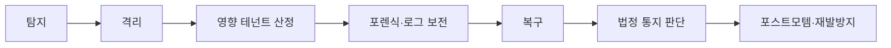
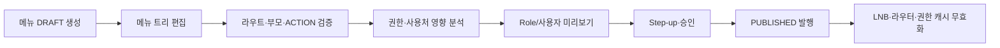
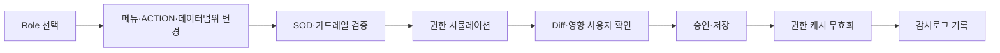

# BK 개발 상세설계서 - 관리회사 시스템관리자

- 기준 문서: `bk_설계서_v1.1.md` (§2 멀티테넌시, §3 인증, §4 권한, §5 접근 거버넌스, §6 공통 표준 카탈로그, §8 외부 연계 볼트, §12 데이터 모델·상태값, §13 API, §14 배치, §17 보안·개인정보, §19 시스템 운영, §20 보안 강화, §26 운영 콘솔)
- 작성일: 2026-07-08
- 대상 역할: 관리회사 소속 `OperatorUser` 중 **시스템 관리자**. 운영 콘솔 접근 매트릭스에서는 주로 `SEC_ADMIN`에 해당하며, 일부 운영 작업은 `BK_MANAGER` 승인 또는 `AUDITOR` 검토와 결합한다.
- 목적: 관리회사 시스템관리자가 수행해야 하는 인프라·인증정책·배치·연계·보안·감사 운영 기능을 업무 화면·서비스·데이터·통제 기준으로 상세화한다.

---

## 1. 역할 정의

### 1.1 역할의 위치

시스템관리자는 관리회사 내부 운영자 그룹(`OperatorUser`)에 속하지만, 회계 실무 담당자가 아니다. 설계서 §4.3은 관리회사 운영자 Role 체계를 "운영 총괄, 운영 관리자, 고객 지원, 기준정보 운영, 시스템 관리자"로 구분하고, 시스템 관리자의 책임을 **인프라·배치·보안**으로 정의한다. §26.3 운영 콘솔 접근 매트릭스에서는 이 역할이 `SEC_ADMIN` 권한과 가장 가깝다.

| 구분 | 설명 |
|---|---|
| 사용자 그룹 | `OperatorUser` |
| 주요 채널 | 운영 콘솔 OP-00~OP-11 |
| 핵심 역할 | 인증정책, 콘솔 IP 통제, 테넌트 인프라, 배치/연계, 보안·감사, KMS, DLP, DR |
| 기본 데이터 범위 | 운영 전역 또는 담당 운영 범위. 테넌트 데이터 접근은 접근 세션과 로그가 필수 |
| 회계 실무 권한 | 원칙적으로 없음. 전표·장부·결산·신고 직접 작성/승인/기표 불가 |

### 1.2 운영자와의 경계

| 영역 | 시스템관리자 | 일반 운영자/기장 담당 |
|---|---|---|
| 인프라·보안 정책 | 주 담당 | 조회 또는 요청 |
| 운영 콘솔 IP 허용목록 | 등록·수정·감사 | 본인 접속 장애 문의 |
| 인증 정책·MFA | 전역/운영자 정책 관리 | 회사별 설정 지원 또는 사용 |
| 배치·연계 장애 | 원인 분석·재처리·DLQ 처리 | 담당 회사 이슈 확인·고객 안내 |
| 테넌트 데이터 조회 | 사유·접근모드·마스킹·로그 필수 | VIEW/SUPPORT/BOOKKEEPING 범위에서 수행 |
| 기장 실무 | 금지 | `BK_PREPARER`/`BK_REVIEWER`/`BK_MANAGER` 배정 범위 |
| 보안 사고 대응 | 주 담당 | 신고·협조 |

### 1.3 설계 원칙

- 최소 권한: 미배정 회사와 회계 업무 메뉴는 미노출한다.
- 운영자 2FA 필수: `WEBAUTHN` 또는 `TOTP` 우선, 위험 행위는 Step-up 인증을 요구한다.
- 데이터 접근과 키 접근 분리: KMS/키 회전 권한이 있어도 테넌트 평문 데이터 접근 권한을 자동 부여하지 않는다.
- 모든 운영 행위 불변 기록: `OperatorActivityLog`, `AdminAccessLog`, `DataChangeLog`, `AuditLogChain` 중 해당 로그에 append-only 기록한다.
- Break-glass와 일상 운영 분리: 긴급 대행 세션의 녹화·승인·사후검토는 별도 워크플로로 관리한다.

---

## 2. 운영 콘솔 기능 범위

### 2.1 화면별 접근 범위

| OP 메뉴 | 시스템관리자 기능 | 접근 수준 | 근거 |
|---|---|---|---|
| OP-00 운영 진입 | 운영자 홈, 접근 세션 시작, Step-up, 테넌트 컨텍스트 진입 | 제한 접근 | §26.1, §26.2 |
| OP-01 운영 현황 | SLO, 배치 지연, 보안 이벤트, 장애 현황 대시보드 | 전체 또는 보안 영역 전체 | §19, §26.3 |
| OP-02 관리회사·조직 | 콘솔 IP 허용목록, 운영 조직 활동 이력, 일부 조직 보안 속성 | IP/보안 영역 | §5.5, §26.3 |
| OP-03 이용회사/테넌트 | 격리 티어, 쿼터, 스냅샷, 백업·복구, 테넌트 상태 기술 조치 | 격리·스냅샷 제한 | §2, §7, §26.3 |
| OP-05 공통 표준 카탈로그 | 시스템 공통코드, 업무 표준코드 스키마, 코드 버전·배포·사용처 영향 분석 | 시스템 공통코드 전체, 업무 표준코드는 기술 검증 중심 | §6, §12.2, §26.1 |
| OP-06 사용자·인증·권한 | 사용자 관리, 사용자그룹 관리, 인증 정책, MFA 초기화 정책, SSO/WebAuthn 설정, 메뉴 마스터, Role·권한·가드레일, 권한 변경 감사 | 사용자·인증정책·메뉴권한 중심 | §3, §4, §26.1~§26.3 |
| OP-07 접근 거버넌스 | Break-glass 녹화 재생 승인/열람, 접근 로그 검토, 개인정보 접근 로그 검토 | 보안관리자 기능 | §5, §20 |
| OP-09 운영·배치·연계 | 배치, 큐, DLQ, 워커, 커넥터 볼트, 인증서/토큰 만료 모니터링 | 전체 또는 보안 영역 | §8, §14, §19 |
| OP-10 보안·감사 운영 | KMS, 키 회전, DLP, 대량행위 통제, 감사로그 해시체인, 컴플라이언스 점검 | 전체 | §17, §20 |
| OP-11 AI·규칙 운영 | 챗봇 가드레일, QueryTool 허용목록, 모델·룰 보안 정책 검토 | 가드레일 제한 | §11.7, §11.8, §26.3 |

### 2.2 미포함 범위

- 전표 입력, 전표 승인, 결산 마감, 신고 전송, 보고패키지 확정은 시스템관리자 단독 권한이 아니다.
- `BOOKKEEPING` 컨텍스트는 기장 담당 Role과 `BookkeepingAssignment`가 있을 때만 허용한다.
- `BREAK_GLASS` 요청 승인자는 이해충돌을 방지해야 하며, 자신이 요청한 세션 또는 자신이 조작한 세션의 사후검토 승인자가 될 수 없다.

---

## 3. 권한·인증·세션 통제

### 3.1 기본 권한 세트

시스템관리자 권한은 운영 콘솔 표준 Role `SEC_ADMIN`을 기준으로 구성한다. 실제 구현에서는 다음 scope 조합을 권장한다.

| Scope | 용도 | Step-up |
|---|---|---|
| `operator:console:login` | 운영 콘솔 로그인 | 2FA 필수 |
| `operator:user:read` / `operator:user:write` | 운영자·이용회사 사용자 조회·생성·수정·상태 변경 | write 시 필수 |
| `operator:user:lifecycle` | 초대, 활성화, 휴면, 잠금, 비활성, 퇴사/탈퇴 처리 | Step-up 필수 |
| `operator:user:security-reset` | MFA 초기화, 세션 강제종료, 비밀번호 초기화 링크 발송 | Step-up, 승인 권장 |
| `operator:user-group:read` / `operator:user-group:write` | 사용자그룹 조회·생성·수정·구성원 관리 | write 시 필수 |
| `operator:user-group-menu:write` | 사용자그룹별 메뉴 노출·진입·숨김 정책 관리 | Step-up, 영향 분석 |
| `operator:auth-policy:read` / `operator:auth-policy:write` | 인증 정책·MFA·SSO 설정 | write 시 필수 |
| `operator:console-ip:read` / `operator:console-ip:write` | 콘솔 IP 허용목록 | write 시 필수 |
| `operator:common-code:read` / `operator:common-code:write` | 시스템 공통코드 조회·작성·수정 | write 시 필수 |
| `operator:common-code:publish` | 공통코드 버전 발행·회수·롤백 | 2인 승인 권장 |
| `operator:menu:read` / `operator:menu:write` | 메뉴 마스터 조회·작성·수정 | write 시 필수 |
| `operator:menu:publish` | 메뉴 버전 발행·회수·롤백 | 2인 승인 권장 |
| `operator:role:read` / `operator:role:write` | Role·Role 템플릿 조회·작성·수정 | write 시 필수 |
| `operator:permission:grant` | 메뉴·행위·데이터범위 권한 부여·회수 | Step-up 필수 |
| `operator:permission:simulate` | 사용자/Role 기준 권한 시뮬레이션 | read |
| `operator:tenant-infra:read` / `operator:tenant-infra:write` | 테넌트 티어·쿼터·스냅샷 기술 관리 | write 시 필수 |
| `operator:batch:read` / `operator:batch:operate` | 배치·큐·DLQ 조회/재처리 | 재처리 시 필수 |
| `operator:connector-vault:read` / `operator:connector-vault:operate` | 커넥터 상태·인증서·토큰 운영 | 평문 접근 금지 |
| `security:kms:read` / `security:kms:rotate` | 키 버전·회전·폐기 | 2인 승인 권장 |
| `security:audit:read` | 감사 로그·해시체인 검토 | 민감 로그 열람 시 필수 |
| `security:dlp:operate` | 대량 행위 통제·보안 이벤트 조치 | 조치 시 필수 |
| `operator:breakglass:recording:review` | 녹화 재생·사후검토 | 2인 승인 |

### 3.2 인증 정책

- 운영자는 2FA 필수다. 권장 순서는 `WEBAUTHN` 또는 `TOTP`, 보조 수단은 SMS/Email OTP다.
- 위험 작업은 Step-up 인증을 요구한다: 인증정책 변경, 권한 변경, 개인정보 평문 로그 열람, 대량 다운로드 승인, 키 회전, 콘솔 IP 허용목록 변경, Break-glass 녹화 재생.
- 운영 콘솔 세션과 업무 화면 세션은 분리한다.
- 비밀번호 정책 기본값은 최소 10자, 90일 변경, 직전 5개 재사용 금지, 5회 실패 잠금, 365일 미접속 휴면이다.

### 3.3 접근 세션

테넌트 데이터 접근은 다음 네 가지 모드 중 하나의 접근 세션을 발급받아야 한다.

| 모드 | 시스템관리자 사용 가능성 | 통제 |
|---|---|---|
| `VIEW` | 장애·보안 분석 목적의 마스킹 조회 | 사유, 로그, 회사 통지 정책 |
| `SUPPORT_SESSION` | 설정·구성 지원 목적 | 시간제한, 사유, 로그, 회사 통지 |
| `BOOKKEEPING` | 원칙적으로 사용하지 않음 | 별도 기장 Role·배정 없으면 차단 |
| `BREAK_GLASS` | 기술·보안 사고 긴급 조치 시 예외 | 옵트인, 2인 승인, 시간·범위 제한, 녹화, 사후검토 |

### 3.4 SOD 규칙

| 통제 | 규칙 |
|---|---|
| 권한 변경 | 본인 Role 변경·승격은 금지 또는 2인 승인 |
| IP 허용목록 | 현재 접속 IP를 차단하는 변경은 자기 잠금 방지 경고 + 2차 확인 |
| 키 관리 | 키 회전 권한과 평문 데이터 접근 권한 분리 |
| Break-glass | 요청자, 승인자, 사후검토자 분리 |
| 녹화 재생 | 재생 요청자와 승인자 분리, 재생 로그 기록 |
| 배치 재처리 | 데이터 반영 배치는 멱등키·요청 해시 검증 후 실행 |

---

## 4. 기능 상세

### 4.1 운영자 계정·인증 정책 관리

**목적**: 관리회사 운영자의 계정 보안, MFA, SSO, 세션, 잠금·휴면 정책을 관리한다.

| 기능 | 상세 |
|---|---|
| 운영자 계정 보안 상태 조회 | `ACTIVE`/`LOCKED`/`SUSPENDED`/`DORMANT`/`DISABLED` 상태, MFA 등록 여부, 최근 로그인, 이상 로그인 표시 |
| MFA 정책 관리 | 운영자 2FA 필수, 수단별 허용 여부, 백업코드 정책, 분실 초기화 승인 절차 |
| SSO/WebAuthn 관리 | SAML/OIDC IdP, WebAuthn credential, SCIM 연동 상태 관리 |
| 세션 정책 | 유휴 30분, 절대 12시간, 동시 세션 제한, 비밀번호 변경 시 전 세션 무효화 |
| 이상 로그인 탐지 | 신규 기기·지역·불가능 이동·비정상 시간대 감지 시 추가 인증 또는 차단 |
| 잠금 해제 | 본인확인, 사유, Step-up, `OperatorActivityLog` 기록 후 처리 |

**엔티티**: `UserCredential`, `MfaDevice`, `WebauthnCredential`, `SsoIdentity`, `UserSession`, `TrustedDevice`, `LoginHistory`, `AuthPolicy`, `AccountStatus`.

### 4.2 운영 콘솔 IP 허용목록 관리

**목적**: 운영 콘솔 접근을 허용된 네트워크로 제한한다.

| 기능 | 상세 |
|---|---|
| CIDR 등록 | IP/CIDR 형식 검증, 중복·겹침 범위 경고 |
| 적용 범위 | 전역, 조직, Role, 긴급 예외 기간 단위 설정 |
| 자기 잠금 방지 | 현재 접속 IP 제외 시 경고, 2차 확인, 대체 관리자 확인 옵션 |
| 변경 이력 | 변경 전후값, 사유, 승인자, 시각을 append-only 기록 |
| 차단 처리 | 허용목록 외 IP는 `CONSOLE_IP_BLOCKED`로 차단 |

**엔티티**: `ConsoleIpAllowlist`, `OperatorActivityLog`.

### 4.3 테넌트 인프라·격리 티어 운영

**목적**: 이용회사별 격리 티어, 스키마/DB, 쿼터, 스냅샷, 백업·복구를 기술적으로 운영한다.

| 기능 | 상세 |
|---|---|
| 티어 조회 | `SHARED`, `SCHEMA`, `DEDICATED`, DB ref, schemaName, 암호화 키, 쿼터 프로필 표시 |
| 티어 전환 예약 | 데이터 용량 산정, 점검 윈도우, 전환 리허설, 전환 승인 체크 |
| 타겟 프로비저닝 | 스키마/전용 DB 생성, DDL 배포, 연결 정보 등록 |
| 스냅샷 생성 | 마감/결산/신고 전 자동 또는 수동 `TenantSnapshot` 생성 |
| PITR 복구 지원 | 테넌트 단위 논리 백업, 시점 복구, 복구 후 잔액·무결성 검증 |
| 쿼터 관리 | 사용자 수, 저장공간, API 호출, 동시 비동기 잡, 월 전표 라인 수, 리포트 보관일 |

**티어 전환 검증**:

| 검증 | 기준 |
|---|---|
| 레코드 수 | 소스·타겟 주요 테이블 count 일치 |
| 금액 합계 | 시산표·거래처원장·기간별 전표라인 합계 일치 |
| 체크섬 | 기간별 전표라인 checksum 일치 |
| 해시체인 | `DataChangeLog` 해시체인 루트 대조 |
| 라우팅 | 전환 후 핵심 API/리포트 정상 응답 |

**엔티티**: `TenantInfra`, `TenantSnapshot`, `QuotaProfile`, `TierMigrationJob`, `TenantMigrationOutbox`, `TierMigrationValidation`, `TierMigrationRollbackLog`.

### 4.4 배치·스케줄·큐 운영

**목적**: 운영 배치와 회사 배치의 성공/실패/지연을 관측하고 안전하게 재처리한다.

| 배치군 | 관리 항목 |
|---|---|
| 운영 배치 | 구독 상태 점검, 표준 자동적용, 보존기간 파기 점검, 접근 이상탐지, 인증서/토큰 만료, 백업/스냅샷, 키 회전, DR 훈련 |
| 회사 배치 | 외부수집, 자동분개, 환율 동기화, 결산검증, 신고 집계, 차원 일괄배정, 이상거래 스코어링, aging/은행대사 |
| 기장 운영 배치 | 기장 모드 전환, 기장 요약 통지, 확인(Ack) 리마인드, 담당 공백 점검 |
| 보고 산출 배치 | 보고패키지, 계정별 명세 tie-out, 외화평가, 제조원가, 예실 대비, 그룹보고 Export |

**운영 기능**:

- 큐 상태, 워커 수, 처리량, 실패율, DLQ 건수를 조회한다.
- DLQ 메시지는 원인·페이로드 요약·멱등키·재처리 가능 여부를 표시한다.
- 재처리는 동일 멱등키 + 동일 요청 해시일 때만 허용한다.
- 장기 지연 작업은 담당 운영자와 시스템관리자에게 알림을 발송한다.

**엔티티**: `ScrapingTask`, `AsyncReportJob`, `IntegrationStaging`, `ArchiveRestoreJob`, `ClosingJob`, `DeploymentRecord`.

### 4.5 외부 연계 볼트·인증서 운영

**목적**: 홈택스, 카드사, 은행, 환율, OCR, ERP 연계 인증정보를 안전하게 보관·회전·감시한다.

| 기능 | 상세 |
|---|---|
| 커넥터 상태 조회 | 유형, 연결 상태, 마지막 성공/실패, 오류 원인 |
| 인증서·토큰 만료 모니터링 | 만료 D-N 알림, 자동 갱신 가능 여부 표시 |
| 토큰 회전 | OAuth refresh, 인증서 갱신, 폐기 이력 기록 |
| 평문 접근 차단 | 운영자는 시크릿 평문 조회 불가. KMS secretRef만 사용 |
| 연계 로그 | 호출/응답 요약, 원천키, 멱등키, 재전송 이력 |

**엔티티**: `TenantConnector`, `ConnectorCredential`, `OAuthToken`, `Certificate`, `ConnectionHealth`, `IntegrationLog`.

### 4.6 KMS·키 회전·파기 운영

**목적**: 테넌트별 암호화 키와 용도별 키를 관리하고, 회전·폐기·복구 훈련을 통제한다.

| 기능 | 상세 |
|---|---|
| 키 계층 조회 | 루트 키, 테넌트 DEK, 용도별 키(DB/파일/백업/세션녹화) |
| 키 회전 | 정기 회전, 유출 의심 즉시 회전, 재암호화 배치 실행 |
| 키 접근 로그 | 키 사용자, 용도, 대상, 시각, 결과를 전수 기록 |
| 키 폐기 | 테넌트 해지·파기 시 crypto-shredding 포함, 파기증명 연계 |
| 분리 통제 | 키 관리 권한과 데이터 평문 접근 권한 분리 |

**엔티티**: `KeyRotationLog`, `EncryptionKey`, `DataDestructionCertificate`, `DataDestructionLog`.

### 4.7 보안·감사 로그 운영

**목적**: 접근·변경·다운로드·복호화·권한변경 이력을 불변 로그로 보존하고 위변조를 탐지한다.

| 로그 | 기록 대상 |
|---|---|
| `OperatorActivityLog` | 운영자 로그인, 정책 변경, 권한 변경, IP 허용목록, 배포·키 회전 |
| `AdminAccessLog` | 운영자가 이용회사 데이터에 접근한 모드, 사유, 세션, 대상 |
| `PersonalDataAccessLog` | 개인정보 평문 조회·복호화, 사유, 승인, 제한 시간 |
| `DataChangeLog` | 테넌트 업무 데이터 CUD, 전후값, source, traceId |
| `AuditLogChain` | 중요 로그 해시체인, 위변조 검증 |
| `SecurityEvent` | 권한 외 접근, 대량 다운로드, 비정상 시간대 접근, 반복 실패 |

**기능**:

- 로그 검색은 민감정보 기본 마스킹을 적용한다.
- 해시체인 검증 실패 시 보안 인시던트를 자동 생성한다.
- 대량 다운로드·복호화 로그는 임계 초과 시 DLP 이벤트로 승격한다.

### 4.8 DLP·대량 행위 통제

**목적**: 대량 조회/다운로드, 비정상 시간대 접근, 퇴직 예정자 패턴 등 데이터 유출 위험을 감지하고 승인 절차를 강제한다.

| 기능 | 상세 |
|---|---|
| 임계치 정책 | 건수, 파일 크기, 기간, 반복 횟수, 민감항목 포함 여부 기준 |
| 승인 워크플로 | 재인증, 사유, 2인 승인, 다운로드 링크 만료 |
| 워터마크 | 다운로드 파일에 요청자·시각·tenantId 워터마크 |
| 차단 | 임계 초과 무승인 시 `BULK_ACTION_THRESHOLD` |
| SIEM 연계 | 보안 이벤트를 외부 관제 시스템으로 전송 |

### 4.9 CI/CD·배포·기능 플래그 운영

**목적**: 안전한 배포와 설정 변경을 통제한다.

| 기능 | 상세 |
|---|---|
| 환경 분리 | DEV, STG, PROD 분리. 운영 데이터는 STG/DEV 복사 금지 |
| 배포 승인 | 변경 내용, 승인자, 롤백 계획, 동결 캘린더 기록 |
| 무중단 배포 | 블루-그린 또는 카나리, DB expand-contract 패턴 |
| 기능 플래그 | `feature.*` 중앙 관리, 변경 감사, 구독/업종/Phase 연동 |
| 보안 게이트 | SAST, SCA/SBOM, 시크릿 스캔, 컨테이너 취약점 스캔 |

**엔티티**: `DeploymentRecord`, `FeatureFlagConfig`, `VulnerabilityRecord`.

### 4.10 SLO·장애·DR 운영

**목적**: 서비스 수준을 관측하고 장애·재해복구를 체계적으로 처리한다.

| 기능 | 상세 |
|---|---|
| SLO 관리 | 가용성, 핵심 API 응답시간, 배치 완료 시한, 에러버짓 |
| 장애 대응 | SEV1~3, 온콜, 타임라인, 상태 페이지 공지, 포스트모템 |
| DR 훈련 | 티어별 RTO/RPO, 백업 복구 훈련, 테넌트 단위 복구 포함 |
| 신고기한 우선 복구 | 재해 시 신고·마감 임박 테넌트 우선순위 정책 |

**엔티티**: `IncidentRecord`, `SloPolicy`, `DrDrillLog`.

### 4.11 Break-glass 녹화·사후검토 운영

**목적**: 긴급 대행 세션의 UI 조작 전 과정을 신뢰성 있게 기록하고 검토한다.

| 기능 | 상세 |
|---|---|
| 녹화 정책 | `BREAK_GLASS` 세션 활성 시 DOM 이벤트·클릭·입력 스트림 녹화 |
| 민감정보 마스킹 | PASSWORD/PII/FINANCIAL/PAYROLL/SECRET 필드 캡처 전 마스킹 |
| 보관 | WORM/Object Lock, 별도 키 암호화, 보존기간 정책 |
| 재생 승인 | 보안관리자+감사자 2인 승인 또는 회사 관리자 승인 정책 |
| 사후검토 | `AdminAccessLog`, `DataChangeLog`, 녹화 타임라인 통합 리포트 |

**엔티티**: `SessionRecording`, `SessionRecordingPlaybackLog`, `BreakGlassReviewReport`.

### 4.12 시스템 공통코드 관리(OP-05C)

**목적**: 전체 시스템에서 공통으로 사용하는 코드군을 중앙에서 등록·버전관리·배포하고, 화면·API·배치·권한 평가가 동일한 코드 정의를 사용하도록 통제한다. 설계서 §6의 `STD_CODE`는 업무 표준 코드까지 포함하지만, 본 절은 시스템관리자가 책임지는 **시스템 공통코드**를 별도 관리 대상으로 상세화한다.

#### 4.12.1 코드 관리 범위

| 구분 | 관리 주체 | 예시 | 정책 |
|---|---|---|---|
| 시스템 공통코드 | 시스템관리자 | 계정상태, 테넌트상태, 접근모드, 배치상태, 메뉴유형, 민감정보등급, 오류코드 | 전역 단일 정의. 테넌트별 수정 불가 |
| 업무 표준코드 | 기준정보 운영 + 시스템관리자 기술 검증 | 결제수단, 거래유형, 신고서식, 부가세 과세유형, 표준 Role 템플릿 | `GlobalStandard`/`STD_CODE` 버전 배포. 회사 채택·확장 가능 여부를 표준별로 정의 |
| 회사 확장코드 | 이용회사 관리자 또는 기장 운영자 | 회사별 적요, 관리항목, 거래처 유형 확장 | 테넌트 범위. 시스템 공통코드와 namespace 분리 |

시스템관리자는 시스템 공통코드를 **마스터/세부 관계**로 관리한다. 마스터는 코드그룹(`CommonCodeGroup`)이고, 세부는 해당 그룹에 속한 코드값(`CommonCodeItem`)이다. 화면과 API는 반드시 마스터를 먼저 선택한 뒤 세부 목록을 조회·추가·수정·삭제(폐기)·저장하도록 구성한다. 업무 표준코드의 세무·회계 내용 자체는 기준정보 운영 역할이 담당하되, 코드 스키마·배포 안정성·사용처 영향 분석은 시스템관리자가 검증한다.

#### 4.12.2 시스템 공통코드 상세 목록

| 코드군 | 코드그룹 | 주요 코드값 | 사용처 | 변경 정책 |
|---|---|---|---|---|
| 사용자 그룹 | `USER_GROUP` | `OPERATOR`, `TENANT` | 인증 토큰, 메뉴 채널, 권한 평가 | 시스템 예약. 추가/삭제 금지 |
| 운영자 Role | `OPERATOR_ROLE` | `BK_MANAGER`, `BK_PREPARER`, `BK_REVIEWER`, `SEC_ADMIN`, `AUDITOR`, `BILLING` | OP 메뉴 권한, 업무 배정 | 추가 시 권한 매트릭스 영향 분석 필수 |
| 계정 상태 | `ACCOUNT_STATUS` | `ACTIVE`, `LOCKED`, `PASSWORD_EXPIRED`, `SUSPENDED`, `DORMANT`, `DISABLED` | 로그인, 계정관리, 보안 이벤트 | 상태 전이 규칙과 함께 배포 |
| 인증 수단 | `AUTH_FACTOR_TYPE` | `PASSWORD`, `TOTP`, `SMS_OTP`, `EMAIL_OTP`, `WEBAUTHN`, `BACKUP_CODE`, `SAML`, `OIDC` | MFA, SSO, Step-up | 보안 검토 필수 |
| 테넌트 상태 | `TENANT_STATUS` | `PENDING`, `ACTIVE`, `SUSPENDED`, `DORMANT`, `TERMINATED` | OP-03, 구독·업무 차단 | 구독 상태와 혼동 금지 |
| 테넌트 티어 | `TENANT_TIER` | `SHARED`, `SCHEMA`, `DEDICATED` | 인프라, 백업, 쿼터 | 인프라 구현 선행 |
| 구독 상태 | `SUBSCRIPTION_STATUS` | `TRIAL`, `ACTIVE`, `PAST_DUE`, `SUSPENDED`, `GRACE`, `TERMINATED`, `REACTIVATED` | OP-04, 기능 제한 | 청구 영향 분석 필수 |
| 접근모드 | `ADMIN_ACCESS_MODE` | `VIEW`, `SUPPORT_SESSION`, `BOOKKEEPING`, `BREAK_GLASS` | OP-00 배너, 접근세션, 감사로그 | 시스템 예약. 삭제 금지 |
| 기장 모드 | `BOOKKEEPING_MODE` | `OPERATOR_LED`, `TENANT_LED`, `HYBRID` | OP-08, 메뉴 가변, 권한 검증 | 업무 정책 승인 필수 |
| 주기장 | `PRIMARY_BOOKKEEPER` | `OPERATOR`, `TENANT` | 마감·결산·신고 권한 | 기장 모드와 연동 |
| 메뉴 유형 | `MENU_TYPE` | `GROUP`, `MENU`, `TAB`, `ACTION` | `Menu`, `RoleMenuPermission`, `MenuActionGrant` | 시스템 예약 |
| 행위 유형 | `ACTION_TYPE` | `READ`, `CREATE`, `UPDATE`, `DELETE`, `APPROVE`, `REJECT`, `CLOSE`, `REOPEN`, `SUBMIT`, `EXPORT`, `PUBLISH`, `ROLLBACK` | 버튼 권한, API scope | 추가 시 권한 캐시 무효화 |
| 가드레일 유형 | `GUARDRAIL_TYPE` | `FORBID`, `REQUIRE_SOD`, `REQUIRE_STEPUP`, `REQUIRE_APPROVAL` | 권한·위임 정책 | 시스템 예약 |
| 표준 버전 상태 | `STANDARD_STATUS` | `DRAFT`, `PUBLISHED`, `DEPRECATED`, `RETIRED` | 표준 카탈로그 | 상태 전이 고정 |
| 표준 배포 모드 | `STANDARD_DISTRIBUTION_MODE` | `MANDATORY`, `RECOMMENDED`, `OPTIONAL` | 표준 배포 | 시스템 예약 |
| 배치 상태 | `JOB_STATUS` | `QUEUED`, `RUNNING`, `SUCCESS`, `RETRY`, `FAILED`, `DEAD_LETTER` | OP-09, 배치/큐 | 워커 상태와 일치 |
| 티어 전환 상태 | `TIER_MIGRATION_STATUS` | `SCHEDULED`, `PROVISIONING`, `SNAPSHOTTING`, `CDC_SYNC`, `VALIDATING`, `CUTOVER`, `COMPLETED`, `ROLLED_BACK`, `FAILED` | 티어 전환 | 상태머신 검증 |
| 보안 인시던트 상태 | `SECURITY_INCIDENT_STATUS` | `DETECTED`, `CONTAINED`, `ANALYZING`, `RECOVERED`, `NOTIFIED`, `CLOSED` | OP-10, IR | 감사자 검토 |
| 민감정보 등급 | `SENSITIVITY_CLASS` | `PUBLIC`, `INTERNAL`, `PII`, `FINANCIAL`, `PAYROLL`, `SECRET`, `PASSWORD` | 마스킹, 녹화, DLP | 보안 검토 필수 |
| 알림 채널 | `NOTIFICATION_CHANNEL` | `IN_APP`, `EMAIL`, `SMS`, `KAKAO`, `WEBHOOK` | 알림 발송 | 채널 어댑터 존재 검증 |
| 오류 코드 | `ERROR_CODE` | `STEP_UP_REQUIRED`, `CONSOLE_IP_BLOCKED`, `ACCESS_SESSION_REQUIRED`, `BULK_ACTION_THRESHOLD` 등 | API 오류, UI 복구 가이드 | API 문서와 동시 배포 |
| 감사 이벤트 | `AUDIT_EVENT_TYPE` | `LOGIN`, `ACCESS_SESSION_START`, `DATA_EXPORT`, `ROLE_CHANGED`, `KEY_ROTATED`, `CODE_PUBLISHED` | 감사로그, 보안 이벤트 | append-only |
| 기능 플래그 유형 | `FEATURE_FLAG_TYPE` | `GLOBAL`, `PLAN`, `TENANT`, `USER`, `EXPERIMENT` | 기능 플래그 | 배포 게이트와 연동 |
| 파일 보존 등급 | `RETENTION_CLASS` | `HOT`, `WARM`, `COLD`, `WORM`, `DESTROY_PENDING` | 데이터 티어링, 파기 | 보존정책 영향 |

#### 4.12.3 마스터/세부 화면 구성

| 영역 | 기능 |
|---|---|
| 마스터 조회조건 | `groupCode`, 그룹명, 도메인, scope, mutability, ownerRole, 상태, 발행 버전으로 코드그룹을 조회한다. |
| 마스터 목록 | 코드그룹(`CommonCodeGroup`) 단위 목록. 코드그룹, 그룹 국문명, 그룹 영문명, 도메인, 관리 주체, 변경 가능성, 현재 발행 버전, 세부 건수, 사용처 수, 상태 표시 |
| 마스터 상세 | 선택한 코드그룹의 기본 속성을 한글 필드명으로 입력·수정한다. 입력 항목은 코드그룹, 그룹 국문명, 그룹 영문명, 도메인, 적용범위, 변경정책, 값 유형, 다국어 필수, 메타데이터 스키마, 상태전이 사용 여부이다. |
| 세부 조회조건 | 선택한 마스터 안에서 코드, 국문명, 영문명, 사용여부, 시작일, 종료일, 예약 여부, 폐기 여부, 코드그룹으로 코드 항목을 조회한다. |
| 세부 그리드 | 코드 항목(`CommonCodeItem`) 단위 목록. 코드값, 코드그룹, 국문명, 영문명, 설명, 정렬순서, 사용여부, 시작일, 종료일, 대체 코드, UI badge/color 메타데이터 표시 |
| 마스터/세부 버튼 | 마스터 영역과 세부 영역을 분리하여 각각 조회·추가·수정·삭제(폐기)·저장을 제공한다. 세부 버튼은 마스터 선택 전 비활성화한다. |
| 버전·Diff 패널 | 선택한 마스터 기준 DRAFT/PUBLISHED 비교, 추가·수정·폐기 세부 코드, checksum, 배포 예정일 표시 |
| 사용처 영향 분석 | 선택한 마스터 또는 세부 코드별 API, DB 컬럼, 화면, 배치, 권한룰, 테스트 케이스 사용처와 영향도 표시 |
| 가져오기/내보내기 | 선택한 마스터의 세부 항목을 CSV/XLSX/JSON import/export, dry-run 검증, 오류 행 다운로드 |
| 감사 이력 | 마스터 변경과 세부 변경을 구분해 변경 전후값, 사유, 승인자, 발행자, 캐시 무효화 결과 조회 |

#### 4.12.4 기능·동작

| 기능 | 상세 |
|---|---|
| 마스터 조회 | 코드그룹 조건으로 `CommonCodeGroup` 목록을 조회하고, 행 선택 시 해당 그룹의 DRAFT/PUBLISHED 버전과 세부 목록을 로딩한다. |
| 마스터 생성 | `groupCode`를 UPPER_SNAKE_CASE로 생성. 도메인, scope, 관리 주체, 변경 가능성, i18n 필요 여부, 세부 valueType을 지정 |
| 마스터 수정 | 발행 이력이 있어도 그룹명, 설명, ownerRole, 메타데이터 스키마 등 런타임 값에 영향을 주지 않는 속성은 수정 가능하다. `groupCode`, `valueType`, `scope` 변경은 영향 분석과 승인 필요 |
| 마스터 삭제 | 세부 코드가 없고 런타임 사용처가 없을 때만 삭제 가능하다. 사용 이력이 있으면 물리 삭제 대신 그룹 상태를 `RETIRED`로 전환한다. |
| 마스터 저장 | 마스터 변경분을 저장하고 `CommonCodeHistory(action=GROUP_*)`에 기록한다. 세부 변경분과 같은 트랜잭션으로 저장할 수 있으나 감사 로그는 분리한다. |
| 세부 조회 | 선택한 마스터(`groupCode`) 하위 코드 항목만 조회한다. 마스터 미선택 상태의 전체 세부 조회는 금지한다. |
| 세부 추가·수정 | 코드값, 코드그룹, 국문명, 영문명, 설명, 정렬순서, 사용여부, 시작일, 종료일, 메타데이터 JSON 입력 |
| 세부 삭제 | 발행 전 DRAFT 항목은 삭제 가능하다. 발행된 항목은 물리 삭제하지 않고 `DEPRECATED` 처리 후 대체 코드와 종료일을 지정한다. 종료일이 도래하면 사용여부는 자동으로 `N` 처리한다. |
| 세부 저장 | 동일 마스터 안의 변경 행을 일괄 저장하며, 중복·상태전이·메타데이터 스키마 검증을 통과한 행만 반영한다. |
| 시스템 예약 코드 보호 | `systemReserved=true` 항목은 코드값·의미·API value 변경 금지. 표시명·설명만 제한적으로 수정 |
| 버전 발행 | 선택한 마스터의 DRAFT 변경분을 검증 후 `PUBLISHED`로 발행. 발행 시 해당 마스터의 런타임 캐시와 권한 평가 캐시 무효화 |
| 롤백 | 직전 발행 버전으로 롤백하되, 이미 저장된 업무 데이터의 코드값은 변경하지 않고 해석 버전만 되돌림 |
| 영향 분석 | 코드 사용 테이블/컬럼, enum validator, 프론트 셀렉트, 배치 상태머신, API 오류코드 문서 영향 분석 |
| 런타임 조회 | 서비스와 프론트는 `CommonCodeService`의 발행 버전만 조회. 미발행 DRAFT는 운영자 화면에서만 조회 |
| 캐시 관리 | 코드그룹별 ETag/version 제공, 발행·롤백 시 Redis/App cache/프론트 bootstrap cache 무효화 |
| 가져오기 | CSV/XLSX/JSON 업로드 후 dry-run, 중복·필수값·상태전이·사용처 영향 검증 |
| 내보내기 | 전체 코드북, 변경 diff, API 오류코드 목록, 다국어 라벨 export |

#### 4.12.5 마스터/세부 데이터 구조

마스터(`CommonCodeGroup`) 필드:

| 필드 | 설명 |
|---|---|
| `groupId` | 코드그룹 내부 식별자. 외부 API에는 원칙적으로 노출하지 않는다. |
| `groupCode` | 코드그룹 식별자. 예: `ACCOUNT_STATUS`. API·DB·프론트 bootstrap의 namespace가 된다. |
| `groupNameKo` | 코드그룹 국문명 |
| `groupNameEn` | 코드그룹 영문명 |
| `description` | 코드그룹 목적과 사용 기준 |
| `domain` | `AUTH`, `TENANT`, `BILLING`, `ACCESS`, `MENU`, `BATCH`, `SECURITY`, `STANDARD`, `NOTIFICATION`, `RETENTION` 등 |
| `scope` | `GLOBAL`, `PLAN`, `TENANT` 중 적용 범위. 시스템 공통코드는 기본 `GLOBAL` |
| `mutability` | `SYSTEM_LOCKED`, `ADMIN_MANAGED`, `STANDARD_MANAGED`, `TENANT_EXTENSIBLE` |
| `valueType` | 세부 코드값 타입. `STRING`, `NUMBER`, `BOOLEAN`, `ENUM`, `EXTERNAL` |
| `versioned` | 버전 발행 대상 여부 |
| `effectiveDated` | 세부 시작일/종료일 관리 여부 |
| `i18nRequired` | 세부 국문명·영문명 필수 여부 |
| `metadataSchema` | 세부 `metadata`에 허용하는 key와 타입 |
| `currentPublishedVersionId` / `draftVersionId` | 현재 발행본과 편집 중 버전 |
| `ownerRole` | 관리 책임 Role |
| `status` | `ACTIVE`, `INACTIVE`, `RETIRED` |

세부(`CommonCodeItem`) 필드:

| 필드 | 설명 |
|---|---|
| `itemId` | 코드 항목 내부 식별자 |
| `groupId` / `groupCode` | 소속 마스터. 세부 저장·조회는 이 키로 항상 제한한다. |
| `versionId` | 해당 항목이 속한 DRAFT/PUBLISHED 버전 |
| `code` | 코드값. API/DB 저장값. 예: `ACTIVE` |
| `parentCode` | 계층형 코드의 상위 코드값 |
| `displayNameKo` | 국문명. 한국어 UI와 기본 관리자 화면의 코드명 |
| `displayNameEn` | 영문명. 영문 UI, 다국어 fallback, 관리자 검색에 사용하는 코드명 |
| `description` | 코드 의미와 사용 기준 |
| `sortOrder` | UI 정렬순서 |
| `useYn` | 사용여부(`Y`/`N`). 종료일이 기준일 이하가 되면 시스템이 자동으로 `N`으로 계산·갱신한다. |
| `effectiveFrom` | 시작일. 코드 선택 가능 시작일 |
| `effectiveTo` | 종료일. 종료일 도래 시 사용여부는 자동으로 `N`으로 전환하고 신규 선택 대상에서 제외한다. |
| `deprecatedAt` | 폐기 시각 |
| `replacementCode` | 대체 코드 |
| `metadata` | UI 색상, badge, severity, icon, actionHint 등 확장 JSON |
| `systemReserved` | 시스템 예약 여부 |

#### 4.12.6 검증 규칙

| 검증 | 처리 |
|---|---|
| 코드그룹 중복 | 동일 `groupCode` 생성 차단 |
| 마스터 미선택 | 세부 조회·추가·수정·삭제·저장 차단 |
| 마스터 삭제 | 세부 또는 사용처가 있으면 물리 삭제 차단, `RETIRED` 전환만 허용 |
| 마스터-세부 범위 | 세부는 선택된 `groupId` 하위에서만 저장 가능. 요청의 `groupCode`와 item의 `groupId` 불일치 시 차단 |
| 코드값 중복 | 동일 그룹 내 동일 `code` 차단 |
| 코드 형식 | 시스템 코드는 UPPER_SNAKE_CASE, 외부 연계 숫자 코드는 그룹 정책에 따른다 |
| 예약 코드 변경 | `SYSTEM_LOCKED`·`systemReserved=true`의 코드값 변경 차단 |
| 발행 코드 삭제 | 물리 삭제 차단. 폐기·대체 코드 지정만 허용 |
| 사용 중 코드 폐기 | 사용처 영향 분석과 대체 코드 없이는 폐기 차단 |
| 시작일/종료일 중복 | 같은 코드의 시작일/종료일 구간 중복 차단 |
| 종료일 자동 비활성 | 기준일이 `effectiveTo` 이상인 코드 항목은 조회·저장 시 `useYn=N`으로 계산·갱신하고 신규 선택 대상에서 제외 |
| 부모코드 검증 | 계층형 코드의 parentCode 존재 여부와 순환참조 차단 |
| 다국어 필수 | `i18nRequired=true` 그룹은 국문명 또는 영문명 누락 차단 |
| 메타데이터 스키마 | 그룹별 허용 metadata key만 저장 |
| 상태머신 | 상태값 그룹은 허용 전이표와 함께 배포 |
| 권한 캐시 | `MENU_TYPE`, `ACTION_TYPE`, Role 관련 코드 변경 시 권한 캐시 무효화 필수 |

#### 4.12.7 운영 경계

- 시스템관리자는 `ACCOUNT_STATUS`, `TENANT_STATUS`, `ADMIN_ACCESS_MODE`, `JOB_STATUS`, `ERROR_CODE`처럼 플랫폼 동작에 직접 영향을 주는 코드를 관리한다.
- 기준정보 운영자는 `STD_VAT`, `STD_FORM`, `STD_TAX_RULE`, `STD_ACCOUNT`처럼 세무·회계 업무 내용이 포함된 표준을 관리한다.
- 회사 관리자는 회사별 적요·관리항목·거래처 유형 등 테넌트 확장코드를 관리하되, 시스템 공통코드와 같은 `groupCode`를 사용할 수 없다.
- 코드값은 API 계약이므로 발행 후 의미 변경을 금지한다. 의미 변경이 필요하면 새 코드 추가 + 기존 코드 폐기 방식으로 처리한다.

### 4.13 메뉴 마스터 관리(OP-06D/BF-12)

**목적**: 운영 콘솔(`OP`), 업무 화면(`TN`), 공통 화면(`CO`)에서 사용하는 메뉴 구조를 중앙에서 등록·수정·발행하고, Role 권한 평가가 동일한 메뉴 버전을 기준으로 동작하도록 관리한다.

#### 4.13.1 메뉴 체계

| 구분 | 설계 기준 |
|---|---|
| 채널 | 1-depth 채널은 `OP`, `TN`, `CO`로 구분한다. |
| 계층 | 2-depth 업무영역, 3-depth 진입 메뉴, 4-depth 화면·탭·행위로 구성한다. |
| 메뉴 유형 | `GROUP`, `MENU`, `TAB`, `ACTION`을 사용한다. |
| 발행 단위 | 메뉴는 `MenuVersion` 단위로 `DRAFT`를 편집하고 `PUBLISHED`로 발행한다. |
| 다국어 | 모든 메뉴는 국문명과 영문명을 기본으로 관리하고, 추가 언어는 `MenuI18n`으로 확장한다. |
| 노출 원칙 | 권한 없는 메뉴는 비활성이 아니라 미노출한다. 부모 메뉴가 숨김이면 하위 메뉴는 평가하지 않는다. |
| 캐시 | `MenuVersion` 발행·롤백, Role 권한 변경 시 메뉴 캐시와 권한 평가 캐시를 무효화한다. |

#### 4.13.2 메뉴 데이터 구조

| 필드 | 설명 |
|---|---|
| `menuId` | 불변 식별자. 버전이 바뀌어도 같은 논리 메뉴를 추적한다. |
| `menuCode` | 채널 내 고유 코드. 예: `OP-06D`, `TN-VAT-INPUT`, `CO-NOTIFICATION` |
| `channel` | `OP`, `TN`, `CO` |
| `type` | `GROUP`, `MENU`, `TAB`, `ACTION` |
| `parentId` | 상위 메뉴. 최상위 채널 메뉴는 nullable |
| `screenId` | 실제 화면 식별자. `MENU`/`TAB` 유형에 필수 |
| `tabId` | 탭 식별자. `TAB` 유형일 때 사용 |
| `actionCode` | `READ`, `CREATE`, `UPDATE`, `DELETE`, `APPROVE`, `REJECT`, `CLOSE`, `REOPEN`, `SUBMIT`, `EXPORT`, `PUBLISH`, `ROLLBACK` 등 |
| `displayNameKo` | 국문 메뉴명. 기본 언어가 한국어인 화면의 표시명 |
| `displayNameEn` | 영문 메뉴명. 다국어 전환, 영문 UI, 관리자 검색에 사용하는 필수 표시명 |
| `descriptionKo` / `descriptionEn` | 메뉴 설명. 툴팁, 검색, 감사 Diff에서 사용 |
| `routePath` | 프론트 라우트 경로 |
| `componentKey` | 화면 컴포넌트 또는 마이크로 프론트엔드 키 |
| `iconKey` | 메뉴 아이콘 키 |
| `sortOrder` | 동일 부모 내 정렬순서 |
| `phase` | 적용 Phase. 예: `PHASE09`, `PHASE10` |
| `featureFlagKey` | 기능 플래그에 의해 노출되는 메뉴일 때 연결 |
| `bookkeepingModePolicy` | `OPERATOR_LED`, `TENANT_LED`, `HYBRID`별 노출 정책 |
| `closingLockPolicy` | `CLOSING_LOCKED` 상태에서 쓰기 행위 차단 여부 |
| `requiredStepUp` | 메뉴 진입 또는 ACTION 실행 시 Step-up 필요 여부 |
| `sensitivityClass` | 메뉴가 다루는 민감정보 등급 |
| `status` | `DRAFT`, `ACTIVE`, `DEPRECATED`, `RETIRED` |
| `effectiveFrom` / `effectiveTo` | 메뉴 적용 기간 |

#### 4.13.3 화면 구성

| 영역 | 기능 |
|---|---|
| 메뉴 트리 | 채널별 메뉴 계층 조회, drag-and-drop 정렬, 유형별 아이콘, 미발행 변경 badge |
| 메뉴 상세 | 코드, 국문명, 영문명, 국문/영문 설명, 라우트, 컴포넌트, 화면 ID, 탭 ID, ACTION, 기능 플래그, 노출 정책 입력 |
| 다국어 라벨 | `ko-KR`, `en-US` 기본 라벨과 추가 locale별 표시명·설명 관리, locale별 미리보기 |
| 버전·Diff 패널 | DRAFT/PUBLISHED 비교, 추가·수정·폐기 메뉴, 영향 Role 수, 발행 예정 시각 표시 |
| 영향 분석 | 연결된 Role, API scope, 화면, 테스트 케이스, 기능 플래그, 북키핑 모드 영향 조회 |
| 권한 미리보기 | Role/사용자/테넌트/접근모드 기준 LNB·탭·버튼 노출 결과 시뮬레이션 |
| 가져오기·내보내기 | JSON/CSV 메뉴 정의 import/export, dry-run 검증, 오류 파일 다운로드 |
| 감사 이력 | 변경 전후값, 사유, 승인자, 발행자, 캐시 무효화 결과 조회 |

#### 4.13.4 기능·동작

| 기능 | 상세 |
|---|---|
| 메뉴 생성 | `menuCode`, 유형, 부모, 국문명, 영문명, 라우트, 화면 ID를 입력해 DRAFT에 생성한다. |
| 메뉴 수정 | 발행본은 직접 수정하지 않고 새 DRAFT 버전에 변경분을 저장한다. |
| 영문명 관리 | `displayNameEn`과 `descriptionEn`을 메뉴 상세에서 직접 관리하고, 추가 언어는 `MenuI18n` locale 행으로 관리한다. |
| 메뉴 복사 | 기존 메뉴와 하위 TAB/ACTION을 복사하되 새 `menuCode`와 route 충돌을 검증한다. |
| 메뉴 이동·정렬 | 같은 채널 내 부모 변경과 정렬순서 변경을 허용하고 순환참조를 차단한다. |
| 메뉴 폐기 | 사용 중 메뉴는 물리 삭제하지 않고 `DEPRECATED`/`RETIRED`로 상태 전환한다. |
| 버전 발행 | DRAFT 검증, 영향 분석, Step-up, 필요 시 2인 승인 후 `PUBLISHED`로 발행한다. |
| 롤백 | 직전 `PUBLISHED` 버전으로 롤백하고 LNB, 라우터, 권한 캐시를 무효화한다. |
| 기능 플래그 연동 | `featureFlagKey`가 꺼진 메뉴는 권한이 있어도 숨기고, 업그레이드 안내가 필요한 경우 별도 정책을 연결한다. |
| 접근모드 연동 | `VIEW`, `SUPPORT_SESSION`, `BOOKKEEPING`, `BREAK_GLASS` 모드별 노출 여부를 지정한다. |
| 마감 잠금 연동 | `CLOSING_LOCKED` 상태에서는 쓰기 ACTION을 차단하고 읽기 메뉴만 유지한다. |
| 라우트 가드 | 화면 진입 시 발행 메뉴, Role 메뉴권한, ACTION 권한, 데이터 범위, 민감정보 권한을 재평가한다. |

#### 4.13.5 검증 규칙

| 검증 | 처리 |
|---|---|
| 메뉴 코드 중복 | 동일 `MenuVersion`·`channel` 내 동일 `menuCode` 차단 |
| 국문명·영문명 필수 | `displayNameKo`, `displayNameEn`이 비어 있으면 저장·발행 차단 |
| 영문명 형식 | `displayNameEn`은 제어문자, HTML, 줄바꿈을 허용하지 않고 앞뒤 공백을 제거 |
| 부모 유형 검증 | `GROUP` 하위는 `GROUP`/`MENU`, `MENU` 하위는 `TAB`/`ACTION`, `TAB` 하위는 `ACTION`만 허용 |
| 순환참조 | 상위 메뉴 변경 시 자기 자신 또는 하위 메뉴를 부모로 지정할 수 없음 |
| ACTION 부모 | `ACTION`은 반드시 `MENU` 또는 `TAB` 하위에만 생성 |
| 라우트 중복 | 발행 버전 내 동일 `routePath` 중복 차단 |
| 화면 ID 검증 | `screenId`는 화면 카탈로그에 존재해야 하며 Phase와 채널이 일치해야 함 |
| 권한 사용 중 삭제 | `RoleMenuPermission` 또는 `MenuActionGrant`가 연결된 메뉴는 물리 삭제 차단 |
| 기능 플래그 검증 | `featureFlagKey`가 존재하고 적용 범위가 채널·테넌트 정책과 일치해야 함 |
| 부모 미노출 | 부모 메뉴가 숨김이면 하위 메뉴 노출·진입·ACTION 평가를 수행하지 않음 |
| 잠금 정책 | `CLOSING_LOCKED`에서 쓰기 ACTION이 열려 있으면 발행 차단 또는 승인 요구 |

### 4.14 Role·권한 관리(OP-06C/OP-06D)

**목적**: Role, 메뉴권한, 행위권한, 데이터 범위, 민감정보 권한, 가드레일을 통합 관리하여 운영자와 테넌트 사용자의 실제 화면 노출과 API 실행 가능 여부를 일관되게 통제한다.

#### 4.14.1 권한 모델

| 권한 요소 | 설명 |
|---|---|
| `Role` | 표준 Role 또는 테넌트별 커스텀 Role. 예: `SEC_ADMIN`, `BK_MANAGER`, `BK_PREPARER`, `BK_REVIEWER`, `AUDITOR`, `BILLING` |
| `RoleAssignment` | 사용자·조직·테넌트·기간별 Role 배정 |
| `RoleMenuPermission` | 메뉴 노출과 진입 허용 여부. LNB·탭 노출의 기준 |
| `UserGroupMenuPermission` | 사용자그룹 단위 메뉴 노출·진입·숨김 정책. Role 권한보다 빠른 그룹 필터로 적용 |
| `MenuActionGrant` | 버튼·행위 단위 권한. 조회/등록/수정/삭제/승인/반려/마감/전송/출력/발행/롤백 등 |
| `DataScopeRule` | 테넌트, 사업장, 부서, 비용센터, 차원별 데이터 범위 |
| `SensitiveDataGrant` | 개인정보·금융정보·급여·비밀정보 조회·복호화 권한 |
| `PolicyGuardrail` | SOD, Step-up, 승인필수, 접근모드 제한 등 통제 규칙 |
| `PolicyException` | 기간·사유·승인자가 있는 예외 권한 |
| `PermissionEvaluationCache` | 사용자·Role·MenuVersion·테넌트 기준 평가 결과 캐시 |
| `PermissionSimulationLog` | 권한 시뮬레이션 입력값과 결과 기록 |

#### 4.14.2 권한 평가 순서

1. 메뉴 버전이 `PUBLISHED`인지 확인한다.
2. 사용자그룹 메뉴권한(`UserGroupMenuPermission`)을 평가한다. 여러 그룹 중 하나라도 `DENY`이면 숨김 처리한다.
3. Role 메뉴 노출 권한(`RoleMenuPermission`)을 평가한다.
4. 메뉴 진입 권한을 평가한다.
5. ACTION 실행 권한(`MenuActionGrant`)을 평가한다.
6. 데이터 범위(`DataScopeRule`)를 평가한다.
7. 민감정보 권한(`SensitiveDataGrant`)과 Step-up 상태를 평가한다.
8. `PolicyGuardrail`과 `PolicyException`을 적용한다.
9. 명시적 거부(`deny`)가 있으면 항상 거부가 우선한다.

#### 4.14.3 화면 구성

| 영역 | 기능 |
|---|---|
| Role 목록 | 표준 Role, 테넌트 커스텀 Role, 활성/폐기 상태, 배정 사용자 수, 위험 권한 badge 표시 |
| Role 상세 | Role 코드, 이름, 설명, 적용 채널, 테넌트 범위, 상속 Role, 상태, 유효기간 관리 |
| 메뉴권한 트리 | `MenuVersion` 기준 메뉴 트리에 노출/진입/거부 권한을 부여 |
| 그룹 메뉴권한 탭 | 사용자그룹별 메뉴 노출·진입·숨김 정책과 Role 권한 대비 Diff 표시 |
| ACTION 권한 매트릭스 | 메뉴별 조회·등록·수정·삭제·승인·반려·마감·전송·출력·발행·롤백 권한 부여 |
| 데이터 범위 | 테넌트, 사업장, 부서, 비용센터, 차원별 허용/거부/상속 규칙 입력 |
| 민감정보 권한 | `SENSITIVITY_CLASS`별 마스킹 해제, 복호화, 다운로드, 녹화 마스킹 정책 설정 |
| 가드레일 | SOD 위반, Step-up 필수, 2인 승인 필수, 접근모드 제한 규칙 설정 |
| 시뮬레이션 | 사용자·Role·테넌트·접근모드·메뉴·ACTION을 입력해 실제 허용/거부 이유 확인 |
| 변경 Diff | 이전 권한과 변경 후 권한 차이, 신규 위험 권한, 영향 사용자, 캐시 무효화 범위 표시 |

#### 4.14.4 기능·동작

| 기능 | 상세 |
|---|---|
| Role 생성·복사 | 표준 Role 템플릿을 복사해 커스텀 Role을 만들고 권한 차이를 명시한다. |
| Role 배정 | 사용자·조직·테넌트·기간 단위로 Role을 배정하고 만료일을 지정한다. |
| 메뉴권한 부여 | `RoleMenuPermission`으로 메뉴 노출/진입/거부를 설정한다. |
| 그룹 메뉴권한 부여 | `UserGroupMenuPermission`으로 특정 사용자그룹의 메뉴 노출·진입·숨김을 설정한다. |
| ACTION 권한 부여 | `MenuActionGrant`로 버튼·API 행위 권한을 설정한다. |
| 데이터 범위 부여 | 회사 전체, 특정 사업장, 특정 부서, 특정 차원 조합으로 범위를 제한한다. |
| 민감정보 권한 부여 | 마스킹 해제, 복호화, 다운로드는 Step-up과 사유, 감사로그를 요구한다. |
| 권한 회수 | 기간 만료, 사용자 퇴직, Role 폐기, SOD 위반 시 권한을 회수한다. |
| 권한 시뮬레이션 | 저장 전후 권한 결과와 거부 사유를 화면에서 확인한다. |
| 변경 승인 | 위험 권한, 민감정보 권한, 자기 Role 변경은 2인 승인 또는 차단 정책을 적용한다. |
| 캐시 무효화 | Role, 메뉴권한, ACTION 권한, 데이터 범위 변경 시 권한 캐시를 무효화한다. |

#### 4.14.5 SOD·가드레일

| 통제 | 규칙 |
|---|---|
| 자기 권한 상승 | 본인 Role 변경, 본인에게 민감정보 권한 부여, 본인 예외 권한 승인은 차단한다. |
| 작성자·승인자 분리 | 권한 변경 요청자와 승인자는 달라야 한다. |
| 기장 업무 분리 | `SEC_ADMIN`은 기장 작성·승인·마감·신고 전송 ACTION을 가질 수 없다. |
| 승인 충돌 | 같은 전표·정산·신고 건에서 작성자와 승인자가 같으면 차단한다. |
| Break-glass 분리 | 긴급 접근 요청자, 승인자, 사후검토자는 분리한다. |
| 민감정보 접근 | `PII`, `FINANCIAL`, `PAYROLL`, `SECRET` 등급은 Step-up과 감사로그를 필수로 한다. |
| 명시적 거부 우선 | 허용 권한이 있어도 상위 Role, 정책, 예외에서 `deny`이면 거부한다. |

#### 4.14.6 검증 규칙

| 검증 | 처리 |
|---|---|
| 미발행 메뉴 권한 | `PUBLISHED` 메뉴가 아닌 대상에는 권한 부여 차단 |
| 고아 권한 | 존재하지 않는 `menuId` 또는 `actionCode` 참조 차단 |
| 그룹 메뉴권한 충돌 | 동일 사용자가 속한 여러 그룹의 메뉴권한이 충돌하면 `DENY`를 우선하고 충돌 목록을 표시 |
| ACTION 단독 권한 | 메뉴 진입 권한 없이 ACTION 권한만 부여하면 저장 차단 |
| 데이터 범위 오류 | 사용자 소속·테넌트와 맞지 않는 사업장/부서 범위 차단 |
| 민감정보 권한 | Step-up, 사유, 승인 정책이 없으면 저장 차단 |
| 가드레일 충돌 | SOD 규칙과 Role 권한이 충돌하면 저장 차단 또는 예외 승인 요구 |
| Role 폐기 | 배정 사용자 또는 하위 Role이 있으면 즉시 폐기 차단 |
| 캐시 정합성 | 변경 후 권한 평가 캐시 버전이 메뉴 발행 버전과 일치해야 함 |

### 4.15 사용자 관리(OP-06A/BF-04)

**목적**: 관리회사 운영자(`OperatorUser`)와 이용회사 사용자(`TenantUser`)의 계정 생명주기, 보안 상태, 인증수단, 그룹·Role 배정을 통합 조회·관리한다. 시스템관리자는 운영자 계정은 직접 관리하고, 이용회사 사용자는 보안·상태·지원 목적의 범위에서 관리한다.

#### 4.15.1 관리 범위

| 사용자 구분 | 관리 범위 | 제한 |
|---|---|---|
| `OperatorUser` | 관리회사 운영자 생성, 정보 수정, 사용자그룹 배정, Role 배정 요청, 계정 상태 변경, MFA 초기화, 세션 강제종료 | 본인 권한 상승, 본인 잠금해제 승인, 기장 업무 Role 직접 부여 금지 |
| `TenantUser` | 이용회사 사용자 조회, 계정 상태 지원, MFA 초기화 요청 처리, SSO/SCIM 동기화 상태 확인, 보안 사고 시 잠금·세션 종료 | 회사 관리자 권한 영역의 업무 Role 임의 부여 금지. 접근 사유와 회사 통지 정책 필요 |
| 외부 파트너 | 외부 세무대리인·감사자 계정 상태 조회, 접근 요청 상태 확인, 만료·회수 처리 | 계약·승인 범위를 벗어난 상시 접근 금지 |

#### 4.15.2 사용자 데이터 구조

| 필드 | 설명 |
|---|---|
| `userId` | 불변 사용자 식별자 |
| `loginId` | 전역 유일 로그인 ID |
| `userGroup` | 시스템 예약 대분류. `OPERATOR`, `TENANT` |
| `userType` | `INTERNAL_OPERATOR`, `TENANT_ADMIN`, `TENANT_MEMBER`, `EXTERNAL_PARTNER` 등 |
| `operatorOrgId` | `OPERATOR` 사용자 필수 소속 조직 |
| `homeTenantId` | `TENANT` 사용자 필수 소속 이용회사 |
| `displayName` | 사용자 표시명 |
| `email` / `mobileNo` | 알림·인증 연락처 |
| `locale` / `timeZone` | 다국어·시간대 기본값 |
| `accountStatus` | `ACTIVE`, `LOCKED`, `PASSWORD_EXPIRED`, `SUSPENDED`, `DORMANT`, `DISABLED` |
| `mfaStatus` | 미등록, 등록, 분실 초기화 대기, 잠금 등 |
| `ssoIdentityId` | SAML/OIDC/SCIM 외부 계정 연결 |
| `lastLoginAt` / `lastLoginIp` | 최근 로그인 정보 |
| `riskScore` | 이상 로그인·대량행위·권한 변경 기반 위험 점수 |
| `groupMemberships` | 소속 사용자그룹 |
| `roleAssignments` | 직접 또는 그룹을 통해 부여된 Role |

#### 4.15.3 화면 구성

| 영역 | 기능 |
|---|---|
| 사용자 목록 | `OperatorUser`/`TenantUser` 구분, 회사, 조직, 상태, MFA, SSO, 최근 로그인, 위험 점수 필터 |
| 사용자 상세 | 기본정보, 소속, 연락처, locale, 계정 상태, 인증수단, 사용자그룹, Role, 데이터 범위 표시 |
| 보안 탭 | MFA 장치, WebAuthn credential, 세션, 신뢰기기, 로그인 이력, 이상 로그인 이벤트 |
| 생명주기 탭 | 초대, 활성화, 잠금, 휴면, 비활성, 퇴사/탈퇴, 재활성화 이력 |
| 그룹·권한 탭 | 직접 Role, 그룹 상속 Role, 메뉴권한 미리보기, 권한 시뮬레이션 |
| SCIM/SSO 탭 | 외부 IdP, externalId, 마지막 동기화, 프로비저닝 오류, 수동 재동기화 |
| 감사 이력 | 변경 전후값, 사유, 승인자, Step-up, 통지 여부 조회 |

#### 4.15.4 기능·동작

| 기능 | 상세 |
|---|---|
| 사용자 생성·초대 | `loginId`, 사용자 구분, 소속, 연락처, 초기 그룹을 입력하고 초대 메일을 발송한다. |
| 사용자 정보 수정 | 이름, 연락처, locale, 조직, 부서, 사용자그룹을 수정한다. 중요 속성은 사유와 감사로그를 남긴다. |
| 계정 상태 변경 | 잠금, 휴면, 비활성, 재활성화, 퇴사/탈퇴를 상태머신에 따라 처리한다. |
| MFA 초기화 | 분실·교체 요청을 접수하고 본인확인, Step-up, 승인 후 MFA 장치를 초기화한다. |
| 세션 강제종료 | 보안 사고, 퇴사, 권한 회수 시 사용자 세션과 신뢰기기를 무효화한다. |
| 비밀번호 초기화 | 임시 비밀번호 저장 없이 만료 링크를 발송하고 사용 시점에 Step-up을 요구한다. |
| 그룹 배정 | 사용자그룹 구성원 추가·제거 시 상속 Role과 메뉴권한 변화를 미리보기한다. |
| 권한 미리보기 | 사용자 기준으로 직접 Role과 그룹 Role을 합산한 메뉴·ACTION·데이터범위 결과를 표시한다. |
| 일괄 처리 | CSV/XLSX 업로드 또는 SCIM 동기화로 초대·상태 변경·그룹 배정을 dry-run 후 반영한다. |

#### 4.15.5 검증 규칙

| 검증 | 처리 |
|---|---|
| 로그인 ID 중복 | `loginId` 전역 중복 저장 차단 |
| 소속 필수 | `OPERATOR`는 `operatorOrgId`, `TENANT`는 `homeTenantId` 없으면 저장 차단 |
| 연락처 검증 | 이메일·휴대폰 형식 오류 또는 인증 연락처 누락 시 초대 차단 |
| 상태 전이 | `DISABLED`에서 직접 `ACTIVE` 전환 등 허용되지 않은 상태 전이 차단 |
| 본인 보안 조치 | 본인 잠금해제, 본인 MFA 초기화 승인, 본인 Role 상승 차단 |
| 퇴사/탈퇴 처리 | 활성 세션, 신뢰기기, API 토큰, 그룹 멤버십, RoleAssignment를 함께 회수 |
| SCIM 충돌 | 외부 IdP 관리 사용자는 콘솔 직접 수정 범위를 제한하고 동기화 충돌 표시 |
| TenantUser 지원 | 이용회사 사용자 조치는 접근 사유, 회사 통지 정책, 감사로그 없이는 저장 차단 |

### 4.16 사용자그룹 관리(OP-06A/BF-04)

**목적**: 사용자그룹을 조직·업무·보안 정책·권한 배정의 묶음 단위로 관리한다. `USER_GROUP` 공통코드의 `OPERATOR`/`TENANT`는 시스템 예약 대분류이고, 여기서의 `UserGroup`은 실제 운영·권한 관리를 위한 하위 그룹이다.

#### 4.16.1 사용자그룹 유형

| 그룹 유형 | 설명 | 예시 |
|---|---|---|
| `OPERATOR_ORG` | 관리회사 조직 기반 그룹 | 시스템운영팀, 보안운영팀, 고객지원팀 |
| `TENANT_ORG` | 이용회사 조직 기반 그룹 | 회계팀, 세무팀, 결재자그룹 |
| `FUNCTIONAL` | 업무 기능 기반 그룹 | 신고검토자, 배치운영자, 기준정보운영 |
| `SECURITY` | 보안·감사 목적 그룹 | Break-glass 승인자, 감사로그 열람자 |
| `EXTERNAL` | 외부 파트너·감사자 그룹 | 외부감사자, 세무대리인 |

#### 4.16.2 사용자그룹 데이터 구조

| 필드 | 설명 |
|---|---|
| `userGroupId` | 불변 그룹 식별자 |
| `groupCode` | 범위 내 고유 그룹 코드 |
| `groupNameKo` / `groupNameEn` | 국문·영문 그룹명 |
| `groupType` | `OPERATOR_ORG`, `TENANT_ORG`, `FUNCTIONAL`, `SECURITY`, `EXTERNAL` |
| `ownerScope` | `GLOBAL`, `OPERATOR_ORG`, `TENANT` |
| `tenantId` | 테넌트 그룹일 때 소속 이용회사 |
| `operatorOrgId` | 관리회사 조직 그룹일 때 소속 조직 |
| `parentGroupId` | 상위 그룹. 계층형 그룹 구성 시 사용 |
| `status` | `ACTIVE`, `INACTIVE`, `RETIRED` |
| `membershipRule` | 정적 멤버십 또는 SCIM/조직 속성 기반 동적 규칙 |
| `defaultRoleBindings` | 그룹에 상속되는 Role 목록 |
| `dataScopeTemplate` | 그룹 기반 데이터 범위 기본값 |
| `approvalPolicy` | 그룹 가입·탈퇴·Role 상속 변경 승인 정책 |

#### 4.16.3 화면 구성

| 영역 | 기능 |
|---|---|
| 그룹 목록 | 그룹 유형, 소유 범위, 상태, 구성원 수, 상속 Role, 동적 규칙 여부 표시 |
| 그룹 상세 | 그룹 코드, 국문명, 영문명, 설명, 소유 조직/테넌트, 상위 그룹, 상태 관리 |
| 구성원 탭 | 사용자 추가·제거, 일괄 업로드, SCIM 동기화 구성원, 만료 예정 구성원 조회 |
| Role 바인딩 탭 | 그룹에 상속할 Role, 메뉴권한, 데이터 범위 템플릿 연결 |
| 메뉴 권한 탭 | `MenuVersion` 기준 메뉴 트리에서 그룹별 `INHERIT`/`ALLOW`/`DENY`, 노출, 진입 여부 관리 |
| 영향 분석 | 구성원별 권한 변화, 위험 권한, SOD 위반, 캐시 무효화 범위 표시 |
| 감사 이력 | 그룹 변경, 구성원 변경, Role 바인딩 변경, 승인 이력 조회 |

#### 4.16.4 기능·동작

| 기능 | 상세 |
|---|---|
| 그룹 생성·수정 | 그룹 코드, 국문/영문명, 유형, 소유 범위, 상위 그룹, 상태를 관리한다. |
| 구성원 추가·제거 | 사용자별 또는 일괄로 멤버십을 변경하고 권한 영향 분석을 수행한다. |
| 동적 그룹 | 조직, 직무, 테넌트 속성, SCIM group claim 기준으로 멤버십을 자동 산출한다. |
| Role 바인딩 | 그룹에 Role과 데이터 범위 템플릿을 연결해 구성원에게 상속한다. |
| 그룹별 메뉴 관리 | 그룹 단위로 메뉴 노출·진입·숨김 정책을 설정한다. `INHERIT`는 Role 메뉴권한을 따르고, `ALLOW`는 그룹에서 메뉴 노출을 허용하며, `DENY`는 Role 권한이 있어도 숨긴다. |
| 만료 관리 | 임시 그룹 멤버십에는 만료일을 두고 만료 시 Role 상속을 회수한다. |
| 그룹 폐기 | 활성 구성원과 Role 바인딩이 있으면 즉시 폐기하지 않고 이전·회수 절차를 요구한다. |
| 권한 시뮬레이션 | 그룹 변경 전후 사용자별 메뉴·ACTION·데이터범위 변화를 시뮬레이션한다. |

#### 4.16.5 검증 규칙

| 검증 | 처리 |
|---|---|
| 그룹 코드 중복 | 동일 `ownerScope` 내 `groupCode` 중복 차단 |
| 그룹명 필수 | `groupNameKo`, `groupNameEn` 누락 시 저장 차단 |
| 소유 범위 검증 | `TENANT` 그룹은 `tenantId`, `OPERATOR_ORG` 그룹은 `operatorOrgId` 필수 |
| 순환참조 | 상위 그룹 지정 시 자기 자신 또는 하위 그룹 참조 차단 |
| 멤버 사용자 범위 | `OPERATOR` 사용자는 테넌트 조직 그룹에 직접 추가할 수 없고, `TENANT` 사용자는 운영자 조직 그룹에 추가할 수 없음 |
| Role 바인딩 검증 | 그룹 유형과 맞지 않는 Role 또는 데이터 범위 템플릿 연결 차단 |
| 메뉴권한 검증 | `PUBLISHED` 메뉴 버전의 메뉴만 그룹 메뉴권한 대상으로 허용 |
| 그룹 메뉴 충돌 | 사용자가 속한 여러 그룹에서 같은 메뉴에 `ALLOW`와 `DENY`가 함께 있으면 `DENY` 우선, 충돌 이력 표시 |
| 부모 메뉴 숨김 | 그룹에서 부모 메뉴를 `DENY`하면 하위 메뉴·탭·ACTION은 평가 없이 숨김 |
| 활성 구성원 폐기 | 활성 구성원 또는 Role 바인딩이 있는 그룹은 폐기 전 이전·회수 요구 |
| 동적 그룹 충돌 | SCIM 동기화 그룹은 콘솔 수동 멤버 변경을 제한하거나 충돌로 표시 |

---

## 5. 주요 업무 흐름

### 5.1 신규 운영자 보안 등록

**검증**:

- `OPERATOR` 사용자는 `operatorOrgId`가 필수다.
- 2FA 미등록 운영자는 운영 콘솔 핵심 메뉴 진입을 차단한다.
- 권한 없는 메뉴는 비활성이 아니라 미노출한다.

### 5.2 콘솔 IP 허용목록 변경

1. 변경 대상 범위(전역/조직/Role/예외)를 선택한다.
2. CIDR 형식과 기존 범위 중복을 검증한다.
3. 현재 접속 IP가 제외되면 자기 잠금 방지 경고를 표시한다.
4. Step-up 인증과 사유 입력을 요구한다.
5. 변경 전후값을 `OperatorActivityLog`에 기록한다.
6. 허용목록 외 접속은 `CONSOLE_IP_BLOCKED`로 차단한다.

### 5.3 테넌트 티어 전환

**차단 조건**:

- 검증 checksum 불일치
- 마감·신고 성수기 동결 기간
- 롤백 계획 미등록
- `TenantSnapshot` 미생성
- 소스·타겟 schema 차이 미해소

### 5.4 배치 장애 재처리

1. OP-09에서 실패 배치 또는 DLQ 메시지를 조회한다.
2. 원인, 영향 테넌트, 멱등키, 요청 해시, 재처리 가능 여부를 확인한다.
3. 데이터 반영성 작업이면 동일 키+동일 요청 해시인지 검증한다.
4. Step-up 인증 후 재처리한다.
5. 결과를 작업 로그와 운영 알림에 기록한다.

### 5.5 키 회전

1. 회전 대상 키와 범위(전역/테넌트/용도)를 지정한다.
2. 영향 테이블·파일·백업 객체를 산정한다.
3. 2인 승인과 Step-up 인증을 수행한다.
4. 재암호화 배치를 멱등 실행한다.
5. 샘플 복호화·서비스 정상성 검증 후 이전 키를 보존 또는 폐기 예약한다.
6. `KeyRotationLog`와 `OperatorActivityLog`를 기록한다.

### 5.6 보안 인시던트 대응

**필수 산출물**:

- 영향 테넌트 목록
- 타임라인
- 접근·변경·복호화 로그
- 조치 내역
- 고객/당국 통지 여부
- 재발 방지 액션

### 5.7 시스템 공통코드 발행

**발행 절차**:

1. 코드그룹 또는 코드항목 변경 사유를 입력한다.
2. DRAFT 버전에 변경사항을 저장한다.
3. 코드 형식, 중복, 예약 코드 변경, 사용여부, 시작일/종료일, 다국어 필수값, 메타데이터 스키마를 검증한다.
4. 사용처 영향 분석으로 API, DB 컬럼, 화면, 배치, 권한 평가, 테스트 케이스 영향도를 확인한다.
5. `SYSTEM_LOCKED` 또는 상태머신 관련 코드 변경은 2인 승인과 Step-up을 요구한다.
6. `PUBLISHED` 발행 후 `CommonCodeVersion.checksum`을 기록하고 캐시를 무효화한다.
7. 배포 후 오류율, `UNKNOWN_CODE`, API validation 실패, 프론트 bootstrap 실패를 모니터링한다.

### 5.8 공통코드 폐기·대체

1. 폐기 대상 코드의 사용처와 저장 데이터 건수를 조회한다.
2. 대체 코드(`replacementCode`)와 종료일(`effectiveTo`)을 지정한다. 종료일이 도래하면 사용여부(`useYn`)는 자동으로 `N` 처리한다.
3. 신규 선택 목록에서는 숨기되, 과거 데이터 조회·해석은 유지한다.
4. 배치 또는 마이그레이션이 필요한 경우 `CommonCodeMigrationMap`을 생성한다.
5. 폐기 후 `DEPRECATED` 상태로 보존하고, 법정·감사상 필요한 기간 동안 물리 삭제하지 않는다.

### 5.9 메뉴 버전 발행

**발행 절차**:

1. 새 `MenuVersion` DRAFT를 생성하거나 기존 DRAFT를 선택한다.
2. `OP`, `TN`, `CO` 채널별 메뉴 트리, 라우트, 화면 ID, 탭, ACTION을 편집한다.
3. 메뉴 코드 중복, 부모 유형, 순환참조, 라우트 중복, 화면 ID 존재 여부를 검증한다.
4. 연결 Role, `RoleMenuPermission`, `MenuActionGrant`, 기능 플래그, 접근모드 영향을 분석한다.
5. 주요 Role과 샘플 사용자 기준으로 LNB·탭·버튼 노출 결과를 시뮬레이션한다.
6. 발행 사유, Step-up, 필요 시 2인 승인을 거쳐 `PUBLISHED`로 발행한다.
7. 프론트 메뉴 bootstrap, 라우트 가드, 권한 평가 캐시를 무효화하고 새 버전 번호를 기록한다.

### 5.10 권한 변경·시뮬레이션

**변경 절차**:

1. 표준 Role 또는 테넌트 커스텀 Role을 선택한다.
2. 메뉴 노출/진입, ACTION, 데이터 범위, 민감정보 권한을 변경한다.
3. 자기 권한 상승, 작성자·승인자 분리, `SEC_ADMIN` 기장 업무 접근 금지 등 SOD 규칙을 검증한다.
4. 사용자·테넌트·접근모드·메뉴·ACTION 기준으로 실제 허용/거부 결과를 시뮬레이션한다.
5. 변경 Diff, 위험 권한, 영향 사용자, 캐시 무효화 범위를 확인한다.
6. Step-up과 승인 완료 후 저장하고 `OperatorActivityLog`와 `PermissionSimulationLog`를 기록한다.
7. Role, 메뉴권한, ACTION 권한, 데이터 범위별 권한 평가 캐시를 무효화한다.

### 5.11 사용자 생성·상태 변경

**처리 절차**:

1. `OperatorUser` 또는 `TenantUser` 구분을 선택하고 `loginId`, 이름, 이메일, 휴대폰, 소속을 입력한다.
2. `OPERATOR`는 `operatorOrgId`, `TENANT`는 `homeTenantId` 필수값을 검증한다.
3. 초기 사용자그룹을 지정하고 그룹 상속 Role과 메뉴권한을 미리보기한다.
4. 초대 링크를 발송하고 초대 만료 시 재발송 또는 취소 처리한다.
5. 최초 로그인 시 비밀번호 설정, MFA 등록, 약관·보안정책 확인을 완료해야 `ACTIVE`가 된다.
6. 잠금·휴면·비활성·퇴사/탈퇴 상태 변경은 사유, Step-up, 감사로그를 요구한다.
7. 퇴사/탈퇴 처리 시 세션, 신뢰기기, API 토큰, 그룹 멤버십, RoleAssignment를 함께 회수한다.

### 5.12 사용자그룹 변경·Role·메뉴 상속

**처리 절차**:

1. 그룹 유형과 소유 범위(`GLOBAL`, `OPERATOR_ORG`, `TENANT`)를 확인한다.
2. 구성원 추가·제거, 그룹 Role 바인딩, 그룹 메뉴권한(`INHERIT`/`ALLOW`/`DENY`) 변경을 입력한다.
3. 구성원별 메뉴 노출, ACTION, 데이터 범위, 민감정보 권한 변화를 분석한다.
4. 자기 권한 상승, 운영자/테넌트 그룹 혼입, SOD 위반을 검증한다.
5. 위험 권한이 새로 생기면 Step-up과 승인 절차를 요구한다.
6. 저장 후 그룹 멤버십, 상속 Role, 그룹 메뉴권한, 데이터 범위 템플릿을 반영하고 권한 평가 캐시를 무효화한다.

---

## 6. 데이터 모델

### 6.1 핵심 엔티티

| 영역 | 엔티티 |
|---|---|
| 운영조직 | `OperatorOrg`, `OperatorOrgUnit`, `OperatorTenantLink`, `ConsoleIpAllowlist`, `OperatorActivityLog` |
| 사용자 | `User`, `OperatorUser`, `TenantUser`, `ExternalPartnerUser`, `UserProfile`, `UserLifecycleRequest`, `UserSecurityAction`, `UserAuditLog` |
| 사용자그룹 | `UserGroup`, `UserGroupMember`, `UserGroupRoleBinding`, `UserGroupMenuPermission`, `UserGroupDataScopeTemplate`, `UserGroupMembershipRule`, `UserGroupAuditLog` |
| 인증 | `UserCredential`, `MfaDevice`, `WebauthnCredential`, `SsoIdentity`, `UserSession`, `TrustedDevice`, `LoginHistory`, `AuthPolicy` |
| 메뉴 | `Menu`, `MenuVersion`, `MenuPublishLog`, `MenuUsage`, `MenuI18n`, `MenuRouteBinding`, `MenuFeatureFlagLink`, `MenuAuditLog` |
| 권한 | `Role`, `RoleAssignment`, `RoleMenuPermission`, `MenuActionGrant`, `DataScopeRule`, `SensitiveDataGrant`, `PolicyGuardrail`, `PolicyException`, `PermissionEvaluationCache`, `PermissionSimulationLog`, `PermissionChangeRequest` |
| 공통코드 | `CommonCodeGroup`, `CommonCodeItem`, `CommonCodeVersion`, `CommonCodeUsage`, `CommonCodeChangeRequest`, `CommonCodeImportJob`, `CommonCodeMigrationMap`, `CommonCodeHistory` |
| 테넌트 인프라 | `TenantInfra`, `TenantSnapshot`, `AsyncReportJob`, `QuotaProfile` |
| 티어 전환 | `TierMigrationJob`, `TenantMigrationOutbox`, `TierMigrationValidation`, `TierMigrationRollbackLog` |
| 연계 볼트 | `TenantConnector`, `ConnectorCredential`, `OAuthToken`, `Certificate`, `ConnectionHealth`, `IntegrationLog` |
| 운영 배치 | `ScrapingTask`, `IntegrationStaging`, `ArchiveRestoreJob`, `ClosingJob`, `DeploymentRecord` |
| 보안·감사 | `AdminAccessSession`, `AdminAccessLog`, `PersonalDataAccessLog`, `DataChangeLog`, `SecurityEvent`, `AuditLogChain` |
| Break-glass | `BreakGlassConsent`, `BreakGlassRequest`, `BreakGlassReviewReport`, `SessionRecording`, `SessionRecordingPlaybackLog` |
| 키·컴플라이언스 | `KeyRotationLog`, `SecurityIncident`, `VulnerabilityRecord`, `ComplianceControlMap`, `DrDrillLog` |

### 6.2 공통 필드

| 필드 | 설명 |
|---|---|
| `id` | 불변 surrogate key |
| `scope` | `GLOBAL`/`PLAN`/`TENANT` |
| `tenant_id` | 테넌트 데이터일 때 필수, 운영 전역 데이터는 nullable |
| `operatorUserId` | 조작 운영자 |
| `reason` | 위험 행위 사유 |
| `stepUpVerifiedAt` | 재인증 시각 |
| `approvedBy` | 2인 승인자 |
| `traceId` | 분산 추적 |
| `created_at` / `created_by` | 생성 감사 필드 |
| `updated_at` / `updated_by` | 수정 감사 필드 |
| `version` | 낙관적 락·변경 추적 |

### 6.3 상태값

| 상태 그룹 | 상태값 |
|---|---|
| 계정 상태 | `ACTIVE`, `LOCKED`, `PASSWORD_EXPIRED`, `SUSPENDED`, `DORMANT`, `DISABLED` |
| 테넌트 티어 | `SHARED`, `SCHEMA`, `DEDICATED` |
| 접근모드 | `VIEW`, `SUPPORT_SESSION`, `BOOKKEEPING`, `BREAK_GLASS` |
| 긴급대행 | `REQUESTED`, `APPROVED`, `ACTIVE`, `EXPIRED`, `REVOKED`, `REVIEWED` |
| 티어 전환 | `SCHEDULED`, `PROVISIONING`, `SNAPSHOTTING`, `CDC_SYNC`, `VALIDATING`, `CUTOVER`, `COMPLETED`, `ROLLED_BACK`, `FAILED` |
| 수집 태스크 | `QUEUED`, `RUNNING`, `SUCCESS`, `RETRY`, `FAILED`, `DEAD_LETTER` |
| 보안 인시던트 | `DETECTED`, `CONTAINED`, `ANALYZING`, `RECOVERED`, `NOTIFIED`, `CLOSED` |
| 공통코드 버전 | `DRAFT`, `PUBLISHED`, `DEPRECATED`, `RETIRED` |
| 공통코드 변경요청 | `REQUESTED`, `VALIDATING`, `IMPACT_ANALYZED`, `APPROVED`, `PUBLISHED`, `REJECTED`, `ROLLED_BACK` |
| 메뉴 버전 | `DRAFT`, `PUBLISHED`, `ROLLED_BACK`, `RETIRED` |
| 권한 변경요청 | `REQUESTED`, `VALIDATING`, `SIMULATED`, `APPROVED`, `APPLIED`, `REJECTED`, `CANCELLED` |
| 사용자 초대 | `INVITED`, `ACCEPTED`, `EXPIRED`, `CANCELLED` |
| 사용자그룹 상태 | `ACTIVE`, `INACTIVE`, `RETIRED` |

### 6.4 공통코드 엔티티 상세

| 엔티티 | 핵심 필드 | 설명 |
|---|---|---|
| `CommonCodeGroup` | `groupId`, `groupCode`, `groupNameKo`, `groupNameEn`, `description`, `domain`, `scope`, `mutability`, `valueType`, `versioned`, `effectiveDated`, `i18nRequired`, `metadataSchema`, `ownerRole`, `currentPublishedVersionId`, `draftVersionId`, `status` | 공통코드 마스터. 세부 코드값의 namespace·검증정책·발행 단위를 정의 |
| `CommonCodeItem` | `itemId`, `groupId`, `versionId`, `code`, `parentCode`, `displayNameKo`, `displayNameEn`, `description`, `sortOrder`, `useYn`, `effectiveFrom`, `effectiveTo`, `metadata`, `systemReserved`, `deprecatedAt`, `replacementCode` | 공통코드 세부. 선택된 마스터 하위에서만 생성·수정·폐기하며, 종료일 도래 시 `useYn=N`으로 자동 전환 |
| `CommonCodeVersion` | `groupId`, `versionNo`, `status`, `checksum`, `publishedAt`, `publishedBy`, `effectiveAt`, `rollbackOfVersion`, `itemCount`, `diffSummary` | 코드그룹별 발행 버전. 마스터 1건에 여러 세부 변경분을 묶어 발행 |
| `CommonCodeUsage` | `groupCode`, `code`, `usageType`, `serviceName`, `tableName`, `columnName`, `apiPath`, `screenId`, `hardConstraint`, `lastSeenAt` | 사용처 영향 분석 |
| `CommonCodeChangeRequest` | `requestType`, `groupCode`, `itemCode`, `reason`, `riskLevel`, `status`, `requestedBy`, `approvedBy`, `stepUpVerifiedAt` | 마스터/세부 변경 승인 워크플로 |
| `CommonCodeImportJob` | `sourceFileRef`, `format`, `dryRun`, `status`, `errorFileRef`, `createdBy` | 일괄 업로드 |
| `CommonCodeMigrationMap` | `groupCode`, `fromCode`, `toCode`, `effectiveAt`, `migrationJobId`, `status` | 폐기·대체 마이그레이션 |
| `CommonCodeHistory` | `groupCode`, `code`, `beforeValue`, `afterValue`, `action`, `actorId`, `reason`, `at` | 변경 이력 |

### 6.5 메뉴 마스터 엔티티 상세

| 엔티티 | 핵심 필드 | 설명 |
|---|---|---|
| `MenuVersion` | `versionNo`, `status`, `baseVersionId`, `checksum`, `publishedAt`, `publishedBy`, `rollbackOfVersion`, `reason` | 메뉴 발행 단위 |
| `Menu` | `versionId`, `menuId`, `menuCode`, `channel`, `type`, `parentId`, `screenId`, `tabId`, `actionCode`, `displayNameKo`, `displayNameEn`, `descriptionKo`, `descriptionEn`, `routePath`, `componentKey`, `sortOrder`, `status` | 메뉴 트리와 화면·행위 정의. 국문명·영문명은 필수 |
| `MenuI18n` | `menuId`, `locale`, `displayName`, `description`, `fallbackLocale`, `updatedBy` | `ko-KR`, `en-US` 외 추가 언어 표시명 |
| `MenuRouteBinding` | `menuId`, `routePath`, `componentKey`, `guardPolicy`, `requiredStepUp`, `sensitivityClass` | 라우트 가드와 컴포넌트 연결 |
| `MenuFeatureFlagLink` | `menuId`, `featureFlagKey`, `visibilityPolicy`, `upgradePromptPolicy` | 기능 플래그 기반 노출 제어 |
| `MenuUsage` | `menuId`, `roleCount`, `actionGrantCount`, `apiPath`, `screenId`, `testCaseRef`, `lastSeenAt` | 영향 분석 |
| `MenuPublishLog` | `versionId`, `action`, `diffSummary`, `impactSummary`, `approvedBy`, `publishedBy`, `cacheInvalidatedAt` | 발행·롤백 이력 |
| `MenuAuditLog` | `menuId`, `beforeValue`, `afterValue`, `action`, `actorId`, `reason`, `at` | 메뉴 변경 이력 |

### 6.6 권한 엔티티 상세

| 엔티티 | 핵심 필드 | 설명 |
|---|---|---|
| `Role` | `roleCode`, `roleName`, `roleType`, `scope`, `tenantId`, `inheritsFrom`, `status`, `effectiveFrom`, `effectiveTo` | 표준 Role과 테넌트 커스텀 Role |
| `RoleAssignment` | `roleId`, `userId`, `operatorOrgId`, `tenantId`, `scope`, `effectiveFrom`, `effectiveTo`, `assignedBy`, `reason` | 사용자·조직·테넌트별 Role 배정 |
| `RoleMenuPermission` | `roleId`, `menuVersionId`, `menuId`, `visible`, `enterable`, `deny`, `conditionExpression`, `reason` | 메뉴 노출·진입 권한 |
| `UserGroupMenuPermission` | `userGroupId`, `menuVersionId`, `menuId`, `permissionMode`, `visible`, `enterable`, `deny`, `effectiveFrom`, `effectiveTo`, `reason` | 사용자그룹별 메뉴 노출·진입·숨김 권한 |
| `MenuActionGrant` | `roleId`, `menuVersionId`, `menuId`, `actionCode`, `granted`, `deny`, `requiresStepUp`, `requiresApproval` | 버튼·행위 권한 |
| `DataScopeRule` | `roleId`, `tenantId`, `orgUnitId`, `siteId`, `departmentId`, `dimensionType`, `dimensionValue`, `allowDeny` | 데이터 범위 권한 |
| `SensitiveDataGrant` | `roleId`, `sensitivityClass`, `plainViewAllowed`, `decryptAllowed`, `exportAllowed`, `requiresStepUp`, `retentionDays` | 민감정보 권한 |
| `PolicyGuardrail` | `guardrailType`, `targetType`, `targetId`, `ruleExpression`, `severity`, `status` | SOD·Step-up·승인 필수 규칙 |
| `PolicyException` | `guardrailId`, `targetUserId`, `targetRoleId`, `effectiveFrom`, `effectiveTo`, `approvedBy`, `reason` | 기간 제한 예외 |
| `PermissionChangeRequest` | `requestType`, `roleId`, `diffPayload`, `riskLevel`, `status`, `requestedBy`, `approvedBy`, `stepUpVerifiedAt` | 권한 변경 승인 워크플로 |
| `PermissionEvaluationCache` | `userId`, `roleHash`, `groupHash`, `menuVersionId`, `tenantId`, `accessMode`, `cacheKey`, `resultHash`, `expiresAt` | 런타임 권한 평가 캐시 |
| `PermissionSimulationLog` | `inputPayload`, `resultPayload`, `deniedReasons`, `actorId`, `traceId`, `createdAt` | 권한 시뮬레이션 이력 |

### 6.7 사용자·사용자그룹 엔티티 상세

| 엔티티 | 핵심 필드 | 설명 |
|---|---|---|
| `User` | `loginId`, `userGroup`, `displayName`, `email`, `mobileNo`, `locale`, `timeZone`, `accountStatus`, `lastLoginAt` | 모든 사용자 공통 마스터. `loginId` 전역 유일 |
| `OperatorUser` | `userId`, `operatorOrgId`, `operatorOrgUnitId`, `employeeNo`, `employmentStatus`, `primaryRoleCode` | 관리회사 운영자 확장 정보 |
| `TenantUser` | `userId`, `homeTenantId`, `tenantOrgUnitId`, `jobTitle`, `tenantAdmin`, `scimManaged` | 이용회사 사용자 확장 정보 |
| `ExternalPartnerUser` | `userId`, `partnerProfileId`, `firmRegNo`, `scopeTags`, `validFrom`, `validTo` | 외부 파트너·감사자 사용자 |
| `UserProfile` | `userId`, `nameKo`, `nameEn`, `notificationPreference`, `avatarRef`, `accessibilityPreference` | 화면 표시와 알림 설정 |
| `UserLifecycleRequest` | `requestType`, `userId`, `targetStatus`, `reason`, `status`, `requestedBy`, `approvedBy`, `stepUpVerifiedAt` | 초대·활성화·잠금·비활성·퇴사 처리 요청 |
| `UserSecurityAction` | `userId`, `actionType`, `targetDeviceId`, `sessionId`, `reason`, `performedBy`, `performedAt` | MFA 초기화, 세션 종료, 신뢰기기 해제 등 보안 조치 |
| `UserGroup` | `groupCode`, `groupNameKo`, `groupNameEn`, `groupType`, `ownerScope`, `tenantId`, `operatorOrgId`, `parentGroupId`, `status` | 사용자그룹 마스터 |
| `UserGroupMember` | `userGroupId`, `userId`, `membershipType`, `effectiveFrom`, `effectiveTo`, `source`, `status` | 정적·동적 그룹 구성원 |
| `UserGroupRoleBinding` | `userGroupId`, `roleId`, `scope`, `tenantId`, `dataScopeTemplateId`, `effectiveFrom`, `effectiveTo`, `requiresApproval` | 그룹 기반 Role 상속 |
| `UserGroupMenuPermission` | `userGroupId`, `menuVersionId`, `menuId`, `permissionMode`, `visible`, `enterable`, `deny`, `reason` | 그룹 기반 메뉴 노출·진입·숨김 정책. `INHERIT`, `ALLOW`, `DENY` |
| `UserGroupDataScopeTemplate` | `userGroupId`, `dimensionType`, `dimensionValue`, `allowDeny`, `inheritToChildren` | 그룹 기반 데이터 범위 기본값 |
| `UserGroupMembershipRule` | `userGroupId`, `ruleType`, `ruleExpression`, `scimGroupId`, `lastEvaluatedAt`, `status` | 동적 멤버십·SCIM group claim 규칙 |
| `UserGroupAuditLog` | `userGroupId`, `beforeValue`, `afterValue`, `action`, `actorId`, `reason`, `at` | 그룹·구성원·Role 바인딩 변경 이력 |
| `UserAuditLog` | `userId`, `beforeValue`, `afterValue`, `action`, `actorId`, `reason`, `at` | 사용자 기본정보·상태·보안 조치 변경 이력 |

---

## 7. 서비스·API

### 7.1 서비스

| 서비스 | 책임 |
|---|---|
| `AuthService` | MFA, SSO, WebAuthn, 세션, 계정 잠금 |
| `UserManagementService` | 사용자 조회·초대·수정·상태 변경·보안 조치·감사로그 |
| `UserGroupManagementService` | 사용자그룹, 구성원, 동적 멤버십, 그룹 Role 바인딩, 그룹별 메뉴권한 관리 |
| `UserProvisioningService` | 초대, SCIM 프로비저닝, 일괄 업로드 dry-run, 외부 IdP 동기화 |
| `DelegatedAdminService` | Role, 가드레일, 권한 평가 캐시 무효화 |
| `MenuManagementService` | 메뉴 트리, 메뉴 버전, 라우트 바인딩, 발행·롤백·영향 분석 |
| `PermissionService` | Role, 메뉴권한, ACTION 권한, 데이터 범위, 민감정보 권한 관리 |
| `AuthorizationEvaluationService` | 메뉴 노출, 진입, ACTION, 데이터 범위, 민감정보 권한 평가 |
| `PermissionSimulationService` | 사용자·Role·테넌트·접근모드 기준 권한 시뮬레이션과 거부 사유 산출 |
| `CommonCodeService` | 시스템 공통코드 그룹·항목·버전·런타임 조회·캐시 관리 |
| `CommonCodeImpactService` | 코드 사용처 스캔, 영향 분석, 폐기 가능 여부 검증 |
| `AdminAccessGovernanceService` | 접근 세션, 사유, 통지, Break-glass |
| `TenantInfraService` | 티어, 스냅샷, 백업·복구 |
| `TierMigrationService` | CDC, 큐 플러시, 검증, 롤백 |
| `ScrapingPipelineService` | 외부수집 큐·워커·스테이징·어댑터 |
| `ConnectorVaultService` | 시크릿, 토큰, 인증서, 연결 상태 |
| `DataTieringService` | Hot/Warm/Cold, Parquet, WORM, 복원 |
| `KeyManagementService` | 키 계층, 회전, crypto-shredding |
| `SecurityOperationService` | DLP, 취약점, 인시던트, 컴플라이언스 |
| `DistributedLockService` | Redis Redlock, fencing token, 보상 잡 |
| `NotificationService` | 운영 알림, 장애 알림, 보안 알림 |

### 7.2 대표 API

| Method | URI | 설명 | 통제 |
|---|---|---|---|
| `GET` | `/api/operator/security/events` | 보안 이벤트 조회 | `security:audit:read` |
| `PUT` | `/api/operator/auth-policy` | 운영자 인증 정책 변경 | Step-up, 로그 |
| `GET·POST` | `/api/operator/users` | 사용자 목록 조회·사용자 초대/생성 | `operator:user:read/write` |
| `GET·PUT` | `/api/operator/users/{id}` | 사용자 상세 조회·기본정보 수정 | Step-up(write) |
| `POST` | `/api/operator/users/{id}/lifecycle` | 잠금·휴면·비활성·퇴사/탈퇴·재활성화 처리 | `operator:user:lifecycle` |
| `POST` | `/api/operator/users/{id}/mfa-reset` | MFA 초기화 요청·처리 | Step-up, 승인 |
| `POST` | `/api/operator/users/{id}/sessions/revoke` | 사용자 세션·신뢰기기 강제 종료 | Step-up, 사유 |
| `POST` | `/api/operator/users/{id}/unlock` | 계정 잠금 해제 | 본인확인, 사유 |
| `GET·POST` | `/api/operator/user-groups` | 사용자그룹 목록 조회·생성 | `operator:user-group:read/write` |
| `GET·PUT` | `/api/operator/user-groups/{groupId}` | 사용자그룹 상세 조회·수정·폐기 | Step-up(write) |
| `GET·POST·DELETE` | `/api/operator/user-groups/{groupId}/members` | 그룹 구성원 조회·추가·제거 | 영향 분석 |
| `GET·PUT` | `/api/operator/user-groups/{groupId}/role-bindings` | 그룹 Role 상속 조회·저장 | Step-up, SOD 검증 |
| `GET·PUT` | `/api/operator/user-groups/{groupId}/menu-permissions` | 사용자그룹별 메뉴 노출·진입·숨김 정책 조회·저장 | `operator:user-group-menu:write` |
| `POST` | `/api/operator/user-groups/{groupId}/simulate` | 그룹 변경 권한 영향 시뮬레이션 | `operator:permission:simulate` |
| `POST` | `/api/operator/user-provisioning/import` | 사용자·그룹 일괄 업로드 dry-run/반영 | Step-up |
| `POST` | `/api/operator/user-provisioning/scim/sync` | SCIM 사용자·그룹 수동 동기화 | 감사로그 |
| `GET·POST` | `/api/operator/console-ip-allowlists` | 콘솔 IP 허용목록 조회/등록 | Step-up |
| `GET·POST` | `/api/operator/menu-versions` | 메뉴 버전 목록 조회·DRAFT 생성 | `operator:menu:read/write` |
| `GET·POST` | `/api/operator/menu-versions/{versionId}/menus` | 메뉴 트리 조회·메뉴 추가 | Step-up(write) |
| `PUT` | `/api/operator/menu-versions/{versionId}/menus/{menuId}` | 메뉴 상세 수정·폐기 | Step-up, 영향 분석 |
| `GET` | `/api/operator/menu-versions/{versionId}/impact` | 메뉴 변경 영향 분석 | read |
| `POST` | `/api/operator/menu-versions/{versionId}/publish` | 메뉴 버전 발행 | Step-up, 승인, 캐시 무효화 |
| `POST` | `/api/operator/menu-versions/{versionId}/rollback` | 메뉴 버전 롤백 | 승인, 캐시 무효화 |
| `GET·POST` | `/api/operator/roles` | Role 목록 조회·Role 생성 | `operator:role:read/write` |
| `POST` | `/api/operator/roles/{roleId}/assignments` | Role 사용자·조직 배정 | Step-up, SOD 검증 |
| `GET·PUT` | `/api/operator/roles/{roleId}/menu-permissions` | 메뉴 노출·진입 권한 조회·저장 | `operator:permission:grant` |
| `GET·PUT` | `/api/operator/roles/{roleId}/action-grants` | ACTION 권한 조회·저장 | `operator:permission:grant` |
| `GET·PUT` | `/api/operator/roles/{roleId}/data-scope-rules` | 데이터 범위 권한 조회·저장 | Step-up |
| `GET·PUT` | `/api/operator/roles/{roleId}/sensitive-data-grants` | 민감정보 권한 조회·저장 | Step-up, 승인 |
| `POST` | `/api/operator/permissions/simulate` | 권한 시뮬레이션 | `operator:permission:simulate` |
| `POST` | `/api/operator/permissions/cache/invalidate` | 권한 평가 캐시 무효화 | 감사로그 |
| `GET` | `/api/me/menus` | 현재 사용자 메뉴 bootstrap 조회 | 발행 메뉴·권한 캐시 |
| `GET` | `/api/operator/common-code-groups` | 공통코드 마스터 목록 조회 | `operator:common-code:read` |
| `POST` | `/api/operator/common-code-groups` | 공통코드 마스터 생성 | Step-up, 사유 |
| `GET·PUT` | `/api/operator/common-code-groups/{groupCode}` | 공통코드 마스터 상세 조회·수정·저장 | Step-up(write), 영향 분석 |
| `DELETE` | `/api/operator/common-code-groups/{groupCode}` | 공통코드 마스터 삭제 또는 `RETIRED` 전환 | 세부/사용처 있으면 물리 삭제 차단 |
| `GET` | `/api/operator/common-code-groups/{groupCode}/items` | 선택 마스터의 세부 코드 항목 조회 | `operator:common-code:read` |
| `POST` | `/api/operator/common-code-groups/{groupCode}/items` | 선택 마스터에 세부 코드 항목 추가 | Step-up(write), 마스터 상태 검증 |
| `PUT` | `/api/operator/common-code-groups/{groupCode}/items` | 선택 마스터의 세부 변경분 일괄 저장 | Step-up(write), 중복·스키마 검증 |
| `PUT·DELETE` | `/api/operator/common-code-groups/{groupCode}/items/{code}` | 세부 코드 항목 수정·삭제/폐기 | Step-up, 영향 분석 |
| `POST` | `/api/operator/common-code-groups/{groupCode}/versions/{version}/publish` | 코드 버전 발행 | 2인 승인 권장 |
| `POST` | `/api/operator/common-code-groups/{groupCode}/versions/{version}/rollback` | 코드 버전 롤백 | 승인, 캐시 무효화 |
| `GET` | `/api/operator/common-code-groups/{groupCode}/impact` | 사용처 영향 분석 | read |
| `POST` | `/api/operator/common-code-groups/{groupCode}/import` | 코드 일괄 업로드 dry-run/반영 | Step-up |
| `GET` | `/api/common-codes/{groupCode}` | 런타임 코드 조회(발행본) | 캐시/ETag |
| `GET` | `/api/common-codes/bootstrap` | 프론트 초기 공통코드 묶음 조회 | 캐시/ETag |
| `PUT` | `/api/operator/tenants/{id}/tier` | 테넌트 격리 티어 전환 | 승인, 스냅샷 |
| `POST` | `/api/operator/tenants/{id}/snapshots` | 테넌트 스냅샷 생성 | 사유, 로그 |
| `POST` | `/api/operator/tenants/{id}/restore` | 테넌트 복구 요청 | 2인 승인 |
| `GET` | `/api/operator/batches` | 배치·큐 현황 조회 | read |
| `POST` | `/api/operator/batches/{id}/retry` | 실패 배치 재처리 | 멱등 검증 |
| `POST` | `/api/operator/dlq/{id}/replay` | DLQ 메시지 재실행 | Step-up |
| `GET` | `/api/operator/connectors/health` | 커넥터 상태 조회 | read |
| `POST` | `/api/operator/connectors/{id}/rotate` | 토큰·인증서 회전 | 평문 접근 금지 |
| `POST` | `/api/operator/kms/keys/{id}/rotate` | 키 회전 | 2인 승인 |
| `POST` | `/api/operator/dlp/approvals` | 대량행위 승인/차단 | Step-up |
| `POST` | `/api/operator/break-glass/{id}/recordings/playback-request` | 녹화 재생 요청 | 사유, 승인 |
| `POST` | `/api/operator/incidents` | 보안/운영 인시던트 생성 | 로그 |

### 7.3 API 공통 계약

- 운영자 API는 인증 토큰의 `userGroup=OPERATOR`, Role, scope, IP 허용목록, MFA 상태를 검증한다.
- 테넌트 데이터 접근 API는 접근모드와 `AdminAccessSession`을 검증한다.
- 사용자 관리 API는 대상 사용자의 `userGroup`, 소속 조직/테넌트, SCIM 관리 여부, 요청자의 Role·scope를 함께 검증한다.
- 사용자그룹 API는 그룹 소유 범위와 구성원 사용자 범위가 일치하는지 검증하고, 그룹 Role·메뉴권한 변경 시 권한 시뮬레이션 결과를 저장한다.
- 메뉴 bootstrap API는 `MenuVersion=PUBLISHED`, `UserGroupMenuPermission`, `RoleMenuPermission`, 기능 플래그, 접근모드, 북키핑 모드를 반영해 허용 메뉴만 반환한다.
- 메뉴 bootstrap API는 `Accept-Language` 또는 사용자 locale을 기준으로 `MenuI18n` 라벨을 반환하고, 해당 locale이 없으면 `displayNameEn`, `displayNameKo` 순서로 fallback한다.
- ACTION API는 화면 버튼 노출 여부와 별개로 서버에서 `MenuActionGrant`와 데이터 범위를 다시 검증한다.
- CUD·승인·복호화·관리자 접근·긴급대행 API는 해당 감사 로그를 반드시 기록한다.
- 멱등성이 필요한 API는 `Idempotency-Key`와 request hash를 저장한다.
- 기본 목록 API는 민감정보 마스킹을 적용한다.

---

## 8. 검증·오류 처리

| 오류 코드 | 조건 | 처리 |
|---|---|---|
| `STEP_UP_REQUIRED` | 위험 작업 재인증 없음 | Step-up 모달 |
| `CONSOLE_IP_BLOCKED` | 허용목록 외 IP | 로그인/요청 차단 |
| `ACCESS_SESSION_REQUIRED` | 테넌트 데이터 접근 세션 없음 | OP-00 접근 세션 시작 |
| `BULK_ACTION_THRESHOLD` | 대량 행위 임계 초과 | 재인증·사유·2인 승인 |
| `FORBIDDEN_SCOPE` | scope 부족 | 메뉴 미노출 또는 API 403 |
| `TENANT_ACCESS_DENIED` | 미배정 또는 접근모드 불일치 | 차단·보안 이벤트 |
| `LOCK_NOT_ACQUIRED` | 분산 락 획득 실패 | 재시도 안내 |
| `IDEMPOTENCY_CONFLICT` | 같은 멱등키에 다른 요청 해시 | 409 차단 |
| `BREAK_GLASS_CONSENT_MISSING` | 긴급대행 사전동의 없음 | 요청 차단 |
| `RECORDING_PLAYBACK_APPROVAL_REQUIRED` | 녹화 재생 승인 없음 | 승인 요청 |
| `KMS_KEY_ACCESS_DENIED` | 키 사용 권한 없음 | 보안 이벤트 |
| `USER_LOGIN_ID_DUPLICATED` | `loginId` 전역 중복 | 저장 차단 |
| `USER_REQUIRED_AFFILIATION_MISSING` | `OPERATOR.operatorOrgId` 또는 `TENANT.homeTenantId` 누락 | 저장 차단 |
| `USER_STATUS_INVALID_TRANSITION` | 허용되지 않는 계정 상태 전이 | 저장 차단 |
| `USER_MFA_RESET_APPROVAL_REQUIRED` | MFA 초기화 승인 또는 본인확인 미완료 | 처리 차단 |
| `USER_SELF_SECURITY_ACTION_DENIED` | 본인 잠금해제·MFA 초기화 승인·권한 상승 시도 | 처리 차단 |
| `USER_SCIM_MANAGED_CONFLICT` | SCIM 관리 사용자 속성 직접 수정 충돌 | 저장 차단 또는 동기화 대기 |
| `USER_GROUP_CODE_DUPLICATED` | 동일 소유 범위 내 그룹 코드 중복 | 저장 차단 |
| `USER_GROUP_I18N_REQUIRED` | 사용자그룹 국문명 또는 영문명 누락 | 저장 차단 |
| `USER_GROUP_MEMBER_SCOPE_INVALID` | 그룹 소유 범위와 구성원 사용자 범위 불일치 | 저장 차단 |
| `USER_GROUP_HAS_ACTIVE_MEMBERS` | 활성 구성원 또는 Role 바인딩이 있는 그룹 폐기 | 이전·회수 요구 |
| `USER_GROUP_ROLE_BINDING_INVALID` | 그룹 유형과 맞지 않는 Role·데이터범위 연결 | 저장 차단 |
| `USER_GROUP_MENU_PERMISSION_INVALID` | 그룹 메뉴권한 대상 메뉴가 없거나 미발행 버전 참조 | 저장 차단 |
| `USER_GROUP_MENU_CONFLICT` | 동일 사용자의 여러 그룹에서 메뉴 `ALLOW`/`DENY` 충돌 | `DENY` 우선, 충돌 표시 |
| `USER_GROUP_MENU_PARENT_DENIED` | 부모 메뉴가 `DENY`인데 하위 메뉴를 `ALLOW`로 설정 | 저장 차단 또는 부모 정책 변경 요구 |
| `MENU_CODE_DUPLICATED` | 동일 메뉴 버전·채널 내 메뉴 코드 중복 | 저장 차단 |
| `MENU_I18N_REQUIRED` | 국문명 또는 영문명 누락 | 저장/발행 차단 |
| `MENU_PARENT_INVALID` | 메뉴 유형별 허용되지 않는 부모 지정 | 저장 차단 |
| `MENU_CYCLE_DETECTED` | 메뉴 트리 순환참조 발생 | 저장 차단 |
| `MENU_ROUTE_DUPLICATED` | 발행 버전 내 라우트 중복 | 저장/발행 차단 |
| `MENU_VERSION_NOT_PUBLISHED` | 런타임에서 미발행 메뉴 버전 참조 | 요청 차단 |
| `MENU_IN_USE` | 권한 또는 라우트가 연결된 메뉴 물리 삭제 시도 | 폐기 처리 요구 |
| `PERMISSION_ORPHAN_MENU` | 존재하지 않는 메뉴·ACTION에 권한 부여 | 저장 차단 |
| `PERMISSION_DENY_OVERRIDES` | 명시적 거부가 허용 권한보다 우선 | 거부 사유 표시 |
| `PERMISSION_SCOPE_INVALID` | 사용자·테넌트와 맞지 않는 데이터 범위 | 저장 차단 |
| `PERMISSION_GUARDRAIL_VIOLATION` | SOD·Step-up·승인 정책 위반 | 저장/실행 차단 |
| `PERMISSION_CACHE_STALE` | 권한 캐시 버전이 메뉴 발행 버전과 불일치 | 캐시 재생성 |
| `ROLE_SELF_ESCALATION_DENIED` | 본인 권한 상승 또는 본인 승인 시도 | 저장 차단 |
| `COMMON_CODE_DUPLICATED` | 동일 그룹 내 코드 중복 | 저장 차단 |
| `COMMON_CODE_GROUP_REQUIRED` | 세부 조회·저장 요청에 마스터 코드그룹이 없음 | 처리 차단 |
| `COMMON_CODE_GROUP_ITEM_MISMATCH` | 요청 `groupCode`와 세부 항목의 `groupId`/`groupCode` 불일치 | 저장 차단 |
| `COMMON_CODE_GROUP_IN_USE` | 세부 또는 사용처가 있는 마스터 물리 삭제 시도 | `RETIRED` 전환 요구 |
| `COMMON_CODE_RESERVED` | 시스템 예약 코드값 변경 시도 | 저장 차단 |
| `COMMON_CODE_IN_USE` | 사용 중 코드 물리 삭제 또는 폐기 시도 | 대체 코드·영향 분석 요구 |
| `COMMON_CODE_INVALID_TRANSITION` | 코드 버전·상태 전이 위반 | 저장/발행 차단 |
| `COMMON_CODE_IMPACT_NOT_REVIEWED` | 영향 분석 미수행 | 발행 차단 |
| `UNKNOWN_CODE` | 발행본에 없는 코드 요청·저장 | API validation 실패 |

### 8.1 배포 전 검증

- 운영 콘솔 IP 허용목록 변경 후 기존 관리자 1인 이상 접속 가능해야 한다.
- 신규 화면의 민감 필드는 `data-recording-mask` 테스트를 통과해야 한다.
- 모든 운영 API는 `traceId`, `operatorUserId`, `reason` 필요 여부를 검증한다.
- 사용자 생성·상태 변경은 `loginId` 중복, 소속 필수값, 연락처 형식, 상태 전이, SCIM 관리 여부를 검증해야 한다.
- 사용자그룹 변경은 구성원 범위, 그룹 Role 상속, 그룹 메뉴권한, SOD, 권한 영향 분석을 통과해야 한다.
- 사용자그룹 메뉴권한 변경은 부모 메뉴 숨김, 미발행 메뉴 버전, 다중 그룹 충돌, 권한 캐시 무효화 범위를 검증해야 한다.
- 사용자 비활성·퇴사/탈퇴 처리 후 세션, 신뢰기기, 토큰, 그룹 멤버십, RoleAssignment가 회수되어야 한다.
- 공통코드는 마스터(`CommonCodeGroup`) 선택 후 세부(`CommonCodeItem`)를 조회·편집해야 하며, 마스터 미선택 상태의 세부 저장은 차단된다.
- 공통코드 변경은 선택 마스터 기준 영향 분석 결과와 DRAFT/PUBLISHED diff 없이 발행할 수 없다.
- 시스템 예약 공통코드의 코드값·의미 변경은 차단된다.
- 공통코드 발행·롤백 후 런타임 캐시와 프론트 bootstrap cache가 무효화되어야 한다.
- 메뉴 버전 발행 전 메뉴 코드, 라우트, 부모 유형, 순환참조, 화면 ID, 기능 플래그 연결을 검증해야 한다.
- 메뉴 발행·롤백 후 LNB bootstrap, 라우트 가드, 권한 평가 캐시가 새 `MenuVersion`을 사용해야 한다.
- 권한 변경 저장 전 SOD, 명시적 거부 우선, ACTION 단독 권한, 데이터 범위, 민감정보 권한 검증을 통과해야 한다.
- 권한 시뮬레이션 결과와 변경 Diff 없이 위험 권한을 저장할 수 없다.
- RLS 미적용 쿼리는 차단한다.
- 키 회전 배치는 재실행해도 동일 결과를 유지해야 한다.
- DLQ 재처리는 중복 반영되지 않아야 한다.

---

## 9. 알림·리포트

| 이벤트 | 수신자 | 채널 | 내용 |
|---|---|---|---|
| 콘솔 IP 차단 | 시스템관리자, 보안관리자 | 인앱/이메일 | 차단 IP, 사용자, 시각 |
| MFA 미등록 운영자 | 시스템관리자 | 인앱 | 사용자, 기한, 차단 예정 |
| 사용자 초대 만료 | 시스템관리자, 그룹 관리자 | 인앱/이메일 | 사용자, 초대일, 만료일, 재발송 링크 |
| 사용자 계정 상태 변경 | 시스템관리자, 보안관리자 | 인앱 | 사용자, 이전/변경 상태, 사유, 조치자 |
| MFA 초기화 요청 | 승인자, 보안관리자 | 인앱 | 사용자, 요청자, 본인확인 상태, 만료 시각 |
| 사용자그룹 Role 변경 | 시스템관리자, 보안관리자 | 인앱 | 그룹, 변경 Role, 영향 사용자 수, 위험 권한 |
| 사용자그룹 메뉴권한 변경 | 시스템관리자, 보안관리자 | 인앱 | 그룹, 변경 메뉴 수, 숨김/노출 정책, 영향 사용자 수 |
| SCIM 동기화 실패 | 시스템관리자, IdP 담당자 | 인앱/이메일 | IdP, 실패 사용자/그룹, 오류 |
| 메뉴 버전 발행 | 시스템관리자, 관련 운영자 | 인앱 | 메뉴 버전, 변경 메뉴 수, 영향 Role, 발행자 |
| 메뉴 롤백 | 시스템관리자, 보안관리자 | 인앱/이메일 | 롤백 버전, 사유, 캐시 무효화 결과 |
| 권한 변경 승인 대기 | 승인자, 보안관리자 | 인앱 | Role, 위험 권한, 영향 사용자, 요청자 |
| 권한 시뮬레이션 위험 탐지 | 시스템관리자, 보안관리자 | 인앱 | SOD 위반, 자기 권한 상승, 민감정보 권한 변경 |
| 배치 실패/DLQ | 시스템관리자, 담당 운영자 | 인앱/이메일 | 배치명, 영향 테넌트, 오류 |
| 인증서/토큰 만료 | 시스템관리자, 담당 운영자 | 인앱/이메일 | 커넥터, 만료일, 조치 |
| 대량행위 임계 초과 | 보안관리자, 감사자 | 인앱 | 사용자, 대상, 건수 |
| Break-glass 시작/종료 | 회사 관리자, 보안관리자 | 포털/이메일 | 세션 범위, 녹화 여부 |
| 키 회전 완료 | 시스템관리자, 감사자 | 인앱 | 키, 범위, 결과 |
| 공통코드 발행 | 시스템관리자, 관련 운영자 | 인앱 | 코드그룹, 버전, 변경 건수, 영향 시스템 |
| 공통코드 폐기 예정 | 시스템관리자, 기준정보 운영, 영향 서비스 담당 | 인앱/이메일 | 폐기 코드, 대체 코드, 종료일 |
| 해시체인 검증 실패 | 보안관리자, 감사자 | 긴급 알림 | 로그 범위, 검증 실패 위치 |
| DR 훈련 결과 | 운영 총괄, 시스템관리자 | 리포트 | RTO/RPO, 실패 항목 |

---

## 10. 개발 수용기준

### 10.1 기능 수용기준

- 시스템관리자는 OP-09/OP-10에서 배치·보안·감사 현황을 조회하고 조치할 수 있다.
- 운영 콘솔 IP 허용목록 변경은 Step-up·사유·감사로그 없이 저장되지 않는다.
- 운영자 인증정책 변경은 기존 운영자 세션과 신규 로그인에 즉시 반영된다.
- 테넌트 스냅샷 생성과 복구는 잔액·checksum 검증 결과를 제공한다.
- DLQ 재처리는 멱등키 충돌 시 차단된다.
- 키 회전 작업은 재암호화 진행률과 실패 건을 표시하고 재시작 가능하다.
- Break-glass 녹화 재생은 승인 없는 사용자가 접근할 수 없다.
- 권한 없는 OP 메뉴는 미노출된다.
- 시스템관리자는 OP-06A에서 `OperatorUser`와 `TenantUser`를 구분해 사용자 목록, 상세, 보안 상태, 로그인 이력, 그룹·Role 상속 결과를 조회할 수 있다.
- 시스템관리자는 사용자 초대, 정보 수정, 잠금·휴면·비활성·퇴사/탈퇴, MFA 초기화, 세션 강제종료를 사유·Step-up·감사로그와 함께 처리할 수 있다.
- 시스템관리자는 사용자그룹을 생성·수정·폐기하고 구성원, 동적 멤버십, 그룹 Role 바인딩, 데이터 범위 템플릿을 관리할 수 있다.
- 시스템관리자는 사용자그룹별 메뉴 트리에서 `INHERIT`/`ALLOW`/`DENY` 방식으로 메뉴 노출·진입·숨김 정책을 관리할 수 있다.
- 사용자그룹 변경 전 영향 사용자와 권한 변화를 시뮬레이션할 수 있다.
- 시스템관리자는 OP-06D에서 `OP`/`TN`/`CO` 채널 메뉴 트리를 생성·수정·폐기하고 DRAFT/PUBLISHED 버전으로 발행할 수 있다.
- 메뉴 버전 발행 전 Role 영향 분석과 권한 미리보기를 확인할 수 있다.
- 시스템관리자는 OP-06C/OP-06D에서 Role, 메뉴권한, ACTION 권한, 데이터 범위, 민감정보 권한을 추가·수정·삭제·저장할 수 있다.
- Role 권한 변경 전 사용자·테넌트·접근모드 기준 권한 시뮬레이션과 거부 사유를 확인할 수 있다.
- 시스템관리자는 OP-05C에서 공통코드 마스터(코드그룹)와 세부(코드항목)를 분리해 조회·추가·수정·삭제(폐기)·저장할 수 있다.
- 공통코드는 DRAFT 검증과 승인 후 PUBLISHED 버전으로만 런타임에 노출된다.
- 발행된 코드는 물리 삭제되지 않고 폐기·대체 코드 지정 방식으로 관리된다.
- 공통코드 발행·롤백 시 API validator, 프론트 코드 bootstrap, 권한 캐시가 새 버전을 사용한다.

### 10.2 보안 수용기준

- 운영자 계정은 2FA 미등록 상태로 운영 콘솔 핵심 메뉴에 진입할 수 없다.
- 본인 계정의 잠금해제, MFA 초기화 승인, 권한 상승, 그룹 Role 상속 변경은 차단된다.
- `TenantUser`에 대한 시스템관리자 조치는 사유, 회사 통지 정책, 감사로그가 있어야 한다.
- 시스템관리자 권한만으로 전표 작성·승인·마감·신고 전송 API를 호출할 수 없다.
- 개인정보 평문 조회는 Step-up, 사유, `PersonalDataAccessLog` 없이는 불가하다.
- KMS 키 관리 권한과 테넌트 평문 데이터 접근 권한이 분리된다.
- 메뉴권한과 ACTION 권한은 서버 API에서 재검증되며, 화면 버튼 노출만으로 실행 권한을 판단하지 않는다.
- 본인 Role 변경, 자기 권한 상승, 본인 예외 권한 승인은 차단된다.
- `AdminAccessLog`, `OperatorActivityLog`, `DataChangeLog`는 append-only로 저장된다.

### 10.3 테스트 항목

| 테스트 | 시나리오 |
|---|---|
| 권한 테스트 | `SEC_ADMIN`이 OP-10은 전체 접근, OP-08 기장 워크벤치는 미노출 |
| IP 차단 테스트 | 허용목록 외 IP에서 로그인 시 `CONSOLE_IP_BLOCKED` |
| Step-up 테스트 | 인증정책 변경·키 회전·대량행위 승인 시 재인증 요구 |
| RLS 테스트 | 접근 세션 없는 테넌트 데이터 조회 차단 |
| DLQ 재처리 테스트 | 동일 멱등키 다른 요청 해시 409 |
| 키 회전 테스트 | 회전 중 장애 후 재실행 시 중복·손실 없음 |
| 녹화 마스킹 테스트 | 주민번호·계좌·급여·토큰 값 녹화 파일에 원문 미포함 |
| 감사로그 테스트 | 위험 행위 로그 누락 시 트랜잭션 실패 |
| 사용자 로그인 ID 중복 테스트 | 같은 `loginId` 저장 시 `USER_LOGIN_ID_DUPLICATED` |
| 사용자 소속 필수 테스트 | `OPERATOR`에 `operatorOrgId`가 없거나 `TENANT`에 `homeTenantId`가 없으면 `USER_REQUIRED_AFFILIATION_MISSING` |
| 사용자 상태 전이 테스트 | `DISABLED`에서 승인 없이 `ACTIVE` 전환 시 `USER_STATUS_INVALID_TRANSITION` |
| MFA 초기화 승인 테스트 | 승인 없는 MFA 초기화 처리 시 `USER_MFA_RESET_APPROVAL_REQUIRED` |
| 사용자그룹 코드 중복 테스트 | 동일 소유 범위 내 같은 `groupCode` 저장 시 `USER_GROUP_CODE_DUPLICATED` |
| 사용자그룹 구성원 범위 테스트 | `TENANT` 사용자를 운영자 조직 그룹에 추가하면 `USER_GROUP_MEMBER_SCOPE_INVALID` |
| 사용자그룹 Role 영향 테스트 | 그룹 Role 바인딩 변경 시 영향 사용자와 권한 Diff가 생성됨 |
| 사용자그룹 메뉴권한 테스트 | 그룹 메뉴권한을 `DENY`로 설정하면 Role에서 허용된 메뉴도 `/api/me/menus`에서 미노출 |
| 사용자그룹 메뉴 충돌 테스트 | 같은 사용자의 그룹 중 하나가 `ALLOW`, 다른 하나가 `DENY`이면 `USER_GROUP_MENU_CONFLICT` 기록 후 `DENY` 우선 |
| 사용자그룹 부모 메뉴 테스트 | 부모 메뉴 `DENY` 상태에서 하위 메뉴 `ALLOW` 저장 시 `USER_GROUP_MENU_PARENT_DENIED` |
| 사용자 퇴사 처리 테스트 | 퇴사 처리 후 세션·신뢰기기·토큰·그룹 멤버십·RoleAssignment 회수 |
| 메뉴 코드 중복 테스트 | 동일 `MenuVersion`·`channel`에 같은 `menuCode` 저장 시 `MENU_CODE_DUPLICATED` |
| 메뉴 영문명 필수 테스트 | `displayNameEn` 없이 메뉴 저장 또는 발행 시 `MENU_I18N_REQUIRED` |
| 메뉴 locale fallback 테스트 | 사용자 locale 라벨이 없으면 `displayNameEn`, `displayNameKo` 순서로 메뉴명 반환 |
| 메뉴 트리 검증 테스트 | `ACTION` 하위에 `MENU`를 배치하거나 순환참조 발생 시 저장 차단 |
| 메뉴 발행 테스트 | DRAFT 발행 후 `/api/me/menus`가 새 `MenuVersion` 기준 메뉴 반환 |
| 권한 미노출 테스트 | 부모 메뉴 숨김 시 하위 탭·ACTION은 평가 없이 미노출 |
| ACTION 권한 테스트 | 메뉴 진입 권한 없이 ACTION 권한 저장 시 `PERMISSION_ORPHAN_MENU` 또는 저장 차단 |
| 명시적 거부 테스트 | 허용 권한과 거부 권한이 동시에 있으면 `PERMISSION_DENY_OVERRIDES` |
| 데이터 범위 테스트 | 미배정 사업장 범위를 저장하면 `PERMISSION_SCOPE_INVALID` |
| 자기 권한 상승 테스트 | 본인에게 `SEC_ADMIN` 또는 민감정보 권한 부여 시 `ROLE_SELF_ESCALATION_DENIED` |
| 권한 캐시 테스트 | Role 권한 변경 후 기존 캐시 버전이 재사용되지 않음 |
| 공통코드 중복 테스트 | 동일 `groupCode` 내 동일 `code` 저장 시 `COMMON_CODE_DUPLICATED` |
| 공통코드 마스터 선택 테스트 | 마스터 미선택 상태에서 세부 추가·저장 시 `COMMON_CODE_GROUP_REQUIRED` |
| 공통코드 마스터 삭제 테스트 | 세부 또는 사용처가 있는 코드그룹 물리 삭제 시 `COMMON_CODE_GROUP_IN_USE` |
| 공통코드 마스터/세부 불일치 테스트 | 요청 `groupCode`와 항목의 `groupId`가 다르면 `COMMON_CODE_GROUP_ITEM_MISMATCH` |
| 예약 코드 보호 테스트 | `ADMIN_ACCESS_MODE.VIEW` 코드값 변경 시 `COMMON_CODE_RESERVED` |
| 공통코드 발행 테스트 | DRAFT 발행 후 `/api/common-codes/{groupCode}`가 새 ETag 반환 |
| 공통코드 영향 분석 테스트 | 사용 중 코드 폐기 시 대체 코드 없으면 `COMMON_CODE_IN_USE` |
| 캐시 무효화 테스트 | 코드 발행 후 프론트 bootstrap과 API validator가 새 버전 반영 |

---

## 11. 원천 추적표

| 설계 항목 | 원천 |
|---|---|
| 운영자 2FA·Step-up·세션 분리 | `bk_설계서_v1.1.md` §3 |
| 사용자 관리·계정상태·MFA·SSO·로그인 이력(BF-04/OP-06A) | §3, §26.1, §26.5 |
| 사용자 그룹 분리(`OperatorUser`/`TenantUser`)와 소속 필수값 | §3, §4.1, §26.5 |
| 권한 모델·미노출 원칙 | §4.3, §26.2 |
| Role·메뉴권한·행위권한·데이터범위·민감정보권한 | §4.3, §12.1, §26.2~§26.3 |
| 메뉴 마스터·MenuVersion·BF-12 | §12.1, §26.1, §26.5 |
| 권한 평가 순서·deny 우선·부모 메뉴 미노출 | §4.3, §26.2 |
| 접근모드·Break-glass | §5.1~§5.4 |
| 운영조직·IP 허용목록 | §5.5 |
| 공통 표준 카탈로그·STD_CODE | §6 |
| 상태값·메뉴/권한 코드 | §12.2, §4.3 |
| 테넌트 티어·스냅샷·PITR | §2.1~§2.4 |
| 연계 볼트·ETL | §8 |
| 서비스·API | §13 |
| 배치 | §14 |
| 보안·개인정보·감사로그 | §17, §20 |
| CI/CD·SLO·DR | §19 |
| 운영 콘솔 화면·역할 매트릭스 | §26.1~§26.4 |
